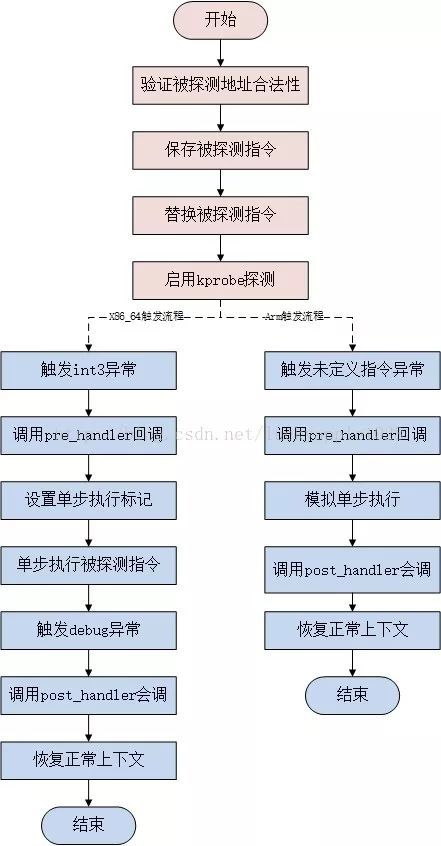

Linux kprobes 调试技术是内核开发者们专门为了便于跟踪内核函数执行状态所设计的一种轻量级内核调试技术。

利用 kprobes 技术，内核开发人员可以在内核的绝大多数指定函数中动态的插入探测点来收集所需的调试状态信息而基本不影响内核原有的执行流程。

kprobes 技术目前提供了 3 种探测手段：kprobe、jprobe 和 kretprobe，其中 jprobe 和 kretprobe 是基于 kprobe 实现的，他们分别应用于不同的探测场景中。


# kprobes技术背景

开发人员在内核或者模块的调试过程中，往往会需要要知道其中的一些函数有无被调用、何时被调用、执行是否正确以及函数的入参和返回值是什么等等。

比较简单的做法是在内核代码对应的函数中添加日志打印信息，但这种方式往往需要重新编译内核或模块，重新启动设备之类的，操作较为复杂甚至可能会破坏原有的代码执行过程。

而利用 kprobes 技术，用户可以定义自己的回调函数，然后在内核或者模块中几乎所有的函数中（有些函数是不可探测的，例如 kprobes 自身的相关实现函数）动态的插入探测点，当内核执行流程执行到指定的探测函数时，会调用该回调函数，用户即可收集所需的信息了，同时内核最后还会回到原本的正常执行流程。

如果用户已经收集足够的信息，不再需要继续探测，则同样可以动态的移除探测点。

因此 kprobes 技术具有对内核执行流程影响小和操作方便的优点。

kprobes 技术包括的 3 种探测手段分别是 kprobe、jprobe 和 kretprobe。

首先 kprobe 是最基本的探测方式，是实现后两种的基础，它可以在任意的位置放置探测点（就连函数内部的某条指令处也可以），它提供了探测点的调用前、调用后和内存访问出错 3 种回调方式，分别是 pre_handler、post_handler 和 fault_handler。

其中 pre_handler 函数将在被探测指令被执行前回调，post_handler 会在被探测指令执行完毕后回调（注意不是被探测函数），fault_handler 会在内存访问出错时被调用。

jprobe 基于 kprobe 实现，它用于获取被探测函数的入参值；最后 kretprobe 从名字种就可以看出其用途了，它同样基于 kprobe 实现，用于获取被探测函数的返回值。

kprobes 的技术原理并不仅仅包含存软件的实现方案，它也需要硬件架构提供支持。其中涉及硬件架构相关的是 CPU 的异常处理和单步调试技术，前者用于让程序的执行流程陷入到用户注册的回调函数中去，而后者则用于单步执行被探测点指令，因此并不是所有的架构均支持，目前 kprobes 技术已经支持多种架构，包括i386、x86_64、ppc64、ia64、sparc64、arm、ppc 和 mips（有些架构实现可能并不完全，具体可参考内核的 Documentation/kprobes.txt）。

kprobes 的特点与使用限制：

1、kprobes 允许在同一个被被探测位置注册多个 kprobe，但是目前 jprobe 却不可以；同时也不允许以其他的 jprobe 回调函数和 kprobe 的 post_handler 回调函数作为被探测点。

2、一般情况下，可以探测内核中的任何函数，包括中断处理函数。不过在 kernel/kprobes.c 和 arch/*/kernel/kprobes.c 程序中用于实现 kprobes 自身的函数是不允许被探测的，另外还有 do_page_fault 和 notifier_call_chain；

3、如果以一个内联函数为探测点，则 kprobes 可能无法保证对该函数的所有实例都注册探测点。由于 gcc 可能会自动将某些函数优化为内联函数，因此可能无法达到用户预期的探测效果；

4、一个探测点的回调函数可能会修改被探测函数运行的上下文，例如通过修改内核的数据结构或者保存与 struct pt_regs 结构体中的触发探测之前寄存器信息。因此 kprobes 可以被用来安装 bug 修复代码或者注入故障测试代码；

5、kprobes 会避免在处理探测点函数时再次调用另一个探测点的回调函数，例如在 printk() 函数上注册了探测点，则在它的回调函数中可能再次调用 printk 函数，此时将不再触发 printk 探测点的回调，仅仅时增加了 kprobe 结构体中 nmissed 字段的数值；

6、在 kprobes 的注册和注销过程中不会使用 mutex 锁和动态的申请内存；

7、kprobes 回调函数的运行期间是关闭内核抢占的，同时也可能在关闭中断的情况下执行，具体要视 CPU 架构而定。因此不论在何种情况下，在回调函数中不要调用会放弃 CPU 的函数（如信号量、mutex 锁等）；

8、kretprobe 通过替换返回地址为预定义的 trampoline 的地址来实现，因此栈回溯和 gcc 内嵌函数 __builtin_return_address() 调用将返回 trampoline 的地址而不是真正的被探测函数的返回地址；

9、如果一个函数的调用此处和返回次数不相等，则在类似这样的函数上注册 kretprobe 将可能不会达到预期的效果，例如 do_exit() 函数会存在问题，而 do_execve() 函数和 do_fork() 函数不会；

10、如果当在进入和退出一个函数时，CPU 运行在非当前任务所有的栈上，那么往该函数上注册 kretprobe 可能会导致不可预料的后果，因此，kprobes 不支持在X86_64 的结构下为 __switch_to() 函数注册 kretprobe，将直接返回 -EINVAL。


# kprobe原理

下面来介绍一下 kprobe 是如何工作的。具体流程见下图：

 

1、当用户注册一个探测点后，kprobe 首先备份被探测点的对应指令，然后将原始指令的入口点替换为断点指令，该指令是 CPU 架构相关的，如 i386 和 x86_64 是 int3，arm 是设置一个未定义指令（目前的 x86_64 架构支持一种跳转优化方案 Jump Optimization，内核需开启 CONFIG_OPTPROBES 选项，该种方案使用跳转指令来代替断点指令）；

2、当 CPU 流程执行到探测点的断点指令时，就触发了一个 trap，在 trap 处理流程中会保存当前 CPU 的寄存器信息并调用对应的 trap 处理函数，该处理函数会设置 kprobe 的调用状态并调用用户注册的 pre_handler 回调函数，kprobe 会向该函数传递注册的 struct kprobe 结构地址以及保存的 CPU 寄存器信息；

3、随后 kprobe 单步执行前面所拷贝的被探测指令，具体执行方式各个架构不尽相同，arm 会在异常处理流程中使用模拟函数执行，而 x86_64 架构则会设置单步调试 flag 并回到异常触发前的流程中执行；

4、在单步执行完成后，kprobe 执行用户注册的 post_handler 回调函数；

5、最后，执行流程回到被探测指令之后的正常流程继续执行。


# kprobe使用实例

## kprobe结构体

```c
struct kprobe {
    /* 被用于 kprobe 全局 hash，索引值为被探测点的地址 */
	struct hlist_node hlist;

	/* 用于链接同一被探测点的不同探测 kprobe */
	struct list_head list;

	/*count the number of times this probe was temporarily disarmed */
	unsigned long nmissed;

	/* 被探测点的地址 */
	kprobe_opcode_t *addr;

	/* 被探测函数的名字 */
	const char *symbol_name;

    /* 被探测点在函数内部的偏移，用于探测函数内部的指令，如果该值为 0 表示函数的入口 */
	unsigned int offset;		

	/* 在被探测点指令执行之前调用的回调函数. */
	kprobe_pre_handler_t pre_handler;

	/* 在被探测指令执行之后调用的回调函数 */
	kprobe_post_handler_t post_handler;

	/*
	 * ... called if executing addr causes a fault (eg. page fault).
	 * Return 1 if it handled fault, otherwise kernel will see it.
	 * 在执行pre_handler、post_handler或单步执行被探测指令时出现内存异常则会调用该回调函数
	 */
	kprobe_fault_handler_t fault_handler;	

	/*
	 * ... called if breakpoint trap occurs in probe handler.
	 * Return 1 if it handled break, otherwise kernel will see it.
	 * 在执行某一 kprobe 过程中触发了断点指令后会调用该函数，用于实现 jprobe
	 */
	kprobe_break_handler_t break_handler;

	/* 保存的被探测点原始指令 */
	kprobe_opcode_t opcode;

    /* 被复制的被探测点的原始指令，用于单步执行，架构强相关（可能包含指令模拟函数）*/
	struct arch_specific_insn ainsn;

	/*
	 * Indicates various status flags.
	 * Protected by kprobe_mutex after this kprobe is registered.
	 */
	u32 flags;
};
```


## 调用栈打印

我们先来看一个最简单的探测实例，探测 do_mount 函数被调用的情况：

```c
#include <linux/init.h>
#include <linux/module.h>
#include <linux/kernel.h>
#include <linux/kprobes.h>

/* 在被探测指令执行前，将调用预处理例程 pre_handler，用户需要定义该例程的操作 */
static int handler_pre(struct kprobe *p, struct pt_regs *regs)
{
    /* 在这里可以调用内核接口函数 dump_stack 打印出栈的内容 */
    dump_stack();
    
    printk(KERN_INFO "pre_handler: p->addr = 0x%p, ip = %lx, flags = 0x%lx\n", 
           p->addr, regs->ip, regs->flags);
    
    return 0;
}

/* 在被探测指令执行后，kprobe 调用后处理例程 post_handler */
static void handler_post(struct kprobe *p, struct pt_regs *regs, unsigned long flags)
{
    printk(KERN_INFO "post_handler: p->addr = 0x%p, flags = 0x%lx\n",
           p->addr, regs->flags);
    
    return;
}

static int handler_fault(struct kprobe *p, struct pt_regs *regs, int trapnr)
{
    printk(KERN_INFO "fault_handler: p->addr = 0x%p, trap #%dn", 
           p->addr, trapnr);
    
    return 0;
}

/* 对于每个探测，用户需要分配一个 kprobe 对象 */
static struct kprobe kp = {
    .symbol_name	= "do_mount",
    .pre_handler = handler_pre,
    .post_handler = handler_post,
    .fault_handler = handler_fault,
};

static int __init kprobe_init(void)
{
    int ret;
    printk("kprobe init\n");

    /*注册 kprobe*/
    ret = register_kprobe(&kp);
    if (ret < 0) {
        printk("register_kprobe failed");
        return ret;
    }
    
    return 0;
}

static void __exit kprobe_exit(void)
{
    unregister_kprobe(&kp);
    printk(KERN_ALERT "kprobe exit\n");
}

module_init(kprobe_init);
module_exit(kprobe_exit);

MODULE_LICENSE("GPL");
MODULE_AUTHOR("luxiaodai");
MODULE_DESCRIPTION("kprobe debug");
```

```makefile
ifneq ($(KERNELRELEASE),)
        obj-m += kprobe.o
else
KERNELDIR ?= /lib/modules/$(shell uname -r)/build
PWD := $(shell pwd)
default:
	$(MAKE) -C $(KERNELDIR) M=$(PWD) modules
endif
clean:
	rm -rf *.ko *.mod.c *.mod.o *.o *.order *.symvers
```

执行结果如下：

```bash
[root@centos kprobe]# insmod kprobe.ko 
[root@centos kprobe]# mount /dev/vda /mnt/a/
[root@centos kprobe]# umount /mnt/a/
[root@centos kprobe]# rmmod kprobe.ko

# 观察 dmesg 消息
[833122.880088] kprobe init

[833132.454323] CPU: 0 PID: 7330 Comm: mount Kdump: loaded Tainted: G           OE  ------------   3.10.0-957.el7.x86_64 #1
[833132.454340] Hardware name: RDO OpenStack Compute, BIOS 1.11.0-2.el7 04/01/2014
[833132.454347] Call Trace:
[833132.454406]  [<ffffffffa8161dc1>] dump_stack+0x19/0x1b
[833132.454411]  [<ffffffffc03e2067>] handler_pre+0x17/0x3f [kprobe]
[833132.454444]  [<ffffffffa816ee9a>] kprobe_ftrace_handler+0xba/0x120
[833132.454487]  [<ffffffffa7c65bb5>] ? do_mount+0x5/0xce0
[833132.454490]  [<ffffffffa7c65bb0>] ? copy_mount_string+0x30/0x30
[833132.454492]  [<ffffffffa7c66bd3>] ? SyS_mount+0x83/0xd0
[833132.454522]  [<ffffffffa7b5c0d4>] ftrace_ops_list_func+0xf4/0x120
[833132.454526]  [<ffffffffa81788a4>] ftrace_regs_call+0x5/0x81
[833132.454529]  [<ffffffffa7c65bb1>] ? do_mount+0x1/0xce0
[833132.454533]  [<ffffffffa7c65bb5>] ? do_mount+0x5/0xce0
[833132.454535]  [<ffffffffa7c66bd3>] ? SyS_mount+0x83/0xd0
[833132.454550]  [<ffffffffa8174ddb>] system_call_fastpath+0x22/0x27
[833132.454557] pre_handler: p->addr = 0xffffffffa7c65bb0, ip = ffffffffa7c65bb1, flags = 0x207
[833132.454563] post_handler: p->addr = 0xffffffffa7c65bb0, flags = 0x207
[833132.467531] XFS (vda): Mounting V5 Filesystem
[833132.710919] XFS (vda): Ending clean mount

[833155.931748] XFS (vda): Unmounting Filesystem

[833160.141625] kprobe exit
```

可以看出打印出了函数调用情况，可以看到被探测点的地址为 0xffffffffa7c65bb0，用以下命令确定这个地址就是 do_mount 的入口地址。

```bash
[root@centos kprobe]# cat /proc/kallsyms | grep do_mount
ffffffffa7c65bb0 T do_mount
```

但是 pre_handler 本身输出信息生涩难懂，那我们怎么去获取函数入参等信息呢？

在使用 kprobe 时最主要是需要明白 pt_regs 结构体中的各项。值得一提的是，kprobe 里面我们在 probe 某个函数获取函数参数的时候是和体系结构相关的。

例如：在 x86_64 平台上，根据 C ABI [ptrace](https://elixir.bootlin.com/linux/latest/source/arch/x86/include/asm/ptrace.h) 接口规范，函数的参数和 pt_regs 的对应关系是：

```c
struct pt_regs {
	unsigned long r15;
	unsigned long r14;
	unsigned long r13;
	unsigned long r12;
	unsigned long bp;
	unsigned long bx;
/* arguments: non interrupts/non tracing syscalls only save up to here*/
	unsigned long r11;
	unsigned long r10;
	unsigned long r9;
	unsigned long r8;
	unsigned long ax;
	unsigned long cx;		// mapped to arg[3]
	unsigned long dx;		// mapped to arg[2]
	unsigned long si;		// mapped to arg[1]
	unsigned long di;		// mapped to arg[0]
	unsigned long orig_ax;
/* end of arguments */
/* cpu exception frame or undefined */
	unsigned long ip;
	unsigned long cs;
	unsigned long flags;
	unsigned long sp;
	unsigned long ss;
/* top of stack page */
```

在 ARM64 平台上，根据 C ABI [ptrace](https://elixir.bootlin.com/linux/v4.19.69/source/arch/arm64/include/asm/ptrace.h) 规范， 函数的参数和 pt_regs 的对应关系是：入参 args[0] 对应了 regs[0]，入参 args[1] 对应 regs[1] 依此类推。

```c
/*
 * This struct defines the way the registers are stored on the stack during an
 * exception. Note that sizeof(struct pt_regs) has to be a multiple of 16 (for
 * stack alignment). struct user_pt_regs must form a prefix of struct pt_regs.
 */
struct pt_regs {
	union {
		struct user_pt_regs user_regs;
		struct {
			u64 regs[31];
			u64 sp;
			u64 pc;
			u64 pstate;
		};
	};
	u64 orig_x0;
	u64 syscallno;
};
```


## 函数入参打印

我们先找一个入参比较少的函数，这次我们尝试打印 do_add_mount 函数的入参：

```c
#include <linux/init.h>
#include <linux/module.h>
#include <linux/kernel.h>
#include <linux/kprobes.h>
#include <linux/path.h>
/* 
 * 有些头文件是在 fs 下定义的.
 * 为了方便我这里直接将内核代码 fs 目录拷贝到了 
 * /lib/modules/$(shell uname -r)/build/include 下
 */
#include <fs/mount.h>


/* 在被探测指令执行前，将调用预处理例程 pre_handler，用户需要定义该例程的操作 */
static int handler_pre(struct kprobe *p, struct pt_regs *regs)
{
#ifdef CONFIG_ARM64
    struct mount *newmnt = (struct mount *)regs->regs[0];
    struct path *path = (struct path *)regs->regs[1];
    int mnt_flags = (int)regs->regs[2];
#endif

#ifdef CONFIG_X86
    struct mount *newmnt = (struct mount *)regs->di;
    struct path *path = (struct path *)regs->si;
    int mnt_flags = (int)regs->dx;
#endif
    
    dump_stack();
    
    printk("mount %s %s\n", newmnt->mnt_devname, path->dentry->d_iname);
    printk("mnt_flags: %d\n", mnt_flags);
    
    return 0;
}

/* 在被探测指令执行后，kprobe 调用后处理例程 post_handler */
static void handler_post(struct kprobe *p, struct pt_regs *regs, unsigned long flags)
{
    dump_stack();
    pr_info("%s:%d called\n", __func__, __LINE__);
    
    return;
}

static int handler_fault(struct kprobe *p, struct pt_regs *regs, int trapnr)
{
    printk(KERN_INFO "fault_handler: p->addr = 0x%p, trap #%dn", 
           p->addr, trapnr);
    
    return 0;
}

/* 对于每个探测，用户需要分配一个 kprobe 对象 */
static struct kprobe kp = {
    .symbol_name	= "do_add_mount",
    .pre_handler = handler_pre,
    .post_handler = handler_post,
    .fault_handler = handler_fault,
};

static int __init kprobe_init(void)
{
    int ret;
    printk("kprobe init\n");

    /*注册 kprobe*/
    ret = register_kprobe(&kp);
    if (ret < 0) {
        printk("register_kprobe failed, return %d\n", ret);
        return ret;
    }
    
    printk(KERN_INFO "Planted kprobe at %p\n", kp.addr);

    return 0;
}

static void __exit kprobe_exit(void)
{
    unregister_kprobe(&kp);
    printk(KERN_ALERT "kprobe exit\n");
}

module_init(kprobe_init);
module_exit(kprobe_exit);

MODULE_LICENSE("GPL");
MODULE_AUTHOR("luxiaodai");
MODULE_DESCRIPTION("kprobe debug");
```

执行结果如下：

```bash
[root@centos kprobe]# insmod kprobe.ko 
[root@centos kprobe]# mount /dev/vda /mnt/a
[root@centos kprobe]# umount /mnt/a/
[root@centos kprobe]# rmmod kprobe.ko

# 观察 dmesg 消息，可以看到入参都被打印出来了
[848922.985939] kprobe init
[848922.999542] Planted kprobe at ffffffffa7c65870

[848930.424913] XFS (vda): Mounting V5 Filesystem
[848930.655571] XFS (vda): Ending clean mount
[848930.655783] CPU: 0 PID: 13403 Comm: mount Kdump: loaded Tainted: G           OE  ------------   3.10.0-957.el7.x86_64 #1
[848930.655789] Hardware name: RDO OpenStack Compute, BIOS 1.11.0-2.el7 04/01/2014
[848930.655796] Call Trace:
[848930.655854]  [<ffffffffa8161dc1>] dump_stack+0x19/0x1b
[848930.655865]  [<ffffffffc03e206f>] handler_pre+0x1f/0x56 [kprobe]
[848930.655892]  [<ffffffffa7c65871>] ? do_add_mount+0x1/0xe0
[848930.655904]  [<ffffffffa816ee9a>] kprobe_ftrace_handler+0xba/0x120
[848930.655910]  [<ffffffffa7c65875>] ? do_add_mount+0x5/0xe0
[848930.655916]  [<ffffffffa7c65870>] ? graft_tree+0x70/0x70
[848930.655921]  [<ffffffffa7c66119>] ? do_mount+0x569/0xce0
[848930.655948]  [<ffffffffa7b5c0d4>] ftrace_ops_list_func+0xf4/0x120
[848930.655955]  [<ffffffffa81788a4>] ftrace_regs_call+0x5/0x81
[848930.655975]  [<ffffffffa7c637da>] ? vfs_kern_mount+0xca/0x110
[848930.655980]  [<ffffffffa7c65871>] ? do_add_mount+0x1/0xe0
[848930.655986]  [<ffffffffa7c65875>] ? do_add_mount+0x5/0xe0
[848930.655991]  [<ffffffffa7c66119>] ? do_mount+0x569/0xce0
[848930.656003]  [<ffffffffa7c3e03a>] ? __check_object_size+0x1ca/0x250
[848930.656009]  [<ffffffffa7bd5eff>] ? memdup_user+0x4f/0x80
[848930.656013]  [<ffffffffa7c66bd3>] SyS_mount+0x83/0xd0
[848930.656030]  [<ffffffffa8174ddb>] system_call_fastpath+0x22/0x27
[848930.656034] mount /dev/vda a
[848930.656037] mnt_flags: 32

[848930.656042] CPU: 0 PID: 13403 Comm: mount Kdump: loaded Tainted: G           OE  ------------   3.10.0-957.el7.x86_64 #1
[848930.656044] Hardware name: RDO OpenStack Compute, BIOS 1.11.0-2.el7 04/01/2014
[848930.656046] Call Trace:
[848930.656052]  [<ffffffffa8161dc1>] dump_stack+0x19/0x1b
[848930.656056]  [<ffffffffc03e202e>] handler_post+0xe/0x30 [kprobe]
[848930.656061]  [<ffffffffa816eef8>] kprobe_ftrace_handler+0x118/0x120
[848930.656066]  [<ffffffffa7c65875>] ? do_add_mount+0x5/0xe0
[848930.656071]  [<ffffffffa7c65870>] ? graft_tree+0x70/0x70
[848930.656076]  [<ffffffffa7c66119>] ? do_mount+0x569/0xce0
[848930.656081]  [<ffffffffa7b5c0d4>] ftrace_ops_list_func+0xf4/0x120
[848930.656085]  [<ffffffffa81788a4>] ftrace_regs_call+0x5/0x81
[848930.656091]  [<ffffffffa7c637da>] ? vfs_kern_mount+0xca/0x110
[848930.656096]  [<ffffffffa7c65875>] ? do_add_mount+0x5/0xe0
[848930.656101]  [<ffffffffa7c65875>] ? do_add_mount+0x5/0xe0
[848930.656106]  [<ffffffffa7c66119>] ? do_mount+0x569/0xce0
[848930.656111]  [<ffffffffa7c3e03a>] ? __check_object_size+0x1ca/0x250
[848930.656115]  [<ffffffffa7bd5eff>] ? memdup_user+0x4f/0x80
[848930.656118]  [<ffffffffa7c66bd3>] SyS_mount+0x83/0xd0
[848930.656123]  [<ffffffffa8174ddb>] system_call_fastpath+0x22/0x27
[848930.656128] handler_post:37 called


[848940.778712] XFS (vda): Unmounting Filesystem

[848947.367288] kprobe exit
```


# jprobe

jprobe，它基于 kprobe 实现，不能在函数的任意位置插入探测点，只能在函数的入口处探测，一般用于监测函数的入参值。

我们把 samples/kprobes/jprobe_example.c 修改一下来监控 do_add_mount：

```c
#include <linux/init.h>
#include <linux/module.h>
#include <linux/kernel.h>
#include <linux/kprobes.h>
#include <linux/path.h>
#include <fs/mount.h>

/* 注意：这里需要和探测函数具有相同的入参 */
static long jdo_add_mount(struct mount *newmnt, struct path *path, int mnt_flags)
{
    printk("mount %s %s\n", newmnt->mnt_devname, path->dentry->d_iname);
    printk("mnt_flags: %d\n", mnt_flags);
    
    /* 
     * Always end with a call to jprobe_return(). 
     * 在回调函数执行完毕以后，必须调用 jprobe_return()
     */
    jprobe_return();
    return 0;
}

static struct jprobe my_jprobe = {
    .entry			= jdo_add_mount,
    .kp = {
        .symbol_name	= "do_add_mount",
    },
};

static int __init jprobe_init(void)
{
    int ret;
    
    ret = register_jprobe(&my_jprobe);
    if (ret < 0) {
        printk(KERN_INFO "register_jprobe failed, returned %d\n", ret);
        return -1;
    }
    printk(KERN_INFO "Planted jprobe at %p, handler addr %p\n", 
           my_jprobe.kp.addr, my_jprobe.entry);
    
    return 0;
}

static void __exit jprobe_exit(void)
{
    unregister_jprobe(&my_jprobe);
    printk(KERN_INFO "jprobe at %p unregistered\n", my_jprobe.kp.addr);
}

module_init(jprobe_init)
module_exit(jprobe_exit)
MODULE_LICENSE("GPL");
MODULE_AUTHOR("luxiaodai");
MODULE_DESCRIPTION("jprobe debug");
```

执行结果如下：

```bash
[root@centos jprobe]# insmod jprobe.ko 
[root@centos jprobe]# mount /dev/vda /mnt/a/
[root@centos jprobe]# umount /mnt/a/
[root@centos jprobe]# rmmod jprobe.ko

# 观察 dmesg
[853356.069600] Planted jprobe at ffffffffa7c65870, handler addr ffffffffc03e2000

[853365.488670] XFS (vda): Mounting V5 Filesystem
[853365.752062] XFS (vda): Ending clean mount
[853365.752241] mount /dev/vda a
[853365.752245] mnt_flags: 32

[853370.584663] XFS (vda): Unmounting Filesystem

[853375.256702] jprobe at ffffffffa7c65870 unregistered
```


# kretprobe

kretprobe 它同样基于 kprobe 实现，可用于探测函数的返回值以及计算函数执行的耗时。

当然内核也提供了一个简单的示例程序 kretprobe_example.c，该程序的实现更为通用，用户可以在使用时直接通过模块参数指定需要探测的函数，它在探测函数返回值的同时还统计了被探测函数的执行用时。

```c
#include <linux/init.h>
#include <linux/module.h>
#include <linux/kernel.h>
#include <linux/kprobes.h>
#include <linux/ktime.h>
#include <linux/limits.h>
#include <linux/sched.h>
#include <linux/path.h>
#include <fs/mount.h>

static char func_name[NAME_MAX] = "do_add_mount";
module_param_string(func, func_name, NAME_MAX, S_IRUGO);
MODULE_PARM_DESC(func, "Function to kretprobe; this module will report the"
                 " function's execution time");

/* per-instance private data */
struct my_data {
    ktime_t entry_stamp;
};

/* Here we use the entry_hanlder to timestamp function entry */
static int entry_handler(struct kretprobe_instance *ri, struct pt_regs *regs)
{
    struct my_data *data;
    
    if (!current->mm)
        return 1;	/* Skip kernel threads */
    
    data = (struct my_data *)ri->data;
    data->entry_stamp = ktime_get();
    return 0;
}

/*
 * Return-probe handler: Log the return value and duration. Duration may turn
 * out to be zero consistently, depending upon the granularity of time
 * accounting on the platform.
 */
static int ret_handler(struct kretprobe_instance *ri, struct pt_regs *regs)
{
    int retval = regs_return_value(regs);
    struct my_data *data = (struct my_data *)ri->data;
    s64 delta;
    ktime_t now;
    
    now = ktime_get();
    delta = ktime_to_ns(ktime_sub(now, data->entry_stamp));
    printk(KERN_INFO "%s returned %d and took %lld ns to execute\n", 
           func_name, retval, (long long)delta);
    
    return 0;
}

static struct kretprobe my_kretprobe = {
    /* 被探测函数返回后被调用，一般在这个函数中打印被探测函数的返回值 */
    .handler		= ret_handler,
    /* 被探测函数执行之前被调用 */
    .entry_handler		= entry_handler,
    /* kretprobe 私有数据的大小 */
    .data_size		= sizeof(struct my_data),
    /*
     * 同时支持并行探测的上限，
     * 因为 kretprobe 会跟踪一个函数从开始到结束，因此对于一些调用比较频繁的被探测函数，
     * 在探测的时间段内重入的概率比较高，
     * 这个 maxactive 字段值表示在重入情况发生时，支持同时检测的进程数（执行流数）的上限，
     * 若并行触发的数量超过了这个上限，
     * 则 kretprobe 不会进行跟踪探测，仅仅增加 nmissed 字段的值以作提示
     */
    .maxactive		= 20,
};

static int __init kretprobe_init(void)
{
    int ret;
    
    my_kretprobe.kp.symbol_name = func_name;
    ret = register_kretprobe(&my_kretprobe);
    if (ret < 0) {
        printk(KERN_INFO "register_kretprobe failed, returned %d\n", ret);
        return -1;
    }
    printk(KERN_INFO "Planted return probe at %s: %p\n",
           my_kretprobe.kp.symbol_name, my_kretprobe.kp.addr);
    
    return 0;
}

static void __exit kretprobe_exit(void)
{
    unregister_kretprobe(&my_kretprobe);
    printk(KERN_INFO "kretprobe at %p unregistered\n", my_kretprobe.kp.addr);
    
    /* nmissed > 0 suggests that maxactive was set too low. */
    printk(KERN_INFO "Missed probing %d instances of %s\n", 
           my_kretprobe.nmissed, my_kretprobe.kp.symbol_name);
}

module_init(kretprobe_init)
module_exit(kretprobe_exit)
MODULE_LICENSE("GPL");
MODULE_AUTHOR("luxiaodai");
MODULE_DESCRIPTION("kretprobe debug");
```

执行结果如下：

```bash
[root@centos kretprobe]# insmod kretprobe.ko 
[root@centos kretprobe]# mount /dev/vda /mnt/a/
[root@centos kretprobe]# umount /mnt/a/
[root@centos kretprobe]# rmmod kretprobe.ko
[root@centos kretprobe]# tail /var/log/messages
...
Dec  9 15:50:25 centos kernel: Planted return probe at do_add_mount: ffffffffa7c65870
Dec  9 15:50:31 centos kernel: XFS (vda): Mounting V5 Filesystem
Dec  9 15:50:32 centos kernel: XFS (vda): Ending clean mount
Dec  9 15:50:32 centos kernel: do_add_mount returned 0 and took 161643 ns to execute
Dec  9 15:50:36 centos kernel: XFS (vda): Unmounting Filesystem
Dec  9 15:50:41 centos kernel: kretprobe at ffffffffa7c65870 unregistered
Dec  9 15:50:41 centos kernel: Missed probing 0 instances of do_add_mount
```


# 参考与感谢

-   [Linux内核调试技术——kprobe使用与实现（一）](https://cloud.tencent.com/developer/article/1463419)
-   [kprobe kretprobe example](https://kernelgo.org/kprobe.html)
-   https://www.kernel.org/doc/Documentation/kprobes.txt
-   https://elixir.bootlin.com/linux/v3.10/source/arch/x86/include/asm/ptrace.h

