# 缓存概述

 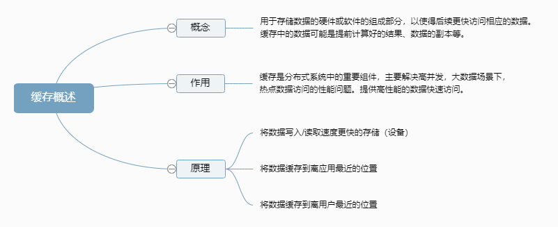

 

# 缓存的分类

 缓存主要分为四类，如下图：

 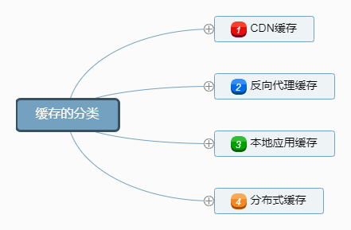

 

## CDN 缓存

CDN (Content Delivery Network 内容分发网络)的基本原理是广泛采用各种缓存服务器，将这些缓存服务器分布到用户访问相对集中的地区或网络中。

在用户访问网站时，利用全局负载技术将用户的访问指向距离最近的工作正常的缓存服务器上，由缓存服务器直接响应用户请求。

**应用场景**：主要缓存静态资源，例如图片，视频。

CDN 缓存应用如下图：

 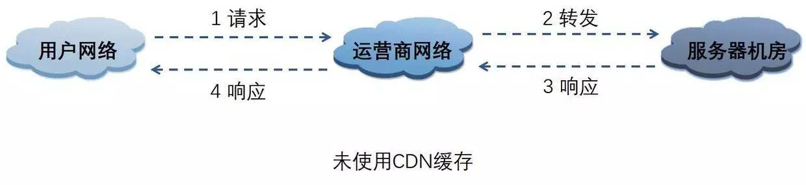

 

 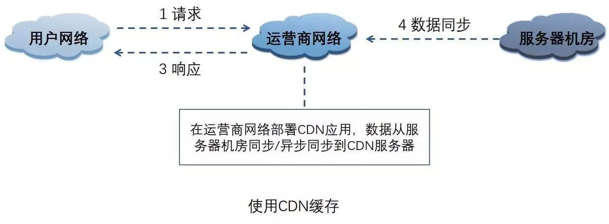

CDN 缓存优点如下图：

 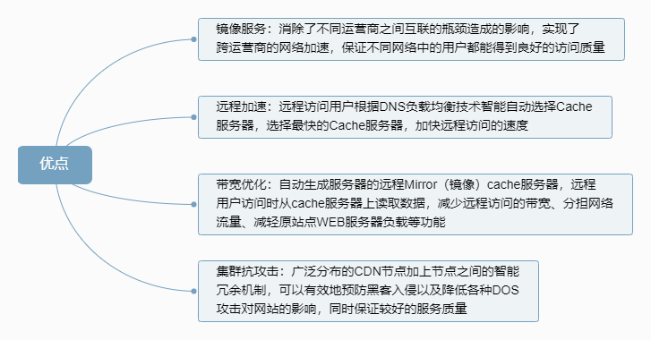

 

## 反向代理缓存

反向代理位于应用服务器机房，处理所有对 Web 服务器的请求。

如果用户请求的页面在代理服务器上有缓冲的话，代理服务器直接将缓冲内容发送给用户。

如果没有缓冲则先向 Web 服务器发出请求，取回数据，本地缓存后再发送给用户。通过降低向 Web 服务器的请求数，从而降低了 Web 服务器的负载。

**应用场景**：一般只缓存体积较小静态文件资源，如 css、js、图片。

 

反向代理缓存应用如下图：

 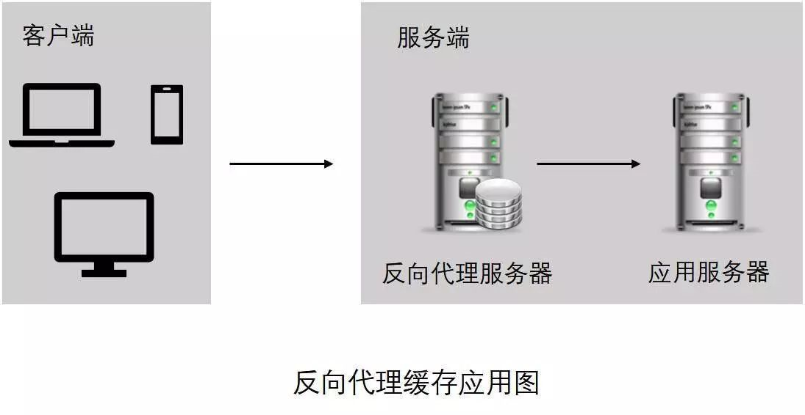

开源实现如下图：

 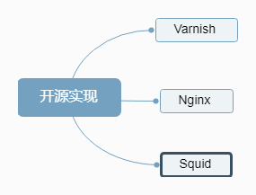

 

## 本地应用缓存

指的是在应用中的缓存组件，其最大的优点是应用和 Cache 是在同一个进程内部，请求缓存非常快速，没有过多的网络开销等。

在单应用不需要集群支持或者集群情况下各节点无需互相通知的场景下使用本地缓存较合适。

同时，它的缺点也是应为缓存跟应用程序耦合，多个应用程序无法直接的共享缓存，各应用或集群的各节点都需要维护自己的单独缓存，对内存是一种浪费。

 

**应用场景**：缓存字典等常用数据。

缓存介质如下图所示：

 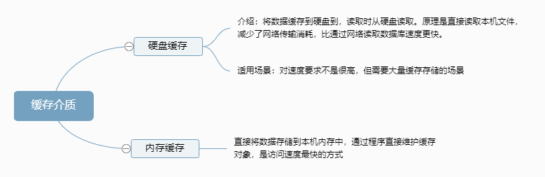

编程直接实现如下图：

 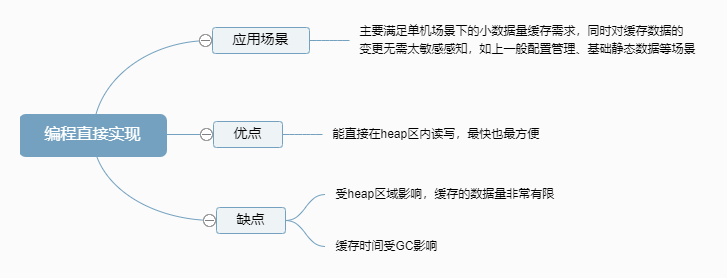

 

## 分布式缓存

指的是与应用分离的缓存组件或服务，其最大的优点是自身就是一个独立的应用，与本地应用隔离，多个应用可直接的共享缓存。

分布式缓存的主要应用场景如下图：

 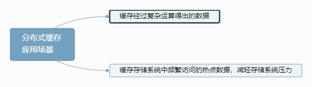

分布式缓存的主要接入方式如下图：

 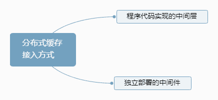

下面介绍分布式缓存常见的 2 大开源实现 Memcached 和 Redis。

 

### Memcached

Memcached 是一个高性能，分布式内存对象缓存系统，通过在内存里维护一个统一的巨大的 Hash 表，它能够用来存储各种格式的数据，包括图像、视频、文件以及数据库检索的结果等。

简单的说就是将数据调用到内存中，然后从内存中读取，从而大大提高读取速度。

Memcached 的特点如下图：

 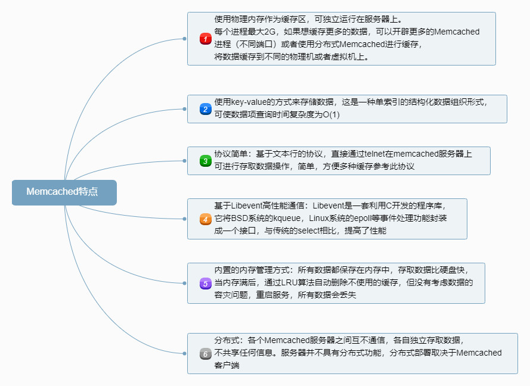

Memcached 的基本架构如下图：

 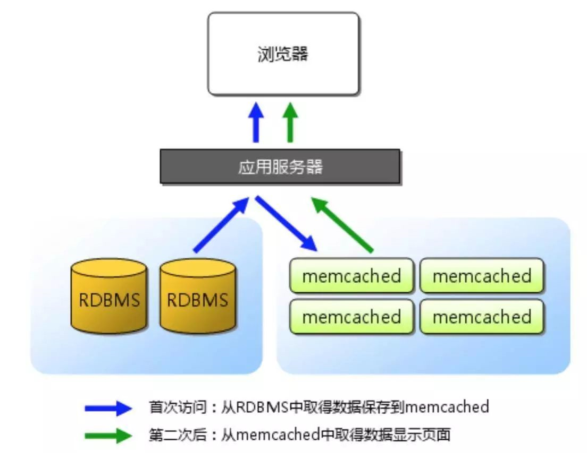

 

**缓存数据过期策略**：LRU（最近最少使用）到期失效策略，在 Memcached 内存储数据项时，可以指定它在缓存的失效时间，默认为永久。

当 Memcached 服务器用完分配的内存时，失效的数据被首先替换，然后是最近未使用的数据。

 

**数据淘汰内部实现**：懒淘汰机制为每次往缓存放入数据的时候，都会存一个时间，在读取的时候要和设置的时间做 TTL 比较来判断是否过期。

 

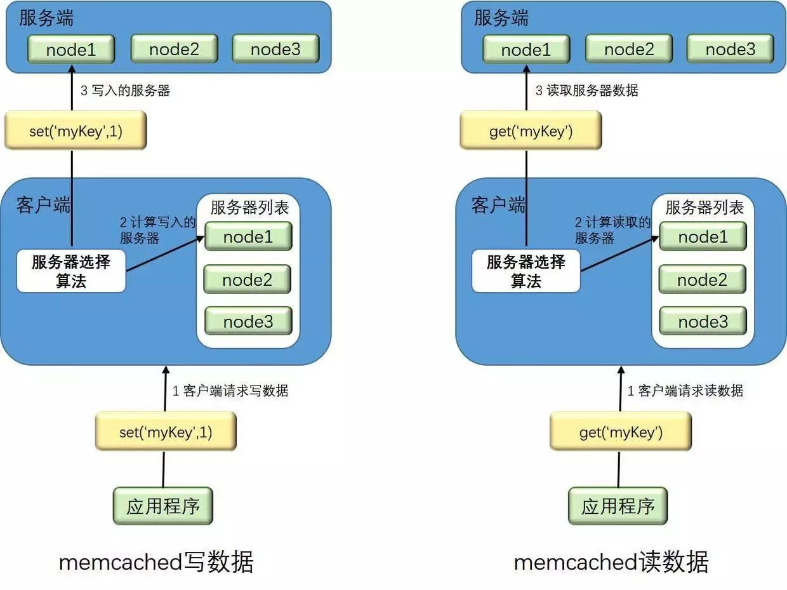

**分布式集群实现**：服务端并没有 “ 分布式 ” 功能。每个服务器都是完全独立和隔离的服务。 Memcached 的分布式，是由客户端程序实现的。

 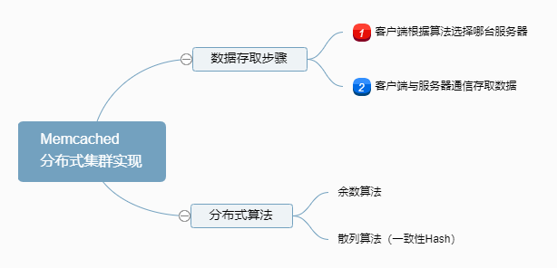

 

### Redis

Redis 是一个远程内存数据库（非关系型数据库），性能强劲，具有复制特性以及解决问题而生的独一无二的数据模型。

它可以存储键值对与 5 种不同类型的值之间的映射，可以将存储在内存的键值对数据持久化到硬盘，可以使用复制特性来扩展读性能。

 Redis 还可以使用客户端分片来扩展写性能，内置了 复制（replication），LUA 脚本（Lua scripting），LRU 驱动事件（LRU eviction），事务（transactions） 和不同级别的磁盘持久化（persistence）。并通过 Redis 哨兵（Sentinel）和自动分区（Cluster）提供高可用性（High Availability）。

Redis 的数据模型如下图：

 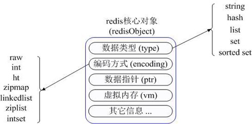

 

Redis 的数据淘汰策略如下图：

 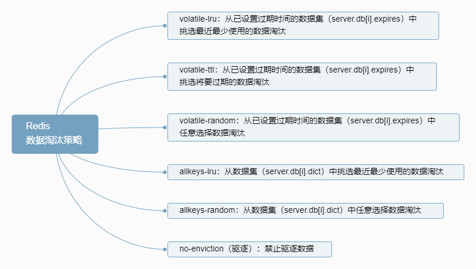

 

Redis 的数据淘汰内部实现如下图：

 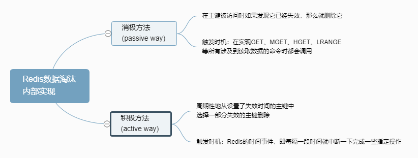

 

Redis 的持久化方式如下图：

 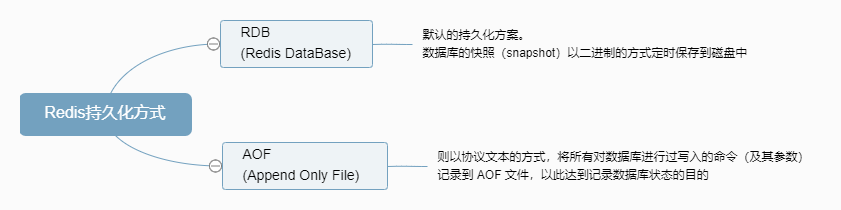

Redis 的缓存设计原则如下图所示：

 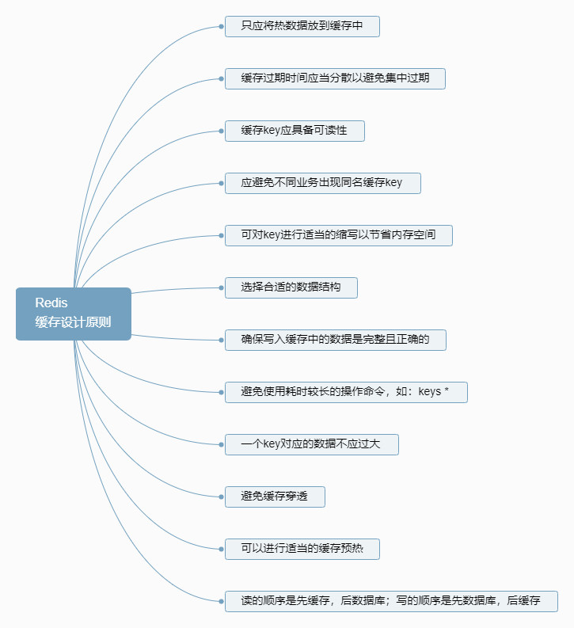

 

### Redis 与 Memcached 的比较

 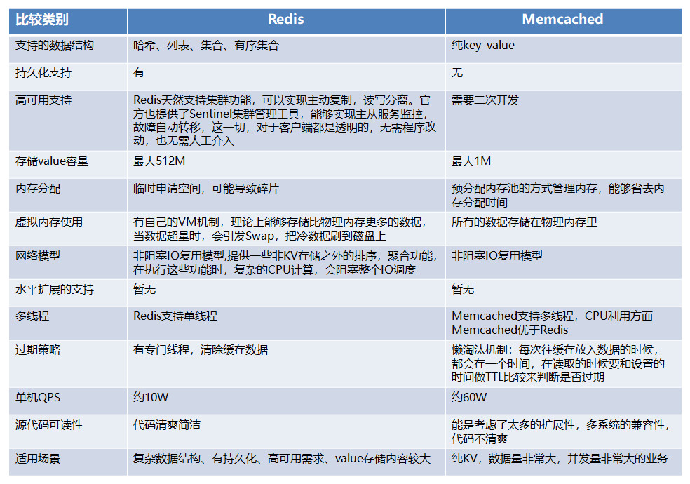

 

# 分层缓存架构设计

 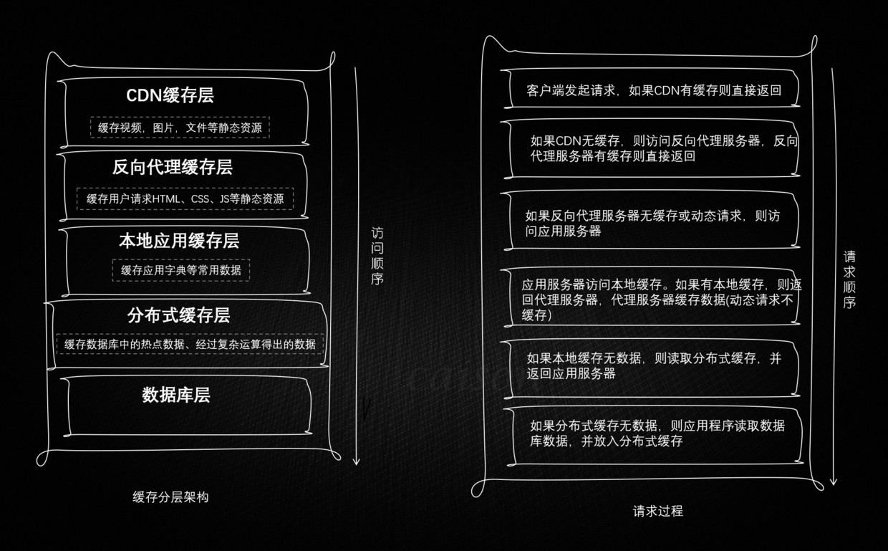

 

# 缓存带来的复杂度问题

常见的问题主要包括如下几点：

-   数据一致性
-   缓存异常
-   缓存热Key
-   缓存高可用

下面逐一介绍分析这些问题以及相应的解决方案。

## 数据一致性

因为缓存属于持久化数据的一个副本，因此不可避免的会出现数据不一致问题。

首先从理论上来说，给缓存设置过期时间，是保证最终一致性的解决方案。这种方案下，我们可以对存入缓存的数据设置过期时间，所有的写操作以数据库为准，对缓存操作只是尽最大努力即可。也就是说如果数据库写成功，缓存更新失败，那么只要到达过期时间，则后面的读请求自然会从数据库中读取新值然后回填缓存。因此，接下来讨论的思路不依赖于给缓存设置过期时间这个方案。

依据 更新缓存 VS 淘汰缓存 or 先操作数据库 VS 先操作缓存，更新策略可以分为以下四种：

1.  先写缓存，后写数据库
2.  先写数据库，后写缓存
3.  先删除缓存，后写数据库
4.  先写数据库，后删除缓存

### 更新缓存 VS 淘汰缓存

我们先忽略操作失败的情况，因为第二步操作一旦失败，数据一定是不一致的，这个问题后面再解决。

首先我们从并发的角度来看待这个问题，假设我们采用方案二，并发场景如下，同时有请求A和请求B进行更新操作，那么会出现：

1.  线程 A 更新数据库（X = 1）
2.  线程 B 更新数据库（X = 2）
3.  线程 B 更新缓存（X = 2）
4.  线程 A 更新缓存（X = 1）

最终 X 的值在缓存中是 1，在数据库中是 2，发生不一致。

也就是说，请求 A 更新缓存应该比请求 B 更新缓存早才对，但是因为网络等原因，B 却比 A 更早更新了缓存。这就导致了数据不一致，并且如果后续无写操作，这个不一致将会一直延续下去，方案一同理。

除此之外，还考虑如下两点因素：

（1）如果你是一个写数据库场景比较多，而读数据场景比较少的业务需求，采用这种方案就会导致，数据压根还没读到，缓存就被频繁的更新，浪费性能。

（2）如果你写入数据库的值，并不是直接写入缓存的，而是要经过一系列复杂的计算再写入缓存。那么，每次写入数据库后，都再次计算写入缓存的值，无疑是浪费性能的。

所以此时我们需要考虑另外一种方案：**删除缓存**，那么删除缓存可以保持一致性吗？我们继续讨论

>   这里不是说不可以使用更新缓存的策略，比如你就是单线程处理，而且缓存更新代价很小，那么使用这种方法是很方便的，相比淘汰缓存可以减少一次 cache miss，但是需要注意的是，如果先更新缓存，如果数据库因为一些原因没有更新成功，此时发生故障那么数据将永远丢失，所以方案一也是不推荐的

### 先更新数据库 VS 先淘汰缓存

**1) 先删除缓存，后更新数据库**

如果有 2 个线程要并发「读写」数据，可能会发生以下场景：

1.  线程 A 要更新 X = 2（原值 X = 1）
2.  线程 A 先删除缓存
3.  线程 B 读缓存，发现不存在，从数据库中读取到旧值（X = 1）
4.  线程 B 将旧值写入缓存（X = 1）
5.  线程 A 将新值写入数据库（X = 2）

最终 X 的值在缓存中是 1（旧值），在数据库中是 2（新值），发生不一致，如果后续无写操作，缓存中的数据将永远是脏数据。

可见，先删除缓存，后更新数据库，当发生「读+写」并发时，还是存在数据不一致的情况。那么，**如何解决呢？采用延时双删策略**

延时双删即在方案三的基础上，增加一步：

>   1.  先删除缓存
>   2.  再更新数据库
>   3.  休眠一会（比如1秒），再次删除缓存。

这么做，只有休眠那一会（比如就那1秒），可能有脏数据，一般业务也会接受的。

**那么，这个1秒怎么确定的，具体该休眠多久呢？**

>   这个休眠时间 = 读业务逻辑数据的耗时 + 几百毫秒。为了确保读请求结束，写请求可以删除读请求可能带来的缓存脏数据。

**采用这种同步淘汰策略，吞吐量降低怎么办？**

>   ok，那就将第二次删除作为异步的。自己起一个线程，异步删除。这样，写的请求就不用沉睡一段时间后了，再返回。这么做，加大吞吐量。

但是如果**第二次删除缓存失败**呢？缓存和数据库的数据还是可能不一致，对吧，这里我们看完方案四再讨论

**2) 先更新数据库，后删除缓存**

依旧是 2 个线程并发「读写」数据：

1.  缓存中 X 不存在（数据库 X = 1）
2.  线程 A 读取数据库，得到旧值（X = 1）
3.  线程 B 更新数据库（X = 2)
4.  线程 B 删除缓存
5.  线程 A 将旧值写入缓存（X = 1）

最终 X 的值在缓存中是 1（旧值），在数据库中是 2（新值），也发生不一致。

但是这种情况「理论」来说是发生概率很低，因为这有个前提条件就是 **更新数据库 + 删除缓存的时间（步骤 3-4），要比读数据库 + 写缓存时间短（步骤 2 和 5）**

仔细想一下，条件 3 发生的概率其实是非常低的。因为写数据库一般会先「加锁」，所以写数据库，通常是要比读数据库的时间更长的。

这么来看，「先更新数据库 + 再删除缓存」的方案，是可以保证数据一致性的。

好，解决了并发问题，我们继续来看前面遗留的，**第二步执行「失败」导致数据不一致的问题**。

想一下，程序在执行过程中发生异常，最简单的解决办法是什么？

答案是：**重试**。

是的，其实这里我们也可以这样做。

无论是先操作缓存，还是先操作数据库，但凡后者执行失败了，我们就可以发起重试，尽可能地去做「补偿」。

那这是不是意味着，只要执行失败，我们「无脑重试」就可以了呢？

答案是否定的。现实情况往往没有想的这么简单，失败后立即重试的问题在于：

-   立即重试很大概率「还会失败」
-   「重试次数」设置多少才合理？
-   重试会一直「占用」这个线程资源，无法服务其它客户端请求

看到了么，虽然我们想通过重试的方式解决问题，但这种「同步」重试的方案依旧不严谨。

那更好的方案应该怎么做？

答案是：**异步重试**。什么是异步重试？

其实就是把重试请求写到「消息队列」中，然后由专门的消费者来重试，直到成功。

或者更直接的做法，为了避免第二步执行失败，我们可以把操作缓存这一步，直接放到消息队列中，由消费者来操作缓存。

 

重试删除缓存机制可以解决问题，但是会造成好多**业务代码入侵**。其实，还可以这样优化：通过数据库的 Binlog 来异步淘汰 key。

以 mysql 为例：

-   可以使用阿里的 canal 将 binlog 日志采集发送到 MQ 队列里面
-   然后通过 ACK 机制确认处理这条更新消息，删除缓存，保证数据缓存一致性

 

### 主从库延迟和延迟双删的问题

到这里，还有 2 个问题，是我们没有重点分析过的。

**第一个问题**，还记得前面讲到的「先删除缓存，再更新数据库」方案，导致不一致的场景么？

这里我再把例子拿过来让你复习一下：

2 个线程要并发「读写」数据，可能会发生以下场景：

1.  线程 A 要更新 X = 2（原值 X = 1）
2.  线程 A 先删除缓存
3.  线程 B 读缓存，发现不存在，从数据库中读取到旧值（X = 1）
4.  线程 A 将新值写入数据库（X = 2）
5.  线程 B 将旧值写入缓存（X = 1）

最终 X 的值在缓存中是 1（旧值），在数据库中是 2（新值），发生不一致。

**第二个问题**：是关于「读写分离 + 主从复制延迟」情况下，缓存和数据库一致性的问题。

在「先更新数据库，再删除缓存」方案下，「读写分离 + 主从库延迟」其实也会导致不一致：

1.  线程 A 更新主库 X = 2（原值 X = 1）
2.  线程 A 删除缓存
3.  线程 B 查询缓存，没有命中，查询「从库」得到旧值（从库 X = 1）
4.  从库「同步」完成（主从库 X = 2）
5.  线程 B 将「旧值」写入缓存（X = 1）

最终 X 的值在缓存中是 1（旧值），在主从库中是 2（新值），也发生不一致。

看到了么？这 2 个问题的核心在于：**缓存都被回种了「旧值」**。

那怎么解决这类问题呢？

最有效的办法就是，**把缓存删掉**。

但是，不能立即删，而是需要「延迟删」，这就是业界给出的方案：**缓存延迟双删策略**。

按照延时双删策略，这 2 个问题的解决方案是这样的：

**解决第一个问题**：在线程 A 删除缓存、更新完数据库之后，先「休眠一会」，再「删除」一次缓存。这里上面已经讨论过了

**解决第二个问题**：线程 A 可以生成一条「延时消息」，写到消息队列中，消费者延时「删除」缓存。

这两个方案的目的，都是为了把缓存清掉，这样一来，下次就可以从数据库读取到最新值，写入缓存。

但问题来了，这个「延迟删除」缓存，延迟时间到底设置要多久呢？

-   问题1：延迟时间要大于「主从复制」的延迟时间
-   问题2：延迟时间要大于线程 B 读取数据库 + 写入缓存的时间

但是，这个时间在分布式和高并发场景下，其实是很难评估的。

很多时候，我们都是凭借经验大致估算这个延迟时间，例如延迟 1-5s，只能尽可能地降低不一致的概率。

所以你看，采用这种方案，也只是尽可能保证一致性而已，极端情况下，还是有可能发生不一致。

所以实际使用中，我还是建议你采用「先更新数据库，再删除缓存」的方案，同时，要尽可能地保证「主从复制」不要有太大延迟，降低出问题的概率。

### 可以做到强一致吗？

看到这里你可能会想，这些方案还是不够完美，我就想让缓存和数据库「强一致」，到底能不能做到呢？

其实很难。

要想做到强一致，最常见的方案是 2PC、3PC、Paxos、Raft 这类一致性协议，但它们的性能往往比较差，而且这些方案也比较复杂，还要考虑各种容错问题。

相反，这时我们换个角度思考一下，我们引入缓存的目的是什么？

没错，**性能**。

一旦我们决定使用缓存，那必然要面临一致性问题。性能和一致性就像天平的两端，无法做到都满足要求。

而且，就拿我们前面讲到的方案来说，当操作数据库和缓存完成之前，只要有其它请求可以进来，都有可能查到「中间状态」的数据。

所以如果非要追求强一致，那必须要求所有更新操作完成之前期间，不能有「任何请求」进来。

虽然我们可以通过加「分布锁」的方式来实现，但我们要付出的代价，很可能会超过引入缓存带来的性能提升。

所以，既然决定使用缓存，就必须容忍「一致性」问题，我们只能尽可能地去降低问题出现的概率。

同时我们也要知道，缓存都是有「失效时间」的，就算在这期间存在短期不一致，我们依旧有失效时间来兜底，这样也能达到最终一致。

# 总结

1、想要提高应用的性能，可以引入「缓存」来解决

2、引入缓存后，需要考虑缓存和数据库一致性问题，可选的方案有：「更新数据库 + 更新缓存」、「更新数据库 + 删除缓存」

3、更新数据库 + 更新缓存方案，在「并发」场景下无法保证缓存和数据一致性，且存在「缓存资源浪费」和「机器性能浪费」的情况发生

4、在更新数据库 + 删除缓存的方案中，「先删除缓存，再更新数据库」在「并发」场景下依旧有数据不一致问题，解决方案是「延迟双删」，但这个延迟时间很难评估，所以推荐用「先更新数据库，再删除缓存」的方案

5、在「先更新数据库，再删除缓存」方案下，为了保证两步都成功执行，需配合「消息队列」或「订阅变更日志」的方案来做，本质是通过「重试」的方式保证数据一致性

6、在「先更新数据库，再删除缓存」方案下，「读写分离 + 主从库延迟」也会导致缓存和数据库不一致，缓解此问题的方案是「延迟双删」，凭借经验发送「延迟消息」到队列中，延迟删除缓存，同时也要控制主从库延迟，尽可能降低不一致发生的概率

## 缓存异常

 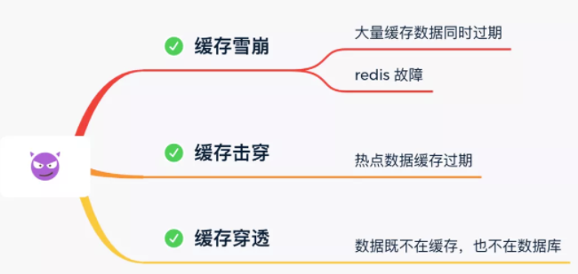

### 缓存雪崩

通常我们为了保证缓存中的数据与数据库中的数据一致性，会给 Redis 里的数据设置过期时间，当缓存数据过期后，用户访问的数据如果不在缓存里，业务系统需要重新生成缓存，因此就会访问数据库，并将数据更新到 Redis 里，这样后续请求都可以直接命中缓存。

 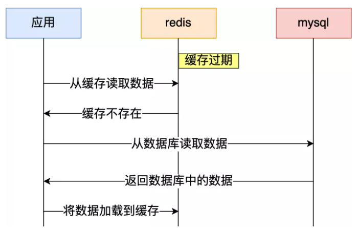

那么，当**大量缓存数据在同一时间过期（失效）或者 Redis 故障宕机**时，如果此时有大量的用户请求，都无法在 Redis 中处理，于是全部请求都直接访问数据库，从而导致数据库的压力骤增，严重的会造成数据库宕机，从而形成一系列连锁反应，造成整个系统崩溃，这就是**缓存雪崩**的问题。

 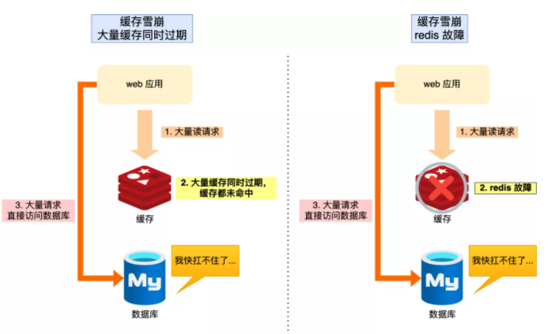

可以看到，发生缓存雪崩有两个原因：

-   大量数据同时过期；
-   Redis 故障宕机；

不同的诱因，应对的策略也会不同。

#### 大量数据同时过期

针对大量数据同时过期而引发的缓存雪崩问题，常见的应对方法有下面这几种：

-   **均匀设置过期时间**

如果要给缓存数据设置过期时间，应该避免将大量的数据设置成同一个过期时间。我们可以在对缓存数据设置过期时间时，给这些数据的过期时间加上一个随机数，这样就保证数据不会在同一时间过期。

-   **互斥锁**

当业务线程在处理用户请求时，**如果发现访问的数据不在 Redis 里，就加个互斥锁，保证同一时间内只有一个请求来构建缓存**（从数据库读取数据，再将数据更新到 Redis 里），当缓存构建完成后，再释放锁。未能获取互斥锁的请求，要么等待锁释放后重新读取缓存，要么就返回空值或者默认值。

实现互斥锁的时候，最好设置**超时时间**，不然第一个请求拿到了锁，然后这个请求发生了某种意外而一直阻塞，一直不释放锁，这时其他请求也一直拿不到锁，整个系统就会出现无响应的现象。

-   **双 key 策略**

我们对缓存数据可以使用两个 key，一个是**主 key，会设置过期时间**，一个是**备 key，不会设置过期**，它们只是 key 不一样，但是 value 值是一样的，相当于给缓存数据做了个副本。

当业务线程访问不到「主 key 」的缓存数据时，就直接返回「备 key 」的缓存数据，然后在更新缓存的时候，**同时更新「主 key 」和「备 key 」的数据。**

-   **后台更新缓存**

业务线程不再负责更新缓存，缓存也不设置有效期，而是**让缓存“永久有效”，并将更新缓存的工作交由后台线程定时更新**。

事实上，缓存数据不设置有效期，并不是意味着数据一直能在内存里，因为**当系统内存紧张的时候，有些缓存数据会被“淘汰”**，而在缓存被“淘汰”到下一次后台定时更新缓存的这段时间内，业务线程读取缓存失败就返回空值，业务的视角就以为是数据丢失了。

解决上面的问题的方式有两种：

第一种方式，后台线程不仅负责定时更新缓存，而且也负责**频繁地检测缓存是否有效**，检测到缓存失效了，原因可能是系统紧张而被淘汰的，于是就要马上从数据库读取数据，并更新到缓存。这种方式的检测时间间隔不能太长，太长也导致用户获取的数据是一个空值而不是真正的数据，所以检测的间隔最好是毫秒级的，但是总归是有个间隔时间，用户体验一般。

第二种方式，在业务线程发现缓存数据失效后（缓存数据被淘汰），**通过消息队列发送一条消息通知后台线程更新缓存**，后台线程收到消息后，在更新缓存前可以判断缓存是否存在，存在就不执行更新缓存操作；不存在就读取数据库数据，并将数据加载到缓存。这种方式相比第一种方式缓存的更新会更及时，用户体验也比较好。

在业务刚上线的时候，我们最好提前把数据缓起来，而不是等待用户访问才来触发缓存构建，这就是所谓的**缓存预热**，后台更新缓存的机制刚好也适合干这个事情。

#### Redis 故障宕机

针对 Redis 故障宕机而引发的缓存雪崩问题，常见的应对方法有下面这几种：

-   服务熔断或请求限流机制

因为 Redis 故障宕机而导致缓存雪崩问题时，我们可以启动**服务熔断**机制，**暂停业务应用对缓存服务的访问，直接返回错误**，不用再继续访问数据库，从而降低对数据库的访问压力，保证数据库系统的正常运行，然后等到 Redis 恢复正常后，再允许业务应用访问缓存服务。

服务熔断机制是保护数据库的正常允许，但是暂停了业务应用访问缓存服系统，全部业务都无法正常工作

为了减少对业务的影响，我们可以启用**请求限流**机制，**只将少部分请求发送到数据库进行处理，再多的请求就在入口直接拒绝服务**，等到 Redis 恢复正常并把缓存预热完后，再解除请求限流的机制。

-   **构建 Redis 缓存高可靠集群**

服务熔断或请求限流机制是缓存雪崩发生后的应对方案，我们最好通过**主从节点的方式构建 Redis 缓存高可靠集群**。

如果 Redis 缓存的主节点故障宕机，从节点可以切换成为主节点，继续提供缓存服务，避免了由于 Redis 故障宕机而导致的缓存雪崩问题。

### 缓存击穿

我们的业务通常会有几个数据会被频繁地访问，比如秒杀活动，这类被频地访问的数据被称为热点数据。

如果缓存中的**某个热点数据过期**了，此时大量的请求访问了该热点数据，就无法从缓存中读取，直接访问数据库，数据库很容易就被高并发的请求冲垮，这就是**缓存击穿**的问题。

 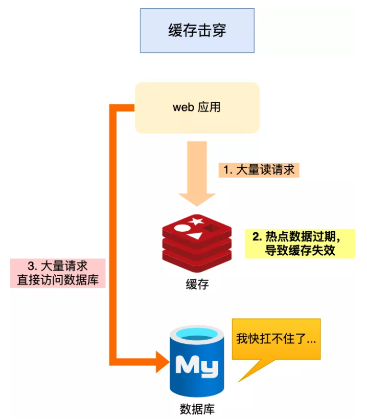

可以发现缓存击穿跟缓存雪崩很相似，你可以认为缓存击穿是缓存雪崩的一个子集。

应对缓存击穿可以采取前面说到两种方案：

-   互斥锁方案，保证同一时间只有一个业务线程更新缓存，未能获取互斥锁的请求，要么等待锁释放后重新读取缓存，要么就返回空值或者默认值。
-   不给热点数据设置过期时间，由后台异步更新缓存，或者在热点数据准备要过期前，提前通知后台线程更新缓存以及重新设置过期时间；

### 缓存穿透

当发生缓存雪崩或击穿时，数据库中还是保存了应用要访问的数据，一旦缓存恢复相对应的数据，就可以减轻数据库的压力，而缓存穿透就不一样了。

当用户访问的数据，**既不在缓存中，也不在数据库中**，导致请求在访问缓存时，发现缓存缺失，再去访问数据库时，发现数据库中也没有要访问的数据，没办法构建缓存数据，来服务后续的请求。那么当有大量这样的请求到来时，数据库的压力骤增，这就是**缓存穿透**的问题。

 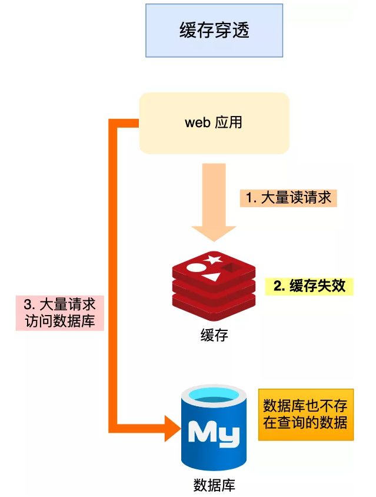

缓存穿透的发生一般有这两种情况：

-   业务误操作，缓存中的数据和数据库中的数据都被误删除了，所以导致缓存和数据库中都没有数据；
-   黑客恶意攻击，故意大量访问某些读取不存在数据的业务；

应对缓存穿透的方案，常见的方案有三种：

-   非法请求的限制

当有大量恶意请求访问不存在的数据的时候，也会发生缓存穿透，因此在 API 入口处我们要判断求请求参数是否合理，请求参数是否含有非法值、请求字段是否存在，如果判断出是恶意请求就直接返回错误，避免进一步访问缓存和数据库。

-   缓存空值或者默认值；

当我们线上业务发现缓存穿透的现象时，可以针对查询的数据，在缓存中设置一个空值或者默认值，这样后续请求就可以从缓存中读取到空值或者默认值，返回给应用，而不会继续查询数据库。

-   使用布隆过滤器快速判断数据是否存在，避免通过查询数据库来判断数据是否存在

>   布隆过滤器是一种占用空间很小的数据结构，它由一个很长的二进制向量和一组Hash映射函数组成，它用于检索一个元素是否在一个集合中，空间效率和查询时间都比一般的算法要好的多，缺点是有一定的误识别率和删除困难。
>
>   **布隆过滤器原理是？** 
>
>   假设我们有个集合 A，A 中有 n 个元素。利用 **k 个哈希散列**函数，将A中的每个元素**映射**到一个长度为a位的数组B中的不同位置上，这些位置上的二进制数均设置为 1。如果待检查的元素，经过这k个哈希散列函数的映射后，发现其k个位置上的二进制数**全部为 1**，这个元素很可能属于集合 A，反之，**一定不属于集合 A**。

我们可以在写入数据库数据时，使用布隆过滤器做个标记，然后在用户请求到来时，业务线程确认缓存失效后，可以通过查询布隆过滤器快速判断数据是否存在，如果不存在，就不用通过查询数据库来判断数据是否存在。

即使发生了缓存穿透，大量请求只会查询 Redis 和布隆过滤器，而不会查询数据库，保证了数据库能正常运行，Redis 自身也是支持布隆过滤器的。

那问题来了，布隆过滤器是如何工作的呢？接下来，我介绍下。

布隆过滤器由「初始值都为 0 的位图数组」和「 N 个哈希函数」两部分组成。当我们在写入数据库数据时，在布隆过滤器里做个标记，这样下次查询数据是否在数据库时，只需要查询布隆过滤器，如果查询到数据没有被标记，说明不在数据库中。

布隆过滤器会通过 3 个操作完成标记：

1.  使用 N 个哈希函数分别对数据做哈希计算，得到 N 个哈希值；
2.  将第一步得到的 N 个哈希值对位图数组的长度取模，得到每个哈希值在位图数组的对应位置。
3.  将每个哈希值在位图数组的对应位置的值设置为 1；

举个例子，假设有一个位图数组长度为 8，哈希函数 3 个的布隆过滤器。

 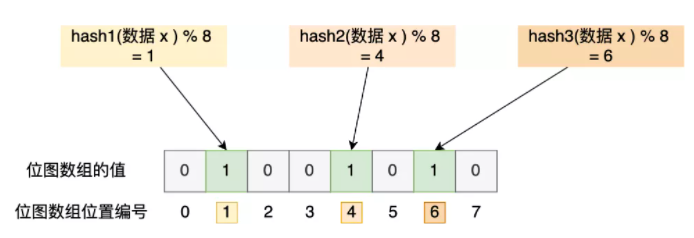

在数据库写入数据 x 后，把数据 x 标记在布隆过滤器时，数据 x 会被 3 个哈希函数分别计算出 3 个哈希值，然后在对这 3 个哈希值对 8 取模，假设取模的结果为 1、4、6，然后把位图数组的第 1、4、6 位置的值设置为 1。**当应用要查询数据 x 是否数据库时，通过布隆过滤器只要查到位图数组的第 1、4、6 位置的值是否全为 1，只要有一个为 0，就认为数据 x 不在数据库中**。

布隆过滤器由于是基于哈希函数实现查找的，高效查找的同时**存在哈希冲突的可能性**，比如数据 x 和数据 y 可能都落在第 1、4、6 位置，而事实上，可能数据库中并不存在数据 y，存在误判的情况。

如何**减少这种误差**呢？

1.  搞多几个哈希函数映射，降低哈希碰撞的概率
2.  同时增加 B 数组的 bit 长度，可以增大 hash 函数生成的数据的范围，也可以降低哈希碰撞的概率

所以，**查询布隆过滤器说数据存在，并不一定证明数据库中存在这个数据，但是查询到数据不存在，数据库中一定就不存在这个数据**。

### 总结

 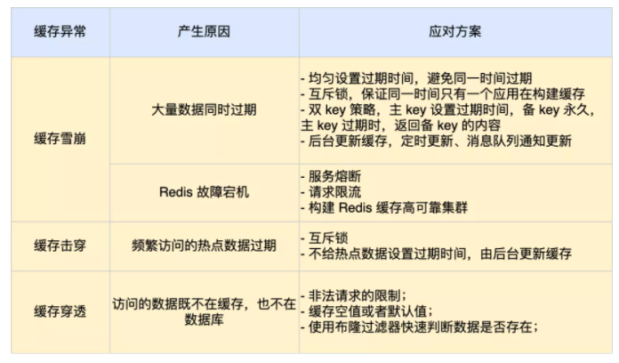

 

## 热Key问题

什么是热Key呢？在 Redis 中，我们把访问频率高的 key，称为热点 key。

如果某一热点 key 的请求到服务器主机时，由于请求量特别大，可能会导致主机资源不足，甚至宕机，从而影响正常的服务。

 而热点 Key 是怎么产生的呢？主要原因有两个：

>   -   用户消费的数据远大于生产的数据，如秒杀、热点新闻等读多写少的场景。
>   -   请求分片集中，超过单 Redis 服务器的性能，比如固定名称 key，Hash 落入同一台服务器，瞬间访问量极大，超过机器瓶颈，产生热点 Key 问题。

那么在日常开发中，如何识别到热点 key 呢？

>   -   凭经验判断哪些是热 Key；
>   -   客户端统计上报；
>   -   服务代理层上报

如何解决热key问题？

>   -   Redis 集群扩容：增加分片副本，均衡读流量；
>   -   将热key分散到不同的服务器中；
>   -   使用二级缓存，减少 Redis 的读请求。

## 缓存高可用

缓存是否高可用，需要根据实际的场景而定，并不是所有业务都要求缓存高可用，需要结合具体业务，具体情况进行方案设计，例如临界点是否对后端的数据库造成影响。

主要解决方案：

-   分布式：实现数据的海量缓存。
-   复制：实现缓存数据节点的高可用。

# 参考与感谢

-   [大型分布式系统中的缓存架构](https://www.cnblogs.com/panchanggui/p/9503666.html)
-   [缓存更新的套路](https://coolshell.cn/articles/17416.html)
-   [分布式之数据库和缓存双写一致性方案解析](https://www.cnblogs.com/rjzheng/p/9041659.html)
-   [缓存和数据库一致性的问题](https://mp.weixin.qq.com/s/u_v6Xfoz-itfdAfWyQvMJg)

