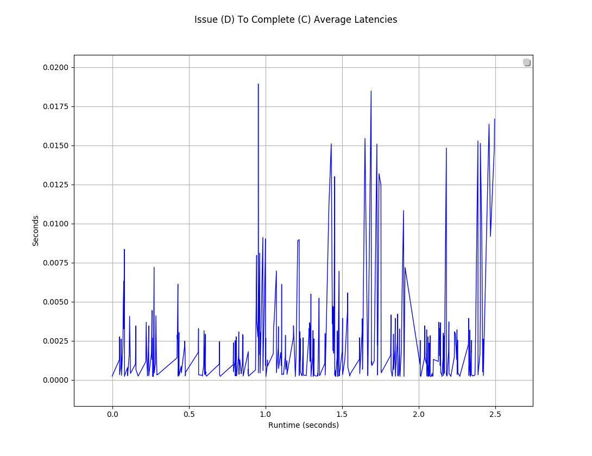
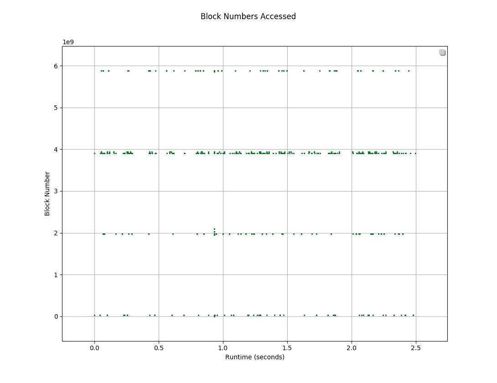
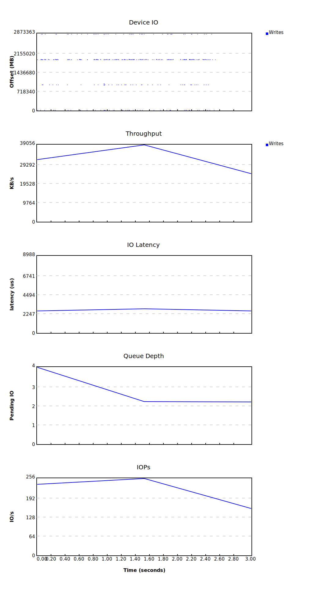

# 简介

blktrace 的作者正是 block io 的 maintainer，开发此工具，可以更好的追踪 IO 的过程。blktrace 结合 btt 可以统计一个 IO 是在调度队列停留的时间长，还是在硬件上消耗的时间长，利用这个工具可以协助分析和优化问题。

一个 IO 在进入块 IO 子系统后，可能会经历以下过程：

-   Remap：可能被DM（Device Mapper）或 MD（Multiple Device，Software RAID） 重定向到其它设备；
-   Split：可能会因为 I/O 请求与扇区边界未对齐、或者 size 太大而被分拆（split）成多个物理 I/O；
-   Merge: 可能会因为与其它 I/O 请求的物理位置相邻而合并（merge）成一个 I/O；
-   被 IO Scheduler 依照调度策略发送给 driver；
-   被 driver 提交给硬件，经过 HBA、电缆（光纤、网线等）、交换机（SAN 或网络）、最后到达存储设备，设备完成 IO 请求之后再把结果发回。


---

# 实时输出

使用 blktrace 前提需要挂载 debugfs。

```bash
$ mount –t debugfs debugfs /sys/kernel/debug
$ mount | grep debug
debugfs on /sys/kernel/debug type debugfs (rw,relatime)
```

下面两条命令等价，都可以实时输出块设备跟踪信息（`-` 代表终端）。

```bash
$ blktrace -d /dev/sdx -o - | blkparse -i -
$ btrace /dev/sdx
```

我们来看一下输出信息：

```bash
[root@localhost test]# btrace /dev/sdx
 65,112  6        1     0.000000000 27092  Q  WS 5911564656 + 8 [minio]
 65,112  6        2     0.000001929 27092  G  WS 5911564656 + 8 [minio]
 65,112  6        3     0.000002724 27092  I  WS 5911564656 + 8 [minio]
 65,112  6        4     0.000003485 27092  D  WS 5911564656 + 8 [minio]
 65,112  0        1     0.000303331     0  C  WS 5911564656 + 8 [0]
 65,112  3        1     0.000330510 27092  Q WSM 3907570112 + 16 [minio]
 65,112  3        2     0.000331217 27092  G WSM 3907570112 + 16 [minio]
 65,112  3        3     0.000331436 27092  P   N [minio]
 65,112  3        4     0.000331894 27092  I WSM 3907570112 + 16 [minio]
 65,112  3        5     0.000332395 27092  U   N [minio] 1
 65,112  3        6     0.000332734 27092  D WSM 3907570112 + 16 [minio]
 65,112  0        2     0.000893666 27057  C WSM 3907570112 + 16 [0]
 ...
```

第一列（65,112）表示设备的主次设备号。

第二列表示 CPU ID。

第三列是序号。

第四列（0.000893666）是活动时间，单位为秒。

第五列是进程 ID。

第六列是活动标识符，这个字段非常重要，反映了 IO 进行到了哪一步，这个我们后面再重点介绍。

第七列是 IO 标志位（RWBS 描述），R 表示 Read， W 是 Write，D 表示 Discard，B 表示 Barrier Operation。另外 M 表示元数据，S 表示同步，A 表示预读，F 表示刷新或强制单元访问，E 表示擦除，N 表示无。

最后的数据取决于活动，比如 3907570112 + 16 [minio] 意味着一个块地址（起始扇区号） 3907570112，大小为 16 个扇区，来自进程 minio 的 IO。


---

# 活动标识符

活动标识符关键点示意：

```text
Q------->G------------>I--------->M------------------->D----------------------------->C
|-Q time-|-Insert time-|
|--------- merge time ------------|-merge with other IO|
|----------------scheduler time time-------------------|---driver,adapter,storagetime--|

|----------------------- await time in iostat output ----------------------------------|
 
Q – 即将生成IO请求
|
G – IO请求生成
|
I – IO请求进入IO Scheduler队列
|
D – IO请求进入driver
|
C – IO请求执行完毕
```

注意，整个 IO 路径，分成很多段，每一段开始的时候，都会有一个时间戳，根据上一段开始的时间和下一段开始的时间，就可以得到 IO 路径各段花费的时间。

我们心心念念的 service time，也就是反应块设备处理能力的指标，就是从 D 到 C 所花费的时间，简称 D2C。

iostat 输出中的 await，即整个 IO 从生成请求到请求执行完毕，即从 Q 到 C 所花费的时间，我们简称 Q2C。

我们知道 Linux 有 I/O scheduler，调度器的效率如何，I2D 是重要的指标。

完整的活动标识符含义可以查看：

```bash
$ man blkparse
ACTION IDENTIFIERS
       The following table shows the various actions which may be output:
       A      IO was remapped to a different device
              对于栈式设备，进来的 I/O 将被重新映射到 I/O 栈中的具体设备
              
       B      IO bounced
              IO 回弹区
              
       C      IO completion
              I/O 处理被磁盘处理完成
              
       D      IO issued to driver
              I/O 被传送给磁盘驱动程序处理
              
       F      IO front merged with request on queue
              IO 向前合并
              
       G      Get request
              request I/O 请求(request)生成，为 I/O 分配一个 request 结构体
              
       I      IO inserted onto request queue
              I/O 请求被插入到 I/O scheduler 队列
              
       M      IO back merged with request on queue
              IO 向后合并
              
       P      Plug request
              蓄流
              
       Q      IO handled by request queue code
              I/O 进入 block layer，将要被 request 代码处理(即将生成 I/O 请求)
              
       S      Sleep request
              没有可用的 request 结构体，也就是 I/O 满了，只能等待有 request 结构体完成释放
              
       T      Unplug due to timeout
              由于超时泄流
              
       U      Unplug request
              泄流
              
       X      Split
              对于做了 Raid 或进行了 device mapper(dm) 的设备，进来的 I/O 可能需要切割，然后发送给不同的设备。
```


---

# 采集

blktrace 采集将会在当前目录获得一堆的文件,缺省的输出文件名是 `diskname.blktrace.<cpu>`，每个 CPU 对应一个文件。然后给 blkparse 传递磁盘的名字，将会直接解析。

```bash
[root@localhost test]# blktrace /dev/sdx
^C=== sdx ===
  CPU  0:                 1356 events,       64 KiB data
  CPU  1:                  742 events,       35 KiB data
  CPU  2:                  661 events,       31 KiB data
  CPU  3:                  624 events,       30 KiB data
  CPU  4:                  485 events,       23 KiB data
  CPU  5:                  464 events,       22 KiB data
  CPU  6:                  421 events,       20 KiB data
  CPU  7:                  697 events,       33 KiB data
  Total:                  5450 events (dropped 0),      256 KiB data
[root@localhost test]# ls
sdx.blktrace.0  sdx.blktrace.1  sdx.blktrace.2  sdx.blktrace.3  sdx.blktrace.4  sdx.blktrace.5  sdx.blktrace.6  sdx.blktrace.7
[root@localhost test]# blkparse sdx
Input file sdx.blktrace.0 added
Input file sdx.blktrace.1 added
Input file sdx.blktrace.2 added
Input file sdx.blktrace.3 added
Input file sdx.blktrace.4 added
Input file sdx.blktrace.5 added
Input file sdx.blktrace.6 added
Input file sdx.blktrace.7 added
 65,112  0        1     0.000000000     0  C  WS 1953394280 + 640 [0]
 65,112  0        2     0.000663382 25061  C  WS 1953394920 + 640 [0]
 65,112  0        3     0.000704384 25061  C  WS 1953395560 + 136 [0]
 65,112  4        1     0.001450838 26749  Q WSM 3909638064 + 32 [minio]
 65,112  4        2     0.001452337 26749  G WSM 3909638064 + 32 [minio]
 65,112  4        3     0.001452716 26749  P   N [minio]
 65,112  4        4     0.001453463 26749  I WSM 3909638064 + 32 [minio]
 65,112  4        5     0.001453889 26749  U   N [minio] 1
 65,112  4        6     0.001454296 26749  D WSM 3909638064 + 32 [minio]
 65,112  0        4     0.001739028     0  C WSM 3909638064 + 32 [0]
...
```

跟踪完成后，运行 blkrawverify，列举被跟踪的所有设备，如果使用 blkrawverify 发现在保存的跟踪流中的错误，最好重新捕获数据。

```bash
[root@localhost test]# blkrawverify sdx
Verifying sdx
    CPU 0 
    CPU 1 
    CPU 2 
    CPU 3 
    CPU 4 
    CPU 5 
    CPU 6 
    CPU 7 
Wrote output to sdx.verify.out
[root@localhost test]# cat sdx.verify.out 

---------------
Verifying sdx
    ---------------------
    Summary for cpu 0:
           816 valid +          0 invalid (100.0%) processed

    ---------------------
    Summary for cpu 1:
           444 valid +          0 invalid (100.0%) processed

    ---------------------
    Summary for cpu 2:
           356 valid +          0 invalid (100.0%) processed

...

```

blktrace 产生的文件太零散怎么办？blkparse 可以将它们合并成一个二进制文件。

```bash
[root@localhost test]# blkparse -i sdx -d sdx.blktrace.bin
[root@localhost test]# ls
sdx.blktrace.0  sdx.blktrace.1  sdx.blktrace.2  sdx.blktrace.3  sdx.blktrace.4  sdx.blktrace.5  sdx.blktrace.6  sdx.blktrace.7  sdx.blktrace.bin
```

另外 blktrace -a 可以跟踪指定的操作，具体可以携带的参数如下：

```bash
$ man blktrace
barrier: barrier attribute
complete: completed by driver
fs: requests
issue: issued to driver
pc: packet command events
queue: queue operations
read: read traces
requeue: requeue operations
sync: synchronous attribute
write: write traces
notify: trace messages
drv_data: additional driver specific trace
```

```bash
[root@localhost test]# btrace /dev/sdx -a issue -a complete
 65,112  4        1     0.000000000 27089  D   W 5859704992 + 640 [minio]
 65,112  4        2     0.000029675 27089  D   W 5859705632 + 640 [minio]
 65,112  4        3     0.000059517 27089  D   W 5859706272 + 640 [minio]
 65,112  4        4     0.000087453 27089  D   W 5859706912 + 640 [minio]
 65,112  4        5     0.000118727 27089  D   W 5859707552 + 640 [minio]
 65,112  4        6     0.000160333 27089  D   W 5859708192 + 640 [minio]
 65,112  4        7     0.000174270 27089  D   W 5859708832 + 144 [minio]
 65,112  0        1     0.001051971     3  C   W 5859704992 + 640 [0]
 65,112  0        2     0.002361342 27005  C   W 5859706272 + 640 [0]
 65,112  0        3     0.002364293 27005  C   W 5859705632 + 640 [0]
 65,112  0        4     0.003585859     0  C   W 5859706912 + 640 [0]
 65,112  0        5     0.004597615     0  C   W 5859707552 + 640 [0]
 65,112  0        6     0.004772651     0  C   W 5859708832 + 144 [0]
 65,112  0        7     0.004775215     0  C   W 5859708192 + 640 [0]
...
```


---

# 分析

blkparse 仅仅是将 blktrace 输出的信息转化成人可以阅读和理解的输出，但是，信息太多，太杂，人完全没法得到关键信息。这时候 btt 就横空出世了，这个工具可以将 blktrace 采集回来的数据，进行分析，得到对人更有用的信息。

我们可以通过 btt 看到每个阶段消耗的时间，占用的百分比。比如 D2C 平均 0.002747523s 即 2.7 ms，D2C 占所有阶段的 99.8596%，基本就是所有时间都是花费在磁盘处理 IO 上。

```bash
[root@localhost test]# btt -i sdx.blktrace.bin 
# 每个阶段 IO 所需时间
==================== All Devices ====================

            ALL           MIN           AVG           MAX           N
--------------- ------------- ------------- ------------- -----------

Q2Q               0.000000811   0.003765610   0.127157187         663
Q2G               0.000000201   0.000000857   0.000008465         650
G2I               0.000000171   0.000001578   0.000043407         650
Q2M               0.000000122   0.000000160   0.000000251          14
I2D               0.000000171   0.000000926   0.000016358         650
M2D               0.000010481   0.000027012   0.000042190          14
D2C               0.000216006   0.002747523   0.018931514         663
Q2C               0.000218344   0.002751385   0.018975584         663

# 设备开销占比，可以知道 IO 平均花费大部分时间的地方
==================== Device Overhead ====================

       DEV |       Q2G       G2I       Q2M       I2D       D2C
---------- | --------- --------- --------- --------- ---------
 ( 65,112) |   0.0305%   0.0562%   0.0001%   0.0330%  99.8596%
---------- | --------- --------- --------- --------- ---------
   Overall |   0.0305%   0.0562%   0.0001%   0.0330%  99.8596%

# IO 合并的信息
# 显示传入请求的数量 (Q)、发出的请求数量 (D) 和结果比率。
# 此外还能看到平均 IO 块大小为 292
==================== Device Merge Information ====================

       DEV |       #Q       #D   Ratio |   BLKmin   BLKavg   BLKmax    Total
---------- | -------- -------- ------- | -------- -------- -------- --------
 ( 65,112) |      664      650     1.0 |        8      292      640   190144

# 用于显示连续队列和提交 IO 之间的扇区距离
# NSEEKS 表示提交到驱动的 IO 寻道次数
# MEAN 表示 IO 之间距离，MEDIAN 为 0 表示向前和向后寻道次数一样，MODE 中数值表示块 IO 中连续的扇区
# 包含两部分，Q2Q 是到达的 IO 请求之间，D2D 是驱动中处理的 IO 请求
==================== Device Q2Q Seek Information ====================

       DEV |          NSEEKS            MEAN          MEDIAN | MODE           
---------- | --------------- --------------- --------------- | ---------------
 ( 65,112) |             664    1053411189.0               0 | 0(311)
---------- | --------------- --------------- --------------- | ---------------
   Overall |          NSEEKS            MEAN          MEDIAN | MODE           
   Average |             664    1053411189.0               0 | 0(311)

==================== Device D2D Seek Information ====================

       DEV |          NSEEKS            MEAN          MEDIAN | MODE           
---------- | --------------- --------------- --------------- | ---------------
 ( 65,112) |             650    1076100045.3               0 | 0(297)
---------- | --------------- --------------- --------------- | ---------------
   Overall |          NSEEKS            MEAN          MEDIAN | MODE           
   Average |             650    1076100045.3               0 | 0(297)

# 队列不是无限大的，必然存在队列阻塞情况，这里的统计信息就是被阻塞时不能被处理的比例
==================== Plug Information ====================

       DEV |    # Plugs # Timer Us  | % Time Q Plugged
---------- | ---------- ----------  | ----------------
 ( 65,112) |        179(         0) |   0.009221529%

       DEV |    IOs/Unp   IOs/Unp(to)
---------- | ----------   ----------
 ( 65,112) |        1.1          0.0
---------- | ----------   ----------
   Overall |    IOs/Unp   IOs/Unp(to)
   Average |        1.1          0.0

==================== Active Requests At Q Information ====================

       DEV |  Avg Reqs @ Q
---------- | -------------
 ( 65,112) |           0.5

==================== I/O Active Period Information ====================

       DEV |     # Live      Avg. Act     Avg. !Act % Live
---------- | ---------- ------------- ------------- ------
 ( 65,112) |        285   0.002400146   0.006379151  27.41
---------- | ---------- ------------- ------------- ------
 Total Sys |        285   0.002400146   0.006379151  27.41

# Total System
#     Total System : q activity
  0.000000000   0.0
  0.000000000   0.4
  0.294413681   0.4
  0.294413681   0.0
  0.421570868   0.0
  0.421570868   0.4
  1.904333116   0.4
  1.904333116   0.0
  2.008006483   0.0
  2.008006483   0.4
  2.496599342   0.4
  2.496599342   0.0

#     Total System : c activity
  0.000247210   0.5
  0.000247210   0.9
  0.294747853   0.9
  0.294747853   0.5
  0.422990536   0.5
  0.422990536   0.9
  2.495720386   0.9
  2.495720386   0.5

# Per process
#           kernel : q activity

#           kernel : c activity
  0.000247210   1.5
  ...
  2.493689016   1.5

...

#          kworker : q activity
  0.114914007   4.0
  0.114914007   4.4
  ...
  2.183991712   4.0

#          kworker : c activity
  0.000536263   4.5
  ...
  2.468989954   4.5

#            minio : q activity
  0.000000000   5.0
  ...
  2.496599342   5.4
  2.496599342   5.0

#            minio : c activity
  0.058062949   5.5
  0.058062949   5.9
  ...
  2.495720386   5.9
  2.495720386   5.5

#          xfsaild : q activity
  0.934611304   6.0
  0.934611304   6.4
  0.934692590   6.4
  0.934692590   6.0

#          xfsaild : c activity
  0.802041180   6.5
  0.802041180   6.9
  0.802041180   6.9
  0.802041180   6.5
```

另外 btt 可以生成各种数据文件来供绘图使用，从而更清晰地观测 IO 情况。

```bash
# 默认生成 iops 和 mbps 的 dat 文件
[root@localhost test]# ll
总用量 192
-rw-r--r-- 1 root root     18 7月  21 14:18 65,112_iops_fp.dat
-rw-r--r-- 1 root root     36 7月  21 14:18 65,112_mbps_fp.dat
-rw-r--r-- 1 root root 179616 7月  21 09:28 sdx.blktrace.bin
-rw-r--r-- 1 root root     18 7月  21 14:18 sys_iops_fp.dat
-rw-r--r-- 1 root root     36 7月  21 14:18 sys_mbps_fp.dat

# 生成 q2c 延迟分布数据
[root@localhost test]# btt -i sdx.blktrace.bin -q sdx.q2c_latency
[root@localhost test]# ll
...
-rw-r--r-- 1 root root  11934 7月  21 14:19 sdx.q2c_latency_65,112_q2c.dat
...

# 生成 d2c 延迟分布数据
[root@localhost test]# btt -i sdx.blktrace.bin -l sdx.d2c_latency
[root@localhost test]# ll
...
-rw-r--r-- 1 root root  11934 7月  21 14:19 sdx.d2c_latency_65,112_d2c.dat
-rw-r--r-- 1 root root  11934 7月  21 14:19 sdx.q2c_latency_65,112_q2c.dat
...

# 生成 size 分布，按道理会生成 3 个文件，r 表示读，w 表示写，c 表示读+写
[root@localhost test]# btt -i sdx.blktrace.bin -B sdx.offset
[root@localhost test]# ll
...
-rw-r--r-- 1 root root  24235 7月  21 14:19 sdx.offset_65,112_c.dat
-rw-r--r-- 1 root root  24235 7月  21 14:19 sdx.offset_65,112_w.dat
...
```

那么怎么把这些数据变成图片呢？可以从 blktrace 的 github 里找到 btt_plot.py 脚本。matplotlib 是 Python 2D-绘图领域使用最广泛的套件，这里就不演示怎么安装了，下面是 btt_plot.py 的使用方法。

```bash
btt_plot.py: Generate matplotlib plots for BTT generated data files

Files handled:
  AQD   - Average Queue Depth           Running average of queue depths

  BNOS  - Block numbers accessed        Markers for each block

  Q2D   - Queue to Issue latencies      Running averages
  D2C   - Issue to Complete latencies   Running averages
  Q2C   - Queue to Complete latencies   Running averages

Usage:
  btt_plot_aqd.py       equivalent to: btt_plot.py -t aqd       <type>=aqd
  btt_plot_bnos.py      equivalent to: btt_plot.py -t bnos      <type>=bnos
  btt_plot_q2d.py       equivalent to: btt_plot.py -t q2d       <type>=q2d
  btt_plot_d2c.py       equivalent to: btt_plot.py -t d2c       <type>=d2c
  btt_plot_q2c.py       equivalent to: btt_plot.py -t q2c       <type>=q2c

Arguments:
  [ -A          | --generate-all   ] Default: False
  [ -L          | --no-legend      ] Default: Legend table produced
  [ -o <file>   | --output=<file>  ] Default: <type>.png
  [ -T <string> | --title=<string> ] Default: Based upon <type>
  [ -v          | --verbose        ] Default: False
  <data-files...>

  The -A (--generate-all) argument is different: when this is specified,
  an attempt is made to generate default plots for all 5 types (aqd, bnos,
  q2d, d2c and q2c). It will find files with the appropriate suffix for
  each type ('aqd.dat' for example). If such files are found, a plot for
  that type will be made. The output file name will be the default for
  each type. The -L (--no-legend) option will be obeyed for all plots,
  but the -o (--output) and -T (--title) options will be ignored.
```

我们可以使用这个脚本来生成图片：

```bash
$ python btt_plot.py -t q2c -o q2c.png sdx.q2c_latency_65,112_q2c.dat 
$ python btt_plot.py -t d2c -o d2c.png sdx.d2c_latency_65,112_d2c.dat 
$ python btt_plot.py -t bnos -o bnos.png sdx.offset_65,112_*
```

我们来看一下效果：








---

# iowatcher

仅仅查看数据进行分析，非常的不直观。工具 iowatcher 可以把 blktrace 采集的信息，转化为图像和动画，方便分析。

```bash
[root@localhost test]# iowatcher -t sdx.blktrace.bin -o sdx.svg
[root@localhost test]# iowatcher -t sdx.blktrace.bin --movie -o sdx.mp4
```




视频演示效果可以参考：[磁盘性能分析](https://zhuanlan.zhihu.com/p/59514527#:~:text=%E5%B7%A5%E5%85%B7%20iowatcher%20%E5%8F%AF%E4%BB%A5%E6%8A%8A%20blktrace%20%E9%87%87%E9%9B%86%E7%9A%84%E4%BF%A1%E6%81%AF%EF%BC%8C%E8%BD%AC%E5%8C%96%E4%B8%BA%E5%9B%BE%E5%83%8F%E5%92%8C%E5%8A%A8%E7%94%BB%EF%BC%8C%E6%96%B9%E4%BE%BF%E5%88%86%E6%9E%90%E3%80%82%20iowatcher%20-t%20sda.blktrace.bin,-o%20disk.svg%20iowatcher%20-t%20sda.blktrace.bin%20--movie%20-o%20disk.mp4)


---

# blkiomon

blkiomon 是 blktrace 工具包带的一个方便用户了解 IO 情况的工具，由于 blktrace 太专业，需要了解的 IO 协议栈的东西太多，于是 blkiomon 给大多数的用户提供了一种易于使用的方式。

比如对设备 /dev/sdx 的 io 监控 30 秒，每 10 秒显示一次：

```bash
[root@localhost test]# blktrace /dev/sdx -a issue -a complete -w 30 -o - | blkiomon -I 10 -h -

time: Thu Jul 21 09:38:19 2022
device: 65,112
sizes read (bytes): num 0, min -1, max 0, sum 0, squ 0, avg 0.0, var 0.0
sizes write (bytes): num 2763, min 4096, max 327680, sum 413003776, squ 123889959043072, avg 149476.6, var 22495681959.1
d2c read (usec): num 0, min -1, max 0, sum 0, squ 0, avg 0.0, var 0.0
d2c write (usec): num 2763, min 195, max 24245, sum 8093797, squ 55404369699, avg 2929.4, var 11471153.4
throughput read (bytes/msec): num 0, min -1, max 0, sum 0, squ 0, avg 0.0, var 0.0
throughput write (bytes/msec): num 2763, min 168, max 380580, sum 199440038, squ 32279049092782, avg 72182.4, var 6472306794.1
sizes histogram (bytes):
            0:     0         1024:     0         2048:     0         4096:   561
         8192:   199        16384:   134        32768:   357        65536:     0
       131072:   378       262144:     0       524288:  1134      1048576:     0
      2097152:     0      4194304:     0      8388608:     0    > 8388608:     0
d2c histogram (usec):
            0:     0            8:     0           16:     0           32:     0
           64:     0          128:     0          256:   150          512:   500
         1024:   226         2048:   452         4096:   922         8192:   304
        16384:   164        32768:    45        65536:     0       131072:     0
       262144:     0       524288:     0      1048576:     0      2097152:     0
      4194304:     0      8388608:     0     16777216:     0     33554432:     0
    >33554432:     0
bidirectional requests: 0

time: Thu Jul 21 09:38:29 2022
device: 65,112
sizes read (bytes): num 9, min 4096, max 16384, sum 73728, squ 905969664, avg 8192.0, var 33554432.0
sizes write (bytes): num 2665, min 4096, max 327680, sum 401272832, squ 120581861146624, avg 150571.4, var 22574724717.2
d2c read (usec): num 9, min 62, max 21955, sum 118113, squ 1979691963, avg 13123.7, var 47735146.9
d2c write (usec): num 2665, min 193, max 63880, sum 7891522, squ 61478438846, avg 2961.2, var 14300296.0
throughput read (bytes/msec): num 9, min 186, max 66064, sum 71509, squ 4370180685, avg 7945.4, var 422445544.2
throughput write (bytes/msec): num 2665, min 64, max 368179, sum 189305863, squ 29951909077755, avg 71034.1, var 6193147629.9
sizes histogram (bytes):
            0:     0         1024:     0         2048:     0         4096:   524
         8192:   217        16384:   148        32768:   314        65536:     0
       131072:   367       262144:     0       524288:  1104      1048576:     0
      2097152:     0      4194304:     0      8388608:     0    > 8388608:     0
d2c histogram (usec):
            0:     0            8:     0           16:     0           32:     0
           64:     1          128:     0          256:   184          512:   499
         1024:   202         2048:   413         4096:   847         8192:   318
        16384:   178        32768:    30        65536:     2       131072:     0
       262144:     0       524288:     0      1048576:     0      2097152:     0
      4194304:     0      8388608:     0     16777216:     0     33554432:     0
    >33554432:     0
bidirectional requests: 0

time: Thu Jul 21 09:38:39 2022
device: 65,112
sizes read (bytes): num 2, min 4096, max 16384, sum 20480, squ 285212672, avg 10240.0, var 37748736.0
sizes write (bytes): num 2794, min 4096, max 327680, sum 409174016, squ 122872370561024, avg 146447.4, var 22530387487.7
d2c read (usec): num 2, min 25714, max 30566, sum 56280, squ 1595490152, avg 28140.0, var 5885476.0
d2c write (usec): num 2794, min 197, max 47254, sum 9088922, squ 78219845710, avg 3253.0, var 17413547.7
throughput read (bytes/msec): num 2, min 134, max 637, sum 771, squ 423725, avg 385.5, var 63252.2
throughput write (bytes/msec): num 2794, min 122, max 371940, sum 188991690, squ 30389721501772, avg 67642.0, var 6301341993.6
sizes histogram (bytes):
            0:     0         1024:     0         2048:     0         4096:   604
         8192:   203        16384:   183        32768:   306        65536:     0
       131072:   375       262144:     0       524288:  1125      1048576:     0
      2097152:     0      4194304:     0      8388608:     0    > 8388608:     0
d2c histogram (usec):
            0:     0            8:     0           16:     0           32:     0
           64:     0          128:     0          256:   136          512:   463
         1024:   248         2048:   426         4096:   913         8192:   375
        16384:   166        32768:    63        65536:     6       131072:     0
       262144:     0       524288:     0      1048576:     0      2097152:     0
      4194304:     0      8388608:     0     16777216:     0     33554432:     0
    >33554432:     0
bidirectional requests: 0

```


---

# fio replay

可以利用 fio 来重放日志。

```bash
[root@localhost ~]# fio --name=replay --filename=/dev/sdx --direct=1 --read_iolog=sdx.bin 
replay: (g=0): rw=read, bs=(R) 4096B-4096B, (W) 4096B-4096B, (T) 4096B-4096B, ioengine=psync, iodepth=1
fio-3.30
Starting 1 process
Jobs: 1 (f=1): [M(1)][100.0%][w=165MiB/s][w=659 IOPS][eta 00m:00s]
replay: (groupid=0, jobs=1): err= 0: pid=1723: Thu Jul 21 14:11:38 2022
  read: IOPS=4, BW=91.7KiB/s (93.9kB/s)(1048KiB/11423msec)
    clat (usec): min=202, max=20794, avg=972.39, stdev=3432.32
     lat (usec): min=202, max=20795, avg=972.59, stdev=3432.32
    clat percentiles (usec):
     |  1.00th=[  202],  5.00th=[  204], 10.00th=[  204], 20.00th=[  210],
     | 30.00th=[  212], 40.00th=[  231], 50.00th=[  255], 60.00th=[  262],
     | 70.00th=[  351], 80.00th=[  371], 90.00th=[  420], 95.00th=[  441],
     | 99.00th=[20841], 99.50th=[20841], 99.90th=[20841], 99.95th=[20841],
     | 99.99th=[20841]
   bw (  KiB/s): min=    8, max=    8, per=8.72%, avg= 8.00, stdev= 0.00, samples=1
   iops        : min=    2, max=    2, avg= 2.00, stdev= 0.00, samples=1
  write: IOPS=655, BW=163MiB/s (171MB/s)(1863MiB/11423msec); 0 zone resets
    clat (usec): min=217, max=21267, avg=737.33, stdev=337.00
     lat (usec): min=217, max=21274, avg=744.43, stdev=337.07
    clat percentiles (usec):
     |  1.00th=[  660],  5.00th=[  676], 10.00th=[  685], 20.00th=[  709],
     | 30.00th=[  725], 40.00th=[  734], 50.00th=[  734], 60.00th=[  734],
     | 70.00th=[  734], 80.00th=[  734], 90.00th=[  742], 95.00th=[  758],
     | 99.00th=[ 1004], 99.50th=[ 1123], 99.90th=[ 1631], 99.95th=[ 7832],
     | 99.99th=[21365]
   bw (  KiB/s): min=159232, max=174080, per=100.00%, avg=169357.09, stdev=3799.80, samples=22
   iops        : min=  622, max=  684, avg=662.00, stdev=15.38, samples=22
  lat (usec)   : 250=0.69%, 500=0.42%, 750=93.45%, 1000=4.40%
  lat (msec)   : 2=0.94%, 10=0.03%, 20=0.04%, 50=0.03%
  cpu          : usr=0.95%, sys=1.70%, ctx=14985, majf=0, minf=31
  IO depths    : 1=100.0%, 2=0.0%, 4=0.0%, 8=0.0%, 16=0.0%, 32=0.0%, >=64=0.0%
     submit    : 0=0.0%, 4=100.0%, 8=0.0%, 16=0.0%, 32=0.0%, 64=0.0%, >=64=0.0%
     complete  : 0=0.0%, 4=100.0%, 8=0.0%, 16=0.0%, 32=0.0%, 64=0.0%, >=64=0.0%
     issued rwts: total=46,7492,0,0 short=0,0,0,0 dropped=0,0,0,0
     latency   : target=0, window=0, percentile=100.00%, depth=5

Run status group 0 (all jobs):
   READ: bw=91.7KiB/s (93.9kB/s), 91.7KiB/s-91.7KiB/s (93.9kB/s-93.9kB/s), io=1048KiB (1073kB), run=11423-11423msec
  WRITE: bw=163MiB/s (171MB/s), 163MiB/s-163MiB/s (171MB/s-171MB/s), io=1863MiB (1954MB), run=11423-11423msec

Disk stats (read/write):
  sdx: ios=0/0, merge=0/0, ticks=0/0, in_queue=0, util=0.00%
```

本来我是想用 mkfs 来测试重放是否是完全复现当时的 IO，但发现重放之后还是无法挂载。我想是因为 trace 里只有写入位置和写入时间的信息，实际写入的数据并没有保存，因为在测试场景中它确实也不重要。


---

# 参考与感谢

-   [blktrace github](https://github.com/sdsc/blktrace)
-   [Blktrace - 使用blktrace分析系统IO](https://www.cnblogs.com/citrus/p/15149707.html)
-   [Linux命令拾遗-使用blktrace分析io情况](https://www.cnblogs.com/codelogs/p/16060775.html)


