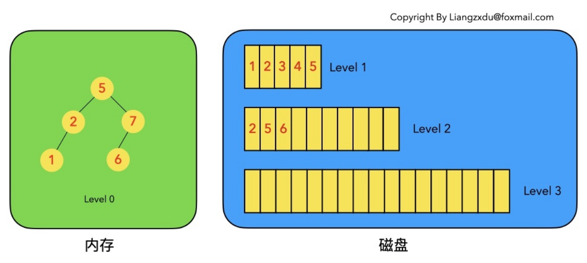
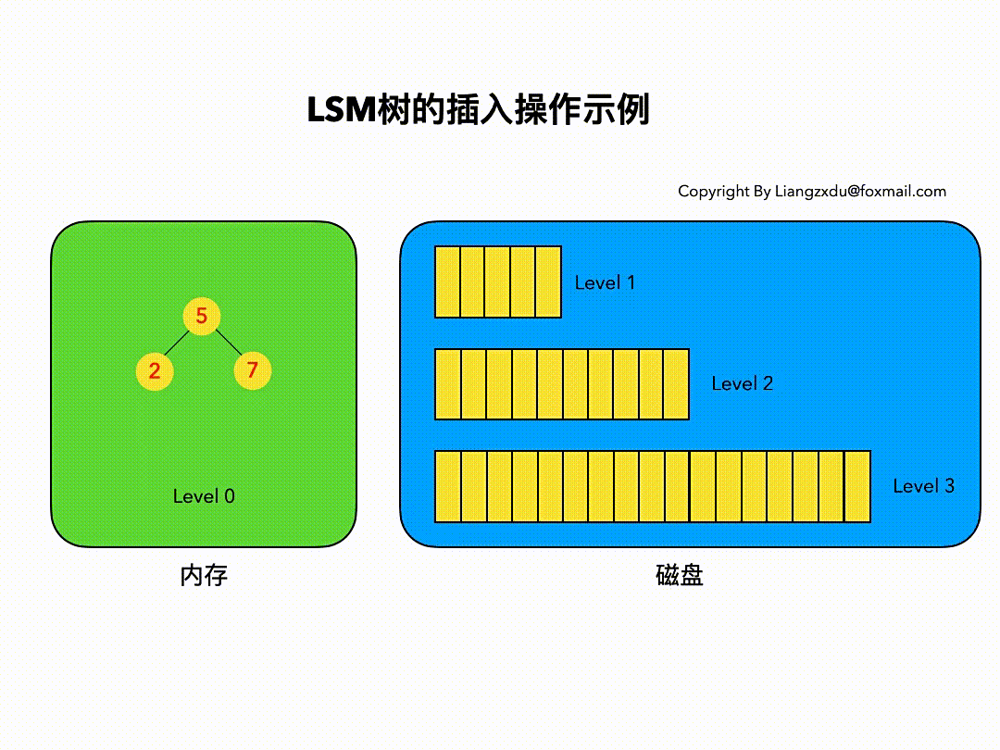
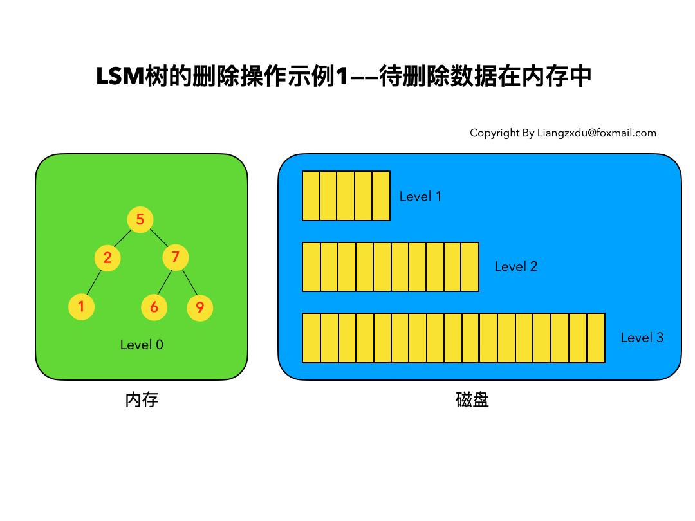
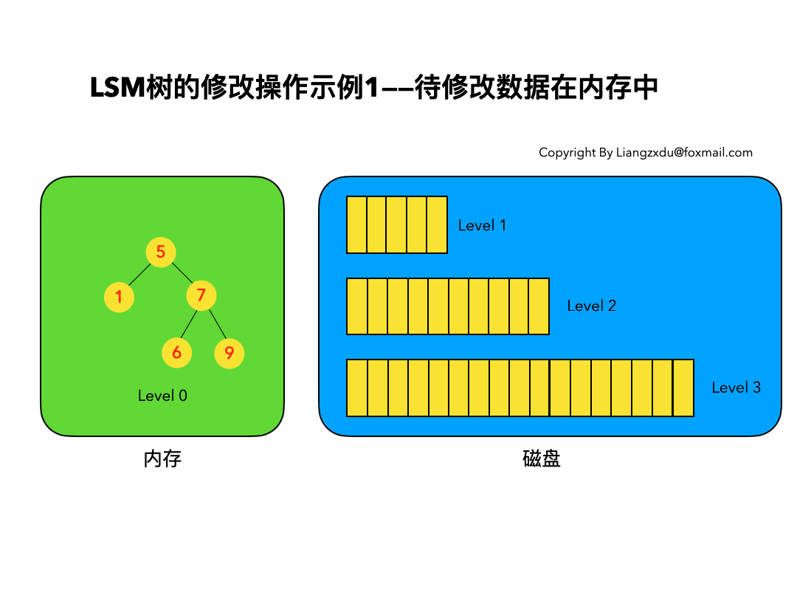
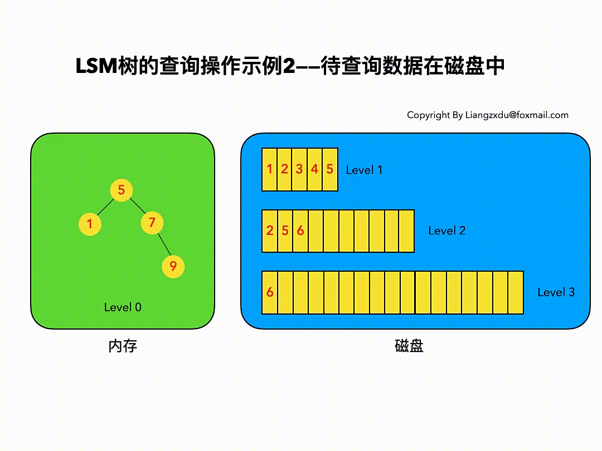
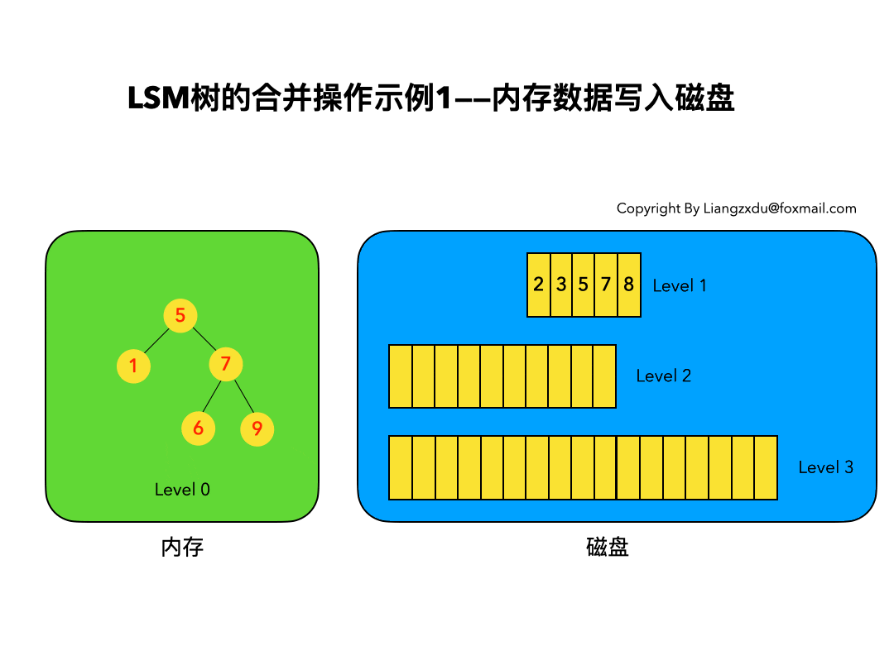
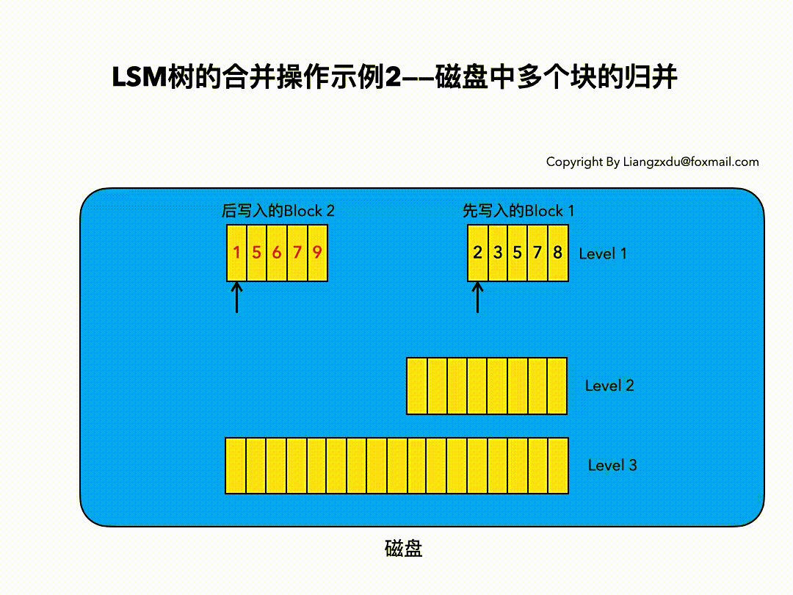

# 前言

十多年前，谷歌发布了大名鼎鼎的三驾马车的论文，分别是 GFS（2003年），MapReduce（2004年），BigTable（2006年），为开源界在大数据领域带来了无数的灵感，其中在 BigTable 的论文中很多很酷的方面之一就是它所使用的文件组织方式，这个方法更一般的名字叫 Log Structured-Merge Tree。在面对亿级别之上的海量数据的存储和检索的场景下，我们选择的数据库通常都是各种强力的 NoSQL，比如 Hbase，Cassandra，Leveldb，RocksDB 等等，这其中前两者是Apache下面的顶级开源项目数据库，后两者分别是 Google 和 Facebook 开源的数据库存储引擎。而这些强大的 NoSQL 数据库都有一个共性，就是其底层使用的数据结构，都是仿照 BigTable 中的文件组织方式来实现的，也就是我们今天要介绍的 LSM-Tree。

LSM-Tree 全称是 Log Structured Merge Tree，是一种分层，有序，面向磁盘的数据结构，其核心思想是充分了利用了，磁盘批量的顺序写要远比随机写性能高出很多，围绕这一原理进行设计和优化，以此让写性能达到最优，正如我们普通的 Log 的写入方式，这种结构的写入，全部都是以 append 的模式追加，不存在删除和修改。当然有得就有舍，这种结构虽然大大提升了数据的写入能力，却是以牺牲部分读取性能为代价，故此这种结构通常适合于写多读少的场景。

故 LSM 被设计来提供比传统的 B+ 树更好的写操作吞吐量，通过消去随机的本地更新操作来达到这个目标。

​	

---

# LSM数据操作流程

## LSM树数据结构定义

LSM 树并没有一种固定死的实现方式，更多的是一种将`磁盘顺序写` + `多个树(状数据结构)` + `冷热（新老）数据分级` + `定期归并` + `非原地更新` 这几种特性统一在一起的思想。

为了方便后续的讲解分析，我们尝试先对 LSM 树做一个定义。

1. LSM 树是一个横跨内存和磁盘的，包含多颗 "子树" 的一个森林。
2. LSM 树分为 Level 0，Level 1，Level 2 ... Level n 多颗子树，其中只有 Level 0 在内存中，其余 Level 1-n 在磁盘中。
3. 内存中的 Level 0 子树一般采用排序树（红黑树 / AVL 树）、跳表或者 TreeMap 等这类有序的数据结构，方便后续顺序写磁盘。
4. 磁盘中的 Level 1-n 子树，本质是数据排好序后顺序写到磁盘上的文件，只是叫做树而已。
5. 每一层的子树都有一个阈值大小，达到阈值后会进行合并，合并结果写入下一层。
6. 只有内存中数据允许原地更新，磁盘上数据的变更只允许追加写，不做原地更新。

以上 6 条定义组成了 LSM 树，如图所示。

 

>[!NOTE]
>
>- 图中分成了左侧绿色的内存部分和右侧蓝色的磁盘部分（定义1）。
>- 左侧绿色的内存部分只包含 Level 0 树，右侧蓝色的磁盘部分则包含 Level 1-n 等多棵 "树"（定义2）
>- 左侧绿色的内存部分中 Level 0 是一颗二叉排序树（定义3）。注意这里的有序性，该性质决定了 LSM 树优异的读写性能。
>- 右侧蓝色的磁盘部分所包含的 Level 1 到 Level n 多颗树，虽然叫做树，但本质是按数据 key 排好序后，顺序写在磁盘上的一个个文件（定义4） ，注意这里再次出现了有序性。
>- 内存中的 Level 0 树在达到阈值后，会在内存中遍历排好序的 Level 0 树并顺序写入磁盘的 Level 1。同样的，在磁盘中的 Level n（n>0）达到阈值时，则会将 Level n 层的多个文件进行归并，写入 Level n+1 层。（定义5）
>- 除了内存中的 Level 0 层做原地更新外，对已写入磁盘上的数据，都采用 append 形式的磁盘顺序写，即更新和删除操作并不去修改老数据，只是简单的追加新数据。图中右侧蓝色的磁盘部分，Level 1 和 Level 2 均包含 key 为 2 的数据，同时左侧绿色内存中的 Level 0 树也包含 key 为 2 的数据节点。（定义6）

下面我们遵循 LSM 树的 6 条定义，通过动图对 LSM 树的增、删、改、查和归并进行详细分析。

## 插入操作

LSM 树的插入较简单，数据无脑往内存中的 Level 0 排序树丢即可，并不关心该数据是否已经在内存或磁盘中存在。（已经存在该数据的话，则场景转换成修改操作）

下图展示了新数据直接插入 Level 0 树的过程，我们依次插入了 key=9、1、6 的数据，这三个数据均按照 key 的大小，插入内存里的 Level 0 排序树中。该操作复杂度为树高 log(n)，n 是 Level 0 树的数据量，可见代价很低，能实现极高的写吞吐量。

## 删除操作

LSM 树的删除操作并不是直接删除数据，而是通过一种叫`墓碑标记`的特殊数据来标识数据的删除。

删除操作分为三种情况：

- 待删除数据在内存中
- 待删除数据在磁盘中
- 该数据根本不存在

### 待删除数据在内存中

下图展示了待删除数据在内存中的删除过程。我们不能简单地将 Level 0 树中的黄色节点 2 删除，而是应该采用墓碑标记将其覆盖，不直接删除而是要用墓碑标记覆盖是因为后面我们还需要根据这个标志来清理磁盘中的数据。

### 待删除数据在磁盘中

我们并不去修改磁盘上的数据（理都不理它），而是直接向内存中的 Level 0 树中插入墓碑标记即可。

### 待删除数据根本不存在

这种情况等价于在内存的 Level 0 树中新增一条墓碑标记。

综合看待上述三种情况，发现不论数据有没有、在哪里，删除操作都是等价于向 Level 0 树中写入墓碑标记。该操作复杂度为树高 log(n)，代价很低。

## 修改操作

LSM 树的修改操作和删除操作很像，也是分为三种情况：

- 待修改数据在内存中
- 在磁盘中
- 该数据根本不存在

### 待修改数据在内存中

新的蓝色的 key=7 的数据，直接定位到内存中 Level 0 树上黄色的老的 key=7 的位置，将其覆盖即可。

### 待修改数据在磁盘中

LSM 树并不会去磁盘中的 Level 1 树上原地更新老的 key=7 的数据，而是直接将新的蓝色的节点7插入内存中的 Level 0 树中。

### 该数据根本不存在

此场景等价于新增，直接向内存中的 Level 0 树插入新的数据即可。

综上三种情况可以看出，修改操作都是对内存中 Level 0 进行覆盖/新增操作。该操作复杂度为树高 log(n)，代价很低。

我们会发现，LSM 树的增加、删除、修改（这三个都属于写操作）都是在内存中倒腾，完全没涉及到磁盘操作，所以速度飞快，写吞吐量高的离谱。。。

## 查询操作

LSM 树的查询操作会按顺序查找 Level 0、Level 1、Level 2 ... Level n 每一颗树，一旦匹配便返回目标数据，不再继续查询。该策略保证了查到的一定是目标 key 最新版本的数据。

我们来分场景分析：依然分为 待查询数据在内存中 和 待查询数据在磁盘中 两种情况。

### 待查询数据在内存中

如图展示了待查询数据在内存中时的查询过程。沿着内存中已排好序的 Level 0 树递归向下比较查询，返回目标节点即可。

我们注意到磁盘上的 Level 1 树中同样包括一个 key=6 的较老的数据。但 LSM 树查询的时候会按照 Level 0、1、2 ... n 的顺序查询，一旦查到第一个就返回，因此磁盘上老的 key=6 的数据没人理它，更不会作为结果被返回。

### 待查询数据在磁盘中

如图所示展示了待查询数据在磁盘上时的查询过程。先查询内存中的 Level 0 树，没查到便查询磁盘中的 Level 1 树，还是没查到，于是查询磁盘中的 Level 2 树，匹配后返回 key=6 的数据。

综合上述两种情况，我们发现，LSM 树的查询操作相对来说代价比较高，需要从 Level 0 到 Level n 一直顺序查下去。极端情况是 LSM 树中不存在该数据，则需要把整个库从 Level 0 到 Level n 给扫了一遍，然后返回查无此人（可以通过 布隆过滤器 + 建立稀疏索引 来优化查询操作）。代价大于以 B/B+ 树为基本数据结构的传统 RDB 存储引擎。

## 合并操作

合并操作是 LSM 树的核心（毕竟 LSM 树的名字就叫: 日志结构合并树，直接点名了合并这一操作）

之所以在增、删、改、查这四个基本操作之外还需要合并操作：一是因为内存不是无限大，Level 0 树达到阈值时，需要将数据从内存刷到磁盘中，这是合并操作的第一个场景；二是需要对磁盘上达到阈值的顺序文件进行归并，并将归并结果写入下一层，归并过程中会清理重复的数据和被删除的数据（墓碑标记）。我们分别对上述两个场景进行分析：

### 内存数据写入磁盘的场景

如图所示，展示了内存中 Level 0 树在达到阈值后，归并写入磁盘 Level 1 树的场景。

对内存中的 Level 0 树进行中序遍历，将数据顺序写入磁盘的 Level 1 层即可，我们可以看到因为 Level 0 树是已经排好序的，所以写入的 Level 1 中的新块也是有序的（有序性保证了查询和归并操作的高效）。此时磁盘的 Level 1 层有两个 Block 块。

### 磁盘中多个块的归并

如图所示，该图展示了磁盘中 Level 1 层达到阈值时，对其包含的两个 Block 块进行归并，并将归并结果写入 Level 2 层的过程。

我们注意到 key=5 和 key=7 的数据同时存在于较老的 Block 1 和较新的 Block 2 中。而归并的过程是保留较新的数据，于是我们看到结果中，key=5 和 7 的数据都是红色的（来自于较新的 Block2）。

综上我们可以看到，不论是哪种场景，由于原始数据都是有序的，因此归并的过程只需要对数据集进行一次扫描即可，复杂度为 O(n)。

## 优缺点分析

以上便是对 LSM 树的增、删、改、查和归并五种核心操作的详细分析。

可以看到 LSM 树将增、删、改这三种操作都转化为内存 insert + 磁盘顺序写（当 Level 0 满的时候），通过这种方式得到了无与伦比的写吞吐量。

LSM 树的查询能力则相对被弱化，相比于 B+ 树的最多 3~4 次磁盘 IO，LSM 树则要从 Level 0 一路查询 Level n，极端情况下等于做了全表扫描。即便做了稀疏索引，也是 lg(N0)+lg(N1)+...+lg(Nn) 的复杂度，大于 B+ 树的 lg(N0+N1+...+Nn) 的时间复杂度。

同时，LSM 树只 append 追加不原地修改的特性引入了归并操作，归并操作涉及到大量的磁盘 IO，比较消耗性能，需要合理设置触发该操作的参数。

综上我们可以给出 LSM 树的优缺点：

优：增、删、改操作飞快，写吞吐量极大。

缺：读操作性能相对被弱化；不擅长区间范围的读操作； 归并操作较耗费资源。

LSMTree 的增、删、改、查四种基本操作的时间复杂度分析如下所示：

| 操作 | 平均代价 | 最坏情况代价 |
| ---- | -------- | ------------ |
| 插入 | 1        | 1            |
| 删除 | 1        | 1            |
| 修改 | 1        | 1            |
| 查找 | lgN      | lgN          |

## 总结

以上是对 LSM 树基本操作以及优缺点的分析，我们可以据此得出 LSM 树的设计原则：

1. 先内存再磁盘
2. 内存原地更新
3. 磁盘追加更新
4. 归并保留新值

如果说 B/B+ 树的读写性能基本平衡的话，LSM 树的设计原则通过舍弃部分读性能，换取了无与伦比的写性能。该数据结构适合用于写吞吐量远远大于读吞吐量的场景，得到了 NoSQL 届的喜爱和好评。

​	

---

# 参考和感谢

- [深入浅出分析LSM树（日志结构合并树）](https://zhuanlan.zhihu.com/p/415799237)