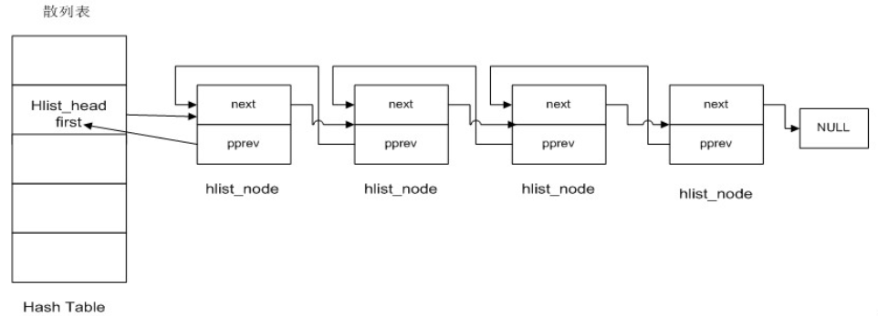

# 概述

内核散列表的实现称为 `hlist`，头文件为 `include/linux/list.h`。它的操作和内核链表基本一致，只是把函数名中的 `list`（`LIST`）替换成了 `hlist`（`HLIST`）。

内核散列表使用拉链法（链地址法）解决冲突，内核散列的实现是内核链表的修改版本，同样位于 `include/linux/list.h`。


```c
struct hlist_head {
	struct hlist_node *first;
};

struct hlist_node {
	struct hlist_node *next, **pprev;
};
```

散列表的表头和链表元素是不对称的，表头和链表只通过一个指针来关联。散列表不需要在常数时间内访问链表的末端。

链表元素依然却是包含两个指针的，值得注意的是，指向前一个结点（此处的结点可能是表头，也可能是链表元素）的指针是一个二级指针。

散列表通常是一个较大的数组，数组元素就是这里的 `struct hlist_head`。我们当然希望节省空间，所以表头只包含了一个指针（相比 `list_head` 每个表头节省一个指针的空间，占用空间变为了原本的一半）。

但这也就带来了新的问题，表头类型（`struct hlist_head`）和链表元素类型（`struct hlist_node`）不一样，链表元素没法像内核链表那样指向表头（内核链表的表头和链表元素类型都是 `struct list_head`）。

这里 `hlist_head` 使用 `first` 连接链表第一个元素，后面的元素都通过 `next` 连接，这样就形成了一个单链表。

`pprev` 是指向 `hlist_node *` 的指针，对于第一个元素，指向的是 `first`，就相当于指向了 `hlist_head`；后面每个元素都指向前一个元素的 `next`，也就相当于指回到前一个元素，这就达到了双向链表的目的。

 

理解了散列表实现，其实也就大概能知道其实现和内核链表差不太多。可以参考内核链表实现来分析。


# 初始化

## 表头

```c
*
 * Double linked lists with a single pointer list head.
 * Mostly useful for hash tables where the two pointer list head is
 * too wasteful.
 * You lose the ability to access the tail in O(1).
 */

#define HLIST_HEAD_INIT { .first = NULL }
#define HLIST_HEAD(name) struct hlist_head name = {  .first = NULL }
#define INIT_HLIST_HEAD(ptr) ((ptr)->first = NULL)
```


## 元素

```c
static inline void INIT_HLIST_NODE(struct hlist_node *h)
{
	h->next = NULL;
	h->pprev = NULL;
}
```


# 节点是否存在

```c
/* 判断节点h是否在散列表中 
 * 若不在，则返回1 
 * 否则，返回0 
 */  
static inline int hlist_unhashed(const struct hlist_node *h)  
{  
    return !h->pprev;  
} 
```


# 判断散列表是否为空

```c
/* 判断散列链表h是否为空  
 * 为空，则返回1 
 * 否则，返回0 
 */  
static inline int hlist_empty(const struct hlist_head *h)  
{  
    return !h->first;  
}  
```


# 添加元素

```c
// 添加节点到链表头
static inline void hlist_add_head(struct hlist_node *n, struct hlist_head *h)
{
	struct hlist_node *first = h->first;
	n->next = first;
	if (first)
		first->pprev = &n->next;
	h->first = n;
	n->pprev = &h->first;
}

/* next must be != NULL */
// 将节点 n 添加到 next 节点前
static inline void hlist_add_before(struct hlist_node *n,
					struct hlist_node *next)
{
	n->pprev = next->pprev;
	n->next = next;
	next->pprev = &n->next;
	*(n->pprev) = n;
}

// 将节点 n 添加到 next 节点后
static inline void hlist_add_behind(struct hlist_node *n,
				    struct hlist_node *prev)
{
	n->next = prev->next;
	prev->next = n;
	n->pprev = &prev->next;

	if (n->next)
		n->next->pprev  = &n->next;
}
```


# 删除元素

```c
static inline void __hlist_del(struct hlist_node *n)
{
	struct hlist_node *next = n->next;
	struct hlist_node **pprev = n->pprev;
	*pprev = next;
	if (next)
		next->pprev = pprev;
}

static inline void hlist_del(struct hlist_node *n)
{
	__hlist_del(n);
	n->next = LIST_POISON1;
	n->pprev = LIST_POISON2;
}

static inline void hlist_del_init(struct hlist_node *n)
{
	if (!hlist_unhashed(n)) {
		__hlist_del(n);
		INIT_HLIST_NODE(n);
	}
}
```


# 获取包含链表元素的数据结构

```c
#define hlist_entry(ptr, type, member) container_of(ptr,type,member)
```


# 遍历

```c
#define hlist_for_each(pos, head) \
	for (pos = (head)->first; pos ; pos = pos->next)

#define hlist_for_each_safe(pos, n, head) \
	for (pos = (head)->first; pos && ({ n = pos->next; 1; }); \
	     pos = n)

/**
 * hlist_for_each_entry	- iterate over list of given type
 * @pos:	the type * to use as a loop cursor.
 * @head:	the head for your list.
 * @member:	the name of the hlist_node within the struct.
 */
#define hlist_for_each_entry(pos, head, member)				\
	for (pos = hlist_entry_safe((head)->first, typeof(*(pos)), member);\
	     pos;							\
	     pos = hlist_entry_safe((pos)->member.next, typeof(*(pos)), member))

/**
 * hlist_for_each_entry_safe - iterate over list of given type safe against removal of list entry
 * @pos:	the type * to use as a loop cursor.
 * @n:		another &struct hlist_node to use as temporary storage
 * @head:	the head for your list.
 * @member:	the name of the hlist_node within the struct.
 */
#define hlist_for_each_entry_safe(pos, n, head, member) 		\
	for (pos = hlist_entry_safe((head)->first, typeof(*pos), member);\
	     pos && ({ n = pos->member.next; 1; });			\
	     pos = hlist_entry_safe(n, typeof(*pos), member))
```


