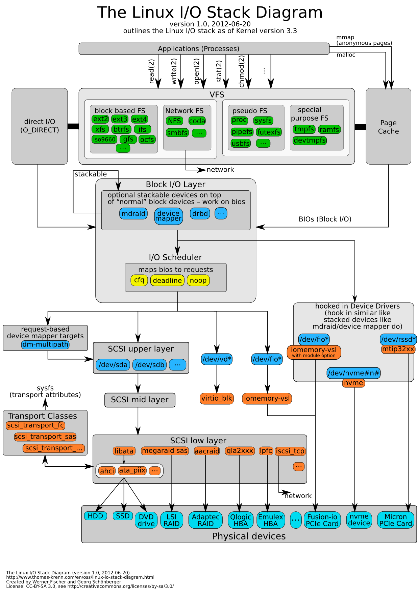
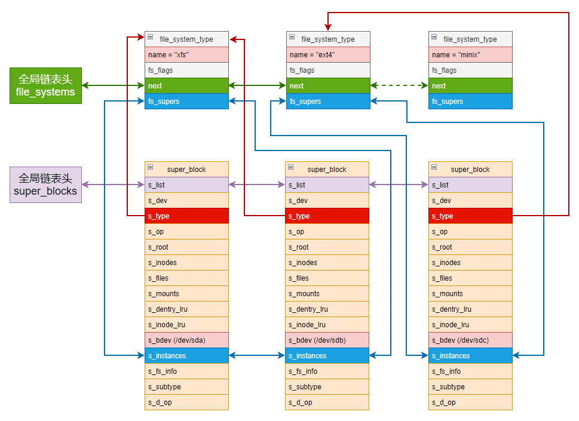
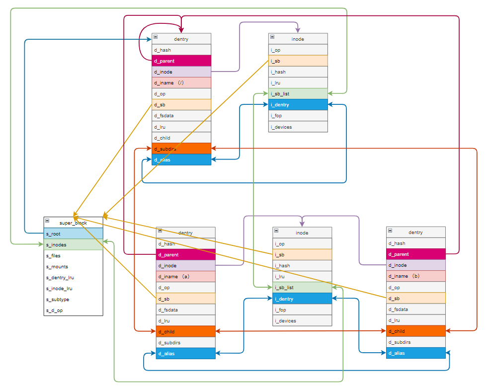
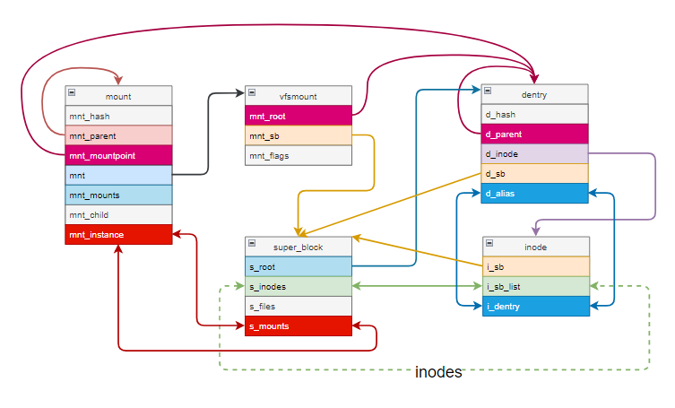
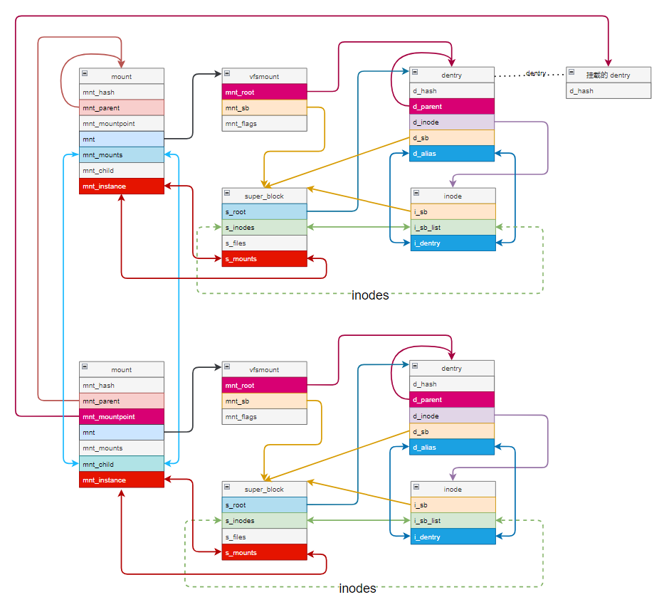
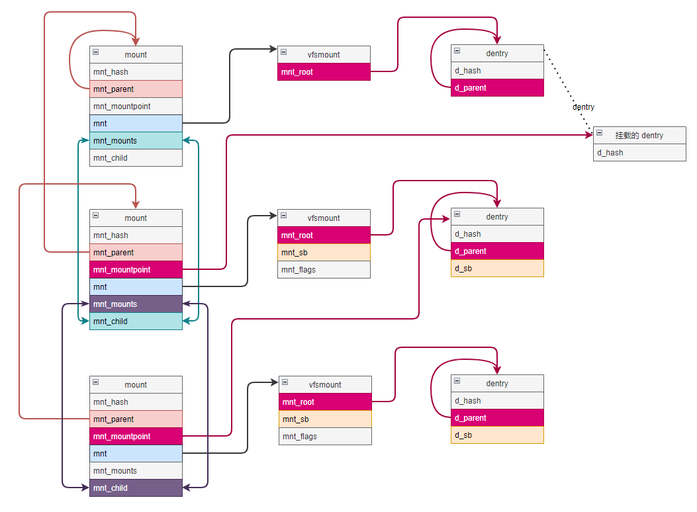
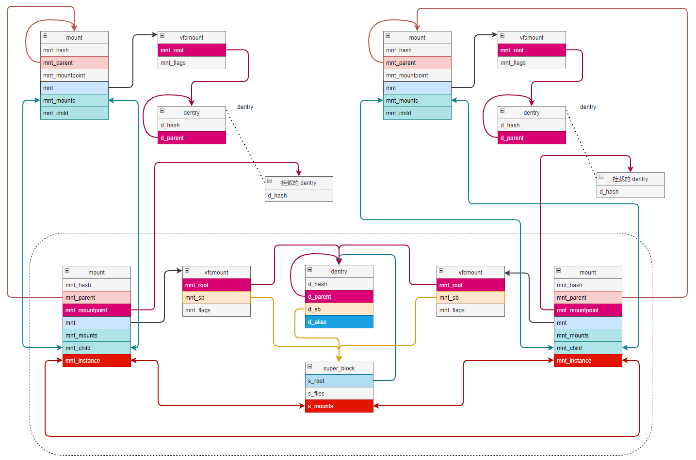

# VFS

本文基于 linux kernel 3.10 分析，首先我们简单介绍一下 VFS。

Linux 文件系统被分为两层，上层是**虚拟文件系统转换层（Virtual Filesystem Switch）**，简称 VFS。它是具体文件系统和上层应用之间的接口层，将各种不同文件系统的操作和管理纳入一个统一的框架，使得用户不需要关心各种不同文件系统的实现细节。

严格来说，**VFS 并不是一种实际的文件系统，它只存在于内存中**，在系统启动时建立，在系统关闭时消亡。

下图是 Linux kernel 3.3 IO 协议栈架构图，和我们分析的版本 IO 协议栈会有些区别，不过不影响我们讲解 VFS。



Linux 基于公共文件模型构造虚拟文件系统，这里所谓的公共文件模型有两个层次的含义：

-   对于上层应用，它意味着统一的系统调用，以及可预期的处理逻辑；
-   对于具体的文件系统，是各种具体对象的公共属性以及操作接口的提取。

在公共文件模型中，文件是文件系统最基本的单位，如同磁盘块之相对于磁盘设备。每个文件都有文件名，以方便用户引用其数据。此外文件还具有一些其他信息如创建日期，文件长度等文件属性。

**文件使用一种层次的方式来管理。**层次中的节点被称为目录，而叶子是文件。目录包含了一组文件和/或其他目录。包含在另一个目录下的目录被称为子目录，而前者称为父目录，这样就形成了一个层次的、或者成为树状的结构。最顶部的目录称为根（root）目录，它有点类似树的根，根目录没有父目录，或者说其父目录是它自己。

每个文件系统并不是独立使用的。相反，**系统有一个公共根目录和全局文件系统树**，要访问一个文件系统中的文件，必须先将这个文件系统放在全局文件系统树的某个目录下，这个过程被成为装载（`mount`），所装载的目录叫做装载点。

文件通过路径（path）来标识，路径指的是从文件系统树中的一个节点开始，到达另一个节点的通路。路径通常表示成中间所经过的节点的名字，加上分隔符，连接成字符串的形式。如果从根目录开始，则称为绝对路径，如果从某个特定目录开始，则称为相对路径。

下面我们来讲文件系统里一些重要的对象结构。


## file_system_type

Linux 支持多种文件系统，每种文件系统对应一个文件系统类型结构 file_system_type：

```c
struct file_system_type {
	const char *name;			// 文件系统类型名称
	int fs_flags;				// 文件系统类型标志
    
#define FS_REQUIRES_DEV		1 	// 文件系统必须在物理设备上
/* 
 * mount 此文件系统时（参见 mount_fs 函数 - fs/super.c）需要使用二进制数据结构的 mount data（如每个位域都有固定的位置和意义），
 * 常见的 nfs 使用这种 mount data（参见 struct nfs_mount_data 结构 - include/uapi/linux/nfs_mount.h）
 */
#define FS_BINARY_MOUNTDATA	2
/* 
 * 文件系统含有子类型，最常见的就是 FUSE，FUSE 本是不是真正的文件系统，
 * 所以要通过子文件系统类型来区别通过 FUSE 接口实现的不同文件系统。
 */
#define FS_HAS_SUBTYPE		4
// 文件系统每次挂载都后都是不同的 user namespace，如用于 devpts
#define FS_USERNS_MOUNT		8
#define FS_HAS_RM_XQUOTA	256
#define FS_HAS_INVALIDATE_RANGE	512
#define FS_HAS_DIO_IODONE2	1024
#define FS_HAS_NEXTDQBLK	2048
#define FS_HAS_DOPS_WRAPPER	4096	
// 文件系统将把重命名操作 reame() 直接按照移动操作 d_move() 来处理，主要用于网络文件系统
#define FS_RENAME_DOES_D_MOVE	32768
#define FS_HAS_WBLIST		131072

	// mount 时调用
	struct dentry *(*mount) (struct file_system_type *, int, const char *, void *);
	// 文件系统实例被卸载时调用
	void (*kill_sb) (struct super_block *);
	// 指向实现了这个文件系统的模块的指针，通常为 THIS_MODULE 宏
	struct module *owner;
	// 指向文件系统类型链表的下一个元素
	struct file_system_type * next;
	// 该文件系统类型的所有超级块实例链表头
	struct hlist_head fs_supers;

	// 以下用于调试锁依赖性
	struct lock_class_key s_lock_key;
	struct lock_class_key s_umount_key;
	struct lock_class_key s_vfs_rename_key;
	struct lock_class_key s_writers_key[SB_FREEZE_LEVELS];

	struct lock_class_key i_lock_key;
	struct lock_class_key i_mutex_key;
	struct lock_class_key i_mutex_dir_key;
};
```

所有的 file_system_type 都会被链入以 file_systems 为头的全局链表

```c
static struct file_system_type *file_systems;
```

该文件系统类型的所有超级块都被会链接到 fs_supers 表头。


## super_block

超级块是整个文件系统的元数据的容器。对于基于磁盘的文件系统，磁盘上会在固定位置保存超级块，在装载该磁盘的文件系统时，磁盘上的超级块被读入内存，并根据它构造内存中的超级块，其中一部分是各种文件系统共有的，被提取出来，即 VFS 超级块。

```c
struct super_block {
	// 链入到所有超级块对象链表（super_blocks）的连接件
	struct list_head	s_list;		/* Keep this first */
	// 存储超级块信息的块设备
	dev_t			s_dev;		/* search index; _not_ kdev_t */
	// 文件系统的块长度的位数
	unsigned char		s_blocksize_bits;
	// 文件系统的块字节大小
	unsigned long		s_blocksize;
	// 文件的最大长度
	loff_t			s_maxbytes;	
	struct file_system_type	*s_type;				// 指回到文件系统类型的指针
	const struct super_operations	*s_op;			// 超级块操作函数
	const struct dquot_operations	*dq_op;			// 指向磁盘配额操作表的指针
	const struct quotactl_ops	*s_qcop;			// 指向磁盘配额管理操作表的指针
	const struct export_operations *s_export_op;	// 指向导出操作表的指针，被网络文件系统使用
	unsigned long		s_flags;		// 装载标志
	unsigned long		s_magic;		// 文件系统魔数
	struct dentry		*s_root;		// 指向文件系统根目录的 dentry 对象
	struct rw_semaphore	s_umount;		// 用于卸载的信号量
	int			s_count;		// 引用计数器
    // 活动引用计数器。s_count 是真正的引用数，表示这个 superblock 能否被释放。s_active 表示被 mount 了多少次
	atomic_t		s_active;	
#ifdef CONFIG_SECURITY
	void                    *s_security;	// 指向 superblock 安全结构的指针
#endif
	const struct xattr_handler **s_xattr;	//指向超级块扩展属性结构的指针

	// 文件系统的所有 inode 链表的表头
	struct list_head	s_inodes;
	// 文件系统的匿名 dentry 哈希表头，用于处理远程网络文件系统
	struct hlist_bl_head	s_anon;		/* anonymous dentries for (nfs) exporting */
#ifdef __GENKSYMS__
#ifdef CONFIG_SMP
	struct list_head __percpu *s_files;	// 文件系统的所有打开文件链表表头
#else
	struct list_head	s_files;
#endif
#else
#ifdef CONFIG_SMP
	struct list_head __percpu *s_files_deprecated;
#else
	struct list_head	s_files_deprecated;
#endif
#endif
	struct list_head	s_mounts;
	// 文件系统未使用的 dentry 被链入到一个LRU链表中
	struct list_head	s_dentry_lru;
	// s_dentry_lru 的项数
	int			s_nr_dentry_unused;

	/* s_inode_lru_lock protects s_inode_lru and s_nr_inodes_unused */
	spinlock_t		s_inode_lru_lock ____cacheline_aligned_in_smp;
	// 文件系统未使用的 inode 被链入到一个 LRU 链表中
	struct list_head	s_inode_lru;		
	// s_inode_lru 的项数
	int			s_nr_inodes_unused;

	// 对于磁盘文件系统，为指向块设备描述符的指针，否则为 null
	struct block_device	*s_bdev;
	/* 
	 * 指向后备设备信息描述符的指针。
	 * 对于某些磁盘文件系统，指向块设备请求队列的内嵌后备设备信息；
	 * 某些网络文件系统会定义自己的后备设备信息，而其他文件系统可能使用空操作
	 */
	struct backing_dev_info *s_bdi;
	// 对于基于 MTD 的超级块，该域为指向 MTD 信息结构的指针
	struct mtd_info		*s_mtd;
	// 链入到所属文件系统类型的超级块实例链表（fs_supers）的连接件
	struct hlist_node	s_instances;
	// 磁盘配额信息描述符
	struct quota_info	s_dquot;	/* Diskquota specific options */

	struct sb_writers	s_writers;

	// 对于磁盘文件系统，为块设备名；否则为文件系统类型名
	char s_id[32];				/* Informational name */
	u8 s_uuid[16];				/* UUID */

	// 指向具体文件系统的超级块信息的指针
	void 			*s_fs_info;	/* Filesystem private info */
	unsigned int		s_max_links;
	// 对于磁盘文件系统，记录装载模式
	fmode_t			s_mode;

	u32		   s_time_gran;		// 文件系统时间戳粒度，以nm为单位

	// 跨目录重命名文件时使用的信号量，只限 VFS 内部使用
	struct mutex s_vfs_rename_mutex;	/* Kludge */

	char *s_subtype;

	/*
	 * 保存装载选项，以便以后显示，配合 generic_show_options 使用，
	 * 为不想实现更复杂的装载选项显示逻辑的文件系统使用
	 */
	char __rcu *s_options;
	// dentry 操作表
	const struct dentry_operations *s_d_op; /* default d_op for dentries */

	/*
	 * Saved pool identifier for cleancache (-1 means none)
	 */
	int cleancache_poolid;

	struct shrinker s_shrink;	/* per-sb shrinker handle */

	/* Number of inodes with nlink == 0 but still referenced */
	atomic_long_t s_remove_count;

	/* Being remounted read-only */
	int s_readonly_remount;

	/* AIO completions deferred from interrupt context */
	RH_KABI_EXTEND(struct workqueue_struct *s_dio_done_wq)
	RH_KABI_EXTEND(struct rcu_head rcu)
	RH_KABI_EXTEND(struct hlist_head s_pins)

	/* s_inode_list_lock protects s_inodes */
	RH_KABI_EXTEND(spinlock_t s_inode_list_lock)

	RH_KABI_EXTEND(struct mutex s_sync_lock) /* sync serialisation lock */

	RH_KABI_EXTEND(spinlock_t s_inode_wblist_lock)
	RH_KABI_EXTEND(struct list_head s_inodes_wb)	/* writeback inodes */

	RH_KABI_EXTEND(unsigned long	s_iflags)
	RH_KABI_EXTEND(struct user_namespace *s_user_ns)
};
```

从内核的角度来看，只有两种文件系统类型：FUSE 和 FUSEBLK。但是从用户的角度，可以有多种不同的文件系统类型。用户甚至都不关心这个文件系统是不是基于 FUSE，因此，基于 FUSE 的文件系统会用到子类型（s_subtype）。在 /proc/mounts 中显示为 type.subtype 的形式。

s_fs_info 域所指向的数据一般来说是为效率考虑而从磁盘上复制到内存中的信息。如果将 super_block 看作是文件系统共性的超级块结构，那么 s_fs_info 可以看作是反映文件系统个性的私有数据结构，当然还有另一个对应的操作表结构，由 s_op 指向的 super_operations：

```c
struct super_operations {
	// 这个方法被 VFS 核心调用，分配具体文件系统的 inode
	struct inode *(*alloc_inode)(struct super_block *sb);
	/* 
	 * 这个方法被 VFS 核心调用，销毁具体文件系统的 inode，和 alloc_inode 配套使用，
	 * 如果具体文件系统定义了自己的内存 inode，则需要实现这个函数，它回滚 alloc_inode 所做的操作，
	 * 如果具体文件系统没有定义自己的内存 inode，则不需要实现这个函数
	 */
	void (*destroy_inode)(struct inode *);

	/*
	 * 这个方法被 VFS 核心调用，以标记一个 inode 为脏，
	 * 某些具体的文件系统需要做特定的处理，因此需要实现这个方法，例如日志文件系统
	 */
	void (*dirty_inode) (struct inode *, int flags);
	/*
	 * 这个方法在 VFS 核心需要将 inode 信息写到磁盘上时调用，
	 * 第二个参数为指向回写控制描述符的指针，通常包含表明写操作是否需要同步的标志，
	 * 典型的文件系统的 write_inode 实现都不会执行 IO，只是将 blockdev 映射中的缓冲区标记为脏，
	 * 我们希望首先执行所有的“脏”动作，然后一次性通过 blockdev mapping 将所有这些 inode 块写回磁盘
	 */
	int (*write_inode) (struct inode *, struct writeback_control *wbc);
	// 这个方法在 inode 的最后一个引用释放时被调用
	int (*drop_inode) (struct inode *);
	void (*evict_inode) (struct inode *);
	// 在 VFS 核心释放超级块（umount）时被调用
	void (*put_super) (struct super_block *);
	// 在 VFS 核心正在写出和一个超级快关联的所有脏数据时被调用
	int (*sync_fs)(struct super_block *sb, int wait);
	// 在 VFS 核心锁住一个文件系统，强制使它进入一致状态时被调用
	int (*freeze_fs) (struct super_block *);
	int (*unfreeze_fs) (struct super_block *);
	// 在 VFS 核心需要获得文件系统统计信息时被调用
	int (*statfs) (struct dentry *, struct kstatfs *);
	// 在文件系统被重新装载时调用
	int (*remount_fs) (struct super_block *, int *, char *);
	// 在 VFS 核心正在卸载一个文件系统时被调用
	void (*umount_begin) (struct super_block *);

	// 如果文件系统接收装载选项，则必须实现这个回调函数，显示当前活动的选项
	int (*show_options)(struct seq_file *, struct dentry *);
	int (*show_devname)(struct seq_file *, struct dentry *);
	int (*show_path)(struct seq_file *, struct dentry *);
	// 显示文件系统信息，例如配置、性能等
	int (*show_stats)(struct seq_file *, struct dentry *);
#ifdef CONFIG_QUOTA
	ssize_t (*quota_read)(struct super_block *, int, char *, size_t, loff_t);
	ssize_t (*quota_write)(struct super_block *, int, const char *, size_t, loff_t);
#endif
	int (*bdev_try_to_free_page)(struct super_block*, struct page*, gfp_t);
	int (*nr_cached_objects)(struct super_block *);
	void (*free_cached_objects)(struct super_block *, int);
	RH_KABI_EXTEND(struct list_head *(*inode_to_wblist)(struct inode *))
	RH_KABI_EXTEND(struct inode *(*wblist_to_inode)(struct list_head *))
};
```

一个文件系统类型会有多个超级块实例，假如系统中有三个块设备 /dev/sda，/dev/sdb，/dev/sdc

其中 /dev/sda，/dev/sdb 格式化为 xfs 文件系统，/dev/sdc 格式化为 ext4 文件系统

那么 file_system_type 和 super_block 关系如下图：

 


## inode

inode 包含了文件系统各种对象（文件、目录、块设备文件、字符设备文件等）的元数据。对于基于磁盘的文件系统，inode 存在于磁盘上，其形式取决于具体的文件系统。在打开该对象进行访问时，其 inode 被读入内存。内存中 inode 有一部分是各种文件系统共有的，通常称为 VFS inode。

```c
struct inode {
	umode_t			i_mode;			// 文件类型和访问权限
	unsigned short		i_opflags;
	kuid_t			i_uid;			// 创建该文件的 uid
	kgid_t			i_gid;			// 创建该文件的 gid
	unsigned int		i_flags;	// 文件系统装载标志

#ifdef CONFIG_FS_POSIX_ACL
	struct posix_acl	*i_acl;
	struct posix_acl	*i_default_acl;
#endif

	const struct inode_operations	*i_op;	// 指向 inode 操作表的指针
	struct super_block	*i_sb;				// 指向所属 superblock 对象的指针
	struct address_space	*i_mapping;		// 指向 address_space 对象的指针

#ifdef CONFIG_SECURITY
	void			*i_security;			// 指向 inode 的安全结构的指针
#endif

	unsigned long		i_ino;				// inode 编号
	union {
		const unsigned int i_nlink;			// inode 的硬连接数
		unsigned int __i_nlink;
	};
	dev_t			i_rdev;				// 设备号，如果本 inode 代表一个块设备或字符设备
	loff_t			i_size;				// 以字节为单位的文件长度
	struct timespec		i_atime;		// 文件最后访问时间
	struct timespec		i_mtime;		// 文件最后修改时间
	struct timespec		i_ctime;		// inode 的最后修改时间
	// 用于保护 i_blocks, i_bytes, i_size 域的自旋锁
	spinlock_t		i_lock;	/* i_blocks, i_bytes, maybe i_size */
	unsigned short          i_bytes;	// 以 512 字节的块为单位，文件最后一个块的字节数
	unsigned int		i_blkbits;		// 文件块长度的位数
	blkcnt_t		i_blocks;			// 文件的块数

#ifdef __NEED_I_SIZE_ORDERED
	seqcount_t		i_size_seqcount;	// 被 SMP 系统用来正确获取和设置文件长度
#endif

	/* Misc */
	unsigned long		i_state;		// inode 状态标志
	struct mutex		i_mutex;

	// 表示这个文件第一次（即 inode 的某个 page）脏的时间，以 jiffies 为单位，
    // 它被 writeback 代码用于确定是否将这个 inode 写回磁盘
	unsigned long		dirtied_when;	/* jiffies of first dirtying */

	/* 
	 * 除根目录的 inode 外，所有 inode 链入到全局 inode_hashtable 哈希表中
	 * 其哈希索引项计算基于所属文件系统的超级块描述符地址以及 inode 编号
	 * 这个哈希表的作用是方便查找属于某个文件系统的特定的 inode
	 */
	struct hlist_node	i_hash;
	RH_KABI_RENAME(struct list_head i_wb_list,
		       struct list_head	i_io_list); /* backing dev IO list */
    // 链入到所属文件系统超级块 inode lru 链表(s_inode_lru)的连接件
	struct list_head	i_lru;		/* inode LRU list */
	// 链入到所属文件系统超级块的 inode 链表（s_inodes）的连接件
	struct list_head	i_sb_list;
	union {
		struct hlist_head	i_dentry;	// 引用这个 inode 的 dentry 的表头
		struct rcu_head		i_rcu;
	};
	u64			i_version;			// 版本号，在每次使用后递增
	// 使用计数器
	atomic_t		i_count;
	atomic_t		i_dio_count;
	atomic_t		i_writecount;
	// 指向文件操作表的指针
	const struct file_operations	*i_fop;	/* former ->i_op->default_file_ops */
	struct file_lock	*i_flock;
	// 文件的 address_space 对象
	struct address_space	i_data;
#ifdef CONFIG_QUOTA
	struct dquot		*i_dquot[MAXQUOTAS];	// inode 磁盘配额
#endif
	/* 
     * 如果这个 inode 代表一个块设备，则该域为链入到块设备的 slave inode（表头为 block device 结构的 bd_inodes 域）链表的连接件
     * 如果这个 inode 代表一个字符设备，则为链入到字符设备的 inode 链表（表头为 cdev 结构的 list 域）的连接件
     */
	struct list_head	i_devices;
	union {
		struct pipe_inode_info	*i_pipe;
		struct block_device	*i_bdev;
		struct cdev		*i_cdev;
	};

	__u32			i_generation;	// inode 的版本号，在某些文件系统中使用

#ifdef CONFIG_FSNOTIFY
	// 这个 inode 关心的所有事件
	__u32			i_fsnotify_mask; /* all events this inode cares about */
	RH_KABI_REPLACE(struct hlist_head i_fsnotify_marks,
			struct fsnotify_mark_connector __rcu *i_fsnotify_marks)
#endif

#ifdef CONFIG_IMA
	atomic_t		i_readcount; /* struct files open RO */
#endif
	// 用于文件系统或设备驱动的私有指针
	void			*i_private; /* fs or device private pointer */
};
```

依前例，inode 也有个性化的操作表结构，不过这里有所不同，它的操作表指针不止一个，而是两个，分别保存在 i_op 和 i_fop，分别是 inode 操作表（inode_operations）和文件操作表（file_operations）。

```c
struct inode_operations {
	/*
	 * 从文件系统中由父节点（inode）代表的那个目录中寻找当前节点（dentry）的目录项并设置结构中的其他信息，
	 * 且读入其索引节点，在内存中建立对应的 inode 结构。
	 * 该过程因文件系统而异，所以要通过父节点 inode->i_op 找到对应的操作。
	 * 该方法只对代表目录的 inode 有意义
	 */
	struct dentry * (*lookup) (struct inode *,struct dentry *, unsigned int);
	/*
	 * 该方法只对代表符号链接的 inode 有意义。
	 * 这个函数提取保存在符号链接 inode 中的路径名，将这个路径名保存在用于路径查询的中间结构中。
	 */
	void * (*follow_link) (struct dentry *, struct nameidata *);
	// 该方法适用于代表目录/常规文件和符号链接的 inode ，用来检查对某个 inode 是否有指定的权限
	int (*permission) (struct inode *, int);
	struct posix_acl * (*get_acl)(struct inode *, int);

	// 该方法只对代表符号链接的 inode 有效，用于读取符号链接内容
	int (*readlink) (struct dentry *, char __user *,int);
	// 该方法只对代表符号链接的 inode 有意义。用来释放 follow_link 函数中分配的临时空间。
	void (*put_link) (struct dentry *, struct nameidata *, void *);

	// 该方法只对代表目录的 inode 有意义，用来在该目录下创建常规文件
	int (*create) (struct inode *,struct dentry *, umode_t, bool);
	// 该方法只对代表目录的 inode 有意义，用来在该目录下创建硬链接
	int (*link) (struct dentry *,struct inode *,struct dentry *);
	// 该方法只对代表目录的 inode 有意义，用来在该目录下删除硬链接
	int (*unlink) (struct inode *,struct dentry *);
	// 该方法只对代表目录的 inode 有意义，用来在该目录下创建符号链接
	int (*symlink) (struct inode *,struct dentry *,const char *);
	// 该方法只对代表目录的 inode 有意义，用来在该目录下创建子目录
	int (*mkdir) (struct inode *,struct dentry *,umode_t);
	// 该方法只对代表目录的 inode 有意义，用来在该目录下删除子目录
	int (*rmdir) (struct inode *,struct dentry *);
	// 该方法只对代表目录的 inode 有意义，用来在该目录中创建一个块（或字符）设备
	int (*mknod) (struct inode *,struct dentry *,umode_t,dev_t);
	// 该方法只对代表目录的 inode 有意义，重命名
	int (*rename) (struct inode *, struct dentry *, struct inode *, struct dentry *);
	// 该方法适用于代表目录/常规文件和符号链接的 inode ，用于设置其属性
	int (*setattr) (struct dentry *, struct iattr *);
	// 该方法适用于代表目录/常规文件和符号链接的 inode ，用于获取其属性
	int (*getattr) (struct vfsmount *mnt, struct dentry *, struct kstat *);
	// 该方法适用于代表目录/常规文件和符号链接的 inode ，用于设置其扩展属性
	int (*setxattr) (struct dentry *, const char *,const void *,size_t,int);
	// 该方法适用于代表目录/常规文件和符号链接的 inode ，用于获取其扩展属性
	ssize_t (*getxattr) (struct dentry *, const char *, void *, size_t);
	// 该方法适用于代表目录/常规文件和符号链接的 inode ，用于列出其扩展属性
	ssize_t (*listxattr) (struct dentry *, char *, size_t);
	// 该方法适用于代表目录/常规文件和符号链接的 inode ，用于列出其扩展属性
	int (*removexattr) (struct dentry *, const char *);
	int (*fiemap)(struct inode *, struct fiemap_extent_info *, u64 start, u64 len);
	int (*update_time)(struct inode *, struct timespec *, int);
	int (*atomic_open)(struct inode *, struct dentry *,
			   struct file *, unsigned open_flag,
			   umode_t create_mode, int *opened);
} ____cacheline_aligned;


struct file_operations {
	struct module *owner;
	loff_t (*llseek) (struct file *, loff_t, int);
	ssize_t (*read) (struct file *, char __user *, size_t, loff_t *);
	ssize_t (*write) (struct file *, const char __user *, size_t, loff_t *);
	ssize_t (*aio_read) (struct kiocb *, const struct iovec *, unsigned long, loff_t);
	ssize_t (*aio_write) (struct kiocb *, const struct iovec *, unsigned long, loff_t);
	int (*readdir) (struct file *, void *, filldir_t);
	unsigned int (*poll) (struct file *, struct poll_table_struct *);
	long (*unlocked_ioctl) (struct file *, unsigned int, unsigned long);
	long (*compat_ioctl) (struct file *, unsigned int, unsigned long);
	int (*mmap) (struct file *, struct vm_area_struct *);
	int (*open) (struct inode *, struct file *);
	int (*flush) (struct file *, fl_owner_t id);
	int (*release) (struct inode *, struct file *);
	int (*fsync) (struct file *, loff_t, loff_t, int datasync);
	int (*aio_fsync) (struct kiocb *, int datasync);
	int (*fasync) (int, struct file *, int);
	int (*lock) (struct file *, int, struct file_lock *);
	ssize_t (*sendpage) (struct file *, struct page *, int, size_t, loff_t *, int);
	unsigned long (*get_unmapped_area)(struct file *, unsigned long, unsigned long, unsigned long, unsigned long);
	int (*check_flags)(int);
	int (*flock) (struct file *, int, struct file_lock *);
	ssize_t (*splice_write)(struct pipe_inode_info *, struct file *, loff_t *, size_t, unsigned int);
	ssize_t (*splice_read)(struct file *, loff_t *, struct pipe_inode_info *, size_t, unsigned int);
	RH_KABI_REPLACE(int (*setlease)(struct file *, long, struct file_lock **), int (*setlease)(struct file *, long, struct file_lock **, void **))
	long (*fallocate)(struct file *file, int mode, loff_t offset,
			  loff_t len);
	int (*show_fdinfo)(struct seq_file *m, struct file *f);
	RH_KABI_EXTEND(int (*iterate) (struct file *, struct dir_context *))
};
```


## dentry

dentry 虽然翻译为目录项，但它和文件系统中的目录并不是同一个概念。事实上，dentry 属于所有文件系统对象，包括目录，常规文件，符号链接，块设备文件，字符设备文件等，反映的是文件系统对象在内核中所在文件系统树中的位置。

因为 inode 反映的是文件系统对象的元数据，而 dentry 则表示文件系统对象在文件系统树中的位置。

```c
struct dentry {
	// dentry cache 标志
	unsigned int d_flags;		
    // 顺序锁
	seqcount_t d_seq;		
	// 链入到全局 dentry hashtable 或超级块的匿名 dentry 哈希链表的连接件，根 dentry 除外
	struct hlist_bl_node d_hash;	
	// 父目录的 dentry 描述符，如果是根 dentry ，指向它自身
	struct dentry *d_parent;	
	// 本 dentry 所表示对象的文件名/长度/文件名的哈希值等信息
	struct qstr d_name;
	// 这个 dentry 对象所关联的 inode 描述符
	struct inode *d_inode;		
	// 用于保存短文件名
	unsigned char d_iname[DNAME_INLINE_LEN];	

	/* Ref lookup also touches following */
	struct lockref d_lockref;	/* per-dentry lock and refcount */
	// 指向 dentry 操作表的指针
	const struct dentry_operations *d_op;
	// 指向本 dentry 所属文件系统超级块描述符的指针
	struct super_block *d_sb;	
	// 被 d_revalidate 函数用来判断dentry是否还有效的依据
	unsigned long d_time;		
	// 指向具体文件系统的 dentry 信息的指针
	void *d_fsdata;			

	// 文件系统未使用的 dentry 被链入到一个LRU链表中
	struct list_head d_lru;		
	/*
	 * d_child and d_rcu can share memory
	 */
	union {
		// 链入父 dentry 的 d_subdirs 链表的连接件
		struct list_head d_child;	
	 	struct rcu_head d_rcu;
	} d_u;
	// 这个 dentry 的子 dentry 链表的表头
	struct list_head d_subdirs;
	// 链入到所属 inode 的 i_dentry（别名）链表的连接件
	struct hlist_node d_alias;	
};
```

dentry 和 inode 是多对一的关系。

每个 dentry 只有一个 inode，由 d_inode 指向，而一个 inode 可能对应多个 dentry（例如硬链接），它将这些 dentry 组成以 i_dentry 的链表，每个 dentry 通过 d_alias 加入到所属 inode 的 i_dentry 链表中。

从目录树的角度看，dentry 有父子关系。dentry 的 d_parent 指向父 dentry 的指针，如果是根则指向它自己。每个 dentry 的所有子 dentry 组织在以 d_subdirs 为首的链表中，子 dentry 通过 d_child 链入其中。

除根 dentry 外，所有 dentry 加入到一个 dentry hashtable 全局哈希表中，其哈希值索引计算基于父 dentry 描述符的地址以及它的文件名哈希值，因此这个哈希表的作用就是方便查找给定目录下的文件。

假设根目录 / 底下有两个文件，a 是普通文件，b 是 a 的硬链接文件，那么关系如下：

 

dentry 的个性化操作表 dentry_operations：

```c
struct dentry_operations {
	/*
	 * 这个方法在路径查找时从 dentry 缓存中找到目录项之后，它被用来检查这个目录项是否依然有效，因为它们可能在 VFS 之外被删除。
	 * 若无效，则需要作废缓存中的目录项，根据磁盘上的内容重新构造。
	 */
	int (*d_revalidate)(struct dentry *, unsigned int);
	int (*d_weak_revalidate)(struct dentry *, unsigned int);
	/*
	 * 在路径查找时，为提高效率，首先比较目录项的哈希值，然后比较目录项的字符串。
	 * 这个函数用来计算给定名字字符串的哈希值。
	 * 如果未定义此回调函数，将采用默认的算法，如果某些文件系统希望采用不同的算法则需要实现这个函数
	 */
	int (*d_hash)(const struct dentry *, struct qstr *);
	/*
	 * 这个函数用在路径查找时比较两个字符串。
	 * 如果未定义此回调函数，则使用默认行为，即按内存比较。
	 * 某些文件系统可能重新实现来达到特定的比较，如 JFS 比较忽略大小写
	 */
	int (*d_compare)(const struct dentry *, const struct dentry *,
			unsigned int, const char *, const struct qstr *);
	/*
	 * 在 dentry 的最后一个引用被删除时调用。
	 * 如果未定义回调则使用默认行为，即将 dentry 保留在 dentry 缓存中
	 */
	int (*d_delete)(const struct dentry *);
	/*
	 * 在 dentry 真正被销毁时使用，对于大多数文件系统都不需要实现此函数。
	 * 但是某些文件系统在每个 dentry 带有特定信息，则应该在这个回调函数中处理。
	 */
	void (*d_release)(struct dentry *);
	void (*d_prune)(struct dentry *);
	/*
	 * 在 dentry 失去和 inode 关联时被调用。
	 * 如果未定义回调则使用默认行为，即调用 iput 递减 inode 的引用，并在引用计数为 0 时，准备释放甚至销毁这个 inode。
	 * 某些文件系统需要做一些其他的处理，例如 sysfs 要释放关联 sysfs_dirent 的引用，则必须实现此回调函数
	 */
	void (*d_iput)(struct dentry *, struct inode *);
	/* 在需要为 dentry 生成路径名时被调用。在某些伪文件系统（sockfs/pipefs 等）中使用延迟路径名生成 */
	char *(*d_dname)(struct dentry *, char *, int);
	struct vfsmount *(*d_automount)(struct path *);
	RH_KABI_REPLACE(int (*d_manage)(struct dentry *, bool),
			int (*d_manage)(const struct path *, bool))
} ____cacheline_aligned;
```


## vfsmount

前面讲到的这些都是某个或者说是局部文件系统的概念。在 linux 中，文件系统在使用前必须先装载。

在比较老的内核代码里没有 stuct mount，mount 和 vfsmount 的成员都在 vfsmount 里，现在 linux 将 vfsmount 拆分出 mount 结构体，这样使得 vfsmount 的内容更加精简，在很多情况下只需要传递 vfsmount 而已。

vfsmount 对象反映一个已装载的文件系统实例。linux 内核代码可以用过 vfsmount 访问这个文件系统实例。

但是如果要被用户空间访问，则需要将它装载到全局文件系统树中，形成其中的一个子树。这时候 vfsmount 对象就变成了用于将每个局部文件系统链接到全局文件系统树的连接件。

```c
struct vfsmount {
    /* 指向这个文件系统根目录 dentry 的指针 */
	struct dentry *mnt_root;
    /* 指向这个文件系统的超级块对象的指针 */
	struct super_block *mnt_sb;
    /* 装载标志 */
	int mnt_flags;
}
```

### mount

```c
struct mount {
	/* 链入全局已装载文件系统哈希表的连接件 */
	struct hlist_node mnt_hash;
	/* 指向这个文件系统被装载到的父文件系统的指针 */
	struct mount *mnt_parent;
	/* 指向这个文件系统被装载到的装载点目录的 dentry 指针 */
	struct dentry *mnt_mountpoint;
	/* 这个结构关联的 vfsmount 结构体 */
	struct vfsmount mnt;
	union {
		struct rcu_head mnt_rcu;
		struct llist_node mnt_llist;
	};
#ifdef CONFIG_SMP
	struct mnt_pcp __percpu *mnt_pcp;
#else
    /* 使用计数器 */
	int mnt_count;
	int mnt_writers;
#endif
	/* 装载到这个文件系统的目录上所有子文件系统的链表的表头，下面的节点都是 mnt_child */
	struct list_head mnt_mounts;	
	/* 链接到被装载到的父文件系统 mnt_mounts 链表的连接件 */
	struct list_head mnt_child;	
	/* 链接到 sb->s_mounts 上的一个 mount 实例 */
	struct list_head mnt_instance;	
	/* 保存文件系统的块设备的设备文件名 */
	const char *mnt_devname;	
	/* 链入到进程名字空间中已装载文件系统链表的连接件，链表头为 mnt_namespace 结构的 list 域 */
	struct list_head mnt_list;
	/* 链入到文件系统专有的过期链表的连接件，用于 NFS/CIFS 等网络文件系统 */
	struct list_head mnt_expire;	
	/* 
	 * 链入到共享装载循环链表的连接件。
	 * 阐述 propagation 的概念。
	 * 所有在一个对等组（Peer Group）中共享的 vfsmount 通过 mnt_share 构成一个循环链表
	 */
	struct list_head mnt_share;	/* circular list of shared mounts */
	/* 这个文件系统的 slave_mount 链表的表头 */
	struct list_head mnt_slave_list;/* list of slave mounts */
	/* 链入到 master 文件系统的 slave mount 链表的连接件 */
	struct list_head mnt_slave;	/* slave list entry */
	/* 指向 master 文件系统的指针。阐述 master 文件系统和 slave mount 的概念 */
	struct mount *mnt_master;	/* slave is on master->mnt_slave_list */
	/* 指向包含了这个文件系统的进程名字空间的指针 */
	struct mnt_namespace *mnt_ns;	/* containing namespace */
	struct mountpoint *mnt_mp;	/* where is it mounted */
	struct hlist_node mnt_mp_list;	/* list mounts with the same mountpoint */
#ifdef CONFIG_FSNOTIFY
	RH_KABI_REPLACE(struct hlist_head mnt_fsnotify_marks,
		     struct fsnotify_mark_connector __rcu *mnt_fsnotify_marks)
	__u32 mnt_fsnotify_mask;
#endif
	/* 装载标识符 */
	int mnt_id;			/* mount identifier */
	int mnt_group_id;		/* peer group identifier */
	/* 如果为 1，表示这个已装载文件系统被标记为过期 */
	int mnt_expiry_mark;		/* true if marked for expiry */
	struct hlist_head mnt_pins;
	struct fs_pin mnt_umount;
	struct dentry *mnt_ex_mountpoint;
	RH_KABI_EXTEND(struct list_head mnt_umounting)	/* list entry for umount propagation */
};
```

同 dentry 一样，我们也可以为 mount 定义父子关系，如果一个文件系统实例被装载到另一个文件系统实例的装载点上，则前者的 mount 称为子 mount，后者称为父 mount。

被装载到 linux 根目录 / 上的文件系统即根文件系统。

mnt_parent 域是指向父 mount 的指针，对于根 mount 其 mnt_parent 指向自身。

每个父 mount 将所有子 mount 通过双向循环链表连接起来，这个链表头保存在 mnt_mounts 域中，每个子 mount 链入到这个链表的连接件是 mnt_child 域。

除了根 mount 以外，所有的 mount 加入到一个 mount_hashtable 全局哈希表中，其哈希项的索引计算基于父 mount 描述符的地址以及它在父文件系统中的装载点 dentry 描述符的地址。因此，这个哈希表的作用就是方便查找装载到特定装载点路径的文件系统。

体现一个文件系统装载实例的要素是 vfsmount，mount，superblock，根 dentry 和根 inode，关系如下图：

 


### 基础的装载

我们先来讲一个最简单的装载，即将某个设备的文件系统装载到全局文件系统的某个目录下，装载后关系如下：

-   子文件系统 mount 的 mnt_parent 描述符指向父文件系统的 mount 结构体
-   子文件系统 mount 的 mnt_mountpoint 描述符指向父文件系统装载点的 dentry 描述符
-   子文件系统 mount 结构体以 mnt_child 为连接件链入父文件系统 mount 结构体以 mnt_mounts 为表头的链表中
-   mnt_hash 链入到全局哈希表中

 

在装载时，原来的装载点目录不一定为空，它可能包含其他的子目录或文件。装载的动作将使得这些子目录和文件被隐藏起来。

父文件系统装载点 dentry 和 子文件系统根 dentry 是两个文件系统下的，不同的 dentry，虽然从全局来看他们是一个路径名。比如在根文件系统的 /a/b 目录下挂载一个 xfs 文件系统，对于根文件系统来说，b 目录是 /a/b ，对于 xfs 来说，b 是它的 / 目录。

那么这里怎么知道某个 dentry 下装载了文件系统呢？后面我们分析路径查找时会看到，所有的 dentry 都加入全局哈希表 mount_hashtable，所以只需要判断 <vfsmount，dentry> 二元组是否在哈希表里就可以知道是否是装载点，其下挂载的文件系统都在对应的哈希链表里。


### 多文件系统同一装载点

当两个文件系统先后挂载到同一装载点时，后面装载的文件系统不是装载到根目录挂载的 dentry 上，而是**最近装载的文件系统的根 dentry**，关系如下图：

 


### 单文件系统多装载点

同一个文件系统也可以多次装载到不同路径，一个文件系统实例对应一个 super_block，但是因为挂载了两次，所有每一次挂载对应一个挂载实例 struct mount，也就是有两个 mount 实例。

此外同一个文件系统只有一个根，也就是两个挂载实例公用一个根 dentry。但是因为挂载在两个不同的路经下，所以每个挂载实例的 mnt_mountpoint 指向不同的 dentry。



​	


---

# VFS 装载流程

## register_filesystem

所有的文件系统都会先进行注册，file_systems 是一个全局变量，是链接所有已注册文件系统链表的链表头，这个函数就是遍历 file_systems 链表检查是否有同名的，没找到在 break 的时候就是指向 NULL 的指针（p 本身不是 NULL），返回后 register_filesystem 判断返回值，找到重复的就返回错误，否则就链入到尾端。

```c
// 所有的文件系统都会链入到这个单链表里
static struct file_system_type *file_systems;

int register_filesystem(struct file_system_type * fs)
{
	int res = 0;
	struct file_system_type ** p;

	BUG_ON(strchr(fs->name, '.'));
	if (fs->next)
		return -EBUSY;
	write_lock(&file_systems_lock);
	p = find_filesystem(fs->name, strlen(fs->name));
	if (*p)
		res = -EBUSY;
	else
		*p = fs;
	write_unlock(&file_systems_lock);
	return res;
}

static struct file_system_type **find_filesystem(const char *name, unsigned len)
{
	struct file_system_type **p;
	for (p=&file_systems; *p; p=&(*p)->next)
		if (strlen((*p)->name) == len &&
		    strncmp((*p)->name, name, len) == 0)
			break;
	return p;
}
```

以 XFS 的 file_system_type 为例，name 表明是 xfs，fs_flags 表明文件系统的属性，是用在存储设备上的文件系统。

最重要的是两个回调函数 mount 和 kill_sb。分别在 mount 和 umount 时调用。

```c
static struct file_system_type xfs_fs_type = {
	.owner			= THIS_MODULE,
	.name			= "xfs",
	.mount			= xfs_fs_mount,
	.kill_sb		= kill_block_super,
	.fs_flags		= FS_REQUIRES_DEV | FS_HAS_RM_XQUOTA |
				  FS_HAS_INVALIDATE_RANGE | FS_HAS_DIO_IODONE2 |
				  FS_HAS_NEXTDQBLK | FS_HAS_WBLIST,
};
```


## mount 系统调用

一般我们可以类似这样挂载一个文件系统：

```bash
mount -t xfs /dev/vda /mnt -o ...
```

-t 指定 /dev/vda 上的文件系统类型，如果不使用 -t 则 mount 命令也可以尝试探测 device 上的文件系统类型。

-o 用来指定一些额外的（非默认的）挂载选项。

上面这个命令翻译成人话就是：请把 /dev/vda 上的 XFS 文件系统挂载到 /mnt 上，并在挂载时使能 -o 里的特性。

这是从一个命令的角度来看 mount 操作，那么一个命令的最终执行还得是陷入内核后执行的系统调用，来看一下 mount 系统调用的定义 (man 2 mount)：

```bash
# yum install man-pages
# man 2 mount
MOUNT(2)                    Linux Programmer's Manual                    MOUNT(2)

NAME
       mount - mount file system

SYNOPSIS
       #include <sys/mount.h>

       int mount(const char *source, const char *target,
                 const char *filesystemtype, unsigned long mountflags,
                 const void *data);
```

和上面的命令行对应一下，source 对应 /dev/vda，target 对应 /mnt，filesystemtype 对应 -t xfs，但是还剩下两个参数 mountflags 和 data，可是我们只剩下一个 -o 选项了，这是怎么回事呢？

别急，我们先抛开 mountflags 和 data 看一下 mount 系统调用怎么用。

```bash
[root@centos ~]# mkfs.xfs -f /dev/vda 
meta-data=/dev/vda               isize=512    agcount=4, agsize=65536 blks
         =                       sectsz=512   attr=2, projid32bit=1
         =                       crc=1        finobt=0, sparse=0
data     =                       bsize=4096   blocks=262144, imaxpct=25
         =                       sunit=0      swidth=0 blks
naming   =version 2              bsize=4096   ascii-ci=0 ftype=1
log      =internal log           bsize=4096   blocks=2560, version=2
         =                       sectsz=512   sunit=0 blks, lazy-count=1
realtime =none                   extsz=4096   blocks=0, rtextents=0
[root@centos ~]# mkdir -p /mnt/a
[root@centos ~]# cat mount_syscall.c 
#include <sys/mount.h>  
#include <stdio.h>  

int main(int argc, char *argv[]) {  
        if (mount("/dev/vda", "/mnt/a", "xfs", 0, NULL)) {  
                perror("mount failed");  
        }

        return 0;  
}
[root@centos ~]# gcc -Wall -o mount_syscall mount_syscall.c 
[root@centos ~]# ./mount_syscall 
[root@centos ~]# cat /proc/mounts | grep vda
/dev/vda /mnt/a xfs rw,seclabel,relatime,attr2,inode64,noquota 0 0
```

我们使用 mount 系统调用的前三个参数，不带任何挂载选项就可以挂载文件系统。那么后面两个参数是什么呢？


## mountflags 和 data

实际上 mountflags  + data 对应 mount 命令的所有 -o 选项。那怎么区分哪些属于 mountflags 哪些属于 data 呢？

在深入内核代码一探究竟之前我们可以通俗的认为 mountflags 就是所有文件系统通用的挂载选项，由 VFS 层解析。

data 是每个文件系统特有的挂载选项，由文件系统自己解析。

由于每个文件系统特有的选项都各有不同，具体有哪些可以参考 (man 8 mount)，以及每个文件系统各自的 man page。在此我们先说一下通用的 mountflags，在内核中有对 mountflags 的宏定义，如下 include/uapi/linux/fs.h：

```c
/*
 * These are the fs-independent mount-flags: up to 32 flags are supported
 */
#define MS_RDONLY	 1			/* 对应-o ro/rw */
#define MS_NOSUID	 2			/* 对应-o suid/nosuid */
#define MS_NODEV	 4			/* 对应-o dev/nodev */
#define MS_NOEXEC	 8			/* 对应-o exec/noexec */
#define MS_SYNCHRONOUS	16		/* 对应-o sync/async */ 
#define MS_REMOUNT	32			/* 对应-o remount，告诉 mount 这是一次 remount 操作 */
#define MS_MANDLOCK	64			/* 对应-o mand/nomand */
#define MS_DIRSYNC	128			/* 对应-o dirsync */
#define MS_NOATIME	1024		/* 对应-o atime/noatime */
#define MS_NODIRATIME	2048	/* 对应-o diratime/nodiratime */
#define MS_BIND		4096		/* 对应-B/--bind选项，告诉 mount 这是一次 bind 操作 */
#define MS_MOVE		8192		/* 对应-M/--move，告诉 mount 这是一次move操作 */
#define MS_REC		16384		/* rec是 recursive 的意思，这个 flag 一般不单独出现，都是伴随这其它 flag，表示递归的进行操作 */  
#define MS_VERBOSE	32768		/* 对应-v/--verbose */
#define MS_SILENT	32768		/* 对应-o silent/loud */
#define MS_POSIXACL	(1<<16)		/* 让VFS不应用 umask，如 NFS */ 
#define MS_UNBINDABLE	(1<<17)	/* 对应--make-unbindable */
#define MS_PRIVATE	(1<<18)		/* 对应--make-private */
#define MS_SLAVE	(1<<19)		/* 对应--make-slave */
#define MS_SHARED	(1<<20)		/* 对应--make-shared */
#define MS_RELATIME	(1<<21)		/* 对应-o relatime/norelatime */
#define MS_KERNMOUNT	(1<<22) /* 这个一般不在应用层使用，一般内核挂载的文件系统如 sysfs 使用，表示使用 kern_mount() 进行挂载 */
#define MS_I_VERSION	(1<<23) /* 对应-o iversion/noiversion */ 
#define MS_STRICTATIME	(1<<24) /* 对应-o strictatime/nostrictatime */

/*
 * 下面这几个 flags 都是内核内部使用的，不由 mount 系统调用传递
 */
#define MS_SUBMOUNT     (1<<26)
#define MS_NOREMOTELOCK	(1<<27)
#define MS_NOSEC	(1<<28)
#define MS_BORN		(1<<29)
#define MS_ACTIVE	(1<<30)
#define MS_NOUSER	(1<<31)
```

除了上面这些 flags 对应的 mount 选项，剩下的基本就是 data 来传递。我们选一个是 flag 的 mount option，如 nodev。再选一个 XFS 支持的非通用 mount option，如 noquota。

通过 strace 来看一下 nodev 和 noquota 对应 mount 系统调用的哪个参数：

```bash
strace mount /dev/vda /mnt/a -o nodev,noquota
```

可以看到输出里有这么一行：

```text
...
mount("/dev/vda", "/mnt/a", "xfs", MS_MGC_VAL|MS_NODEV, "noquota") = 0
...
```

可见如我们所料，nodev 传递给了第 4 个参数 mountflags，noquota 传递给了第 5 个参数 data。

注意 data 参数是 void * 指针类型的参数，这表示它不一定接受的是字符串类型的变量，有些文件系统会将 data 定义为结构体格式，或其它什么格式。然后在挂载时解开这个格式分析出里面的选项。所以第 5 个参数传什么还要看你第 3 个参数是什么文件系统。


## 系统调用入口

来自 fs/namespace.c：mount 的五个参数中的四个指针参数所对应的内容还处在用户层（__user）

-   dev_name（source）是设备文件路径名
-   dirname（target）是文件系统被装载到的目标路径名
-   type（filesystemtype）为文件系统类型
-   flags（mountflags） 为装载标志
-   data（data）为文件系统特定的参数

copy_mount_string 将用户层的内容拷贝到内核层（至于 dir_name 为什么没有被这样处理我们下面再说），然后就是调用 do_mount 做下面的工作。

```c
// mount 系统调用函数原型
int mount(const char *source, const char *target,
                 const char *filesystemtype, unsigned long mountflags,
                 const void *data);

// 内核系统调用实现
SYSCALL_DEFINE5(mount, char __user *, dev_name, char __user *, dir_name,
		char __user *, type, unsigned long, flags, void __user *, data)
{
	int ret;
	char *kernel_type;
	char *kernel_dev;
	void *options;

	kernel_type = copy_mount_string(type);
	ret = PTR_ERR(kernel_type);
	if (IS_ERR(kernel_type))
		goto out_type;

	kernel_dev = copy_mount_string(dev_name);
	ret = PTR_ERR(kernel_dev);
	if (IS_ERR(kernel_dev))
		goto out_dev;

	options = copy_mount_options(data);
	ret = PTR_ERR(options);
	if (IS_ERR(options))
		goto out_data;

	ret = do_mount(kernel_dev, dir_name, kernel_type, flags, options);

	kfree(options);
out_data:
	kfree(kernel_dev);
out_dev:
	kfree(kernel_type);
out_type:
	return ret;
}
```


## do_mount

path 是内核做路径名操作的常用结构体，结构体定义如下：

```c
struct path {
	struct vfsmount *mnt;
	struct dentry *dentry;
};
```

根据 <vfsmount，dentry> 二元组可以表示一个路径。

```c
long do_mount(const char *dev_name, const char __user *dir_name,
		const char *type_page, unsigned long flags, void *data_page)
{
	struct path path;
	int retval = 0;
	int mnt_flags = 0;

	/* Discard magic */
	if ((flags & MS_MGC_MSK) == MS_MGC_VAL)
		flags &= ~MS_MGC_MSK;

	/* Basic sanity checks */
	if (data_page)
		((char *)data_page)[PAGE_SIZE - 1] = 0;

	/* 
	 * 上面为什么没有对 dir_name 做 copy_mount_string 操作， 答案在这。
	 * 这里用 user_path 直接将 dir_name 转成 struct path 的格式放入内核层。
	 */
	retval = user_path(dir_name, &path);
	if (retval)
		return retval;

    /* 这里和 LSM 有关，是另外话题 */
	retval = security_sb_mount(dev_name, &path,
				   type_page, flags, data_page);
	if (!retval && !may_mount())
		retval = -EPERM;
    /* 如果 flags 使能 SB_MANDLOCK，检查当前 kernel 是否支持 MANDATORY_FILE_LOCKING */
	if (!retval && (flags & MS_MANDLOCK) && !may_mandlock())
		retval = -EPERM;
	if (retval)
		goto dput_out;

	/* Default to relatime unless overriden */
	if (!(flags & MS_NOATIME))
		mnt_flags |= MNT_RELATIME;

    /* 处理 flag */
	/* Separate the per-mountpoint flags */
	if (flags & MS_NOSUID)
		mnt_flags |= MNT_NOSUID;
	if (flags & MS_NODEV)
		mnt_flags |= MNT_NODEV;
	if (flags & MS_NOEXEC)
		mnt_flags |= MNT_NOEXEC;
	if (flags & MS_NOATIME)
		mnt_flags |= MNT_NOATIME;
	if (flags & MS_NODIRATIME)
		mnt_flags |= MNT_NODIRATIME;
	if (flags & MS_STRICTATIME)
		mnt_flags &= ~(MNT_RELATIME | MNT_NOATIME);
	if (flags & MS_RDONLY)
		mnt_flags |= MNT_READONLY;

    /* 和 remount 相关的处理 */
	/* The default atime for remount is preservation */
	if ((flags & MS_REMOUNT) &&
	    ((flags & (MS_NOATIME | MS_NODIRATIME | MS_RELATIME |
		       MS_STRICTATIME)) == 0)) {
		mnt_flags &= ~MNT_ATIME_MASK;
		mnt_flags |= path.mnt->mnt_flags & MNT_ATIME_MASK;
	}

    /* 和 mnt_flags 已有的标志位分离一下 */
	flags &= ~(MS_NOSUID | MS_NOEXEC | MS_NODEV | MS_ACTIVE | MS_BORN |
		   MS_NOATIME | MS_NODIRATIME | MS_RELATIME| MS_KERNMOUNT |
		   MS_STRICTATIME | MS_NOREMOTELOCK | MS_SUBMOUNT);

    /* 
     * 下面根据 flags 的标记，决定是做下面哪种 mount 操作。
     * do_new_mount 是最普通，我们最常见的 mount。
     * bind，move，remount 以及和 shared-sub-tree 有关操作的含义参见
     * 相关man page以及Documentation/filesystems/sharedsubtree.txt相关文档。
     */
	if (flags & MS_REMOUNT)
		retval = do_remount(&path, flags & ~MS_REMOUNT, mnt_flags,
				    data_page);
	else if (flags & MS_BIND)
		retval = do_loopback(&path, dev_name, flags & MS_REC);
	else if (flags & (MS_SHARED | MS_PRIVATE | MS_SLAVE | MS_UNBINDABLE))
		retval = do_change_type(&path, flags);
	else if (flags & MS_MOVE)
		retval = do_move_mount(&path, dev_name);
	else
		retval = do_new_mount(&path, type_page, flags, mnt_flags,
				      dev_name, data_page);
dput_out:
	path_put(&path);
	return retval;
}
```

从 do_mount 的代码可以看出它主要就是：

1.  将 dir_name 解析为 path 格式到内核
2.  一路解析 flags 位表
3.  根据 flags 中的标记，决定下面做哪一个 mount 操作。

这里就追踪最普通的 mount 操作向下看，即 do_new_mount。


## do_new_mount

do_new_mount 这里原来的五个参数变成了六个参数，flags 被分成了两部分，dir_name 也变成了 path 结构

```c
/*
 * create a new mount for userspace and request it to be added into the
 * namespace's tree
 */
static int do_new_mount(struct path *path, const char *fstype, int flags,
			int mnt_flags, const char *name, void *data)
{
	struct file_system_type *type;
	struct vfsmount *mnt;
	int err;

	if (!fstype)
		return -EINVAL;

    /* 
     * 它是根据文件系统名称找到对应的已注册的 file_system_type 实例。
     * 这个实例里有一个很重要的东西就是 mount 回调函数。
     */
	type = get_fs_type(fstype);
	if (!type)
		return -ENODEV;

    /* 
     * 这个地方是很重要的一步，也是我们第一次接触 vfsmount 这个结构的地方。
     * 先简单来说 vfs_kern_mount 会调用特定文件系统类型(type里)的 mount 回调函数构建好一个 vfsmount 结构。
     * 具体怎么做的我们等下面讲 vfsmount 的时候再说。
     */
	mnt = vfs_kern_mount(type, flags, name, data);
    /* 如果此文件系统还有子类型（多见于FUSE），设置子文件系统类型名（superblock 中的 s_subtype） */
	if (!IS_ERR(mnt) && (type->fs_flags & FS_HAS_SUBTYPE) &&
	    !mnt->mnt_sb->s_subtype)
		mnt = fs_set_subtype(mnt, fstype);

    /* 就此 file_system_type 用完了（其 mount 回调函数完成了构建 struct mount 的任务）*/
	put_filesystem(type);
	if (IS_ERR(mnt))
		return PTR_ERR(mnt);

	if (mount_too_revealing(mnt, &mnt_flags)) {
		mntput(mnt);
		return -EPERM;
	}

    /*
     * 将得到的 vfsmount 对应的 mount 结构加入全局目录树。
     * 注意 path 变量，也就是 mountpoint 在这里
     */
	err = do_add_mount(real_mount(mnt), path, mnt_flags);
	if (err)
		mntput(mnt);
	return err;
}
```

到此有两个重要的地方：vfs_kern_mount 和 do_add_mount。

struct mount 代表着一个 mount 实例 (一次真正挂载对应一个 mount 实例)，过去没有 stuct mount，mount 和 vfsmount 的成员都在 vfsmount 里，现在 linux 将 vfsmount 拆分出 mount 结构体，这样使得 vfsmount 的内容更加精简，在很多情况下只需要传递 vfsmount 而已。两个结构体结构可以见上文。

vfs_kern_mount 得到一个 vfsmount (以及一个半初始化 struct mount)。

在这里先知道，在全局文件系统（目录结构）树上一个文件的位置不是由 dentry 唯一确定，因为有了挂载关系，一切都变的复杂了，比如一个文件系统可以挂装载到不同的挂载点。所以文件系统树的一个位置要由 <mount, dentry> 二元组或者说 <vfsmount, dentry> 来确定。

do_add_mount 将上面得到的 vfsmount 结构加入全局目录树。


## vfs_kern_mount

vfs_kern_mount 的任务就是**构建文件系统装载实例，即构建 vfsmount，mount，super_block，根 dentry 和根 inode 之间的关系**。

上面我们已经分析过这几者之间的关系，读者可以结合之前的关系图来理解代码。

```c
struct vfsmount *
vfs_kern_mount(struct file_system_type *type, int flags, const char *name, void *data)
{
	struct mount *mnt;
	struct dentry *root;

	if (!type)
		return ERR_PTR(-ENODEV);

    // 分配一个新的 struct mount 结构，并初始化里面一部分（如链表指针、mnt_devname等成员内容）
	mnt = alloc_vfsmnt(name);
	if (!mnt)
		return ERR_PTR(-ENOMEM);

	if (flags & MS_KERNMOUNT)
		mnt->mnt.mnt_flags = MNT_INTERNAL;

    // 调用具体文件系统的 mount 回调函数 type->mount，继续挂载操作
	root = mount_fs(type, flags, name, data);
	if (IS_ERR(root)) {
		mnt_free_id(mnt);
		free_vfsmnt(mnt);
		return ERR_CAST(root);
	}

    // 完成 mount 结构的最后赋值，并返回 vfsmount 结构
	mnt->mnt.mnt_root = root;
	mnt->mnt.mnt_sb = root->d_sb;
    // 这里先指向自身，后面加入全局文件系统树时再设置
	mnt->mnt_mountpoint = mnt->mnt.mnt_root;
	mnt->mnt_parent = mnt;
	lock_mount_hash();
	list_add_tail(&mnt->mnt_instance, &root->d_sb->s_mounts);
	unlock_mount_hash();
	return &mnt->mnt;
}
```

vfs_kern_mount 主要完成三件事：

1.   alloc_vfsmnt 创造一个新的 struct mount 结构

2.   在 mount_fs 函数里调用特定文件系统的 mount 回调函数构造一个 root dentry，包含特定文件系统的 super block 信息

3.   用第二步得到的结果完成对 struct mount 的构造，返回 vfsmount 结构。

我们一个一个来看。


### alloc_vfsmnt

mount 结构体是一个纯内存中的元素，和文件系统类型无关，这里初始化一个 mount 结构体并初始化其中的变量。

```c
static struct mount *alloc_vfsmnt(const char *name)
{
	struct mount *mnt = kmem_cache_zalloc(mnt_cache, GFP_KERNEL);
	if (mnt) {
		int err;

		err = mnt_alloc_id(mnt);
		if (err)
			goto out_free_cache;

		if (name) {
			mnt->mnt_devname = kstrdup_const(name, GFP_KERNEL);
			if (!mnt->mnt_devname)
				goto out_free_id;
		}

#ifdef CONFIG_SMP
		mnt->mnt_pcp = alloc_percpu(struct mnt_pcp);
		if (!mnt->mnt_pcp)
			goto out_free_devname;

		this_cpu_add(mnt->mnt_pcp->mnt_count, 1);
#else
		mnt->mnt_count = 1;
		mnt->mnt_writers = 0;
#endif

		INIT_HLIST_NODE(&mnt->mnt_hash);
		INIT_LIST_HEAD(&mnt->mnt_child);
		INIT_LIST_HEAD(&mnt->mnt_mounts);
		INIT_LIST_HEAD(&mnt->mnt_list);
		INIT_LIST_HEAD(&mnt->mnt_expire);
		INIT_LIST_HEAD(&mnt->mnt_share);
		INIT_LIST_HEAD(&mnt->mnt_slave_list);
		INIT_LIST_HEAD(&mnt->mnt_slave);
		INIT_HLIST_NODE(&mnt->mnt_mp_list);
		INIT_LIST_HEAD(&mnt->mnt_umounting);
		init_fs_pin(&mnt->mnt_umount, drop_mountpoint);
	}
	return mnt;

#ifdef CONFIG_SMP
out_free_devname:
	kfree_const(mnt->mnt_devname);
#endif
out_free_id:
	mnt_free_id(mnt);
out_free_cache:
	kmem_cache_free(mnt_cache, mnt);
	return NULL;
}
```


### mount_fs

```c
struct dentry *
mount_fs(struct file_system_type *type, int flags, const char *name, void *data)
{
	struct dentry *root;
	struct super_block *sb;
	char *secdata = NULL;
	int error = -ENOMEM;

	if (data && !(type->fs_flags & FS_BINARY_MOUNTDATA)) {
		secdata = alloc_secdata();
		if (!secdata)
			goto out;

		error = security_sb_copy_data(data, secdata);
		if (error)
			goto out_free_secdata;
	}

	root = type->mount(type, flags, name, data);
	if (IS_ERR(root)) {
		error = PTR_ERR(root);
		goto out_free_secdata;
	}
	sb = root->d_sb;
	BUG_ON(!sb);
	WARN_ON(!sb->s_bdi);
	WARN_ON(sb->s_bdi == &default_backing_dev_info);

	/*
	 * Write barrier is for prune_super(). We place it before setting
	 * MS_BORN as the data dependency between the two functions is the
	 * superblock structure contents that we just set up, not the MS_BORN
	 * flag.
	 */
	smp_wmb();
	sb->s_flags |= MS_BORN;

	error = security_sb_kern_mount(sb, flags, secdata);
	if (error)
		goto out_sb;

	/*
	 * filesystems should never set s_maxbytes larger than MAX_LFS_FILESIZE
	 * but s_maxbytes was an unsigned long long for many releases. Throw
	 * this warning for a little while to try and catch filesystems that
	 * violate this rule.
	 */
	WARN((sb->s_maxbytes < 0), "%s set sb->s_maxbytes to "
		"negative value (%lld)\n", type->name, sb->s_maxbytes);

	up_write(&sb->s_umount);
	free_secdata(secdata);
	return root;
out_sb:
	dput(root);
	deactivate_locked_super(sb);
out_free_secdata:
	free_secdata(secdata);
out:
	return ERR_PTR(error);
}
```

这个函数看似复杂，其实主要就做一件事，调用 type->mount 回调函数。我们以 xfs 为例，在 xfs_fs_type 中可以看到 xfs_fs_mount 是 xfs 自己实现 mount 回调函数，其实现就是调用 mount_bdev() 函数。

```c
STATIC struct dentry *
xfs_fs_mount(
	struct file_system_type	*fs_type,
	int			flags,
	const char		*dev_name,
	void			*data)
{
	return mount_bdev(fs_type, flags, dev_name, data, xfs_fs_fill_super);
}
```

VFS 提供了几种通用函数实现供具体的文件系统调用：

-   mount_bdev ：装载驻留在块设备上的文件系统，即磁盘文件系统。同一块设备使用相同的超级块实例，不同的块设备使用不同的超级块实例。
-   mount_nodev：装载非磁盘文件系统，每次装载都使用一个新的超级块实例
-   mount_single：装载非磁盘文件系统，所有的装载都使用一个超级块实例
-   mount_fs：TODO
-   mount_ns：TODO

但是这里有一个需要注意的地方就是 mount_bdev 虽然是一个通用函数，但是其最后一个参数是一个函数指针，xfs 传入 xfs_fs_fill_super 作为参数。

xfs_fs_fill_super 是 xfs 实现的一个只适用于 xfs 的函数，也就是这里还是需要一个每个文件系统各异的 fill_super 处理函数。

下面将分别对 mount_bdev 和 xfs_fs_fill_super 两个函数进行分析。


#### mount_bdev

```c
struct dentry *mount_bdev(struct file_system_type *fs_type,
	int flags, const char *dev_name, void *data,
	int (*fill_super)(struct super_block *, void *, int))
{
	struct block_device *bdev;
	struct super_block *s;
	fmode_t mode = FMODE_READ | FMODE_EXCL;
	int error = 0;

	if (!(flags & MS_RDONLY))
		mode |= FMODE_WRITE;

    /* 
     * 通过 dev_name 设备名（如/dev/sda1）得到对应的 block_device 结构
     * 首先是一个路径查找的过程，lookup_bdev 调用 kern_path() 得到 struct path
     * 然后以 path.dentry->d_inode 为参数调用 bd_acquire 得到 block_device 结构
     */
	bdev = blkdev_get_by_path(dev_name, mode, fs_type);
	if (IS_ERR(bdev))
		return ERR_CAST(bdev);

	/* 防止对已经 freeze（比如因为快照原因） 的文件设备进行装载 */
	mutex_lock(&bdev->bd_fsfreeze_mutex);
	if (bdev->bd_fsfreeze_count > 0) {
		mutex_unlock(&bdev->bd_fsfreeze_mutex);
		error = -EBUSY;
		goto error_bdev;
	}
    /* 
     * 因为一个设备可能已经被挂载过了
     * sget 检查内存中是否已经有合适的超级块实例。具体见下面分析 
     */
	s = sget(fs_type, test_bdev_super, set_bdev_super, flags | MS_NOSEC, bdev);
	mutex_unlock(&bdev->bd_fsfreeze_mutex);
	if (IS_ERR(s))
		goto error_s;

    /* 判断得到的 sb 是一个已经存在的还是一个新的 sb。已经存在的 sb 的 s_root 已经被初始化了，新的 sb 的 s_root 还是空 */
	if (s->s_root) {
        /* 
         * 如果存在超级块实例，说明之前已经被装载过
         * 这里判断此次的挂载 flag 是否和之前的挂载有读/写冲突，如果有冲突则返回错误
         */
		if ((flags ^ s->s_flags) & MS_RDONLY) {
			deactivate_locked_super(s);
			error = -EBUSY;
			goto error_bdev;
		}

		/*
		 * s_umount nests inside bd_mutex during
		 * __invalidate_device().  blkdev_put() acquires
		 * bd_mutex and can't be called under s_umount.  Drop
		 * s_umount temporarily.  This is safe as we're
		 * holding an active reference.
		 */
		up_write(&s->s_umount);
        /* 
         * 因为已经有了之前存在的 sb，也就是 block_dev 之前也分配过了，所以这个新的 bdev 就可以释放了。
         * 这里对应前面的 blkdev_get_by_path
         */
		blkdev_put(bdev, mode);
		down_write(&s->s_umount);
	} else {
		char b[BDEVNAME_SIZE];

		s->s_mode = mode;
		strlcpy(s->s_id, bdevname(bdev, b), sizeof(s->s_id));
		sb_set_blocksize(s, block_size(bdev));
        /* 
         * 设置了 sb 的 mode, id, blocksize 后，就到了 fill_super 的时候了。
         * fill_super 是一个函数参数，它由具体文件系统自己实现，如 xfs 就实现了 xfs_fs_fill_super。
         */
		error = fill_super(s, data, flags & MS_SILENT ? 1 : 0);
		if (error) {
			deactivate_locked_super(s);
			goto error;
		}

		s->s_flags |= MS_ACTIVE;
		bdev->bd_super = s;
	}

	return dget(s->s_root);

error_s:
	error = PTR_ERR(s);
error_bdev:
	blkdev_put(bdev, mode);
error:
	return ERR_PTR(error);
}
```

mount_bdev 函数的主要逻辑就是这样的：

-   blkdev_get_by_path 根据设备名得到 block_device 结构
-   sget 得到已经存在或者新分配的 super_block 结构
-   如果是已经存在的 sb，就释放第一步得到的 bdev 结构
-   如果是新的 sb，就调用特定文件系统实现的 fill_super 函数继续处理新的 sb，并创建根 inode，dentry
-   返回得到的根 dentry

可以看到 fill_super 函数将完成 mount 接下来重要的工作，在分析 xfs 是如何做 fill_super 处理之前，我们先来分析一下 sget 函数。

sget 有五个参数，第一个参数指向文件系统类型的指针。

第二个参数是匹配超级块的函数，即比较超级块的 s_bdev 域是否等于传入的块设备描述符的地址。

```c
static int test_bdev_super(struct super_block *s, void *data)
{
	return (void *)s->s_bdev == data;
}
```

第三个参数在没有找到匹配的超级块实例分配一个新的超级块时，将它与传入的块设备描述符关联起来。

```c
static int set_bdev_super(struct super_block *s, void *data)
{
	s->s_bdev = data;
	s->s_dev = s->s_bdev->bd_dev;

	/*
	 * We set the bdi here to the queue backing, file systems can
	 * overwrite this in ->fill_super()
	 */
	s->s_bdi = &bdev_get_queue(s->s_bdev)->backing_dev_info;
	return 0;
}
```

第四个参数是标志，第五个参数指向块设备描述符的指针。


sget 这个函数的功能是检查内存中是否已经有合适的超级块实例，可以看出 sget 最终调用了 sget_userns 函数：

```c
/**
 *	sget	-	find or create a superblock
 *	@type:	  filesystem type superblock should belong to
 *	@test:	  comparison callback
 *	@set:	  setup callback
 *	@flags:	  mount flags
 *	@data:	  argument to each of them
 */
struct super_block *sget(struct file_system_type *type,
			int (*test)(struct super_block *,void *),
			int (*set)(struct super_block *,void *),
			int flags,
			void *data)
{
	struct user_namespace *user_ns = current_user_ns();

	/* We don't yet pass the user namespace of the parent
	 * mount through to here so always use &init_user_ns
	 * until that changes.
	 */
	if (flags & MS_SUBMOUNT)
		user_ns = &init_user_ns;

	/* Ensure the requestor has permissions over the target filesystem */
	if (!(flags & (MS_KERNMOUNT|MS_SUBMOUNT)) && !ns_capable(user_ns, CAP_SYS_ADMIN))
		return ERR_PTR(-EPERM);

	return sget_userns(type, test, set, flags, user_ns, data);
}
```

我们来看看 sget_userns 函数：

```c
/**
 *	sget_userns -	find or create a superblock
 *	@type:	filesystem type superblock should belong to
 *	@test:	comparison callback
 *	@set:	setup callback
 *	@flags:	mount flags
 *	@user_ns: User namespace for the super_block
 *	@data:	argument to each of them
 */
struct super_block *sget_userns(struct file_system_type *type,
			int (*test)(struct super_block *,void *),
			int (*set)(struct super_block *,void *),
			int flags, struct user_namespace *user_ns,
			void *data)
{
	struct super_block *s = NULL;
	struct super_block *old;
	int err;

	if (!(flags & (MS_KERNMOUNT|MS_SUBMOUNT)) &&
	    !(type->fs_flags & FS_USERNS_MOUNT) &&
	    !capable(CAP_SYS_ADMIN))
		return ERR_PTR(-EPERM);
retry:
	spin_lock(&sb_lock);
	if (test) {
        /* 遍历 fs_supers 来找寻匹配的超级块 */
		hlist_for_each_entry(old, &type->fs_supers, s_instances) {
			if (!test(old, data))
				continue;
			if (user_ns != old->s_user_ns) {
				spin_unlock(&sb_lock);
				if (s) {
					up_write(&s->s_umount);
					destroy_super(s);
				}
				return ERR_PTR(-EBUSY);
			}
			if (!grab_super(old))
				goto retry;
			if (s) {
				up_write(&s->s_umount);
				destroy_super(s);
				s = NULL;
			}
            /* 匹配成功则返回已存在的 sb */
			return old;
		}
	}
	if (!s) {
		spin_unlock(&sb_lock);
        /* 分配一个新的 sb */
		s = alloc_super(type, (flags & ~MS_SUBMOUNT), user_ns);
		if (!s)
			return ERR_PTR(-ENOMEM);
		goto retry;
	}
    
	/* 关联 sb 和 bdev	*/
	err = set(s, data);
	if (err) {
		spin_unlock(&sb_lock);
		up_write(&s->s_umount);
		destroy_super(s);
		return ERR_PTR(err);
	}
	s->s_type = type;
	strlcpy(s->s_id, type->name, sizeof(s->s_id));
    /* 加入全局 super_blocks 链表和对应文件系统 fs_supers 链表 */
	list_add_tail(&s->s_list, &super_blocks);
	hlist_add_head(&s->s_instances, &type->fs_supers);
	spin_unlock(&sb_lock);
	get_filesystem(type);
	register_shrinker(&s->s_shrink);
	return s;
}
```

到此就得到了一个已知的或新的 super_block 实例，如果是一个新的超级块，那么需要填充这个 super_block 的内容即调用 xfs_fs_fill_super 回调函数来实现。


#### xfs_fs_fill_super

```c
STATIC int
xfs_fs_fill_super(
	struct super_block	*sb,
	void			*data,
	int			silent)
{
	struct inode		*root;
	struct xfs_mount	*mp = NULL;
	int			flags = 0, error = -ENOMEM;

    /* xfs_mount 是 xfs 私有的 mount 结构 */
	mp = kzalloc(sizeof(struct xfs_mount), GFP_KERNEL);
	if (!mp)
		goto out;

	spin_lock_init(&mp->m_sb_lock);
	mutex_init(&mp->m_growlock);
	atomic_set(&mp->m_active_trans, 0);
    /* 延时工作队列 */
	INIT_DELAYED_WORK(&mp->m_reclaim_work, xfs_reclaim_worker);
	INIT_DELAYED_WORK(&mp->m_eofblocks_work, xfs_eofblocks_worker);
	mp->m_kobj.kobject.kset = xfs_kset;

    /*
     * s_fs_info 是 super_block 结构中代表具体文件系统实现的超级块信息的指针，
     * 所以这个 xfs_mount(mp) 存储着 xfs 的超级块信息，这个信息是 xfs 特有的。
     */
	mp->m_super = sb;
	sb->s_fs_info = mp;

    /* 解析 xfs 特有的挂载选项，存储在 mp 里 */
	error = xfs_parseargs(mp, (char *)data);
	if (error)
		goto out_free_fsname;

    /* 设置 sb 的最小 blocksize */
	sb_min_blocksize(sb, BBSIZE);
    /* 设置 sb 的扩展属性的处理函数 */
	sb->s_xattr = xfs_xattr_handlers;
    /* 设置 export 操作的处理函数 */
	sb->s_export_op = &xfs_export_operations;
#ifdef CONFIG_XFS_QUOTA
    /* 设置 quota 的处理函数 */
	sb->s_qcop = &xfs_quotactl_operations;
#endif
    /* 设置 super block 的操作函数 */
	sb->s_op = &xfs_super_operations;

	/*
	 * Delay mount work if the debug hook is set. This is debug
	 * instrumention to coordinate simulation of xfs mount failures with
	 * VFS superblock operations
	 */
	if (xfs_globals.mount_delay) {
		xfs_notice(mp, "Delaying mount for %d seconds.",
			xfs_globals.mount_delay);
		msleep(xfs_globals.mount_delay * 1000);
	}

	if (silent)
		flags |= XFS_MFSI_QUIET;
    
	/* 这里是在处理指定了 xfs 的 log 或 realtime volumes 的情况，data volume 之前已经处理了 */
	error = xfs_open_devices(mp);
	if (error)
		goto out_free_fsname;

    /* 创建很多工作队列，如 log, data 的工作队列 */
	error = xfs_init_mount_workqueues(mp);
	if (error)
		goto out_close_devices;

	error = xfs_init_percpu_counters(mp);
	if (error)
		goto out_destroy_workqueues;

	/* Allocate stats memory before we do operations that might use it */
	mp->m_stats.xs_stats = alloc_percpu(struct xfsstats);
	if (!mp->m_stats.xs_stats) {
		error = -ENOMEM;
		goto out_destroy_counters;
	}

    /* 读 super block 的信息，主要存储在 mp->m_sb 里，xfs_sb 是 xfs superblock 的 on disk 结构 */
	error = xfs_readsb(mp, flags);
	if (error)
		goto out_free_stats;

	error = xfs_finish_flags(mp);
	if (error)
		goto out_free_sb;

    /* 
     * 根据上面读出的 super block 的信息，设置 xfs 的 buffer target 结构
     * 首先是 data device 的，然后判断是否有 log 或 realtime volumes，如果有也初始化它们的 buffer target
     */
	error = xfs_setup_devices(mp);
	if (error)
		goto out_free_sb;

    /* 为这个 mount 结构创建 MRU cache，为文件流操作使用 */
	error = xfs_filestream_mount(mp);
	if (error)
		goto out_free_sb;

	/*
	 * we must configure the block size in the superblock before we run the
	 * full mount process as the mount process can lookup and cache inodes.
	 */
    // 根据上面读出的 super block 的内容继续进行设置
	sb->s_magic = XFS_SB_MAGIC;
	sb->s_blocksize = mp->m_sb.sb_blocksize;
	sb->s_blocksize_bits = ffs(sb->s_blocksize) - 1;
	sb->s_maxbytes = xfs_max_file_offset(sb->s_blocksize_bits);
	sb->s_max_links = XFS_MAXLINK;
	sb->s_time_gran = 1;
	set_posix_acl_flag(sb);

	/* version 5 superblocks support inode version counters. */
	if (XFS_SB_VERSION_NUM(&mp->m_sb) == XFS_SB_VERSION_5)
		sb->s_flags |= MS_I_VERSION;

	if (mp->m_flags & XFS_MOUNT_DAX) {
		static bool printed = false;
		bool rtdev_is_dax = false, datadev_is_dax;

		xfs_warn(mp,
		"DAX enabled. Warning: EXPERIMENTAL, use at your own risk");

		datadev_is_dax = bdev_dax_supported(mp->m_ddev_targp->bt_bdev,
			sb->s_blocksize);
		if (mp->m_rtdev_targp)
			rtdev_is_dax = bdev_dax_supported(
				mp->m_rtdev_targp->bt_bdev, sb->s_blocksize);
		if (!rtdev_is_dax && !datadev_is_dax) {
			xfs_alert(mp,
			"DAX unsupported by block device. Turning off DAX.");
			mp->m_flags &= ~XFS_MOUNT_DAX;
		}

		if (!printed) {
			mark_tech_preview("xfs direct access (dax)", NULL);
			printed = true;
		}
	}

    /* 内存中的根 inode 在这里通过 xfs_iget 得到 */
	error = xfs_mountfs(mp);
	if (error)
		goto out_filestream_unmount;

	root = igrab(VFS_I(mp->m_rootip));
	if (!root) {
		error = -ENOENT;
		goto out_unmount;
	}
    
    /* 根 dentry 在这里创建，并关联根 inode */
	sb->s_root = d_make_root(root);
	if (!sb->s_root) {
		error = -ENOMEM;
		goto out_unmount;
	}

    /* 至此 struct mount 初始化完毕 */
	return 0;

 out_filestream_unmount:
	xfs_filestream_unmount(mp);
 out_free_sb:
	xfs_freesb(mp);
 out_free_stats:
	free_percpu(mp->m_stats.xs_stats);
 out_destroy_counters:
	xfs_destroy_percpu_counters(mp);
 out_destroy_workqueues:
	xfs_destroy_mount_workqueues(mp);
 out_close_devices:
	xfs_close_devices(mp);
 out_free_fsname:
	sb->s_fs_info = NULL;
	xfs_free_fsname(mp);
	kfree(mp);
 out:
	return error;

 out_unmount:
	xfs_filestream_unmount(mp);
	xfs_unmountfs(mp);
	goto out_free_sb;
}
```

xfs_fs_fill_super 实际上已经涉及到很多 xfs 相关的具体 ondisk 知识，再往下还会有更具体的 device、和内存等相关的知识。

对于 xfs 文件系统是如何实现的，那将是很大篇幅的内容，本文就不再往深入多做赘余，以免扰乱主线的逻辑。


## do_add_mount 

vfs_kern_mount 在构造了一个装载实例之后返回了一个 struct vfsmount 结构体的指针，我们上面说了 vfsmount 是 mount 结构体中的一个成员。

```c
/*
 * add a mount into a namespace's mount tree
 */
static int do_add_mount(struct mount *newmnt, struct path *path, int mnt_flags)
{
	struct mountpoint *mp;
	struct mount *parent;
	int err;

	mnt_flags &= ~MNT_INTERNAL_FLAGS;

    /* 
     * 这里不是简单的加锁，如果 path 上挂载了很多文件系统，
     * 那么这里就是要找出最新一次挂载到其上的文件系统的根路径，
     * 这才是我们这个文件系统要挂载到的 mountpoint
     * 为了便于理解，我们可以看一下这段代码的逻辑在以前是这样的：
     *     while(do_mountpoint(path->dentry) && follow_down(path));
     * 注意结尾有一个分号，也就是说这里要不断循环的做 follow_down 操作，直到找到最后挂载上去的文件系统。
     * 现在这些逻辑，加上锁操作都放到了下面这个不是很起眼的 lock_mount 函数里了。
     */
	mp = lock_mount(path);
	if (IS_ERR(mp))
		return PTR_ERR(mp);

    /* 通过 vfsmount 找到 mount */
	parent = real_mount(path->mnt);
    /*
     * 从这里开始有很多检查，如检查装载实例应该属于本进程的装载名字空间
     * 装载名字空间是为了让不同的进程可以看到不一样的文件系统装载而引入的
     */
	err = -EINVAL;
	if (unlikely(!check_mnt(parent))) {
		/* that's acceptable only for automounts done in private ns */
		if (!(mnt_flags & MNT_SHRINKABLE))
			goto unlock;
		/* ... and for those we'd better have mountpoint still alive */
		if (!parent->mnt_ns)
			goto unlock;
	}

	/* Refuse the same filesystem on the same mount point */
	err = -EBUSY;
    /* 不允许同一个（注意“个”不是“种”）文件系统挂载到同一个挂载点，因为这样做实在没有什么用 */
	if (path->mnt->mnt_sb == newmnt->mnt.mnt_sb &&
	    path->mnt->mnt_root == path->dentry)
		goto unlock;

	err = -EINVAL;
    /* 新文件系统的挂载实例的根 inode 不应该是一个符号链接 */
	if (S_ISLNK(newmnt->mnt.mnt_root->d_inode->i_mode))
		goto unlock;

    /* 最后 graft_tree 就是把 newmnt 加入到全局文件系统树中 */
	newmnt->mnt.mnt_flags = mnt_flags;
	err = graft_tree(newmnt, parent, mp);

unlock:
	unlock_mount(mp);
	return err;
}
```

do_add_mount 函数主要做两件事：

1.  lock_mount 确定本次挂载要挂载到哪个父挂载实例 parent 的哪个挂载点 mp 上。
2.  把 newmnt 挂载到 parent 的 mp 下，完成 newmnt 到全局的安装。

所以说有两个地方是重要的，一个是 lock_mount，一个是 graft_tree。


### lock_mount

lock_mount 是第一个要说的地方，上面说了他的作用不是简单的 lock 那么简单，在 lock 之前它完成了一个很重要的工作，那就是确定 mountpoint 的最终位置。可能这样说很难理解，我们来举了例子，比如我们本来要执行的命令是：

```sh
# mount -t xfs /dev/sdc1 /mnt
```

这样看 mountpoint 就是 /mnt，对吗？

不能说不对，但是不够准确。当多个文件系统挂载到同一个路径名下时，后挂载的文件系统会在挂载到**前一次挂载的文件系统的根 dentry** 上。

lock_mount 这个函数的一部分逻辑就保证了在多文件系统挂载同路径的时候，让每个新挂载的文件系统都顺序的挂载（覆盖）上一次挂载实例的根 dentry。

如何做到这一点得从 lock_mount 的实现看起：

```c
static struct mountpoint *lock_mount(struct path *path)
{
	struct vfsmount *mnt;
	struct dentry *dentry = path->dentry;
retry:
	mutex_lock(&dentry->d_inode->i_mutex);
	if (unlikely(cant_mount(dentry))) {
		mutex_unlock(&dentry->d_inode->i_mutex);
		return ERR_PTR(-ENOENT);
	}
	namespace_lock();
    /*
     * 以mount /dev/sdc1 /mnt 为例，在此这个 path 实际上代表 "/" 根文件系统下的 /mnt 这个 dentry。
     * lookup_mnt(path) 就是检查这个 dentry 上是否挂载着文件系统，如果挂载着则返回这个挂载在 /mnt 上的子文件系统。
     */
	mnt = lookup_mnt(path);
    /* 如果 lookup_mnt 返回 NULL 了，就代表 path 里保存的是一个没有被挂载过的 dentry */
	if (likely(!mnt)) {
		struct mountpoint *mp = get_mountpoint(dentry);
		if (IS_ERR(mp)) {
			namespace_unlock();
			mutex_unlock(&dentry->d_inode->i_mutex);
			return mp;
		}
		return mp;
	}
	namespace_unlock();
	mutex_unlock(&path->dentry->d_inode->i_mutex);
	path_put(path);
    /*
     * 如果 lookup_mnt 没有返回 NULL，则说明它找到了挂载在 /mnt 上的子文件系统，下面的逻辑是：
     * 把子文件系统的 <mount, 根dentry> 结构赋值给 path 后继续找
     */
	path->mnt = mnt;
	dentry = path->dentry = dget(mnt->mnt_root);
	goto retry;
}
```

lock_mount 的大部分逻辑似乎都不是在做锁操作，为了说明白它我们不得不需要进一步说明 lookup_mnt 函数的作用。

首先我们要知道 lookup_mnt 是做什么的，它是内核中很重要的一个函数，经常在路径名查找时也被用到，它的作用就是根据一个父 <mount, dentry> 二元组找到挂载在其下面的子文件系统的 mount 实例，如果没找到就返回 NULL。

我们在上文中说过有一个全局的 mount_hashtable 的哈希数组，里面保存着除根文件系统以外所有的文件系统挂载实例，而每个其中元素的索引条件就是其父文件系统的挂载实例和其挂载点的 dentry，换句话说每个 mount 实例在保存到 mount_hashtable 里时，是使用其挂载点 dentry 和挂载点所在的父挂载实例为依据计算 hash 值并存入的。

而 lookup_mnt 就是以这个为依据计算 hash 值并查找相应挂载点实例的。来看一下代码：

```c
/*
 * lookup_mnt - Return the first child mount mounted at path
 *
 * "First" means first mounted chronologically.  If you create the
 * following mounts:
 *
 * mount /dev/sda1 /mnt
 * mount /dev/sda2 /mnt
 * mount /dev/sda3 /mnt
 *
 * Then lookup_mnt() on the base /mnt dentry in the root mount will
 * return successively the root dentry and vfsmount of /dev/sda1, then
 * /dev/sda2, then /dev/sda3, then NULL.
 *
 * lookup_mnt takes a reference to the found vfsmount.
 */
struct vfsmount *lookup_mnt(const struct path *path)
{
	struct mount *child_mnt;
	struct vfsmount *m;
	unsigned seq;

	rcu_read_lock();
	do {
		seq = read_seqbegin(&mount_lock);
		child_mnt = __lookup_mnt(path->mnt, path->dentry);
		m = child_mnt ? &child_mnt->mnt : NULL;
	} while (!legitimize_mnt(m, seq));
	rcu_read_unlock();
	return m;
}

/*
 * find the first mount at @dentry on vfsmount @mnt.
 * call under rcu_read_lock()
 */
struct mount *__lookup_mnt(struct vfsmount *mnt, struct dentry *dentry)
{
    /* 以父 mnt 和挂载点的 dentry 为依据计算哈希值，在 mount_hashtable 中找到其子挂载实例的头指针 */
	struct hlist_head *head = m_hash(mnt, dentry);
	struct mount *p;

    /* 遍历子挂载点列表，找到子挂载实例中满足 “挂载在 mnt 的 dentry 上” 这一条件的挂载实例，并返回 */
	hlist_for_each_entry_rcu(p, head, mnt_hash)
		if (&p->mnt_parent->mnt == mnt && p->mnt_mountpoint == dentry)
			return p;
	return NULL;
}
```

我想 lookup_mnt 的注释写的有点让人不太能直接看懂，特别是说它第一次成功将返回 /dev/sda1，第二次将返回 /dev/sda2，第三次将返回 /dev/sda3，最后它将返回NULL。

我们都知道一个函数只能返回一次，那么这里一连说了四个返回是怎么回事呢？

实际上它忽略了说传入的参数的变化。lookup_mnt 的作用就是根据 path 中的 dentry 和 mnt 索引到要找的子 mount。至于如何达到注释中说的意思，那就需要调用 lookup_mnt 的前后对参数 path 做一些调整。

lock_mount 它的主要逻辑应该类似（仅仅是类似）是这样的：

```c
while ( 1 ) {
    mnt = lookup_mnt(path)
    if (!mnt){
        // 确定新的挂载点了
        struct mountpoint *mp = get_mountpoint(dentry);
        return mp;
    }
    else {
        // 找到了子挂载点，将 path 参数修改为子挂载点的 <mount, 根dentry> 后继续寻找
        path->mnt = mnt;
        path->dentry = dget(mnt->mnt_root);
    }
}
```

我们就以上述 lookup_mnt 的注释中的例子来解释说明一下，lookup_mnt 是如何被使用的。假如我们就按照上面注释中的例子，执行了如下操作：

```bash
# mount /dev/sda1 /mnt
# mount /dev/sda2 /mnt
# mount /dev/sda3 /mnt
```

现在我要再执行：

```bash
# mount /dev/sdb1 /mnt
```

那么 lookup_mnt 逻辑的执行顺序就是：

1、path 的初始状态为：

```text
path->mnt = 根文件系统的 mount
path->dentry = 根文件系统下的 /mnt 的 dentry
```

2、第一次 lookup_mnt(path) 返回的 vfsmount 的状态是：

```text
vfsmount 对应的 mount 为 /dev/sda1 这个挂载实例
vfsmount->mnt_root 为 /dev/sda1 这个文件系统的根 dentry
```

3、lookup_mnt 返回 /dev/sda1 的挂载实例，然后执行：

```c
path->mnt = mnt; 			// 将第一个挂载在 /mnt 上的 /dev/sda1 的挂载实例赋值给 path->mnt
path->dentry = mnt->mnt_root; // 将/dev/sda1 挂载成功后的根 dentry 给path->dentry
```

4、重返 lookup_mnt(path)，只是这次 path 中的 mnt 和 dentry 变成了 /dev/sda1 的。

5、lookup_mnt 发现 /dev/sda1 的根 dentry 上也挂载的文件系统 /dev/sda2，于是返回了 /dev/sda2 的挂载实例。

6、又将 /dev/sda2 的挂载实例和根 dentry 赋值给 path，重新调用 lookup_mnt。

7、这回 lookup_mnt 返回 /dev/sda3 的挂载实例，然后将 /dev/sda3 的挂载实例和根 dentry 赋值给 path，再次调用 lookup_mnt。

8、这回 lookup_mnt 发现 /dev/sda3 的根 dentry上没有挂载文件系统，于是返回 NULL。

9、lookup_mnt 返回了 NULL，也就是找到了本次要被挂载的挂载点，用 /dev/sda3 的根 dentry 构建挂载点结构，并让 lock_mount 返回。新的 /dev/sdb1 将在返回后的操作中被挂载到 /dev/sda3 的根 dentry 上。

get_mountpoint 用来寻找 dentry 对应的 mountpoint 结构体：

```c
struct mountpoint {
	struct hlist_node m_hash;
	struct dentry *m_dentry;	// 对应的 dentry
	struct hlist_head m_list;
	int m_count;				// 挂载次数
};

static struct mountpoint *get_mountpoint(struct dentry *dentry)
{
	struct mountpoint *mp, *new = NULL;
	int ret;

    /* 查看 dentry->d_flags 看是否已经 mount */
	if (d_mountpoint(dentry)) {
mountpoint:
		read_seqlock_excl(&mount_lock);
        /* 从全局 mountpoint_hashtable 找到匹配的 dentry，其对应 mountpoint->m_count++ */
		mp = lookup_mountpoint(dentry);
		read_sequnlock_excl(&mount_lock);
		if (mp)
			goto done;
	}

    /* 没有找到则新建 mountpoint */
	if (!new)
		new = kmalloc(sizeof(struct mountpoint), GFP_KERNEL);
	if (!new)
		return ERR_PTR(-ENOMEM);


	/* Exactly one processes may set d_mounted */
	ret = d_set_mounted(dentry);

	/* Someone else set d_mounted? */
	if (ret == -EBUSY)
		goto mountpoint;

	/* The dentry is not available as a mountpoint? */
	mp = ERR_PTR(ret);
	if (ret)
		goto done;

	/* Add the new mountpoint to the hash table */
	read_seqlock_excl(&mount_lock);
	new->m_dentry = dentry;
	new->m_count = 1;
	hlist_add_head(&new->m_hash, mp_hash(dentry));
	INIT_HLIST_HEAD(&new->m_list);
	read_sequnlock_excl(&mount_lock);

	mp = new;
	new = NULL;
done:
	kfree(new);
	return mp;
}
```

全局的 mountpoint_hashtable 哈希数组，里面保存的是所有被挂载的 dentry 实例，索引条件就是 dentry 本身。


### graft_tree

上面 lock_mnt 帮我们找到了 mountpoint 和父 mount 实例（父 mount 实例需要再借助一下 real_mount 得到）。

现在 mp， parent 都有了，我们要做的就是把 newmnt 和 parent，mp 构建到一起，比如让 newmnt 的 mnt_parent 指向 parent，让 newmnt 的 mnt_mountpoint 指向 mp，用 parent 和 mp 计算 hash 值把 newmnt 加入到 mount_hashtable 中。当然还有很多 inode，dentry，super_block 等等结构之间关系的构建……

```c
static int graft_tree(struct mount *mnt, struct mount *p, struct mountpoint *mp)
{
	if (mnt->mnt.mnt_sb->s_flags & MS_NOUSER)
		return -EINVAL;

	if (S_ISDIR(mp->m_dentry->d_inode->i_mode) !=
	      S_ISDIR(mnt->mnt.mnt_root->d_inode->i_mode))
		return -ENOTDIR;

	return attach_recursive_mnt(mnt, p, mp, NULL);
}

/*
 *  @source_mnt : mount tree to be attached
 *  @nd         : place the mount tree @source_mnt is attached
 *  @parent_nd  : if non-null, detach the source_mnt from its parent and
 *  		   store the parent mount and mountpoint dentry.
 *  		   (done when source_mnt is moved)
 *
 *  NOTE: in the table below explains the semantics when a source mount
 *  of a given type is attached to a destination mount of a given type.
 * ---------------------------------------------------------------------------
 * |         BIND MOUNT OPERATION                                            |
 * |**************************************************************************
 * | source-->| shared        |       private  |       slave    | unbindable |
 * | dest     |               |                |                |            |
 * |   |      |               |                |                |            |
 * |   v      |               |                |                |            |
 * |**************************************************************************
 * |  shared  | shared (++)   |     shared (+) |     shared(+++)|  invalid   |
 * |          |               |                |                |            |
 * |non-shared| shared (+)    |      private   |      slave (*) |  invalid   |
 * ***************************************************************************
 * A bind operation clones the source mount and mounts the clone on the
 * destination mount.
 *
 * (++)  the cloned mount is propagated to all the mounts in the propagation
 * 	 tree of the destination mount and the cloned mount is added to
 * 	 the peer group of the source mount.
 * (+)   the cloned mount is created under the destination mount and is marked
 *       as shared. The cloned mount is added to the peer group of the source
 *       mount.
 * (+++) the mount is propagated to all the mounts in the propagation tree
 *       of the destination mount and the cloned mount is made slave
 *       of the same master as that of the source mount. The cloned mount
 *       is marked as 'shared and slave'.
 * (*)   the cloned mount is made a slave of the same master as that of the
 * 	 source mount.
 *
 * ---------------------------------------------------------------------------
 * |         		MOVE MOUNT OPERATION                                 |
 * |**************************************************************************
 * | source-->| shared        |       private  |       slave    | unbindable |
 * | dest     |               |                |                |            |
 * |   |      |               |                |                |            |
 * |   v      |               |                |                |            |
 * |**************************************************************************
 * |  shared  | shared (+)    |     shared (+) |    shared(+++) |  invalid   |
 * |          |               |                |                |            |
 * |non-shared| shared (+*)   |      private   |    slave (*)   | unbindable |
 * ***************************************************************************
 *
 * (+)  the mount is moved to the destination. And is then propagated to
 * 	all the mounts in the propagation tree of the destination mount.
 * (+*)  the mount is moved to the destination.
 * (+++)  the mount is moved to the destination and is then propagated to
 * 	all the mounts belonging to the destination mount's propagation tree.
 * 	the mount is marked as 'shared and slave'.
 * (*)	the mount continues to be a slave at the new location.
 *
 * if the source mount is a tree, the operations explained above is
 * applied to each mount in the tree.
 * Must be called without spinlocks held, since this function can sleep
 * in allocations.
 */
static int attach_recursive_mnt(struct mount *source_mnt,
			struct mount *dest_mnt,
			struct mountpoint *dest_mp,
			struct path *parent_path)
{
	HLIST_HEAD(tree_list);
	struct mnt_namespace *ns = dest_mnt->mnt_ns;
	struct mountpoint *smp;
	struct mount *child, *p;
	struct hlist_node *n;
	int err;

	/* Preallocate a mountpoint in case the new mounts need
	 * to be tucked under other mounts.
	 */
	smp = get_mountpoint(source_mnt->mnt.mnt_root);
	if (IS_ERR(smp))
		return PTR_ERR(smp);

	/* Is there space to add these mounts to the mount namespace? */
	if (!parent_path) {
		err = count_mounts(ns, source_mnt);
		if (err)
			goto out;
	}

	if (IS_MNT_SHARED(dest_mnt)) {
		err = invent_group_ids(source_mnt, true);
		if (err)
			goto out;
		err = propagate_mnt(dest_mnt, dest_mp, source_mnt, &tree_list);
		lock_mount_hash();
		if (err)
			goto out_cleanup_ids;

		for (p = source_mnt; p; p = next_mnt(p, source_mnt))
			set_mnt_shared(p);
	} else {
		lock_mount_hash();
	}
	if (parent_path) {
		detach_mnt(source_mnt, parent_path);
		attach_mnt(source_mnt, dest_mnt, dest_mp);
		touch_mnt_namespace(source_mnt->mnt_ns);
	} else {
		mnt_set_mountpoint(dest_mnt, dest_mp, source_mnt);
		commit_tree(source_mnt);
	}

	hlist_for_each_entry_safe(child, n, &tree_list, mnt_hash) {
		struct mount *q;
		hlist_del_init(&child->mnt_hash);
		q = __lookup_mnt(&child->mnt_parent->mnt,
				 child->mnt_mountpoint);
		if (q)
			mnt_change_mountpoint(child, smp, q);
		commit_tree(child);
	}
	put_mountpoint(smp);
	unlock_mount_hash();

	return 0;

 out_cleanup_ids:
	while (!hlist_empty(&tree_list)) {
		child = hlist_entry(tree_list.first, struct mount, mnt_hash);
		child->mnt_parent->mnt_ns->pending_mounts = 0;
		umount_tree(child, UMOUNT_SYNC);
	}
	unlock_mount_hash();
	cleanup_group_ids(source_mnt, NULL);
 out:
	ns->pending_mounts = 0;

	read_seqlock_excl(&mount_lock);
	put_mountpoint(smp);
	read_sequnlock_excl(&mount_lock);

	return err;
}
```

至此，mount 结束。

​	

---

# 参考与感谢

-   [Linux文件系统之mount](https://zhuanlan.zhihu.com/p/144893220)
-   [图解mount系统调用之挂载关系](https://zhuanlan.zhihu.com/p/67831794)


