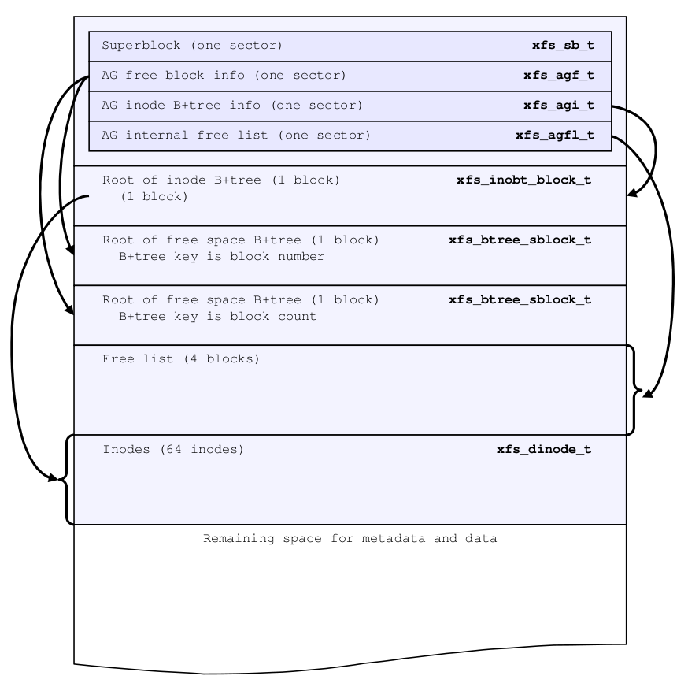

# AG的结构

下图顺序稍微有点不准确，具体以下面分析为主：

 

首先起始地址的第一个 sector 里存放 XFS 的 super block (简称 SB) 结构，里面保留文件系统最首要的元数据内容。

接在 SB 后面的是 Free space 管理用到的汇总结构，AGF。

然后第三个 sector 里保存的是用于管理 inode (和 free inode) 的汇总结构。

第四个 sector 是和 AGF 有关系的 AGFL 的汇总结构。

接下来一些附属的 B+Tree 的头部结构，后面再分析……

再往后面就是一些地址不那么固定的元数据了，后面再分析……


首先我们来看第一个扇区的内容：

```bash
[root@centos ~]# od -A x -N 512 -cx /dev/vda -j `expr 512 \* 0`
000000   X   F   S   B  \0  \0 020  \0  \0  \0  \0  \0  \0 004  \0  \0
          4658    4253    0000    0010    0000    0000    0400    0000
000010  \0  \0  \0  \0  \0  \0  \0  \0  \0  \0  \0  \0  \0  \0  \0  \0
          0000    0000    0000    0000    0000    0000    0000    0000
000020 331   s   , 222 330 375   D 204 234   Q   4 333   Q 200   P 270
          73d9    922c    fdd8    8444    519c    db34    8051    b850
000030  \0  \0  \0  \0  \0 002  \0 004  \0  \0  \0  \0  \0  \0  \0   @
          0000    0000    0200    0400    0000    0000    0000    4000
000040  \0  \0  \0  \0  \0  \0  \0   A  \0  \0  \0  \0  \0  \0  \0   B
          0000    0000    0000    4100    0000    0000    0000    4200
000050  \0  \0  \0 001  \0 001  \0  \0  \0  \0  \0 004  \0  \0  \0  \0
          0000    0100    0100    0000    0000    0400    0000    0000
000060  \0  \0  \n  \0 264 245 002  \0 002  \0  \0  \b  \0  \0  \0  \0
          0000    000a    a5b4    0002    0002    0800    0000    0000
000070  \0  \0  \0  \0  \0  \0  \0  \0  \f  \t  \t 003 020  \0  \0 031
          0000    0000    0000    0000    090c    0309    0010    1900
000080  \0  \0  \0  \0  \0  \0  \0   @  \0  \0  \0  \0  \0  \0  \0   =
          0000    0000    0000    4000    0000    0000    0000    3d00
000090  \0  \0  \0  \0  \0 003 365 350  \0  \0  \0  \0  \0  \0  \0  \0
          0000    0000    0300    e8f5    0000    0000    0000    0000
0000a0  \0  \0  \0  \0  \0  \0  \0  \0  \0  \0  \0  \0  \0  \0  \0  \0
          0000    0000    0000    0000    0000    0000    0000    0000
0000b0  \0  \0  \0  \0  \0  \0  \0 004  \0  \0  \0  \0  \0  \0  \0  \0
          0000    0000    0000    0400    0000    0000    0000    0000
0000c0  \0  \0  \0  \0  \0  \0  \0 001  \0  \0 001 212  \0  \0 001 212
          0000    0000    0000    0100    0000    8a01    0000    8a01
0000d0  \0  \0  \0  \0  \0  \0  \0  \0  \0  \0  \0 001  \0  \0  \0  \0
          0000    0000    0000    0000    0000    0100    0000    0000
0000e0 202 300   f   F  \0  \0  \0  \0  \0  \0  \0  \0  \0  \0  \0  \0
          c082    4666    0000    0000    0000    0000    0000    0000
0000f0  \0  \0  \0  \0  \0  \0  \0  \0  \0  \0  \0  \0  \0  \0  \0  \0
          0000    0000    0000    0000    0000    0000    0000    0000
*
000200

或者

[root@centos ~]# xxd -a -s $((512*0)) -l 512 /dev/vda
0000000: 5846 5342 0000 1000 0000 0000 0004 0000  XFSB............
0000010: 0000 0000 0000 0000 0000 0000 0000 0000  ................
0000020: d973 2c92 d8fd 4484 9c51 34db 5180 50b8  .s,...D..Q4.Q.P.
0000030: 0000 0000 0002 0004 0000 0000 0000 0040  ...............@
0000040: 0000 0000 0000 0041 0000 0000 0000 0042  .......A.......B
0000050: 0000 0001 0001 0000 0000 0004 0000 0000  ................
0000060: 0000 0a00 b4a5 0200 0200 0008 0000 0000  ................
0000070: 0000 0000 0000 0000 0c09 0903 1000 0019  ................
0000080: 0000 0000 0000 0040 0000 0000 0000 003d  .......@.......=
0000090: 0000 0000 0003 f5e8 0000 0000 0000 0000  ................
00000a0: 0000 0000 0000 0000 0000 0000 0000 0000  ................
00000b0: 0000 0000 0000 0004 0000 0000 0000 0000  ................
00000c0: 0000 0000 0000 0001 0000 018a 0000 018a  ................
00000d0: 0000 0000 0000 0000 0000 0001 0000 0000  ................
00000e0: 82c0 6646 0000 0000 0000 0000 0000 0000  ..fF............
00000f0: 0000 0000 0000 0000 0000 0000 0000 0000  ................
*
00001f0: 0000 0000 0000 0000 0000 0000 0000 0000  ................

```

可以很明显地看到地址 0 处的关键字 **XFSB**，表示这是一个 superblock 的开始。所以从地址 0 开始一直到地址 0x00000200 之前，都是 Super block 的位置，也就是刚好一个扇区。

地址 0x200 开始时关键字是 **XAGF**，表示这是 AGF 的区域。

```bash
[root@centos ~]# xxd -a -s $((512*1)) -l 512 /dev/vda
0000200: 5841 4746 0000 0001 0000 0000 0001 0000  XAGF............
0000210: 0000 0001 0000 0002 0000 0000 0000 0001  ................
0000220: 0000 0001 0000 0000 0000 0000 0000 0003  ................
0000230: 0000 0004 0000 fff0 0000 fff0 0000 0000  ................
0000240: d973 2c92 d8fd 4484 9c51 34db 5180 50b8  .s,...D..Q4.Q.P.
0000250: 0000 0000 0000 0000 0000 0000 0000 0000  ................
*
00002d0: 0000 0000 0000 0000 f7eb 9e2e 0000 0000  ................
00002e0: 0000 0000 0000 0000 0000 0000 0000 0000  ................
*
00003f0: 0000 0000 0000 0000 0000 0000 0000 0000  ................
```

同理，第三个扇区关键字是 **XAGI**，表示这是 AGI 的区域：

```bash
[root@centos ~]# xxd -a -s $((512*2)) -l 512 /dev/vda
0000400: 5841 4749 0000 0001 0000 0000 0001 0000  XAGI............
0000410: 0000 0040 0000 0003 0000 0001 0000 003d  ...@...........=
0000420: 0000 0040 ffff ffff ffff ffff ffff ffff  ...@............
0000430: ffff ffff ffff ffff ffff ffff ffff ffff  ................
................
0000510: ffff ffff ffff ffff ffff ffff ffff ffff  ................
0000520: ffff ffff ffff ffff d973 2c92 d8fd 4484  .........s,...D.
0000530: 9c51 34db 5180 50b8 6e8b 5ac5 0000 0000  .Q4.Q.P.n.Z.....
0000540: 0000 0000 0000 0000 0000 0000 0000 0000  ................
*
00005f0: 0000 0000 0000 0000 0000 0000 0000 0000  ................
```

第四个扇区是 **XAFL**，表示这是 AGFL 的区域：

```bash
[root@centos ~]# xxd -a -s $((512*3)) -l 512 /dev/vda
0000600: 5841 464c 0000 0000 d973 2c92 d8fd 4484  XAFL.....s,...D.
0000610: 9c51 34db 5180 50b8 0000 0000 0000 0000  .Q4.Q.P.........
0000620: 554a 1dea 0000 0004 0000 0005 0000 0006  UJ..............
0000630: 0000 0007 ffff ffff ffff ffff ffff ffff  ................
0000640: ffff ffff ffff ffff ffff ffff ffff ffff  ................
................
00007f0: ffff ffff ffff ffff ffff ffff ffff ffff  ................
```


因为我们使用的是 4k blocksize，上面四个结构占了 2k，后面剩下的 2k 只能空着，所以第一个 block 的内容就结束了。

```bash
[root@centos ~]# xxd -a -s $((4096*0)) -l 4096 /dev/vda
0000000: 5846 5342 0000 1000 0000 0000 0004 0000  XFSB............
......
0000200: 5841 4746 0000 0001 0000 0000 0001 0000  XAGF............
......
0000400: 5841 4749 0000 0001 0000 0000 0001 0000  XAGI............
......
0000600: 5841 464c 0000 0000 d973 2c92 d8fd 4484  XAFL.....s,...D.
......
0000800: 0000 0000 0000 0000 0000 0000 0000 0000  ................
*
0000ff0: 0000 0000 0000 0000 0000 0000 0000 0000  ................

```


下面要从第二个 fs block 开始了，因为 4096 对应十六进制的 0x1000，所以我们找到 0x1000 的位置看一下：

```bash
[root@centos ~]# xxd -a -s $((4096*1)) -l 4096 /dev/vda
0001000: 4142 3342 0000 0001 ffff ffff ffff ffff  AB3B............
0001010: 0000 0000 0000 0008 0000 0000 0000 0000  ................
0001020: d973 2c92 d8fd 4484 9c51 34db 5180 50b8  .s,...D..Q4.Q.P.
0001030: 0000 0000 61a8 d510 0000 0010 0000 fff0  ....a...........
0001040: 0000 0000 0000 0000 0000 0000 0000 0000  ................
*
0001ff0: 0000 0000 0000 0000 0000 0000 0000 0000  ................
```

正好 **AB3B** 就是对应 v5 XFS 的 Free space by BNO B+Tree root 的关键字，对应图中 BNO root 的位置。因为这个结构要占用一个 block，也就是 4096 个字节。所以我们再往后数 4096 个字节，也就是 0x2000 的位置，可以看到 **AB3C** （CNT root 的 Magic Number）。

```bash
[root@centos ~]# xxd -a -s $((4096*2)) -l 4096 /dev/vda
0002000: 4142 3343 0000 0001 ffff ffff ffff ffff  AB3C............
0002010: 0000 0000 0000 0010 0000 0000 0000 0000  ................
0002020: d973 2c92 d8fd 4484 9c51 34db 5180 50b8  .s,...D..Q4.Q.P.
0002030: 0000 0000 89ef 60e5 0000 0010 0000 fff0  ......`.........
0002040: 0000 0000 0000 0000 0000 0000 0000 0000  ................
*
0002ff0: 0000 0000 0000 0000 0000 0000 0000 0000  ................
```

再往后 4096 个字节，可以看到 **IAB3** （INO root 的 Magic Number）：

```bash
[root@centos ~]# xxd -a -s $((4096*3)) -l 4096 /dev/vda
0003000: 4941 4233 0000 0001 ffff ffff ffff ffff  IAB3............
0003010: 0000 0000 0000 0018 0000 0000 0000 0000  ................
0003020: d973 2c92 d8fd 4484 9c51 34db 5180 50b8  .s,...D..Q4.Q.P.
0003030: 0000 0000 8535 2314 0000 0040 0000 003d  .....5#....@...=
0003040: ffff ffff ffff fff8 0000 0000 0000 0000  ................
0003050: 0000 0000 0000 0000 0000 0000 0000 0000  ................
*
0003ff0: 0000 0000 0000 0000 0000 0000 0000 0000  ................
```


---


# Superblock

## 结构体

在开始分析前我们先看一下 XFS SB的 on disk 结构的代码：

```c
/*
 * Superblock - in core version.  Must match the ondisk version below.
 * Must be padded to 64 bit alignment.
 */
typedef struct xfs_sb {
	uint32_t	sb_magicnum;	/* magic number == XFS_SB_MAGIC */
	uint32_t	sb_blocksize;	/* logical block size, bytes */
	xfs_rfsblock_t	sb_dblocks;	/* number of data blocks */
	xfs_rfsblock_t	sb_rblocks;	/* number of realtime blocks */
	xfs_rtblock_t	sb_rextents;	/* number of realtime extents */
	uuid_t		sb_uuid;	/* user-visible file system unique id */
	xfs_fsblock_t	sb_logstart;	/* starting block of log if internal */
	xfs_ino_t	sb_rootino;	/* root inode number */
	xfs_ino_t	sb_rbmino;	/* bitmap inode for realtime extents */
	xfs_ino_t	sb_rsumino;	/* summary inode for rt bitmap */
	xfs_agblock_t	sb_rextsize;	/* realtime extent size, blocks */
	xfs_agblock_t	sb_agblocks;	/* size of an allocation group */
	xfs_agnumber_t	sb_agcount;	/* number of allocation groups */
	xfs_extlen_t	sb_rbmblocks;	/* number of rt bitmap blocks */
	xfs_extlen_t	sb_logblocks;	/* number of log blocks */
	uint16_t	sb_versionnum;	/* header version == XFS_SB_VERSION */
	uint16_t	sb_sectsize;	/* volume sector size, bytes */
	uint16_t	sb_inodesize;	/* inode size, bytes */
	uint16_t	sb_inopblock;	/* inodes per block */
	char		sb_fname[XFSLABEL_MAX]; /* file system name */
	uint8_t		sb_blocklog;	/* log2 of sb_blocksize */
	uint8_t		sb_sectlog;	/* log2 of sb_sectsize */
	uint8_t		sb_inodelog;	/* log2 of sb_inodesize */
	uint8_t		sb_inopblog;	/* log2 of sb_inopblock */
	uint8_t		sb_agblklog;	/* log2 of sb_agblocks (rounded up) */
	uint8_t		sb_rextslog;	/* log2 of sb_rextents */
	uint8_t		sb_inprogress;	/* mkfs is in progress, don't mount */
	uint8_t		sb_imax_pct;	/* max % of fs for inode space */
					/* statistics */
	/*
	 * These fields must remain contiguous.  If you really
	 * want to change their layout, make sure you fix the
	 * code in xfs_trans_apply_sb_deltas().
	 */
	uint64_t	sb_icount;	/* allocated inodes */
	uint64_t	sb_ifree;	/* free inodes */
	uint64_t	sb_fdblocks;	/* free data blocks */
	uint64_t	sb_frextents;	/* free realtime extents */
	/*
	 * End contiguous fields.
	 */
	xfs_ino_t	sb_uquotino;	/* user quota inode */
	xfs_ino_t	sb_gquotino;	/* group quota inode */
	uint16_t	sb_qflags;	/* quota flags */
	uint8_t		sb_flags;	/* misc. flags */
	uint8_t		sb_shared_vn;	/* shared version number */
	xfs_extlen_t	sb_inoalignmt;	/* inode chunk alignment, fsblocks */
	uint32_t	sb_unit;	/* stripe or raid unit */
	uint32_t	sb_width;	/* stripe or raid width */
	uint8_t		sb_dirblklog;	/* log2 of dir block size (fsbs) */
	uint8_t		sb_logsectlog;	/* log2 of the log sector size */
	uint16_t	sb_logsectsize;	/* sector size for the log, bytes */
	uint32_t	sb_logsunit;	/* stripe unit size for the log */
	uint32_t	sb_features2;	/* additional feature bits */

	/*
	 * bad features2 field as a result of failing to pad the sb structure to
	 * 64 bits. Some machines will be using this field for features2 bits.
	 * Easiest just to mark it bad and not use it for anything else.
	 *
	 * This is not kept up to date in memory; it is always overwritten by
	 * the value in sb_features2 when formatting the incore superblock to
	 * the disk buffer.
	 */
	uint32_t	sb_bad_features2;

	/* version 5 superblock fields start here */

	/* feature masks */
	uint32_t	sb_features_compat;
	uint32_t	sb_features_ro_compat;
	uint32_t	sb_features_incompat;
	uint32_t	sb_features_log_incompat;

	uint32_t	sb_crc;		/* superblock crc */
	xfs_extlen_t	sb_spino_align;	/* sparse inode chunk alignment */

	xfs_ino_t	sb_pquotino;	/* project quota inode */
	xfs_lsn_t	sb_lsn;		/* last write sequence */
	uuid_t		sb_meta_uuid;	/* metadata file system unique id */

	/* must be padded to 64 bit alignment */
} xfs_sb_t;

/*
 * Superblock - on disk version.  Must match the in core version above.
 * Must be padded to 64 bit alignment.
 */
typedef struct xfs_dsb {
	__be32		sb_magicnum;	/* magic number == XFS_SB_MAGIC */
	__be32		sb_blocksize;	/* logical block size, bytes */
	__be64		sb_dblocks;	/* number of data blocks */
	__be64		sb_rblocks;	/* number of realtime blocks */
	__be64		sb_rextents;	/* number of realtime extents */
	uuid_t		sb_uuid;	/* user-visible file system unique id */
	__be64		sb_logstart;	/* starting block of log if internal */
	__be64		sb_rootino;	/* root inode number */
	__be64		sb_rbmino;	/* bitmap inode for realtime extents */
	__be64		sb_rsumino;	/* summary inode for rt bitmap */
	__be32		sb_rextsize;	/* realtime extent size, blocks */
	__be32		sb_agblocks;	/* size of an allocation group */
	__be32		sb_agcount;	/* number of allocation groups */
	__be32		sb_rbmblocks;	/* number of rt bitmap blocks */
	__be32		sb_logblocks;	/* number of log blocks */
	__be16		sb_versionnum;	/* header version == XFS_SB_VERSION */
	__be16		sb_sectsize;	/* volume sector size, bytes */
	__be16		sb_inodesize;	/* inode size, bytes */
	__be16		sb_inopblock;	/* inodes per block */
	char		sb_fname[XFSLABEL_MAX]; /* file system name */
	__u8		sb_blocklog;	/* log2 of sb_blocksize */
	__u8		sb_sectlog;	/* log2 of sb_sectsize */
	__u8		sb_inodelog;	/* log2 of sb_inodesize */
	__u8		sb_inopblog;	/* log2 of sb_inopblock */
	__u8		sb_agblklog;	/* log2 of sb_agblocks (rounded up) */
	__u8		sb_rextslog;	/* log2 of sb_rextents */
	__u8		sb_inprogress;	/* mkfs is in progress, don't mount */
	__u8		sb_imax_pct;	/* max % of fs for inode space */
					/* statistics */
	/*
	 * These fields must remain contiguous.  If you really
	 * want to change their layout, make sure you fix the
	 * code in xfs_trans_apply_sb_deltas().
	 */
	__be64		sb_icount;	/* allocated inodes */
	__be64		sb_ifree;	/* free inodes */
	__be64		sb_fdblocks;	/* free data blocks */
	__be64		sb_frextents;	/* free realtime extents */
	/*
	 * End contiguous fields.
	 */
	__be64		sb_uquotino;	/* user quota inode */
	__be64		sb_gquotino;	/* group quota inode */
	__be16		sb_qflags;	/* quota flags */
	__u8		sb_flags;	/* misc. flags */
	__u8		sb_shared_vn;	/* shared version number */
	__be32		sb_inoalignmt;	/* inode chunk alignment, fsblocks */
	__be32		sb_unit;	/* stripe or raid unit */
	__be32		sb_width;	/* stripe or raid width */
	__u8		sb_dirblklog;	/* log2 of dir block size (fsbs) */
	__u8		sb_logsectlog;	/* log2 of the log sector size */
	__be16		sb_logsectsize;	/* sector size for the log, bytes */
	__be32		sb_logsunit;	/* stripe unit size for the log */
	__be32		sb_features2;	/* additional feature bits */
	/*
	 * bad features2 field as a result of failing to pad the sb
	 * structure to 64 bits. Some machines will be using this field
	 * for features2 bits. Easiest just to mark it bad and not use
	 * it for anything else.
	 */
	__be32		sb_bad_features2;

	/* version 5 superblock fields start here */

	/* feature masks */
	__be32		sb_features_compat;
	__be32		sb_features_ro_compat;
	__be32		sb_features_incompat;
	__be32		sb_features_log_incompat;

	__le32		sb_crc;		/* superblock crc */
	__be32		sb_spino_align;	/* sparse inode chunk alignment */

	__be64		sb_pquotino;	/* project quota inode */
	__be64		sb_lsn;		/* last write sequence */
	uuid_t		sb_meta_uuid;	/* metadata file system unique id */

	/* must be padded to 64 bit alignment */
} xfs_dsb_t;
```

这两个数据结构是一致的，`xfs_dsb` 比较好看每个成员的位数。


## xfs_db解析

我们可以先用 `xfs_db` 命令输出 superblock 0 的内容，和上面结构体的值是*一一对应*的，有个大概的印象：

```bash
[root@centos ~]# xfs_db /dev/vda 
xfs_db> sb 0
xfs_db> p
magicnum = 0x58465342
blocksize = 4096
dblocks = 262144
rblocks = 0
rextents = 0
uuid = d9732c92-d8fd-4484-9c51-34db518050b8
logstart = 131076
rootino = 64
rbmino = 65
rsumino = 66
rextsize = 1
agblocks = 65536
agcount = 4
rbmblocks = 0
logblocks = 2560
versionnum = 0xb4a5
sectsize = 512
inodesize = 512
inopblock = 8
fname = "\000\000\000\000\000\000\000\000\000\000\000\000"
blocklog = 12
sectlog = 9
inodelog = 9
inopblog = 3
agblklog = 16
rextslog = 0
inprogress = 0
imax_pct = 25
icount = 64
ifree = 61
fdblocks = 259560
frextents = 0
uquotino = 0
gquotino = 0
qflags = 0
flags = 0
shared_vn = 0
inoalignmt = 4
unit = 0
width = 0
dirblklog = 0
logsectlog = 0
logsectsize = 0
logsunit = 1
features2 = 0x18a
bad_features2 = 0x18a
features_compat = 0
features_ro_compat = 0
features_incompat = 0x1
features_log_incompat = 0
crc = 0x82c06646 (correct)
spino_align = 0
pquotino = 0
lsn = 0
meta_uuid = 00000000-0000-0000-0000-000000000000
xfs_db>
```

然后我们和磁盘上的数据对应来看一下，我们将这组实际数值与 SB 结构成员按顺序一一对上，逐个来看。需要注意的是，硬盘一般都是按照大端字节序存储数据的，在取出来数据的时候要转成当前 CPU 体系结构对应的端序，比如 x86_64 的话就是要转成小端字节序。

比如 58 46 53 42，最低位的 58 需要转换成最高位，实际为 0x58465342。

下面我把结构体的元素的位置表明了一下，有些的因为长度原因成员名称修剪了一下。

```bash
[root@centos ~]# xxd -a -s $((512*0)) -l 512 /dev/vda
0000000: 5846 5342 0000 1000 0000 0000 0004 0000  XFSB............
		 magicnum  blocksize dblocks
0000010: 0000 0000 0000 0000 0000 0000 0000 0000  ................
         sb_rblocks          sb_rextents
0000020: d973 2c92 d8fd 4484 9c51 34db 5180 50b8  .s,...D..Q4.Q.P.
         sb_uuid
0000030: 0000 0000 0002 0004 0000 0000 0000 0040  ...............@
         sb_logstart         sb_rootino
0000040: 0000 0000 0000 0041 0000 0000 0000 0042  .......A.......B
         sb_rbmino           sb_rsumino
0000050: 0000 0001 0001 0000 0000 0004 0000 0000  ................
         rextsize  agblocks  agcount   rbmblocks
0000060: 0000 0a00 b4a5 0200 0200 0008 0000 0000  ................
         logblocks sb_versionnum       sb_fname
                        sectsize  sb_inopblock
                             sb_inodesize
0000070: 0000 0000 0000 0000 0c09 0903 1000 0019  ................
                             sb_blocklog    sb_inprogress
                               sb_sectlog     sb_imax_pct
                                  sb_inodelog
                                    sb_inopblog
                                       sb_agblklog
                                         sb_rextslog     
0000080: 0000 0000 0000 0040 0000 0000 0000 003d  .......@.......=
         sb_icount           sb_ifree
0000090: 0000 0000 0003 f5e8 0000 0000 0000 0000  ................
         sb_fdblocks         sb_frextents
00000a0: 0000 0000 0000 0000 0000 0000 0000 0000  ................
         sb_uquotino         sb_gquotino
00000b0: 0000 0000 0000 0004 0000 0000 0000 0000  ................
         sb_qflags sb_inoalignmt       sb_width
              sb_flags       sb_unit
                sb_shared_vn
00000c0: 0000 0000 0000 0001 0000 018a 0000 018a  ................
         sb_dirblklog        sb_features2
           sb_logsectlog               sb_bad_features2
              sb_logsectsize
                   sb_logsunit
00000d0: 0000 0000 0000 0000 0000 0001 0000 0000  ................
         features_compat     features_incompat
                   features_ro_compat  features_log_incompat
00000e0: 82c0 6646 0000 0000 0000 0000 0000 0000  ..fF............
         sb_crc    sb_spino_align
                             sb_pquotino
00000f0: 0000 0000 0000 0000 0000 0000 0000 0000  ................
         sb_lsn              sb_meta_uuid
*
00001f0: 0000 0000 0000 0000 0000 0000 0000 0000  ................
```


## 成员

### sb_magicnum

__be32   sb_magicnum= 0x58465342

这个很好理解，就是一个 magic number，看到这组字符开头的文件系统，基本就可以确定当前文件系统是 XFS 了。可以按照ASCII码直接翻译，0x58='X', 0x46='F', 0x53='S', 0x42='B'，所以这个 magic number 就是 **XFSB**。


### sb_blocksize

__be32   sb_blocksize= 0x00001000

sb_blocksize 就是记录当前 XFS 的 blocksize 大小，一个实体的 XFS 必须有一个固定的 blocksize，这个是在 mkfs 的时候就确定的，不能后续更改。blocksize 也是 XFS 的读写粒度，是一个很简单但是很重要的数据，后续很多东西都会以此为单位表示。此处 blocksize 是 0x1000，转换成十进制就是 4096，也就是 blocksize 是 4096 个字节。


### sb_dblocks 

__be64   sb_dblocks = 0x0000000000040000

sb_dblocks 表示当前的 XFS 的总大小，单位是 block，也就是上面的 sb_blocksize 为单位。这里 0x40000 对应十进制的 262144，再乘以单位 4096，也就是 262144 * 4096 = 1073741824 字节。看一下我当前设备的大小：

```bash
[root@centos ~]# blockdev --getsize64 /dev/vda
1073741824
```

大小完全对应上了。


### sb_rblocks/sb_rextents

__be64   sb_rblocks= 0

__be64   sb_rextents= 0

sb_rblocks 和 sb_rextents 是在 real-time device 启用的时候才使用的变量，分别表示 rtdev 的有多少 blocks 和 extents。因为我这里没有给 XFS 使用 real-time device，所以这个地方都是 0。


### sb_uuid

uuid_t   sb_uuid= d9732c92-d8fd-4484-9c51-34db518050b8

sb_uuid 表示当前文件系统的 UUID (Universally Unique ID)，是一个唯一识别码，每次 mkfs 后都改变，这也是可以理解的，毕竟重新 mkfs 后就不是原来的文件系统实例了。


### sb_logstart

__be64   sb_logstart= 0x0000000000020004

sb_logstart 表示内部日志空间的起始 block 地址，因为我们并没有使用一个额外的外部设备作为 logdev，所以 XFS 在其所在设备上分配了一小段空间留作 log 使用。这里 0x20004 表示十进制的131076，至于这个 log 空间有多大，我们下面再看。

注：logstart 并不是真正的 log 初始的 block 位置，并不能用它乘以 blocksize 直接得到 log 的起始位置。因为它的初始值是通过 sb_agblklog (XFS_AGB_TO_FSB) 计算而来的，而 sb_agblklog 多半是一个舍入的数值，所以由其计算而来的 logstart 也不能直接使用。需要通过用其计算 AG 号，再计算 AG 内偏移量，再合成为真实的 log 起始地址。我们这里不多解释，等到后面讲到 log 结构的时候再说。


### sb_rootino

__be64   sb_rootino= 0x0000000000000040

sb_rootino 记录当前 XFS 的 root inode number，这里 0x40 换算成十进制就是 64，说明当前的 root inode 号就是 64。至于怎么解析 inode 号，我们到后面讲到 inode 的时候再说。


### sb_rbmino/sb_rsumino/sb_rextsize

__be64   sb_rbmino= 65

__be64   sb_rsumino= 66

__be32   sb_rextsize= 1

这三个变量也是给 real-time device 使用的，因为我们并没有使用 rtdev，所以这里这三个值并没有太多使用的意义。

注：在没有使用 rtdev 的情况下，这三个成员仍然有值，特别是前两个代表两个 inode，所以这两个 inodes 相当于总是被创建和预留的。除非 XFS 以后修改逻辑，不再总是预留它们，否则这两个 inodes 以及 root inode 将成为总是在 mkfs 时被预留的 3 个 inodes。


### sb_agblocks

__be32   sb_agblocks= 0x00010000

sb_agblocks 表示一个 AG 有多少个 blocks 的大小，当然最后一个 AG 可能不等于这个大小，其大小可参考 agf_length。这里看到当前 AG 有 0x10000 个 blocks，也就是 65536 * 4096 = 268435456 个字节大小。


### sb_agcount

__be32   sb_agcount= 4

sb_agcount 表示当前 XFS 总共有多少个 AG，这里表示当前 XFS 一共有 4 个AG。


### sb_rbmblocks

__be32   sb_rbmblocks= 0

sb_rbmblocks 也是为 realtime device 使用的，表示 realtime bitmap block 的数量。因为我没有使用 rtdev，这里默认为 0。


### sb_logblocks

__be32   sb_logblocks= 0x0a00

sb_logblocks 和上面的 sb_logstart 组合，当 XFS 使用内部 log 的时候，logstart 表示 log 的起始 block，logblocks 表示 log 的长度，即有多少个 blocks，这里 0x0a00=2560。所以这两个组合在一起就是一个 [start, size] 组合，通过它们就可以确认 log 空间的准确范围。


### sb_versionnum

__be16   sb_versionnum= 0xb4a5

sb_versionnum 的低四位表示当前正在使用的 XFS 版本号，目前（2021年）最新最常用的版本是 5，版本 4 的 XFS 大概还在一些老系统上使用，而版本 4 之前的版本目前已经基本碰不到了。

因为这是一个 16 位的变量，XFS 用其高位来表示一些特性是否在当前的 XFS 中被使用。每一位的意义参考如下：

```c
/*
 * Super block
 * Fits into a sector-sized buffer at address 0 of each allocation group.
 * Only the first of these is ever updated except during growfs.
 */
#define	XFS_SB_MAGIC		0x58465342	/* 'XFSB' */
#define	XFS_SB_VERSION_1	1		/* 5.3, 6.0.1, 6.1 */
#define	XFS_SB_VERSION_2	2		/* 6.2 - attributes */
#define	XFS_SB_VERSION_3	3		/* 6.2 - new inode version */
#define	XFS_SB_VERSION_4	4		/* 6.2+ - bitmask version */
#define	XFS_SB_VERSION_5	5		/* CRC enabled filesystem */
#define	XFS_SB_VERSION_NUMBITS		0x000f
#define	XFS_SB_VERSION_ALLFBITS		0xfff0
#define	XFS_SB_VERSION_ATTRBIT		0x0010
#define	XFS_SB_VERSION_NLINKBIT		0x0020
#define	XFS_SB_VERSION_QUOTABIT		0x0040
#define	XFS_SB_VERSION_ALIGNBIT		0x0080
#define	XFS_SB_VERSION_DALIGNBIT	0x0100
#define	XFS_SB_VERSION_SHAREDBIT	0x0200
#define XFS_SB_VERSION_LOGV2BIT		0x0400
#define XFS_SB_VERSION_SECTORBIT	0x0800
#define	XFS_SB_VERSION_EXTFLGBIT	0x1000
#define	XFS_SB_VERSION_DIRV2BIT		0x2000
#define	XFS_SB_VERSION_BORGBIT		0x4000	/* ASCII only case-insens. */
#define	XFS_SB_VERSION_MOREBITSBIT	0x8000
```

`versionnum & XFS_SB_VERSION_NUMBITS = 5`， 所以当前版本为5。


### sb_sectsize

__be16   sb_sectsize= 0x200

sb_sectsize 表示 Sector size，0x200 换算成十进制是 512，也就是表示当前 Sector size 是 512 字节。


### sb_inodesize

__be16   sb_inodesize= 0x200

sb_inodesize 表示 inode 的大小，这里 0x200 换算为十进制是 512，也就是我当前的 XFS 使用 512 字节存储单个 inode 元数据。对于 V5 XFS 来说 512 是最小的 inode size，对于 V4 XFS 来说 256 是最小的 inode size。最大的 inode size 是 2048。


### sb_inopblock

__be16   sb_inopblock= 8

sb_inopblock 表示每个 block 可以存储多少个 inode，上面我们已经看到 blocksize 是 4096 字节，inodesize 是 512 字节，所以 4096 / 512 = 8，如上，也就是一个 block 里可以存储 8 个 inodes。


### sb_fname

char    sb_fname[XFSLABEL_MAX]= "\000\000\000\000\000\000\000\000\000\000\000\000"

XFSLABEL_MAX=12，sb_fname[12] 用于存储一个标签字符串，这个标签可以用来代表这个文件系统实例。

比如挂载的时候可以指定文件系统所在的存储设备名来代表这个文件系统实例，如果有这个标签，就也可以使用这个标签来代表这个文件系统实例来挂载。我这里没有设置标签，所以这个地方都是 0。


### sb_blocklog

__u8    sb_blocklog= 0x0c

sb_blocklog 对应 sb_blocksize，是 sb_blocksize 的 log2 为底的对数表示形式。我们上面已经看到 blocksize 是 4096，所以 log2(4096) 就是 12，0x0c 的十进制表示就是 12。


### sb_sectlog

__u8    sb_sectlog= 9

sb_sectlog 对应 sb_sectsize，是 sb_sectsize 的 log 以 2 为底的对数表示形式。上面看到 sector size 是 512，所以 log2(512) = 9。


### sb_inodelog

__u8    sb_inodelog= 9

sb_inodelog 对应 sb_inodesize， 是sb_inodesize 的 log 以 2 为底的对数表示形式，上面看到 inodesize 是 512，所以 log2(512) = 9。


### sb_inopblog

__u8    sb_inopblog= 3

sb_inopblog 对应 sb_inopblock，是 sb_inopblock 的 log 以 2 为底的对数表示形式，上面看到 sb_inopblock 是 8，所以 log2(8) = 3。


### sb_agblklog

__u8    sb_agblklog= 0x10

sb_agblklog 对应 sb_agblocks，是 sb_agblocks 的 log 以 2 为底的对数表示形式，上面看到 sb_agblocks 是 65536，所以 log2(65536) =16。这里刚好可以取整为 16，0x10 的十进制就是16。

假如大小为 655360， log2(655360) = ~19.32， 这里就不能得到整数，所以这里统一向上取整，也就是 20。

注：上面我们已经提到过一次 sb_agblklog 了，sb_agblklog 是一个向上取整的数值，所以它不是一个准确能代表 agblocks 的数值。它的作用是用来辅助快速计算，比如计算一个 block number 属于哪个 AG，以及在这个 AG 内的偏移。


### sb_rextslog

__u8    sb_rextslog= 0

sb_rextslog 对应 sb_rextents，是 sb_rextents 的 log 以 2 为底的对数表示形式。上面我们看到 sb_rextents 是 0，所以这里也是 0。


### sb_inprogress

__u8    sb_inprogress= 0

sb_inprogress 表示当前文件系统正处于制作中，比如正在 mkfs 或者 growfs 中。一般来说 XFS 在使用过程中这个域应该保持是 0，如果不是在预期的过程中发现其非 0，那就是出现了 corruption。


### sb_imax_pct

__u8    sb_imax_pct=  0x19

sb_imax_pct 表示 xfs 允许 inodes 占用的最大空间 (sb_dblocks) 百分比，默认是 25%，如上 0x19 的十进制就是 25。


### sb_icount

__be64   sb_icount= 0x40

sb_icount 表示当前 XFS 已经分配了多少用于存储 inodes 的空间，0x40 换算为十进制就是 64。这是一个全局变量，记录整个 XFS 的 inode 数量。

注：这里的 64 并不表示有 64 个实际的 inode，而是因为在创建时 XFS 是以 64 个为一组 (A chunk) 分配空间的，所以一分配就至少是 64 个，如果当前实际只使用 3 个的话，另外 61 个就留着以后用。


### sb_ifree

__be64   sb_ifree= 0x3d

sb_ifree 也是一个全局变量，表示整个 XFS 有多少个未被使用的 inodes 空间，在上面说 sb_icount 的时候我们说过分配 inode 的时候都是一组一组做的，所以会有分配了空间但是暂时未使用的 inode 空间。0x3d 对应十进制的 61，也就是说当前 XFS 有 61 个已分配空间但未实际使用的 inodes。


### sb_fdblocks

__be64   sb_fdblocks= 0x3f5e8

sb_fdblocks 表示当前 XFS 有多少未被占用的 blocks，这里 0x3f5e8 换算十进制就是 259560，所以有 259560 个 blocks 未被占用。

通过 sb_dblocks 和 sb_fdblocks 我们就可以得到文件系统的总大小、未占用大小以及计算出已使用大小。

注意当前 sb_fdblocks=259560 和sb_dblocks=262144 并不相等，262144 - 259560 = 2584 个 blocks 已经被占用了。但是我这是一个刚创建的文件系统，还没有创建任何文件，甚至都没有挂载过，那这 2584 个 blocks 是谁占用的呢？

就是我们这一系列文章要介绍的文件系统组织所需的各种结构，而且随着文件系统的使用，除了用户真正写入的数据以外，还会有更多的组织用户数据所需的元数据被随之创建。所以不是你一个创建一个 1MB 的文件就只需要 1MB 的空间，文件系统远没有那么简单。


### sb_frextents

__be64   sb_frextents= 0

sb_frextents 也是一个全局变量，表示 realtime device 上有多少未被占用的 extents。因为我没用使用 rtdev，所以这里是 0。


### sb_uquotino/sb_gquotino/sb_qflags

__be64   sb_uquotino= 0

__be64   sb_gquotino= 0

__be16   sb_qflags= 0

sb_uquotino 和 sb_gquotino 是两个全局 inode 号，分别用于记录用户限额和用户组限额的配置。

sb_qflags 是用于 quota 的一些标志位，因为我这里没有启用 quota，所以这三个域都是 0。


### sb_flags

__u8    sb_flags= 0

这是一个对应于 SB 的杂项 flag，对于 XFS 来说目前只有 XFS_SBF_READONLY 这一个 on-disk 的 flag 可用。

sb flag 是为了配合 mount 的时候使用的，大部分的 sb flag 都在内存结构的 SB 里。


### sb_shared_vn

__u8    sb_shared_vn= 0

sb_shared_vn 这个目前没有用，是一个被保留的域，它的值目前总是 0。


### sb_inoalignmt

__be32   sb_inoalignmt= 4

前面 sb_versionnum 我们看到的 XFS_SB_VERSION_ALIGNBIT flag，如果置位了（V5 XFS 必须设置此 flag，否则是不被允许的）就表示分配 inode 的时候会使用 fsblock 对齐，这里表示 inode 创建以 4 blocks 对齐。


### sb_unit/sb_width

__be32   sb_unit= 0

__be32   sb_width= 0

这两个参数是为了 XFS 能在多条带的存储设备上优化处理而使用的，典型的场景就是 RAID。

sunit 对应 RAID 每个存储单元的大小。

swidth 对应RAID由多少个数据存储单元组成。

比如条带大小为 1024，条带宽度为 8，unit = 1024 / 4(blocksize) = 256，width = 256 * 8 = 2048。

一般这两个参数不需要我们自己指定，mkfs.xfs 会根据所在的设备而计算出较合适的 sunit 和 swidth。


### sb_dirblklog

__u8    sb_dirblklog= 0

sb_dirblklog 是 目录 block size 的 log2 表示形式，这里数值为 0，也就是说用于目录的 block size 为：blocksize * 2<sup>0</sup> = 4096 * 1 = 4096 。

也就是说用于目录创建的单元是 4096 字节。我们后面会单独讲用于目录的元数据结构，非常复杂，而且有很多种变种。


### sb_logsectlog/sb_logsectsize 

__u8    sb_logsectlog= 0

__be16   sb_logsectsize = 0

如果使用外部 log device，则这两个变量表示外部 log device 的 sector size 以及其 log2 表示。但是因为我没有使用外部 log device，所以这两个域是 0。


### sb_logsunit

__be32   sb_logsunit= 1

sb_logsunit 和上面 sb_unit 的意思差不多，这个用于表示 log device 的 stripe size，因为我们没有使用外部 log device，所以这变量没用上，但是因为 XFS_SB_VERSION_LOGV2BIT 被设置了，V2 log 不能让这个变量是 0，所以将其设置为 1。


### sb_features2/sb_bad_features2

__be32   sb_features2 = 0x18a

__be32   sb_bad_features2= 0x18a

上面我们看到 sb_versionnum 设置了 XFS_SB_VERSION_MOREBITSBIT，表示有更多特性需要参考 sb_features2。对于 XFS 来说 sb_bad_features2 没有作用，它只是单纯的做了一个 sb_features2 的复制，然后用于占位和保持 64 位对齐，并不实际使用。

```c
/*
 * There are two words to hold XFS "feature" bits: the original
 * word, sb_versionnum, and sb_features2.  Whenever a bit is set in
 * sb_features2, the feature bit XFS_SB_VERSION_MOREBITSBIT must be set.
 *
 * These defines represent bits in sb_features2.
 */
#define XFS_SB_VERSION2_RESERVED1BIT	0x00000001
#define XFS_SB_VERSION2_LAZYSBCOUNTBIT	0x00000002	/* Superblk counters */
#define XFS_SB_VERSION2_RESERVED4BIT	0x00000004
#define XFS_SB_VERSION2_ATTR2BIT	0x00000008	/* Inline attr rework */
#define XFS_SB_VERSION2_PARENTBIT	0x00000010	/* parent pointers */
#define XFS_SB_VERSION2_PROJID32BIT	0x00000080	/* 32 bit project id */
#define XFS_SB_VERSION2_CRCBIT		0x00000100	/* metadata CRCs */
#define XFS_SB_VERSION2_FTYPE		0x00000200	/* inode type in dir */
```

0x018a 转换为二进制是 1 1000 1010，对应上面的特性就是：

```c
CRCBIT | PROJID32BIT | ATTR2BIT | LAZYSBCOUNTBIT
```

也就是说当前 XFS 支持 metadate 校验 (CRCBIT)，支持 32 位 project-ID (PROJID32BIT)，支持动态 di_forkoff（ATTR2BIT），关于什么是动态 di_forkoff 在我们讲到 inode 如何组织数据和扩展属性的时候再说。以及为了性能提升，只在卸载文件系统的时候再更新 on-disk 的主 Superblock的 全局空闲空间和 inode 数量记录，比如 sb_icount, sb_ifree, sb_fdblocks（LAZYSBCOUNTBIT）。

注：XFS_SB_VERSION2_FTYPE 这里并没有被设置，但是我当前的 XFS 其实是支持 FTYPE 特性的，只是并没有设置在这里。


### sb_features_compat

__be32   sb_features_compat= 0

sb_features_compat 这个域表示挂载时即使 XFS 模块不支持这里记录的特性，也允许以读写的权限继续访问当前的 XFS。可是目前为止 XFS 并没有这样的特性，所以这里是 0。


### sb_features_ro_compat

__be32   sb_features_ro_compat= 0

sb_features_ro_compat 表示挂载时 XFS 模块如果不支持这里记录的特性，则可以以只读方式挂载。目前这样的特性包括如下：

```c
#define XFS_SB_FEAT_RO_COMPAT_FINOBT   (1 << 0)		/* free inode btree */
#define XFS_SB_FEAT_RO_COMPAT_ALL \
		(XFS_SB_FEAT_RO_COMPAT_FINOBT)
#define XFS_SB_FEAT_RO_COMPAT_UNKNOWN	~XFS_SB_FEAT_RO_COMPAT_ALL
```

0 表示未使能任何特性。


### sb_features_incompat

__be32   sb_features_incompat= 0x1

sb_features_incompat 这个域里记录的特性表示，如果 XFS 模块不支持这里面的任何一个特性，都不能挂载这个 XFS 文件系统，只读也不行。目前这样的特性包括如下：

```c
#define XFS_SB_FEAT_INCOMPAT_FTYPE	(1 << 0)	/* filetype in dirent */
#define XFS_SB_FEAT_INCOMPAT_SPINODES	(1 << 1)	/* sparse inode chunks */
#define XFS_SB_FEAT_INCOMPAT_META_UUID	(1 << 2)	/* metadata UUID */
#define XFS_SB_FEAT_INCOMPAT_ALL \
		(XFS_SB_FEAT_INCOMPAT_FTYPE|	\
		 XFS_SB_FEAT_INCOMPAT_SPINODES|	\
		 XFS_SB_FEAT_INCOMPAT_META_UUID)

#define XFS_SB_FEAT_INCOMPAT_UNKNOWN	~XFS_SB_FEAT_INCOMPAT_ALL
```

sb_features_incompat=1 表示我当前的 XFS 使能了 FTYPE 特性，如果在一个不支持这个特性中任何一个的系统上挂载此 XFS，则不允许挂载。

注：这里的 XFS_SB_FEAT_INCOMPAT_FTYP 就是我上面在 sb_features2 提到的替代 XFS_SB_VERSION2_FTYPE 的位。


### sb_features_log_incompat

__be32   sb_features_log_incompat= 0

sb_features_log_incompat 表示 log 相关的特性，如果有任何一个不被 XFS 模块支持，则不能挂载这个 XFS 文件系统。不过 XFS 目前还没有这样的特性，所以是 0。


### sb_crc

__le32   sb_crc= 0x82c06646 (correct)

sb_crc 就是一个 CRC 校验值，用于校验当前 superblock 的内容是否出现了未预期的改变。


### sb_spino_align

__be32   sb_spino_align= 0

当 sparse inode 被支持的时候，sb_spino_align 以 XFS_INODE_BIG_CLUSTER_SIZE 为准对齐，sb_inoalignmt 转而以一个 chunk 的 inode 总 size 为准对齐。后面再讲。


### sb_pquotino

__be64   sb_pquotino= 0

从 V5 XFS 开始，project quota inode 被单独拿出来保存，以前是和 group quota 混用的。sb_pquotino 保存记录着 project 限额配置的 inode 号，由于我们没有使用 quota，所以这里是 0。


### sb_lsn

__be64   sb_lsn= 0

sb_lsn 是一个号码，lsn 是 log sequence number 的简称，是日志记录时使用的序号。这里记录最后一次造成 superblock 更新的日志序号。因为我还没有使用过这个 XFS，所以没有任何更新，此处为 0。


### sb_meta_uuid

uuid_t   sb_meta_uuid= 00000000-0000-0000-0000-000000000000

如果上面 sb_features_incompat 的 XFS_SB_FEAT_INCOMPAT_META_UUID 位被设置，则表示则表示其它所有 metadata 的 UUID 需要和这个 sb_meta_uuid 匹配。一般来说会在使用 xfs_admin -U 修改 sb_uuid 的时候将原 sb_uuid 保存到此 meta_uuid 中。由于我们没有使用 meta_uuid，所以这里是 0。

​	