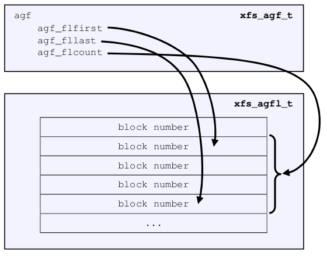

# AGF

## 结构体

```c
/*
 * The second word of agf_levels in the first a.g. overlaps the EFS
 * superblock's magic number.  Since the magic numbers valid for EFS
 * are > 64k, our value cannot be confused for an EFS superblock's.
 */

typedef struct xfs_agf {
	/*
	 * Common allocation group header information
	 */
	__be32		agf_magicnum;	/* magic number == XFS_AGF_MAGIC */
	__be32		agf_versionnum;	/* header version == XFS_AGF_VERSION */
	__be32		agf_seqno;	/* sequence # starting from 0 */
	__be32		agf_length;	/* size in blocks of a.g. */
	/*
	 * Freespace information
	 */
	__be32		agf_roots[XFS_BTNUM_AGF];	/* root blocks */
	__be32		agf_spare0;	/* spare field */
	__be32		agf_levels[XFS_BTNUM_AGF];	/* btree levels */
	__be32		agf_spare1;	/* spare field */

	__be32		agf_flfirst;	/* first freelist block's index */
	__be32		agf_fllast;	/* last freelist block's index */
	__be32		agf_flcount;	/* count of blocks in freelist */
	__be32		agf_freeblks;	/* total free blocks */

	__be32		agf_longest;	/* longest free space */
	__be32		agf_btreeblks;	/* # of blocks held in AGF btrees */
	uuid_t		agf_uuid;	/* uuid of filesystem */

	/*
	 * reserve some contiguous space for future logged fields before we add
	 * the unlogged fields. This makes the range logging via flags and
	 * structure offsets much simpler.
	 */
	__be64		agf_spare64[16];

	/* unlogged fields, written during buffer writeback. */
	__be64		agf_lsn;	/* last write sequence */
	__be32		agf_crc;	/* crc of agf sector */
	__be32		agf_spare2;

	/* structure must be padded to 64 bit alignment */
} xfs_agf_t;
```


## xfs_db解析

```bash
[root@centos ~]# xfs_db -c "agf 0" -c "p" /dev/vda
magicnum = 0x58414746
versionnum = 1
seqno = 0
length = 65536
bnoroot = 1
cntroot = 2
bnolevel = 1
cntlevel = 1
flfirst = 0
fllast = 3
flcount = 4
freeblks = 65520
longest = 65520
btreeblks = 0
uuid = d9732c92-d8fd-4484-9c51-34db518050b8
lsn = 0
crc = 0xf7eb9e2e (correct)
```

AGF 在 AG 结构的第 2 个 sector，依旧在磁盘结构里表明数据成员所在的位置。

```bash
[root@centos ~]# xxd -a -s $((512*1)) -l 512 /dev/vda
0000200: 5841 4746 0000 0001 0000 0000 0001 0000  XAGF............
                   agf_versionnum      agf_length
    	 agf_magicnum        agf_seqno
0000210: 0000 0001 0000 0002 0000 0000 0000 0001  ................
         agf_roots           agf_spare0
                                       agf_levels
0000220: 0000 0001 0000 0000 0000 0000 0000 0003  ................
                   agf_spare1          agf_fllast
                             agf_flfirst
0000230: 0000 0004 0000 fff0 0000 fff0 0000 0000  ................
         agf_flcount         agf_longest
                   agf_freeblks        agf_btreeblks
0000240: d973 2c92 d8fd 4484 9c51 34db 5180 50b8  .s,...D..Q4.Q.P.
         agf_uuid
0000250: 0000 0000 0000 0000 0000 0000 0000 0000  ................
         agf_spare64
*
00002d0: 0000 0000 0000 0000 f7eb 9e2e 0000 0000  ................
         agf_lsn             agf_crc   agf_spare2
00002e0: 0000 0000 0000 0000 0000 0000 0000 0000  ................
*
00003f0: 0000 0000 0000 0000 0000 0000 0000 0000  ................
```


## 成员

### agf_magicnum

__be32 agf_magicnum = 0x58414746

AGF 结构的第一个数值还是 magic number，代表 AGF 的开始。这就是一个字符串，四个字符按照 ACSII 码来解读，0x58='X'，0x41='A'， 0x47='G'， 0x46='F'。


### agf_versionnum

__be32 agf_versionnum = 0x00000001

当前的 XFS_AGF_VERSION 就是 1，还没有其它版本。


### agf_seqno

__be32 agf_seqno = 0x00000000

agf_seqno 表示当前 sector 属于哪个 AG，因为我看的是第一个 AG，所以是 0 号 AG。


### agf_length

__be32 agf_length = 0x00010000

agf_length 顾名思义，就是表示当前 AG 的长度。理论上它应该等于 sb_agblocks（参考上一篇 SB 结构的讲解），但是这个域才是 AG 的真正长度，特别是对于 AG 来说，sb_agblocks 往往不能表示出其实际长度，但是 agf_length 却可以。这里 0x10000 对应十进制的 65536，单位是 blocksize，也就是说当前 AG 总长度是 65536 个 blocksize。


### agf_roots

__be32 agf_roots[XFS_BTNUM_AGF] = 0x00000001 00000002

agf_roots[] 里保存的是 AGF 用来管理空间所需的几个结构的头地址 (bnoroot, cntroot)

bnoroot=1 表示以 block number 为 key 的 free space 管理所用的 B+Tree 的头部在当前 XFS 的第 1 个 block 里（从 0 开始数的）。 

cntroot=2 表示以 block count 为 key 的 free space 管理所用的 B+Tree 的头部在当前 XFS 的第 2 个 block 里。


### agf_spare0

备用的，后面内核版本有四个 (bnoroot, cntroot, rmaproot, refcntroot)。但是因为这里只预留了一个位置，导致引入 refcntroot 时已经不方便将其加入到这个连续的数组内了，否则容易打破当前的 agf 结构顺序。而且 refcount tree 也不是一个真正的索引 used space/free space 的 tree，就单独把它拿出来放到后面了。所以这里只保存三个。


### agf_levels

__be32 agf_levels[XFS_BTNUM_AGF] = 0x00000001 00000001

agf_levels[] 与上述 agf_roots[] 一一对应，用于表示对应 B+Tree 的深度。对于一个新创建的 XFS，这个值是 1。所以这里面的 level 都是 1。


### agf_spare1

同上


### agf_flfirst/agf_fllast /agf_flcount

__be32 agf_flfirst = 0x00000000

__be32 agf_fllast = 0x00000003

__be32 agf_flcount = 0x00000004

这三个数值配合 AGFL 使用，AGFL 预留一些 reserve space 给 AGF 使用，这三个数值分别对应 AGFL 中 list 的起始和结尾地址，以及 list 的长度：

 


### agf_freeblks

__be32 agf_freeblks= 0xfff0 

agf_freeblks 指明当前 AG 有多少未被占用的 blocks，0xfff0 对应十进制的 65520，单位blocksize。


### agf_longest 

__be32 agf_longest = 0xfff0 

agf_longest 指明当前 AG 最长的一段连续的未被占用的 blocks 的长度，0xfff0 对应十进制的 65520，单位 blocksize。


### agf_btreeblks 

__be32 agf_btreeblks = 0x00000000

agf_btreeblks 指明被当前 AGF 的 B+Tree 结构的使用的 block 数量，只在 XFS_SB_VERSION2_LAZYSBCOUNTBIT 被设置的时候使用，当前我们没有创建任何用户数据，所以数量是 0。


### agf_uuid

uuid_t agf_uuid = d9732c92-d8fd-4484-9c51-34db518050b8

agf_uuid 是 AGF 中保存的 uuid，对应 sb_uuid 或者 sb_meta_uuid。


### agf_lsn

__be64 agf_lsn = 0x0000000000000000

最后一次写入 AGF 的 Log sequence number，目前因为没有使用过这个 XFS，所以此处也是 0。


### agf_crc 

__be32 agf_crc = 0xf7eb9e2e (correct)

当前 AGF 的 CRC 校验值


---

# AGFL

## 结构体

```c
typedef struct xfs_agfl {
	__be32		agfl_magicnum;
	__be32		agfl_seqno;
	uuid_t		agfl_uuid;
	__be64		agfl_lsn;
	__be32		agfl_crc;
	__be32		agfl_bno[];	/* actually XFS_AGFL_SIZE(mp) */
} xfs_agfl_t;
```


## xfs_db解析

```bash
[root@centos ~]# xfs_db -c "agfl 0" -c "p" /dev/vda
magicnum = 0x5841464c
seqno = 0
uuid = d9732c92-d8fd-4484-9c51-34db518050b8
lsn = 0
crc = 0x554a1dea (correct)
bno[0-117] = 0:4 1:5 2:6 3:7 4:null 5:null 6:null 7:null 8:null 9:null 10:null 11:null 12:null 13:null 14:null 15:null 16:null 17:null
18:null 19:null 20:null 21:null 22:null 23:null 24:null 25:null 26:null 27:null 28:null 29:null 30:null 31:null 32:null 33:null 34:null
35:null 36:null 37:null 38:null 39:null 40:null 41:null 42:null 43:null 44:null 45:null 46:null 47:null 48:null 49:null 50:null 51:null
52:null 53:null 54:null 55:null 56:null 57:null 58:null 59:null 60:null 61:null 62:null 63:null 64:null 65:null 66:null 67:null 68:null
69:null 70:null 71:null 72:null 73:null 74:null 75:null 76:null 77:null 78:null 79:null 80:null 81:null 82:null 83:null 84:null 85:null
86:null 87:null 88:null 89:null 90:null 91:null 92:null 93:null 94:null 95:null 96:null 97:null 98:null 99:null 100:null 101:null
102:null 103:null 104:null 105:null 106:null 107:null 108:null 109:null 110:null 111:null 112:null 113:null 114:null 115:null 116:null
117:null

```

AGFL 在 AG 结构的第 4 个 sector，依旧在磁盘结构里表明数据成员所在的位置

```bash
[root@centos ~]# xxd -a -s $((512*3)) -l 512 /dev/vda
0000600: 5841 464c 0000 0000 d973 2c92 d8fd 4484  XAFL.....s,...D.
         agfl_magicnum       agfl_uuid
                   agfl_seqno
0000610: 9c51 34db 5180 50b8 0000 0000 0000 0000  .Q4.Q.P.........
                             agfl_lsn
0000620: 554a 1dea 0000 0004 0000 0005 0000 0006  UJ..............
         agfl_crc  agfl_bno
0000630: 0000 0007 ffff ffff ffff ffff ffff ffff  ................
0000640: ffff ffff ffff ffff ffff ffff ffff ffff  ................
................
00007f0: ffff ffff ffff ffff ffff ffff ffff ffff  ................
```


## 成员

对比上述结构，带入数值：

### agfl_magicnum 

__be32 agfl_magicnum = 0x5841464c

同样的，第一个成员仍然是 magic number，表示 AGFL 的起始。0x58='X', 0x41='A', 0x46='F', 0x4c='L'。


### agfl_seqno

__be32 agfl_seqno = 0x00000000

agfl_seqno 表示此 AGFL 结构隶属于第 0 个 AG。


### agfl_uuid 

uuid_t agfl_uuid = d9732c92-d8fd-4484-9c51-34db518050b8

agfl_uuid 是 AGFL 中保存的 uuid，对应 sb_uuid 或者 sb_meta_uuid。


### agfl_lsn

__be64 agfl_lsn = 0x0000000000000000

agfl_lsn 记录最后一次写入 AGFL 的 Log sequence number，目前因为没有使用过这个 XFS，所以此处也是 0。


### agfl_crc

__be32 agfl_crc = 0x554a1dea

当前 AGFL 内容的 CRC 校验值。

AGFL 结构占用了一整个 sector 的空间，除了上面说的几个成员变量以外，此 sector 剩余的空间也是 AGFL 的有效部分。

首先上面 xfs_agfl 结构占用了 36 个字节，按照对齐原则这个结构的 sizeof 应该是 40 个字节。

然后，一个 sector size 的 512 字节，减去这 40 个字节的空间，还剩下 512 - 40 = 472 字节。因为 AGFL 里记录着一些 AG 内预留出来的 block 地址，因为是相对于 AG 的地址，所以每个地址需要 4 个字节。472 / 4 = 118，所以 AGFL 里目前可以存 118 个这样的地址。


### agfl_bno

可以看到 bno[0-117] 这 118 个成员，这里以 index:blocknum 对的形式展现。null 的部分均以 0xffffffff 覆盖，表示还没有初始化。但是我们可以看到这里有 4 个有有效数值的单元：

```text
0:4 1:5 2:6 3:7
```

它们就对应上面 AGFL 内容里的 "0000 0004 0000 0005 0000 0006 0000 0007" 那部分，表示当前 AG 的第 4, 5, 6, 7 的 block 已经被记录在当前 AGFL 的 free list 里作为后续 AGF 使用的 blocks。这里和 AGF 的 agf_flfirst/agf_fllast /agf_flcount 成员是对应的

​	