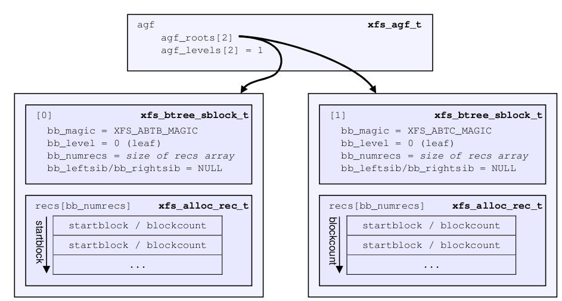
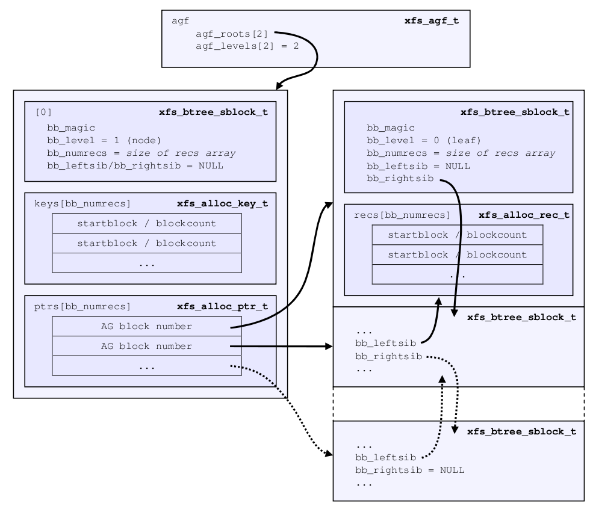

# BNO/CNT B+Tree

 

## Header结构体

我们知道 AGF 中 的 bnoroot 指向 AG 的第二个 block，这个 block 作为以 block number 为 key 的 B+Tree 的根，用于管理未被占用的 blocks。我们以 4096 字节的 blocksize 大小为例，在这个 block 中，排在前面的首先是 xfs_btree_block 结构：

```c
/* short form block header */
struct xfs_btree_block_shdr {
	__be32		bb_leftsib;
	__be32		bb_rightsib;

	__be64		bb_blkno;
	__be64		bb_lsn;
	uuid_t		bb_uuid;
	__be32		bb_owner;
	__le32		bb_crc;
};

/* long form block header */
struct xfs_btree_block_lhdr {
	__be64		bb_leftsib;
	__be64		bb_rightsib;

	__be64		bb_blkno;
	__be64		bb_lsn;
	uuid_t		bb_uuid;
	__be64		bb_owner;
	__le32		bb_crc;
	__be32		bb_pad; /* padding for alignment */
};

struct xfs_btree_block {
	__be32		bb_magic;	/* magic number for block type */
	__be16		bb_level;	/* 0 is a leaf */
	__be16		bb_numrecs;	/* current # of data records */
	union {
		struct xfs_btree_block_shdr s;
		struct xfs_btree_block_lhdr l;
	} bb_u;				/* rest */
};
```

其中有一个联合体，一个是 short format block header，一个是 long format block header，其中 short format 用于 AG 内部寻址的 B+Tree，long format 用于全 XFS（可跨AG寻址）的 B+Tree。我们上面说过和 AGF 有关的 B+Tree 都是属于 AG 内部寻址的，所以这里使用 short format 结构，里面使用 32 位变量作为地址。

所以将这两个结构合并的话就构成 BNO root block 的头部 (注意这里是一个拼凑的，只用于 short format 的 xfs_btree_block)：

```c
struct xfs_btree_block{
        __be32          bb_magic;       /* magic number for block type */
        __be16          bb_level;       /* 0 is a leaf */
        __be16          bb_numrecs;     /* current # of data records */
        /* short form block header */
        __be32          bb_leftsib;
        __be32          bb_rightsib;

        __be64          bb_blkno;
        __be64          bb_lsn;
        uuid_t          bb_uuid;
        __be32          bb_owner;
        __le32          bb_crc;
};
```


## xfs_db解析

```bash
[root@centos ~]# xfs_db /dev/vda 
xfs_db> agf 0
xfs_db> p
magicnum = 0x58414746
...
bnoroot = 1
cntroot = 2
...

xfs_db> addr bnoroot
xfs_db> p
magic = 0x41423342
level = 0
numrecs = 1
leftsib = null
rightsib = null
bno = 8
lsn = 0
uuid = d9732c92-d8fd-4484-9c51-34db518050b8
owner = 0
crc = 0x61a8d510 (correct)
recs[1] = [startblock,blockcount] 1:[16,65520]
xfs_db>
```

我们读取 AG 的第 1 个和第 2 个 block，分别代表 bnoroot 和 cntroot。

```bash
[root@centos ~]# xxd -a -s $((4096*1)) -l 4096 /dev/vda
0001000: 4142 3342 0000 0001 ffff ffff ffff ffff  AB3B............
         bb_magic  bb_level  bb_leftsib
                        bb_numrecs     bb_rightsib
0001010: 0000 0000 0000 0008 0000 0000 0000 0000  ................
         bb_blkno            bb_lsn
0001020: d973 2c92 d8fd 4484 9c51 34db 5180 50b8  .s,...D..Q4.Q.P.
         bb_uuid
0001030: 0000 0000 61a8 d510 0000 0010 0000 fff0  ....a...........
         bb_owner  bb_crc
0001040: 0000 0000 0000 0000 0000 0000 0000 0000  ................
*
0001ff0: 0000 0000 0000 0000 0000 0000 0000 0000  ................

[root@centos ~]# xxd -a -s $((4096*2)) -l 4096 /dev/vda
0002000: 4142 3343 0000 0001 ffff ffff ffff ffff  AB3C............
0002010: 0000 0000 0000 0010 0000 0000 0000 0000  ................
0002020: d973 2c92 d8fd 4484 9c51 34db 5180 50b8  .s,...D..Q4.Q.P.
0002030: 0000 0000 89ef 60e5 0000 0010 0000 fff0  ......`.........
0002040: 0000 0000 0000 0000 0000 0000 0000 0000  ................
*
0002ff0: 0000 0000 0000 0000 0000 0000 0000 0000  ................
```


## 成员

### bb_magic

__be32 bb_magic = 0x41423342

这个 magic number 表示当前是属于 BNO B+Tree 的 root，对于 V5 XFS 来说，magic number 是 AB3B。0x41 = 'A', 0x42 ='B', 0x33 ='3', 0x42 = 'B'。

注：CNT B+Tree 的 root 在另一个 block 中，且其 magic number 是 AB3C。


### bb_level

__be16 bb_level = 0x0000

这个 level 表示当前这个 xfs_btree_block 所在的 block 的 B+Tree 的 level，如果 level 是 0，表示当前的 block 存储的都是叶子节点，包含这个 Tree 的真正数据记录 (Records)。如果 level > 0，则表示当前 block 存储的是 [key, pointer] 的中间节点。越是上一级节点所在的 block，其 level 值越大 1。此处 level 为 0，表示当前 block 即存储叶子节点的 block。


### bb_numrecs

__be16 bb_numrecs = 0x0001

bb_numrecs 表示当前 block 有多少个 record（如果是叶子节点），或者有多少 [key, ptr] 对（如果是中间节点）。


### bb_leftsib/bb_rightsib

__be32 bb_leftsib = 0xffffffff

__be32 bb_rightsib = 0xffffffff

用于指向同级的左右节点所在的 block。0xffffffff 表示 NULL。下级节点通过 [key, ptr] 对中的 ptr 来指向。


### bb_blkno

__be64 bb_blkno = 0x0000000000000008

以 512 字节为单位表示当前的 block 号，因为这是在 4096 字节的位置，所以4096 / 512 = 8。XFS 经常会需要这种以 512 字节为单位计算的地方，512 字节是 XFS 经常用到的一个基本运算单位（与实际的 fs block size 和 sector size 无关）。


### bb_lsn

__be64 bb_lsn = 0

最后一次对这个 block 进行写入操作的 Log sequence number，我们暂时不涉及 log 的内容。


### bb_uuid

uuid_t bb_uuid = d9732c92-d8fd-4484-9c51-34db518050b8

bb_uuid 保存结构 block 的 uuid，对应 sb_uuid 或者 sb_meta_uuid。


### bb_owner 

__be32 bb_owner = 0x00000000

当前 block 所属的 AG 号，因为我展示的是第 0 号 AG 里 bno root，所以这里是 0。


### bb_crc

__le32 bb_crc = 0x61a8d510

当前 block 内容的 crc 校验值。


以上就是 V5 XFS 的 BNO B+Tree root 所在 block 的 header 结构。


从 xfs_db 里我们可以看到还剩下一个类似数组的东西。

```bash
recs[1] = [startblock,blockcount] 1:[16,65520]
```

我们可以看出 Header 结构体并没有占多少字节，整个 block 还有很多剩余，接在这个 header 后面的就是 B+Tree 的节点。结构如下：

```bash
|<------             Block           ------>|
+--------+--------+--------+       +--------+
| header | record | record |  ...  | record |
+--------+--------+--------+       +--------+
```

因为我们还未写入任何数据，所以空闲空间还是完整的，也就是第 16 个块开始的连续 65520 个块都是空闲的


## record结构体

```c
/*
 * Data record/key structure
 */
typedef struct xfs_alloc_rec {
	__be32		ar_startblock;	/* starting block number */
	__be32		ar_blockcount;	/* count of free blocks */
} xfs_alloc_rec_t, xfs_alloc_key_t;
```

所以每个 record 都是由一个 [startblock, blockcount] 对儿组成。我们向文件系统写入一点数据，观察下空闲空间的变化：

```bash
[root@centos ~]# mount /dev/vda /mnt/a/
[root@centos ~]# dd if=/dev/zero of=/mnt/a/1 bs=4k count=1
1+0 records in
1+0 records out
4096 bytes (4.1 kB) copied, 0.000593403 s, 6.9 MB/s
[root@centos ~]# umount /mnt/a/
[root@centos ~]# xfs_db -c "agf 0" -c "addr bnoroot" -c "p" /dev/vda 
magic = 0x41423342
level = 0
numrecs = 1
...
recs[1] = [startblock,blockcount] 1:[17,65519]
[root@centos ~]# mount /dev/vda /mnt/a/
[root@centos ~]# dd if=/dev/zero of=/mnt/a/1 bs=4k count=1
1+0 records in
1+0 records out
4096 bytes (4.1 kB) copied, 0.00114542 s, 3.6 MB/s
[root@centos ~]# umount /mnt/a/
[root@centos ~]# xfs_db -c "agf 0" -c "addr bnoroot" -c "p" /dev/vda 
magic = 0x41423342
level = 0
numrecs = 2
...
recs[1-2] = [startblock,blockcount] 1:[16,1] 2:[18,65518]
```

可以看到随着数据的写入，空闲空间开始发生变化。如果以后此文件系统碎片化越来越严重，就会出现越来越多需要管理的 free space 段，也就需要更多的 B+Tree 节点来追踪。当这一个 block 不够用的时候，就会形成多层次的 B+Tree，用到更多 blocks 来存储 B+Tree 的节点。

以上我们都是以 BNO B+Tree 为例讲解的，CNT B+Tree 和 BNO B+Tree 几乎没有区别，只是 BNO B+Tree 以 startblock 为基准排序，CNT B+Tree 以 blockcount 为基准排序。


## multi-level B+Tree

上面我们以单级 B+Tree 讲解了一下 XFS 如何通过 BNO B+Tree 或 CNT B+Tree 管理 free space，下面我们再说一下多级的 B+Tree。

要想 B+Tree 的级数（或者说深度）越大，则需要让其所属 AG 拥有更碎片化的 free space，碎片化程度越大，越需要更多节点去记录。

在描述具体实例之前，我们得先知道一些多级 BNO/CNT B+Tree 的结构特点。上面我们说了单级的时候只在 bnoroot/cntroot block 里保存叶子结点。但是多级的话 bnoroot 里保存的就不是叶子结点了，而是 [key, pointer] 形式的中间节点。它的下一级是不是叶子节点要看这棵 B+Tree 的复杂程度。假设一个 level 2 的 BNO/CNT B+Tree，其构成大概如下：

 

这也涉及到了中间节点的 key 和 pointer 数据结构，上面我们可以看到 `xfs_alloc_key_t` 和 `xfs_alloc_rec_t` 是同一个结构（xfs_alloc_rec）。

key 通过 [startblock, blockcount] 的组合表示 block 的范围，`xfs_alloc_ptr_t` 则是直接以相对于 AG 的 block 号来指向下一级节点所在的 block。

```c
/* btree pointer type */
typedef __be32 xfs_alloc_ptr_t;
```

因为 header 结构体占据空间也很小，我这里就按照 record 的大小，也就是 8 字节算出一个 block 大概 512 条记录，那么我就写 1024 个 4K 的文件，然后跳着删除其中 512 个，应该就能构造出二级树了。

```bash
#!/bin/bash
DIR="/mnt/a"
for i in {1..1024}
do
    dd if=/dev/urandom of=$DIR/$i bs=4k count=1
    sync
done

for i in {1..1024}
do
    condition=$(($i % 2))
    if [ $condition == 0 ]; then
        rm -f $DIR/$i
        sync
    fi
done
```

执行完之后我们再来看一下 xfs_db 解析的数据：

```bash
[root@centos ~]# xfs_db /dev/vda 
xfs_db> agf 0
xfs_db> p
...
bnoroot = 5
cntroot = 7
bnolevel = 2
cntlevel = 2
...
xfs_db> addr bnoroot
xfs_db> p
magic = 0x41423342
level = 1
numrecs = 2
leftsib = null
rightsib = null
bno = 40
lsn = 0x200002ef0
uuid = afba0165-4c03-46ba-ba0d-f271628ca9de
owner = 0
crc = 0xb135773f (correct)
keys[1-2] = [startblock,blockcount] 1:[17,1] 2:[584,1]
ptrs[1-2] = 1:1 2:4
```

我们可以看到 bnoroot 为 5，cntroot 为 7，发生了改变。而且树此时 level 为 2，表示有两层。

而 bnoroot 空闲列表的信息多了 ptrs 信息。keys 里此时保存的信息的意思是有两段空闲空间，第一段空闲空间是 17 号块开始的，第二段是 584 号开始的，具体信息你得去具体的块里面去看，包含第一段空闲空间的信息从 ptrs 里可以看出，保存在第 1 个块里，同理，第二段在第 4 个块里，我们接下来去那两个块里看看有什么数据。

```bash
xfs_db> addr ptrs[1]
xfs_db> p
magic = 0x41423342
level = 0
numrecs = 253
leftsib = null
rightsib = 4
bno = 8
lsn = 0x200002ef0
uuid = afba0165-4c03-46ba-ba0d-f271628ca9de
owner = 0
crc = 0xd3f1746 (correct)
recs[1-253] = [startblock,blockcount] 1:[17,1] 2:[19,1] 3:[21,1] 4:[23,1] 5:[25,1] 6:[27,1] 7:[29,1] 8:[31,1] 9:[33,1] 10:[35,1] 
11:[37,1] 12:[39,1] 13:[41,1] 14:[43,1] 15:[45,1] 16:[47,1] 17:[50,1] 18:[52,1] 19:[54,1] 20:[56,1] 21:[58,1] 22:[60,1] 23:[62,1] 
24:[64,1] 25:[66,1] 26:[68,1] 27:[70,1] 28:[72,1] 29:[74,1] 30:[76,1] 31:[78,1] 32:[88,1] 33:[90,1] 34:[92,1] 35:[94,1] 36:[96,1] 
37:[98,1] 38:[100,1] 39:[102,1] 40:[104,1] 41:[106,1] 42:[108,1] 43:[110,1] 44:[112,1] 45:[114,1] 46:[116,1] 47:[118,1] 48:[120,1] 
49:[122,1] 50:[124,1] 51:[126,1] 52:[128,1] 53:[130,1] 54:[132,1] 55:[134,1] 56:[136,1] 57:[138,1] 58:[140,1] 59:[142,1] 60:[144,1] 
61:[146,1] 62:[148,1] 63:[150,1] 64:[160,1] 65:[162,1] 66:[164,1] 67:[166,1] 68:[168,1] 69:[170,1] 70:[172,1] 71:[174,1] 72:[176,1] 
73:[178,1] 74:[180,1] 75:[182,1] 76:[184,1] 77:[186,1] 78:[188,1] 79:[190,1] 80:[192,1] 81:[194,1] 82:[196,1] 83:[199,1] 84:[201,1] 
85:[203,1] 86:[205,1] 87:[207,1] 88:[209,1] 89:[211,1] 90:[213,1] 91:[215,1] 92:[217,1] 93:[219,1] 94:[221,1] 95:[223,1] 96:[233,1] 
97:[235,1] 98:[237,1] 99:[239,1] 100:[241,1] 101:[243,1] 102:[245,1] 103:[247,1] 104:[249,1] 105:[251,1] 106:[253,1] 107:[255,1] 
108:[257,1] 109:[259,1] 110:[261,1] 111:[263,1] 112:[265,1] 113:[267,1] 114:[269,1] 115:[271,1] 116:[273,1] 117:[275,1] 118:[277,1] 
119:[279,1] 120:[281,1] 121:[283,1] 122:[285,1] 123:[287,1] 124:[289,1] 125:[291,1] 126:[294,1] 127:[304,1] 128:[306,1] 129:[308,1] 
130:[310,1] 131:[312,1] 132:[314,1] 133:[316,1] 134:[318,1] 135:[320,1] 136:[322,1] 137:[324,1] 138:[326,1] 139:[328,1] 140:[330,1] 
141:[332,1] 142:[334,1] 143:[336,1] 144:[338,1] 145:[340,1] 146:[342,1] 147:[344,1] 148:[346,1] 149:[348,1] 150:[350,1] 151:[352,1] 
152:[354,1] 153:[356,1] 154:[358,1] 155:[360,1] 156:[362,1] 157:[364,1] 158:[366,1] 159:[376,1] 160:[378,1] 161:[380,1] 162:[382,1] 
163:[384,1] 164:[386,1] 165:[388,1] 166:[390,1] 167:[392,1] 168:[394,1] 169:[396,1] 170:[398,1] 171:[400,1] 172:[402,1] 173:[404,1] 
174:[406,1] 175:[408,1] 176:[410,1] 177:[412,1] 178:[414,1] 179:[416,1] 180:[418,1] 181:[420,1] 182:[422,1] 183:[424,1] 184:[426,1] 
185:[428,1] 186:[430,1] 187:[432,1] 188:[434,1] 189:[436,1] 190:[438,1] 191:[448,1] 192:[450,1] 193:[452,1] 194:[454,1] 195:[456,1] 
196:[458,1] 197:[460,1] 198:[462,1] 199:[464,1] 200:[466,1] 201:[468,1] 202:[470,1] 203:[472,1] 204:[474,1] 205:[476,1] 206:[478,1] 
207:[480,1] 208:[482,1] 209:[484,1] 210:[486,1] 211:[488,1] 212:[490,1] 213:[492,1] 214:[494,1] 215:[496,1] 216:[498,1] 217:[500,1] 
218:[502,1] 219:[504,1] 220:[506,1] 221:[508,1] 222:[510,1] 223:[520,1] 224:[522,1] 225:[524,1] 226:[526,1] 227:[528,1] 228:[530,1] 
229:[532,1] 230:[534,1] 231:[536,1] 232:[538,1] 233:[540,1] 234:[542,1] 235:[544,1] 236:[546,1] 237:[548,1] 238:[550,1] 239:[552,1] 
240:[554,1] 241:[556,1] 242:[558,1] 243:[560,1] 244:[562,1] 245:[564,1] 246:[566,1] 247:[568,1] 248:[570,1] 249:[572,1] 250:[574,1] 
251:[577,1] 252:[580,1] 253:[582,1]
```

我们再去看一下 4 号块，level = 0 表示是叶子节点，数据格式和之前讲的也是一致的。

```bash
xfs_db> fsblock 4
xfs_db> type bnobt
xfs_db> p
magic = 0x41423342
level = 0
numrecs = 262
leftsib = 1
rightsib = null
bno = 32
lsn = 0x200002fb4
uuid = afba0165-4c03-46ba-ba0d-f271628ca9de
owner = 0
crc = 0x6bcb8c40 (correct)
recs[1-262] = [startblock,blockcount] 1:[584,1] 2:[586,1] 3:[596,1] 4:[598,1] 5:[600,1] 6:[602,1] 7:[604,1] 8:[606,1] 9:[608,1] 
10:[610,1] 11:[612,1] 12:[614,1] 13:[616,1] 14:[618,1] 15:[620,1] 16:[622,1] 17:[624,1] 18:[626,1] 19:[628,1] 20:[630,1] 21:[632,1] 
22:[634,1] 23:[636,1] 24:[638,1] 25:[640,1] 26:[642,1] 27:[644,1] 28:[646,1] 29:[648,1] 30:[650,1] 31:[652,1] 32:[654,1] 33:[656,1] 
34:[658,1] 35:[668,1] 36:[670,1] 37:[672,1] 38:[674,1] 39:[676,1] 40:[678,1] 41:[680,1] 42:[682,1] 43:[684,1] 44:[686,1] 45:[688,1] 
46:[690,1] 47:[692,1] 48:[694,1] 49:[696,1] 50:[698,1] 51:[700,1] 52:[702,1] 53:[704,1] 54:[706,1] 55:[708,1] 56:[710,1] 57:[712,1] 
58:[714,1] 59:[716,1] 60:[718,1] 61:[720,1] 62:[722,1] 63:[724,1] 64:[726,1] 65:[728,1] 66:[730,1] 67:[740,1] 68:[742,1] 69:[744,1] 
70:[746,1] 71:[748,1] 72:[750,1] 73:[752,1] 74:[754,1] 75:[756,1] 76:[758,1] 77:[760,1] 78:[762,1] 79:[764,1] 80:[766,1] 81:[768,1] 
82:[770,1] 83:[772,1] 84:[774,1] 85:[776,1] 86:[778,1] 87:[780,1] 88:[782,1] 89:[784,1] 90:[786,1] 91:[788,1] 92:[790,1] 93:[792,1] 
94:[794,1] 95:[796,1] 96:[798,1] 97:[800,1] 98:[802,1] 99:[812,1] 100:[814,1] 101:[816,1] 102:[818,1] 103:[820,1] 104:[822,1] 105:[824,1] 
106:[826,1] 107:[828,1] 108:[830,1] 109:[832,1] 110:[834,1] 111:[836,1] 112:[838,1] 113:[840,1] 114:[842,1] 115:[844,1] 116:[846,1] 
117:[848,1] 118:[850,1] 119:[852,1] 120:[854,1] 121:[856,1] 122:[858,1] 123:[860,1] 124:[862,1] 125:[864,1] 126:[866,1] 127:[868,1] 
128:[870,1] 129:[872,1] 130:[874,1] 131:[876,1] 132:[878,1] 133:[888,1] 134:[890,1] 135:[892,1] 136:[894,1] 137:[896,1] 138:[898,1] 
139:[900,1] 140:[902,1] 141:[904,1] 142:[906,1] 143:[908,1] 144:[910,1] 145:[912,1] 146:[914,1] 147:[916,1] 148:[918,1] 149:[920,1] 
150:[922,1] 151:[924,1] 152:[926,1] 153:[928,1] 154:[930,1] 155:[932,1] 156:[934,1] 157:[936,1] 158:[938,1] 159:[940,1] 160:[942,1] 
161:[944,1] 162:[946,1] 163:[948,1] 164:[950,1] 165:[960,1] 166:[962,1] 167:[964,1] 168:[966,1] 169:[968,1] 170:[970,1] 171:[972,1] 
172:[974,1] 173:[976,1] 174:[978,1] 175:[980,1] 176:[982,1] 177:[984,1] 178:[986,1] 179:[988,1] 180:[990,1] 181:[992,1] 182:[994,1] 
183:[996,1] 184:[998,1] 185:[1000,1] 186:[1002,1] 187:[1004,1] 188:[1006,1] 189:[1008,1] 190:[1010,1] 191:[1012,1] 192:[1014,1] 
193:[1016,1] 194:[1018,1] 195:[1020,1] 196:[1022,1] 197:[1032,1] 198:[1034,1] 199:[1036,1] 200:[1038,1] 201:[1040,1] 202:[1042,1] 
203:[1044,1] 204:[1046,1] 205:[1048,1] 206:[1050,1] 207:[1052,1] 208:[1054,1] 209:[1056,1] 210:[1058,1] 211:[1060,1] 212:[1062,1] 
213:[1064,1] 214:[1066,1] 215:[1068,1] 216:[1070,1] 217:[1072,1] 218:[1074,1] 219:[1076,1] 220:[1078,1] 221:[1080,1] 222:[1082,1] 
223:[1084,1] 224:[1086,1] 225:[1088,1] 226:[1090,1] 227:[1092,1] 228:[1094,1] 229:[1104,1] 230:[1106,1] 231:[1108,1] 232:[1110,1] 
233:[1112,1] 234:[1114,1] 235:[1116,1] 236:[1118,1] 237:[1120,1] 238:[1122,1] 239:[1124,1] 240:[1126,1] 241:[1128,1] 242:[1130,1] 
243:[1132,1] 244:[1134,1] 245:[1136,1] 246:[1138,1] 247:[1140,1] 248:[1142,1] 249:[1144,1] 250:[1146,1] 251:[1148,1] 252:[1150,1] 
253:[1154,1] 254:[1156,1] 255:[1158,1] 256:[1160,1] 257:[1162,1] 258:[1164,1] 259:[1166,1] 260:[1176,1] 261:[1178,1] 262:[1183,64353]

```

比如说我现在要找一个包含 318 号的空闲块，要定位 block 号则需要根据 BNO(block number) B+Tree，如果要找一段大小合适的 block 段，则需要根据 CNT(block count) B+Tree。所以我们这里需要用到 BNO B+Tree。

首先从 agf 找到 bnoroot 为 5，发现其不是叶子节点，318 号小于 584，所以去 1 号块里继续去找，发现 1 号块是叶子节点，从 recs 里找到 recs[134] 包含 318。


下面我们找一个长度为 2 的空闲块。首先还是找 agf，发现 cntroot = 7。

```bash
xfs_db> agf 0
xfs_db> p
magicnum = 0x58414746
versionnum = 1
seqno = 0
length = 65536
bnoroot = 5
cntroot = 7
bnolevel = 2
cntlevel = 2
flfirst = 4
fllast = 7
flcount = 4
freeblks = 64867
longest = 64353
btreeblks = 4
uuid = afba0165-4c03-46ba-ba0d-f271628ca9de
lsn = 0x200002fb4
crc = 0x721a4aff (correct)

xfs_db> addr cntroot
xfs_db> p
magic = 0x41423343
level = 1
numrecs = 2
leftsib = null
rightsib = null
bno = 56
lsn = 0x200002ef0
uuid = afba0165-4c03-46ba-ba0d-f271628ca9de
owner = 0
crc = 0x3ba675c2 (correct)
keys[1-2] = [blockcount,startblock] 1:[1,17] 2:[1,584]
ptrs[1-2] = 1:2 2:6
```

我们去 2 号块看一下，可以看到内容和 BNO 的几乎一致

```bash
xfs_db> addr ptrs[1]
xfs_db> p
magic = 0x41423343
level = 0
numrecs = 253
leftsib = null
rightsib = 6
bno = 16
lsn = 0x200002ef0
uuid = afba0165-4c03-46ba-ba0d-f271628ca9de
owner = 0
crc = 0xd70b4cb4 (correct)
recs[1-253] = [startblock,blockcount] 1:[17,1] 2:[19,1] 3:[21,1] 4:[23,1] 5:[25,1] 6:[27,1] 7:[29,1] 8:[31,1] 9:[33,1] 10:[35,1] 
11:[37,1] 12:[39,1] 13:[41,1] 14:[43,1] 15:[45,1] 16:[47,1] 17:[50,1] 18:[52,1] 19:[54,1] 20:[56,1] 21:[58,1] 22:[60,1] 23:[62,1] 
24:[64,1] 25:[66,1] 26:[68,1] 27:[70,1] 28:[72,1] 29:[74,1] 30:[76,1] 31:[78,1] 32:[88,1] 33:[90,1] 34:[92,1] 35:[94,1] 36:[96,1] 
37:[98,1] 38:[100,1] 39:[102,1] 40:[104,1] 41:[106,1] 42:[108,1] 43:[110,1] 44:[112,1] 45:[114,1] 46:[116,1] 47:[118,1] 48:[120,1] 
49:[122,1] 50:[124,1] 51:[126,1] 52:[128,1] 53:[130,1] 54:[132,1] 55:[134,1] 56:[136,1] 57:[138,1] 58:[140,1] 59:[142,1] 60:[144,1] 
61:[146,1] 62:[148,1] 63:[150,1] 64:[160,1] 65:[162,1] 66:[164,1] 67:[166,1] 68:[168,1] 69:[170,1] 70:[172,1] 71:[174,1] 72:[176,1] 
73:[178,1] 74:[180,1] 75:[182,1] 76:[184,1] 77:[186,1] 78:[188,1] 79:[190,1] 80:[192,1] 81:[194,1] 82:[196,1] 83:[199,1] 84:[201,1] 
85:[203,1] 86:[205,1] 87:[207,1] 88:[209,1] 89:[211,1] 90:[213,1] 91:[215,1] 92:[217,1] 93:[219,1] 94:[221,1] 95:[223,1] 96:[233,1] 
97:[235,1] 98:[237,1] 99:[239,1] 100:[241,1] 101:[243,1] 102:[245,1] 103:[247,1] 104:[249,1] 105:[251,1] 106:[253,1] 107:[255,1] 
108:[257,1] 109:[259,1] 110:[261,1] 111:[263,1] 112:[265,1] 113:[267,1] 114:[269,1] 115:[271,1] 116:[273,1] 117:[275,1] 118:[277,1] 
119:[279,1] 120:[281,1] 121:[283,1] 122:[285,1] 123:[287,1] 124:[289,1] 125:[291,1] 126:[294,1] 127:[304,1] 128:[306,1] 129:[308,1] 
130:[310,1] 131:[312,1] 132:[314,1] 133:[316,1] 134:[318,1] 135:[320,1] 136:[322,1] 137:[324,1] 138:[326,1] 139:[328,1] 140:[330,1] 
141:[332,1] 142:[334,1] 143:[336,1] 144:[338,1] 145:[340,1] 146:[342,1] 147:[344,1] 148:[346,1] 149:[348,1] 150:[350,1] 151:[352,1] 
152:[354,1] 153:[356,1] 154:[358,1] 155:[360,1] 156:[362,1] 157:[364,1] 158:[366,1] 159:[376,1] 160:[378,1] 161:[380,1] 162:[382,1] 
163:[384,1] 164:[386,1] 165:[388,1] 166:[390,1] 167:[392,1] 168:[394,1] 169:[396,1] 170:[398,1] 171:[400,1] 172:[402,1] 173:[404,1] 
174:[406,1] 175:[408,1] 176:[410,1] 177:[412,1] 178:[414,1] 179:[416,1] 180:[418,1] 181:[420,1] 182:[422,1] 183:[424,1] 184:[426,1] 
185:[428,1] 186:[430,1] 187:[432,1] 188:[434,1] 189:[436,1] 190:[438,1] 191:[448,1] 192:[450,1] 193:[452,1] 194:[454,1] 195:[456,1] 
196:[458,1] 197:[460,1] 198:[462,1] 199:[464,1] 200:[466,1] 201:[468,1] 202:[470,1] 203:[472,1] 204:[474,1] 205:[476,1] 206:[478,1] 
207:[480,1] 208:[482,1] 209:[484,1] 210:[486,1] 211:[488,1] 212:[490,1] 213:[492,1] 214:[494,1] 215:[496,1] 216:[498,1] 217:[500,1] 
218:[502,1] 219:[504,1] 220:[506,1] 221:[508,1] 222:[510,1] 223:[520,1] 224:[522,1] 225:[524,1] 226:[526,1] 227:[528,1] 228:[530,1] 
229:[532,1] 230:[534,1] 231:[536,1] 232:[538,1] 233:[540,1] 234:[542,1] 235:[544,1] 236:[546,1] 237:[548,1] 238:[550,1] 239:[552,1] 
240:[554,1] 241:[556,1] 242:[558,1] 243:[560,1] 244:[562,1] 245:[564,1] 246:[566,1] 247:[568,1] 248:[570,1] 249:[572,1] 250:[574,1] 
251:[577,1] 252:[580,1] 253:[582,1]
```

因为左右节点 blockcount 都是 1，所以我们应该去右节点去找，我们查看 6 号块的内容，结果要在 recs[262] 才能找到大于 2 的连续空闲空间。

```bash
xfs_db> fsblock 6
xfs_db> type bnobt
xfs_db> p
magic = 0x41423343
level = 0
numrecs = 262
leftsib = 2
rightsib = null
bno = 48
lsn = 0x200002fb4
uuid = afba0165-4c03-46ba-ba0d-f271628ca9de
owner = 0
crc = 0x3a8f74ce (correct)
recs[1-262] = [startblock,blockcount] 1:[584,1] 2:[586,1] 3:[596,1] 4:[598,1] 5:[600,1] 6:[602,1] 7:[604,1] 8:[606,1] 9:[608,1] 
10:[610,1] 11:[612,1] 12:[614,1] 13:[616,1] 14:[618,1] 15:[620,1] 16:[622,1] 17:[624,1] 18:[626,1] 19:[628,1] 20:[630,1] 21:[632,1] 
22:[634,1] 23:[636,1] 24:[638,1] 25:[640,1] 26:[642,1] 27:[644,1] 28:[646,1] 29:[648,1] 30:[650,1] 31:[652,1] 32:[654,1] 33:[656,1] 
34:[658,1] 35:[668,1] 36:[670,1] 37:[672,1] 38:[674,1] 39:[676,1] 40:[678,1] 41:[680,1] 42:[682,1] 43:[684,1] 44:[686,1] 45:[688,1] 
46:[690,1] 47:[692,1] 48:[694,1] 49:[696,1] 50:[698,1] 51:[700,1] 52:[702,1] 53:[704,1] 54:[706,1] 55:[708,1] 56:[710,1] 57:[712,1] 
58:[714,1] 59:[716,1] 60:[718,1] 61:[720,1] 62:[722,1] 63:[724,1] 64:[726,1] 65:[728,1] 66:[730,1] 67:[740,1] 68:[742,1] 69:[744,1] 
70:[746,1] 71:[748,1] 72:[750,1] 73:[752,1] 74:[754,1] 75:[756,1] 76:[758,1] 77:[760,1] 78:[762,1] 79:[764,1] 80:[766,1] 81:[768,1] 
82:[770,1] 83:[772,1] 84:[774,1] 85:[776,1] 86:[778,1] 87:[780,1] 88:[782,1] 89:[784,1] 90:[786,1] 91:[788,1] 92:[790,1] 93:[792,1] 
94:[794,1] 95:[796,1] 96:[798,1] 97:[800,1] 98:[802,1] 99:[812,1] 100:[814,1] 101:[816,1] 102:[818,1] 103:[820,1] 104:[822,1] 
105:[824,1] 106:[826,1] 107:[828,1] 108:[830,1] 109:[832,1] 110:[834,1] 111:[836,1] 112:[838,1] 113:[840,1] 114:[842,1] 115:[844,1] 
116:[846,1] 117:[848,1] 118:[850,1] 119:[852,1] 120:[854,1] 121:[856,1] 122:[858,1] 123:[860,1] 124:[862,1] 125:[864,1] 126:[866,1] 
127:[868,1] 128:[870,1] 129:[872,1] 130:[874,1] 131:[876,1] 132:[878,1] 133:[888,1] 134:[890,1] 135:[892,1] 136:[894,1] 137:[896,1] 
138:[898,1] 139:[900,1] 140:[902,1] 141:[904,1] 142:[906,1] 143:[908,1] 144:[910,1] 145:[912,1] 146:[914,1] 147:[916,1] 148:[918,1] 
149:[920,1] 150:[922,1] 151:[924,1] 152:[926,1] 153:[928,1] 154:[930,1] 155:[932,1] 156:[934,1] 157:[936,1] 158:[938,1] 159:[940,1] 
160:[942,1] 161:[944,1] 162:[946,1] 163:[948,1] 164:[950,1] 165:[960,1] 166:[962,1] 167:[964,1] 168:[966,1] 169:[968,1] 170:[970,1] 
171:[972,1] 172:[974,1] 173:[976,1] 174:[978,1] 175:[980,1] 176:[982,1] 177:[984,1] 178:[986,1] 179:[988,1] 180:[990,1] 181:[992,1] 
182:[994,1] 183:[996,1] 184:[998,1] 185:[1000,1] 186:[1002,1] 187:[1004,1] 188:[1006,1] 189:[1008,1] 190:[1010,1] 191:[1012,1] 
192:[1014,1] 193:[1016,1] 194:[1018,1] 195:[1020,1] 196:[1022,1] 197:[1032,1] 198:[1034,1] 199:[1036,1] 200:[1038,1] 201:[1040,1] 
202:[1042,1] 203:[1044,1] 204:[1046,1] 205:[1048,1] 206:[1050,1] 207:[1052,1] 208:[1054,1] 209:[1056,1] 210:[1058,1] 211:[1060,1] 
212:[1062,1] 213:[1064,1] 214:[1066,1] 215:[1068,1] 216:[1070,1] 217:[1072,1] 218:[1074,1] 219:[1076,1] 220:[1078,1] 221:[1080,1] 
222:[1082,1] 223:[1084,1] 224:[1086,1] 225:[1088,1] 226:[1090,1] 227:[1092,1] 228:[1094,1] 229:[1104,1] 230:[1106,1] 231:[1108,1] 
232:[1110,1] 233:[1112,1] 234:[1114,1] 235:[1116,1] 236:[1118,1] 237:[1120,1] 238:[1122,1] 239:[1124,1] 240:[1126,1] 241:[1128,1] 
242:[1130,1] 243:[1132,1] 244:[1134,1] 245:[1136,1] 246:[1138,1] 247:[1140,1] 248:[1142,1] 249:[1144,1] 250:[1146,1] 251:[1148,1] 
252:[1150,1] 253:[1154,1] 254:[1156,1] 255:[1158,1] 256:[1160,1] 257:[1162,1] 258:[1164,1] 259:[1166,1] 260:[1176,1] 261:[1178,1] 
262:[1183,64353]
```

这里我们再看看 agfl , 上面我们看到 agf 的 agf_flfirst/agf_fllast /agf_flcount 已经更新成 4/7/4，而前面的 4 5 6 7 块被 BNO CNT B+Tree 已经使用掉了，agfl 又分配了后面几个块预留供 agf 去使用。

```bash
xfs_db> agfl 0
xfs_db> p
magicnum = 0x5841464c
seqno = 0
uuid = afba0165-4c03-46ba-ba0d-f271628ca9de
lsn = 0x200002f1c
crc = 0xa107e4a7 (correct)
bno[0-117] = 0:4 1:5 2:6 3:7 4:1179 5:1180 6:1181 7:1182 8:null 9:null 10:null 11:null 12:null 13:null 14:null 15:null 16:null 17:null 
18:null 19:null 20:null 21:null 22:null 23:null 24:null 25:null 26:null 27:null 28:null 29:null 30:null 31:null 32:null 33:null 34:null 
35:null 36:null 37:null 38:null 39:null 40:null 41:null 42:null 43:null 44:null 45:null 46:null 47:null 48:null 49:null 50:null 51:null 
52:null 53:null 54:null 55:null 56:null 57:null 58:null 59:null 60:null 61:null 62:null 63:null 64:null 65:null 66:null 67:null 68:null 
69:null 70:null 71:null 72:null 73:null 74:null 75:null 76:null 77:null 78:null 79:null 80:null 81:null 82:null 83:null 84:null 85:null 
86:null 87:null 88:null 89:null 90:null 91:null 92:null 93:null 94:null 95:null 96:null 97:null 98:null 99:null 100:null 101:null 
102:null 103:null 104:null 105:null 106:null 107:null 108:null 109:null 110:null 111:null 112:null 113:null 114:null 115:null 116:null 
117:null
```


前面我们讲了 XFS 用于管理未占用空间 (free space) 的 AGF 及其下属 BNO 和 CNT B+Tree 结构，也讲过了 Superblock 和 AGFL 结构。

四个头部结构 SB，AGF，AGI，AGFL 我们还剩下 AGI 没有讲。

AGI 是 XFS 管理 Inode 的数据结构。通过它我们可以获得一个 AG 内和 Inode 有关的信息，以及找到管理 Inode 所需的 B+Tree 结构的入口。

​		