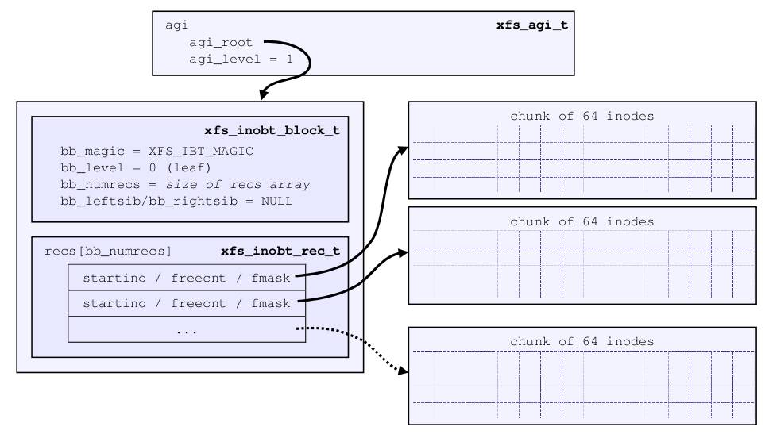
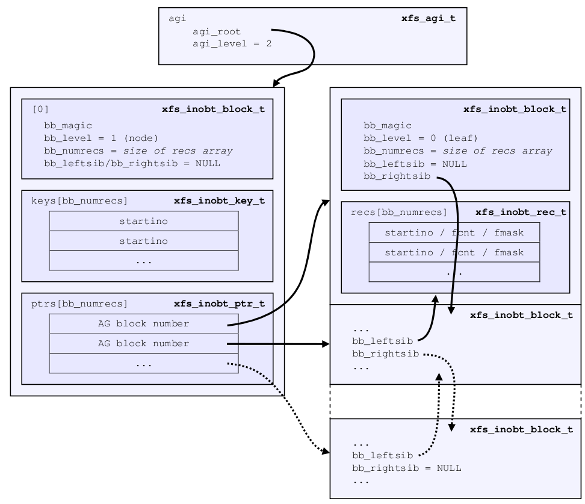
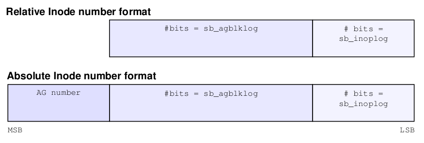

# AGI

## 数据结构

```c
/*
 * Size of the unlinked inode hash table in the agi.
 */
#define	XFS_AGI_UNLINKED_BUCKETS	64

typedef struct xfs_agi {
	/*
	 * Common allocation group header information
	 */
	__be32		agi_magicnum;	/* magic number == XFS_AGI_MAGIC */
	__be32		agi_versionnum;	/* header version == XFS_AGI_VERSION */
	__be32		agi_seqno;	/* sequence # starting from 0 */
	__be32		agi_length;	/* size in blocks of a.g. */
	/*
	 * Inode information
	 * Inodes are mapped by interpreting the inode number, so no
	 * mapping data is needed here.
	 */
	__be32		agi_count;	/* count of allocated inodes */
	__be32		agi_root;	/* root of inode btree */
	__be32		agi_level;	/* levels in inode btree */
	__be32		agi_freecount;	/* number of free inodes */

	__be32		agi_newino;	/* new inode just allocated */
	__be32		agi_dirino;	/* last directory inode chunk */
	/*
	 * Hash table of inodes which have been unlinked but are
	 * still being referenced.
	 */
	__be32		agi_unlinked[XFS_AGI_UNLINKED_BUCKETS];
	/*
	 * This marks the end of logging region 1 and start of logging region 2.
	 */
	uuid_t		agi_uuid;	/* uuid of filesystem */
	__be32		agi_crc;	/* crc of agi sector */
	__be32		agi_pad32;
	__be64		agi_lsn;	/* last write sequence */

	__be32		agi_free_root; /* root of the free inode btree */
	__be32		agi_free_level;/* levels in free inode btree */

	/* structure must be padded to 64 bit alignment */
} xfs_agi_t;
```


## xfs_db解析

这里我们重新格式化一下再看

```bash
xfs_db> agi 0
xfs_db> p
magicnum = 0x58414749
versionnum = 1
seqno = 0
length = 65536
count = 64
root = 3
level = 1
freecount = 61
newino = 64
dirino = null
unlinked[0-63] = 
uuid = 8a91da9b-d333-4f39-8c75-acd0f5b68b35
lsn = 0
crc = 0xcb96977e (correct)
free_root = 0
free_level = 0
```

AGI 位于一个 AG 中的第 3 个 Sector（或者说从 0 数第 2 个）

```bash
[root@centos ~]# xxd -a -s $((512*2)) -l 512 /dev/vda
0000400: 5841 4749 0000 0001 0000 0000 0001 0000  XAGI............
         agi_magicnum        agi_seqno
                   agi_versionnum      agi_length
0000410: 0000 0040 0000 0003 0000 0001 0000 003d  ...@...........=
         agi_count agi_root  agi_level agi_freecount
0000420: 0000 0040 ffff ffff ffff ffff ffff ffff  ...@............
         agi_newino          agi_unlinked
                   agi_dirino
0000430: ffff ffff ffff ffff ffff ffff ffff ffff  ................
0000440: ffff ffff ffff ffff ffff ffff ffff ffff  ................
0000450: ffff ffff ffff ffff ffff ffff ffff ffff  ................
0000460: ffff ffff ffff ffff ffff ffff ffff ffff  ................
0000470: ffff ffff ffff ffff ffff ffff ffff ffff  ................
0000480: ffff ffff ffff ffff ffff ffff ffff ffff  ................
0000490: ffff ffff ffff ffff ffff ffff ffff ffff  ................
00004a0: ffff ffff ffff ffff ffff ffff ffff ffff  ................
00004b0: ffff ffff ffff ffff ffff ffff ffff ffff  ................
00004c0: ffff ffff ffff ffff ffff ffff ffff ffff  ................
00004d0: ffff ffff ffff ffff ffff ffff ffff ffff  ................
00004e0: ffff ffff ffff ffff ffff ffff ffff ffff  ................
00004f0: ffff ffff ffff ffff ffff ffff ffff ffff  ................
0000500: ffff ffff ffff ffff ffff ffff ffff ffff  ................
0000510: ffff ffff ffff ffff ffff ffff ffff ffff  ................
0000520: ffff ffff ffff ffff 8a91 da9b d333 4f39  .............3O9
                             agi_uuid
0000530: 8c75 acd0 f5b6 8b35 cb96 977e 0000 0000  .u.....5...~....
                             agi_crc   agi_pad32
0000540: 0000 0000 0000 0000 0000 0000 0000 0000  ................
         agi_lsn             agi_free_root
                                       agi_free_level
*
00005f0: 0000 0000 0000 0000 0000 0000 0000 0000  ................
```


## 成员

### agi_magicnum

__be32 agi_magicnum = 0x58414749

AGI 结构的第一个域仍然是代表这个域的 magic number，按照 ASCII 码逐字节翻译得到，0x58='X', 0x41='A', 0x47='G', 0x49='I'。


### agi_versionnum

__be32 agi_versionnum = 0x00000001

对于 AGI 结构来说，目前只有一个历史版本，记录在 XFS_AGI_VERSION，所以此处为 1。


### agi_seqno

__be32 agi_seqno = 0x00000000

此 AGI 结构所属 AG 号，因为我取的是 AG-0 的 AGI，所以此处是 0。


### agi_length

__be32 agi_length = 0x00010000

记录当前 AG 的大小，单位为文件系统 blocksize。即 65536 * 4096 = 268435456 字节


### agi_count

__be32 agi_count = 0x00000040

agi_count 表示当前 AG 已经分配了多少数量的 inodes，0x0040 表示当前已经分配了 64 个 inodes。


### agi_root /agi_level

__be32 agi_root = 3

__be32 agi_level = 1

agi_root 指明当前 AG 用于管理 inode 的 B+Tree 结构的根在哪个 block。一般对于一个刚刚初始化的 XFS 来说 (agi_level=1的时候)，AGI 在每个 AG 的 3 号 block 里（对于512 sector size来说)，但是这是一个变值，会随着 inode btree 复杂度的增加而变。

agi_level 表明当前用于 inode 管理的 B+Tree 的深度。


### agi_freecount

__be32 agi_freecount = 0x0000003d（61）

agi_freecount 表示当前有多少未被使用的 inodes。需要注意的是这个 freecount 是相对于已经分配的 inode chunks 来说的，可以理解为已经分配了数组空间，但是有一部分没有赋有效值。更多的内容我们下面说到 Inode B+Tree 的时候再说。


### agi_newino

__be32 agi_newino = 0x00000040

指明最近最后一次分配的 inode 号。


### agi_dirino

__be32 agi_dirino = 0xffffffff

此域已经被废弃不再使用，所以保持为 NULL (-1)


### agi_unlinked

__be32 agi_unlinked[XFS_AGI_UNLINKED_BUCKETS] = 0xfffffffffffffffffffff.......fffffffff

XFS_AGI_UNLINKED_BUCKETS=64，所以 64*4 字节 = 256 字节长度。所以此域占 256 个字节长度。

这个域是一个哈希表，用于追踪那些已经被删除，但是仍然被运行中的某些程序占用的 inodes。只有在运行中或 crash 掉的 XFS 中才可能在这个域中看到非 NULL(-1) 的数值。所以此处全是 ffff.....ffff。


### agi_uuid/agi_crc/agi_lsn

与之前讲的没区别


### agi_pad32

__be32 agi_pad32 = 0x00000000

填补对齐用的域，无用数值。


### agi_free_root/agi_free_level 

__be32 agi_free_root = 0

__be32 agi_free_level = 0

AGI 用于管理 free inode 的 B+Tree 结构的头结构地址和深度。参考 agi_root 和 agi_level。

我这里总是 0，可能是我当前不支持，或者没有开启 finobt 这个 feature（创建文件系统的时候使用 "-m finobt=1" 来打开）。


## INO/FINO B+Tree header

前面我们讲过的 AGF 相关的内容，由 AGF 结构找到其下各个 B+Tree 结构的头部。同理 AGI 结构也是如此，我们可以通过 AGI 的 agi_root 和 agi_free_root 找到其下管理 inode 和 free inode 的两个 B+Tree 的头部结构。同样这里的 block 也是以 xfs_btree_block 开头，因为管理 inode 属于 AG 内部管理，所以此处同样使用short format 的 xfs_btree_block，这里再重复讲一遍。

```c
struct xfs_btree_block{
        __be32          bb_magic;       /* magic number for block type */
        __be16          bb_level;       /* 0 is a leaf */
        __be16          bb_numrecs;     /* current # of data records */
        /* short form block header */
        __be32          bb_leftsib;
        __be32          bb_rightsib;

        __be64          bb_blkno;
        __be64          bb_lsn;
        uuid_t          bb_uuid;
        __be32          bb_owner;
        __le32          bb_crc;
};
```

IAB3 表示是 INO B+Tree，FIB3 表示是 FINO B+Tree

```bash
[root@centos ~]# xxd -a -s $((4096*3)) -l 4096 /dev/vda
0003000: 4941 4233 0000 0001 ffff ffff ffff ffff  IAB3............
         bb_magic  bb_level  bb_leftsib
                        bb_numrecs     bb_rightsib
0003010: 0000 0000 0000 0018 0000 0000 0000 0000  ................
         bb_blkno            bb_lsn
0003020: 8a91 da9b d333 4f39 8c75 acd0 f5b6 8b35  .....3O9.u.....5
         bb_uuid
0003030: 0000 0000 b5a2 87ae 0000 0040 0000 003d  ...........@...=
         bb_owner  bb_crc
0003040: ffff ffff ffff fff8 0000 0000 0000 0000  ................
0003050: 0000 0000 0000 0000 0000 0000 0000 0000  ................
*
0003ff0: 0000 0000 0000 0000 0000 0000 0000 0000  ................
```


__be32 bb_magic = 0x49414233

关于 magic number 我们已经说过很多次了，几乎每个基础元数据结构上都有一个 magic number 用于表明自己是谁，这里逐字节翻译为 ASCII 码为 IAB3，这就是 V5 XFS 的 INOBT block 的 header 的名字。同理 FINOBT block 的 magic number 是 FIB3。

其余字段参考 BNO/CNT B+Tree，此处就不赘述了。


## 单级 INO/FINO B+Tree

在了解了 B+Tree 的每个 block 的 header 结构后，我们还是先以最简单的单级结构为例进行说明。

所谓的单级，也就是当前的 INO/FINO B+Tree 只有 root block 一个 block，而且里面存储的都是叶子节点，分布大概如下：

```sh
|<------             Block           ------>|
+--------+--------+--------+       +--------+
| header | record | record |  ...  | record |
+--------+--------+--------+       +--------+
```

这就引申出了用于 INO B+Tree (简称 INOBT) 的 record 的结构，但是在描述这个结构之前我们需要先知道 XFS 如何分配和管理 inode 块 (inode chunk)。

在我们讲述 XFS 的 Superblock 结构的时候讲到了 sb_inodesize，也就是用于存储 inode 结构的大小。这是一个在制作文件系统时就固定的大小，里面存储着 inode 的最基本元数据以及 inode 索引其下数据时使用的结构。

这里我们先不讲述 Inode 结构的内部细节，我们先讲述怎么存储和索引到 inode。首先 XFS 不是一个 inode 一个 inode 这样散乱的分配和管理的，而是以 chunk（块）为单位管理的，一个 chunk 由多少个 inodes 组成定义如下：

```c
typedef uint64_t	xfs_inofree_t;
#define NBBY		8		/* number of bits per byte */
#define	XFS_INODES_PER_CHUNK		(NBBY * sizeof(xfs_inofree_t))
```

XFS_INODES_PER_CHUNK = 8*8 = 64，所以每个 chunk 由 64 个 inodes 组成。我们可以理解为这是一个由 64 个 inodes 组成的数组，每个数组成员的大小是 sb_inodesize 个字节。比如我们常见的 V5 XFS 默认以 512 字节为 inodesize。目前最大的 inodesize 是 2048 字节，且 inodesize 不能超过 blocksize 的一半。

上述的 chunk 就是 inode B+Tree 管理 inode 的基本单位，每个叶子节点上的记录对应的是一个 chunk，一个 Inode B+Tree 的叶子节点的结构为：

```c
typedef struct xfs_inobt_rec {
	__be32		ir_startino;	/* starting inode number */
	union {
		struct {
			__be32	ir_freecount;	/* count of free inodes */
		} f;
		struct {
			__be16	ir_holemask;/* hole mask for sparse chunks */
			__u8	ir_count;	/* total inode count */
			__u8	ir_freecount;	/* count of free inodes */
		} sp;
	} ir_u;
	__be64		ir_free;	/* free inode mask */
} xfs_inobt_rec_t;
```

这里面包含了一个联合体，里面有两个可选的四字节大小的结构，根据 sparse inode 特性的启用与否决定使用哪个结构。

Sparse Inode 特性是为了在 XFS 没有足够的空间连续分配一个或多个 chunk 的 inodes 时使用的，一般在文件系统特别碎片化的时候会碰到这种问题。如果没有sparse inode 这个特性，这种情况只能返回 ENOSPC 错误，表示文件系统已经没有空间了。如果有 sparse inode 特性，则 XFS 会表示“大夫，我觉得我还可以再抢救一下”，于是 XFS 尝试以小于一个 chunk 的大小（目前最小为sb_spino_align）分配空间。如果这样大小的连续空间都没有，那就真的只能返回 ENOSPC 了。

下面我们以支持 sparse inode 为例讲解：一方面是因为我们可以粗略的理解为使能 sparse inode 的 xfs_inobt_rec_t 是不使能此特性的 xfs_inobt_rec_t 的一个超集（多 ir_holemask 和 ir_count 两个域）；另一方面是因为目前 sparse inode 已经是上游 XFS 和各大支持 XFS 的系统默认开启的特性，属于主流推荐使用。

一个支持 sparse inode 的 INO/FINO B+Tree 的 record 结构定义如下：

```c
struct xfs_inobt_rec {
        __be32  ir_startino;    /* starting inode number */
        __be16  ir_holemask;    /* hole mask for sparse chunks */
        __u8    ir_count;       /* total inode count */
        __u8    ir_freecount;   /* count of free inodes */
        __be64  ir_free;        /* free inode mask */
}
```

相比于上一篇 BNO/CNT B+Tree 的 record 的结构，这里的更加复杂一些。一个简单的 [start, count] 组已经不能满足对一个 inode chunk 的管理了，所以这里引入更多变量。

-   ir_startino 表示一个 inode chunk 里 inode num 最小的那个 inode，也就是这个 chunk 的起始 inode。
-   ir_freecount 表示当前的 inode chunk 里有多少**已经分配了空间，但是还没有被使用**（没有具体对应的 inode）的数量。
-   ir_free 是一个位图，64 位二进制的每一位与 inode chunk 里的 64 个 inodes 一一对应，被使用的 inode，对应位会被置 0，否则保持 1。换句话说 1 表示对应的位置可用。
-   ir_holemask 用于 sparse inode 特性，我们前面说过 sparse inode 允许在分配 inodes 的时候可以以小于一个 chunk 的大小来分配，这就会出现本来一个chunk 的 inodes 里有“空洞”存在。可以理解为逻辑上还是以 64 个 inodes 为一个 chunk，每个 inodes 都占用一个逻辑地址（inode number），但是物理上可能有些 inodes 暂时还没有分配空间，造成这段逻辑地址出现“空洞”。ir_holemask 就是用来表示一个 chunk 中哪里有“空洞”，ir_holemask 是一个 16 位数，所以它每一个位对应 4 个连续 inode 的位置。比如如果 ir_holemask=0xff00，则表示一个 inode chunk 里高 32 个 inodes 是还没有实际分配空间的。
-   ir_count 也是由 sparse inode 特性引入的一个变量。表示当前一共有多少已经分配了空间的 inodes。因为在没有 sparse inode 特性的情况下总量肯定是 64，但是有了 sparse inode 后就不一定了，所以需要一个域来记录实际数值。

有了上面的基本结构，我们就可以表示一个单级 INO/FINO B+Tree 的构成了。

 

```bash
xfs_db> agi 0
xfs_db> p
magicnum = 0x58414749
versionnum = 1
seqno = 0
length = 65536
count = 64
root = 3
level = 1
freecount = 61
newino = 64
dirino = null
unlinked[0-63] = 
uuid = 8a91da9b-d333-4f39-8c75-acd0f5b68b35
lsn = 0
crc = 0xcb96977e (correct)
free_root = 0
free_level = 0

xfs_db> addr root
xfs_db> p
magic = 0x49414233
level = 0
numrecs = 1
leftsib = null
rightsib = null
bno = 24
lsn = 0
uuid = 8a91da9b-d333-4f39-8c75-acd0f5b68b35
owner = 0
crc = 0xb5a287ae (correct)
recs[1] = [startino,freecount,free] 1:[64,61,0xfffffffffffffff8]
```

recs[1] 表示这个 chunk 的 inode 从 64 号开始，有 61 个空闲，从位图看是最低位 3 个 inode 被使用了，表示 64 65 66 已经被使用，分别对应 root inode/sb_rbmino/sb_rsumino。


## 多级 INO/FINO B+Tree

和讲 AGF 时我们讲到的多级 BNO/CNT B+Tree 一样，多级 INO/FINO B+Tree 的非叶子节点也存储着 [key, ptr] 对儿，key 用于索引范围，ptr 则用于定位通过 key 索引到的 block 的地址。

 

每个 record 可以记录 64 个 inode，一个 record 占16 个字节，那么粗略计算一个块可以有 4096 / 16 * 64 = 16384 个 inode，我们直接创建 20000 个文件就能构造出二级树了。

```bash
#!/bin/bash
DIR="/mnt/a"
for i in {1..20000}
do
    touch $DIR/$i
done
```

我们可以看到现在分配的 inode 总数是 20032，是 64 的整数倍，其中我们创建了 20000 个加上系统的 3 个，那么剩余 20032 - 20003 = 29 个。

```bash
xfs_db> agi 0
xfs_db> p
magicnum = 0x58414749
versionnum = 1
seqno = 0
length = 65536
count = 20032
root = 2176
level = 2
freecount = 29
newino = 21504
dirino = null
unlinked[0-63] = 
uuid = 076bd168-9dfd-4ee7-90a6-a4c1f8539371
lsn = 0x1000032c2
crc = 0xb85488e (correct)
free_root = 0
free_level = 0

xfs_db> addr root
xfs_db> p
magic = 0x49414233
level = 1
numrecs = 2
leftsib = null
rightsib = null
bno = 17408
lsn = 0x100002882
uuid = 076bd168-9dfd-4ee7-90a6-a4c1f8539371
owner = 0
crc = 0x89dcc384 (correct)
keys[1-2] = [startino] 1:[64] 2:[8672]
ptrs[1-2] = 1:3 2:2143
```

假设我们要找一个 inode=12345 的文件，那么我们首先对比 keys，发现 12345>8672 ，所以应该去 ptrs[2] 即块 2143 去找，可以在 recs[54] 这个 chunk 中找到，那么这个 inode 的数据结构存在哪个地方呢？我们继续分析

```bash
xfs_db> fsblock 2143
xfs_db> type inobt
xfs_db> p
magic = 0x49414233
level = 0
numrecs = 187
leftsib = 3
rightsib = null
bno = 17144
lsn = 0x1000032c2
uuid = 076bd168-9dfd-4ee7-90a6-a4c1f8539371
owner = 0
crc = 0x76e4bc20 (correct)
recs[1-187] = [startino,freecount,free] 1:[8672,0,0] 2:[8736,0,0] 3:[8800,0,0] 4:[8864,0,0] 5:[8960,0,0] 6:[9024,0,0] 7:[9088,0,0] 
8:[9152,0,0] 9:[9216,0,0] 10:[9280,0,0] 11:[9344,0,0] 12:[9408,0,0] 13:[9504,0,0] 14:[9568,0,0] 15:[9632,0,0] 16:[9696,0,0] 17:[9760,0,0] 
18:[9824,0,0] 19:[9888,0,0] 20:[9952,0,0] 21:[10048,0,0] 22:[10112,0,0] 23:[10176,0,0] 24:[10240,0,0] 25:[10304,0,0] 26:[10368,0,0] 
27:[10432,0,0] 28:[10496,0,0] 29:[10592,0,0] 30:[10656,0,0] 31:[10720,0,0] 32:[10784,0,0] 33:[10848,0,0] 34:[10912,0,0] 35:[11008,0,0] 
36:[11072,0,0] 37:[11136,0,0] 38:[11200,0,0] 39:[11264,0,0] 40:[11328,0,0] 41:[11424,0,0] 42:[11488,0,0] 43:[11552,0,0] 44:[11616,0,0] 
45:[11680,0,0] 46:[11744,0,0] 47:[11808,0,0] 48:[11904,0,0] 49:[11968,0,0] 50:[12032,0,0] 51:[12096,0,0] 52:[12160,0,0] 53:[12224,0,0] 
54:[12320,0,0] 55:[12384,0,0] 56:[12448,0,0] 57:[12512,0,0] 58:[12576,0,0] 59:[12640,0,0] 60:[12704,0,0] 61:[12800,0,0] 62:[12864,0,0] 
63:[12928,0,0] 64:[12992,0,0] 65:[13056,0,0] 66:[13120,0,0] 67:[13216,0,0] 68:[13280,0,0] 69:[13344,0,0] 70:[13408,0,0] 71:[13472,0,0] 
72:[13568,0,0] 73:[13632,0,0] 74:[13696,0,0] 75:[13760,0,0] 76:[13824,0,0] 77:[13888,0,0] 78:[13952,0,0] 79:[14016,0,0] 80:[14112,0,0] 
81:[14176,0,0] 82:[14240,0,0] 83:[14304,0,0] 84:[14368,0,0] 85:[14464,0,0] 86:[14528,0,0] 87:[14592,0,0] 88:[14656,0,0] 89:[14720,0,0] 
90:[14784,0,0] 91:[14848,0,0] 92:[14944,0,0] 93:[15008,0,0] 94:[15072,0,0] 95:[15136,0,0] 96:[15200,0,0] 97:[15264,0,0] 98:[15360,0,0] 
99:[15424,0,0] 100:[15488,0,0] 101:[15552,0,0] 102:[15616,0,0] 103:[15680,0,0] 104:[15776,0,0] 105:[15840,0,0] 106:[15904,0,0] 
107:[15968,0,0] 108:[16032,0,0] 109:[16096,0,0] 110:[16160,0,0] 111:[16256,0,0] 112:[16320,0,0] 113:[16384,0,0] 114:[16448,0,0] 
115:[16512,0,0] 116:[16576,0,0] 117:[16672,0,0] 118:[16736,0,0] 119:[16800,0,0] 120:[16864,0,0] 121:[16928,0,0] 122:[16992,0,0] 
123:[17056,0,0] 124:[17152,0,0] 125:[17216,0,0] 126:[17280,0,0] 127:[17344,0,0] 128:[17440,0,0] 129:[17504,0,0] 130:[17568,0,0] 
131:[17632,0,0] 132:[17728,0,0] 133:[17792,0,0] 134:[17856,0,0] 135:[17920,0,0] 136:[17984,0,0] 137:[18048,0,0] 138:[18112,0,0] 
139:[18208,0,0] 140:[18272,0,0] 141:[18336,0,0] 142:[18400,0,0] 143:[18464,0,0] 144:[18528,0,0] 145:[18624,0,0] 146:[18688,0,0] 
147:[18752,0,0] 148:[18816,0,0] 149:[18880,0,0] 150:[18944,0,0] 151:[19040,0,0] 152:[19104,0,0] 153:[19168,0,0] 154:[19232,0,0] 
155:[19296,0,0] 156:[19360,0,0] 157:[19424,0,0] 158:[19488,0,0] 159:[19584,0,0] 160:[19648,0,0] 161:[19712,0,0] 162:[19776,0,0] 
163:[19840,0,0] 164:[19936,0,0] 165:[20000,0,0] 166:[20064,0,0] 167:[20128,0,0] 168:[20192,0,0] 169:[20256,0,0] 170:[20320,0,0] 
171:[20416,0,0] 172:[20480,0,0] 173:[20544,0,0] 174:[20608,0,0] 175:[20672,0,0] 176:[20736,0,0] 177:[20832,0,0] 178:[20896,0,0] 
179:[20960,0,0] 180:[21024,0,0] 181:[21088,0,0] 182:[21152,0,0] 183:[21248,0,0] 184:[21312,0,0] 185:[21376,0,0] 186:[21440,0,0] 
187:[21504,29,0xfffffff800000000]
```


## Inode Number

XFS 的 inode number 由三部分组成，实际使用中有两种使用格式，一种不带 AG 号，我们称之为相对 inode 号，不会超过 32 位。另一种带 AG 号，我们称之为绝对 inode 号，也是我们经常从用户层看到的（如 ls -li 的时候）。

 

我们已经知道一个 XFS 由 1 到多个 AG 组成，每个 AG 里有很多 blocks，一个 block 可以存储多个 inode 实例。所以定位 XFS 上一个具体的 inode 就演变成了三个问题：

1.  在哪个 AG 里？
2.  在 AG 的哪个 block 里？
3.  是 block 里存放的第几个 inode？

回答了这三个问题就等于定位了一个具体的 inode。正好上述 inode number 的结构就分成了三个部分：

1.  High bits 部分用于确定一个 inode 所属的 AG，具体有多少个 bits 不是固定的，要由 log 以 2 为底 sb_agcount 的对数决定 High bits 的位数。比如 sb_agcount = 4，那么 High bits 就占 2 个 bits。
2.  Middle bits 部分用于确定 inode 在 High bits 确定的 AG 的第几个 block 里，Middle bits 所占位数由 sb_agblklog 决定，换句话说这个段的位宽至少应该够表示一个 AG 的 0 到最大 block 号。
3.  Low bits 用于最后确定所寻 inode 是上述已确定 block 里的第几个 inode。Low bits 的位宽同样不是固定的，由 sb_inopblog 决定。

这里我们还是以找寻 12345 inode 的文件，对应二进制 0011 0000 0011 1001，我们首先看一下 sb_inopblog 是多少：

```bash
[root@centos ~]# xfs_db -r -c "sb 0" -c "p inopblog" /dev/vda 
inopblog = 3
```

所以 Low bits 的位宽为 3 位，用以表示 inode 在 block 的偏移量，所以取出低三位就是 001(B) = 1。

接着我们需要知道 sb_agblklog 是多少：

```bash
[root@centos ~]# xfs_db -r -c "sb 0" -c "p agblklog" /dev/vda 
agblklog = 16
```

所以 Middle bits 的位宽是 16 位，去掉前面 3 个位，再往高位数 16 位就是Middle bits，指明我们要找的 inode 在 AG 内的第几个 block，0000011000000111(B) = 1543，所以就是 AG 内的第 1543 个 block。

AG number 是 0， 表示在第 0 个 AG 里。

联合整个计算结果得知：inode number 12345 对应当前 XFS 的第 0 个 AG 的第 1543 个 block 的第 1 个 inode (从 0 开始数)。我们去验证一下

```bash
xfs_db> fsblock 1543
xfs_db> type inode
xfs_db> p
core.magic = 0x494e
...
v3.inumber = 12344
...
```

第 0 个 inode 为 12344，那么第 1 个就是 12345 了。

这里可以理解为 inode 是根据分配的 block 来推算出来的，而不用提前分配好，这样就可以**动态分配 inode** 。而不至于 inode 表分配完了而剩余很多 block 不能使用（比如使用位图的方式分配 inode）。

​		