# Inode

上面我们分析了 inode 的分配，那么 inode 里面具体保存了什么内容呢？

前面我们已经知道，inode 的大小由 sb_inodesize 决定，默认是 512 字节。这 512 字节的空间就是一个 inode 实例，由三个部分组成。

 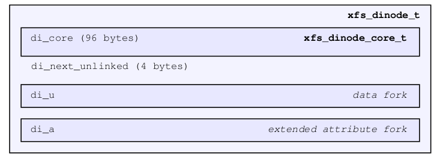

第一个主要部分就是 inode 的核心数据结构，也可以说是每个 inode 的头部结构，就像 Superblock 对于整个 XFS 的意义一样。这是一个固定大小的结构，在过去占 96 个字节，后来在 V5 XFS 上扩展了 inode 的结构，截至到目前 (linux 5.11) 这个结构占 176 个字节。好在这种核心结构并不常变动，所以若干年后你可能还看到是这个样子。

我们上面看到我们的 XFS 的 inodesize 设置的是 512 字节（V5 XFS一定不会比这个小），所以即便 inode core 占了 176 了字节，还剩下 512-176=336 个字节。这剩下的这段空间就用来管理 inode 所对应的数据和扩展属性。

具体怎么分，由 inode core 中的一个 forkoff 变量来划分出一个边界，上半部分用于数据管理，下半部分用于扩展属性管理。具体细节后面再说，这里我们先知道一个 inode 的空间由这三部分组成。


## Inode Core

### 结构体

```c
#define	XFS_DINODE_MAGIC		0x494e	/* 'IN' */
typedef struct xfs_dinode {
	__be16		di_magic;	/* inode magic # = XFS_DINODE_MAGIC */
	__be16		di_mode;	/* mode and type of file */
	__u8		di_version;	/* inode version */
	__u8		di_format;	/* format of di_c data */
	__be16		di_onlink;	/* old number of links to file */
	__be32		di_uid;		/* owner's user id */
	__be32		di_gid;		/* owner's group id */
	__be32		di_nlink;	/* number of links to file */
	__be16		di_projid_lo;	/* lower part of owner's project id */
	__be16		di_projid_hi;	/* higher part owner's project id */
	__u8		di_pad[6];	/* unused, zeroed space */
	__be16		di_flushiter;	/* incremented on flush */
	xfs_timestamp_t	di_atime;	/* time last accessed */
	xfs_timestamp_t	di_mtime;	/* time last modified */
	xfs_timestamp_t	di_ctime;	/* time created/inode modified */
	__be64		di_size;	/* number of bytes in file */
	__be64		di_nblocks;	/* # of direct & btree blocks used */
	__be32		di_extsize;	/* basic/minimum extent size for file */
	__be32		di_nextents;	/* number of extents in data fork */
	__be16		di_anextents;	/* number of extents in attribute fork*/
	__u8		di_forkoff;	/* attr fork offs, <<3 for 64b align */
	__s8		di_aformat;	/* format of attr fork's data */
	__be32		di_dmevmask;	/* DMIG event mask */
	__be16		di_dmstate;	/* DMIG state info */
	__be16		di_flags;	/* random flags, XFS_DIFLAG_... */
	__be32		di_gen;		/* generation number */

	/* di_next_unlinked is the only non-core field in the old dinode */
	__be32		di_next_unlinked;/* agi unlinked list ptr */

	/* start of the extended dinode, writable fields */
	__le32		di_crc;		/* CRC of the inode */
	__be64		di_changecount;	/* number of attribute changes */
	__be64		di_lsn;		/* flush sequence */
	__be64		di_flags2;	/* more random flags */
	__u8		di_pad2[16];	/* more padding for future expansion */

	/* fields only written to during inode creation */
	xfs_timestamp_t	di_crtime;	/* time created */
	__be64		di_ino;		/* inode number */
	uuid_t		di_uuid;	/* UUID of the filesystem */

	/* structure must be padded to 64 bit alignment */
} xfs_dinode_t;
```


### xfs_db解析

```bash
xfs_db> inode 12345
xfs_db> p
core.magic = 0x494e
core.mode = 0100644
core.version = 3
core.format = 2 (extents)
core.nlinkv2 = 1
core.onlink = 0
core.projid_lo = 0
core.projid_hi = 0
core.uid = 0
core.gid = 0
core.flushiter = 0
core.atime.sec = Tue Nov 23 16:45:09 2021
core.atime.nsec = 910000000
core.mtime.sec = Tue Nov 23 16:45:09 2021
core.mtime.nsec = 910000000
core.ctime.sec = Tue Nov 23 16:45:09 2021
core.ctime.nsec = 910000000
core.size = 0
core.nblocks = 0
core.extsize = 0
core.nextents = 0
core.naextents = 0
core.forkoff = 35
core.aformat = 1 (local)
core.dmevmask = 0
core.dmstate = 0
core.newrtbm = 0
core.prealloc = 0
core.realtime = 0
core.immutable = 0
core.append = 0
core.sync = 0
core.noatime = 0
core.nodump = 0
core.rtinherit = 0
core.projinherit = 0
core.nosymlinks = 0
core.extsz = 0
core.extszinherit = 0
core.nodefrag = 0
core.filestream = 0
core.gen = 3421011520
next_unlinked = null
v3.crc = 0x184bf722 (correct)
v3.change_count = 5
v3.lsn = 0x100001e42
v3.flags2 = 0
v3.crtime.sec = Tue Nov 23 16:45:09 2021
v3.crtime.nsec = 910000000
v3.inumber = 12345
v3.uuid = 076bd168-9dfd-4ee7-90a6-a4c1f8539371
u3 = (empty)
a.sfattr.hdr.totsize = 51
a.sfattr.hdr.count = 1
a.sfattr.list[0].namelen = 7
a.sfattr.list[0].valuelen = 37
a.sfattr.list[0].root = 0
a.sfattr.list[0].secure = 1
a.sfattr.list[0].name = "selinux"
a.sfattr.list[0].value = "unconfined_u:object_r:unlabeled_t:s0\000"
```

前面我们计算过 inode 12345 所在的块位置，这里我们读取对应位置的数据

```bash
[root@centos ~]# xxd -a -s $((4096*1543 + 512)) -l 512 /dev/vda
0607200: 494e 81a4 0302 0000 0000 0000 0000 0000  IN..............
         di_magic  version   di_uid    di_gid
              mode   di_format
                        di_onlink
0607210: 0000 0001 0000 0000 0000 0000 0000 0000  ................
         di_nlink  di_projid_lo             di_flushiter
                        di_projid_hi
                             di_pad
0607220: 619c aa15 363d 7f80 619c aa15 363d 7f80  a...6=..a...6=..
         di_atime            di_mtime
0607230: 619c aa15 363d 7f80 0000 0000 0000 0000  a...6=..........
         di_ctime            di_size
0607240: 0000 0000 0000 0000 0000 0000 0000 0000  ................
         di_nblocks          extsize   di_nextents
0607250: 0000 2301 0000 0000 0000 0000 cbe8 7e40  ..#...........~@
         di_anextents        di_dmstate
              di_forkoff          di_flags
                di_aformat             di_gen
                   di_dmevmask
0607260: ffff ffff 184b f722 0000 0000 0000 0005  .....K."........
         di_next_unlinked    di_changecount
                   di_crc
0607270: 0000 0001 0000 1e42 0000 0000 0000 0000  .......B........
         di_lsn              di_flags2
0607280: 0000 0000 0000 0000 0000 0000 0000 0000  ................
         di_pad2
0607290: 619c aa15 363d 7f80 0000 0000 0000 3039  a...6=........09
         di_crtime           di_ino
06072a0: 076b d168 9dfd 4ee7 90a6 a4c1 f853 9371  .k.h..N......S.q
         di_uuid
06072b0: 0000 0000 0000 0000 0000 0000 0000 0000  ................
*
06073c0: 0000 0000 0000 0000 0033 0100 0725 0473  .........3...%.s
06073d0: 656c 696e 7578 756e 636f 6e66 696e 6564  elinuxunconfined
06073e0: 5f75 3a6f 626a 6563 745f 723a 756e 6c61  _u:object_r:unla
06073f0: 6265 6c65 645f 743a 7330 0000 0000 0000  beled_t:s0......

```


### 成员

#### di_magic 

__be16 di_magic = 0x494e

Inode 的 magic number，对应字符 "IN" 的 ASCII 码。XFS 上 Inode 域的开头都是 "IN"


#### di_mode

__be16 di_mode = 0x81a4

di_mode 用不同的位表示各种 inode的 类型和 rwx 权限等信息，参考 stat(2) 的stat.st_mode。或者参考 include/linux/stat.h。我们这里不列出所有的标志了，只针对当前值进行一下分析：

0x81a4 对应八进制的 100644，最高位的 1 表示 S_IFREG，说明当前 inode 是一个普通文件。

尾数的 644 对应文件的基本 user/group/other 访问权限，所以 di_mode=0x81a4 就相当于你 ls -l 时看到的 “-rw-r--r--”。


#### di_version

__u8 di_version = 0x03

inode version是 3 对应 V5 XFS（支持 CRC）


#### di_format 

__u8 di_format = 0x02 (extents)

di_format 指明 data fork 组织数据的结构类型，包含以下可选项：

```c
/*
 * Values for di_format
 */
typedef enum xfs_dinode_fmt {
	XFS_DINODE_FMT_DEV,		/* xfs_dev_t */
	XFS_DINODE_FMT_LOCAL,		/* bulk data */
	XFS_DINODE_FMT_EXTENTS,		/* struct xfs_bmbt_rec */
	XFS_DINODE_FMT_BTREE,		/* struct xfs_bmdr_block */
	XFS_DINODE_FMT_UUID		/* uuid_t */
} xfs_dinode_fmt_t;

```

但一个 inode 并不是可以在这些类型中随意选择，要根据前面 di_mode 里表明的 inode 类型不同，可以使用不同的类型。

比如目录可以使用 LOCAL 格式但普通文件不行，DEV 格式顾名思义是给字符或块设备使用的，普通文件通过 EXTENTS 或 BTREE 格式组织数据，在数据量适中且不过度分散时使用 EXTENTS 格式即可，当有大量数据会数据碎片化程度很高时则将 EXTENTS 格式扩展为 BTREE 格式，我们后面会具体讲这些格式，尤其 LOCAL，EXTENTS 和 BTREE 是最常见的。

UUID 格式目前已经不再使用了。


#### di_onlink

__be16 di_onlink = 0x0000

di_onlink 是给旧的 V1 inode 使用的，我们这里 di_version=3，所以此处为 0。


#### di_uid/di_gid 

__be32 di_uid = 0x00000000

__be32 di_gid = 0x00000000

di_uid 是这个文件属主的 uid，di_gid 是属主的 gid，因为我是用 root 创建的文件，且没有 chown，所以 root 用户的 uid 和 gid 都是 0。


#### di_nlink

__be32 di_nlink = 0x00000001

di_nlink 是代替 di_onlink 给 V2，V3 inode 使用的，表示这个文件有多少硬链接，因为这是一个独立的文件，所以链接数是 1。


#### di_projid_lo/di_projid_hi 

__be16 di_projid_lo = 0x0000

__be16 di_projid_hi = 0x0000

存储当前文件的 project quota id，其中 di_projid_hi 在 XFS_SB_VERSION2_PROJID32BIT 特性使能的时候有效。因为我这里没有使用 quota，更没有配置 project quota，所以这里都是 0。


#### di_pad

__u8 di_pad[6] = 0x000000000000

预留的占位空间，目前无用，全 0 处理。


#### di_flushiter

__be16 di_flushiter = 0x0000

记录 flush inode 的次数，不过在 V3 以后的版本的 inode（也就是 V5 XFS）后就不需要了。不过为了保证对以前版本的兼容性，保留这个域。


#### di_atime/di_mtime/di_ctime 

xfs_timestamp_t di_atime  = 0x619c aa15 363d 7f80 

xfs_timestamp_t di_mtime = 0x619c aa15 363d 7f80

xfs_timestamp_t di_ctime  = 0x619c aa15 363d 7f80

三个时间戳，分别表示当前 inode 最后一次访问时间 (atime)，最后一次文件被修改的时间 (mtime)，以及最后一次 inode 状态被修改的时间 (ctime)。

因为记录访问时间可能会过于频繁影响性能，所以可以使用 noatime 挂载选项来让不记录 atime。

XFS 的时间戳使用Unix时间格式：

```c
typedef struct xfs_timestamp {
	__be32		t_sec;		/* timestamp seconds */
	__be32		t_nsec;		/* timestamp nanoseconds */
} xfs_timestamp_t;
```

比如 di_atime = 0x619c aa15 363d 7f80，对应这个结构就是：

```text
t_sec = 0x619caa15 = 1637657109
t_nsec = 0x363d7f80 = 910000000
```

将秒数转成时间看的话类似这样：

```bash
[root@centos ~]# date -d @1637657109
Tue Nov 23 16:45:09 CST 2021
```

和 xfs_db 读取时间的一致：core.atime.sec = Tue Nov 23 16:45:09 2021


#### di_size

__be64 di_size = 0x0000000000000000

Inode 的大小，对于文件 inode 来说并不是其实际占用空间的大小，而是看 EOF 的位置。对于目录 inode 来说就是目录条目所占的空间。


#### di_nblocks

__be64 di_nblocks = 0x0000000000000000

表示当前 inode 占用了多少 fs blocks，这个 blocks 数统计的是和数据相关的 block，以及和其相关的元数据 (B+Tree结构) 占用的 block。但是这里不包括用于扩展属性的 blocks。因为我都创建的空文件，所以这里是 0。


#### di_extsize

__be32 di_extsize = 0x00000000

di_extsize 指明带 rtdev 的 XFS 的 extent size，或者作为一个"暗示性"的数值，影响普通 XFS 分配新空间 (如调用 xfs_alloc_file_space) 时 extent size 的对齐。

如果目录带 XFS_DIFLAG_EXTSZINHERIT 标志，则这个目录下的文件将自动被标记为 XFS_DIFLAG_EXTSIZE。目前我没有设置这个值，此处为 0。


#### di_nextents

__be32 di_nextents = 0x00000000

di_nextents 记录当前的用于存储数据的 extents 个数，关于什么是 extent，我们后面说。此时可以暂时先理解为一段连续 blocks 空间。因为我都创建的空文件，所以这里是 0。


#### di_anextents

__be16 di_anextents = 0x0000

与 di_nextents 类似，用于存储扩展属性的 extent 个数。


#### di_forkoff

__u8 di_forkoff = 0x23

在讲到 inode 基本组成的时候我们就提到了 forkoff，这是 datafork 和 attrfork 空间的分界点。因为要 64 位对齐，所以这里的数值要在乘以 8 等到真正的偏移字节量，0x23 = 35，35*8=280。具体 forkoff 对 datafork 和 attrfork 的影响我们下面再讲。


#### di_aformat

__s8 di_aformat = 0x01

参照 di_format，aformat 是用于指明此 inode 组织扩展属性数据时使用的数据结构的，此处是 1，表示 LOCAL。


#### di_dmevmask/dmstate

__be32 di_dmevmask = 0x00000000

__be16 di_dmstate = 0x0000

上古 XFS 留下的和 DMAPI 相关的东西，不过在当前 Linux XFS 上并没有实现，所以这两个域当前没有意义。


#### di_flags

__be16 di_flags = 0x0000

与 inode 有关的标记，目前包括（注意下面的数字是位偏移量 1<< N）：

```c
/*
 * Values for di_flags
 * There should be a one-to-one correspondence between these flags and the
 * XFS_XFLAG_s.
 */
#define XFS_DIFLAG_REALTIME_BIT  0	/* file's blocks come from rt area */
#define XFS_DIFLAG_PREALLOC_BIT  1	/* file space has been preallocated */
#define XFS_DIFLAG_NEWRTBM_BIT   2	/* for rtbitmap inode, new format */
#define XFS_DIFLAG_IMMUTABLE_BIT 3	/* inode is immutable */
#define XFS_DIFLAG_APPEND_BIT    4	/* inode is append-only */
#define XFS_DIFLAG_SYNC_BIT      5	/* inode is written synchronously */
#define XFS_DIFLAG_NOATIME_BIT   6	/* do not update atime */
#define XFS_DIFLAG_NODUMP_BIT    7	/* do not dump */
#define XFS_DIFLAG_RTINHERIT_BIT 8	/* create with realtime bit set */
#define XFS_DIFLAG_PROJINHERIT_BIT   9	/* create with parents projid */
#define XFS_DIFLAG_NOSYMLINKS_BIT   10	/* disallow symlink creation */
#define XFS_DIFLAG_EXTSIZE_BIT      11	/* inode extent size allocator hint */
#define XFS_DIFLAG_EXTSZINHERIT_BIT 12	/* inherit inode extent size */
#define XFS_DIFLAG_NODEFRAG_BIT     13	/* do not reorganize/defragment */
#define XFS_DIFLAG_FILESTREAM_BIT   14  /* use filestream allocator */
#define XFS_DIFLAG_REALTIME      (1 << XFS_DIFLAG_REALTIME_BIT)
#define XFS_DIFLAG_PREALLOC      (1 << XFS_DIFLAG_PREALLOC_BIT)
#define XFS_DIFLAG_NEWRTBM       (1 << XFS_DIFLAG_NEWRTBM_BIT)
#define XFS_DIFLAG_IMMUTABLE     (1 << XFS_DIFLAG_IMMUTABLE_BIT)
#define XFS_DIFLAG_APPEND        (1 << XFS_DIFLAG_APPEND_BIT)
#define XFS_DIFLAG_SYNC          (1 << XFS_DIFLAG_SYNC_BIT)
#define XFS_DIFLAG_NOATIME       (1 << XFS_DIFLAG_NOATIME_BIT)
#define XFS_DIFLAG_NODUMP        (1 << XFS_DIFLAG_NODUMP_BIT)
#define XFS_DIFLAG_RTINHERIT     (1 << XFS_DIFLAG_RTINHERIT_BIT)
#define XFS_DIFLAG_PROJINHERIT   (1 << XFS_DIFLAG_PROJINHERIT_BIT)
#define XFS_DIFLAG_NOSYMLINKS    (1 << XFS_DIFLAG_NOSYMLINKS_BIT)
#define XFS_DIFLAG_EXTSIZE       (1 << XFS_DIFLAG_EXTSIZE_BIT)
#define XFS_DIFLAG_EXTSZINHERIT  (1 << XFS_DIFLAG_EXTSZINHERIT_BIT)
#define XFS_DIFLAG_NODEFRAG      (1 << XFS_DIFLAG_NODEFRAG_BIT)
#define XFS_DIFLAG_FILESTREAM    (1 << XFS_DIFLAG_FILESTREAM_BIT)
```

xfs_db 很贴心地把这些标志位都列出来了。

```bash
# XFS_DIFLAG_NEWRTBM_BIT 表示当前 inode 使用 real-time bitmap 格式，参照 sb_rbmino。
core.newrtbm = 0
# XFS_DIFLAG_PREALLOC_BIT 表示当前 inode 含有预分配的 extent。
core.prealloc = 0
# XFS_DIFLAG_REALTIME_BIT 表示当前 inode 的数据位于在 realtime 设备上。
core.realtime = 0	
# XFS_DIFLAG_IMMUTABLE_BIT 用于阻止对当前文件的所有修改，甚至以写权限打开都不可以。
core.immutable = 0
# XFS_DIFLAG_APPEND_BIT 表示此文件只能追加内容，不能删除。
core.append = 0
# XFS_DIFLAG_SYNC_BIT 表示当前当前 inode 的写操作都是同步写操作。
core.sync = 0
# XFS_DIFLAG_NOATIME_BIT 表示不更新当前 inode 的 atime。
core.noatime = 0
# do not dump
core.nodump = 0
# XFS_DIFLAG_RTINHERIT_BIT 用于目录的 inode，表示其下的 inode 将自动继承 XFS_DIFLAG_REALTIME_BIT 标志。
core.rtinherit = 0
# XFS_DIFLAG_PROJINHERIT_BIT 也用于目录，表示其下的 inode 将自动继承 di_projid*。
core.projinherit = 0
# XFS_DIFLAG_NOSYMLINKS_BIT 也用于目录，表示其下不允许创建符号链接。
core.nosymlinks = 0
# XFS_DIFLAG_EXTSIZE_BIT 用于文件，指明 real-time 文件的 extent size 或普通文件的暗示性 extent size，参照 di_extsize。
core.extsz = 0
# XFS_DIFLAG_EXTSZINHERIT_BIT 用于目录，其下的 inode 继承 di_extsize。
core.extszinherit = 0
# XFS_DIFLAG_NODEFRAG_BIT 表示碎片化整理的时候忽略这个 inode。
core.nodefrag = 0
# XFS_DIFLAG_FILESTREAM_BIT 具有这个标记的目录会提前 reserve AG 的可用空间，并把这部分 reserve 的空间留给自己下面的 inode 使用，
# 其它不在此目录下的 inode 在申请空间时则不会获得这部分空间。
core.filestream = 0
```


#### di_gen

__be32 di_gen = 0xcbe87e40

这个数字可以理解为一个不重复的随机数字，用于一个 inode 的身份 ID，一般用于用户层工具做 inode 的扫描、备份等时候使用。这个数字在 inode 创建时创建，在 inode 被删除后可能被后续新建的 inode 重新使用。


#### di_next_unlinked

__be32 di_next_unlinked = 0xffffffff

这个域与讲解 AGI 时提到的 agi_unlinked 有关，和它一起总称一个链表，用于追踪那些已经被删除但是仍然在使用状态的 inode。对于一个正常卸载的 XFS 文件系统这个域一般是 0xffffffff 表示 NULL。

一般只有在这个文件系统正在使用中，或者在使用中被迫突然掉线留下 corrupted 的文件系统，才有可能留下非 NULL 的情况。

所有 unlinked 的但是仍然在占用中的 inode，会以 hash 表的形式组织成这样：

 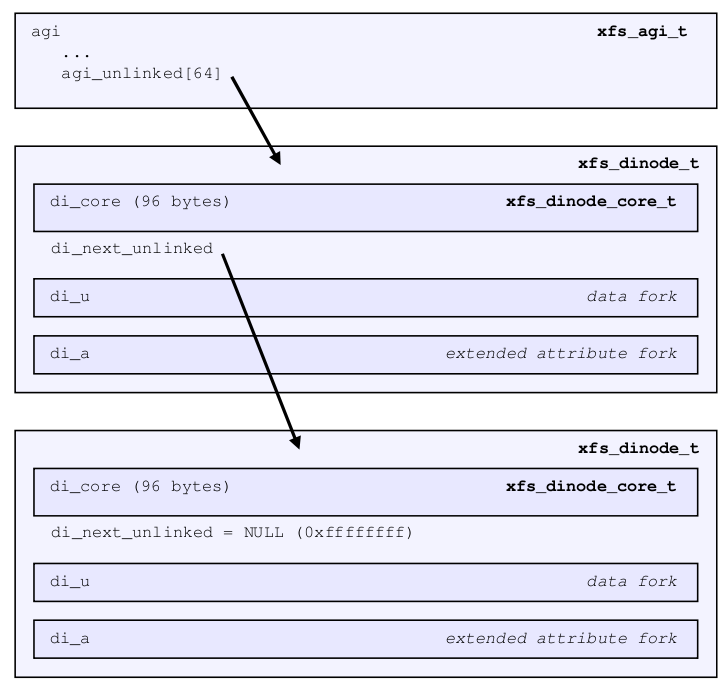


#### di_crc

__le32 di_crc = 0x184bf722

和之前讲过的 *_crc 一样，这里是当前 inode 内容的 CRC 校验值，用于校验元数据完整性。


#### di_changecount

__be64 di_changecount = 5

XFS 给这个变量起这个名字可能是因为它没有进入 Linux 前就这么叫吧（个人猜测），刚看到时我也有点不知道它干什么的，看了一下代码后才发现原来它对应就是 Linux 通用 inode 结构的 i_version。每次 inode 被修改，就会增加它的计数。


#### di_lsn

__be64 di_lsn = 0x100001e42

最后一次对 inode 进行写入操作的 Log sequence number。


#### di_flags2

__be64 di_flags2 = 0x0x 0000000000000000

这个 flag 域是为了 V3 inode 而增加的，因为我们看到上面原始的 di_flags 已经没有空余了。当前未扩展任何属性


#### di_pad2[16]

又是一段占位的无用空间，用 0 填充。


#### di_crtime

xfs_timestamp_t di_crtime = 0x619c aa15 363d 7f80

和上面讲到的几个时间戳格式一样，这里这个变量用来记录 inode 的创建时间。如何解析这个时间戳可参考上面讲解 di_atime 的部分。


__be64 di_ino = 0x3039

当前这个 inode 的绝对 inode 号（不是相对于 AG 的相对 inode 号），0x3039=12345，说明当前的 inode 号是 12345。


#### di_uuid

uuid_t di_uuid = 076bd168-9dfd-4ee7-90a6-a4c1f8539371

和以往我们讲到的 uuid 一样。


## Data fork

### Forkoff

在正式介绍 Data fork 部分之前，我们有一个概念必须先说清楚，那就是我们说到 Datafork 和 attrfork 之间是有一个分界，这个分界叫 forkoff，记录在 inode core 的 di_forkoff 变量里，是一个偏移量。而这个偏移量从 inode 块的末端开始数，介于 inode core 的末端和整个 inode 块的末端之间。

以前，这个偏移量固定在中间位置，对应现在现在的 noattr2 挂载选项。不过这个已经不推荐使用了，因为如果任何一方数据量很小甚至根本没有，那么这将浪费很多。所以现在的XFS都默认使用一个移动的 forkoff，像这样：

 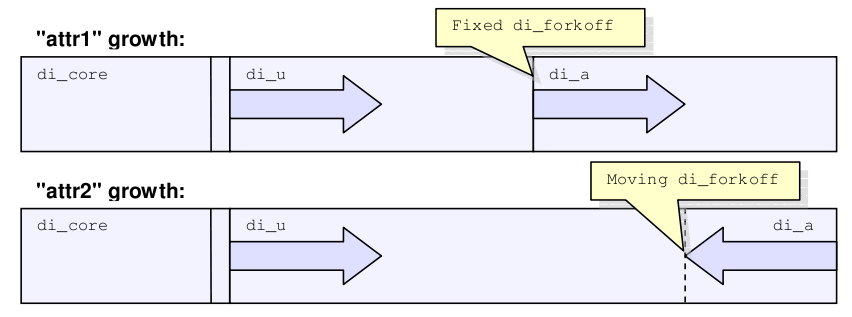

现在的 forkoff 可以从 inode 的末端，也就是上图的最右边开始，以 8 个字节为单位，在不超过 inode core 末端的范围内自由移动。甚至它的移动有时也会引起 data fork 或 attr fork 内元数据格式的变化。


### Extent

介绍了 forkoff 如何隔开 data 和 attr 之后，在正式介绍 data 内元数据结构之前，还有一个概念也必须先说明白，那就是 Extent。

**extent 经常作为文件系统组织数据的基本单位**，而不是 block。当然 block 确实是基本单元，但是却不是基本的数据组织结构。

一个 extent 可以理解为由一段连续的 blocks 组成，这段 blocks 的物理地址和 inode 数据的逻辑地址存在对应 (map)关系。我们通常管这种关系叫 "bmap"，这个关键字你会经常在文件系统相关的资料或代码里看到，bmap 是将逻辑块号转换为物理块号的重要映射。即使是在远古的 Unix 系统的文件系统上，就存在这样的概念。比如一个文件长 3 个blocks，那么它的逻辑地址是 0，1，2 号 block，但是它对应在存储设备上的物理地址却可能是 14857，476，989874 号block（当然一般情况下尽量让它连续有序）。总之一个 extent 需要描述一段连续物理块地址，并和 inode 的逻辑地址关联。

不同的文件系统会有不同的 extent 格式，XFS 用 128 位（16 个字节）描述一个 extent，我们也称这个为一个 extent 的 record (或 bmbt record)（如果将 extent 认为是那段连续的 blocks，描述这段连续 blocks 的叫 extent record。但时平时说的时候往往都叫 extent，根据语境判断是在说那段空间还是在说描述这段空间的元数据结构），extent 的格式格式如下：

 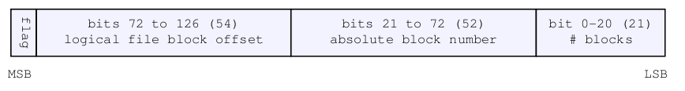

对应的结构如下：

```c
typedef struct xfs_bmbt_rec {
	__be64			l0, l1;
} xfs_bmbt_rec_t;
```

是的，你没有看错，这就是 on-disk 的结构，两个 64 位的变量组成的一个 128 位的结构体，对应上面的 128 位结构。

当然这样的定义并不方便对其内部结构进行寻址，所以在实际加载到内存后会转化为下面的结构：

```c
typedef struct xfs_bmbt_irec
{
	xfs_fileoff_t	br_startoff;	/* starting file offset */
	xfs_fsblock_t	br_startblock;	/* starting block number */
	xfs_filblks_t	br_blockcount;	/* number of blocks */
	xfs_exntst_t	br_state;	/* extent state */
} xfs_bmbt_irec_t;
```

这样就对应上上面 extent 结构的 4 个域了，分别是：

br_startoff ：文件的逻辑偏移块号，属于文件 size 内的逻辑偏移。(bits 72 to 126)

br_startblock ：此 extent 相对于整个文件系统的起始物理块号。(bits 21 to 72)

br_blockcount ：此 extent 包含多少个块。（bits 0 to 20)

br_state ：此 extent 的一个标记位，包含下面两个标记：

```c
typedef enum {
	XFS_EXT_NORM, XFS_EXT_UNWRITTEN,
} xfs_exntst_t;
```

XFS_EXT_UNWRITTEN 表示当前 extent 处于预分配但是还没有实际数据写入的状态。

XFS_EXT_NORM 则是相对于 XFS_EXT_UNWRITTEN 而言是一个正式的有数据写入状态的 extent。

一个文件如果没有任何数据，则它没有任何 data extents。如果有数据，则至少包含一个 extent。

一个 extent 最短可以是 1 个 block，最长不能超过 2<sup>21</sup> （实际还要减一）个block，如果 blocksize是 4k，则 2<sup>21</sup> * 4096 = 8589934592，也就是 8G。那为什么是 2 的 21 次方呢？因为根据上面 extent 的定义，"number of blocks" 占 21 位。

这里我们重新格式化一下文件系统，然后创建一个 8G 的数据块

```bash
[root@centos ~]# mkfs.xfs -f /dev/vdd 
meta-data=/dev/vdd               isize=512    agcount=4, agsize=1310720 blks
         =                       sectsz=512   attr=2, projid32bit=1
         =                       crc=1        finobt=0, sparse=0
data     =                       bsize=4096   blocks=5242880, imaxpct=25
         =                       sunit=0      swidth=0 blks
naming   =version 2              bsize=4096   ascii-ci=0 ftype=1
log      =internal log           bsize=4096   blocks=2560, version=2
         =                       sectsz=512   sunit=0 blks, lazy-count=1
realtime =none                   extsz=4096   blocks=0, rtextents=0
[root@centos ~]# mount /dev/vdd /mnt/d/
[root@centos ~]# dd if=/dev/zero of=/mnt/d/big bs=8M count=1024
1024+0 records in
1024+0 records out
8589934592 bytes (8.6 GB) copied, 265.317 s, 32.4 MB/s
[root@centos ~]# ll -li /mnt/d/big 
67 -rw-r--r--. 1 root root 8589934592 Nov 24 17:10 /mnt/d/big
```

我们可以看到这个文件的 inode 是 67，前面我们讲过 64/65/66 已经被分配掉了，那么这里第一个文件分配的 inode 自然就是 67。

```bash
[root@centos ~]# xfs_db /dev/vdd 
xfs_db> inode 67
xfs_db> p
inode core info ...
u3.bmx[0-1] = [startoff,startblock,blockcount,extentflag] 0:[0,16,1048560,0] 1:[1048560,2097160,1048592,0]
...
```

1048560 + 1048592 = 2097152，2097152 * 4KB = 8GB。文件逻辑块 0 开始的 1048560 个块映射到物理块 16 号 开始的 1048560 个块，逻辑块 1048560 开始的 1048592 个块对应从 2097160 物理块开始的 1048592 个块。

这里没有分配到最大的 extend，可能是因为实际在分配 extent 的时候因受到碎片化、AG size 等条件的影响，实际一个 extent 的大小很少达到最大。但是一个文件可以有很多很多 extents 组成。当你尝试向一个普通文件写入数据时，XFS 优先给你分配与此文件 inode 同 AG 的空间，如果 AG 内剩余空间不够或因为其它原因处于不能分配给此文件的状态，XFS 则会跨 AG 寻求更多空间。


### Data format of Regular file

#### Extents list

在 inode core 中我们提到了 di_format，其指明当前 inode 存储数据的格式。

对于普通文件来说有两种格式可选，分别是 extents list 格式和 B+Tree 格式。

其中 extent list 格式 (XFS_DINODE_FMT_EXTENTS) 表示用于组织数据 extents 的元数据以一组 extent records 数组的形式存储在 inode 的 data fork 区域。通过 XFS_DFORK_DPTR(inode) 取到地址后转换成 xfs_bmbt_rec_t 类型即可得到这种格式下的 extent record。

extent list 格式如下图所示：

 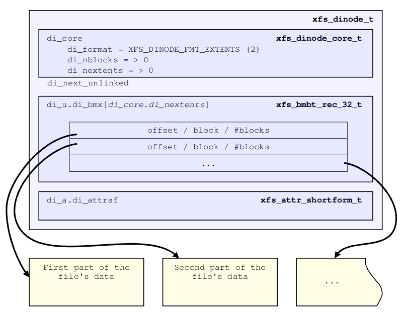

这个很好理解，每一个 extent record 就是上面的 xfs_bmbt_rec_t 类型的 128 位大小的一个结构，将其顺序的存储在 inode 的 data fork 区域就是最简单的文件组织数据的方式。

我们可以试着算一下，按照这种格式，一个 inode 最多可以存储多少个 extents。

1.  我们以 inodesize=512 字节为例，V5 xfs 的 inode core 占 176 个字节，所以留给 datafork+attrfork 的空间就是 512-176=336 个字节。
2.  假设我们使用可变动的 forkoff，并假设我们没有设置任何扩展属性，那么 forkoff=0，即 attrfork 的区域大小为 0，这样的话这 336 个字节都是 datafork 的。
3.  从上一节我们知道每个 extent record 的大小是 128 位，也就是 16 个字节。那么 336 个字节的空间最多可以容纳 336/16=21 个 extent records。

上一节我们也看到了，每个 extent 的大小也有上限，更何况很少能碰到一个 extent 占据它能达到的连续最大空间的情况，所以说按照这种格式存储的话，能够容纳的数据量非常有限。

比如我们就先构造一个 inodesize=512 的 V5 XFS，并创建一个文件让其 di_forkoff=0，并有 21 个 extents:

```bash
[root@centos ~]# mkfs.xfs -f -i size=512 /dev/vdd 
[root@centos ~]# mount /dev/vdd /mnt/d -o attr2 -o context=system_u:object_r:root_t:s0
[root@centos ~]# touch /mnt/d/inode_test1 ; for i in `seq 0 20`;do xfs_io -c "pwrite ${i}m 512k" /mnt/d/inode_test1 ;done
[root@centos ~]# ll -hi /mnt/d/inode_test1 
67 -rw-r--r--. 1 root root 21M Nov 24 18:59 /mnt/d/inode_test1
[root@centos ~]# umount /mnt/d/
[root@centos ~]# xfs_db /dev/vdd 
xfs_db> inode 67
xfs_db> p
core.magic = 0x494e
...
core.format = 2 (extents)
...
core.nextents = 21
core.naextents = 0
core.forkoff = 0
...
u3.bmx[0-20] = [startoff,startblock,blockcount,extentflag] 0:[0,16,128,0] 1:[256,272,240,0] 2:[512,528,240,0] 3:[768,784,240,0] 
4:[1024,1040,240,0] 5:[1280,1296,240,0] 6:[1536,1552,240,0] 7:[1792,1808,240,0] 8:[2048,2064,240,0] 9:[2304,2320,240,0] 
10:[2560,2576,240,0] 11:[2816,2832,240,0] 12:[3072,3088,240,0] 13:[3328,3344,240,0] 14:[3584,3600,240,0] 15:[3840,3856,240,0] 
16:[4096,4112,240,0] 17:[4352,4368,240,0] 18:[4608,4624,240,0] 19:[4864,4880,240,0] 20:[5120,5136,128,0]

```

我们可以看到 forkoff=0，naextents=0，说明目前没有 attrfork 的空间。并且 format = 2 (extents)，nextents = 21，说明当前 datafork 的格式是 extents(list) 的格式，并且有 21 个 extents。我们可以看一下当前 inode 的空间情况：

```bash
xfs_db> convert ino 67 daddr
0x43 (67)
xfs_db> daddr 67
xfs_db> type text
xfs_db> p
000:  49 4e 81 a4 03 02 00 00 00 00 00 00 00 00 00 00  IN..............
010:  00 00 00 01 00 00 00 00 00 00 00 00 00 00 00 00  ................
020:  61 9e 1a fd 0a 6e 49 c0 61 9e 1a fd 0e b8 eb c0  a....nI.a.......
030:  61 9e 1a fd 0e b8 eb c0 00 00 00 00 01 48 00 00  a............H..
040:  00 00 00 00 00 00 12 d0 00 00 00 00 00 00 00 15  ................
050:  00 00 00 02 00 00 00 00 00 00 00 00 97 46 22 0f  .............F..
060:  ff ff ff ff 96 95 13 91 00 00 00 00 00 00 0a 9f  ................
070:  00 00 00 01 00 00 00 08 00 00 00 00 00 00 00 00  ................
080:  00 00 00 00 00 00 00 00 00 00 00 00 00 00 00 00  ................
090:  61 9e 1a fd 0a 6e 49 c0 00 00 00 00 00 00 00 43  a....nI........C
0a0:  6f e1 a9 a5 ec 30 49 26 8e d0 67 b7 ef 80 58 0a  o....0I...g...X.
--------------  The end of inode core ---------------
0b0:  00 00 00 00 00 00 00 00 00 00 00 00 02 00 00 80  ................
0c0:  00 00 00 00 00 02 00 00 00 00 00 00 22 00 00 f0  ................
0d0:  00 00 00 00 00 04 00 00 00 00 00 00 42 00 00 f0  ............B...
0e0:  00 00 00 00 00 06 00 00 00 00 00 00 62 00 00 f0  ............b...
0f0:  00 00 00 00 00 08 00 00 00 00 00 00 82 00 00 f0  ................
100:  00 00 00 00 00 0a 00 00 00 00 00 00 a2 00 00 f0  ................
110:  00 00 00 00 00 0c 00 00 00 00 00 00 c2 00 00 f0  ................
120:  00 00 00 00 00 0e 00 00 00 00 00 00 e2 00 00 f0  ................
130:  00 00 00 00 00 10 00 00 00 00 00 01 02 00 00 f0  ................
140:  00 00 00 00 00 12 00 00 00 00 00 01 22 00 00 f0  ................
150:  00 00 00 00 00 14 00 00 00 00 00 01 42 00 00 f0  ............B...
160:  00 00 00 00 00 16 00 00 00 00 00 01 62 00 00 f0  ............b...
170:  00 00 00 00 00 18 00 00 00 00 00 01 82 00 00 f0  ................
180:  00 00 00 00 00 1a 00 00 00 00 00 01 a2 00 00 f0  ................
190:  00 00 00 00 00 1c 00 00 00 00 00 01 c2 00 00 f0  ................
1a0:  00 00 00 00 00 1e 00 00 00 00 00 01 e2 00 00 f0  ................
1b0:  00 00 00 00 00 20 00 00 00 00 00 02 02 00 00 f0  ................
1c0:  00 00 00 00 00 22 00 00 00 00 00 02 22 00 00 f0  ................
1d0:  00 00 00 00 00 24 00 00 00 00 00 02 42 00 00 f0  ............B...
1e0:  00 00 00 00 00 26 00 00 00 00 00 02 62 00 00 f0  ............b...
1f0:  00 00 00 00 00 28 00 00 00 00 00 02 82 00 00 80  ................
```

为了便于说明，我上面手动标记了 inode core 的结束位置。

我们可以看到这个分界线后面的空间也都被占满了，占满它的就是上面我们看到的 21 个 extent records。每个 extent record 是 128 位，也就是 16 个字节，正好对应上面的每一行，我们数一数，正好 21 行。

再代入上面讲到的 extent record 的 128 位格式中，就能知道每个 extent record 条目的内容了，相信和上面通过 xfs_db 列出的内容一致，感兴趣的可以自己算一下。

我们以最后一行为例：

```bash
00 00 00 00 00 28 00 00 00 00 00 02 82 00 00 80
# 对应二进制
00000000000000000000000000000000
00000000001010000000000000000000
00000000000000000000000000000010
10000010000000000000000010000000
# 按 bit 划分
0                                                       = 0
000000000000000000000000000000000000000001010000000000  = 5120
0000000000000000000000000000000000000001010000010000    = 5136
000000000000010000000                                   = 128
```

那么现在问题来了，整个 inode 空间都被占满了，这时候如果需要更多的 data extents 写入更多内容，或者需要添加扩展属性，怎么办呢？

这就要引出下一种 data fork 的存储格式 B+Tree。


#### BMap BTree

B+Tree (XFS_DINODE_FMT_BTREE) 的格式我们前面的文章已经介绍过很多了，如用于 AGF 的 bno/cnt btree 和用于 AGI 的 ino/fino btree。现在要介绍的是用于 Data fork 的 B+Tree，我们也称之为 BMap BTree。

变成 BTree 结构后，datafork 段就要存储这个 btree 的 root，也就是 BMap btree Data fork Root，通常简写为 bmdr。这个 root 的头部，就像我们之前在介绍 bnoroot，inoroot 的时候用到的 xfs_btree_block 一样，这里叫做 xfs_bmdr_block，所不同的是 xfs_btree_block 里面那些 lsn，crc，uuid，magic number 之类的东西我们已经放到 inode core里了，所以 xfs_bmdr_block 只需要两个变量：

```c
typedef struct xfs_bmdr_block {
	__be16		bb_level;	/* 0 is a leaf */
	__be16		bb_numrecs;	/* current # of data records */
} xfs_bmdr_block_t;
```

分别表示当前的深度，当前 block 里有多少 records。对于 data fork root 来说，这个 record 指的就是 [key, ptr] 对儿（前面讲过，但是前面讲的都是 32 位的 key，ptr，这里是 64 位的），对应的结构就是 xfs_bmdr_key_t 和 xfs_bmdr_ptr_t。或者说是 xfs_bmbt_key_t 和 xfs_bmbt_ptr_t 也行，因为结构相同。

```c
/*
 * Key structure for non-leaf levels of the tree.
 */
typedef struct xfs_bmbt_key {
	__be64		br_startoff;	/* starting file offset */
} xfs_bmbt_key_t, xfs_bmdr_key_t;

/* btree pointer type */
typedef __be64 xfs_bmbt_ptr_t, xfs_bmdr_ptr_t;
```

这里 key 记录的是文件的逻辑（块）偏移量，ptr 记录的是下一级 Btree Block 的块号。

需要注意的是，刚说的这些是和 Data fork 有关的结构，特别是 xfs_bmdr_block。

因为除了 data fork 以外，再往下的 B+Tree block 则像之前我们讲过的 B+Tree 结构那样，使用 xfs_btree_block 作为其头部 ，因为 Data fork 是一个特别的存在，它不是一个独立的 block，所以不像 bnoroot，inoroot 那样使用通用的xfs_btree_block，而是使用一个它特有的 xfs_bmdr_block 作为头部。而 Data fork 下面的节点就是独立的 blocks 了，所以仍然使用 xfs_btree_block。

与前面讲 bno btree，ino btree 时使用的 short format xfs_btree_block 不同，因为文件数据可以跨 AG 存取，所以这里不能使用短结构的 xfs_btree_block，而要使用长结构的 xfs_btree_block。

回顾一下我们之前看到的 xfs_btree_block 的定义：

```c
struct xfs_btree_block {
	__be32		bb_magic;	/* magic number for block type */
	__be16		bb_level;	/* 0 is a leaf */
	__be16		bb_numrecs;	/* current # of data records */
	union {
		struct xfs_btree_block_shdr s;
		struct xfs_btree_block_lhdr l;
	} bb_u;				/* rest */
};
```

之前我们使用的都是联合体中的 short format 的部分，这次我们要使用 long format 的部分，也就是 xfs_btree_block_lhdr，定义如下：

```c
/* long form block header */
struct xfs_btree_block_lhdr {
	__be64		bb_leftsib;
	__be64		bb_rightsib;

	__be64		bb_blkno;
	__be64		bb_lsn;
	uuid_t		bb_uuid;
	__be64		bb_owner;
	__le32		bb_crc;
	__be32		bb_pad; /* padding for alignment */
};
```

与 short format header 不同的地方就是一些用于寻址的变量变成 64 位了，整体结构大小也相应的变大了。我们将 xfs_btree_block 和 xfs_btree_block_lhdr 结合，就得到了 bmbt block 的结构 (当然这个定义现在已经没有了，我们这里只是展示一下)：

```c
struct xfs_btree_block {
        __be32          bb_magic;       /* magic number for block type */
        __be16          bb_level;       /* 0 is a leaf */
        __be16          bb_numrecs;     /* current # of data records */
        __be64          bb_leftsib;
        __be64          bb_rightsib;
        __be64          bb_blkno;
        __be64          bb_lsn;
        uuid_t          bb_uuid;
        __be64          bb_owner;
        __le32          bb_crc;
        __be32          bb_pad; /* padding for alignment */
}
```

讲述完用于 Data fork 的 BMap BTree 的基本结构，我们继续上面的例子往下讲。上面我们得到了一个包含 21 个 extents 的一个极限状态的 extents list 结构，整个 inode 块里，除了 inode core 以外，都被这 21 个 extent records 填满了。之后我如果再增加 extents 的数量，或添加 xattr 导致 forkoff 移动，都会造成 data fork 的空间不够的问题。那么这时候 data fork 就要变形，变成 B+Tree 的格式。

下面我选择以添加更多 extents 的方式让它变形，比如我再给那个文件添加一个 extent：

```bash
[root@centos ~]# mount /dev/vdd /mnt/d -o attr2 -o context=system_u:object_r:root_t:s0
[root@centos ~]# xfs_io -c "pwrite 100m 1m" /mnt/d/inode_test1 
wrote 1048576/1048576 bytes at offset 104857600
1 MiB, 256 ops; 0.0000 sec (697.350 MiB/sec and 178521.6179 ops/sec)
[root@centos ~]# ll -hi /mnt/d/inode_test1 
67 -rw-r--r--. 1 root root 101M Nov 25 09:00 /mnt/d/inode_test1
[root@centos ~]# umount /mnt/d/
[root@centos ~]# xfs_db /dev/vdd 
xfs_db> inode 67
xfs_db> p
...
core.version = 3
core.format = 3 (btree)
...
core.nextents = 22
core.naextents = 0
...
u3.bmbt.level = 1
u3.bmbt.numrecs = 1
u3.bmbt.keys[1] = [startoff] 1:[0]
u3.bmbt.ptrs[1] = 1:5135
```

我们发现添加一个 extent 后，总数量从 21 变成了 22，format 从 extent 变成了 btree。同时我们发现原来那二十多个 records 不见了，就剩下一个 [0, 5135] 的 [key, ptr] 对。然后还出现了 bmbt.level 和 bmbt.numrecs。这里对应上面我们说过的结构就是：

```c
struct xfs_bmdr_block {
        __be16 bb_level = 1;
        __be16 bb_numrecs = 1;
}

xfs_bmdr_key_t keys[1]=0;
xfs_bmdr_ptr_t ptrs[1]=5135;
```

这就是一个 BMap Btree Data fork Root 的样子，下面我们要顺着 [key，ptr] 对往下看，这里就一个[0，5135]，翻译成人话就是 “欲知文件偏移地址 0 后面的内容，请到 5135 号 block 去找”。

那下面我们就去这个 block 里看看：

```bash
xfs_db> addr u3.bmbt.ptrs[1]
xfs_db> p
magic = 0x424d4133
level = 0
numrecs = 22
leftsib = null
rightsib = null
bno = 41080
lsn = 0x100000014
uuid = 6fe1a9a5-ec30-4926-8ed0-67b7ef80580a
owner = 67
crc = 0x6248c8e8 (correct)
recs[1-22] = [startoff,startblock,blockcount,extentflag] 1:[0,16,128,0] 2:[256,272,240,0] 3:[512,528,240,0] 4:[768,784,240,0] 
5:[1024,1040,240,0] 6:[1280,1296,240,0] 7:[1536,1552,240,0] 8:[1792,1808,240,0] 9:[2048,2064,240,0] 10:[2304,2320,240,0] 
11:[2560,2576,240,0] 12:[2816,2832,240,0] 13:[3072,3088,240,0] 14:[3328,3344,240,0] 15:[3584,3600,240,0] 16:[3840,3856,240,0] 
17:[4096,4112,240,0] 18:[4352,4368,240,0] 19:[4608,4624,240,0] 20:[4864,4880,240,0] 21:[5120,5136,128,0] 22:[25600,5264,256,0]
```

我们仿佛一下就找到了似曾相识的内容，原来的那 21 个 extent record 跑到这里来了，并且如我们所预期的，多了一个，变成了 22 个 extents。注意看这个 block  开头的那些变量，就对应长结构的 xfs_btree_block 作为 header，后面就是 22 个 128 位宽的 extent records。

这就是一个单级的 BMap BTree 的样子，示意图如下：

 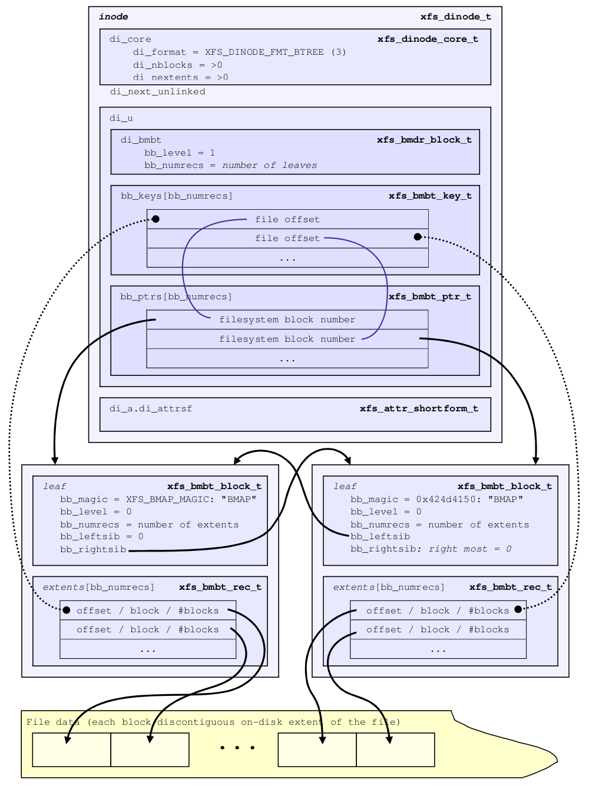

如果文件数据的 extent 数量继续增加，在达到一定数量后会导致 Btree 的深度变的更深，变成多级 B+Tree，一个多级 bmbt 的示意图如下：

 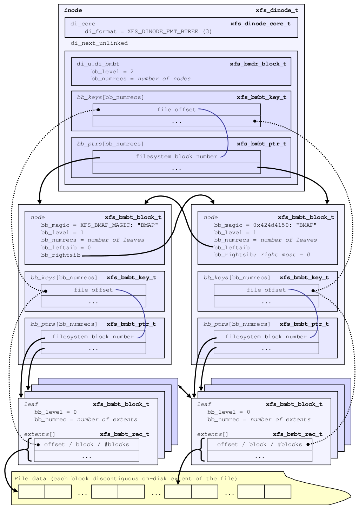


### Data format of Directory 

上面我们讲解了普通文件的数据组织结构，所以接下来我们继续说另一重要的 “文件” 种类——目录。

目录同样属于 XFS 的 Inode 范畴，所以同样拥有 XFS Inode 的三个主要结构，即 inode core、datafork 和 attrfork。不过其 Datafork 部分组织数据的方式完全不同于普通文件组织数据的方式，甚至可以说要略复杂一些。

首先 XFS 的目录有两种格式（版本），但是版本 1 已经废弃，不再支持了，现在默认都会得到 V2 directory，所以本文只讲解 V2 directory。

在目录的结构中也有一个 block 的概念，但是不同于 filesystem block，目录的 block 是用于自己的一个概念，所以当我们在讲解目录的过程我尽量使用 directory block，但是当我直接使用 block 或 blocksize 的时候，请根据上下文语境判断我是在说 filesystem block 还是 directory block（一般我会在没有歧义的地方使用）。

directory  blocksize 和最早我们讲解 superblock 的时候提及的一个成员有关，这个成员就是 sb_dirblklog，directory blocksize 和 filesystem blocksize (sb_blocksize) 的关系就是：

```text
directory blocksize = sb_blocksize * 2^sb_dirblklog
```

比如 sb_dirblklog=1，filesystem blocksize=4096，那么 directory blocksize 就是 4096 * 2<sup>1</sup>=8192。

不过默认情况下 directory blocksize 等于 filesystem blocksize 。

前面我们讲过 inode core 通过 di_format 成员表示当前 inode 的 datafork 组织数据的格式，并且我们也看到普通文件有两种组织方式，分别是 extents list 和 btree 格式。下面我们就说一下目录 datafork 的第一种组织格式——local format。我们也管以 local 格式存储数据的目录叫做 short format directory。


#### Local format

"Local" 顾名思义就是本地存储，即数据直接存储在 inode 的 datafork 空间里。我们前面已经知道 datafork 的空间非常有限，而且还受到 attrfork 的“打压”，所以能直接存储在 datafork 空间的数据必然短小精湛。

 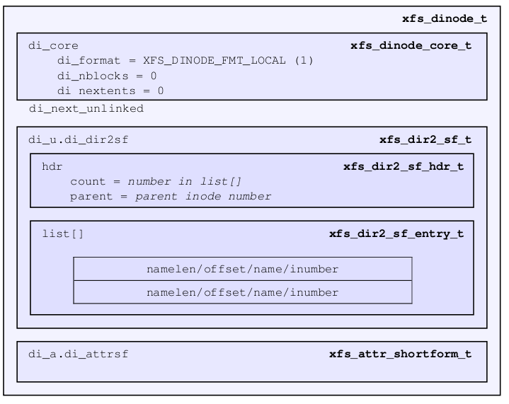

首先，是的，还是先有一个 header 结构：

```c
typedef struct xfs_dir2_sf_hdr {
	uint8_t			count;		/* count of entries */
	uint8_t			i8count;	/* count of 8-byte inode #s */
	uint8_t			parent[8];	/* parent dir inode number */
} __packed xfs_dir2_sf_hdr_t;
```

-   count 表示目录下面有多少条目。
-   i8count 表示有多少条目是用 64 位 inode 的。
-   parent[8] 记录此目录的父目录（上一级目录）的 inode 号。

目录的条目结构如下：

```c
typedef struct xfs_dir2_sf_entry {
	__u8			namelen;	/* actual name length */
	__u8			offset[2];	/* saved offset */
	__u8			name[];		/* name, variable size */
	/*
	 * A single byte containing the file type field follows the inode
	 * number for version 3 directory entries.
	 *
	 * A 64-bit or 32-bit inode number follows here, at a variable offset
	 * after the name.
	 */
} xfs_dir2_sf_entry_t;
```

-   namelen， 表示 name 中记录的文件名长度。
-   offset，用于辅助在 readdir 的时候迭代目录内容用的。
-   name[]，这是一个 flexible 数组。这里 name[] 只占一个结构体成员名字，但是并不占用实际空间，如果 sizeof(xfs_dir2_sf_entry_t) 的话会得到 3，name[] 的 size 相当于 0。但是 name[] 是有意义的，将来给 xfs_dir2_sf_entry_t 分配空间的时候，name 这个变量名可以用来寻址 offset 后面的空间。

一个 short format 的 directory entry 的完整样子是这样的：

```text
+---------+--------+---------------+-------+-----------+
| namelen | offset | name[namelen] | ftype | inode num |
+---------+--------+---------------+-------+-----------+
```

其中 ftype 用于表示当前 inode 的类型，属于一个加速性能的选项，其数值包括：

```c
/*
 * Dirents in version 3 directories have a file type field. Additions to this
 * list are an on-disk format change, requiring feature bits. Valid values
 * are as follows:
 */
#define XFS_DIR3_FT_UNKNOWN		0	// 不知道当前inode是什么类型
#define XFS_DIR3_FT_REG_FILE	1	// 普通文件
#define XFS_DIR3_FT_DIR			2	// 目录
#define XFS_DIR3_FT_CHRDEV		3	// 字符设备
#define XFS_DIR3_FT_BLKDEV		4	// 块设备
#define XFS_DIR3_FT_FIFO		5	// FIFO
#define XFS_DIR3_FT_SOCK		6	// SOCKET
#define XFS_DIR3_FT_SYMLINK		7	// 符号链接
#define XFS_DIR3_FT_WHT			8	// 用于overlayfs的whiteout文件，可参考rename的RENAME_WHITEOUT
```

举个例子：

```bash
[root@centos ~]# mkfs.xfs -f /dev/vda 
[root@centos ~]# mount /dev/vda /mnt/a -o attr2 -o context=system_u:object_r:root_t:s0
[root@centos ~]# mkdir /mnt/a/dir
[root@centos ~]# touch /mnt/a/dir/1
[root@centos ~]# touch /mnt/a/dir/2
[root@centos ~]# touch /mnt/a/dir/3
[root@centos ~]# ls -li /mnt/a/
67 drwxr-xr-x. 2 root root 33 Nov 25 10:59 dir
[root@centos ~]# umount /mnt/a/
[root@centos ~]# xfs_db /dev/vda 
xfs_db> inode 67
xfs_db> p
...
core.format = 1 (local)
...
u3.sfdir3.hdr.count = 3
u3.sfdir3.hdr.i8count = 0
u3.sfdir3.hdr.parent.i4 = 64
u3.sfdir3.list[0].namelen = 1
u3.sfdir3.list[0].offset = 0x60
u3.sfdir3.list[0].name = "1"
u3.sfdir3.list[0].inumber.i4 = 68
u3.sfdir3.list[0].filetype = 1
u3.sfdir3.list[1].namelen = 1
u3.sfdir3.list[1].offset = 0x70
u3.sfdir3.list[1].name = "2"
u3.sfdir3.list[1].inumber.i4 = 69
u3.sfdir3.list[1].filetype = 1
u3.sfdir3.list[2].namelen = 1
u3.sfdir3.list[2].offset = 0x80
u3.sfdir3.list[2].name = "3"
u3.sfdir3.list[2].inumber.i4 = 70
u3.sfdir3.list[2].filetype = 1
```

可以看到我们创建了一个目录，并在其下面创建 3 个文件，并且维持了 format = 1 (local) 的状态。

count = 3 表示下面有 3 个条目。

i8count 表示有 0 个条目是用于 64 位 inode 的，这里表示没有需要用到 64 位来保存的 inode number，都可以用 32 位就能表示了。

parent 记录此目录的父目录（上一级目录）的 inode 号，也就是根目录 inode 64。在保存 parent 时占用的位数会参考 i8count ，如果 i8count == 0，那么就只用 32 位来保存 parent。

我们可以读出这个 inode 512k 的内容，可以看到 parent 只占了 32 位。

```bash
[root@centos ~]# xxd -a -s $((4096*8 + 512*3)) -l 512 /dev/vda
0008600: 494e 41ed 0301 0000 0000 0000 0000 0000  INA.............
0008610: 0000 0002 0000 0000 0000 0000 0000 0000  ................
0008620: 619e fbf1 2273 9480 619e fbfc 31d4 5900  a..."s..a...1.Y.
0008630: 619e fbfc 31d4 5900 0000 0000 0000 0021  a...1.Y........!
0008640: 0000 0000 0000 0000 0000 0000 0000 0000  ................
0008650: 0000 0002 0000 0000 0000 0000 6432 f294  ............d2..
0008660: ffff ffff 8dcc 233f 0000 0000 0000 0005  ......#?........
0008670: 0000 0001 0000 0002 0000 0000 0000 0000  ................
0008680: 0000 0000 0000 0000 0000 0000 0000 0000  ................
0008690: 619e fbf1 2273 9480 0000 0000 0000 0043  a..."s.........C
00086a0: 8347 82de 6137 4de9 939a 57e0 71ff 1283  .G..a7M...W.q...
--------------  The end of inode core ---------------
00086b0: 0300 0000 0040 0100 6031 0100 0000 4401  .....@..`1....D.
         count          namelen   ftype       namelen   
           i8count        offset    inumber
              parent           name			  
00086c0: 0070 3201 0000 0045 0100 8033 0100 0000  .p2....E...3....
         offset ftype        namelen   ftype
              name inumber     offset    inumber
                                    name
00086d0: 4600 0000 0000 0000 0000 0000 0000 0000  F...............
00086e0: 0000 0000 0000 0000 0000 0000 0000 0000  ................
*
00087f0: 0000 0000 0000 0000 0000 0000 0000 0000  ................

```

目录下面有三个条目：

第一个条目名称长度 namelen = 1，offset = 0x60，name = 0x31 对应 ascii 码的 1，ftype = 1 表示是个普通文件，inumber = 0x44 = 68，即 inode 号

第二个条目名称长度 namelen = 1，offset = 0x70，name = 0x32 对应 ascii 码的 2，ftype = 1 表示是个普通文件，inumber = 0x45 = 69，即 inode 号

第三个条目名称长度 namelen = 1，offset = 0x80，name = 0x33 对应 ascii 码的 3，ftype = 1 表示是个普通文件，inumber = 0x46 = 70，即 inode 号


#### Extents format

##### Block Directory

上面我们已经知道一个 short format directory 的 entry 的大小是:

```text
sizeof(xfs_dir2_sf_entry_t) + namelen + sizeof(ftype) + sizeof(i4 or i8)
```

而 short foramt 的 directory header 的大小是：

```text
sizeof(count) + sizeof(i8count) + sizeof(i4 or i8 parent)
```

以全是 32 位 inode，namelen 都是 5 字节的目录为例的话，header 的 size=1+1+4=6，一个 entry 的 size=3+5+1+4=13。

以 inode size=512 字节的 V5 XFS 为例，inode core 占 176 字节，所以留给 datafork 和 attrfork 的空间就是 512-176=336 个字节。然后假设没有 xattr 的情况，所以 datafork 占用整个 336 个字节，先去掉 6 字节的 header，336-6=330 字节。能装下的上述 entry (有很多条件)的数量就是 330/13=25.4。

所以我们创建 25 个上述那样的 entry 的话就是当前维持 short format 的极限，创建超过 26 个就要寻求下一种格式以存储更多 entry 了。这下一种格式就是 Extents format，但是即便对于 Extents 格式，目录也有很多不同的组织格式，其中最简单的一种是以一个单一 directory block 来存储目录数据，我们管这种单一 directory block 存储数据的目录叫 Block directory。

 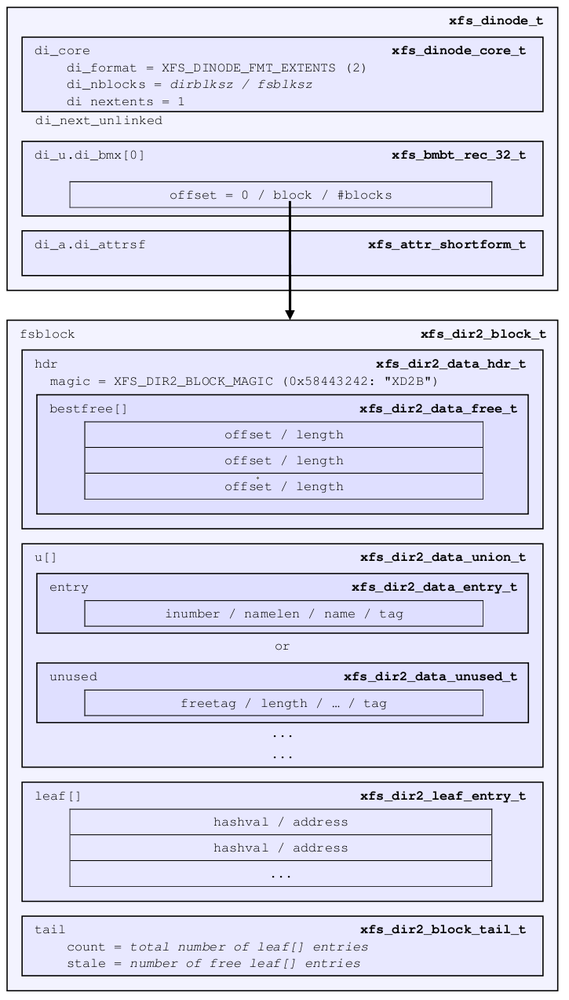

下面我们就创建一个 block directory，鉴于我们已经解释了 Short 变 Block 的起因，所以我就不展示创建过程了，直接给出一个 Block 格式的目录：

```bash
xfs_db> inode 67
xfs_db> p
core.magic = 0x494e
core.mode = 040755
core.version = 3
core.format = 2 (extents)
...
u3.bmx[0] = [startoff,startblock,blockcount,extentflag] 0:[0,16,1,0]

```

可以看到 format 已经变成了 extents。block directory 的 datafork 中只有一个 extent，就是那个 bmx[0]。并且 startoff 一定是 0，因为文件逻辑起始地址肯定是0。

blockcount 等于 direcotry blocksize / filesystem blocksize。这也很好理解，因为 Block directory 我们定义的时候就是只有一个 directory block，所以只需要一个 extent，并且这一个 extent 记录了目录从（逻辑）头（startoff=0）到尾的所有数据。

那么下面我们只要到 bmx[0] 所指向的地方去看一下那个 directory block 的内容：

```bash
xfs_db> fsblock 16
xfs_db> type dir3
xfs_db> p
bhdr.hdr.magic = 0x58444233
bhdr.hdr.crc = 0xa92ac9ef (correct)
bhdr.hdr.bno = 128
bhdr.hdr.lsn = 0x10000000f
bhdr.hdr.uuid = 834782de-6137-4de9-939a-57e071ff1283
bhdr.hdr.owner = 67
bhdr.bestfree[0].offset = 0x3f8
bhdr.bestfree[0].length = 0xaa0
bhdr.bestfree[1].offset = 0
bhdr.bestfree[1].length = 0
bhdr.bestfree[2].offset = 0
bhdr.bestfree[2].length = 0
bu[0].inumber = 67
bu[0].namelen = 1
bu[0].name = "."
bu[0].filetype = 2
bu[0].tag = 0x40
bu[1].inumber = 64
bu[1].namelen = 2
bu[1].name = ".."
bu[1].filetype = 2
bu[1].tag = 0x50
bu[2].inumber = 68
bu[2].namelen = 1
bu[2].name = "1"
bu[2].filetype = 1
bu[2].tag = 0x60
bu[3].inumber = 69
bu[3].namelen = 1
bu[3].name = "2"
bu[3].filetype = 1
bu[3].tag = 0x70
bu[4].inumber = 70
bu[4].namelen = 1
bu[4].name = "3"
bu[4].filetype = 1
bu[4].tag = 0x80
bu[5].inumber = 71
bu[5].namelen = 4
bu[5].name = "fg42"
bu[5].filetype = 1
bu[5].tag = 0x90
...
bu[43].inumber = 109
bu[43].namelen = 10
bu[43].name = "fgg34gsgdf"
bu[43].filetype = 1
bu[43].tag = 0x3e0
bu[44].freetag = 0xffff
bu[44].length = 0xaa0
bu[44].filetype = 3
bu[44].tag = 0x3f8
bleaf[0].hashval = 0x2e
bleaf[0].address = 0x8
bleaf[1].hashval = 0x31
bleaf[1].address = 0xc
bleaf[2].hashval = 0x32
bleaf[2].address = 0xe
bleaf[3].hashval = 0x33
bleaf[3].address = 0x10
bleaf[4].hashval = 0x172e
bleaf[4].address = 0xa
bleaf[5].hashval = 0x3377
bleaf[5].address = 0x68
bleaf[6].hashval = 0xd5933
bleaf[6].address = 0x2b
...
bleaf[42].hashval = 0xd18e89fd
bleaf[42].address = 0x5f
bleaf[43].hashval = 0xf1c456c6
bleaf[43].address = 0x53
btail.count = 44
btail.stale = 0

```

因为内容很长，且结构较多，所以我们一点一点展开看。首先看到的是 bhdr.hdr 相关的部分。Block directory 的头部结构定义如下（适用于V5 XFS）：

```c
struct xfs_dir3_data_hdr {
	struct xfs_dir3_blk_hdr	hdr;
	xfs_dir2_data_free_t	best_free[XFS_DIR2_DATA_FD_COUNT];
	__be32			pad;	/* 64 bit alignment */
};
```

可以看到这个头部结构由两部分组成，一部分就是一个纯粹的头部信息集合 xfs_dir3_blk_hdr，另一部分是 xfs_dir2_data_free_t 类型的一个数组，用于存储和当前 directory block 中 free space 有关的信息。先来看第一个结构：

```c
/*
 * define a structure for all the verification fields we are adding to the
 * directory block structures. This will be used in several structures.
 * The magic number must be the first entry to align with all the dir2
 * structures so we determine how to decode them just by the magic number.
 */
struct xfs_dir3_blk_hdr {
	__be32			magic;	/* magic number */
	__be32			crc;	/* CRC of block */
	__be64			blkno;	/* first block of the buffer */
	__be64			lsn;	/* sequence number of last write */
	uuid_t			uuid;	/* filesystem we belong to */
	__be64			owner;	/* inode that owns the block */
};
```

这是我们常见的一组数据，magic，crc，lsn 和 uuid 我们前面已经见过很多遍了，不再重复解释。

blkno 表示当前这个 directory block 的起始块号，不过是以 512 字节为单位计算的。

我们在上面 extent 的信息种看到的 startblock=16 是以 fs blocksize（当前是4096）为单位计算的，所以换算成 512 字节的单位的话就是 16*8=128。owner 记录着当前这个 directory block 属于哪个 inode（number）。

```bash
bhdr.hdr.magic = 0x58444233
bhdr.hdr.crc = 0xa92ac9ef (correct)
bhdr.hdr.bno = 128
bhdr.hdr.lsn = 0x10000000f
bhdr.hdr.uuid = 834782de-6137-4de9-939a-57e071ff1283
bhdr.hdr.owner = 67
```

接在这个结构后面的是 bestfree[XFS_DIR2_DATA_FD_COUNT]，这是一个定长的数组，目前 XFS_DIR2_DATA_FD_COUNT=3，这个域用于追踪记录当前 directory block 中没有占用的空间，其结构如下：

```c
typedef struct xfs_dir2_data_free {
	__be16			offset;		/* start of freespace */
	__be16			length;		/* length of freespace */
} xfs_dir2_data_free_t;
```

它的定义很简单，就是用 offset+length 的方式来记录空闲空间相对于当前 directory block 的偏移字节数以及长度字节数。

不过目前只限记录 3 个，所以会尽量记录空间最大的前三个。

因为 directory block 的大小不会超过64k，所以这里 offset 和 length 都只需要 16 位宽就可以。bestfree[] 域是为了提升 XFS 在目录中创建新 entry 时的性能，避免每次都要重新扫描来找到一个空闲位置。

如果空闲空间不够 3 段，则不需要记录空闲空间的 bestfree 成员的 offset 和 length 都是 0。一般空闲空间存在于被从那些删除的 entry 以前占用的空间 （对应xfs_dir2_data_unused_t），或者暂时还没有被用过的空间。

```bash
bhdr.bestfree[0].offset = 0x3f8
bhdr.bestfree[0].length = 0xaa0
bhdr.bestfree[1].offset = 0
bhdr.bestfree[1].length = 0
bhdr.bestfree[2].offset = 0
bhdr.bestfree[2].length = 0
```

看过了头部的结构，我们在接着往下看，接在 xfs_dir3_data_hdr 后面的是每一个 entry 条目，其中还包括那些已经从中间删除的，被标记为 "unused" 的区域。

```bash
bu[0].inumber = 67
bu[0].namelen = 1
bu[0].name = "."
bu[0].filetype = 2
bu[0].tag = 0x40
bu[1].inumber = 64
bu[1].namelen = 2
bu[1].name = ".."
bu[1].filetype = 2
bu[1].tag = 0x50
bu[2].inumber = 68
bu[2].namelen = 1
bu[2].name = "1"
bu[2].filetype = 1
bu[2].tag = 0x60
bu[3].inumber = 69
bu[3].namelen = 1
bu[3].name = "2"
bu[3].filetype = 1
bu[3].tag = 0x70
bu[4].inumber = 70
bu[4].namelen = 1
bu[4].name = "3"
bu[4].filetype = 1
bu[4].tag = 0x80
bu[5].inumber = 71
bu[5].namelen = 4
bu[5].name = "fg42"
bu[5].filetype = 1
bu[5].tag = 0x90
...
bu[43].inumber = 109
bu[43].namelen = 10
bu[43].name = "fgg34gsgdf"
bu[43].filetype = 1
bu[43].tag = 0x3e0
bu[44].freetag = 0xffff
bu[44].length = 0xaa0
bu[44].filetype = 3
bu[44].tag = 0x3f8
```

首先我们注意到这里还存储了 "." 和 ".."，也就是当前目录和上级目录。

在 local format 里我们是没有单独存储这两个的，因为 local format 的结构非常紧张，而且 local format 的数据就在 inode 里面，"." 就是当前所在的 inode，".." 由其头部结构的 parent 变量记录着。

但是从 Block directory 开始，"." 和 ".." 会被单独记录在 directory block 里，并且从在目录不再是 local format 开始，在格式转化的时候就被自动创建了。

上述的 directory entry 对应两个结构中的一个，一种是记录有效 entry 的结构：

```c
typedef struct xfs_dir2_data_entry {
	__be64			inumber;	/* inode number */
	__u8			namelen;	/* name length */
	__u8			name[];		/* name bytes, no null */
     /* __u8			filetype; */	/* type of inode we point to */
     /*	__be16                  tag; */		/* starting offset of us */
} xfs_dir2_data_entry_t;
```

另一种是记录已经删除的 entry 的结构：

```c
typedef struct xfs_dir2_data_unused {
	__be16			freetag;	/* XFS_DIR2_DATA_FREE_TAG */
	__be16			length;		/* total free length */
						/* variable offset */
	__be16			tag;		/* starting offset of us */
} xfs_dir2_data_unused_t;
```

inumber 是一个 64 位 inode 号，表示当前 entry 所对应的 inode。

如果是一个 unused entry，inumber 的位置（前32位）被 freetag 和 length 占据。freetag 是一个 magic number 表示此 entry 是 unused 的， 这个域固定是 0xFFFF。length 表示当前这个 unused 空间的长度。

namelen 和 name[] 跟我们前面讲 local format 的 xfs_dir2_sf_entry_t 结构时说的意思一样。在 name 的后面还是跟着一个字节的 ftype。

值得注意的是这里的 tag 变量，两个结构都有 tag，这个 tag 就是 offset，表示当前这个 entry 相对于其所在 directory block 的偏移地址。这是一个 16 位的 offset 值，但是其写入位置在整个 entry 按照 8 字节对齐后的最末尾。即使是 unused entry，其 tag 也维持在空间的最末尾。

XFS 为了加速对目录 entry 的检索，特意加入了 hash 表，对 name 进行快速的定位。hash表的每一项是一个 [hash, address] 对儿，我们管这个结构叫 leaf entry，其结构如下：

```c
typedef struct xfs_dir2_leaf_entry {
	__be32			hashval;	/* hash value of name */
	__be32			address;	/* address of data entry */
} xfs_dir2_leaf_entry_t;
```

hashval 是根据 name 计算出来的一个 hash 值。

address 则是寻址这个 entry 用的地址，其实就是记录 hash 所对应的 entry 在此 directory block 内的偏移地址（单位是 8 字节，所以实际地址需要 address 再乘以 8）。

```bash
bleaf[0].hashval = 0x2e
bleaf[0].address = 0x8
bleaf[1].hashval = 0x31
bleaf[1].address = 0xc
bleaf[2].hashval = 0x32
bleaf[2].address = 0xe
bleaf[3].hashval = 0x33
bleaf[3].address = 0x10
bleaf[4].hashval = 0x172e
bleaf[4].address = 0xa
bleaf[5].hashval = 0x3377
bleaf[5].address = 0x68
bleaf[6].hashval = 0xd5933
bleaf[6].address = 0x2b
...
bleaf[42].hashval = 0xd18e89fd
bleaf[42].address = 0x5f
bleaf[43].hashval = 0xf1c456c6
bleaf[43].address = 0x53
```

在 directory block 的最后，还有一个结构，我们叫它 tail，这个 tail 用于记录 leaf entry：

```c
typedef struct xfs_dir2_block_tail {
	__be32		count;			/* count of leaf entries */
	__be32		stale;			/* count of stale lf entries */
} xfs_dir2_block_tail_t;
```

Tail 结构占 block 的最尾部的 64 位，用于记录当前 directory block 有多少 leaf，或者说有多少 [hash, address] 对儿。而 stale 的值表示 count 记录的总数中有多少 free 的 leaf，可以留着以后用。

```bash
btail.count = 44
btail.stale = 0
```


##### Leaf Directory

前文我们讲到目录先优先 Inode 内的 datafork 空间内存储目录的 data entry，我们管这样的存储格式叫 local format 或 short format，并经常以 "sf" 前缀表示。

然后，在 datafork 空间不够时，我们不得不将 datafork 中的数据转移出来，转移到一个 directory block 里（可以理解为一个 extent），然后在 datafork 中留下一个 extent record 来定位这个 directory block，我们管这样的存储格式叫 Block Directory，并经常以 "b" 前缀来表示。

现在我们继续假设，当目录的数据 entry 继续增加，超过一个 directory block 后，我们就要考虑用更多的 directory block 来存储这些数据。同时我们将原来 Block 格式下用于加速对 data entry 检索的 [hash, address] 对儿移出来，放在一个单独的 directory block 里。

注意这里用于 data 的 block 可能有多个，但是用于 leaf 的 block 只有一个。因为 [hash, address] 对儿的结构相比于 data entry 来说更加短小而紧凑，绝大部分情况 data 会先需要更多 block。我们管这种存储形式叫 Leaf Directory，并常以 "l"（小写L）前缀来表示。

 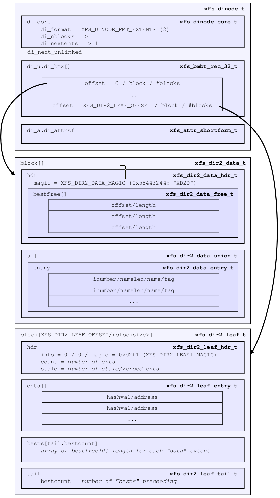

下面我们就将目录内容扩大到超过一个 directory block，构造出一个 leaf directory。我就不展示过程了，直接展示结果。首先我们看一下一个 leaf directory 的 inode 块的内容：

```bash
xfs_db> inode 67
xfs_db> p
core.magic = 0x494e
core.mode = 040755
core.version = 3
core.format = 2 (extents)
...
core.size = 8192
core.nblocks = 3
core.extsize = 0
core.nextents = 3
...
v3.inumber = 67
v3.uuid = 834782de-6137-4de9-939a-57e071ff1283
u3.bmx[0-2] = [startoff,startblock,blockcount,extentflag] 0:[0,16,1,0] 1:[1,18,1,0] 2:[8388608,17,1,0]
```

这是一个目录的 inode 实例，我们看到了 inode core 的内容，format = 2 (extents) 表示 datafork 目前还是以 XFS_DINODE_FMT_EXTENTS 格式组织数据。nextents = 3 表示当前有 3 个 extents 用于数据组织，这 3 个 extents 也列出来了，就是 bmx[0-3] 所展示的 3 个 extent record 的内容。下面我们逐一说。

首先前 2 个 extents 是用于存储数据的，最后一个 extent 是用来存储 leaf（也就是 [hash,address] 对儿）以及 Tail 的。

为什么我还没看实际内容可以确定最后一个是存储 leaf 的？因为对于 leaf directory 来说，其存储 leaf 所用的 block 的“逻辑”起始偏移地址是固定的，一定是 XFS_DIR2_LEAF_OFFSET，其相关定义如下：

```c
#define XFS_DIR2_DATA_ALIGN_LOG 3
#define XFS_DIR2_SPACE_SIZE     (1ULL << (32 + XFS_DIR2_DATA_ALIGN_LOG))
#define XFS_DIR2_LEAF_SPACE     1
#define XFS_DIR2_LEAF_OFFSET    (XFS_DIR2_LEAF_SPACE * XFS_DIR2_SPACE_SIZE)
```

按照定义来算，这个 XFS_DIR2_LEAF_OFFSET 等于：

```c
1 * (1 << (32 + 3)) = 1<<35 = 34359738368 = 32GB
```

所以用于存储 leaf 的 directory block 的起始地址就是 32GB，在 blocksize=4k 的 XFS 上，34359738368/4096 = 8388608，正好对应上面最后那个 extent record 的逻辑偏移地址。

但是有人可能问了，万一我的存储没有 32GB 大小呢？难道没有 32GB 就不能用XFS吗？

当然不是的！这个 32GB 是一个逻辑地址，对于目录这种类型的文件来说，其内容的逻辑偏移地址，不是一个实际的物理地址。这个逻辑地址之前并不一定需要有 32GB 的实体空间，类似这样：

 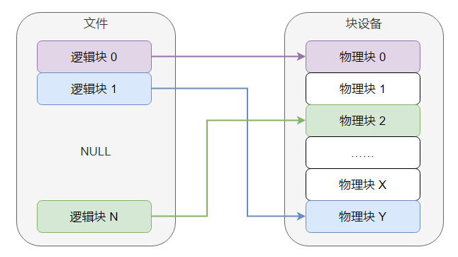

所以对于一个目录的逻辑偏移 32GB 的地址，其并不需要前置的 32GB 的实际物理空间。

我们先看一个 data block

```bash
xfs_db> dblock 1
xfs_db> p
dhdr.hdr.magic = 0x58444433
dhdr.hdr.crc = 0x92e81d24 (correct)
dhdr.hdr.bno = 144
dhdr.hdr.lsn = 0x10000002d
dhdr.hdr.uuid = 834782de-6137-4de9-939a-57e071ff1283
dhdr.hdr.owner = 67
dhdr.bestfree[0].offset = 0x90
dhdr.bestfree[0].length = 0xf70
dhdr.bestfree[1].offset = 0
dhdr.bestfree[1].length = 0
dhdr.bestfree[2].offset = 0
dhdr.bestfree[2].length = 0
du[0].inumber = 334
du[0].namelen = 3
du[0].name = "196"
du[0].filetype = 1
du[0].tag = 0x40
du[1].inumber = 335
du[1].namelen = 3
du[1].name = "197"
du[1].filetype = 1
du[1].tag = 0x50
du[2].inumber = 336
du[2].namelen = 3
du[2].name = "198"
du[2].filetype = 1
du[2].tag = 0x60
du[3].inumber = 337
du[3].namelen = 3
du[3].name = "199"
du[3].filetype = 1
du[3].tag = 0x70
du[4].inumber = 338
du[4].namelen = 3
du[4].name = "200"
du[4].filetype = 1
du[4].tag = 0x80
du[5].freetag = 0xffff
du[5].length = 0xf70
du[5].filetype = 0
du[5].tag = 0x90
```

这个内容我们看着很熟悉，因为完全符合我们在上面讲解 Block directory 时的讲过的格式，包括 header 部分和下面的每一个 data entry 以及 unused entry 的部分。唯一不同的就是这里的结尾没有 leaf 和 tail 结构，因为上面我们说了，leaf 和 tail 被转移到逻辑偏移地址为 32GB 起始的一个单独的 directory block 里去了。

哦，对了，还有一个不同，就是 magic number 变了，Block directory 的 magic number 是 0x58444233="XDB3" ，现在格式变为 Leaf directory 后，其 magic number 变成了 0x58444433="XDD3"。

接下来我们看存储 leaf 和 tail 的那个 block。

```bash
xfs_db> dblock 8388608
xfs_db> p
lhdr.info.hdr.forw = 0
lhdr.info.hdr.back = 0
lhdr.info.hdr.magic = 0x3df1
lhdr.info.crc = 0xce320d6b (correct)
lhdr.info.bno = 136
lhdr.info.lsn = 0x10000002d
lhdr.info.uuid = 834782de-6137-4de9-939a-57e071ff1283
lhdr.info.owner = 67
lhdr.count = 241
lhdr.stale = 0
lbests[0-1] = 0:0x8 1:0xf70
lents[0].hashval = 0x2e
lents[0].address = 0x8
lents[1].hashval = 0x31
lents[1].address = 0xc
lents[2].hashval = 0x32
lents[2].address = 0xe
lents[3].hashval = 0x33
lents[3].address = 0x10
...
lents[239].hashval = 0xd18e89fd
lents[239].address = 0x5f
lents[240].hashval = 0xf1c456c6
lents[240].address = 0x53
ltail.bestcount = 2

```

用于存储 leaf 的这个 block，每一个 leaf 的结构没变，还是 [hashval, address] 对，不过 header 和 tail 变了。所以我们针对 leaf header 和 tail 说一下。

```c
struct xfs_dir3_leaf_hdr {
	struct xfs_da3_blkinfo	info;		/* header for da routines */
	__be16			count;		/* count of entries */
	__be16			stale;		/* count of stale entries */
	__be32			pad;		/* 64 bit alignment */
};
```

xfs_dir3_leaf_hdr 是 leaf block 的 header 结构，它里面还包含一个 xfs_da3_blkinfo 的结构，这个结构经常用于 directory 和 attr 相关 block 的头部：

```c
struct xfs_da3_blkinfo {
	/*
	 * the node link manipulation code relies on the fact that the first
	 * element of this structure is the struct xfs_da_blkinfo so it can
	 * ignore the differences in the rest of the structures.
	 */
	struct xfs_da_blkinfo	hdr;
	__be32			crc;	/* CRC of block */
	__be64			blkno;	/* first block of the buffer */
	__be64			lsn;	/* sequence number of last write */
	uuid_t			uuid;	/* filesystem we belong to */
	__be64			owner;	/* inode that owns the block */
};

typedef struct xfs_da_blkinfo {
	__be32		forw;			/* previous block in list */
	__be32		back;			/* following block in list */
	__be16		magic;			/* validity check on block */
	__be16		pad;			/* unused */
} xfs_da_blkinfo_t;
```

-   forw 和 back 是用于串联链表使用的指针，因为这里只有一个 leaf，所以此处两个值都是空。
-   magic 就是 magic number，对于 leaf directory 来说其 leaf block的magic number 是 0x3df1。
-   后面的 crc, blkno, lsn, uuid, owner 之类的已经在前面的文章中说过很多次了，此处不再赘述。
-   count 表示当前 leaf block 中有多少个 entry。
-   stale 表示当前 leaf block 里有多少个 unused 的 entry。

以上就是 leaf block header 的结构。

在 header 之下的就是 [hashval, address] 对儿构成的 leaf entry 列表了，这次的 leaf entry 不用再从 block 的底部开始创建了，直接从 header 下面往下创建就行了，在 leaf block 的最尾部，就是 xfs_dir2_leaf_tail，里面只有一个值就是 bestcount，占四个字节。其数值和用于存储数据的 directory block 个数相等，比如当前这个目录的 3 个 extents 里有 2 个是用于存储数据的，所以这里 bestcount=2。

```c
/*
 * Leaf block entry.
 */
typedef struct xfs_dir2_leaf_entry {
	__be32			hashval;	/* hash value of name */
	__be32			address;	/* address of data entry */
} xfs_dir2_leaf_entry_t;

/*
 * Leaf block tail.
 */
typedef struct xfs_dir2_leaf_tail {
	__be32			bestcount;
} xfs_dir2_leaf_tail_t;
```

为什么需要和数据 directory block 的个数相等呢？

因为在 leaf block 的底部，bestcount 之上，会记录每个数据 directory block 的bestfree[0].length 的数值，比如此目录的第 2 个数据 directory block 的bestfree[0].length 的值是 0xf70，这和 leaf block 中 lbests[1] 刚好相等，我们前文已经说过每个数据 directory block 中会记录 3 个最大块的 unused space，其中 bestfree[0] 记录的是长度最大的。所以在 leaf block 的尾部记录下各个 bestfree[0].length，就是为了快速了解各数据 block 中还剩下的最大 free space 的情况。


##### Node Directory

上面我们了解到，Leaf directory 是为了解决 data entries 在一个 directory block 中的燃眉之急，故转而用多个 data blocks 来存储 data entries，并将 leaf entries 转移到一个单独的 leaf block 中。

那么随着 data entries 的增多，data blocks 也不断增多，导致 leaf entries 也激增，一个 leaf block 不足以容纳这么多 leaf entries 的时候，就是 leaf directory 转变为下一结构的契机。这下一结构就是 Node directory。

所以 Node directory 要解决的首要问题就是 leaf entries 超量如何存储的事，说简单了就是用更多的 leaf blocks 来存储 leaf entries，除此之外还有两件事需要做：

1.  在 leaf directory 结构中，我们将 best free space 的汇总信息存储在单个 leaf block 底部。但是 Node directory 要使用多个 leaf blocks，所以不便再与 leaf block 混用存储空间，所以索性用独立的 freeindex blocks 来存储。
2.  本来 leaf entries 存在的意义是借用 hash 表来加速查找，但是如果 leaf entries 太多，众多 leaf blocks 会令 hash 检索耗费很多时间，这将大大降低 XFS 的性能。所以此处要再引入一层对 leaf blocks 的检索，用一个单独的 Node block 来存储对 leaf blocks 进行检索所需的索引（下面细讲）。

 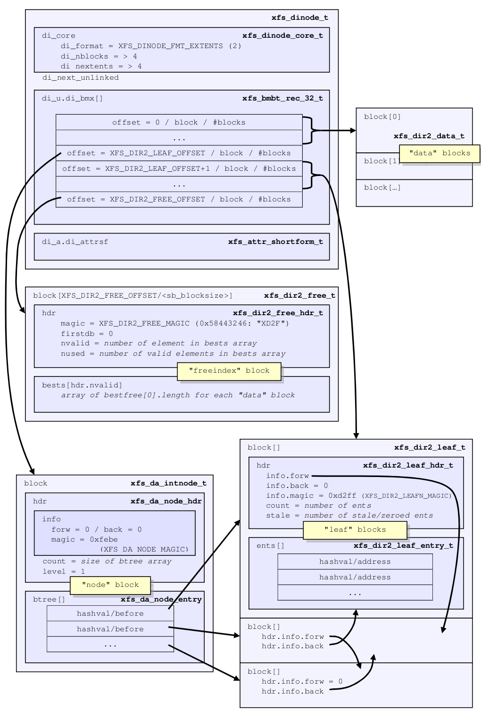

首先先讨论第一个问题，我们要引入一个新的独立的 freeindex block，就要先知道它的定位。像上面 leaf block 的偏移量一样，这个 freeindex block 也是有的，参考如下定义：

```c
#define XFS_DIR2_DATA_ALIGN_LOG 3
#define XFS_DIR2_SPACE_SIZE     (1ULL << (32 + XFS_DIR2_DATA_ALIGN_LOG))
#define XFS_DIR2_FREE_SPACE     2
#define XFS_DIR2_FREE_OFFSET    (XFS_DIR2_FREE_SPACE * XFS_DIR2_SPACE_SIZE)
```

计算后 XFS_DIR2_FREE_OFFSET 的结果为：

```c
2 * 1<<(32 + 3) = 2 * 34359738368 = 68719476736 = 64GB
```

所以说 freeindex blocks 从目录的 64GB 逻辑偏移地址处开始分配。所以现在相当于 data blocks 从 0 地址开始，node/leaf blocks 从 32GB 地址处开始，freeindex block 从 64GB 地址处开始。

Freeindex block 的结构为：

```c
struct xfs_dir3_free_hdr {
	struct xfs_dir3_blk_hdr	hdr;
	__be32			firstdb;	/* db of first entry */
	__be32			nvalid;		/* count of valid entries */
	__be32			nused;		/* count of used entries */
	__be32			pad;		/* 64 bit alignment */
};

struct xfs_dir3_free {
	struct xfs_dir3_free_hdr hdr;
	__be16			bests[];	/* best free counts */
						/* unused entries are -1 */
};
```

freeindex block 由一个 header 和一组 bests[] 组成，bests[] 的意思和上面讲 leaf directory 的时候讲的一样，记录每一个data block 里最大的一段 free space 的长度。Header 部分的话首先是一个和 data block 相同的 xfs_dir3_blk_hdr，freeindex block 的 magic number 是 "XDF3"。其它成员已经介绍多次，不再赘述。

接着是 freeindex block 特有的头部变量：

-   firstdb 表示当前 best free space (简称bests) 数组是从哪个 directory block 号开始记录的，对于 Node directory 来说，只有一个 freeindex block，所以这第一个也是唯一一个 freeindex block 自然是从 0 号 directory block 开始记录，所以此处 firstdb 肯定是 0。
-   nvalid 表示当前有多少有效的 directory block，这个“有效”的意思是指当前目录的 di_size 范围内能放下多少 directory block，就有多少是“有效”的。也可以理解为“逻辑有效”。这是相对于下面的 nused 说的。
-   nused 表示当前有多少在用的 directory block，这个“在用”的意思就是实际分配了物理 blocks 的。也可以理解为“物理在用”。

一般情况下 nvalid 和 nused 是相等的，只有在出现 sparse directory 的时候，才会出现 nused < nvalid 的情况。sparse directory 出现的条件要比 sparse file 出现的条件苛刻很多。对于文件来说中间作出 hole 来很容易，但是对于目录来说首先你得先多个 data directory blocks (三个以上，因为第一个 data block 里面至少存储着"."和".."，无法成为空洞。)，然后你得删除中间的 data entries，而且删除的 data entries 得至少够从中间删掉一个 data directory block，这样才会造出一个目录的空洞。如果删的 entries 不足以删除一个 data block，那就只能留下 free space，不能留下 hole。如果删的 entries 造成把末尾的 data block 删了，那就不是造出一个目录的 hole 了，而是单纯地缩小目录的 size。如果你删除了半天，哪怕一个 data block 里留下一个 data entry，也不会造出目录 hole。


以上就解释了 freeindex block 的格式。然后我们回到上面提到的第 2 件事：如何引入一个 Node block 来加速对多个 leaf blocks 的检索。

Node block 的结构如下：

```c
typedef struct xfs_da_node_entry {
	__be32	hashval;	/* hash value for this descendant */
	__be32	before;		/* Btree block before this key */
} xfs_da_node_entry_t;

struct xfs_da3_node_hdr {
	struct xfs_da3_blkinfo	info;	/* block type, links, etc. */
	__be16			__count; /* count of active entries */
	__be16			__level; /* level above leaves (leaf == 0) */
	__be32			__pad32;
};

struct xfs_da3_intnode {
	struct xfs_da3_node_hdr	hdr;
	struct xfs_da_node_entry __btree[];
};
```

一个（V5 XFS）node block 的结构就如 xfs_da3_intnode 所示，由一个 header 和一组 node entries 组成。

Header 部分首先由我们已经讲过的 xfs_da3_blkinfo 标准头结构，xfs_da3_blkinfo 是用于目录 (directory) 和扩展属性 (extended attribute) 的 Leaf，Node 和 B+Tree 结构的统一头结构。

然后在 xfs_da3_blkinfo 之下还有两个变量：count 表示有多少 node entries 在这个 node block 里，level 表示当前这个 block 在 B+Tree 中的 level。对于 Node Directory 里唯一的一个 node block 来说，其 level=1。

Node block 的头结构下面就是 node entry list，每一个 entry 的结构就是一个 [hashval, before] 对。看到这你可能会想起前面讲过的 leaf entry 的 [hashval, address] 对。那么这个 "before" 和 "address" 有什么关系呢？

我们知道 leaf entry 的 [hashval, address] 对存储在 block 里，现在我们有多个 leaf blocks 后，当我们手握一个 hash 值的时候我们该去哪个 leaf block 里去找这个 hash 值对应的 address 呢？难道要把所有 leaf blocks 遍历一遍直到找到为止吗？

这样太费时间了，hashval 在各个 leaf blocks 中是按序排列的，引入一个 Node block，node entry 以 hashval 为 key，当你想以一个 hashval 寻找一个address，先以 hashval 在 node block 中比对大小，找到对应的 node entry 后，此 entry 中的 "before" 中有你要找的 hashval 在哪个 leaf block 的逻辑 block 号。到对应的 block 中去找，就能找到 hashval 对应的 address 了。

举一个例子来说的明确些，比如我在目录下有一个名为 "0757" 的文件，我现在只知道这个名字，那我该怎么定位它对应的 inode 在哪呢？首先计算出这个名字的 hash 值：

```bash
xfs_db> hash 0757
0x60ddab7
```

得到这个 hash 值后，我们去这个目录的 node block 里找到对应的 node entry。那么下面哪个是 node block 呢？

```bash
u3.bmx[0-9] = [startoff,startblock,blockcount,extentflag]
0:[0,15,1,0]  
1:[2,11,1,0]  
2:[3,81,1,0]  
3:[4,83,1,0]  
4:[8388608,14,1,0]
5:[8388609,10,1,0]
6:[8388611,82,1,0]
7:[8388612,84,1,0]
8:[8388613,86,1,0]
9:[16777216,12,1,0]
```

我们前面知道 Leaf block 是从 32GB 偏移开始的，其实如果引入 node block 的话，会先从 32GB 分配一个 block 给 node block。所以 4:[8388608,14,1,0] 就是node block。

```bash
xfs_db> dblock 8388608
xfs_db> p
...
nhdr.count = 4
nhdr.level = 1
nbtree[0-3] = [hashval,before] 
0:[0x60d5832,8388609] 
1:[0x60ddab4,8388611] 
2:[0x62c1836,8388612] 
3:[0x62c9b30,8388613]
```

我们可以看到我们要找的 "0x60ddab7" 大于 nbtree[1] 小于 nbtree[2]，所以我们知道这个 hash 值就在 nbtree[2].before 所指的 leaf block 里。所以下一步我们到 8388612 号 block 去看看：

```bash
xfs_db> dblock 8388612
xfs_db> p
...
lents[0].hashval = 0x60ddab5
lents[0].address = 0x608
lents[1].hashval = 0x60ddab6
lents[1].address = 0x60a
lents[2].hashval = 0x60ddab7
lents[2].address = 0x60c
lents[3].hashval = 0x60ddab8
lents[3].address = 0x60e
...
```

我们逐个比对，可以发现 lents[2].hashval 就等于我们要找的 0x60ddab7，所以我们取出 lents[2].address，也就是 "0x60c"。我们前面说过 address 的单位是 8 字节，所以这里 0x60c 要乘以 8 得到字节偏移地址，也就是 0x3060。因为我使用的 directory blocksize 是 4096(0x1000) 字节，所以 0x3060 这个地址定位的就是第 3 个逻辑 directory block 里的 0x60 偏移地址。现在我们就去第 3 个逻辑 directory block 去看看：

```text
xfs_db> dblock 3
xfs_db> type text
xfs_db> p
000:  58 44 44 33 88 2f dd 41 00 00 00 00 00 00 02 88  XDD3...A........
010:  00 00 00 01 00 00 00 07 e0 33 fa e5 4d 99 42 42  .........3..M.BB
020:  b9 50 4a 0a ed cf b7 58 00 00 00 00 00 00 00 83  .PJ....X........
030:  00 00 00 00 00 00 00 00 00 00 00 00 00 00 00 00  ................
040:  00 00 00 00 00 00 03 b6 04 30 37 35 35 01 00 40  .........0755...
050:  00 00 00 00 00 00 03 b7 04 30 37 35 36 01 00 50  .........0756..P
060:  00 00 00 00 00 00 03 b8 04 30 37 35 37 01 00 60  .........0757...
070:  00 00 00 00 00 00 03 b9 04 30 37 35 38 01 00 70  .........0758..p
```

我们看到了 0x60 那个偏移地址对应的数据，根据 data entry 的结构：

```c
typedef struct xfs_dir2_data_entry {
        __be64                  inumber;        /* inode number */
        __u8                    namelen;        /* name length */
        __u8                    name[];         /* name bytes, no null */
     /* __u8                    filetype; */    /* type of inode we point to */
     /* __be16                  tag; */         /* starting offset of us */
} xfs_dir2_data_entry_t;
```

我们知道头 8 字节就是 inode 号，也就是 0x00000000000003b8=952。接下来一个字节是 namelen=0x04，表示接下来的 4 个字节是文件名，那么文件名就是0x30373537，转成字符串就是 "0757"，和我们要找的正好对上，说明我们找对了。那么这个 inode 号我们就可以用来找到 "0757" 对应 inode 块了。


#### B+Tree

随着数据量的继续增加，extents 越来越多，终于 datafork 空间不足以 extent list 的形式存储这些 extent records，这时就要采用终极形式——B+Tree。

其实我们在前文讲到 Node directory 的时候已经接触到一个简单的 B+Tree 了，那就是 Node block 索引 Leaf blocks 的时候，其实就是一个简单的以 hashval 为关键字的 B+Tree 了。如果进一步扩展，Node block 后面可以再接多层 Node blocks，直到 Leaf blocks，形成一个 B+Tree 结构。

所以这里有一个 B+Tree，用于组织 leaf blocks。但是我们知道 inode 的数据终归是由 extent 管理，所以如何管理目录的 extents 是目录组织结构的首要事情。当extents list 超过 datafork 的存储范围后就会变成 B+Tree 结构，和之前讲过的普通文件的 extents list 变 B+Tree 结构时一样。

 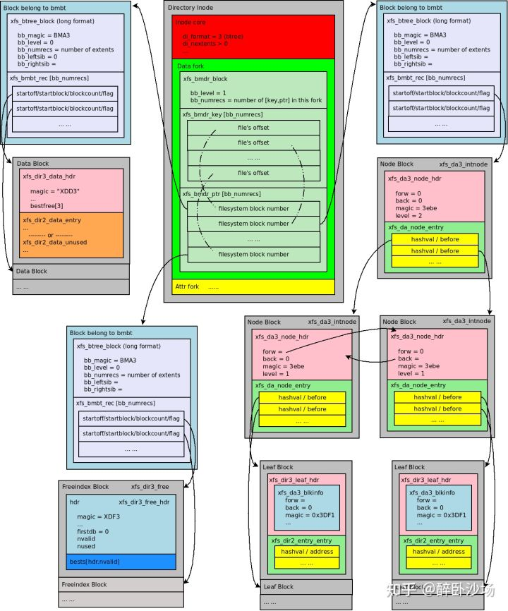

首先是 datafork 变成 BMapt BTree 结构的头部 (bmdr），通过它可以索引到很多 bmbt block（上图仅画了 1 级 bmbt）。BMap BTree 结构的最终节点就是目录的 data block，node block，leaf block 以及 freeindex block 组成的 extents。找到这些 extents，就可以通过讲解 Node directory 时用到的方式，利用 Node block 索引 Leaf Blocks，定位 Data block 的内容。上图画了一个 2 级的 Node-Leaf B+Tree。

也就是说 B+Tree directory 实际上由 inode 的 BMap BTree 以及目录特有的一个 Node-leaf blocks B+Tree 组成。

为了便于理解，我们还是举一个实例，下面我创建了一个包含20多万个文件的目录，现在我尝试定位里面一个叫"looooooooooooooooooooooooooooooooooooooooooooooooooooooooooongfile_200000"的文件，比如这样：

```bash
# ls -l /mnt/test/dir0/looooooooooooooooooooooooooooooooooooooooooooooooooooooooooongfile_200000
-rw-r--r--. 1 root root 0 Mar 26 15:22 /mnt/test/dir0/looooooooooooooooooooooooooooooooooooooooooooooooooooooooooongfile_200000
```

那当我们只知道 /mnt/test/dir0/ 下面有一个叫 "looo....oongfile_200000" 的客体时，我怎么通过 B+Tree 结构的 "dir0"，找到其下 "looo....oongfile_200000" 所对应的 inode号（从而才能找到其inode块）呢？

首先我们看目录 dir0 的 datafork 的内容：

```bash
xfs_db> inode 131
xfs_db> p
...
core.format = 3 (btree)
core.nblocks = 6130
core.extsize = 0
core.nextents = 2541
...
u3.bmbt.level = 1
u3.bmbt.numrecs = 11
u3.bmbt.keys[1-11] = [startoff]
1:[0]
2:[740]
3:[1498]
4:[2232]
5:[2990]
6:[3734]
7:[4455]
8:[4850]
9:[8388609]
10:[8388882]
11:[8389125]
u3.bmbt.ptrs[1-11] = 1:172 2:3713 3:10160 4:15124 5:20265 6:25313 7:30201 8:35261 9:7293 10:12884 11:24751
...
```

我们可以看到 datafork 中不是一个 extents list 了，而是一个 level=1 的 BMap BTree 的头部。我们首先要找的是 "looo....oongfile_200000" 对应的 Leaf block 里的 [hashval, address] 对，前面我们知道 Node/Leaf 的偏移地址是 32GB，我当前 XFS 的 blocksize=4k，34359738368/4096 = 8388608，所以 Node/Leaf 区域的第一个 block 在 8388608 这个偏移地址处。根据 bmbt.keys 的内容，我们可以确定 8388608 在 keys[8]~[9] 之间，所以就在 keys[8] 所对应的范围里，那么我们通过 bmbt.ptrs[8] 来找到 bmbt.keys[8] 对应的 block：

```bash
xfs_db> addr u3.bmbt.ptrs[8]
xfs_db> p
...
173:[5328,36124,4,0] 
174:[5332,36152,2,0] 
175:[8388608,14,1,0]
```

我们看到这个 block 里的最后一个 record 就是 8388608 偏移地址所在的位置，其在物理地址的第 14 个 block 处，并占用 1 个 block，我们下面就去这个位置看一看其内容：

```bash
xfs_db> dblock 8388608
xfs_db> p
nhdr.info.hdr.forw = 0
nhdr.info.hdr.back = 0
nhdr.info.hdr.magic = 0x3ebe
nhdr.info.crc = 0x93bb2608 (correct)
nhdr.info.bno = 112
nhdr.info.lsn = 0x6000051ab
nhdr.info.uuid = ea53b14f-9edd-4cdd-8f37-4d825fd89590
nhdr.info.owner = 131
nhdr.count = 2
nhdr.level = 2
nbtree[0-1] = [hashval,before] 
0:[0x795666e9,8389115] 
1:[0xffe3e7df,8389114]
```

可以看到这是一个 Node block，并且其肯定是 root node，而且 level=2。所以其下面还得有一级的 Node blocks。到此 B+Tree 的关键字就变为 hashval 了，所以我们先计算 "looo....oongfile_200000" 的 hash 值：

```bash
xfs_db> hash looooooooooooooooooooooooooooooooooooooooooooooooooooooooooongfile_200000
0x69d667e0
```

得到 0x69d667e0 这个 hash 值，我们就可以知道应该去 0:[0x795666e9,8389115] 这个地方去找下一个 Node block：

```bash
xfs_db> dblock 8389115
xfs_db> p
nhdr.info.hdr.forw = 8389114
nhdr.info.hdr.back = 0
nhdr.info.hdr.magic = 0x3ebe
nhdr.info.crc = 0x759db2e3 (correct)
nhdr.info.bno = 187104
nhdr.info.lsn = 0x800000b1a
nhdr.info.uuid = ea53b14f-9edd-4cdd-8f37-4d825fd89590
nhdr.info.owner = 131
nhdr.count = 410
nhdr.level = 1
nbtree[0-409] = [hashval,before]
...
367:[0x69b7e37f,8388875]
368:[0x69d424f1,8388890]
369:[0x69d46663,8388684]
370:[0x69d6277b,8388678]
371:[0x69d6a6fa,8388623]
372:[0x69d726e5,8388633]
...
```

我们看到这是一个 level=1 的 Node block，0x69d667e0 这个 hash 值就位于 371:[0x69d6a6fa,8388623] 这个block里，因为这里已经是 level=1 的 node 了，所以下面就肯定是 Leaf block了，我们去这个 leaf block 里继续找：

```bash
xfs_db> dblock 8388623
xfs_db> p
lhdr.info.hdr.forw = 8388633
lhdr.info.hdr.back = 8388678
lhdr.info.hdr.magic = 0x3dff
lhdr.info.crc = 0xd1116e5b (correct)
lhdr.info.bno = 6256
lhdr.info.lsn = 0x1000044fe
lhdr.info.uuid = ea53b14f-9edd-4cdd-8f37-4d825fd89590
lhdr.info.owner = 131
lhdr.count = 379
lhdr.stale = 0
...
lents[203].hashval = 0x69d6677f
lents[203].address = 0x10fa
lents[204].hashval = 0x69d667e0
lents[204].address = 0x1c9
lents[205].hashval = 0x69d667e1
lents[205].address = 0x24a
...
```

果然，在这里我们找到了 lents[204].hashval = 0x69d667e0，其正好和我们要找的文件名的 hash 值相等，所以我们取其 address，得到 lents[204].address = 0x1c9，前面我们已经知道这里地址需要乘以 8，所以 0x1c9 * 8 = 0xe48 = 3656，比一个 directory blocksize 还小，说明这个地址就在第 0 个 directory block 里。现在我们回到目录的 datafork，去找 startoff=0 的 extent 在哪：

```bash
u3.bmbt.level = 1
u3.bmbt.numrecs = 11
u3.bmbt.keys[1-11] = [startoff] 
1:[0] 
2:[740] 
3:[1498] 
4:[2232] 
5:[2990] 
6:[3734] 
7:[4455] 
8:[4850] 
9:[8388609] 
10:[8388882] 
11:[8389125]
u3.bmbt.ptrs[1-11] = 1:172 2:3713 3:10160 4:15124 5:20265 6:25313 7:30201 8:35261 9:7293 10:12884 11:24751
```

所以 startoff=0 的 extent 肯定在 u3.bmbt.ptrs[1] 对应的地址上，我们去这个地址看一下：

```bash
xfs_db> addr u3.bmbt.ptrs[1]
xfs_db> p
magic = 0x424d4133
level = 0
numrecs = 251
leftsib = null
rightsib = 3713
bno = 1376
lsn = 0x200002ce7
uuid = ea53b14f-9edd-4cdd-8f37-4d825fd89590
owner = 131
crc = 0x4f9bc2e (correct)
recs[1-251] = [startoff,startblock,blockcount,extentflag]
1:[0,15,1,0]
2:[1,13,1,0]
3:[2,12,1,0]
...
```

可以看到 startoff=0 的 extent 就在 1:[0,15,1,0]的位置，我们去这个位置看一下：

```bash
xfs_db> fsblock 15
xfs_db> type dir3
xfs_db> p
...
du[43].name = "looooooooooooooooooooooooooooooooooooooooooooooooooooooooooongfile_200000"
du[43].filetype = 1
du[43].tag = 0xe48
du[44].inumber = 174
du[44].namelen = 73
...
```

果然在其内部找到了我们要找的文件，文件名完全一致，并且我们也找到了其 inode 号 du[44].inumber = 174。根据这个 inode 号我们就能定位这个文件所对应的 inode 的位置了。


### Data format of Symlink file

符号链接文件也是一个带有数据的独立文件，有自己独立的 inode，如下：

```bash
[root@centos ~]# mkfs.xfs -f /dev/vda 
[root@centos ~]# mount /dev/vda /mnt/a/
[root@centos ~]# ln -s nothing /mnt/a/test
[root@centos ~]# ll -i /mnt/a/
total 0
67 lrwxrwxrwx. 1 root root 7 Nov 26 15:07 test -> nothing
```

可以看到，符号链接文件即使是指向一个不存在的文件也没有关系，它都是可以独立存在的。

符号链接文件的 inode core 结构和其它文件比并没有什么大的不同，只是为了区分这是一个符号链接文件，所以 di_mode 设置了 S_IFLNK 标志（也就对应上面 "lrwxrwxrwx" 中的 "l" 字符），表示这是一个符号链接文件。

扩展属性的存储也不区分是普通文件还是符号链接文件什么的，所以 attrfork 结构也没有什么特别的。

唯一不同的就是符号链接文件组织数据的方式，符号链接文件的数据就是这个符号链接所指向的目标的绝对或相对路径名，而其组织数据的格式有两种，一种是local 方式一种是 extent 方式，由于符号链接内容的长度是有限制的：

```c
#define XFS_SYMLINK_MAXLEN      1024
```

所以符号链接用不上 B+Tree 结构，最多用到 extents list 就完全足矣了。

首先符号链接文件尝试以 local 方式在 datafork 区域中直接存储符号链接的内容。

符号链接的内容就是一串像上面 "nothing" 似的字符串，local 存储没有特别的数据结构，就是从 datafork 起始地址开始存储字符串的所有字节，通过 xfs_db 来看的话如下：

```bash
xfs_db> inode 67
xfs_db> p
core.magic = 0x494e
core.mode = 0120777
core.version = 3
core.format = 1 (local)
...
core.size = 7
...
u3.symlink = "nothing"
a.sfattr.hdr.totsize = 51
a.sfattr.hdr.count = 1
a.sfattr.list[0].namelen = 7
a.sfattr.list[0].valuelen = 37
a.sfattr.list[0].root = 0
a.sfattr.list[0].secure = 1
a.sfattr.list[0].name = "selinux"
a.sfattr.list[0].value = "unconfined_u:object_r:unlabeled_t:s0\000"
```

可以看到 size = 7，正好对应目标字符数。

 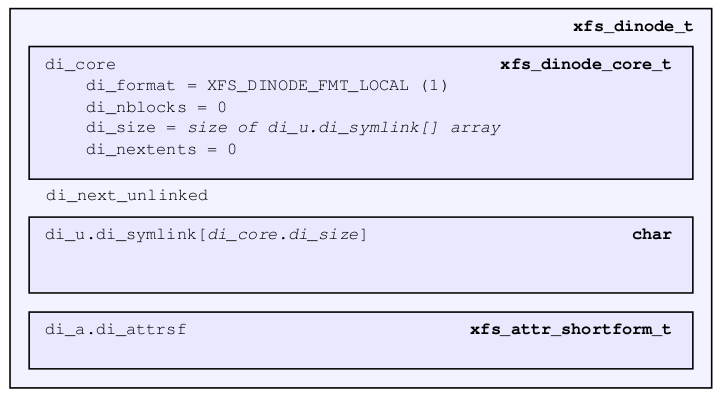

如果符号链接的内容较长，长到 datafork 的空间存不下这些数据，那么就要考虑用到 extent 结构了。

 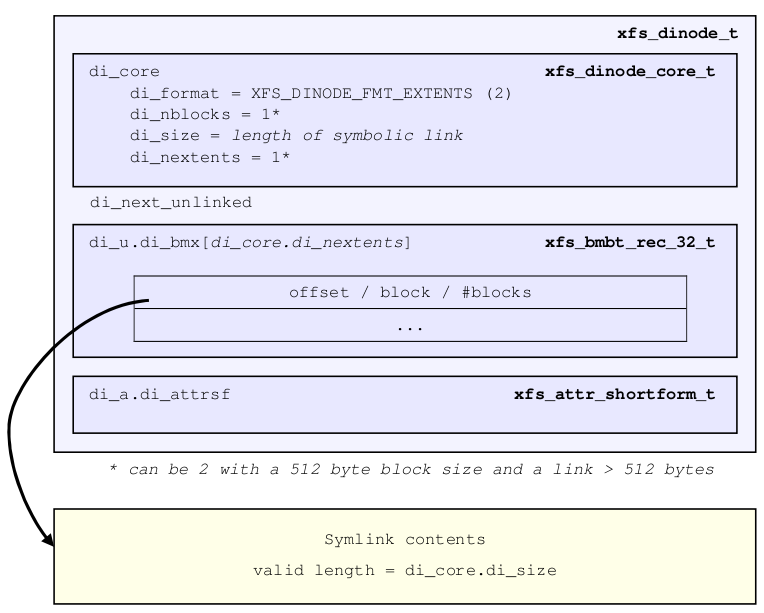

比如我们创建一个内容有 1023 个字节的符号链接文件，为什么我不创建更长的符号链接，因为我们上面已经看到了 XFS_SYMLINK_MAXLEN=1024，然后我们还要考虑在加载到内存时还要留一个结尾的 '\0'，所以最多设置 1023 个有效字符长度，如果设置过多会得到错误。

```bash
[root@centos ~]# ln -s `perl -e "print 'A' x 1024;"` /mnt/a/test1
ln: failed to create symbolic link ‘/mnt/a/test1’ -> ‘AAAAAAAAAAAAAAAAAAAAAAAAAAAAAAAAAAAAAAAAAAAAAAAAAAAAAAAAAAAAAAAAAAAAAAAAAAAAAAAAAAAAAAAAAAAAAAAAAAAAAAAAAAAAAAAAAAAAAAAAAAAAAAAAAAAAAAAAAAAAAAAAAAAAAAAAAAAAAAAAAAAAAAAAAAAAAAAAAAAAAAAAAAAAAAAAAAAAAAAAAAAAAAAAAAAAAAAAAAAAAAAAAAAAAAAAAAAAAAAAAAAAAAAAAAAAAAAAAAAAAAAAAAAAAAAAAAAAAAAAAAAAAAAAAAAAAAAAAAAAAAAAAAAAAAAAAAAAAAAAAAAAAAAAAAAAAAAAAAAAAAAAAAAAAAAAAAAAAAAAAAAAAAAAAAAAAAAAAAAAAAAAAAAAAAAAAAAAAAAAAAAAAAAAAAAAAAAAAAAAAAAAAAAAAAAAAAAAAAAAAAAAAAAAAAAAAAAAAAAAAAAAAAAAAAAAAAAAAAAAAAAAAAAAAAAAAAAAAAAAAAAAAAAAAAAAAAAAAAAAAAAAAAAAAAAAAAAAAAAAAAAAAAAAAAAAAAAAAAAAAAAAAAAAAAAAAAAAAAAAAAAAAAAAAAAAAAAAAAAAAAAAAAAAAAAAAAAAAAAAAAAAAAAAAAAAAAAAAAAAAAAAAAAAAAAAAAAAAAAAAAAAAAAAAAAAAAAAAAAAAAAAAAAAAAAAAAAAAAAAAAAAAAAAAAAAAAAAAAAAAAAAAAAAAAAAAAAAAAAAAAAAAAAAAAAAAAAAAAAAAAAAAAAAAAAAAAAAAAAAAAAAAAAAAAAAAAAAAAAAAAAAAAAAAAAAAAAAAAAAAAAAAAAAAAAAAAAAAAAAAAAAAAAAAAAAAAAAAAAAAAAAAAAAAAAAAAAAAAAAAAAAAAAAAAAAAAAAAAAAAAAAAAAAAAAAAAAAAAAAAAAAAAAAAAAAAAAAAAAAAAAAAAAAAAAAAAAAAAAAAAAAAAAAAAAAAAAAAAAAAAAAAAAAAAAAAAAAAAAAAAAAAAAAAAAAAAAAAAAAAAAA’: File name too long
[root@centos ~]# ln -s `perl -e "print 'A' x 1023;"` /mnt/a/test1
[root@centos ~]# ll -li /mnt/a/test1 
68 lrwxrwxrwx. 1 root root 1023 Nov 26 15:25 /mnt/a/test1 -> AAAAAAAAAAAAAAAAAAAAAAAAAAAAAAAAAAAAAAAAAAAAAAAAAAAAAAAAAAAAAAAAAAAAAAAAAAAAAAAAAAAAAAAAAAAAAAAAAAAAAAAAAAAAAAAAAAAAAAAAAAAAAAAAAAAAAAAAAAAAAAAAAAAAAAAAAAAAAAAAAAAAAAAAAAAAAAAAAAAAAAAAAAAAAAAAAAAAAAAAAAAAAAAAAAAAAAAAAAAAAAAAAAAAAAAAAAAAAAAAAAAAAAAAAAAAAAAAAAAAAAAAAAAAAAAAAAAAAAAAAAAAAAAAAAAAAAAAAAAAAAAAAAAAAAAAAAAAAAAAAAAAAAAAAAAAAAAAAAAAAAAAAAAAAAAAAAAAAAAAAAAAAAAAAAAAAAAAAAAAAAAAAAAAAAAAAAAAAAAAAAAAAAAAAAAAAAAAAAAAAAAAAAAAAAAAAAAAAAAAAAAAAAAAAAAAAAAAAAAAAAAAAAAAAAAAAAAAAAAAAAAAAAAAAAAAAAAAAAAAAAAAAAAAAAAAAAAAAAAAAAAAAAAAAAAAAAAAAAAAAAAAAAAAAAAAAAAAAAAAAAAAAAAAAAAAAAAAAAAAAAAAAAAAAAAAAAAAAAAAAAAAAAAAAAAAAAAAAAAAAAAAAAAAAAAAAAAAAAAAAAAAAAAAAAAAAAAAAAAAAAAAAAAAAAAAAAAAAAAAAAAAAAAAAAAAAAAAAAAAAAAAAAAAAAAAAAAAAAAAAAAAAAAAAAAAAAAAAAAAAAAAAAAAAAAAAAAAAAAAAAAAAAAAAAAAAAAAAAAAAAAAAAAAAAAAAAAAAAAAAAAAAAAAAAAAAAAAAAAAAAAAAAAAAAAAAAAAAAAAAAAAAAAAAAAAAAAAAAAAAAAAAAAAAAAAAAAAAAAAAAAAAAAAAAAAAAAAAAAAAAAAAAAAAAAAAAAAAAAAAAAAAAAAAAAAAAAAAAAAAAAAAAAAAAAAAAAAAAAAAAAAAAAAAAAAAAAAAAAAAAAAAAAAAAAAAAAAAAAAAAAAAAAAAAAAAAAAAAAAAAA
```

我们来看下 xfs_db

```bash
xfs_db> inode 68
xfs_db> p
core.magic = 0x494e
core.mode = 0120777
core.version = 3
core.format = 2 (extents)
...
core.size = 1023
...
u3.bmx[0] = [startoff,startblock,blockcount,extentflag] 0:[0,16,1,0]
```

可以看到此时这个符号链接文件用了一个 extent 来存储这 1023 个字符，通过 [0,16,1,0] 这个 extent record 找到了对应的 block:

```bash
xfs_db> dblock 0
xfs_db> p
magic = 0x58534c4d
offset = 0
bytes = 1023
crc = 0x8d6b103a (correct)
uuid = 1b43fa35-1fc1-40b5-9078-0836ca3b7b17
owner = 68
bno = 128
lsn = 0x100000023
data = "AAAAAAAAAAAAAAAAAAAAAAAAAAAAAAAAAAAAAAAAAAAAAAAAAAAAAAAAAAAAAAAAAAAAAAAAAAAAAAAAAAAAAAAAAAAAAAAAAAAAAAAAAAAAAAAAAAAAAAAAAAAAAAAAAAAAAAAAAAAAAAAAAAAAAAAAAAAAAAAAAAAAAAAAAAAAAAAAAAAAAAAAAAAAAAAAAAAAAAAAAAAAAAAAAAAAAAAAAAAAAAAAAAAAAAAAAAAAAAAAAAAAAAAAAAAAAAAAAAAAAAAAAAAAAAAAAAAAAAAAAAAAAAAAAAAAAAAAAAAAAAAAAAAAAAAAAAAAAAAAAAAAAAAAAAAAAAAAAAAAAAAAAAAAAAAAAAAAAAAAAAAAAAAAAAAAAAAAAAAAAAAAAAAAAAAAAAAAAAAAAAAAAAAAAAAAAAAAAAAAAAAAAAAAAAAAAAAAAAAAAAAAAAAAAAAAAAAAAAAAAAAAAAAAAAAAAAAAAAAAAAAAAAAAAAAAAAAAAAAAAAAAAAAAAAAAAAAAAAAAAAAAAAAAAAAAAAAAAAAAAAAAAAAAAAAAAAAAAAAAAAAAAAAAAAAAAAAAAAAAAAAAAAAAAAAAAAAAAAAAAAAAAAAAAAAAAAAAAAAAAAAAAAAAAAAAAAAAAAAAAAAAAAAAAAAAAAAAAAAAAAAAAAAAAAAAAAAAAAAAAAAAAAAAAAAAAAAAAAAAAAAAAAAAAAAAAAAAAAAAAAAAAAAAAAAAAAAAAAAAAAAAAAAAAAAAAAAAAAAAAAAAAAAAAAAAAAAAAAAAAAAAAAAAAAAAAAAAAAAAAAAAAAAAAAAAAAAAAAAAAAAAAAAAAAAAAAAAAAAAAAAAAAAAAAAAAAAAAAAAAAAAAAAAAAAAAAAAAAAAAAAAAAAAAAAAAAAAAAAAAAAAAAAAAAAAAAAAAAAAAAAAAAAAAAAAAAAAAAAAAAAAAAAAAAAAAAAAAAAAAAAAAAAAAAAAAAAAAAAAAAAAAAAAAAAAAAAAAAAAAAAAAAAAAAAAAAAAAAAAAAA"
```

这时就看出当符号链接的内容被转存到 extent 里时，V5 XFS 就会给每一个 extent 的第一个 block 开头创建一个如下的 header 结构（注意是每个 extent 一个，不是每个 block 一个，而且 V4 XFS 没有这个 header）：

```c
#define XFS_SYMLINK_MAGIC       0x58534c4d      /* XSLM */

struct xfs_dsymlink_hdr {
        __be32  sl_magic;
        __be32  sl_offset;
        __be32  sl_bytes;
        __be32  sl_crc;
        uuid_t  sl_uuid;
        __be64  sl_owner;
        __be64  sl_blkno;
        __be64  sl_lsn;
};
```

sl_magic 就是 magic number，是 0x58534c4d。

sl_offset 表示当前 block 中除了头结构的有效内容，相对于完整符号链接的内容的字节偏移量。这个变量多用于多个 extents 存储符号链接内容的情况。这里只用了一个 extent，所以偏移肯定是 0。

sl_bytes 表示当前 extent 里符号链接的内容有多少字节。后面的成员不用过多介绍了。接在头结构下面的就是符号链接的内容了。


## Extended attribute fork

这里就不讲了，平时也不太用扩展属性，组织方式基本和上面也差不多。

​	


