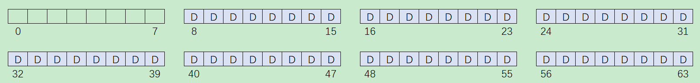
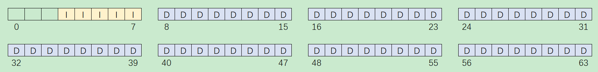
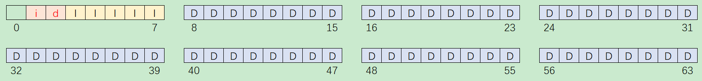
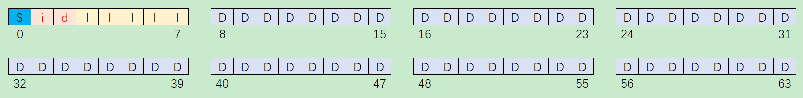
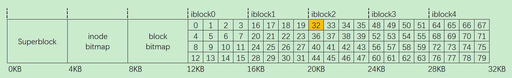
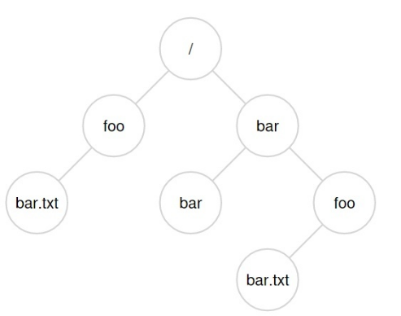
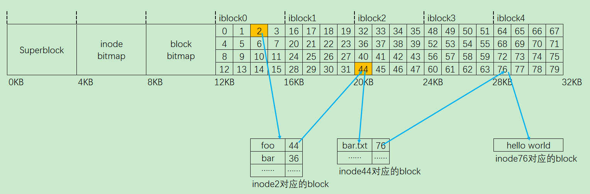

持久性的数据是存储在外部磁盘上的，如果没有文件系统，访问这些数据就需要直接读写裸设备空间，这是很不方便的。文件系统存在的意义，就是能更有效的组织、管理和使用磁盘上的这些数据。

考虑文件系统时，我们通常建议考虑它们的两个不同方面，如果你理解了这两个方面，可能就理解了文件系统基本工作原理。

第一个方面是文件系统的**数据结构（data structure）**。换言之，文件系统在磁盘上使用哪些类型的结构来组织其数据和元数据？我们即将看到的第一个文件系统（下面的 VSFS）使用简单的结构，如块或其他对象的数组，而更复杂的文件系统（如 SGI 的 XFS）使用更复杂的基于树的结构。

文件系统的第二个方面是**访问方法（access method）**。如何将进程发出的调用，如 open、read、 write 等映射到它的结构上？在执行特定系统调用期间读取哪些结构？改写哪些结构？所有这些步骤的执行效率如何？  

如果你理解了文件系统的数据结构和访问方法，就形成了一个关于它如何工作的良好心智模型，这是系统思维的一个关键部分。在深入研究我们的第一个实现时，请尝试建立你的心智模型。


---

# VSFS

## 整体组织

VSFS 即 Very Simple File System，顾名思义，这是一个很简单的文件系统。

我们现在来开发 VSFS 文件系统在磁盘上的数据结构的整体组织。我们需要做的第一件事是将磁盘分成块（block），那按照什么粒度划分呢？

因为磁盘上的数据要和内存交互，而内存通常是以 4KB 为单位的，为了方便，我们从逻辑上把磁盘按照 4 KB 划分（称为一个 block）。

现在假设由一个文件系统管理 64 个 blocks 的一个磁盘区域（总大小为 256 KB）： 


那在这些 blocks 中应该存储些什么？

文件系统的基础要素自然是文件，而文件作为一个数据容器的逻辑概念，本质上是一些字节构成的集合，这些字节就是文件的 **user data**（对应下图的 **D**）。



除了文件本身包含的数据，还有文件的访问权限、大小和创建时间等控制信息，这些信息被称为 **meta data**。meta data 可理解为是关于文件 user data 的 data，这些 meta data 存储的数据结构就是 **inode**（对应下图的 **I**，有些文件系统称之为 dnode 或 fnode）。

inode 是 **index node** 的简称，在早期的 Unix 系统中，这些 nodes 是通过数组组织起来的，因此需要依靠 index 来索引数组中的 node。假设一个 inode 占据 256 字节，那么一个 4KB 的 block 可以存放 16 个 inodes，使用 5 个 blocks 可以存放 80 个 inodes，也就是最多支持 80 个文件。



同内存分配一样，当有了新的数据产生时，我们需要选择一个空闲的 block 来存放数据，此外还需要一个空闲的 inode。所以，需要追踪这些 inodes 和 data blocks 的分配和释放情况，以判断哪些是已用的，哪些是空闲的。

最简单的办法就是使用 bitmap，包括记录 inode 使用情况的 bitmap（对应下图的 **i**），和记录 data block 使用情况的 bitmap（对应下图的 **d**）。空闲就标记为 0，正在使用就标记为 1。



因为 block 是最小划分单位，所以这里使用了两个 blocks 来分别存储 inode bitmap 和 data block bitmap，每个 block 可以容纳的 bits 数量是 4096*8。而这里我们只有 80 个 inodes 和 56 个 data blocks，所以是绰绰有余的。

还剩下开头的一个 block，这个 block 是留给 **superblock** 的（对应下图的 **S**）。



这个 superblock 包含了一个文件系统所有的控制信息，比如文件系统中有多少个 inodes 和 data blocks，inode 的信息起始于哪个 block（这里是第 3 个），可能还有一个区别不同文件系统类型的 magic number。

因此，superblock 可理解为是文件系统的 meta data。


## 文件组织inode

文件系统最重要的磁盘结构之一是 inode，几乎所有的文件系统都有类似的结构。名称 inode 是 index node（索引节点）的缩写，它是由 UNIX 开发人员 Ken Thompson 给出的历史性名称，因为这些节点最初放在一个数组中，在访问特定 inode 时会用到该数组的索引。

每个 inode 都由一个数字（称为 inumber）隐式引用，我们之前称之为文件的低级名称（low-level name）。在 VSFS（和其他简单的文件系统）中，给定一个 inumber，你应该能够直接计算磁盘上相应节点的位置。

下面这 5 个 blocks 中的 80 个 inodes 构成了一个 **inode table**。

假设一个 inode 的大小是 256 字节，现在我们要访问第 32 个文件，那就要先找到这个文件的控制信息，也就是第 32 个 inode 所在的磁盘位置。它应该在相对inode table 起始地址的 8KB 处（32*256=8192），而 inode table 的起始地址是 12KB，所以实际位置是 20KB。



磁盘同内存不同，它在物理上不是按字节寻址的，而是按扇区（sector）。一个 sector 的大小通常是 512 字节，因此换算一下就是第 40 个 sector（20*1024/512）。

在每个 inode 中，实际上是所有关于文件的信息：文件类型（例如，常规文件、目录等）、大小、分配给它的块数、保护信息（如谁拥有该文件以及谁可以访问它）、一些时间信息（包括文件创建、修改或上次访问的时间文件下），以及有关其数据块驻留在磁盘上的位置的信息（如某种类型的指针）。

我们将所有关于文件的信息称为元数据（metadata）。实际上，文件系统中除了纯粹的用户数据外，其他任何信息通常都称为元数据。


## 寻址方式

设计 inode 时，最重要的决定之一是它如何引用数据块的位置。一种简单的方法是在 inode 中有一个或多个直接指针（磁盘地址）。每个指针指向属于该文件的一个磁盘块。这种方法有局限：例如，如果你想要一个非常大的文件（例如，大于块的大小乘以直接指针数），那就不走运了。

不过，在这个简化的示例里，并不需要 C 语言里那种指针，只需要一个 block 的编号就可以了。如果文件比较小，占有的 blocks 数目就比较少，那么一个 256 字节的 inode 就能存储这些指针。假设一个 inode 最多能包含 12 个指针，那么文件的大小不能超过 48 KB。

那如果超过了怎么办？可由 inode 先指向一个 block，这个 block 再指向分散的 data block，这种方法称为 **multi-level index**。

inode 在指向中间 block 的同时，也可以直接指向 data block。假设一个指针占据 4 个字节，那么一个中间 block 可存储 1024 个指针，二级 index 的寻址范围就可超过 4MB，三级 index 则可超过 4GB。

这种只使用 block 指针的方式被 ext2 和 ext3 文件系统所采用，但它存在一个问题，对于各种大小的文件，都需要较多的 meta data。而在实际的应用中，大多数文件的体积都很小，meta data 相对 user data 的占比就较大。

另一种实现是使用一个 block 指针加上一个 length 来表示一组物理上连续的 blocks（称为一个 **extent**，其中 length 以 block 为单位计），一个文件由若干个 extents 构成。这样，小文件所需要的 meta data 就较少，这种更灵活的实现方式被后来的 ext4 和 xfs 文件系统所采用。

```c
struct ext4_extent {
    __le32  ee_block;   /* first logical block extent covers */
    __le16  ee_len;     /* number of blocks covered by extent */
    ...
};
```


## 目录组织

各级目录构成了访问文件的路径，不同于 windows 操作系统的 drive 分区，类 Unix 系统中的 mount 操作让所有的文件系统的挂载点都是一个路径，形成了树形结构。从抽象的角度，目录也可视作一种文件，只是这种文件比较特殊，它的 user data 存储的是该路径下的普通文件名称和 inode 编号的对应关系。

所以，如下图所示的这样一个路径结构，假设要在 "/foo" 目录下创建一个文件 "bar.txt"，那么需要从 inode bitmap 中分配一个空闲的 inode，并在 "/foo" 这个目录中分配一个 entry，以关联这个 inode 号。

 

接下来，我们要读取刚才创建的这个 "/foo/bar.txt" 文件，那么先得找到 "/" 这个目录文件的 inode号（这必须是事先知道的，假设是 2）。然后访问这个 inode 指向的 data block，从中找到一个名为 "foo" 的 entry，得到目录文件 "foo" 的 inode 号（假设是 44）。重复此过程，按图索骥，直到找到文本文件 "bar.txt" 的 inode 号。



对于更复杂的文件系统比如 XFS 的实现可以去参考我的另一篇文章，这里只是为了简单描述文件系统的原理，就不展开了。

​	


---

# 崩溃一致性--FSCK和日志  

文件系统管理一组数据结构以实现预期的抽象：文件、目录，以及所有其他元数据，它们支持我们期望从文件系统获得的基本抽象。与大多数数据结构不同（例如，正在运行的程序在内存中的数据结构），文件系统数据结构必须持久（persist），即它们必须长期存在，存储在断电也能保留数据的设备上（例如硬盘或基于闪存的 SSD）。

文件系统面临的一个主要挑战在于，**如何在出现断电（power loss）或系统崩溃（system crash）的情况下，更新持久数据结构**。具体来说，如果在更新磁盘结构的过程中，有人绊到电源线并且机器断电，会发生什么？或者操作系统遇到错误并崩溃？由于断电和崩溃，更新持久性数据结构可能非常棘手，并导致了文件系统实现中一个有趣的新问题，称为**崩溃一致性问题**（crash-consistency problem）。

这个问题很容易理解。想象一下，为了完成特定操作，你必须更新两个磁盘上的结构 A 和 B。由于磁盘一次只为一个请求提供服务，因此其中一个请求将首先到达磁盘（A 或 B）。如果在一次写入完成后系统崩溃或断电，则磁盘上的结构将处于不一致（inconsistent）的状态。

在此类意外事件中，导致文件系统损坏的根本原因在于写文件不是原子操作。因为写文件涉及的不仅仅是用户数据，还涉及元数据（metadata）包括 Superblock、inode bitmap、inode、data block bitmap 等，所以写操作无法一步完成，如果其中任何一个步骤被打断，就会造成数据的不一致或损坏。

 举一个简化的例子，我们对一个文件进行写操作，要涉及以下操作：

1. 从 data block bitmap 中分配一个数据块；
2. 在 inode 中添加指向数据块的指针；
3. 把用户数据写入数据块。

>[!Warning]
>
>只有 3 完成了，在这种情况下，数据在磁盘上，但是没有指向它的 inode，也没有表示块已分配的位图。因此，就好像写入从未发生过一样。不过从文件系统崩溃一致性的角度来看，这种情况根本不是问题；
>
>如果步骤 2 完成了，3 未完成，结果是数据损坏，因为该文件认为数据块是自己的，但里面的数据其实是垃圾；
>
>如果步骤 1 完成了、2 未完成，结果就是文件系统分配了一个数据块，但是没有任何文件用到这个数据块，造成空间浪费；
>
>如果步骤 2 和 3 完成了，1 未完成，结果是元数据不一致，因为该文件已经把数据块据为己有，然而文件系统却还认为该数据块未分配、随后又可能会把该数据块分配给别的文件、造成数据覆盖；
>
>如果步骤 1 和 3 完成了，2 未完成，在这种情况下，inode 和数据位图之间再次存在不一致。即使写入块并且位图指示其使用，我们也不知道它属于哪个文件，因为没有 inode 指向该块。

 

## 解决方案 1 ：文件系统检查程序  

早期的文件系统采用了一种简单的方法来处理崩溃一致性。基本上，它们决定让不一致的事情发生，然后再修复它们（重启时）。这种偷懒方法的典型例子可以在一个工具中找到：**fsck**。

fsck 是一个 UNIX 工具，用于查找这些不一致并修复它们。在不同的系统上，存在检查和修复磁盘分区的类似工具。请注意，这种方法无法解决所有问题。例如，考虑上面的情况，文件系统看起来是一致的，但是 inode 指向垃圾数据。唯一真正的目标，是确保文件系统元数据内部一致。

工具 fsck 它在文件系统挂载并可用之前运行（fsck 假定在运行时没有其他文件系统活动正在进行）。一旦完成，磁盘上的文件系统应该是一致的，因此可以让用户访问。以下是 fsck 的基本总结：

**超级块检查**：fsck 首先检查超级块是否合理，主要是进行健全性检查，例如确保文件系统大小大于分配的块数。通常，这些健全性检查的目的是找到一个可疑的（冲突的）超级块。在这种情况下，系统（或管理员）可以决定使用超级块的备用副本。

**空闲块检查**：接下来，fsck 扫描 inode、间接块、双重间接块等，以了解当前在文件系统中分配的块。它利用这些知识生成正确版本的分配位图。因此，如果位图和 inode 之间存在任何不一致，则通过信任 inode 内的信息来解决它。对所有 inode 执行相同类型的检查，确保所有看起来像在用的 inode，都在 inode 位图中有标记。

**inode 状态检查**：检查每个 inode 是否存在损坏或其他问题。例如，fsck 确保每个分配的 inode 具有有效的类型字段（即常规文件、目录、符号链接等）。如果 inode 字段存在问题，不易修复，则 inode 被认为是可疑的，并被 fsck 清除，inode 位图相应地更新。

**inode 链接检查**：fsck 还会验证每个已分配的 inode 的链接数。链接计数表示包含此特定文件的引用（即链接）的不同目录的数量。为了验证链接计数，fsck 从根目录开始扫描整个目录树，并为文件系统中的每个文件和目录构建自己的链接计数。如果新计算的计数与 inode 中找到的计数不匹配，则必须采取纠正措施，通常是修复 inode 中的计数。如果发现已分配的 inode 但没有目录引用它，则会将其移动到 lost + found 目录。

**重复指针检查**：fsck 还检查重复指针，即两个不同的 inode 引用同一个块的情况。如果一个 inode 明显不好，可能会被清除。或者，可以复制指向的块，从而根据需要为每个 inode 提供其自己的副本。

**坏块检查**：在扫描所有指针列表时，还会检查坏块指针。如果指针显然指向超出其有效范围的某个指针，则该指针被认为是“坏的”，例如，它的地址指向大于分区
大小的块。在这种情况下，fsck 不能做任何太聪明的事情。它只是从 inode 或间接块中删除（清除）该指针。

**目录检查**：fsck 不了解用户文件的内容。但是，目录包含由文件系统本身创建的特定格式的信息。因此，fsck 对每个目录的内容执行额外的完整性检查，确保 “.” 和 “..” 是前面的条目，目录条目中引用的每个 inode 都已分配，并确保整个层次结构中没有目录的引用超过一次。

如你所见，构建有效工作的 fsck 需要复杂的文件系统知识。确保这样的代码在所有情况下都能正常工作可能具有挑战性。然而，fsck（和类似的方法）有一个更大的、也许更根本的问题：它们太慢了。对于非常大的磁盘卷，扫描整个磁盘，以查找所有已分配的块并读取整个目录树，可能需要几分钟或几小时。随着磁盘容量的增长和 RAID 的普及，fsck 的性能变得令人望而却步。

在更高的层面上，fsck 的基本前提似乎有点不合理。考虑上面的示例，其中只有 3 个块写入磁盘。扫描整个磁盘，仅修复更新 3 个块期间出现的问题，这是非常昂贵的。


## 解决方案 2：日志（或预写日志）  

对于一致更新问题，最流行的解决方案可能是从数据库管理系统的世界中借鉴的一个想法。这种名为**预写日志**（write-ahead logging）的想法，是为了解决这类问题而发明的。在文件系统中，出于历史原因，我们通常将预写日志称为日志（journaling）。第一个实现它的文件系统是 Cedar，但许多现代文件系统都使用这个想法，包括 Linux ext3 和 ext4、reiserfs、IBM 的 JFS、SGI 的 XFS 和 Windows NTFS。

它的原理是在进行写操作之前，把即将进行的各个步骤（称为 transaction）事先记录下来，保存在文件系统上单独开辟的一块空间上，这就是所谓的日志（journal），也被称为 `write-ahead logging`。日志保存成功之后才进行真正的写操作、把文件系统的元数据和用户数据写进硬盘（称为 `checkpoint`）。这样万一写操作的过程中掉电，下次挂载文件系统之前把保存好的日志重新执行一遍就行了（术语叫做 `replay`），避免了前述的数据损坏场景。


有人问如果保存日志的过程中掉电怎么办？

最初始的想法是把一条日志的数据一次性写入硬盘，相当于一个原子操作。然而这并不可行，因为硬盘通常以 512 字节为单位进行操作，日志数据一超过 512 字节就不可能一次性写入了。

所以实际上是这么做的：给每一条日志设置一个结束符 TxE，只有在日志写入成功之后才写结束符，如果一条日志没有对应的结束符就会被视为无效日志，直接丢弃，这样就保证了日志里的数据是完整的。此过程的一个重要方面是磁盘提供的原子性保证。事实证明，磁盘保证任何 512 字节写入都会发生或不发生（永远不会半写）。因此，为了确保 TxE 的写入是原子的，应该使它成为一个 512 字节的块。

但是这样也有问题，由于磁盘缓存的存在，写入顺序和磁盘处理的顺序可能也不一致，可能结束符先写进去了，日志还没完全写进去，这样日志数据就是错误的。一种解决办法就是**禁用磁盘缓存**；然而，更现代的系统采取额外的预防措施，发出明确的**写入屏障**（write barrier）。这样的屏障，当它完成时，能确保在屏障之前发出的所有写入，先于在屏障之后发出的所有写入到达磁盘。所有这些机制都需要对磁盘的正确操作有很大的信任。遗憾的是，最近的研究表明，为了提供性能更高的磁盘，一些磁盘制造商显然忽略了写屏障请求，从而使磁盘看起来运行速度更快，但存在操作错误的风险。正如 Kahan 所说，快速几乎总是打败慢速，即使快速是错的。

一条日志在它对应的写操作完成之后就没用了，占用的硬盘空间就可以释放。保存日志的硬盘空间大小是有限的，被循环使用，所以日志也被称为 circular log。

至此可以总结一下日志文件系统的工作步骤了：

1. Journal write : 把 transaction 写入日志中；
2. Journal commit : 在一条日志保存好之后，写入结束符；
3. Checkpoint : 进行真正的写操作，把元数据（metadata）和用户数据（user data）写入文件系统；
4. Free : 回收日志占用的硬盘空间。

> [!Tip]
>
> 你可能已经注意到，写入日志的效率特别低。文件系统首先必须写出事务开始块和事务的内容。只有在这些写入完成后，文件系统才能将事务结束块发送到磁盘。如果你考虑磁盘的工作方式，性能影响很明显：通常会产生额外的旋转。
>
> 解决方法：将事务写入日志时，在开始和结束块中包含日志内容的**校验和**。这样做可以使文件系统立即写入整个事务，而不会产生等待。如果在恢复期间，文件系统发现计算的校验和与事务中存储的校验和不匹配，则可以断定在写入事务期间发生了崩溃，从而丢弃了文件系统更新。因此，通过写入协议和恢复系统中的小调整，文件系统可以实现更快的通用情况性能。最重要的是，系统更可靠了，因为来自日志的任何读取现在都受到校验和的保护。
>
> 上面这个简单的修复很吸引人，足以引起 Linux 文件系统开发人员的注意，他们后来将它合并到下一代 Linux 文件系统中，称为 Linux ext4。

以上方式把用户数据（user data）也记录在日志中，称为 Data Journaling，这种方式存在效率问题：就是每一个写操作涉及的元数据（metadata）和用户数据（user data）实际上都要在硬盘上写两次，一次写在日志里，一次写在文件系统上。

元数据倒也罢了，用户数据通常比较大，拷贝几个 GB 的电影文件也要乘以 2 实在是降低了效率。

**一个更高效的方式是 Metadata Journaling**，不把用户数据（user data）记录在日志中，它防止数据损坏的方法是先写入用户数据（user data）、再写日志，即在上述 Journal write 之前先写用户数据，这样就保证了只要日志是有效的，那么它对应的用户数据也是有效的。

一旦发生掉电故障，最坏的结果也就是最后一条日志没记完，那么对应的用户数据也会丢，效果与 Data Journaling 丢弃日志一样，重要的是文件系统的一致性和完整性是有保证的。

Metadata Journaling 又叫 Ordered Journaling，大多数文件系统都采用这种方式。像 Linux EXT3 文件系统也是可以选择 Data Journaling 还是 Ordered Journaling 的。


## 其他方法 

到目前为止，我们已经描述了保持文件系统元数据一致性的两个可选方法：基于 fsck 的偷懒方法，以及称为日志的更活跃的方法。但是，并不是只有这两种方法。

Ganger 和 Patt 引入了一种称为软更新的方法。这种方法仔细地对文件系统的所有写入排序，以确保磁盘上的结构永远不会处于不一致的状态。例如，通过先写入指向的数据块，再写入指向它的 inode，可以确保 inode 永远不会指向垃圾。对文件系统的所有结构可以导出类似的规则。然而，实现软更新可能是一个挑战。上述日志层的实现只需要具体文件系统结构的较少知识，但软更新需要每个文件系统数据结构的复杂知识，因此给系统增加了相当大的复杂性。

另一种方法称为写时复制（Copy-On-Write，COW），并且在许多流行的文件系统中使用，包括 Sun 的 ZFS 。这种技术永远不会覆写文件或目录。相反，它会对磁盘上以前未使用的位置进行新的更新。在完成许多更新后，COW 文件系统会翻转文件系统的根结构，以包含指向刚更新结构的指针。这样做可以使文件系统保持一致。

另一种方法是威斯这星大学开发的方法。这种技术名为基于反向指针的一致性（Backpointer-Based Consistency，BBC），它在写入之间不强制执行排序。为了实现一致性，系统中的每个块都会添加一个额外的反向指针。例如，每个数据块都引用它所属的 inode。访问文件时，文件系统可以检查正向指针（inode 或直接块中的地址）是否指向引用它的块，从而确定文件是否一致。如果是这样，一切都肯定安全地到达磁盘，因此文件是一致的。如果不是，则文件不一致，并返回错误。通过向文件系统添加反向指针，可以获得一种新形式的惰性崩溃一致性。

​	


---

# 数据完整性和保护

除了我们迄今为止研究的文件系统中的基本进展，还有许多功能值得研究。具体来说，鉴于现代存储设备的不可靠性，文件系统或存储系统应如何确保数据安全？该一般领域称为数据完整性（data integrity）或数据保护（data protection）。因此，我们现在将研究一些技术，确保放入存储系统的数据就是存储系统返回的数据。

现代磁盘似乎大部分时间正常工作，但是无法成功访问一个或几个块。具体来说，两种类型的单块故障是常见的，值得考虑： **潜在扇区错误**（Latent-Sector Errors，LSE）和**块讹误**（block corruption）。接下来分别详细地讨论：

当磁盘扇区（或扇区组）以某种方式讹误时，会出现 LSE。例如，如果磁头由于某种原因接触到表面（磁头碰撞，head crash，在正常操作期间不应发生的情况），则可能会讹误表面，使得数据位不可读。宇宙射线也会导致数据位翻转，使内容不正确。幸运的是，驱动器使用磁盘内纠错码（Error Correcting Code，ECC）来确定块中的磁盘位是否良好，并且在某些情况下，修复它们。如果它们不好，并且驱动器没有足够的信息来修复错误，则在发出请求读取它们时，磁盘会返回错误。

还存在一些情况，磁盘块出现讹误（corrupt），但磁盘本身无法检测到。例如，有缺陷的磁盘固件可能会将块写入错误的位置。在这种情况下，磁盘 ECC 指示块内容很好，但是从客户端的角度来看，在随后访问时返回错误的块。类似地，当一个块通过有故障的总线从主机传输到磁盘时，它可能会讹误。由此产生的讹误数据会存入磁盘，但它不是客户所希望的。这些类型的故障特别隐蔽，因为它们是无声的故障（silent fault）。返回故障数据时，磁盘没有报告问题。

鉴于这两种新的部分磁盘故障模式，我们现在应该尝试看看可以对它们做些什么。让我们首先解决两者中较为容易的问题，即潜在的扇区错误。

事实证明，潜在的扇区错误很容易处理，因为它们（根据定义）很容易被检测到。当存储系统尝试访问块，并且磁盘返回错误时，存储系统应该就用它具有的任何冗余机制，来返回正确的数据。例如，在镜像 RAID 中，系统应该访问备用副本。在基于奇偶校验的 RAID-4 或 RAID-5 系统中，系统应通过奇偶校验组中的其他块重建该块。因此，利用标准冗余机制，可以容易地恢复诸如 LSE 这样的容易检测到的问题。

与潜在的扇区错误不同，检测讹误是一个关键问题。客户如何判断一个块坏了？一旦知道特定块是坏的，恢复就像以前一样： 你需要有该块的其他副本（希望没有讹误！）。因此，我们将重点放在检测技术上。现代存储系统用于保持数据完整性的主要机制称为校验和（checksum）。校验和就是一个函数的结果，该函数以一块数据（例如 4KB 块）作为输入，并计算这段数据的函数，产生数据内容的小概要（比如 4 字节或 8 字节）。此摘要称为校验和。这种计算的目的在于，让系统将校验和与数据一起存储，然后在访问时确认数据的当前校验和与原始存储值匹配，从而检测数据是否以某种方式被破坏或改变。

发现了讹误，自然的问题是我们应该怎么做呢？如果存储系统有冗余副本，答案很简单：尝试使用它。如果存储系统没有此类副本，则可能的答案是返回错误。在任何一种情况下，都要意识到讹误检测不是神奇的子弹。如果没有其他方法来获取没有讹误的数据，那你就不走运了。

上述基本方案对一般情况的讹误块工作良好。但是，现代磁盘有几种不同的故障模式，需要不同的解决方案。

第一种感兴趣的失败模式称为**错误位置的写入**（misdirected write）。这出现在磁盘和 RAID 控制器中，它们正确地将数据写入磁盘，但位置错误。在单磁盘系统中，这意味着磁盘写入块 Dx 不是在地址 x（像期望那样），而是在地址 y（因此是“讹误的” Dy）。另外，在多磁盘系统中，控制器也可能将 Di，x 不是写入磁盘 i 的 x，而是写入另一磁盘 j。因此问题是：存储系统或磁盘控制器应该如何检测错误位置的写入？校验和需要哪些附加功能？  

答案很简单：在每个校验和中添加更多信息。在这种情况下，添加物理标识符（Physical Identifier，物理 ID）非常有用。例如，如果存储的信息现在包含校验和 C（D）以及块的磁盘和扇区号，则客户端很容易确定块内是否存在正确的信息。具体来说，如果客户端正在读取磁盘 10 上的块 4（D10,4），则存储的信息应包括该磁盘号和扇区偏移量，如果信息不匹配，则发生了错误位置写入，并且现在检测到讹误。

错误位置的写入并不是我们要解决的最后一个问题。具体来说，一些现代存储设备还有一个问题，称为**丢失的写入**（lost write）。当设备通知上层写入已完成，但事实上它从未持久，就会发生这种问题。因此，磁盘上留下的是该块的旧内容，而不是更新的新内容。

这里显而易见的问题是：上面做的所有校验和策略（例如，基本校验和或物理 ID），是否有助于检测丢失的写入？遗憾的是，答案是否定的：旧块很可能具有匹配的校验和，上面使用的物理 ID（磁盘号和块偏移）也是正确的。因此我们最后的问题：存储系统或磁盘控制器应如何检测丢失的写入？校验和需要哪些附加功能？  

有许多可能的解决方案有助于解决该问题。一种经典方法是执行写入验证（write verify），或写入后读取（read-after-write）。通过在写入后立即读回数据，系统可以确保数据确实到达磁盘表面。然而，这种方法非常慢，使完成写入所需的 I/O 数量翻了一番。

某些系统在系统的其他位置添加校验和，以检测丢失的写入。例如，Sun 的 Zettabyte 文件系统（ZFS）在文件系统的每个 inode 和间接块中，包含文件中每个块的校验和。因此，即使对数据块本身的写入丢失，inode 内的校验和也不会与旧数据匹配。只有当同时丢失对 inode 和数据的写入时，这样的方案才会失败，这是不太可能的情况（但也有可能发生！）。

​    

---

# 参考与感谢

- 操作系统导论 -- [美\] Remzi H. Arpaci-Dusseau / [美\] Andrea C. Arpaci-Dusseau 著

 