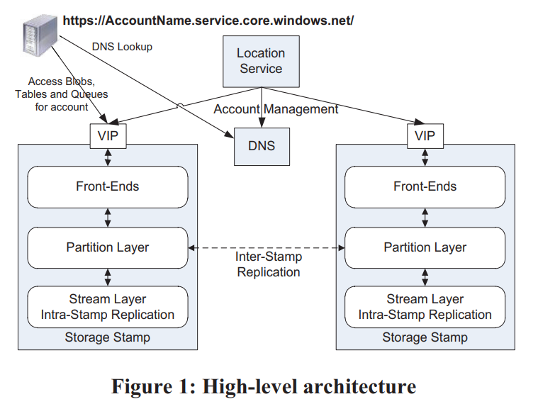

Azure 论文导读：[Windows Azure Storage: A Highly Available Cloud Storage Service with Strong Consistency](https://sigops.org/s/conferences/sosp/2011/current/2011-Cascais/printable/11-calder.pdf)

---

摘要

>Windows Azure Storage (WAS) is a cloud storage system that provides customers the ability to store seemingly limitless amounts of data for any duration of time. WAS customers have access to their data from anywhere at any time and only pay for what they use and store. In WAS, data is stored durably using both local and geographic replication to facilitate disaster recovery. Currently, WAS storage comes in the form of Blobs (files), Tables (structured storage), and Queues (message delivery). In this paper, we describe the WAS architecture, global namespace, and data model, as well as its resource provisioning, load balancing, and replication systems. 
>
>**Categories and Subject Descriptors** 
>
>D.4.2 [Operating Systems]: Storage Management—Secondary storage; D.4.3 [Operating Systems]: File Systems Management—Distributed file systems; D.4.5 [Operating Systems]: Reliability—Fault tolerance; D.4.7 [Operating Systems]: Organization and Design—Distributed systems; D.4.8 [Operating Systems]: Performance—Measurements 
>
>**General Terms** 
>
>Algorithms, Design, Management, Measurement, Performance, Reliability. 
>
>**Keywords** 
>
>Cloud storage, distributed storage systems, Windows Azure.

Windows Azure Storage (WAS)是一个云存储系统，它时刻为用户提供几乎无限的存储空间。WAS 同样支持本地以及地理级别（多数据中心）的备份的故障恢复。在 WAS 的基础上，逐渐演化了多个不同的产品比如 Azure Blobs(files 二进制文件存储)，Azure Tables(structred storage 结构化存储)， Azure Queues(message delivery 消息传递)。在本文中主要介绍：

- WAS 的架构
- 全球名字空间（global namespace
- 数据模型 (data model)
- 资源分配 (resource provisioning)
- 负载均衡 (load balancing) 
- 备份复制系统 (replication system)

---

# 简介

>Windows Azure Storage (WAS) is a scalable cloud storage system that has been in production since November 2008. It is used inside Microsoft for applications such as social networking search, serving video, music and game content, managing medical records, and more. In addition, there are thousands of customers outside Microsoft using WAS, and anyone can sign up over the Internet to use the system.
>
>WAS provides cloud storage in the form of Blobs (user files), Tables (structured storage), and Queues (message delivery). These three data abstractions provide the overall storage and workflow for many applications. A common usage pattern we see is incoming and outgoing data being shipped via Blobs, Queues providing the overall workflow for processing the Blobs, and intermediate service state and final results being kept in Tables or Blobs.
>
>An example of this pattern is an ingestion engine service built on Windows Azure to provide near real-time Facebook and Twitter search. This service is one part of a larger data processing pipeline that provides publically searchable content (via our search engine, Bing) within 15 seconds of a Facebook or Twitter user’s posting or status update. Facebook and Twitter send the raw public content to WAS (e.g., user postings, user status updates, etc.) to be made publically searchable. This content is stored in WAS Blobs. The ingestion engine annotates this data with user auth, spam, and adult scores; content classification; and classification for language and named entities. In addition, the engine crawls and expands the links in the data. While processing, the ingestion engine accesses WAS Tables at high rates and stores the results back into Blobs. These Blobs are then folded into the Bing search engine to make the content publically searchable. The ingestion engine uses Queues to manage the flow of work, the indexing jobs, and the timing of folding the results into the search engine. As of this writing, the ingestion engine for Facebook and Twitter keeps around 350TB of data in WAS (before replication). In terms of transactions, the ingestion engine has a peak traffic load of around 40,000 transactions per second and does between two to three billion transactions per day (see Section 7 for discussion of additional workload profiles).

>In the process of building WAS, feedback from potential internal and external customers drove many design decisions. Some key design features resulting from this feedback include:

WAS 是一个可扩展的云存储系统，WAS 根据一些反馈制定了一系列目标包括但不限于：

>**Strong Consistency** – Many customers want strong consistency: especially enterprise customers moving their line of business applications to the cloud. They also want the ability to perform conditional reads, writes, and deletes for optimistic concurrency control [12] on the strongly consistent data. For this, WAS provides three properties that the CAP theorem [2] claims are difficult to achieve at the same time: strong consistency, high availability, and partition tolerance (see Section 8).

- 强一致性

许多用户在迁移他们的业务线到云上时他们想要一个强一致性的系统，WAS 宣称自己同时实现了 CAP。

>**Global and Scalable Namespace/Storage** – For ease of use, WAS implements a global namespace that allows data to be stored and accessed in a consistent manner from any location in the world. Since a major goal of WAS is to enable storage of massive amounts of data, this global namespace must be able to address exabytes of data and beyond. We discuss our global namespace design in detail in Section 2.

- 全局可扩展的命名空间/存储

提供全球的名字空间，即可以在世界任何地方访问数据

>**Disaster Recovery** – WAS stores customer data across multiple data centers hundreds of miles apart from each other. This redundancy provides essential data recovery protection against disasters such as earthquakes, wild fires, tornados, nuclear reactor meltdown, etc. 

- 灾难恢复

WAS 提供了异地备份，因此什么龙卷风啊，地震啊，海啸啊，通通毁灭不了数据

>**Multi-tenancy and Cost of Storage** – To reduce storage cost, many customers are served from the same shared storage infrastructure. WAS combines the workloads of many different customers with varying resource needs together so that significantly less storage needs to be provisioned at any one point in time than if those services were run on their own dedicated hardware. 

- 省钱

>We describe these design features in more detail in the following sections. The remainder of this paper is organized as follows. Section 2 describes the global namespace used to access the WAS Blob, Table, and Queue data abstractions. Section 3 provides a high level overview of the WAS architecture and its three layers: Stream, Partition, and Front-End layers. Section 4 describes the stream layer, and Section 5 describes the partition layer. Section 6 shows the throughput experienced by Windows Azure applications accessing Blobs and Tables. Section 7 describes some internal Microsoft workloads using WAS. Section 8 discusses design choices and lessons learned. Section 9 presents related work, and Section 10 summarizes the paper.

本文其余部分组织：

- 第二节描述全局命名空间
- 第三节描述基础架构，主要包括：Stream, Partition, and Front-End layers
- 第四节描述 stream layer
- 第五节描述 partition layer
- 。。。

---

# 全局命名空间

>A key goal of our storage system is to provide a single global namespace that allows clients to address all of their storage in the cloud and scale to arbitrary amounts of storage needed over time. To provide this capability we leverage DNS as part of the storage namespace and break the storage namespace into three parts: an account name, a partition name, and an object name. As a result, all data is accessible via a URI of the form:
>
>`http(s)://AccountName.<service>.core.windows.net/PartitionName/ObjectName`
>
> service specifies the service type, which can be blob, table, or queue

为了全球可以访问，所以把 DNS 作为命名的一部分，另外还有账户名，分区名，对象名，因此所有数据都可以根据如下格式去访问：`http(s)://AccountName.<service>.core.windows.net/PartitionName/ObjectName`

>The AccountName is the customer selected account name for accessing storage and is part of the DNS host name. The AccountName DNS translation is used to locate the primary storage cluster and data center where the data is stored. This primary location is where all requests go to reach the data for that account. An application may use multiple AccountNames to store its data across different locations.

>In conjunction with the AccountName, the PartitionName locates the data once a request reaches the storage cluster. The PartitionName is used to scale out access to the data across storage nodes based on traffic needs. 

>When a PartitionName holds many objects, the ObjectName identifies individual objects within that partition. The system supports atomic transactions across objects with the same PartitionName value. The ObjectName is optional since, for some types of data, the PartitionName uniquely identifies the object within the account.

>This naming approach enables WAS to flexibly support its three data abstractions2 . For Blobs, the full blob name is the PartitionName. For Tables, each entity (row) in the table has a primary key that consists of two properties: the PartitionName and the ObjectName. This distinction allows applications using Tables to group rows into the same partition to perform atomic transactions across them. For Queues, the queue name is the PartitionName and each message has an ObjectName to uniquely identify it within the queue.

---

# 架构

>Here we present a high level discussion of the WAS architecture and how it fits into the Windows Azure Cloud Platform.

## Windows Azure Cloud Platform

>The Windows Azure Cloud platform runs many cloud services across different data centers and different geographic regions. The Windows Azure Fabric Controller is a resource provisioning and management layer that provides resource allocation, deployment/upgrade, and management for cloud services on the Windows Azure platform. WAS is one such service running on top of the Fabric Controller. 

>The Fabric Controller provides node management, network configuration, health monitoring, starting/stopping of service instances, and service deployment for the WAS system. In addition, WAS retrieves network topology information, physical layout of the clusters, and hardware configuration of the storage nodes from the Fabric Controller. WAS is responsible for managing the replication and data placement across the disks and load balancing the data and application traffic within the storage cluster. 

## WAS 架构

>An important feature of WAS is the ability to store and provide access to an immense amount of storage (exabytes and beyond). We currently have 70 petabytes of raw storage in production and are in the process of provisioning a few hundred more petabytes of raw storage based on customer demand for 2012. 

>The WAS production system consists of Storage Stamps and the Location Service (shown in Figure 1). 

WAS 的系统架构如图 1：

>**Storage Stamps** – A storage stamp is a cluster of N racks of storage nodes, where each rack is built out as a separate fault domain with redundant networking and power. Clusters typically range from 10 to 20 racks with 18 disk-heavy storage nodes per rack. Our first generation storage stamps hold approximately 2PB of raw storage each. Our next generation stamps hold up to 30PB of raw storage each. 
>
>To provide low cost cloud storage, we need to keep the storage provisioned in production as highly utilized as possible. Our goal is to keep a storage stamp around 70% utilized in terms of capacity, transactions, and bandwidth. We try to avoid going above 80% because we want to keep 20% in reserve for (a) disk short stroking to gain better seek time and higher throughput by utilizing the outer tracks of the disks and (b) to continue providing storage capacity and availability in the presence of a rack failure within a stamp. When a storage stamp reaches 70% utilization, the location service migrates accounts to different stamps using inter-stamp replication (see Section 3.4). 

一个 storage stamp 是一个由 N 个 rack 组成的集群，每个 rack 作为独立故障域，都拥有冗余的网络和电力系统。集群通常包含 10 到 20 个 racks，每个 rack 有 18 个存储节点。作为云存储，Storage Stamps 要保证最大的存储能力和性能，因此当一个 stamp 空间有 70% 已经被使用了时，Location service 将会使用 inter-stamp replication 迁移数据。

>**Location Service (LS)** – The location service manages all the storage stamps. It is also responsible for managing the account namespace across all stamps. The LS allocates accounts to storage stamps and manages them across the storage stamps for disaster recovery and load balancing. The location service itself is distributed across two geographic locations for its own disaster recovery.
>
>WAS provides storage from multiple locations in each of the three geographic regions: North America, Europe, and Asia. Each location is a data center with one or more buildings in that location, and each location holds multiple storage stamps. To provision additional capacity, the LS has the ability to easily add new regions, new locations to a region, or new stamps to a location. Therefore, to increase the amount of storage, we deploy one or more storage stamps in the desired location’s data center and add them to the LS. The LS can then allocate new storage accounts to those new stamps for customers as well as load balance (migrate) existing storage accounts from older stamps to the new stamps. 
>
>Figure 1 shows the location service with two storage stamps and the layers within the storage stamps. The LS tracks the resources used by each storage stamp in production across all locations. When an application requests a new account for storing data, it specifies the location affinity for the storage (e.g., US North). The LS then chooses a storage stamp within that location as the primary stamp for the account using heuristics based on the load information across all stamps (which considers the fullness of the stamps and other metrics such as network and transaction utilization). The LS then stores the account metadata information in the chosen storage stamp, which tells the stamp to start taking traffic for the assigned account. The LS then updates DNS to allow requests to now route from the name https://AccountName.service.core.windows.net/ to that storage stamp’s virtual IP (VIP, an IP address the storage stamp exposes for external traffic). 

Location Service 管理着所有的 Storage Stamps，负责管理账号的 namespace，以及 Storage Stamps 的容错。当然 Location Service 本身也部署在不同的数据中心，本身也支持容错。

Location Service 会跟踪 storage stamps。当用户请求 WAS 数据时，Location Service 会根据位置亲缘性，以及每个 storage stamps 的请求响应时间等信息，选择合适的 Storage Stamps 作为主 Primary Storage Stamps。之后存储用户账户的一些元信息，并更新 DNS，以及 VIP 让请求路由到最佳的存储节点 Storage Stamps 上。

## Storage Stamp 分层

>Also shown in Figure 1 are the three layers within a storage stamp. From bottom up these are: 
>
>**Stream Layer** – This layer stores the bits on disk and is in charge of distributing and replicating the data across many servers to keep data durable within a storage stamp. The stream layer can be thought of as a distributed file system layer within a stamp. It understands files, called “streams” (which are ordered lists of large storage chunks called “extents”), how to store them, how to replicate them, etc., but it does not understand higher level object constructs or their semantics. The data is stored in the stream layer, but it is accessible from the partition layer. In fact, partition servers (daemon processes in the partition layer) and stream servers are co-located on each storage node in a stamp. 
>
>**Partition Layer** – The partition layer is built for (a) managing and understanding higher level data abstractions (Blob, Table, Queue), (b) providing a scalable object namespace, (c) providing transaction ordering and strong consistency for objects, (d) storing object data on top of the stream layer, and (e) caching object data to reduce disk I/O. 
>
>Another responsibility of this layer is to achieve scalability by partitioning all of the data objects within a stamp. As described earlier, all objects have a PartitionName; they are broken down into disjointed ranges based on the PartitionName values and served by different partition servers. This layer manages which partition server is serving what PartitionName ranges for Blobs, Tables, and Queues. In addition, it provides automatic load balancing of PartitionNames across the partition servers to meet the traffic needs of the objects. 
>
>**Front-End (FE) layer** – The Front-End (FE) layer consists of a set of stateless servers that take incoming requests. Upon receiving a request, an FE looks up the AccountName, authenticates and authorizes the request, then routes the request to a partition server in the partition layer (based on the PartitionName). The system maintains a Partition Map that keeps track of the PartitionName ranges and which partition server is serving which PartitionNames. The FE servers cache the Partition Map and use it to determine which partition server to forward each request to. The FE servers also stream large objects directly from the stream layer and cache frequently accessed data for efficiency.

storage stamp 包括三层：

- Stream Layer：主要负责在一个 storage stamp 中数据的备份以及分配。Stream Layer可以认为是在 storage stamp 中的分布式文件系统。Stream Layer 不会理解上层的语义，只负责数据怎样存储，怎样分发，怎样备份。被称为 stream 是因为它只支持 append 操作。
- Partition Layer：主要负责向上抽象不同的存储服务，比如消息队列、对象存储等，且这种存储服务抽象是对底层 stream layer 透明的。
- Front-End (FE) layer：FE 是一层无状态中间层，接收来自用户的请求，并缓存集群路由信息，分发请求到 Partition Layer

## Two Replication Engines

>Before describing the stream and partition layers in detail, we first give a brief overview of the two replication engines in our system and their separate responsibilities. 

在详细介绍 stream layer 和 partition layer 之前，先介绍两个备份引擎 Infra-Stamp Replication，Inter-Stamp Replication 以及其责任。 Azure Storage 在设计之初，将备份复制系统分层两个，并且在不同的层级的目的是：

- Infra-stamp 提供硬件级别的容灾 （hardware failure）. low latency
- Inter-stamp 提供地理级别（数据中心）的容灾（geo-redundancy）

更值得一提的是，infra-stamp replication 在 steam layer 保证了在单个 Storage Stamp 上面的持久性，而 inter-stamp replication 在 partition layer 结合 Location Service 可以更好的理解 global namespace 并且很容易的实现地理级别的容灾。

>**Intra-Stamp Replication (stream layer)** – This system provides synchronous replication and is focused on making sure all the data written into a stamp is kept durable within that stamp. It keeps enough replicas of the data across different nodes in different fault domains to keep data durable within the stamp in the face of disk, node, and rack failures. Intra-stamp replication is done completely by the stream layer and is on the critical path of the customer’s write requests. Once a transaction has been replicated successfully with intra-stamp replication, success can be returned back to the customer. 

同步复制（synchronours replication）关注于确保数据被正确存储在 Storage Stamp 上。该复制要求保证足够多的副本，以及数据分布在不同的数据节点以及容错存储域名上面。一旦 Infra-Stamp Replication 的事务完毕，则可以给用户返回成功，用户即获得最新的数据。

>**Inter-Stamp Replication (partition layer)** – This system provides asynchronous replication and is focused on replicating data across stamps. Inter-stamp replication is done in the background and is off the critical path of the customer’s request. This replication is at the object level, where either the whole object is replicated or recent delta changes are replicated for a given account. Inter-stamp replication is used for (a) keeping a copy of an account’s data in two locations for disaster recovery and (b) migrating an account’s data between stamps. Inter-stamp replication is configured for an account by the location service and performed by the partition layer. 
>
>Inter-stamp replication is focused on replicating objects and the transactions applied to those objects, whereas intra-stamp replication is focused on replicating blocks of disk storage that are used to make up the objects. 

提供异步复制（asynchronous replication），关注于跨 Storage Stamp 的复制上。Inter-Stamp 主要用于保证用户的数据在两个不同的 location stamps 上用于容灾，以及用户 Storage Stamps 的数据迁移。Inter-Stamp 可以被账户在 Location Service 上配置，并且实际由 Partition Layer 执行。 Inter-Stamp 主要在后台执行，并且 Inter-Stamp 不会影响用户实际请求的关键路径，即与用户请求的关键路径偏离。

>We separated replication into intra-stamp and inter-stamp at these two different layers for the following reasons. Intra-stamp replication provides durability against hardware failures, which occur frequently in large scale systems, whereas inter-stamp replication provides geo-redundancy against geo-disasters, which are rare. It is crucial to provide intra-stamp replication with low latency, since that is on the critical path of user requests; whereas the focus of inter-stamp replication is optimal use of network bandwidth between stamps while achieving an acceptable level of replication delay. They are different problems addressed by the two replication schemes. 
>
>Another reason for creating these two separate replication layers is the namespace each of these two layers has to maintain. Performing intra-stamp replication at the stream layer allows the amount of information that needs to be maintained to be scoped by the size of a single storage stamp. This focus allows all of the meta-state for intra-stamp replication to be cached in memory for performance (see Section 4), enabling WAS to provide fast replication with strong consistency by quickly committing transactions within a single stamp for customer requests. In contrast, the partition layer combined with the location service controls and understands the global object namespace across stamps, allowing it to efficiently replicate and maintain object state across data centers. 

复制引擎分成两部分是因为硬件故障会经常出现，而跨区域的故障却很少出现，他们是解决不同问题的两种解决方案。

---

# Stream Layer

>

>

>

>

>

>

>

>

>

>

>

>

>

>

>

>

>

>

>

>

>

>

>

>

>

>

>

>

>

>

>

>

>

>

>

>

>

>

>

>

>

>

>

>

>

>

>

>

>

>

>

>

>

>

>

>

>

>

>

>

>

>

>

>

>

>

>

>

>

>

>

>

>

>

>

>

>

>

>

>

>

>

>

>

>

>

>

>

>

>

>

>

>

>

>

>

>

>

>

>

>

>

>

>

>

>

>

>

>

>

>

>

>

>

>

>

>

>

>

>

>

>

>

>

>

>

>

>

>

>

>

>

>

>

>

>

>

>

>

>

>

>

>

>

>

>

>

>

>

>

>

>

>

>

>

>

>

>

>

>

>

>

>

>

>

>

>

>

>

>

>

>

>

>

>

>

