[Finding a needle in Haystack: Facebook’s photo storage](https://www.usenix.org/legacy/event/osdi10/tech/full_papers/Beaver.pdf) 论文导读

---

>Abstract: This paper describes Haystack, an object storage system optimized for Facebook’s Photos application. Facebook currently stores over 260 billion images, which translates to over 20 petabytes of data. Users upload one billion new photos (∼60 terabytes) each week and Facebook serves over one million images per second at peak. Haystack provides a less expensive and higher performing solution than our previous approach, which leveraged network attached storage appliances over NFS. Our key observation is that this traditional design incurs an excessive number of disk operations because of metadata lookups. We carefully reduce this per photo metadata so that Haystack storage machines can perform all metadata lookups in main memory. This choice conserves disk operations for reading actual data and thus increases overall throughput.

摘要：本文介绍 Haystack，一个为 Facebook 的照片应用程序优化的对象存储系统。Facebook 目前存储了超过 2600 亿张图片，这意味着超过 20PB 的数据。用户每周还会上传 10 亿张新照片（60 TB），Facebook 在高峰期需要每秒提供超过一百万张图片的能力。相比我们以前的方案(基于 NAS 和 NFS)，Haystack 提供了一个更廉价、性能更高的解决方案。我们观察到一个非常关键的问题：传统的设计因为元数据查询而导致了过多的磁盘操作。我们竭尽全力的减少每个图片的元数据，让 Haystack 能在内存中执行所有的元数据查询。这个突破让系统腾出了更多的性能来读取真实的数据，增加了整体的吞吐量。

---

# 简介

>Sharing photos is one of Facebook’s most popular features. To date, users have uploaded over 65 billion photos making Facebook the biggest photo sharing website in the world. For each uploaded photo, Facebook generates and stores four images of different sizes, which translates to over 260 billion images and more than 20 petabytes of data. Users upload one billion new photos (∼60 terabytes) each week and Facebook serves over one million images per second at peak. As we expect these numbers to increase in the future, photo storage poses a significant challenge for Facebook’s infrastructure.

分享照片是 Facebook 最受欢迎的功能之一。迄今为止，用户已经上传了超过 650 亿张照片，使得 Facebook 成为世界上最大的图片分享网站。对每个上传的照片，Facebook 生成和存储 4 种不同大小的图片（比如在某些场景下只需展示缩略图），这相当于超过 2600 亿张图片和超过 20PB 的数据。用户每周上传 10 亿张新照片（60 TB），Facebook 峰值时需要提供每秒查询一百万张图片的能力。这些数字未来还会不断增长，图片存储对 Facebook 的基础设施提出了一个巨大的挑战。

>This paper presents the design and implementation of Haystack, Facebook’s photo storage system that has been in production for the past 24 months. Haystack is an object store [7, 10, 12, 13, 25, 26] that we designed for sharing photos on Facebook where data is written once, read often, never modified, and rarely deleted. We engineered our own storage system for photos because traditional filesystems perform poorly under our workload.

这篇论文介绍了 Haystack 的设计和实现，它已作为 Facebook 的图片存储系统投入生产环境 24 个月了。Haystack 是一个为 Facebook 上分享照片而设计的对象存储技术，在这个应用场景中，每个数据只会写入一次、读操作频繁、从不修改、很少删除。在 Facebook 遭遇的负荷下，传统的文件系统性能很差，优化定制出 Haystack 是大势所趋。

>In our experience, we find that the disadvantages of a traditional POSIX [21] based filesystem are directories and per file metadata. For the Photos application most of this metadata, such as permissions, is unused and thereby wastes storage capacity. Yet the more significant cost is that the file’s metadata must be read from disk into memory in order to find the file itself. While insignificant on a small scale, multiplied over billions of photos and petabytes of data, accessing metadata is the throughput bottleneck. We found this to be our key problem in using a network attached storage (NAS) appliance mounted over NFS. Several disk operations were necessary to read a single photo: one (or typically more) to translate the filename to an inode number, another to read the inode from disk, and a final one to read the file itself. In short, using disk IOs for metadata was the limiting factor for our read throughput. Observe that in practice this problem introduces an additional cost as we have to rely on content delivery networks (CDNs), such as Akamai [2], to serve the majority of read traffic.

根据我们的经验，传统基于 POSIX 的文件系统的缺点主要是目录和每个文件的元数据。对于图片应用，很多元数据（比如文件权限），是无用的而且浪费了很多存储容量。而且更大的性能消耗在于文件的元数据必须从磁盘读到内存来定位文件。文件规模较小时这些花费无关紧要，然而面对数十亿的图片和 PB 级别的数据，访问元数据就是吞吐量瓶颈所在。这是我们从之前（NAS+NFS）方案中总结的血的教训。通常情况下，我们读取单个照片就需要好几个磁盘操作：一个（有时候更多）转换文件名为 inode number，另一个从磁盘上读取 inode，最后一个读取文件本身。简单来说，为了查询元数据使用磁盘 I/O 是限制吞吐量的重要因素。在实际生产环境中，我们必须依赖内容分发网络（CDN，比如 Akamai）来支撑主要的读取流量，即使如此，文件元数据的大小和 I/O 同样对整体系统有很大影响

>Given the disadvantages of a traditional approach, we designed Haystack to achieve four main goals:

了解传统途径的缺点后，我们设计了 Haystack 来达到 4 个主要目标：

>High throughput and low latency. Our photo storage systems have to keep up with the requests users make. Requests that exceed our processing capacity are either ignored, which is unacceptable for user experience, or handled by a CDN, which is expensive and reaches a point of diminishing returns. Moreover, photos should be served quickly to facilitate a good user experience. Haystack achieves high throughput and low latency by requiring at most one disk operation per read. We accomplish this by keeping all metadata in main memory, which we make practical by dramatically reducing the per photo metadata necessary to find a photo on disk.

-   高吞吐量和低延迟

我们的图片存储系统必须跟得上海量用户查询请求。超过处理能力上限的请求，要么被忽略（对用户体验是不可接受的），要么被 CDN 处理（成本昂贵而且可能遭遇一个性价比转折点）。想要用户体验好，图片查询必须快速。Haystack 希望每个读操作至多需要一个磁盘操作，基于此才能达到高吞吐量和低延迟。为了实现这个目标，我们竭尽全力的减少每个图片的必需元数据，然后将所有的元数据保存在内存中。

>Fault-tolerant. In large scale systems, failures happen every day. Our users rely on their photos being available and should not experience errors despite the inevitable server crashes and hard drive failures. It may happen that an entire datacenter loses power or a cross-country link is severed. Haystack replicates each photo in geographically distinct locations. If we lose a machine we introduce another one to take its place, copying data for redundancy as necessary.

-   容错

在大规模的系统中，故障每天都在发生。我们的用户依赖他们的照片是可用的，尽管不可避免地发生服务器崩溃和硬盘故障，也不应该出现错误。可能发生的情况是，整个数据中心断电或跨国链接被切断。Haystack在地理上不同的地方复制每张照片。如果我们失去了一台机器，我们会引入另一台机器来代替它，必要时复制数据作为冗余。

>Cost-effective. Haystack performs better and is less expensive than our previous NFS-based approach. We quantify our savings along two dimensions: Haystack’s cost per terabyte of usable storage and Haystack’s read rate normalized for each terabyte of usable storage1 . In Haystack, each usable terabyte costs ∼28% less and processes ∼4x more reads per second than an equivalent terabyte on a NAS appliance.

-   高性价比

Haystack 比我们之前（NAS+NFS）方案性能更好，而且更省钱。我们按两个维度来衡量：每 TB 可用存储的花费、每 TB 可用存储的读取速度。相对 NAS 设备，Haystack 每个可用 TB 省了 28% 的成本，每秒支撑了超过 4 倍的读请求。

>Simple. In a production environment we cannot overstate the strength of a design that is straight-forward to implement and to maintain. As Haystack is a new system, lacking years of production-level testing, we paid particular attention to keeping it simple. That simplicity let us build and deploy a working system in a few months instead of a few years.

-   简单

替换 Facebook 的图片存储系统就像高速公路上给汽车换轮子，我们无法去追求完美的设计，这会导致实现和维护都非常耗时耗力。Haystack 是一个新系统，缺乏多年的生产环境级别的测试。我们花费了很多的注意力来保持它的简单，所以构建和部署一个可工作的 Haystack 只花了几个月而不是好几年。

>This work describes our experience with Haystack from conception to implementation of a production quality system serving billions of images a day. Our three main contributions are: 
>
>• Haystack, an object storage system optimized for the efficient storage and retrieval of billions of photos. 
>
>• Lessons learned in building and scaling an inexpensive, reliable, and available photo storage system. 
>
>• A characterization of the requests made to Facebook’s photo sharing application.

本篇文章 3 个主要的贡献是：

-   Haystack，一个为高效存储和检索 billion 级别图片而优化定制的对象存储系统。
-   构建和扩展一个低成本、高可靠、高可用图片存储系统中的经验教训。
-   访问 Facebook 照片分享应用的请求的特征描述

>We organize the remainder of this paper as follows. Section 2 provides background and highlights the challenges in our previous architecture. We describe Haystack’s design and implementation in Section 3. Section 4 characterizes our photo read and write workload and demonstrates that Haystack meets our design goals. We draw comparisons to related work in Section 5 and conclude this paper in Section 6.

文章剩余部分结构如下。章节 2 阐述了背景、突出了之前架构遇到的挑战。章节 3 描述了 Haystack 的设计和实现。章节 4 描述了各种图片读写场景下的系统负载特征，通过实验数据证明 Haystack 达到了设计目标。章节 5 是对比和相关工作，以及章节 6 的总结。

---

#  Background & Previous Design

>In this section, we describe the architecture that existed before Haystack and highlight the major lessons we learned. Because of space constraints our discussion of this previous design elides several details of a production-level deployment.

在本章节，我们将描述 Haystack 之前的架构，突出其主要的经验教训。由于篇幅的限制，我们对之前设计的讨论忽略了生产级部署的几个细节。

## 背景

>We begin with a brief overview of the typical design for how web servers, content delivery networks (CDNs), and storage systems interact to serve photos on a popular site. Figure 1 depicts the steps from the moment when a user visits a page containing an image until she downloads that image from its location on disk. When visiting a page the user’s browser first sends an HTTP request to a web server which is responsible for generating the markup for the browser to render. For each image the web server constructs a URL directing the browser to a location from which to download the data. For popular sites this URL often points to a CDN. If the CDN has the image cached then the CDN responds immediately with the data. Otherwise, the CDN examines the URL, which has enough information embedded to retrieve the photo from the site’s storage systems. The CDN then updates its cached data and sends the image to the user’s browser.

我们先来看一个概览图，它描述了常用的设计方案，web 服务器、CDN 和存储系统如何交互协作，来实现一个热门站点的图片服务。图 1 描述了从用户访问包含某个图片的页面开始，直到她最终从磁盘的特定位置下载此图片结束的全过程。当访问一个页面时，用户的浏览器首先向网络服务器发送一个 HTTP 请求，网络服务器负责生成标记供浏览器渲染。对于每张图片，网络服务器都会构建一个 URL，将浏览器引导到一个可以下载数据的位置。对于热门网站，这个 URL 通常指向 CDN。如果 CDN 有图像缓存，那么 CDN 会立即响应数据。否则，CDN 会检查 URL，其中包含足够的信息，以便从网站的存储系统中检索照片。然后，CDN 更新其缓存数据并将图像发送到用户的浏览器。

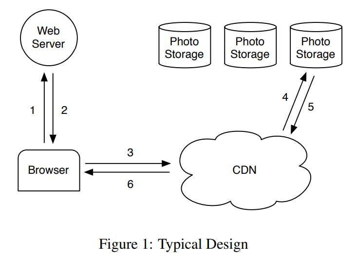

## 基于NFS的设计

>In our first design we implemented the photo storage system using an NFS-based approach. While the rest of this subsection provides more detail on that design, the major lesson we learned is that CDNs by themselves do not offer a practical solution to serving photos on a social networking site. CDNs do effectively serve the hottest photos— profile pictures and photos that have been recently uploaded—but a social networking site like Facebook also generates a large number of requests for less popular (often older) content, which we refer to as the long tail. Requests from the long tail account for a significant amount of our traffic, almost all of which accesses the backing photo storage hosts as these requests typically miss in the CDN. While it would be very convenient to cache all of the photos for this long tail, doing so would not be cost effective because of the very large cache sizes required.

在我们最初的设计中，我们使用了一个基于 NFS 的方案。我们吸取的主要教训是，对于一个热门的社交网络站点，只有 CDN 不足以为图片服务提供一个实用的解决方案。对于热门图片，CDN 确实很高效，比如个人信息图片和最近上传的照片，但是一个像 Facebook 的社交网络站点，会产生大量的对不热门（较早的）内容的请求，我们称之为 long tail（长尾理论中的名词）。long tail 的请求也占据了很大流量，它们都需要访问更下游的图片存储主机，因为这些请求在 CDN 缓存里基本上都会命中失败。缓存所有的图片是可以解决此问题，但这么做代价太大，需要极大容量的缓存。

>Our NFS-based design stores each photo in its own file on a set of commercial NAS appliances. A set of machines, Photo Store servers, then mount all the volumes exported by these NAS appliances over NFS. Figure 2 illustrates this architecture and shows Photo Store servers processing HTTP requests for images. From an image’s URL a Photo Store server extracts the volume and full path to the file, reads the data over NFS, and returns the result to the CDN.

基于 NFS 的设计中，图片文件存储在一组商用 NAS 设备上，NAS 设备的卷被 mount 到 Photo Store Server 的 NFS 上。图 2 展示了这个架构。Photo Store Server 解析 URL 得出卷和完整的文件路径，在 NFS 上读取数据，然后返回结果到 CDN。

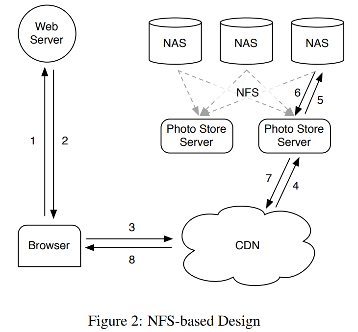

>We initially stored thousands of files in each directory of an NFS volume which led to an excessive number of disk operations to read even a single image. Because of how the NAS appliances manage directory metadata, placing thousands of files in a directory was extremely inefficient as the directory’s blockmap was too large to be cached effectively by the appliance. Consequently it was common to incur more than 10 disk operations to retrieve a single image. After reducing directory sizes to hundreds of images per directory, the resulting system would still generally incur 3 disk operations to fetch an image: one to read the directory metadata into memory, a second to load the inode into memory, and a third to read the file contents.

我们最初在 NFS 卷的每个目录下存储几千个文件，导致读取文件时产生了过多的磁盘操作，哪怕只是读单个图片。由于 NAS 设备管理目录元数据的机制，放置几千个文件在一个目录是极其低效的，因为目录的 blockmap 太大不能被设备有效的缓存。因此检索单个图片都可能需要超过 10 个磁盘操作。在减少到每个目录下几百个图片后，系统仍然大概需要 3 个磁盘操作来获取一个图片：读取目录元数据到内存、装载 inode 到内存、最后读取文件内容。

>To further reduce disk operations we let the Photo Store servers explicitly cache file handles returned by the NAS appliances. When reading a file for the first time a Photo Store server opens a file normally but also caches the filename to file handle mapping in memcache [18]. When requesting a file whose file handle is cached, a Photo Store server opens the file directly using a custom system call, open by filehandle, that we added to the kernel. Regrettably, this file handle cache provides only a minor improvement as less popular photos are less likely to be cached to begin with.

为了继续减少磁盘操作，我们让图片存储服务器明确的缓存 NAS 设备返回的文件句柄。第一次读取一个文件时，图片存储服务器正常打开一个文件，将文件名与文件句柄的映射缓存到 memcache 中。同时，我们在 os 内核中添加了一个通过句柄打开文件的接口，当查询被缓存的文件时，图片存储服务器直接用此接口和句柄参数打开文件。遗憾的是，文件句柄缓存改进不大，因为越冷门的图片越难被缓存到（没有解决 long tail 问题）

>One could argue that an approach in which all file handles are stored in memcache might be a workable solution. However, that only addresses part of the problem as it relies on the NAS appliance having all of its inodes in main memory, an expensive requirement for traditional filesystems. The major lesson we learned from the NAS approach is that focusing only on caching— whether the NAS appliance’s cache or an external cache like memcache—has limited impact for reducing disk operations. The storage system ends up processing the long tail of requests for less popular photos, which are not available in the CDN and are thus likely to miss in our caches.

值得讨论的是可以将所有文件句柄缓存到 memcache，不过这也需要 NAS 设备能缓存所有的 inode 信息，这么做是非常昂贵的。总结一下，我们从 NAS 方案吸取的主要教训是，仅针对缓存，不管是 NAS 设备缓存还是额外的像 memcache 缓存，对减少磁盘操作的改进是有限的。存储系统终究是要处理 long tail 请求（不热门图片）。

## 讨论

>It would be difficult for us to offer precise guidelines for when or when not to build a custom storage system. However, we believe it still helpful for the community to gain insight into why we decided to build Haystack.

我们很难提出一个指导方针关于何时应该构建一个自定义的存储系统。下面是我们在最终决定搭建 Haystack 之前的一些思考，希望能给大家提供参考。

>Faced with the bottlenecks in our NFS-based design, we explored whether it would be useful to build a system similar to GFS [9]. Since we store most of our user data in MySQL databases, the main use cases for files in our system were the directories engineers use for development work, log data, and photos. NAS appliances offer a very good price/performance point for development work and for log data. Furthermore, we leverage Hadoop [11] for the extremely large log data. Serving photo requests in the long tail represents a problem for which neither MySQL, NAS appliances, nor Hadoop are well-suited.

面对基于 NFS 设计的瓶颈，我们探讨了是否可以构建一个类似 GFS 的系统。而我们大部分用户数据都存储在 MySQL 数据库，文件存储主要用于开发工作、日志数据以及图片。NAS 设备其实为这些场景提供了性价比很好的方案。此外，我们补充了 Hadoop 以供海量日志数据处理。面对图片服务的 long tail 问题，MySQL、NAS、Hadoop 都不太合适。

>One could phrase the dilemma we faced as existing storage systems lacked the right RAM-to-disk ratio. However, there is no right ratio. The system just needs enough main memory so that all of the filesystem metadata can be cached at once. In our NAS-based approach, one photo corresponds to one file and each file requires at least one inode, which is hundreds of bytes large. Having enough main memory in this approach is not cost-effective. To achieve a better price/performance point, we decided to build a custom storage system that reduces the amount of filesystem metadata per photo so that having enough main memory is dramatically more cost-effective than buying more NAS appliances.

可以把我们面临的困境说成是现有的存储系统缺乏正确的内存与磁盘比例。然而，没有什么比率是绝对正确的。系统需要足够的内存才能缓存所有的文件系统元数据。在我们基于 NAS 的方案中，一个图片对应到一个文件，每个文件需要至少一个 inode，这已经占了几百字节。提供足够的内存太昂贵。所以我们决定构建一个定制存储系统，减少每个图片的元数据总量，以便能有足够的内存。相对购买更多的 NAS 设备，这是更加可行的、性价比更好的方案。

---

# 设计与实现

>Facebook uses a CDN to serve popular images and leverages Haystack to respond to photo requests in the long tail efficiently. When a web site has an I/O bottleneck serving static content the traditional solution is to use a CDN. The CDN shoulders enough of the burden so that the storage system can process the remaining tail. At Facebook a CDN would have to cache an unrea- sonably large amount of the static content in order for traditional (and inexpensive) storage approaches not to be I/O bound.

Facebook 使用 CDN 来支撑热门图片查询，结合 Haystack 则解决了它的 long tail 问题。如果 web 站点在查询静态内容时遇到 I/O 瓶颈，传统方案就是使用 CDN，它为下游的存储系统挡住了绝大部分的查询请求。在 Facebook，为了传统的、廉价的的底层存储不受 I/O 摆布，CDN 往往需要缓存难以置信的海量静态内容。

>Understanding that in the near future CDNs would not fully solve our problems, we designed Haystack to address the critical bottleneck in our NFS-based approach: disk operations. We accept that requests for less popular photos may require disk operations, but aim to limit the number of such operations to only the ones necessary for reading actual photo data. Haystack achieves this goal by dramatically reducing the memory used for filesystem metadata, thereby making it practical to keep all this metadata in main memory.

在不久的将来，CDN 也不能完全的解决我们的问题，所以我们设计了 Haystack 来解决这个关键瓶颈：磁盘操作。我们接受 long tail 请求必然导致磁盘操作的现实，但是会尽量减少除了访问真实图片数据之外的其他操作。Haystack 有效的减少了文件系统元数据的空间，并在内存中保存所有元数据。

>Recall that storing a single photo per file resulted in more filesystem metadata than could be reasonably cached. Haystack takes a straight-forward approach: it stores multiple photos in a single file and therefore maintains very large files. We show that this straightforward approach is remarkably effective. Moreover, we argue that its simplicity is its strength, facilitating rapid implementation and deployment. We now discuss how this core technique and the architectural components surrounding it provide a reliable and available storage system. In the following description of Haystack, we distinguish between two kinds of metadata. Application metadata describes the information needed to construct a URL that a browser can use to retrieve a photo. Filesystem metadata identifies the data necessary for a host to retrieve the photos that reside on that host’s disk.

每个图片存储为一个文件将会导致元数据太多，难以被全部缓存。Haystack 的对策是：将多个图片存储在单个文件中，控制文件个数，维护大型文件，我们将论述此方案是非常有效的。另外，我们强调了它设计的简洁性，以促进快速的实现和部署。我们将以此核心技术展开，结合它周边的所有架构组件，描述 Haystack 是如何实现了一个高可靠、高可用的存储系统。在下面对 Haystack 的介绍中，需要区分两种元数据，不要混淆。一种是应用元数据，它是用来为浏览器构造检索图片所需的 URL；另一种是文件系统元数据，用于在磁盘上检索文件。

## 概述

>The Haystack architecture consists of 3 core components: the Haystack Store, Haystack Directory, and Haystack Cache. For brevity we refer to these components with ‘Haystack’ elided. The Store encapsulates the persistent storage system for photos and is the only component that manages the filesystem metadata for photos. We organize the Store’s capacity by physical volumes. For example, we can organize a server’s 10 terabytes of capacity into 100 physical volumes each of which provides 100 gigabytes of storage. We further group physical volumes on different machines into logical volumes. When Haystack stores a photo on a logical volume, the photo is written to all corresponding physical volumes. This redundancy allows us to mitigate data loss due to hard drive failures, disk controller bugs, etc. The Directory maintains the logical to physical mapping along with other application metadata, such as the logical volume where each photo resides and the logical volumes with free space. The Cache functions as our internal CDN, which shelters the Store from requests for the most popular photos and provides insulation if upstream CDN nodes fail and need to refetch content.

Haystack 架构包含3个核心组件：Haytack Store、Haystack Directory 和 Haystack Cache（简单起见我们下面就不带 Haystack 前缀了）。Store 是持久化存储系统，并负责管理图片的文件系统元数据。Store 将数据存储在物理的卷上。比如，在一台机器上提供 100 个物理卷，每个提供 100GB 的存储容量，整台机器则可以支撑 10TB 的存储。更进一步，不同机器上的多个物理卷将对应一个逻辑卷。Haystack 将一个图片存储到一个逻辑卷时，图片被写入到所有对应的物理卷。这个冗余可避免由于硬盘故障，磁盘控制器 bug 等导致的数据丢失。Directory 维护了逻辑到物理卷的映射以及其他应用元数据，比如某个图片寄存在哪个逻辑卷、某个逻辑卷的空闲空间等。Cache 的功能类似我们系统内部的 CDN，它帮 Store 挡住热门图片的请求（可以缓存的就绝不交给下游的持久化存储）。在独立设计 Haystack 时，我们要设想它处于一个没有 CDN 的大环境中，即使有 CDN 也要预防其节点故障导致大量请求直接进入存储系统，所以 Cache 是十分必要的。

>Figure 3 illustrates how the Store, Directory, and Cache components fit into the canonical interactions between a user’s browser, web server, CDN, and storage system. In the Haystack architecture the browser can be directed to either the CDN or the Cache. Note that while the Cache is essentially a CDN, to avoid confusion we use ‘CDN’ to refer to external systems and ‘Cache’ to refer to our internal one that caches photos. Having an internal caching infrastructure gives us the ability to reduce our dependence on external CDNs.

图 3 说明了 Store、Directory、Cache 是如何协作的，以及如何与外部的浏览器、web 服务器、CDN 和存储系统交互。在 Haystack 架构中，浏览器会被引导至 CDN 或者 Cache 上。需要注意的是 Cache 本质上也是一个 CDN，为了避免困惑，我们使用 CDN 表示外部的系统、使用 Cache 表示我们内部的系统。有一个内部的缓存设施能减少对外部 CDN 的依赖。

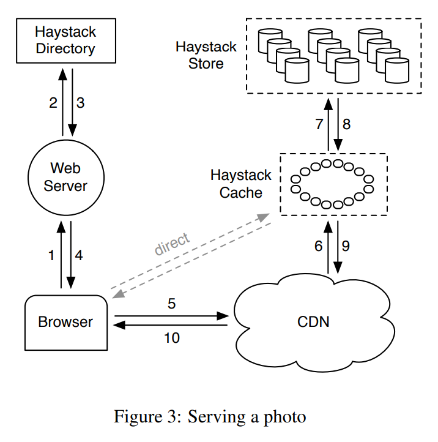

>When a user visits a page the web server uses the Directory to construct a URL for each photo. The URL contains several pieces of information, each piece corresponding to the sequence of steps from when a user’s browser contacts the CDN (or Cache) to ultimately retrieving a photo from a machine in the Store. A typical URL that directs the browser to the CDN looks like the following: 
>
>`http://<CDN>/<Cache>/<Machine id>/<Logical volume, Photo>`

当用户访问一个页面，web 服务器使用 Directory 为每个图片来构建一个 URL（Directory 中有足够的应用元数据来构造 URL）。URL 包含几块信息，每一块内容可以对应到从浏览器访问 CDN 或者 Cache 直至最终在一台 Store 机器上检索到图片的各个步骤。一个典型的 URL如下：`http://<CDN>/<Cache>/<Machine id>/<Logical volume, Photo>`

>The first part of the URL specifies from which CDN to request the photo. The CDN can lookup the photo internally using only the last part of the URL: the logical volume and the photo id. If the CDN cannot locate the photo then it strips the CDN address from the URL and contacts the Cache. The Cache does a similar lookup to find the photo and, on a miss, strips the Cache address from the URL and requests the photo from the specified Store machine. Photo requests that go directly to the Cache have a similar workflow except that the URL is missing the CDN specific information.

第一个部分 `<CDN>` 指明了从哪个 CDN 查询此图片。到 CDN 后它使用最后部分的 URL（逻辑卷和图片 ID）即可查找缓存的图片。如果 CDN 未命中缓存，它从 URL 中删除 `<CDN>` 相关信息，然后访问 Cache。Cache 的查找过程与之类似，如果还没命中，则去掉 `<Cache>` 相关信息，请求被发至指定的 Store 机器 `<Machine id>`。如果请求不经过 CDN 直接发至 Cache，其过程与上述类似，只是少了 CDN 这个环节。

>Figure 4 illustrates the upload path in Haystack. When a user uploads a photo she first sends the data to a web server. Next, that server requests a write-enabled logical volume from the Directory. Finally, the web server assigns a unique id to the photo and uploads it to each of the physical volumes mapped to the assigned logical volume.

图 4 说明了在 Haystack 中的上传流程。用户上传一个图片时，她首先发送数据到 web 服务器。web 服务器随后从 Directory 中请求一个可写逻辑卷。最后，web 服务器为图片分配一个唯一的 ID，然后将其上传至逻辑卷对应的每个物理卷。

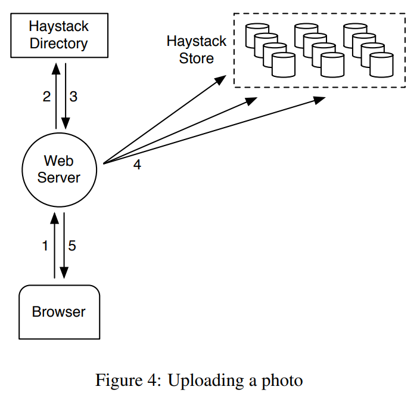

##  Haystack Directory

>The Directory serves four main functions. First, it provides a mapping from logical volumes to physical volumes. Web servers use this mapping when uploading photos and also when constructing the image URLs for a page request. Second, the Directory load balances writes across logical volumes and reads across physical volumes. Third, the Directory determines whether a photo request should be handled by the CDN or by the Cache. This functionality lets us adjust our dependence on CDNs. Fourth, the Directory identifies those logical volumes that are read-only either because of operational reasons or because those volumes have reached their storage capacity. We mark volumes as read-only at the granularity of machines for operational ease.

Directory 提供 4 个主要功能。首先，它提供一个从逻辑卷到物理卷的映射。web 服务器上传图片和构建图片 URL 时都需要使用这个映射。第二，Directory 在分配写请求到逻辑卷、分配读请求到物理卷时需保证负载均衡。第三，Directory 决定一个图片请求应该被发至 CDN 还是 Cache，这个功能可以让我们动态调整是否依赖 CDN。第四，Directory 指明哪些逻辑卷是只读的（只读限制可能是源自运维原因、或者达到存储容量上限；为了运维方便，我们以机器粒度来标记卷的只读）。

>When we increase the capacity of the Store by adding new machines, those machines are write-enabled; only write-enabled machines receive uploads. Over time the available capacity on these machines decreases. When a machine exhausts its capacity, we mark it as read-only. In the next subsection we discuss how this distinction has subtle consequences for the Cache and Store.

当我们增加新机器以增大 Store 的容量时，那些新机器是可写的；只有可写的机器才会收到 upload 请求。随时间流逝这些机器的可用容量会不断减少。当一个机器达到容量上限，我们标记它为只读，在下一个子章节我们将讨论如何这个特性如何影响 Cache 和 Store。

>The Directory is a relatively straight-forward component that stores its information in a replicated database accessed via a PHP interface that leverages memcache to reduce latency. In the event that we lose the data on a Store machine we remove the corresponding entry in the mapping and replace it when a new Store machine is brought online.

Directory 将应用元数据存储在一个冗余复制的数据库，通过一个 PHP 接口访问，也可以换成 memcache 以减少延迟。当一个 Store 机器故障、数据丢失时，Directory 在应用元数据中删除对应的项，新 Store 机器上线后则接替此项。

## Haystack Cache

>The Cache receives HTTP requests for photos from CDNs and also directly from users’ browsers. We organize the Cache as a distributed hash table and use a photo’s id as the key to locate cached data. If the Cache cannot immediately respond to the request, then the Cache fetches the photo from the Store machine identified in the URL and replies to either the CDN or the user’s browser as appropriate.

Cache 会从 CDN 或者直接从用户浏览器接收到图片查询请求。Cache 的实现可理解为一个分布式 Hash Table，使用图片 ID 作为 key 来定位缓存的数据。如果 Cache 未命中，Cache 则根据 URL 从指定 Store 机器上获取图片，视情况回复给 CDN 或者用户浏览器。

>We now highlight an important behavioral aspect of the Cache. It caches a photo only if two conditions are met: (a) the request comes directly from a user and not the CDN and (b) the photo is fetched from a writeenabled Store machine. The justification for the first condition is that our experience with the NFS-based design showed post-CDN caching is ineffective as it is unlikely that a request that misses in the CDN would hit in our internal cache. The reasoning for the second is indirect. We use the Cache to shelter write-enabled Store machines from reads because of two interesting properties: photos are most heavily accessed soon after they are uploaded and filesystems for our workload generally perform better when doing either reads or writes but not both (Section 4.1). Thus the write-enabled Store machines would see the most reads if it were not for the Cache. Given this characteristic, an optimization we plan to implement is to proactively push recently uploaded photos into the Cache as we expect those photos to be read soon and often.

我们现在强调一下 Cache 的一个重要行为概念。只有当符合两种条件之一时它才会缓存图片：

(a) 请求直接来自用户浏览器而不是 CDN；

(b) 图片获取自一个可写的 Store 机器。

第一个条件的理由是一个请求如果在 CDN 中没命中（非热门图片），那在我们内部缓存也不太需要命中（即使此图片开始逐渐活跃，那也能在 CDN 中命中缓存，这里无需多此一举；直接的浏览器请求说明是不经过 CDN 的，那就需要 Cache 代为 CDN，为其缓存）。

第二个条件的理由是间接的，有点经验论，主要是为了保护可写 Store 机器；原因挺有意思，大部分图片在上传之后很快会被频繁访问（比如某个美女新上传了一张自拍），而且文件系统在只有读或者只有写的情况下执行的更好，不太喜欢同时并发读写（章节 4.1）。如果没有 Cache，可写 Store 机器往往会遭遇频繁的读请求。因此，我们甚至会主动的推送最近上传的图片到 Cache。

##  Haystack Store

>The interface to Store machines is intentionally basic. Reads make very specific and well-contained requests asking for a photo with a given id, for a certain logical volume, and from a particular physical Store machine. The machine returns the photo if it is found. Otherwise, the machine returns an error.

Store 机器的接口设计的很简约。读操作只需提供一些很明确的元数据信息，包括图片 ID、哪个逻辑卷、哪台物理 Store 机器等。机器如果找到图片则返回其真实数据，否则返回错误信息。

>Each Store machine manages multiple physical volumes. Each volume holds millions of photos. For concreteness, the reader can think of a physical volume as simply a very large file (100 GB) saved as ‘/hay/haystack ’. A Store machine can access a photo quickly using only the id of the corresponding logical volume and the file offset at which the photo resides. This knowledge is the keystone of the Haystack design: retrieving the filename, offset, and size for a particular photo without needing disk operations. A Store machine keeps open file descriptors for each physical volume that it manages and also an inmemory mapping of photo ids to the filesystem metadata (i.e., file, offset and size in bytes) critical for retrieving that photo.

每个 Store 机器管理多个物理卷。每个物理卷存有百万张图片。读者可以将一个物理卷想象为一个非常大的文件（100 GB），保存为 /hay/haystack。Store 机器仅需要逻辑卷 ID 和文件 offset 就能非常快的访问一个图片。这是 Haystack 设计的主旨：不需要磁盘操作就可以检索文件名、偏移量、文件大小等元数据。Store 机器会将其下所有物理卷的文件描述符（open 的文件句柄，卷的数量不多，数据量不大）缓存在内存中。同时，图片 ID 到文件系统元数据（文件、偏移量、大小等）的映射（后文简称为内存中映射）是检索图片的重要条件，也会全部缓存在内存中。

>We now describe the layout of each physical volume and how to derive the in-memory mapping from that volume. A Store machine represents a physical volume as a large file consisting of a superblock followed by a sequence of needles. Each needle represents a photo stored in Haystack. Figure 5 illustrates a volume file and the format of each needle. Table 1 describes the fields in each needle.

现在我们描述一下物理卷和内存中映射的结构。一个物理卷可以理解为一个大型文件，其中包含一系列的 needle。每个 needle 就是一张图片。图 5 说明了卷文件和每个 needle 的格式。

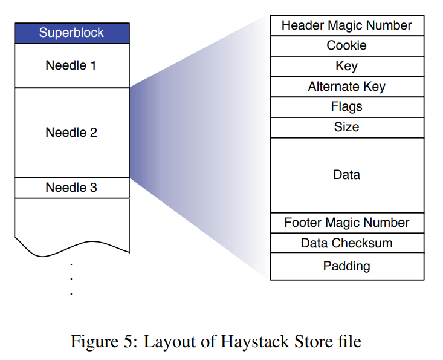

Table1 描述了 needle 中的字段。

| Field         | Explanation                                   |
| ------------- | --------------------------------------------- |
| Header        | Magic number used for recovery                |
| Cookie        | Random number to mitigate brute force lookups |
| Key           | 64-bit photo id                               |
| Alternate key | 32-bit supplemental id                        |
| Flags         | Signifies deleted status                      |
| Size          | Data size                                     |
| Data          | The actual photo data                         |
| Footer        | Magic number used for recovery                |
| Data Checksum | Used to check integrity                       |
| Padding       | Total needle size is aligned to 8 bytes       |

>To retrieve needles quickly, each Store machine maintains an in-memory data structure for each of its volumes. That data structure maps pairs of (key, alternate key)2 to the corresponding needle’s flags, size in 2For historical reasons, a photo’s id corresponds to the key while its type is used for the alternate key. During an upload, web servers scale each photo to four different sizes (or types) and store them as separate needles, but with the same key. The important distinction among these bytes, and volume offset. After a crash, a Store machine can reconstruct this mapping directly from the volume file before processing requests. We now describe how a Store machine maintains its volumes and in-memory mapping while responding to read, write, and delete requests (the only operations supported by the Store).

为了快速的检索 needle，Store 机器需要为每个卷维护一个内存中的 key-value 映射。映射的 Key 就是（needle.key+needle.alternate_key）的组合，映射的 Value 就是 needle 的 flag、size、卷 offset（都以 byte 为单位）。如果 Store 机器崩溃、重启，它可以直接分析卷文件来重新构建这个映射（构建完成之前不处理请求）。下面我们介绍 Store 机器如何响应读写和删除请求（Store 仅支持这些操作）。

从 Table1 我们看到 needle.key 就是图片 ID，为何仅用图片 ID 做内存中映射的 Key 还不够，还需要一个 alternate_key？这是因为一张照片会有 4 份副本，它们的图片 ID 相同，只是类型不同（比如大图、小图、缩略图等），于是将图片 ID 作为 needle.key，将类型作为 needle.alternate_key。

###  读取

>When a Cache machine requests a photo it supplies the logical volume id, key, alternate key, and cookie to the Store machine. The cookie is a number embedded in the URL for a photo. The cookie’s value is randomly assigned by and stored in the Directory at the time that the photo is uploaded. The cookie effectively eliminates attacks aimed at guessing valid URLs for photos.

Cache 机器向 Store 机器请求一个图片时，它需要提供逻辑卷 id、key、alternate key 和 cookie。cookie 是个数字，嵌在 URL 中。当一张新图片被上传，Directory 为其随机分配一个 cookie 值，并作为应用元数据之一存储在 Directory。它就相当于一张图片的私人密码，此密码可以保证所有发往 Cache 或 CDN 的请求都是经过 Directory 批准的（Cache 和 Store 都持有图片的 cookie，若用户自己在浏览器中伪造、猜测 URL 或发起攻击，则会因为 cookie 不匹配而失败，从而保证 Cache、Store 能放心处理合法的图片请求）。

>When a Store machine receives a photo request from a Cache machine, the Store machine looks up the relevant metadata in its in-memory mappings. If the photo has not been deleted the Store machine seeks to the appropriate offset in the volume file, reads the entire needle from disk (whose size it can calculate ahead of time), and verifies the cookie and the integrity of the data. If these checks pass then the Store machine returns the photo to the Cache machine.

当 Store 机器接收到 Cache 机器发来的图片查询请求，它会利用内存中映射快速的查找相关的元数据。如果图片没有被删除，Store 则在卷文件中 seek 到相应的 offset，从磁盘上读取整个 needle（needle 的 size 可以提前计算出来），然后检查 cookie 和数据完整性，若全部合法则将图片数据返回到 Cache 机器。

### 写入

>When uploading a photo into Haystack web servers provide the logical volume id, key, alternate key, cookie, and data to Store machines. Each machine synchronously appends needle images to its physical volume files and updates in-memory mappings as needed. While simple, this append-only restriction complicates some operations that modify photos, such as rotations. As Haystack disallows overwriting needles, photos can only be modified by adding an updated needle with the same key and alternate key. If the new needle is written to a different logical volume than the original, the Directory updates its application metadata and future requests will never fetch the older version. If the new needle is written to the same logical volume, then Store machines append the new needle to the same corresponding physical volumes. Haystack distinguishes such duplicate needles based on their offsets. That is, the latest version of a needle within a physical volume is the one at the highest offset.

上传一个图片到 Haystack 时，web 服务器向 Directory 咨询得到一个可写逻辑卷及其对应的多台 Store 机器，随后直接访问这些 Store 机器，向其提供逻辑卷 id、key、alternate key、cookie 和真实数据。每个 Store 机器为图片创建一个新 needle，append 到相应的物理卷文件，更新内存中映射。过程很简单，但是 append-only 策略不能很好的支持修改性的操作，比如旋转（图片顺时针旋转 90 度之类的）。Haystack 并不允许覆盖 needle，所以图片的修改只能通过添加一个新 needle，其拥有相同的 key 和 alternate key。如果新 needle 被写入到与老 needle 不同的逻辑卷，则只需要 Directory 更新它的应用元数据，未来的请求都路由到新逻辑卷，不会获取老版本的数据。如果新 needle 写入到相同的逻辑卷，Store 机器也只是将其 append 到相同的物理卷中。Haystack 利用一个十分简单的手段来区分重复的 needle，那就是判断它们的 offset（新版本的 needle 肯定是 offset 最高的那个），在构造或更新内存中映射时如果遇到相同的 needle，则用 offset 高的覆盖低的。

### 删除

>Deleting a photo is straight-forward. A Store machine sets the delete flag in both the in-memory mapping and synchronously in the volume file. Requests to get deleted photos first check the in-memory flag and return errors if that flag is enabled. Note that the space occupied by deleted needles is for the moment lost. Later, we discuss how to reclaim deleted needle space by compacting volume files.

在删除图片时，Store 机器将内存中映射和卷文件中相应的 flag 同步的设置为已删除（软删除机制，此刻不会删除 needle 的磁盘数据）。当接收到已删除图片的查询请求，Store 会检查内存中 flag 并返回错误信息。值得注意的是，已删除 needle 依然占用的空间是个问题，我们稍后将讨论如何通过压缩技术来回收已删除 needle 的空间。

###  索引文件

>Store machines use an important optimization—the index file—when rebooting. While in theory a machine can reconstruct its in-memory mappings by reading all of its physical volumes, doing so is time-consuming as the amount of data (terabytes worth) has to all be read from disk. Index files allow a Store machine to build its in-memory mappings quickly, shortening restart time.

Store机器使用一个重要的优化，索引文件，来帮助重启初始化。尽管理论上一个机器能通过读取所有的物理卷来重新构建它的内存中映射，但大量数据（TB 级别）需要从磁盘读取，非常耗时。索引文件允许 Store 机器快速的构建内存中映射，减少重启时间。

>Store machines maintain an index file for each of their volumes. The index file is a checkpoint of the inmemory data structures used to locate needles efficiently on disk. An index file’s layout is similar to a volume file’s, containing a superblock followed by a sequence of index records corresponding to each needle in the superblock. These records must appear in the same order as the corresponding needles appear in the volume file. Figure 6 illustrates the layout of the index file and Table 2 explains the different fields in each record.

Store 机器为每个卷维护一个索引文件。索引文件可以想象为内存中映射的一个存档。索引文件的布局和卷文件类似，一个超级块包含了一系列索引记录，每个记录对应到各个 needle。索引文件中的记录与卷文件中对应的 needle 必须保证相同的存储顺序。图 6 描述了索引文件的布局，Table2 解释了记录中的不同的字段。

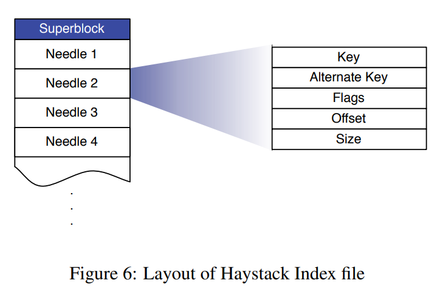

| Field         | Explanation                         |
| ------------- | ----------------------------------- |
| Key           | 64-bit key                          |
| Alternate key | 32-bit alternate key                |
| Flags         | Currently unused                    |
| Offset        | Needle offset in the Haystack Store |
| Size          | Needle data size                    |

>Restarting using the index is slightly more complicated than just reading the indices and initializing the in-memory mappings. The complications arise because index files are updated asynchronously, meaning that index files may represent stale checkpoints. When we write a new photo the Store machine synchronously appends a needle to the end of the volume file and asynchronously appends a record to the index file. When we delete a photo, the Store machine synchronously sets the flag in that photo’s needle without updating the index file. These design decisions allow write and delete operations to return faster because they avoid additional synchronous disk writes. They also cause two side effects we must address: needles can exist without corresponding index records and index records do not reflect deleted photos.

使用索引帮助重启稍微增加了系统复杂度，因为索引文件都是异步更新的，这意味着当前索引文件中的存档可能不是最新的。当我们写入一个新图片时，Store 机器同步 append 一个 needle 到卷文件末尾，并异步 append 一个记录到索引文件。当我们删除图片时，Store 机器在对应 needle 上同步设置 flag，而不会更新索引文件。这些设计决策是为了让写和删除操作更快返回，避免附加的同步磁盘写。但是也导致了两方面的影响：一个 needle 可能没有对应的索引记录、索引记录中无法得知图片已删除。

>We refer to needles without corresponding index records as orphans. During restarts, a Store machine sequentially examines each orphan, creates a matching index record, and appends that record to the index file. Note that we can quickly identify orphans because the last record in the index file corresponds to the last non-orphan needle in the volume file. To complete the restart, the Store machine now initializes its in-memory mappings using only the index files.

我们将对应不到任何索引记录的 needle 称为孤儿。在重启时，Store 机器顺序的检查每个孤儿，重新创建匹配的索引记录，append 到索引文件。我们能快速的识别孤儿是因为索引文件中最后的记录能对应到卷文件中最后的非孤儿 needle。处理完孤儿问题，Store 机器则开始使用索引文件初始化它的内存中映射。

>Since index records do not reflect deleted photos, a Store machine may retrieve a photo that has in fact been deleted. To address this issue, after a Store machine reads the entire needle for a photo, that machine can then inspect the deleted flag. If a needle is marked as deleted the Store machine updates its in-memory mapping accordingly and notifies the Cache that the object was not found.

由于索引记录中无法得知图片已删除，Store 机器可能去检索一个实际上已经被删除的图片。为了解决这个问题，可以在 Store 机器读取整个 needle 后检查其 flag，若标记为已删除，则更新内存中映射的 flag，并回复 Cache 此对象未找到。

###  文件系统

>We describe Haystack as an object store that utilizes a generic Unix-like filesystem, but some filesystems are better suited for Haystack than others. In particular, the Store machines should use a filesystem that does not need much memory to be able to perform random seeks within a large file quickly. Currently, each Store machine uses XFS [24], an extent based file system. XFS has two main advantages for Haystack. First, the blockmaps for several contiguous large files can be small enough to be stored in main memory. Second, XFS provides efficient file preallocation, mitigating fragmentation and reining in how large block maps can grow.

Haystack 可以理解为基于通用的类 Unix 文件系统搭建的对象存储，但是某些特殊文件系统能更好的适应 Haystack。比如，Store 机器的文件系统应该不需要太多内存就能够在一个大型文件上快速的执行随机 seek。当前我们所有的 Store 机器都在使用的文件系统是 XFS，一个基于范围（extent）的文件系统。XFS 有两个优势：首先，XFS 中邻近的大型文件的 blockmap 很小，可放心使用内存存储；第二，XFS 提供高效文件预分配，减轻磁盘碎片等问题。

>Using XFS, Haystack can eliminate disk operations for retrieving filesystem metadata when reading a photo. This benefit, however, does not imply that Haystack can guarantee every photo read will incur exactly one disk operation. There exists corner cases where the filesystem requires more than one disk operation when photo data crosses extents or RAID boundaries. Haystack preallocates 1 gigabyte extents and uses 256 kilobyte RAID stripe sizes so that in practice we encounter these cases rarely.

使用 XFS，Haystack 可以在读取一张图片时完全避免检索文件系统元数据导致的磁盘操作。但是这并不意味着 Haystack 能保证读取单张图片绝对只需要一个磁盘操作。在一些极端情况下会发生额外的磁盘操作，比如当图片数据跨越 XFS 的范围（extent）或者 RAID 边界时。不过 Haystack 会预分配 1GB 的范围（extent）、设置 RAID stripe 大小为 256KB，所以实际上我们很少遭遇这些极端场景。

## 故障恢复

>Like many other large-scale systems running on commodity hardware [5, 4, 9], Haystack needs to tolerate a variety of failures: faulty hard drives, misbehaving RAID controllers, bad motherboards, etc. We use two straight-forward techniques to tolerate failures—one for detection and another for repair.

对于运行在普通硬件上的大规模系统，容忍各种类型的故障是必须的，包括硬盘驱动故障、RAID 控制器错误、主板错误等，Haystack 也不例外。我们的对策由两个部分组成：一个为侦测、一个为修复。

>To proactively find Store machines that are having problems, we maintain a background task, dubbed pitchfork, that periodically checks the health of each Store machine. Pitchfork remotely tests the connection to each Store machine, checks the availability of each volume file, and attempts to read data from the Store machine. If pitchfork determines that a Store machine consistently fails these health checks then pitchfork automatically marks all logical volumes that reside on that Store machine as read-only. We manually address the underlying cause for the failed checks offline.

为了主动找到有问题的 Store 机器，我们维护了一个后台任务，称之为 pitchfork，它周期性的检查每个 Store 机器的健康度。pitchfork 远程的测试到每台 Store 机器的连接，检查其每个卷文件的可用性，并尝试读取数据。如果 pitchfork 确定某台 Store 机器没通过这些健康检查，它会自动标记此台机器涉及的所有逻辑卷为只读。我们的工程师将在线下人工的检查根本故障原因。

>Once diagnosed, we may be able to fix the problem quickly. Occasionally, the situation requires a more heavy-handed bulk sync operation in which we reset the data of a Store machine using the volume files supplied by a replica. Bulk syncs happen rarely (a few each month) and are simple albeit slow to carry out. The main bottleneck is that the amount of data to be bulk synced is often orders of magnitude greater than the speed of the NIC on each Store machine, resulting in hours for mean time to recovery. We are actively exploring techniques to address this constraint.

一旦确诊，我们就能快速的解决问题。不过在少数情况下，需要执行一个更加严厉的 bulk 同步操作，此操作需要使用复制品中的卷文件重置某个 Store 机器的所有数据。Bulk 同步发生的几率很小（每个月几次），而且过程比较简单，只是执行很慢。主要的瓶颈在于 bulk 同步的数据量经常会远远超过单台 Store 机器 NIC 速度，导致好几个小时才能恢复。我们正积极解决这个问题。

##  优化

>We now discuss several optimizations important to Haystack’s success.

Haystack 的成功还归功于几个非常重要的细节优化。

### 压缩

>Compaction is an online operation that reclaims the space used by deleted and duplicate needles (needles with the same key and alternate key). A Store machine compacts a volume file by copying needles into a new file while skipping any duplicate or deleted entries. During compaction, deletes go to both files. Once this procedure reaches the end of the file, it blocks any further modifications to the volume and atomically swaps the files and in-memory structures.

压缩操作是直接在线执行的，它能回收已删除的、重复的 needle 所占据的空间。Store 机器压缩卷文件的方式是，逐个复制 needle 到一个新的卷文件，并跳过任何重复项、已删除项。在压缩时如果接收到删除操作，两个卷文件都需处理。一旦复制过程执行到卷文件末尾，所有对此卷的修改操作将被阻塞，新卷文件和新内存中映射将对前任执行原子替换，随后恢复正常工作。

>We use compaction to free up space from deleted photos. The pattern for deletes is similar to photo views: young photos are a lot more likely to be deleted. Over the course of a year, about 25% of the photos get deleted.

我们使用压缩来释放被删除的照片的空间。删除的模式与照片浏览类似：年轻的照片更有可能被删除。在一年的时间里，大约 25% 的照片被删除。

### 节省内存

>As described, a Store machine maintains an in-memory data structure that includes flags, but our current system only uses the flags field to mark a needle as deleted. We eliminate the need for an in-memory representation of flags by setting the offset to be 0 for deleted photos. In addition, Store machines do not keep track of cookie values in main memory and instead check the supplied cookie after reading a needle from disk. Store machines reduce their main memory footprints by 20% through these two techniques.

上面描述过，Store 机器会在内存中映射中维护一个 flag，但是目前它只会用来标记一个 needle 是否已删除，有点浪费。所以我们通过设置偏移量为 0 来表示图片已删除，物理上消除了这个 flag。另外，映射 Value 中不包含 cookie，当 needle 从磁盘读出之后 Store 才会进行 cookie 检查。通过这两个技术减少了 20% 的内存占用。

>Currently, Haystack uses on average 10 bytes of main memory per photo. Recall that we scale each uploaded image to four photos all with the same key (64 bits), different alternate keys (32 bits), and consequently different data sizes (16 bits). In addition to these 32 bytes, Haystack consumes approximately 2 bytes per image in overheads due to hash tables, bringing the total for four scaled photos of the same image to 40 bytes. For comparison, consider that an xfs inode t structure in Linux is 536 bytes.

当前，Haystack 平均为每个图片使用 10byte 的内存。每个上传的图片对应 4 张副本，它们共用同一个 key（64 bits），alternate keys 不同（32 bits），size 不同（16 bits），目前占用 (64+(32+16)*4)/8 = 32 个 bytes。另外，对于每个副本，Haystack 在用 hash table 等结构时需要消耗额外的 2 个 bytes，最终总量为一张图片的 4 份副本共占用 40 bytes。作为对比，一个 xfs_inode_t 结构在 Linux 中需占用 536 bytes。

### 批量上传

>Since disks are generally better at performing large sequential writes instead of small random writes, we batch uploads together when possible. Fortunately, many users upload entire albums to Facebook instead of single pictures, providing an obvious opportunity to batch the photos in an album together. We quantify the improvement of aggregating writes together in Section 4.

磁盘在执行大型的、连续的写时性能要优于大量小型的随机写，所以我们尽量将相关写操作捆绑批量执行。幸运的是，很多用户都会上传整个相册到 Facebook，而不是频繁上传单个图片。因此只需做一些巧妙的安排就可以捆绑批量 upload，实现大型、连续的写操作。

---

# 评估

>We divide our evaluation into four parts. In the first we characterize the photo requests seen by Facebook. In the second and third we show the effectiveness of the Directory and Cache, respectively. In the last we analyze how well the Store performs using both synthetic and production workloads.

我们的评估分为四个部分。在第一部分，我们描述 Facebook 照片请求的特点。在第二和第三部分，我们分别展示了 Directory 和 Cache 的好处。最后，我们分析使用合成和实际生产工作负载测试的 Store 的性能如何。

## 照片请求负载特点

>Photos are one of the primary kinds of content that users share on Facebook. Users upload millions of photos every day and recently uploaded photos tend to be much more popular than older ones. Figure 7 illustrates how popular each photo is as a function of the photo’s age. To understand the shape of the graph, it is useful to discuss what drives Facebook’s photo requests.

照片是用户在 Facebook 上分享的主要内容之一。用户每天上传数百万张照片，最近上传的照片往往比老照片更受欢迎。图 7 显示了每张照片的流行程度与照片年龄的关系。为了理解该图的形状，讨论一下是什么推动了 Facebook 的照片请求是很有意义的。

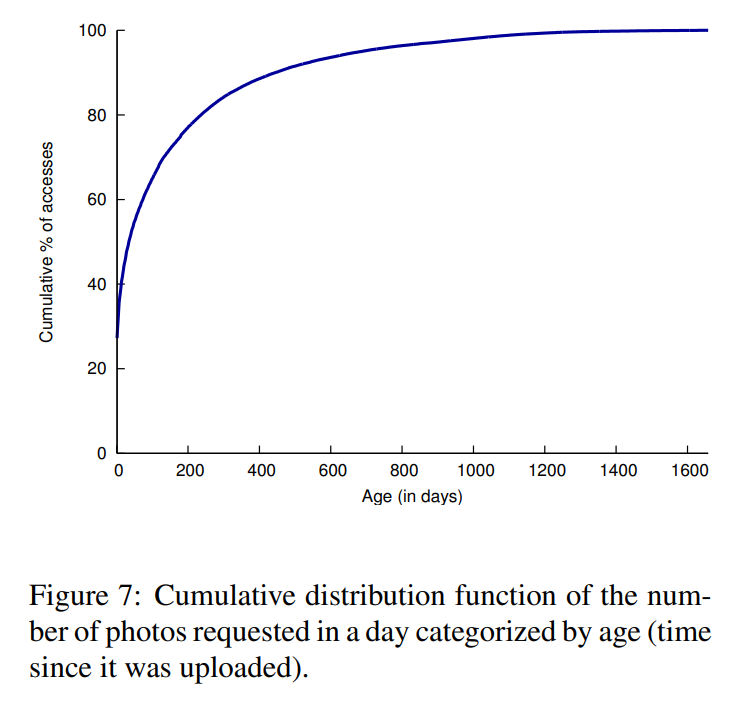

###  什么造成这样的负载

>Two features are responsible for 98% of Facebook’s photo requests: News Feed and albums. The News Feed feature shows users recent content that their friends have shared. The album feature lets a user browse her friends’ pictures. She can view recently uploaded photos and also browse all of the individual albums.

有两项功能占到了 Facebook 照片请求的 98%。News Feed 和 albums。News Feed 功能向用户显示他们的朋友最近分享的内容。albums 功能让用户浏览她朋友的照片。她可以查看最近上传的照片，也可以浏览所有的个人相册。

>Figure 7 shows a sharp rise in requests for photos that are a few days old. News Feed drives much of the traffic for recent photos and falls sharply away around 2 days when many stories stop being shown in the default Feed view. There are two key points to highlght from the figure. First, the rapid decline in popularity suggests that caching at both CDNs and in the Cache can be very effective for hosting popular content. Second, the graph has a long tail implying that a significant number of requests cannot be dealt with using cached data.

图 7 显示对几天前的照片的请求急剧上升。News Feed 引发了近期照片的大部分流量，并在 2 天左右急剧下降，因为许多故事不再显示在默认的 News Feed 中。从该图中可以看出两个关键点。首先，受欢迎程度的迅速下降表明，在 CDN 和高速缓存中的缓存对于托管受欢迎的内容非常有效。第二，该图有一个长尾巴，意味着大量的请求不能用缓存数据来处理。

### 数据量

>Table 3 shows the volume of photo traffic on Facebook. The number of Haystack photos written is 12 times the number of photos uploaded since our application scales each image to 4 sizes and saves each size in 3 different locations. The table shows that Haystack responds to approximately 10% of all photo requests from CDNs. Observe that smaller images account for most of the photos viewed. This trait underscores our desire to minimize metadata overhead as inefficiencies can quickly add up. Additionally, reading smaller images is typically a more latency sensitive operation for Facebook as they are displayed in the News Feed whereas larger images are shown in albums and can be prefetched to hide latency.

表 3 显示了 Facebook 上的照片流量。写入 Haystack 照片的数量是上传照片数量的 12 倍，因为我们的应用程序将每张图片缩放为 4 种尺寸，并将每种尺寸保存在 3 个不同的位置。该表显示，Haystack 响应了来自 CDN 的所有照片请求的大约 10%。观察一下，较小的图片占了大部分浏览的照片。这个特点强调了我们希望尽量减少元数据的开销，因为低效率会迅速增加。此外，对于 Facebook 来说，阅读较小的图片通常是一个对延迟更敏感的操作，因为它们显示在新闻提要中，而较大的图片则显示在相册中，可以通过预取来隐藏延迟。

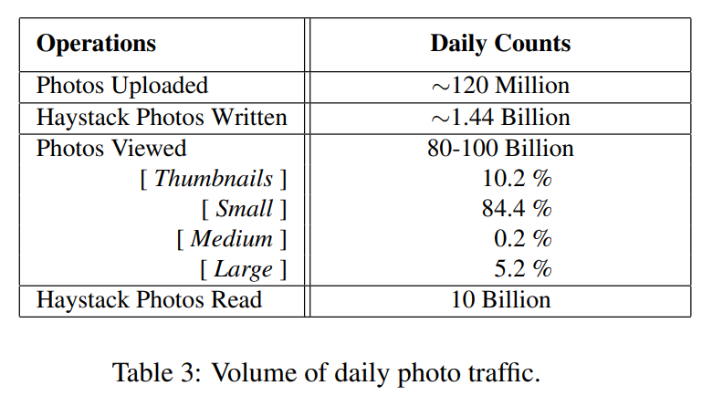

## Directory评估

>The Haystack Directory balances reads and writes across Haystack Store machines. Figure 8 depicts that as expected, the Directory’s straight-forward hashing policy to distribute reads and writes is very effective. The graph shows the number of multi-write operations seen by 9 different Store machines which were deployed into production at the same time. Each of these boxes store a different set of photos. Since the lines are nearly indistinguishable, we conclude that the Directory balances writes well. Comparing read traffic across Store machines shows similarly well-balanced behavior.

Haystack Directory 在 Haystack Store 的机器上平衡读和写。图 8 显示，正如预期的那样，Directory 的 straight-forward 散列策略分配读写是非常有效的。该图显示了同时部署到生产中的 9 台不同的存储机所看到的多写操作的数量。它们每一个都存储了一组不同的照片。由于这些线条几乎没有区别，我们得出结论，目录很好地平衡了写操作。比较不同存储机的读取流量也显示了类似的平衡行为。

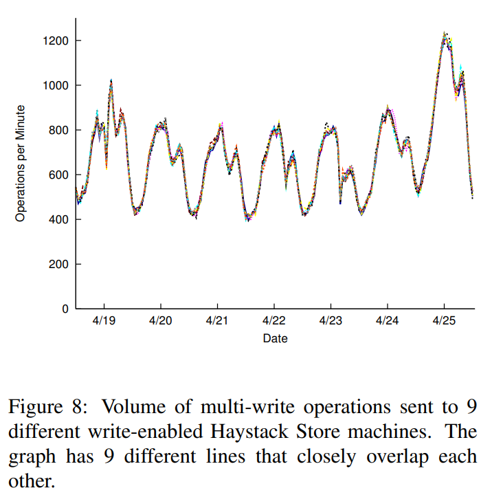

##  Cache评估

>Figure 9 shows the hit rate for the Haystack Cache. Recall that the Cache only stores a photo if it is saved on a write-enabled Store machine. These photos are relatively recent, which explains the high hit rates of approximately 80%. Since the write-enabled Store machines would also see the greatest number of reads, the Cache is effective in dramatically reducing the read request rate for the machines that would be most affected.

图 9 显示了 Haystack Cache 的命中率。回顾一下，只有当照片被保存在具有写入功能的存储机上时，缓存才会存储它。这些照片都是比较新的，这解释了大约 80% 的高命中率。由于启用了写入功能的存储设备也会看到最大数量的读取，缓存有效地减少了受影响最大的机器的读取请求率。

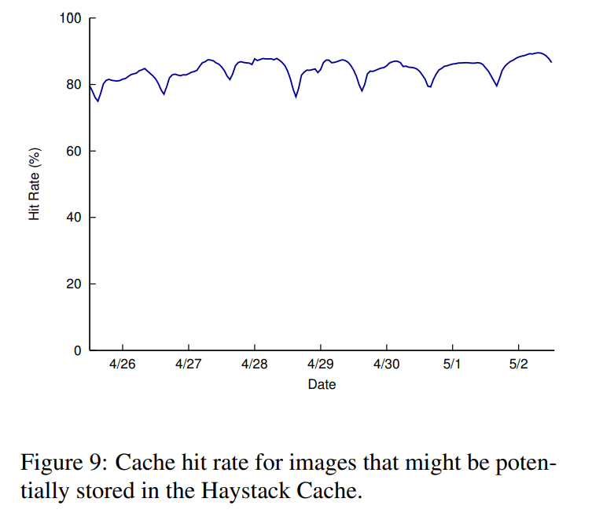

## Store评估

>Recall that Haystack targets the long tail of photo requests and aims to maintain high-throughput and lowlatency despite seemingly random reads. We present performance results of Store machines on both synthetic and production workloads.

回顾一下，Haystack 以照片请求的长尾为目标，旨在保持高吞吐量和低延迟，尽管看起来是随机读取。我们接下来展示 Store 机器在合成和生产工作负载上的性能结果。

### 实验设置

>We deploy Store machines on commodity storage blades. The typical hardware configuration of a 2U storage blade has 2 hyper-threaded quad-core Intel Xeon CPUs, 48 GB memory, a hardware raid controller with 256–512MB NVRAM, and 12 x 1TB SATA drives.

2U 刀片服务器，配置有 2 个超线程四核英特尔至强 CPU，48 GB 内存，一个带有 256-512 MB NVRAM 的硬件 raid 控制器，以及 12 个 1TB SATA 硬盘。

>Each storage blade provides approximately 9TB of capacity, configured as a RAID-6 partition managed by the hardware RAID controller. RAID-6 provides adequate redundancy and excellent read performance while keeping storage costs down. The controller’s NVRAM write-back cache mitigates RAID-6’s reduced write performance. Since our experience suggests that caching photos on Store machines is ineffective, we reserve the NVRAM fully for writes. We also disable disk caches in order to guarantee data consistency in the event of a crash or power loss.

每个存储刀片提供约 9 TB 的容量，配置 RAID-6。RAID-6 提供足够的冗余和出色的读取性能，同时降低了存储成本。控制器的 NVRAM 回写缓存缓解了 RAID-6 的写性能下降。由于我们的经验表明，在存储机器上缓存照片是无效的，我们将 NVRAM 完全保留给写。我们还禁用了磁盘缓存，以便在崩溃或断电的情况下保证数据的一致性。

### 基准性能

>We assess the performance of a Store machine using two benchmarks: Randomio [22] and Haystress. Randomio is an open-source multithreaded disk I/O program that we use to measure the raw capabilities of storage devices. It issues random 64KB reads that use direct I/O to make sector aligned requests and reports the maximum sustainable throughput. We use Randomio to establish a baseline for read throughput against which we can compare results from our other benchmark.

我们使用两个基准来评估 Store 机器的性能。Randomio[22]和 Haystress。Randomio 是一个开源的多线程磁盘 I/O 程序，我们用它来衡量存储设备的原始能力。它发出随机的 64KB 读取，使用直接 I/O 进行扇区对齐的请求，并报告最大的可持续吞吐量。我们使用 Randomio 来建立一个读取吞吐量的基线，我们可以对照它来比较我们其他基准的结果。

>Haystress is a custom built multi-threaded program that we use to evaluate Store machines for a variety of synthetic workloads. It communicates with a Store machine via HTTP (as the Cache would) and assesses the maximum read and write throughput a Store machine can maintain. Haystress issues random reads over a large set of dummy images to reduce the effect of the machine’s buffer cache; that is, nearly all reads require a disk operation. In this paper, we use seven different Haystress workloads to evaluate Store machines.

Haystress 是一个定制的多线程程序，我们用它来评估 Store 机器的各种合成工作负载。它通过 HTTP 与 Store 机器进行通信（就像 Cache 一样），并评估 Store 机器能够保持的最大读写吞吐量。Haystress 在一大组假图像上发出随机读取，以减少机器的缓冲区缓存的影响；也就是说，几乎所有的读取都需要磁盘操作。在本文中，我们使用七个不同的 Haystress 工作负载来评估存储机。

>Table 4 characterizes the read and write throughputs and associated latencies that a Store machine can sustain under our benchmarks. Workload A performs random reads to 64KB images on a Store machine with 201 volumes. The results show that Haystack delivers 85% of the raw throughput of the device while incurring only 17% higher latency.

表 4 描述了 Store 机器在我们的基准下所能承受的读写吞吐量和相关延迟。工作负载 A 在一台有 201 个卷的 Store 机器上对 64KB 的图像进行随机读取。结果显示，Haystack 提供了设备原始吞吐量的 85%，而产生的延迟只高出 17%。

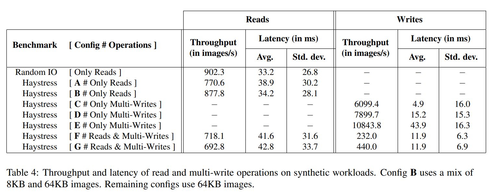

>We attribute a Store machine’s overhead to four factors: (a) it runs on top of the filesystem instead of accessing disk directly; (b) disk reads are larger than 64KB as entire needles need to be read; (c) stored images may not be aligned to the underlying RAID-6 device stripe size so a small percentage of images are read from more than one disk; and (d) CPU overhead of Haystack server (index access, checksum calculations, etc.)

我们将存储机的开销归结为四个因素。

(a) 它运行在文件系统之上，而不是直接访问磁盘；

(b) 磁盘读取量大于 64KB，因为需要读取整个 needle；

(c) 存储的图像可能没有与底层的 RAID-6 设备条带大小一致，所以有一小部分图像是从一个以上的磁盘读取的；

(d) Haystack服务器的 CPU 开销（索引访问、校验计算等）。

>In workload B, we again examine a read-only workload but alter 70% of the reads so that they request smaller size images (8KB instead of 64KB). In practice, we find that most requests are not for the largest size images (as would be shown in albums) but rather for the thumbnails and profile pictures.

在工作负载 B 中，我们再次检查了一个只读工作负载，但改变了 70% 的读取，使其请求更小的图片（8KB 而不是 64KB）。在实践中，我们发现大多数请求不是为了最大尺寸的图片（如相册中显示的那样），而是为了缩略图和个人资料图片。

>Workloads C, D, and E show a Store machine’s write throughput. Recall that Haystack can batch writes together. Workloads C, D, and E group 1, 4, and 16 writes into a single multi-write, respectively. The table shows that amortizing the fixed cost of writes over 4 and 16 images improves throughput by 30% and 78% respectively. As expected, this reduces per image latency, as well.

工作负载 C、D 和 E 显示了一个 Store 机器的写入吞吐量。回想一下，Haystack 可以批量写入。工作负载 C、D 和 E 分别将 1、4 和 16 次写入一个单一的多重写。表中显示，在 4 个和 16 个图像上摊销写入的固定成本，分别提高了 30% 和 78% 的吞吐量。正如预期的那样，这也减少了每个图像的延迟。

>Finally, we look at the performance in the presence of both read and write operations. Workload F uses a mix of 98% reads and 2% multi-writes while G uses a mix of 96% reads and 4% multi-writes where each multi-write writes 16 images. These ratios reflect what is often observed in production. The table shows that the Store delivers high read throughput even in the presence of writes.

最后，我们看一下同时存在读和写操作的性能。工作负载 F 使用了 98% 的读和 2% 的多写混合，而 G 使用了 96% 的读和 4% 的多写混合，其中每个多写写了 16 个图像。这些比例反映了生产中经常观察到的情况。该表显示，即使在有写的情况下，Store 也能提供高的读取吞吐量。

### 生产环境工作负载

>The section examines the performance of the Store on production machines. As noted in Section 3, there are two classes of Stores–write-enabled and read-only. Write-enabled hosts service read and write requests, read-only hosts only service read requests. Since these two classes have fairly different traffic characteristics, we analyze a group of machines in each class. All machines have the same hardware configuration.

>Viewed at a per-second granularity, there can be large spikes in the volume of photo read and write operations that a Store box sees. To ensure reasonable latency even in the presence of these spikes, we conservatively allocate a large number of write-enabled machines so that their average utilization is low.

>Figure 10 shows the frequency of the different types of operations on a read-only and a write-enabled Store machine. Note that we see peak photo uploads on Sunday and Monday, with a smooth drop the rest of the week until we level out on Thursday to Saturday. Then a new Sunday arrives and we hit a new weekly peak. In general our footprint grows by 0.2% to 0.5% per day.

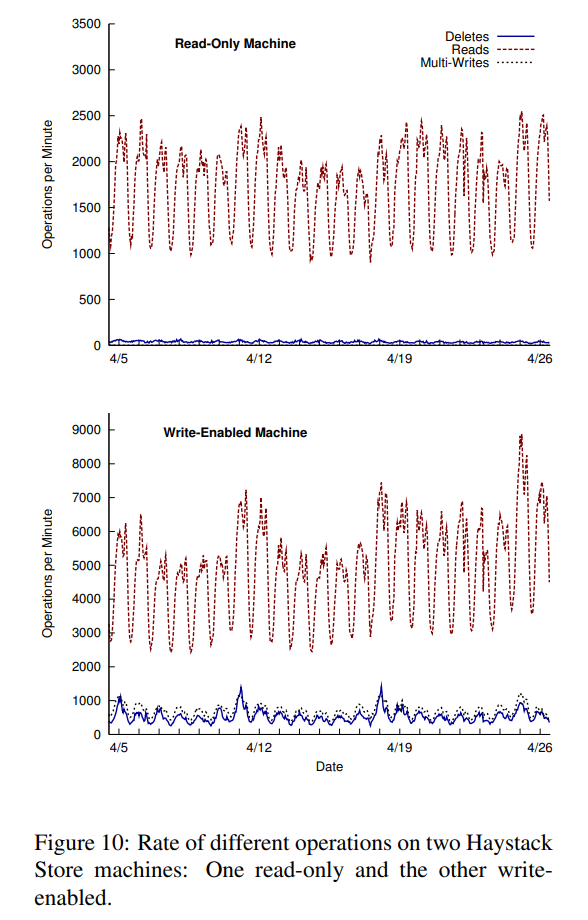

>As noted in Section 3, write operations to the Store are always multi-writes on production machines to amortize the fixed cost of write operations. Finding groups of images is fairly straightforward since 4 different sizes of each photo is stored in Haystack. It is also common for users to upload a batch of photos into a photo album. As a combination of these two factors, the average number of images written per multi-write for this write-enabled machine is 9.27.

>Section 4.1.2 explained that both read and delete rates are high for recently uploaded photos and drop over time. This behavior can be also be observed in Figure 10; the write-enabled boxes see many more requests (even though some of the read traffic is served by the Cache).

>Another trend worth noting: as more data gets written to write-enabled boxes the volume of photos increases, resulting in an increase in the read request rate.

>Figure 11 shows the latency of read and multi-write operations on the same two machines as Figure 10 over the same period.

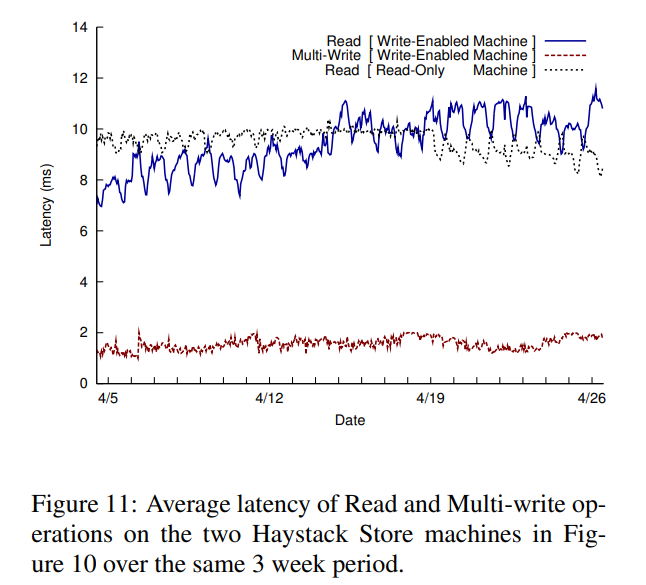

>The latency of multi-write operations is fairly low (between 1 and 2 milliseconds) and stable even as the volume of traffic varies dramatically. Haystack machines have a NVRAM-backed raid controller which buffers writes for us. As described in Section 3, the NVRAM allows us to write needles asynchronously and then issue a single fsync to flush the volume file once the multi-write is complete. Multi-write latencies are very flat and stable.

>The latency of reads on a read-only box is also fairly stable even as the volume of traffic varies significantly (up to 3x over the 3 week period). For a write-enabled box the read performance is impacted by three primary factors. First, as the number of photos stored on the machine increases, the read traffic to that machine also increases (compare week-over-week traffic in figure 10). Second, photos on write-enabled machines are cached in the Cache while they are not cached for a read-only machine3 . This suggests that the buffer cache would be more effective for a read-only machine. Third, recently written photos are usually read back immediately because Facebook highlights recent content. Such reads on Write-enabled boxes will always hit in the buffer cache and improve the hit rate of the buffer cache. The shape of the line in the figure is the result of a combination of these three factors.

>The CPU utilization on the Store machines is low. CPU idle time varies between 92-96%.

---

# 相关工作

>To our knowledge, Haystack targets a new design point focusing on the long tail of photo requests seen by a large social networking website.

据我们所知，Haystack 针对的是一个新的设计点，专注于一个大型社交网站所看到的照片请求的长尾。

>Filesystems 
>
>Haystack takes after log-structured filesystems [23] which Rosenblum and Ousterhout designed to optimize write throughput with the idea that most reads could be served out of cache. While measurements [3] and simulations [6] have shown that logstructured filesystems have not reached their full potential in local filesystems, the core ideas are very relevant to Haystack. Photos are appended to physical volume files in the Haystack Store and the Haystack Cache shelters write-enabled machines from being overwhelmed by the request rate for recently uploaded data. The key differences are (a) that the Haystack Store machines write their data in such a way that they can efficiently serve reads once they become read-only and (b) the read request rate for older data decreases over time.

Haystack 借鉴了 Rosenblum 和 Ousterhout 设计的日志结构文件系统[23]，该系统旨在优化写的吞吐量，认为大多数读可以从缓存中提供。虽然测量[3]和模拟[6]表明，日志结构文件系统在本地文件系统中没有达到其全部潜力，但其核心思想与 Haystack 非常相关。照片被附加到 Haystack 存储的物理卷文件中，而 Haystack 缓存则庇护具有写功能的机器，使其不被最近上传数据的请求率所淹没。关键的区别在于：（a）Haystack存储的机器写数据的方式，一旦变成只读，它们就可以有效地提供读取服务；（b）旧数据的读取请求率随着时间的推移而降低。

>Several works [8, 19, 28] have proposed how to manage small files and metadata more efficiently. The common thread across these contributions is how to group related files and metadata together intelligently. Haystack obviates these problems since it maintains metadata in main memory and users often upload related photos in bulk.

一些工作[8, 19, 28]提出了如何更有效地管理小文件和元数据。这些贡献的共同点是如何将相关文件和元数据智能地组合在一起。Haystack 避免了这些问题，因为它在主内存中维护元数据，而用户经常批量上传相关照片。

>Object-based storage 
>
>Haystack’s architecture shares many similarities with object storage systems proposed by Gibson et al. [10] in Network-Attached Secure Disks (NASD). The Haystack Directory and Store are perhaps most similar to the File and Storage Manager concepts, respectively, in NASD that separate the logical storage units from the physical ones. In OBFS [25], Wang et al. build a user-level object-based filesystem that is 1 25th the size of XFS. Although OBFS achieves greater write throughput than XFS, its read throughput (Haystack’s main concern) is slightly worse.

Haystack 的架构与 Gibson 等人[10]在网络连接的安全磁盘（NASD）中提出的对象存储系统有很多相似之处。Haystack Directory 和 Store 也许与 NASD 中的文件和存储管理器概念最为相似，它们分别将逻辑存储单元与物理存储单元分开。在 OBFS[25]中，Wang 等人建立了一个用户级的基于对象的文件系统，其大小是 XFS 的1/25。虽然 OBFS 实现了比 XFS 更大的写入吞吐量，但它的读取吞吐量（Haystack 的主要关注点）却略差。

>Managing metadata 
>
>Weil et al. [26, 27] address scaling metadata management in Ceph, a petabyte-scale object store. Ceph further decouples the mapping from logical units to physical ones by introducing generating functions instead of explicit mappings. Clients can calculate the appropriate metadata rather than look it up. Implementing this technique in Haystack remains future work. Hendricks et. al [13] observe that traditional metadata pre-fetching algorithms are less effective for object stores because related objects, which are identified by a unique number, lack the semantic groupings that directories implicitly impose. Their solution is to embed inter-object relationships into the object id. This idea is orthogonal to Haystack as Facebook explicitly stores these semantic relationships as part of the social graph. In Spyglass [15], Leung et al. propose a design for quickly and scalably searching through metadata of large-scale storage systems. Manber and Wu also propose a way to search through entire filesystems in GLIMPSE [17]. Patil et al. [20] use a sophisticated algorithm in GIGA+ to manage the metadata associated with billions of files per directory. We engineered a simpler solution than many existing works as Haystack does not have to provide search features nor traditional UNIX filesystem semantics.

Weil 等人[26, 27]讨论了 Ceph 中的元数据管理，这是一个 PB 级的对象存储。Ceph 通过引入生成函数而不是显式映射，进一步解耦了从逻辑单元到物理单元的映射。客户端可以计算出适当的元数据，而不是去查找它。在 Haystack 中实现这一技术仍然是未来的工作。Hendricks 等人[13]观察到，传统的元数据预取算法对于对象存储来说不太有效，因为相关的对象由一个唯一的数字来识别，缺乏目录隐含的语义分组。他们的解决方案是将对象间的关系嵌入到对象 ID 中。这个想法与 Haystack 是正交的，因为 Facebook 明确地将这些语义关系作为社交图的一部分来存储。在 Spyglass[15]中，Leung 等人提出了一种通过大规模存储系统的元数据进行快速和可扩展搜索的设计。Manber 和 Wu 也在 GLIMPSE[17]中提出了一种搜索整个文件系统的方法。Patil 等人[20]在 GIGA+ 中使用了一种复杂的算法来管理与每个目录的数十亿个文件相关的元数据。我们设计了一个比许多现有作品更简单的解决方案，因为 Haystack 不需要提供搜索功能，也不需要传统的 UNIX 文件系统语义。

>Distributed filesystems 
>
>Haystack’s notion of a logical volume is similar to Lee and Thekkath’s [14] virtual disks in Petal. The Boxwood project [16] explores using high-level data structures as the foundation for storage. While compelling for more complicated algorithms, abstractions like B-trees may not have high impact on Haystack’s intentionally lean interface and semantics. Similarly, Sinfonia’s [1] mini-transactions and PNUTS’s [5] database functionality provide more features and stronger guarantees than Haystack needs. Ghemawat et al. [9] designed the Google File System for a workload consisting mostly of append operations and large sequential reads. Bigtable [4] provides a storage system for structured data and offers database-like features for many of Google’s projects. It is unclear whether many of these features make sense in a system optimized for photo storage.

Haystack 的逻辑卷的概念与 Lee 和 Thekkath[14]在 Petal 中的虚拟磁盘相似。Boxwood 项目[16]探讨了使用高级数据结构作为存储的基础。虽然对于更复杂的算法来说很有说服力，但像 B 树这样的抽象可能对 Haystack 有意精简的界面和语义影响不大。同样，Sinfonia[1]的迷你交易和 PNUTS[5]的数据库功能提供了比 Haystack 需要的更多功能和更强的保证。Ghemawat 等人[9]设计的 Google 文件系统的工作负载主要包括追加操作和大的连续读取。Bigtable[4]为结构化数据提供了一个存储系统，并为谷歌的许多项目提供类似数据库的功能。目前还不清楚其中的许多功能在为照片存储优化的系统中是否有意义。

---

# 总结

>This paper describes Haystack, an object storage system designed for Facebook’s Photos application. We designed Haystack to serve the long tail of requests seen by sharing photos in a large social network. The key insight is to avoid disk operations when accessing metadata. Haystack provides a fault-tolerant and simple solution to photo storage at dramatically less cost and higher throughput than a traditional approach using NAS appliances. Furthermore, Haystack is incrementally scalable, a necessary quality as our users upload hundreds of millions of photos each week.

本文介绍了 Haystack，一个为 Facebook 的照片应用程序设计的对象存储系统。我们设计 Haystack 是为了服务于在大型社交网络中分享照片时出现的长尾请求。关键是在访问元数据时避免磁盘操作。Haystack 提供了一个容错和简单的照片存储解决方案，与使用 NAS 设备的传统方法相比，成本大大降低，吞吐量也更高。此外，Haystack 是可逐步扩展的，这是一个必要的品质，因为我们的用户每周都会上传数以亿计的照片。

---

# 参考文献

[1] M. K. Aguilera, A. Merchant, M. Shah, A. Veitch, and C. Karamanolis. Sinfonia: a new paradigm for building scalable distributed systems. In SOSP ’07: Proceedings of twenty-first ACM SIGOPS symposium on Operating systems principles, pages 159–174, New York, NY, USA, 2007. ACM. 

[2] Akamai. http://www.akamai.com/. 

[3] M. G. Baker, J. H. Hartman, M. D. Kupfer, K. W. Shirriff, and J. K. Ousterhout. Measurements of a distributed file system. In Proc. 13th SOSP, pages 198–212, 1991. 

[4] F. Chang, J. Dean, S. Ghemawat, W. C. Hsieh, D. A. Wallach, M. Burrows, T. Chandra, A. Fikes, and R. E. Gruber. Bigtable: A distributed storage system for structured data. ACM Trans. Comput. Syst., 26(2):1–26, 2008. 

[5] B. F. Cooper, R. Ramakrishnan, U. Srivastava, A. Silberstein, P. Bohannon, H.-A. Jacobsen, N. Puz, D. Weaver, and R. Yerneni. Pnuts: Yahoo!’s hosted data serving platform. Proc. VLDB Endow., 1(2):1277–1288, 2008. 

[6] M. Dahlin, R. Wang, T. Anderson, and D. Patterson. Cooperative Caching: Using Remote Client Memory to Improve File System Performance. In Proceedings of the First Symposium on Operating Systems Design and Implementation, pages 267–280, Nov 1994. 

[7] M. Factor, K. Meth, D. Naor, O. Rodeh, and J. Satran. Object storage: the future building block for storage systems. In LGDI ’05: Proceedings of the 2005 IEEE International Symposium on Mass Storage Systems and Technology, pages 119–123, Washington, DC, USA, 2005. IEEE Computer Society. 

[8] G. R. Ganger and M. F. Kaashoek. Embedded inodes and explicit grouping: exploiting disk bandwidth for small files. In ATEC ’97: Proceedings of the annual conference on USENIX Annual Technical Conference, pages 1–1, Berkeley, CA, USA, 1997. USENIX Association. 

[9] S. Ghemawat, H. Gobioff, and S.-T. Leung. The google file system. In Proc. 19th SOSP, pages 29–43. ACM Press, 2003. 

[10] G. A. Gibson, D. F. Nagle, K. Amiri, J. Butler, F. W. Chang, H. Gobioff, C. Hardin, E. Riedel, D. Rochberg, and J. Zelenka. A cost-effective, high-bandwidth storage architecture. SIGOPS Oper. Syst. Rev., 32(5):92–103, 1998. 

[11] The hadoop project. http://hadoop.apache.org/. 

[12] S. He and D. Feng. Design of an object-based storage device based on i/o processor. SIGOPS Oper. Syst. Rev., 42(6):30–35, 2008. 

[13] J. Hendricks, R. R. Sambasivan, S. Sinnamohideen, and G. R. Ganger. Improving small file performance in object-based storage. Technical Report 06-104, Parallel Data Laboratory, Carnegie Mellon University, 2006. 

[14] E. K. Lee and C. A. Thekkath. Petal: distributed virtual disks. In ASPLOS-VII: Proceedings of the seventh international conference on Architectural support for programming languages and operating systems, pages 84–92, New York, NY, USA, 1996. ACM. 

[15] A. W. Leung, M. Shao, T. Bisson, S. Pasupathy, and E. L. Miller. Spyglass: fast, scalable metadata search for large-scale storage systems. In FAST ’09: Proccedings of the 7th conference on File and storage technologies, pages 153–166, Berkeley, CA, USA, 2009. USENIX Association. 

[16] J. MacCormick, N. Murphy, M. Najork, C. A. Thekkath, and L. Zhou. Boxwood: abstractions as the foundation for storage infrastructure. In OSDI’04: Proceedings of the 6th conference on Symposium on Opearting Systems Design & Implementation, pages 8–8, Berkeley, CA, USA, 2004. USENIX Association. 

[17] U. Manber and S. Wu. Glimpse: a tool to search through entire file systems. In WTEC’94: Proceedings of the USENIX Winter 1994 Technical Conference on USENIX Winter 1994 Technical Conference, pages 4–4, Berkeley, CA, USA, 1994. USENIX Association. 

[18] memcache. http://memcached.org/. 

[19] S. J. Mullender and A. S. Tanenbaum. Immediate files. Softw. Pract. Exper., 14(4):365–368, 1984. 

[20] S. V. Patil, G. A. Gibson, S. Lang, and M. Polte. Giga+: scalable directories for shared file systems. In PDSW ’07: Proceedings of the 2nd international workshop on Petascale data storage, pages 26–29, New York, NY, USA, 2007. ACM. 

[21] Posix. http://standards.ieee.org/regauth/posix/. 

[22] Randomio. http://members.optusnet.com.au/clausen/ideas/randomio/index.html. 

[23] M. Rosenblum and J. K. Ousterhout. The design and implementation of a log-structured file system. ACM Trans. Comput. Syst., 10(1):26–52, 1992. 

[24] A. Sweeney, D. Doucette, W. Hu, C. Anderson, M. Nishimoto, and G. Peck. Scalability in the xfs file system. In ATEC ’96: Proceedings of the 1996 annual conference on USENIX Annual Technical Conference, pages 1–1, Berkeley, CA, USA, 1996. USENIX Association. 

[25] F. Wang, S. A. Brandt, E. L. Miller, and D. D. E. Long. Obfs: A file system for object-based storage devices. In In Proceedings of the 21st IEEE / 12TH NASA Goddard Conference on Mass Storage Systems and Technologies, pages 283–300, 2004. 

[26] S. A. Weil, S. A. Brandt, E. L. Miller, D. D. E. Long, and C. Maltzahn. Ceph: a scalable, high-performance distributed file system. In OSDI ’06: Proceedings of the 7th symposium on Operating systems design and implementation, pages 307–320, Berkeley, CA, USA, 2006. USENIX Association. 

[27] S. A. Weil, K. T. Pollack, S. A. Brandt, and E. L. Miller. Dynamic metadata management for petabyte-scale file systems. In SC ’04: Proceedings of the 2004 ACM/IEEE conference on Supercomputing, page 4, Washington, DC, USA, 2004. IEEE Computer Society. 

[28] Z. Zhang and K. Ghose. hfs: a hybrid file system prototype for improving small file and metadata performance. SIGOPS Oper. Syst. Rev., 41(3):175–187, 2007.

