Raft 论文导读：[In Search of an Understandable Consensus Algorithm (Extended Version)](https://pdos.csail.mit.edu/6.824/papers/raft-extended.pdf)

Raft 是共识算法，但很多地方也会将它和一致性进行混淆，共识只是说大家达成了共识，但是最后机器状态是否真的一致还需要做别的操作和优化，希望读者能够区分。

---

摘要

>Raft is a consensus algorithm for managing a replicated log. It produces a result equivalent to (multi-)Paxos, and it is as efficient as Paxos, but its structure is different from Paxos; this makes Raft more understandable than Paxos and also provides a better foundation for building practical systems. In order to enhance understandability, Raft separates the key elements of consensus, such as leader election, log replication, and safety, and it enforces a stronger degree of coherency to reduce the number of states that must be considered. Results from a user study demonstrate that Raft is easier for students to learn than Paxos. Raft also includes a new mechanism for changing the cluster membership, which uses overlapping majorities to guarantee safety.

Raft 是一种基于日志复制的共识算法。Raft 的结果等价于 (multi-)Paxos 并且和 Paxos 一样的有效，但却和 Paxos 的结构完全不同。正是 Raft 不同于 Paxos 的结构使得 Raft 更容易理解，并且更易于工程实现。Raft 通过将共识关键点进行拆解，包含选主、日志复制和安全三部分，另外通过减少状态机的状态使得 Raft 更容易理解。一项用户研究的结果表明，对于学生而言，Raft 算法比 Paxos 算法更加容易学习。Raft 算法还包括一个新的机制来允许集群成员的动态改变，它利用重叠的大多数来保证安全性。


---

# 简介

>Consensus algorithms allow a collection of machines to work as a coherent group that can survive the failures of some of its members. Because of this, they play a key role in building reliable large-scale software systems. Paxos [15, 16] has dominated the discussion of consensus algorithms over the last decade: most implementations of consensus are based on Paxos or influenced by it, and Paxos has become the primary vehicle used to teach students about consensus.

共识算法可以使得若干机器像一个一致集群一样的工作，即使在集群成员变更或者宕机的情况下，整个集群仍然可以正常工作。正因为如此共识算法在大规模分布式系统中扮演着至关重要的角色。过去的十年，Paxos 统治了整个共识算法。大多数共识算法的实现都是基于 Paxos 或者受到 Paxos 的影响，同时共识算法课程大多也是讲授 Paxos。 

>Unfortunately, Paxos is quite difficult to understand, in spite of numerous attempts to make it more approachable. Furthermore, its architecture requires complex changes to support practical systems. As a result, both system builders and students struggle with Paxos.

不幸的是，Paxos 晦涩难懂，尽管很多人努力尝试让 Paxos 更容易理解。除此之外，在实际系统中，实现者必须根据系统作出大量的调整。因此工业界和学术界都对 Paxos 算法感到十分头疼。

>After struggling with Paxos ourselves, we set out to find a new consensus algorithm that could provide a better foundation for system building and education. Our approach was unusual in that our primary goal was understandability: could we define a consensus algorithm for practical systems and describe it in a way that is significantly easier to learn than Paxos? Furthermore, we wanted the algorithm to facilitate the development of intuitions that are essential for system builders. It was important not just for the algorithm to work, but for it to be obvious why it works.

努力研究过 Paxos 算法之后，我们开始寻找一种新的共识算法，可以为构建实际的系统和教学提供更好的基础。与 Paxos 不同，我们的首要目标是可理解性：我们是否可以在实际系统中定义一个共识算法，并且比 Paxos 算法更容易学习。此外，我们希望该算法方便系统构建者的直觉的发展。重要的不仅仅是算法能够工作，更重要的是能够很清楚地知道它为什么能工作。

>The result of this work is a consensus algorithm called Raft. In designing Raft we applied specific techniques to improve understandability, including decomposition (Raft separates leader election, log replication, and safety) and This tech report is an extended version of [32]; additional material is noted with a gray bar in the margin. Published May 20, 2014. state space reduction (relative to Paxos, Raft reduces the degree of nondeterminism and the ways servers can be inconsistent with each other). A user study with 43 students at two universities shows that Raft is significantly easier to understand than Paxos: after learning both algorithms, 33 of these students were able to answer questions about Raft better than questions about Paxos.

Raft 共识算法就是这些工作的结果。在设计 Raft 算法的时候，我们使用一些特别的技巧来提升它的可理解性，包括算法分解（Raft 主要被分成了领导者选举，日志复制和安全三个模块）和减少状态机的状态（相对于 Paxos，Raft 减少了非确定性和服务器互相处于非一致性的方式）。一份针对两所大学 43 个学生的研究表明 Raft 明显比 Paxos 算法更加容易理解。在这些学生同时学习了这两种算法之后，和 Paxos 比起来，其中 33 个学生能够回答有关于 Raft 的问题。

>Raft is similar in many ways to existing consensus algorithms (most notably, Oki and Liskov’s Viewstamped Replication [29, 22]), but it has several novel features: 
>
>• Strong leader: Raft uses a stronger form of leadership than other consensus algorithms. For example, log entries only flow from the leader to other servers. This simplifies the management of the replicated log and makes Raft easier to understand. 
>
>• Leader election: Raft uses randomized timers to elect leaders. This adds only a small amount of mechanism to the heartbeats already required for any consensus algorithm, while resolving conflicts simply and rapidly. 
>
>• Membership changes: Raft’s mechanism for changing the set of servers in the cluster uses a new joint consensus approach where the majorities of two different configurations overlap during transitions. This allows the cluster to continue operating normally during configuration changes.

Raft 算法在许多方面和现有的共识算法都很相似（主要是 Oki 和 Liskov 的 Viewstamped Replication），但是它也有一些独特的特性：

-   Strong leader：和其他共识算法相比，Raft 使用了一种比其它一致性算法更强的 leader。比如，日志条目只从领导者发送给其他的服务器。这种方式简化了对复制日志的管理并且使得 Raft 算法更加易于理解。
-    Leader election：Raft 算法使用一个随机计时器来选举领导者。这种方式只是在任何共识算法都必须实现的心跳机制上增加了一点机制。在解决冲突的时候会更加简单快捷。
-   Membership changes： Raft 使用一种共同一致的方法来处理集群成员变换的问题，在这种方法下，处于调整过程中的两种不同的配置集群中大多数机器会有重叠，这就使得集群在成员变换的时候依然可以继续工作。

>We believe that Raft is superior to Paxos and other consensus algorithms, both for educational purposes and as a foundation for implementation. It is simpler and more understandable than other algorithms; it is described completely enough to meet the needs of a practical system; it has several open-source implementations and is used by several companies; its safety properties have been formally specified and proven; and its efficiency is comparable to other algorithms.

我们相信，Raft 算法不论出于教学目的还是作为实践项目的基础都是要比 Paxos 或者其他共识算法要优异的。它比其他算法更加简单，更加容易理解；它的算法描述足以实现一个现实的系统；它有好多开源的实现并且在很多公司里使用；它的安全特性已经被正式定义和证明；它的效率和其他算法比起来也不相上下。

>The remainder of the paper introduces the replicated state machine problem (Section 2), discusses the strengths and weaknesses of Paxos (Section 3), describes our general approach to understandability (Section 4), presents the Raft consensus algorithm (Sections 5–8), evaluates Raft (Section 9), and discusses related work (Section 10).

接下来，这篇论文会介绍以下内容：复制状态机问题（第 2 节），讨论 Paxos 的优点和缺点（第 3 节），讨论我们为了可理解性而采取的方法（第 4 节），阐述 Raft 共识算法（第 5-8 节），评价 Raft 算法（第 9 节），以及一些相关的工作（第 10 节）。


---

# 复制状态机

>Consensus algorithms typically arise in the context of replicated state machines [37]. In this approach, state machines on a collection of servers compute identical copies of the same state and can continue operating even if some of the servers are down. Replicated state machines are used to solve a variety of fault tolerance problems in distributed systems. For example, large-scale systems that have a single cluster leader, such as GFS [8], HDFS [38], and RAMCloud [33], typically use a separate replicated state machine to manage leader election and store configuration information that must survive leader crashes. Examples of replicated state machines include Chubby [2] and ZooKeeper [11].

共识算法是从复制状态机的背景下提出的。在这种方法中，一组服务器上的状态机产生相同状态的副本，并且在一些机器宕掉的情况下也可以继续运行。复制状态机在分布式系统中被用于解决很多容错的问题。例如，大规模的系统中通常都有一个集群领导者，像 GFS、HDFS 和 RAMCloud，典型应用就是一个独立的复制状态机去管理领导选举和存储配置信息并且在领导者宕机的情况下也要存活下来。比如 Chubby 和 ZooKeeper。 

>Replicated state machines are typically implemented using a replicated log, as shown in Figure 1. Each server stores a log containing a series of commands, which its state machine executes in order. Each log contains the same commands in the same order, so each state machine processes the same sequence of commands. Since the state machines are deterministic, each computes the same state and the same sequence of outputs.

复制状态机通常都是基于复制日志实现的，如图 1。每一个服务器存储一个包含一系列指令的日志，并且按照日志的顺序进行执行。每一个日志都按照相同的顺序包含相同的指令，所以每一个服务器都执行相同的指令序列。因为每个状态机都是确定的，每一次执行操作都产生相同的状态和同样的序列。

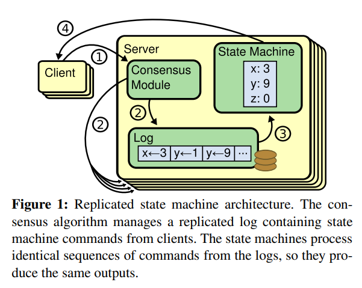

>Keeping the replicated log consistent is the job of the consensus algorithm. The consensus module on a server receives commands from clients and adds them to its log. It communicates with the consensus modules on other servers to ensure that every log eventually contains the same requests in the same order, even if some servers fail. Once commands are properly replicated, each server’s state machine processes them in log order, and the outputs are returned to clients. As a result, the servers appear to form a single, highly reliable state machine.

共识算法的工作就是保证各个状态机一致。机器上的共识模块接受到来自客户端的命令，并把命令追加到自己的日志中。然后和其它机器上的共识模块进行通信来保证最终所有机器都按相同的顺序存储了请求，即使其中的一些机器宕机不能工作。一旦命令被正确的复制，每个机器都按照日志顺序将命令执行到状态机，然后将输出返回给客户端。最终，所有的机器呈现一个高度可靠的状态机。 

>Consensus algorithms for practical systems typically have the following properties:
>
>• They ensure safety (never returning an incorrect result) under all non-Byzantine conditions, including network delays, partitions, and packet loss, duplication, and reordering. • They are fully functional (available) as long as any majority of the servers are operational and can communicate with each other and with clients. Thus, a typical cluster of five servers can tolerate the failure of any two servers. Servers are assumed to fail by stopping; they may later recover from state on stable storage and rejoin the cluster. 
>
>• They do not depend on timing to ensure the consistency of the logs: faulty clocks and extreme message delays can, at worst, cause availability problems. 
>
>• In the common case, a command can complete as soon as a majority of the cluster has responded to a single round of remote procedure calls; a minority of slow servers need not impact overall system performance.

实际系统的共识算法具有一下的特性：

-   安全性保证（绝对不会返回一个错误的结果）：在非拜占庭错误情况下，包括网络延迟、分区、丢包、重复和乱序等错误都可以保证正确。
-   可用性：集群中只要有大多数的机器可运行并且能够相互通信、和客户端通信，就可以保证可用。因此，一个典型的包含 5 个节点的集群可以容忍两个节点的失败。服务器被停止就认为是失败。它们稍后可能会从可靠存储的状态中恢复并重新加入集群。
-   不依赖时序来保证一致性：物理时钟错误或者极端的消息延迟只有在最坏情况下才会导致可用性问题。
-   通常情况下，一条指令可以尽可能快的在集群中大多数节点响应一轮远程过程调用时完成。小部分比较慢的节点不会影响系统整体的性能。


---

# Paxos 的问题

>Over the last ten years, Leslie Lamport’s Paxos protocol [15] has become almost synonymous with consensus: it is the protocol most commonly taught in courses, and most implementations of consensus use it as a starting point. Paxos first defines a protocol capable of reaching agreement on a single decision, such as a single replicated log entry. We refer to this subset as single-decree Paxos. Paxos then combines multiple instances of this protocol to facilitate a series of decisions such as a log (multi-Paxos). Paxos ensures both safety and liveness, and it supports changes in cluster membership. Its correctness has been proven, and it is efficient in the normal case.

在过去的十年里，Leslie Lamport 的 Paxos 算法[15]几乎成了共识的代名词：它是课程中最常教授的协议，大多数共识的实现都以它为起点。Paxos 首先定义了一个能够在单一决策上达成协议的协议，例如单一复制的日志条目。我们把这个子集称为 single-decree Paxos。然后，Paxos 通过一系列单次一致的实例来达到对一系列的提议达成一致，这被称作 multi-Paxos。Paxos 既保证了安全性，又保证了有效性，而且它支持集群成员的变化。它的正确性已被证明，而且在正常情况下是有效的。

>Unfortunately, Paxos has two significant drawbacks. The first drawback is that Paxos is exceptionally difficult to understand. The full explanation [15] is notoriously opaque; few people succeed in understanding it, and only with great effort. As a result, there have been several attempts to explain Paxos in simpler terms [16, 20, 21]. These explanations focus on the single-decree subset, yet they are still challenging. In an informal survey of attendees at NSDI 2012, we found few people who were comfortable with Paxos, even among seasoned researchers. We struggled with Paxos ourselves; we were not able to understand the complete protocol until after reading several simplified explanations and designing our own alternative protocol, a process that took almost a year.

不幸的是，Paxos 有个显著的缺点。第一个缺点就是 Paxos 晦涩难懂。很多人投入大量的精力，但是只有很少的人真正的理解 Paxos。已经有很多学者尝试以更容易理解的方式解释 Paxos。这些解释都是集中在 single-decree Paxos，但是仍然存在很大的挑战。在对 NSDI 2012 的与会者进行的非正式调查中，我们发现很少有人对 Paxos 感到满意，即使在经验丰富的研究人员中。我们自己也在为 Paxos 挣扎；直到读了很多对 Paxos 的简化解释和设计了我们自己的替代协议之后，我们才能够理解完整的协议，这个过程几乎花了一年时间。

>We hypothesize that Paxos’ opaqueness derives from its choice of the single-decree subset as its foundation. Single-decree Paxos is dense and subtle: it is divided into two stages that do not have simple intuitive explanations and cannot be understood independently. Because of this, it is difficult to develop intuitions about why the singledecree protocol works. The composition rules for multiPaxos add significant additional complexity and subtlety. We believe that the overall problem of reaching consensus on multiple decisions (i.e., a log instead of a single entry) can be decomposed in other ways that are more direct and obvious.

我们认为 Paxos 晦涩难懂的原因是因为 Paxos 选择了 single-decree Paxos 作为基本的子问题导致的。single-decree Paxos 是紧凑且精巧的，它分为两个阶段，没有简单的直观解释，不能被独立理解。正因为如此，很难形成 single-decree Paxos 为什么可以正常工作的直觉。multi-Paxos 更是增加了额外的复杂度和微妙性。我们认为，就多个决定达成共识的整体问题（即一个日志而不是一个条目）可以用其他更直接和明显的方式进行分解。

>The second problem with Paxos is that it does not provide a good foundation for building practical implementations. One reason is that there is no widely agreedupon algorithm for multi-Paxos. Lamport’s descriptions are mostly about single-decree Paxos; he sketched possible approaches to multi-Paxos, but many details are missing. There have been several attempts to flesh out and optimize Paxos, such as [26], [39], and [13], but these differ from each other and from Lamport’s sketches. Systems such as Chubby [4] have implemented Paxos-like algorithms, but in most cases their details have not been published.

Paxos 存在第二个问题是它不能简单的转化为工程实现，一方面是大家没有对 multi-Paxos 算法达成一致。Lamport 大神只是详细的描述了 single-decree Paxos，但是很多细节还是缺失的。还存在很多基于 Paxos 的变种和分支。Chubby 是基于 Paxos 进行实现的，但是它们的实现细节并没有公开。 

>Furthermore, the Paxos architecture is a poor one for building practical systems; this is another consequence of the single-decree decomposition. For example, there is little benefit to choosing a collection of log entries independently and then melding them into a sequential log; this just adds complexity. It is simpler and more efficient to design a system around a log, where new entries are appended sequentially in a constrained order. Another problem is that Paxos uses a symmetric peer-to-peer approach at its core (though it eventually suggests a weak form of leadership as a performance optimization). This makes sense in a simplified world where only one decision will be made, but few practical systems use this approach. If a series of decisions must be made, it is simpler and faster to first elect a leader, then have the leader coordinate the decisions.

而且，Paxos 算法的结构也不是十分易于构建实践的系统；单决策分解也会产生其他的结果。例如，独立地选择一组日志条目然后合并成一个序列化的日志并没有带来太多的好处，仅仅增加了不少复杂性。围绕着日志来设计一个系统是更加简单高效的；新日志条目以严格限制的顺序增添到日志中去。另一个问题是，Paxos 采用了对称的点对点通信的方法作为它的核心（尽管是出于一种基于弱领导的性能优化）。上面的优化仅仅对于单次决定是有意义的，但是实际系统很少采用这种方法。如果有一些的提议需要被决定，首先选举出一个 leader然后由 leader 进行协调，这样是更为简单和快速的。 

>As a result, practical systems bear little resemblance to Paxos. Each implementation begins with Paxos, discovers the difficulties in implementing it, and then develops a significantly different architecture. This is timeconsuming and error-prone, and the difficulties of understanding Paxos exacerbate the problem. Paxos’ formulation may be a good one for proving theorems about its correctness, but real implementations are so different from Paxos that the proofs have little value. The following comment from the Chubby implementers is typical:
>
>There are significant gaps between the description of the Paxos algorithm and the needs of a real-world system. . . . the final system will be based on an unproven protocol [4].

现实中的系统仅有很少和 Paxos 中描述的系统相似。每个实际系统都是从 Paxos 开始，发现实现中有很多不能解决的难题，然后提出一个新的结构并实现。这是耗时且容易犯错的，然后 Paxos 的晦涩难懂进一步使情况恶化。Paxos 的范式可能是一种证明一致性理论的好方法，但是实际的实现中 Paxos 不具备很大的价值。下面来自 Chubby 开发者的评论更正说明这一点：在 Paxos 算法描述和实现现实系统中间有着巨大的鸿沟。最终的系统建立在一种没有经过证明的算法之上。

>Because of these problems, we concluded that Paxos does not provide a good foundation either for system building or for education. Given the importance of consensus in large-scale software systems, we decided to see if we could design an alternative consensus algorithm with better properties than Paxos. Raft is the result of that experiment.

由于以上问题，我们认为 Paxos 算法既没有提供一个良好的基础给实践的系统，也没有给教学很好的帮助。基于共识问题在大规模软件系统中的重要性，我们决定看看我们是否可以设计一个拥有更好特性的替代 Paxos 的共识算法。Raft 算法就是这次实验的结果。


---

# 为了可理解性的设计

>We had several goals in designing Raft: it must provide a complete and practical foundation for system building, so that it significantly reduces the amount of design work required of developers; it must be safe under all conditions and available under typical operating conditions; and it must be efficient for common operations. But our most important goal—and most difficult challenge—was understandability. It must be possible for a large audience to understand the algorithm comfortably. In addition, it must be possible to develop intuitions about the algorithm, so that system builders can make the extensions that are inevitable in real-world implementations.

设计 Raft 算法我们有几个初衷：它必须提供一个完整的实际的系统实现基础，这样才能大大减少开发者的工作；它必须在任何情况下都是安全的并且在大多数的情况下都是可用的；并且它的大部分操作必须是高效的。但是我们最重要也是最大的挑战是可理解性。它必须保证对于普遍的人群都可以十分容易的去理解。另外，它必须能够让人形成直观的认识，这样系统的构建者才能够在现实中进行必然的扩展。

>There were numerous points in the design of Raft where we had to choose among alternative approaches. In these situations we evaluated the alternatives based on understandability: how hard is it to explain each alternative (for example, how complex is its state space, and does it have subtle implications?), and how easy will it be for a reader to completely understand the approach and its implications?

在设计 Raft 算法的时候，有很多的点需要我们在各种备选方案中进行选择。在这种情况下，我们评估备选方案基于可理解性原则：解释各个备选方案有多大的难度（例如，Raft 的状态空间有多复杂，是否有微妙的暗示）？对于一个读者而言，完全理解这个方案和暗示是否容易？

>We recognize that there is a high degree of subjectivity in such analysis; nonetheless, we used two techniques that are generally applicable. The first technique is the well-known approach of problem decomposition: wherever possible, we divided problems into separate pieces that could be solved, explained, and understood relatively independently. For example, in Raft we separated leader election, log replication, safety, and membership changes.

我们意识到对这种可理解性分析上具有高度的主观性；尽管如此，我们使用了两种通常适用的技术来解决这个问题。第一个技术就是众所周知的问题分解：我们尽可能地将问题分解成几个相对独立的，可被解决的、可解释的和可理解的子问题。例如，Raft 算法被我们分成领导者选举，日志复制，安全性和成员变更几个部分。

>Our second approach was to simplify the state space by reducing the number of states to consider, making the system more coherent and eliminating nondeterminism where possible. Specifically, logs are not allowed to have holes, and Raft limits the ways in which logs can become inconsistent with each other. Although in most cases we tried to eliminate nondeterminism, there are some situations where nondeterminism actually improves understandability. In particular, randomized approaches introduce nondeterminism, but they tend to reduce the state space by handling all possible choices in a similar fashion (“choose any; it doesn’t matter”). We used randomization to simplify the Raft leader election algorithm.

我们使用的第二个方法是通过减少状态的数量来简化需要考虑的状态空间，使得系统更加连贯并且在可能的时候消除不确定性。特别的，所有的日志是不允许有空洞的，并且 Raft 限制了日志之间变成不一致状态的可能。尽管在大多数情况下我们都试图消除不确定性，但是也有一些情况下不确定性可以提升可理解性。尤其是，随机化方法增加了不确定性，但是他们有利于减少状态空间数量，通过处理所有可能选择时使用相似的方法。我们使用随机化来简化 Raft 中领导者选举算法。


---

# Raft 共识算法

>Raft is an algorithm for managing a replicated log of the form described in Section 2. Figure 2 summarizes the algorithm in condensed form for reference, and Figure 3 lists key properties of the algorithm; the elements of these figures are discussed piecewise over the rest of this section.

Raft 是一种用来管理章节 2 中描述的复制日志的算法。图 2 总结这个算法的简略版本（不包括成员变换和日志压缩）。

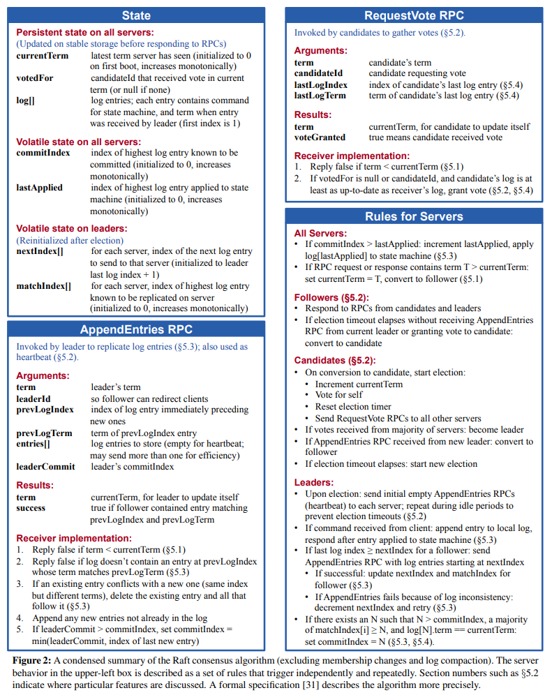

**State**

所有服务器上的持久性状态（在响应 RPC 请求之前，已经更新到了稳定的存储设备）

| 参数        | 解释                                                         |
| ----------- | ------------------------------------------------------------ |
| currentTerm | 服务器已知最新的任期（在服务器首次启动时初始化为 0，单调递增） |
| votedFor    | 当前任期内接受选票的 candidate Id，如果没有投给任何候选者则为空 |
| log[]       | 日志条目；每个条目包含了用于状态机的命令，以及从 leader 接收到该条目时的任期（初始索引为 1） |

所有服务器上的易失性状态

| 参数        | 解释                                                         |
| ----------- | ------------------------------------------------------------ |
| commitIndex | 已提交的最高的日志条目的索引（初始值为 0，单调递增）         |
| lastApplied | 已经被提交到状态机的最后一个日志的索引（初值为 0 且单调递增） |

leader 上的易失性状态（每次选举后重新初始化）

| 参数         | 解释                                                         |
| ------------ | ------------------------------------------------------------ |
| nextIndex[]  | 每台机器在数组占据一个元素，元素的值为下条发送到该机器的日志索引 (初始值为 leader 最新一条日志的索引 +1) |
| matchIndex[] | 对于每一台服务器，已经复制到该服务器的最高日志条目的索引（初始值为 0，单调递增） |


**AppendEntries RPC**

被 leader 用来复制日志（5.3 节）；同时也被用作心跳（5.2 节）

| 参数         | 解释                                                         |
| ------------ | ------------------------------------------------------------ |
| term         | leader 任期                                                  |
| leaderId     | 用来 follower 把客户端请求重定向到 leader                    |
| prevLogIndex | 紧邻新日志条目之前的那个日志条目的索引                       |
| prevLogTerm  | 紧邻新日志条目之前的那个日志条目的任期                       |
| entries[]    | 需要被保存的日志条目（被当做心跳使用时，则日志条目内容为空；为了提高效率可能一次性发送多个） |
| leaderCommit | leader 的 commitIndex                                        |

| 返回值  | 解释                                                         |
| ------- | ------------------------------------------------------------ |
| term    | 当前任期，对于 leader 而言它会更新自己的任期                 |
| success | 如果 follower 包含索引为 prevLogIndex 和任期为 prevLogItem 的日志，则为 true |

接收者的实现：

1.  如果 leader 的任期小于自己的任期返回 false。(5.1)
2.  如果自己不存在索引、任期和 prevLogIndex、 prevLogItem 匹配的日志返回 false。(5.3)
3.  如果存在一条日志索引和 prevLogIndex 相等，但是任期和 prevLogItem 不相同的日志，需要删除这条日志及所有后继日志。（5.3）
4.  如果 leader 复制的日志本地没有，则直接追加存储。
5.  如果 leaderCommit>commitIndex，设置本地 commitIndex 为 leaderCommit 和最新日志索引中较小的一个。


**RequestVote RPC**

由候选者负责调用用来征集选票（5.2 节）

| 参数         | 解释                         |
| ------------ | ---------------------------- |
| term         | 候选者的任期号               |
| candidateId  | 请求选票的候选者的 ID        |
| lastLogIndex | 候选者的最后日志条目的索引值 |
| lastLogTerm  | 候选者最后日志条目的任期号   |

| 返回值      | 解释                                       |
| ----------- | ------------------------------------------ |
| term        | 当前任期号，以便于候选者去更新自己的任期号 |
| voteGranted | 候选者赢得了此张选票时为 true              |

接收者实现：

1.  如果 leader 的任期小于自己的任期返回 false。(5.1)
2.  如果本地 voteFor 为空，并且候选人的日志至少和自己一样新，则投票给该候选者 (5.2 和 5.4)


**Rules for Servers**

所有服务器：

-   如果 `commitIndex > lastApplied`，则 lastApplied 递增，并将 `log[lastApplied]` 应用到状态机中（5.3 节）
-   如果接收到的 RPC 请求或响应中，任期号 `T > currentTerm`，则令 `currentTerm = T`，并切换为 follower 状态（5.1 节）

followers（5.2 节）：

-   响应来自 candidate 和 leader 的请求
-   如果选举定时器超时时，没有收到 leader 的的追加日志请求或者没有投票给 candidate，该机器转化为 candidate。

candidates（5.2 节）：

-   在转变成候选者后就立即开始选举过程
    -   自增当前的任期号（currentTerm）
    -   给自己投票
    -   重置选举超时计时器
    -   发送请求投票的 RPC 给其他所有服务器
-   如果接收到大多数服务器的选票，那么就变成 leader
-   如果接收到来自新的 leader 的附加日志（AppendEntries）RPC，则转变成 follower
-   如果选举过程超时，则再次发起一轮选举

leaders：

-   一旦成为领导者：发送空的附加日志（AppendEntries）RPC（心跳）给其他所有的服务器；在一定的空余时间之后不停的重复发送，以防止跟随者超时（5.2 节）
-   如果接收到来自客户端的请求：附加条目到本地日志中，在条目被应用到状态机后响应客户端（5.3 节）
-   如果对于一个 follower，最后日志条目的索引值大于等于 nextIndex（`lastLogIndex ≥ nextIndex`），则发送从 nextIndex 开始的所有日志条目：
    -   如果成功：更新相应 follower 的 nextIndex 和 matchIndex
    -   如果因为日志不一致而失败，则 nextIndex 递减并重试
-   如果存在 `N > commitIndex`（本地待提交日志的索引），`majority(matchIndex[i]>= N)`（如果参与者大多数的最新日志的索引大于 N），并且这些参与者索引为 N 的日志的任期也等于 leader 的当前任期： commitIndex = N（leader 的待提交的日志索引设置为 N）(5.2 和 5.4 节)。


图 3 列举了这个算法的一些关键特性。图中的这些元素会在剩下的章节逐一介绍。

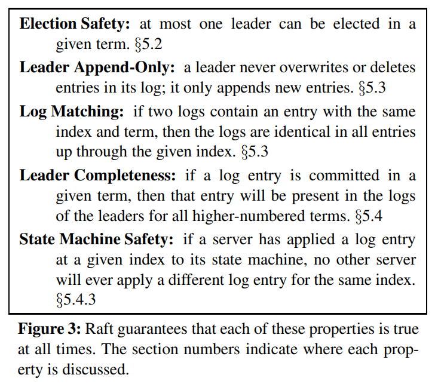

| 特性             | 解释                                                         |
| ---------------- | ------------------------------------------------------------ |
| 选举安全特性     | 在一个给定的任期最多只可以选举出一个 leader（5.2 节）。      |
| 领导者只附加原则 | 对于一个 leader 它永远不会重写和删除日志中的日志记录，它只会追加日志记录。（5.3 节） |
| 日志匹配原则     | 如果两个日志在某一相同索引位置日志条目的任期号相同，那么我们就认为这两个日志从头到该索引位置之间的内容完全一致（5.3 节） |
| 领导者完全特性   | 如果某个日志条目在某个任期号中已经被提交，那么这个条目必然出现在更大任期号的所有 leader 中（5.4 节） |
| 状态机安全特性   | 如果某一服务器已将给定索引位置的日志条目应用至其状态机中，则其他任何服务器在该索引位置不会应用不同的日志条目（5.4.3 节） |

>Raft implements consensus by first electing a distinguished leader, then giving the leader complete responsibility for managing the replicated log. The leader accepts log entries from clients, replicates them on other servers, and tells servers when it is safe to apply log entries to their state machines. Having a leader simplifies the management of the replicated log. For example, the leader can decide where to place new entries in the log without consulting other servers, and data flows in a simple fashion from the leader to other servers. A leader can fail or become disconnected from the other servers, in which case a new leader is elected.

Raft 实现共识是首先选择一个确定的 leader，然后 leader 负责管理日志复制。leader 从客户端接收日志条目（log entries），然后把日志复制到其它的机器并告诉其它机器什么时候可以安全地将日志条目应用到他们的状态机中。集群存在一个 leader 的好处可以简化日志复制的管理。例如，leader 可以决定新的日志条目需要放在日志中的什么位置而不需要和其他服务器商议。整个集群的数据流向也是从 leader 流向其它机器。如果 leader 宕机或者网络断开，其它的机器可以重新选举一个新的 leader。 

>Given the leader approach, Raft decomposes the consensus problem into three relatively independent subproblems, which are discussed in the subsections that follow: 
>
>• Leader election: a new leader must be chosen when an existing leader fails (Section 5.2). 
>
>• Log replication: the leader must accept log entries from clients and replicate them across the cluster, forcing the other logs to agree with its own (Section 5.3).
>
>• Safety: the key safety property for Raft is the State Machine Safety Property in Figure 3: if any server has applied a particular log entry to its state machine, then no other server may apply a different command for the same log index. Section 5.4 describes how Raft ensures this property; the solution involves an additional restriction on the election mechanism described in Section 5.2.

通过选主的方式，Raft 将一致性问题分解成了三个相对独立的子问题，这些问题会在接下来的子章节中进行讨论：

-   领导选举：当现存的 leader 发生故障的时候, 一个新的 leader 需要被选举出来（章节 5.2）
-   日志复制：leader 必须从客户端接收日志条目（log entries）然后复制到集群中的其他节点，并强制要求其他节点的日志和自己保持一致。
-   安全性：在 Raft 中安全性的关键是在图 3 中展示的状态机安全：如果有任何的服务器节点已经应用了一个确定的日志条目到它的状态机中，那么其他服务器节点不能在同一个日志索引位置应用一个不同的指令。章节 5.4 阐述了 Raft 算法是如何保证这个特性的；解决这个问题的方案就是在选举是增加额外的规则约束（5.2 节）。 

>After presenting the consensus algorithm, this section discusses the issue of availability and the role of timing in the system.

在展示共识算法之后，这一章节会讨论一些可用性的问题和计时在系统中的作用。


## Raft 基础

>A Raft cluster contains several servers; five is a typical number, which allows the system to tolerate two failures. At any given time each server is in one of three states: leader, follower, or candidate. In normal operation there is exactly one leader and all of the other servers are followers. Followers are passive: they issue no requests on their own but simply respond to requests from leaders and candidates. The leader handles all client requests (if a client contacts a follower, the follower redirects it to the leader). The third state, candidate, is used to elect a new leader as described in Section 5.2. Figure 4 shows the states and their transitions; the transitions are discussed below.

一个 Raft 集群包含若干个服务器节点；5 个服务器节点是一个典型的例子，这允许整个系统容忍 2 个节点失效。在任何时刻，每一个服务器节点都处于这三个状态之一：领导者（leader）、跟随者（follower）或者候选者（candidate）。在通常情况下，系统中只有一个领导者并且其他的节点全部都是跟随者。跟随者都是被动的：他们不会发送任何请求，只是简单的响应来自领导者或者候选者的请求。领导者处理所有的客户端请求（如果一个客户端和跟随者联系，那么跟随者会把请求重定向给领导者）。第三种状态，候选者，是用来在 5.2 节描述的选举新领导者时使用。图 4 展示了这些状态和他们之间的转换关系；这些转换关系会在接下来进行讨论。

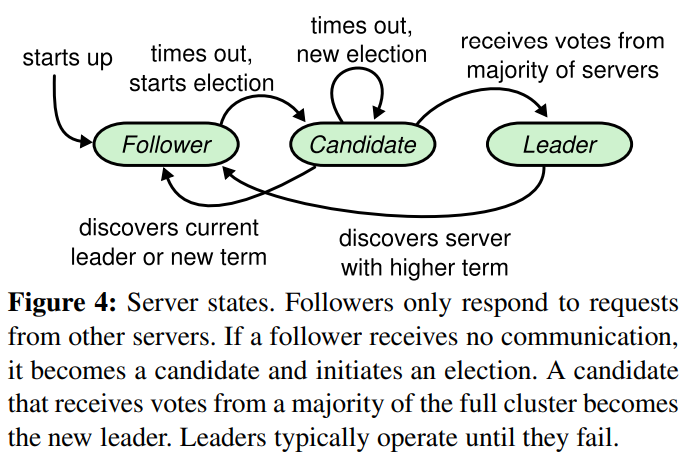

图 4：服务器状态。跟随者只响应来自其他服务器的请求。如果跟随者接收不到消息，那么他就会变成候选者并发起一次选举。获得集群中大多数选票的候选者将成为领导者。在一个任期内，领导者一直都会是领导者，直到自己宕机了。

>Raft divides time into terms of arbitrary length, as shown in Figure 5. Terms are numbered with consecutive integers. Each term begins with an election, in which one or more candidates attempt to become leader as described in Section 5.2. If a candidate wins the election, then it serves as leader for the rest of the term. In some situations an election will result in a split vote. In this case the term will end with no leader; a new term (with a new election) will begin shortly. Raft ensures that there is at most one leader in a given term.

Raft 把时间分割成任意长度的任期，如图 5。任期用连续的整数标记。每一段任期从一次选举开始，就像章节 5.2 描述的一样，一个或者多个候选者尝试成为领导者。如果一个候选者赢得选举，然后他就在接下来的任期内充当领导者的职责。在某些情况下，一次选举过程会造成选票的瓜分。在这种情况下，这一任期会以没有领导者结束；一个新的任期（和一次新的选举）会很快重新开始。Raft 保证了在一个给定的任期内，最多只有一个领导者。

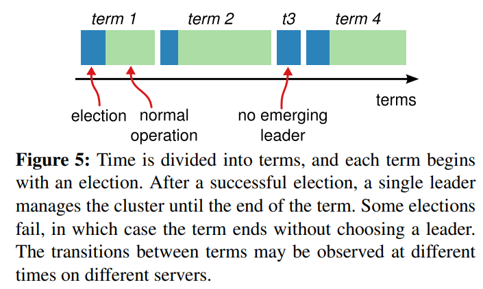

图 5：时间被划分成一个个的任期，每个任期始于一次选举。在选举成功后，领导者会管理整个集群直到任期结束。有时候选举会失败，那么这个任期就会没有领导者而结束。任期之间的切换可以在不同的时间不同的服务器上观察到。

>Different servers may observe the transitions between terms at different times, and in some situations a server may not observe an election or even entire terms. Terms act as a logical clock [14] in Raft, and they allow servers to detect obsolete information such as stale leaders. Each server stores a current term number, which increases monotonically over time. Current terms are exchanged whenever servers communicate; if one server’s current term is smaller than the other’s, then it updates its current term to the larger value. If a candidate or leader discovers that its term is out of date, it immediately reverts to follower state. If a server receives a request with a stale term number, it rejects the request.

不同的服务器节点可能多次观察到任期之间的转换，但在某些情况下，一个节点也可能观察不到任何一次选举或者整个任期全程。任期在 Raft 算法中充当逻辑时钟的作用，任期使得服务器可以检测一些过期的信息：比如过期的领导者。每个节点存储一个当前任期号，这一编号在整个时期内单调递增。每当服务器之间通信的时候都会交换当前任期号；如果一个服务器的当前任期号比其他人小，那么他会更新自己的编号到较大的编号值。如果一个候选者或者领导者发现自己的任期号过期了，那么他会立即恢复成跟随者状态。如果一个节点接收到一个包含过期的任期号的请求，那么他会直接拒绝这个请求。

>Raft servers communicate using remote procedure calls (RPCs), and the basic consensus algorithm requires only two types of RPCs. RequestVote RPCs are initiated by candidates during elections (Section 5.2), and AppendEntries RPCs are initiated by leaders to replicate log entries and to provide a form of heartbeat (Section 5.3). Section 7 adds a third RPC for transferring snapshots between servers. Servers retry RPCs if they do not receive a response in a timely manner, and they issue RPCs in parallel for best performance.

Raft 算法中服务器节点之间通信使用远程过程调用（RPCs），并且基本的一致性算法只需要两种类型的 RPCs。请求投票（RequestVote）RPCs 由候选者在选举期间发起（章节 5.2），然后附加条目（AppendEntries）RPCs 由领导者发起，用来复制日志和提供一种心跳机制（章节 5.3）。第 7 节为了在服务器之间传输快照增加了第三种 RPC。当服务器没有及时的收到 RPC 的响应时，会进行重试，并且他们能够并行的发起 RPCs 来获得最佳的性能。


## Leader 选举

>Raft uses a heartbeat mechanism to trigger leader election. When servers start up, they begin as followers. A server remains in follower state as long as it receives valid RPCs from a leader or candidate. Leaders send periodic heartbeats (AppendEntries RPCs that carry no log entries) to all followers in order to maintain their authority. If a follower receives no communication over a period of time called the election timeout, then it assumes there is no viable leader and begins an election to choose a new leader.

Raft 使用一种心跳机制来触发领导者选举。当服务器程序启动时，他们都是跟随者身份。如果跟随着领导者或者候选者处接收到有效的 RPCs，那么它继续保持着跟随者状态。领导者周期性的向所有跟随者发送心跳包（即不包含日志项内容的附加条目（AppendEntries）RPCs）来授权延长自己的任期。如果一个跟随者在一段时间里没有接收到任何消息，也就是选举超时，那么他就会认为系统中没有可用的领导者,并且发起选举以选出新的领导者。

>To begin an election, a follower increments its current term and transitions to candidate state. It then votes for itself and issues RequestVote RPCs in parallel to each of the other servers in the cluster. A candidate continues in this state until one of three things happens: (a) it wins the election, (b) another server establishes itself as leader, or (c) a period of time goes by with no winner. These outcomes are discussed separately in the paragraphs below.

要开始一次选举过程，跟随者先要增加自己的当前任期号并且转换到候选者状态。然后他会并行地向集群中的其他服务器节点发送请求投票的 RPCs 来给自己投票。候选者会继续保持着当前状态直到以下三件事情之一发生：

(a) 他自己赢得了这次的选举；

(b) 其他的服务器成为领导者；

(c) 一段时间之后没有任何一个获胜的人。

这些结果会分别的在下面的段落里进行讨论。

>A candidate wins an election if it receives votes from a majority of the servers in the full cluster for the same term. Each server will vote for at most one candidate in a given term, on a first-come-first-served basis (note: Section 5.4 adds an additional restriction on votes). The majority rule ensures that at most one candidate can win the election for a particular term (the Election Safety Property in Figure 3). Once a candidate wins an election, it becomes leader. It then sends heartbeat messages to all of the other servers to establish its authority and prevent new elections.

当一个候选者从整个集群的大多数服务器节点获得了针对同一个任期号的选票，那么他就赢得了这次选举并成为领导者。每一个服务器最多会对一个任期号投出一张选票，按照先来先服务的原则（注意：5.4 节在投票上增加了一点额外的限制）。要求大多数选票的规则确保了最多只会有一个候选者赢得此次选举（图 3 中的选举安全性）。一旦候选者赢得选举，他就立即成为领导者。然后他会向其他的服务器发送心跳消息来建立自己的权威并且阻止发起新的选举。

>While waiting for votes, a candidate may receive an AppendEntries RPC from another server claiming to be leader. If the leader’s term (included in its RPC) is at least as large as the candidate’s current term, then the candidate recognizes the leader as legitimate and returns to follower state. If the term in the RPC is smaller than the candidate’s current term, then the candidate rejects the RPC and continues in candidate state.

在等待投票的时候，候选者可能会从其他的服务器接收到声明它是领导者的附加条目（AppendEntries）RPC。如果这个领导者的任期号（包含在此次的 RPC 中）不小于候选者当前的任期号，那么候选者会承认领导者合法并回到跟随者状态。如果此次 RPC 中的任期号比自己小，那么候选者就会拒绝这次的 RPC 并且继续保持候选者状态。

>The third possible outcome is that a candidate neither wins nor loses the election: if many followers become candidates at the same time, votes could be split so that no candidate obtains a majority. When this happens, each candidate will time out and start a new election by incrementing its term and initiating another round of RequestVote RPCs. However, without extra measures split votes could repeat indefinitely.

第三种可能的结果是候选者既没有赢得选举也没有输：如果有多个跟随者同时成为候选者，那么选票可能会被瓜分以至于没有候选者可以赢得大多数人的支持。当这种情况发生的时候，每一个候选者都会超时，然后通过增加当前任期号来开始一轮新的选举。然而，没有其他机制的话，选票可能会被无限的重复瓜分。

>Raft uses randomized election timeouts to ensure that split votes are rare and that they are resolved quickly. To prevent split votes in the first place, election timeouts are chosen randomly from a fixed interval (e.g., 150–300ms). This spreads out the servers so that in most cases only a single server will time out; it wins the election and sends heartbeats before any other servers time out. The same mechanism is used to handle split votes. Each candidate restarts its randomized election timeout at the start of an election, and it waits for that timeout to elapse before starting the next election; this reduces the likelihood of another split vote in the new election. Section 9.3 shows that this approach elects a leader rapidly.

Raft 算法使用随机选举超时时间的方法来确保很少会发生选票瓜分的情况，就算发生也能很快的解决。为了阻止选票起初就被瓜分，选举超时时间是从一个固定的区间（例如 150-300 毫秒）随机选择。这样可以把服务器都分散开以至于在大多数情况下只有一个服务器会选举超时；然后他赢得选举并在其他服务器超时之前发送心跳包。同样的机制被用在选票瓜分的情况下。每一个候选者在开始一次选举的时候会重置一个随机的选举超时时间，然后在超时时间内等待投票的结果；这样减少了在新的选举中另外的选票瓜分的可能性。9.3 节展示了这种方案能够快速的选出一个领导者。

>Elections are an example of how understandability guided our choice between design alternatives. Initially we planned to use a ranking system: each candidate was assigned a unique rank, which was used to select between competing candidates. If a candidate discovered another candidate with higher rank, it would return to follower state so that the higher ranking candidate could more easily win the next election. We found that this approach created subtle issues around availability (a lower-ranked server might need to time out and become a candidate again if a higher-ranked server fails, but if it does so too soon, it can reset progress towards electing a leader). We made adjustments to the algorithm several times, but after each adjustment new corner cases appeared. Eventually we concluded that the randomized retry approach is more obvious and understandable.

领导者选举这个例子，体现了可理解性原则是如何指导我们进行方案设计的。起初我们计划使用一种排名系统：每一个候选者都被赋予一个唯一的排名，供候选者之间竞争时进行选择。如果一个候选者发现另一个候选者拥有更高的排名，那么他就会回到跟随者状态，这样高排名的候选者能够更加容易的赢得下一次选举。但是我们发现这种方法在可用性方面会有一点问题（如果高排名的服务器宕机了，那么低排名的服务器可能会超时并再次进入候选者状态。而且如果这个行为发生得足够快，则可能会导致整个选举过程都被重置掉）。我们针对算法进行了多次调整，但是每次调整之后都会有新的问题。最终我们认为随机重试的方法是更加明显和易于理解的。


## 日志复制

>Once a leader has been elected, it begins servicing client requests. Each client request contains a command to be executed by the replicated state machines. The leader appends the command to its log as a new entry, then issues AppendEntries RPCs in parallel to each of the other servers to replicate the entry. When the entry has been safely replicated (as described below), the leader applies the entry to its state machine and returns the result of that execution to the client. If followers crash or run slowly, or if network packets are lost, the leader retries AppendEntries RPCs indefinitely (even after it has responded to the client) until all followers eventually store all log entries.

一旦一个领导者被选举出来，他就开始为客户端提供服务。客户端的每一个请求都包含一条被复制状态机执行的指令。领导者把这条指令作为一条新的日志条目附加到日志中去，然后并行地发起附加条目 RPCs 给其他的服务器，让他们复制这条日志条目。当这条日志条目被安全地复制（下面会介绍），领导者会应用这条日志条目到它的状态机中然后把执行的结果返回给客户端。如果跟随者崩溃或者运行缓慢，再或者网络丢包，领导者会不断的重复尝试附加日志条目 RPCs（尽管已经回复了客户端）直到所有的跟随者都最终存储了所有的日志条目。

>Logs are organized as shown in Figure 6. Each log entry stores a state machine command along with the term number when the entry was received by the leader. The term numbers in log entries are used to detect inconsistencies between logs and to ensure some of the properties in Figure 3. Each log entry also has an integer index identifying its position in the log.

日志以图 6 展示的方式组织。每一个日志条目存储一条状态机指令和从领导者收到这条指令时的任期号。日志中的任期号用来检查是否出现不一致的情况，同时也用来保证图 3 中的某些性质。每一条日志条目同时也都有一个整数索引值来表明它在日志中的位置。

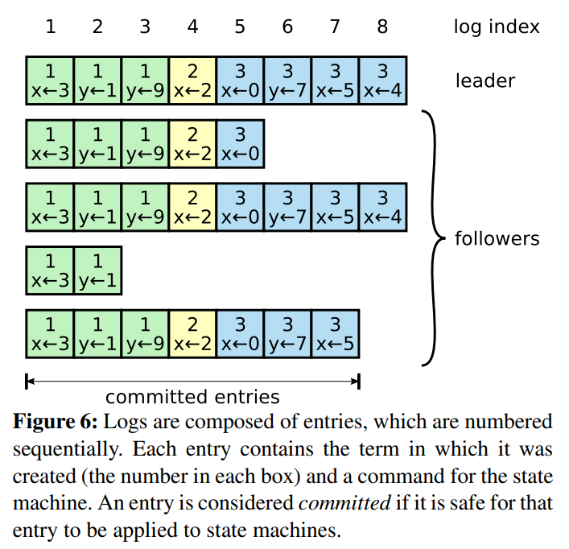

图 6：日志由有序序号标记的条目组成。每个条目都包含创建时的任期号（图中框中的数字），和一个状态机需要执行的指令。一个条目当可以安全地被应用到状态机中去的时候，就认为是可以提交了。

>The leader decides when it is safe to apply a log entry to the state machines; such an entry is called committed. Raft guarantees that committed entries are durable and will eventually be executed by all of the available state machines. A log entry is committed once the leader that created the entry has replicated it on a majority of the servers (e.g., entry 7 in Figure 6). This also commits all preceding entries in the leader’s log, including entries created by previous leaders. Section 5.4 discusses some subtleties when applying this rule after leader changes, and it also shows that this definition of commitment is safe. The leader keeps track of the highest index it knows to be committed, and it includes that index in future AppendEntries RPCs (including heartbeats) so that the other servers eventually find out. Once a follower learns that a log entry is committed, it applies the entry to its local state machine (in log order).

领导者来决定什么时候把日志条目应用到状态机中是安全的；这种日志条目被称为已提交。Raft 算法保证所有已提交的日志条目都是持久化的并且最终会被所有可用的状态机执行。在领导者将创建的日志条目复制到大多数的服务器上的时候，日志条目就会被提交（例如在图 6 中的条目 7）。同时，领导者的日志中之前的所有日志条目也都会被提交，包括由其他领导者创建的条目。5.4 节会讨论某些当在领导者改变之后应用这条规则的隐晦内容，同时他也展示了这种提交的定义是安全的。领导者跟踪了最大的将会被提交的日志项的索引，并且索引值会被包含在未来的所有附加日志 RPCs（包括心跳包），这样其他的服务器才能最终知道领导者的提交位置。一旦跟随者知道一条日志条目已经被提交，那么他也会将这个日志条目应用到本地的状态机中（按照日志的顺序）。

>We designed the Raft log mechanism to maintain a high level of coherency between the logs on different servers. Not only does this simplify the system’s behavior and make it more predictable, but it is an important component of ensuring safety. Raft maintains the following properties, which together constitute the Log Matching Property in Figure 3:
>
>• If two entries in different logs have the same index and term, then they store the same command. 
>
>• If two entries in different logs have the same index and term, then the logs are identical in all preceding entries.

我们设计了 Raft 的日志机制来维护不同服务器日志之间的高层次的一致性。这么做不仅简化了系统的行为也使其更具有可预测性，同时它也是安全性保证的一个重要组件。Raft 维护着以下的特性，这些特性共同组成了图 3 中的日志匹配特性（Log Matching Property）：

-   如果在不同的日志中的两个条目拥有相同的索引和任期号，那么他们存储了相同的指令。
-   如果在不同的日志中的两个条目拥有相同的索引和任期号，那么他们之前的所有日志条目也全部相同。

>The first property follows from the fact that a leader creates at most one entry with a given log index in a given term, and log entries never change their position in the log. The second property is guaranteed by a simple consistency check performed by AppendEntries. When sending an AppendEntries RPC, the leader includes the index and term of the entry in its log that immediately precedes the new entries. If the follower does not find an entry in its log with the same index and term, then it refuses the new entries. The consistency check acts as an induction step: the initial empty state of the logs satisfies the Log Matching Property, and the consistency check preserves the Log Matching Property whenever logs are extended. As a result, whenever AppendEntries returns successfully, the leader knows that the follower’s log is identical to its own log up through the new entries.

第一个特性来自这样的一个事实，领导者最多在一个任期里在指定的一个日志索引位置创建一条日志条目，同时日志条目在日志中的位置也从来不会改变。第二个特性由附加日志 RPC 的一个简单的一致性检查所保证。在发送附加日志 RPC 的时候，领导者会把新的日志条目前紧挨着的条目的索引位置和任期号包含在日志内。如果跟随者在它的日志中找不到包含相同索引位置和任期号的条目，那么他就会拒绝接收新的日志条目。一致性检查就像一个归纳步骤：一开始空的日志状态肯定是满足日志匹配特性的，然后一致性检查在日志扩展的时候保护了日志匹配特性。因此，每当附加日志 RPC 返回成功时，领导者就知道跟随者的日志一定是和自己相同的了。

>During normal operation, the logs of the leader and followers stay consistent, so the AppendEntries consistency check never fails. However, leader crashes can leave the logs inconsistent (the old leader may not have fully replicated all of the entries in its log). These inconsistencies can compound over a series of leader and follower crashes. Figure 7 illustrates the ways in which followers’ logs may differ from that of a new leader. A follower may be missing entries that are present on the leader, it may have extra entries that are not present on the leader, or both. Missing and extraneous entries in a log may span multiple terms.

在正常的操作中，领导者和跟随者的日志保持一致性，所以附加日志 RPC 的一致性检查从来不会失败。然而，领导者崩溃的情况会使得日志处于不一致的状态（老的领导者可能还没有完全复制所有的日志条目）。这种不一致问题会在领导者和跟随者的一系列崩溃下加剧。图 7 展示了跟随者的日志可能和新的领导者不同。跟随者可能会丢失一些在新的领导者中存在的日志条目，他也可能拥有一些领导者没有的日志条目，或者两者都发生。丢失或者多出日志条目可能会持续多个任期。

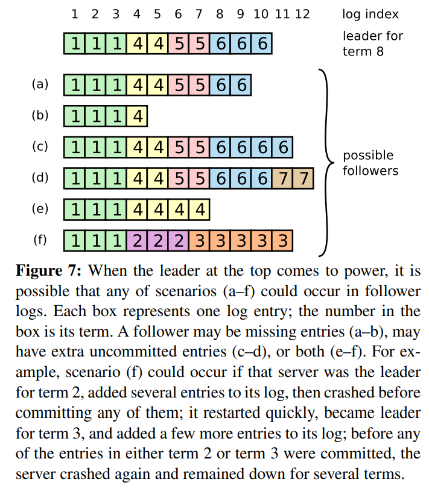

图 7：当一个领导者成功当选时，跟随者可能是任何情况（a-f）。每一个盒子表示是一个日志条目；里面的数字表示任期号。跟随者可能会缺少一些日志条目（a-b），可能会有一些未被提交的日志条目（c-d），或者两种情况都存在（e-f）。例如，场景 f 可能会这样发生，某服务器在任期 2 的时候是领导者，已附加了一些日志条目到自己的日志中，但在提交之前就崩溃了；很快这个机器就被重启了，在任期 3 重新被选为领导者，并且又增加了一些日志条目到自己的日志中；在任期 2 和任期 3 的日志被提交之前，这个服务器又宕机了，并且在接下来的几个任期里一直处于宕机状态。

>In Raft, the leader handles inconsistencies by forcing the followers’ logs to duplicate its own. This means that conflicting entries in follower logs will be overwritten with entries from the leader’s log. Section 5.4 will show that this is safe when coupled with one more restriction.

在 Raft 算法中，领导者是通过强制跟随者直接复制自己的日志来处理不一致问题的。这意味着在跟随者中的冲突的日志条目会被领导者的日志覆盖。5.4 节会阐述如何通过增加一些限制来使得这样的操作是安全的。

>To bring a follower’s log into consistency with its own, the leader must find the latest log entry where the two logs agree, delete any entries in the follower’s log after that point, and send the follower all of the leader’s entries after that point. All of these actions happen in response to the consistency check performed by AppendEntries RPCs. The leader maintains a nextIndex for each follower, which is the index of the next log entry the leader will send to that follower. When a leader first comes to power, it initializes all nextIndex values to the index just after the last one in its log (11 in Figure 7). If a follower’s log is inconsistent with the leader’s, the AppendEntries consistency check will fail in the next AppendEntries RPC. After a rejection, the leader decrements nextIndex and retries the AppendEntries RPC. Eventually nextIndex will reach a point where the leader and follower logs match. When this happens, AppendEntries will succeed, which removes any conflicting entries in the follower’s log and appends entries from the leader’s log (if any). Once AppendEntries succeeds, the follower’s log is consistent with the leader’s, and it will remain that way for the rest of the term.

要使得跟随者的日志进入和自己一致的状态，领导者必须找到最后两者达成一致的地方，然后删除跟随者从那个点之后的所有日志条目，并发送自己在那个点之后的日志给跟随者。所有的这些操作都在进行附加日志 RPCs 的一致性检查时完成。领导者针对每一个跟随者维护了一个 nextIndex，这表示下一个需要发送给跟随者的日志条目的索引地址。当一个领导者刚获得权力的时候，他初始化所有的 nextIndex 值为自己的最后一条日志的 index 加 1（图 7 中的 11）。如果一个跟随者的日志和领导者不一致，那么在下一次的附加日志 RPC 时的一致性检查就会失败。在被跟随者拒绝之后，领导者就会减小 nextIndex 值并进行重试。最终 nextIndex 会在某个位置使得领导者和跟随者的日志达成一致。当这种情况发生，附加日志 RPC 就会成功，这时就会把跟随者冲突的日志条目全部删除并且加上领导者的日志。一旦附加日志 RPC 成功，那么跟随者的日志就会和领导者保持一致，并且在接下来的任期里一直继续保持。

>If desired, the protocol can be optimized to reduce the number of rejected AppendEntries RPCs. For example, when rejecting an AppendEntries request, the follower can include the term of the conflicting entry and the first index it stores for that term. With this information, the leader can decrement nextIndex to bypass all of the conflicting entries in that term; one AppendEntries RPC will be required for each term with conflicting entries, rather than one RPC per entry. In practice, we doubt this optimization is necessary, since failures happen infrequently and it is unlikely that there will be many inconsistent entries.

如果需要的话，算法可以通过减少被拒绝的附加日志 RPCs 的次数来优化。例如，当附加日志 RPC 的请求被拒绝的时候，跟随者可以返回冲突条目的任期号和该任期号对应的最小索引地址。借助这些信息，领导者可以减小 nextIndex 一次性越过该冲突任期的所有日志条目；这样就变成每个任期需要一次附加条目 RPC 而不是每个条目一次。在实践中，我们十分怀疑这种优化是否是必要的，因为失败是很少发生的并且也不大可能会有这么多不一致的日志。

>With this mechanism, a leader does not need to take any special actions to restore log consistency when it comes to power. It just begins normal operation, and the logs automatically converge in response to failures of the AppendEntries consistency check. A leader never overwrites or deletes entries in its own log (the Leader Append-Only Property in Figure 3).

通过这种机制，领导者在获得权力的时候就不需要任何特殊的操作来恢复一致性。他只需要进行正常的操作，然后日志就能在回复附加日志 RPC 的一致性检查失败的时候自动趋于一致。领导者从来不会覆盖或者删除自己的日志（图 3 的领导者只附加特性）。

>This log replication mechanism exhibits the desirable consensus properties described in Section 2: Raft can accept, replicate, and apply new log entries as long as a majority of the servers are up; in the normal case a new entry can be replicated with a single round of RPCs to a majority of the cluster; and a single slow follower will not impact performance.

日志复制机制展示出了第 2 节中形容的一致性特性：Raft 能够接受，复制并应用新的日志条目只要大部分的机器是工作的；在通常的情况下，新的日志条目可以在一次 RPC 中被复制给集群中的大多数机器；并且单个的缓慢的跟随者不会影响整体的性能。


## 安全性

>The previous sections described how Raft elects leaders and replicates log entries. However, the mechanisms described so far are not quite sufficient to ensure that each state machine executes exactly the same commands in the same order. For example, a follower might be unavailable while the leader commits several log entries, then it could be elected leader and overwrite these entries with new ones; as a result, different state machines might execute different command sequences.

前面的章节里描述了 Raft 算法是如何选举和复制日志的。然而，到目前为止描述的机制并不能充分的保证每一个状态机会按照相同的顺序执行相同的指令。例如，一个跟随者可能会进入不可用状态同时领导者已经提交了若干的日志条目，然后这个跟随者可能会被选举为领导者并且覆盖这些日志条目；因此，不同的状态机可能会执行不同的指令序列。

>This section completes the Raft algorithm by adding a restriction on which servers may be elected leader. The restriction ensures that the leader for any given term contains all of the entries committed in previous terms (the Leader Completeness Property from Figure 3). Given the election restriction, we then make the rules for commitment more precise. Finally, we present a proof sketch for the Leader Completeness Property and show how it leads to correct behavior of the replicated state machine.

这一节通过在领导选举的时候增加一些限制来完善 Raft 算法。这一限制保证了任何的领导者对于给定的任期号，都拥有了之前任期的所有被提交的日志条目（图 3 中的领导者完整特性）。增加这一选举时的限制，我们对于提交时的规则也更加清晰。最终，我们将展示对于领导者完整特性（Leader Completeness Property）的简要证明，并且说明该特性是如何引导复制状态机做出正确行为的。


### 选举限制

>In any leader-based consensus algorithm, the leader must eventually store all of the committed log entries. In some consensus algorithms, such as Viewstamped Replication [22], a leader can be elected even if it doesn’t initially contain all of the committed entries. These algorithms contain additional mechanisms to identify the missing entries and transmit them to the new leader, either during the election process or shortly afterwards. Unfortunately, this results in considerable additional mechanism and complexity. Raft uses a simpler approach where it guarantees that all the committed entries from previous terms are present on each new leader from the moment of its election, without the need to transfer those entries to the leader. This means that log entries only flow in one direction, from leaders to followers, and leaders never overwrite existing entries in their logs.

在任何基于领导者的一致性算法中，领导者都必须存储所有已经提交的日志条目。在某些一致性算法中，例如 Viewstamped Replication，某个节点即使是一开始并没有包含所有已经提交的日志条目，它也能被选为领导者。这些算法都包含一些额外的机制来识别丢失的日志条目并把他们传送给新的领导者，要么是在选举阶段要么在之后很快进行。不幸的是，这种方法会导致相当大的额外的机制和复杂性。Raft 使用了一种更加简单的方法，它可以保证在选举的时候新的领导者拥有所有之前任期中已经提交的日志条目，而不需要传送这些日志条目给领导者。这意味着日志条目的传送是单向的，只从领导者传给跟随者，并且领导者从不会覆盖自身本地日志中已经存在的条目。

>Raft uses the voting process to prevent a candidate from winning an election unless its log contains all committed entries. A candidate must contact a majority of the cluster in order to be elected, which means that every committed entry must be present in at least one of those servers. If the candidate’s log is at least as up-to-date as any other log in that majority (where “up-to-date” is defined precisely below), then it will hold all the committed entries. The RequestVote RPC implements this restriction: the RPC includes information about the candidate’s log, and the voter denies its vote if its own log is more up-to-date than that of the candidate.

Raft 使用选举过程来保证一个候选者必须包含有所有已提交的日志才能胜出。候选者为了赢得选举必须联系集群中的大部分节点，这意味着每一个已经提交的日志条目在这些服务器节点中肯定存在于至少一个节点上。如果候选者的日志至少和大多数的服务器节点一样新（这个新的定义会在下面讨论），那么他一定持有了所有已经提交的日志条目。请求投票（RequestVote）RPC 实现了这样的限制：RPC 中包含了候选者的日志信息，然后投票人会拒绝掉那些日志没有自己新的投票请求。

>Raft determines which of two logs is more up-to-date by comparing the index and term of the last entries in the logs. If the logs have last entries with different terms, then the log with the later term is more up-to-date. If the logs end with the same term, then whichever log is longer is more up-to-date.

Raft 通过比较两份日志中最后一条日志条目的索引值和任期号定义谁的日志比较新。如果两份日志最后的条目的任期号不同，那么任期号大的日志更加新。如果两份日志最后的条目任期号相同，那么日志比较长的那个就更加新。


### 提交之前任期的条目

>As described in Section 5.3, a leader knows that an entry from its current term is committed once that entry is stored on a majority of the servers. If a leader crashes before committing an entry, future leaders will attempt to finish replicating the entry. However, a leader cannot immediately conclude that an entry from a previous term is committed once it is stored on a majority of servers. Figure 8 illustrates a situation where an old log entry is stored on a majority of servers, yet can still be overwritten by a future leader

如同 5.3 节介绍的那样，如果当前任期的一条日志已经被复制到集群中的大多数，那么 leader 可以确定这条日志已经处于提交状态。如果一个领导者在提交日志条目之前崩溃了，未来后续的领导者会继续尝试复制这条日志记录。然而，一个领导者不能断定一个之前任期里的日志条目被保存到大多数服务器上的时候就一定已经提交了。图 8 展示了一种情况，一条已经被存储到大多数节点上的老日志条目，也依然有可能会被未来的领导者覆盖掉。

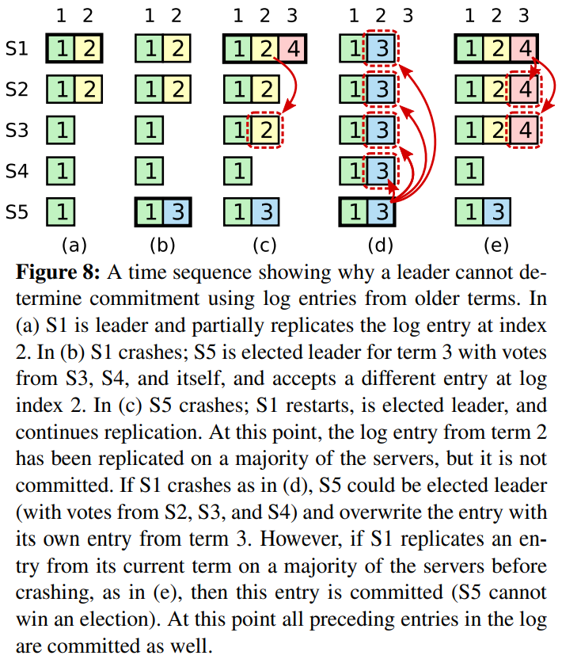

图 8：如图的时间序列展示了为什么领导者无法决定对老任期号的日志条目进行提交。

在 (a) 中，S1 是领导者，部分的跟随者复制了索引位置 2 的日志条目。

在 (b) 中，S1 崩溃了，然后 S5 在任期 3 里通过 S3、S4 和自己的选票赢得选举，然后从客户端接收了一条不一样的日志条目放在了索引 2 处。

然后到 (c)，S5 又崩溃了；S1 重新启动，选举成功，开始复制日志。在这时，来自任期 2 的那条日志已经被复制到了集群中的大多数机器上，但是还没有被提交。

如果 S1 在 (d) 中又崩溃了，S5 可以重新被选举成功（通过来自 S2，S3 和 S4 的选票），然后覆盖了他们在索引 2 处的日志。反之，如果在崩溃之前，S1 把自己主导的新任期里产生的日志条目复制到了大多数机器上，就如 (e) 中那样，那么在后面任期里面这些新的日志条目就会被提交（因为 S5 就不可能选举成功）。这样在同一时刻就同时保证了，之前的所有老的日志条目就会被提交。

>To eliminate problems like the one in Figure 8, Raft never commits log entries from previous terms by counting replicas. Only log entries from the leader’s current term are committed by counting replicas; once an entry from the current term has been committed in this way, then all prior entries are committed indirectly because of the Log Matching Property. There are some situations where a leader could safely conclude that an older log entry is committed (for example, if that entry is stored on every server), but Raft takes a more conservative approach for simplicity.

为了消除图 8 里描述的情况，Raft 永远不会通过计算副本数目的方式去提交一个之前任期内的日志条目。只有领导者当前任期里的日志条目通过计算副本数目可以被提交；一旦当前任期的日志条目以这种方式被提交，那么由于日志匹配特性，之前的日志条目也都会被间接的提交。在某些情况下，领导者可以安全的知道一个老的日志条目是否已经被提交（例如，该条目是否存储到所有服务器上），但是 Raft 为了简化问题使用一种更加保守的方法。

>Raft incurs this extra complexity in the commitment rules because log entries retain their original term numbers when a leader replicates entries from previous terms. In other consensus algorithms, if a new leader rereplicates entries from prior “terms,” it must do so with its new “term number.” Raft’s approach makes it easier to reason about log entries, since they maintain the same term number over time and across logs. In addition, new leaders in Raft send fewer log entries from previous terms than in other algorithms (other algorithms must send redundant log entries to renumber them before they can be committed).

当领导者复制之前任期里的日志时，Raft 会为所有日志保留原始的任期号, 这在提交规则上产生了额外的复杂性。在其他的一致性算法中，如果一个新的领导者要重新复制之前的任期里的日志时，它必须使用当前新的任期号。Raft 使用的方法更加容易辨别出日志，因为它可以随着时间和日志的变化对日志维护着同一个任期编号。另外，和其他的算法相比，Raft 中的新领导者只需要发送更少日志条目（其他算法中必须在他们被提交之前发送更多的冗余日志条目来为他们重新编号）。


### 安全性论证

>Given the complete Raft algorithm, we can now argue more precisely that the Leader Completeness Property holds (this argument is based on the safety proof; see Section 9.2). We assume that the Leader Completeness Property does not hold, then we prove a contradiction. Suppose the leader for term T (leaderT) commits a log entry from its term, but that log entry is not stored by the leader of some future term. Consider the smallest term U > T whose leader (leaderU) does not store the entry.
>
>1. The committed entry must have been absent from leaderU’s log at the time of its election (leaders never delete or overwrite entries). 
>2. leaderT replicated the entry on a majority of the cluster, and leaderU received votes from a majority of the cluster. Thus, at least one server (“the voter”) both accepted the entry from leaderT and voted for leaderU, as shown in Figure 9. The voter is key to reaching a contradiction. 
>3. The voter must have accepted the committed entry from leaderT before voting for leaderU; otherwise it would have rejected the AppendEntries request from leaderT (its current term would have been higher than T). 
>4. The voter still stored the entry when it voted for leaderU, since every intervening leader contained the entry (by assumption), leaders never remove entries, and followers only remove entries if they conflict with the leader. 
>5. The voter granted its vote to leaderU, so leaderU’s log must have been as up-to-date as the voter’s. This leads to one of two contradictions. 
>6. First, if the voter and leaderU shared the same last log term, then leaderU’s log must have been at least as long as the voter’s, so its log contained every entry in the voter’s log. This is a contradiction, since the voter contained the committed entry and leaderU was assumed not to. 
>7. Otherwise, leaderU’s last log term must have been larger than the voter’s. Moreover, it was larger than T, since the voter’s last log term was at least T (it contains the committed entry from term T). The earlier leader that created leaderU’s last log entry must have contained the committed entry in its log (by assumption). Then, by the Log Matching Property, leaderU’s log must also contain the committed entry, which is a contradiction. 
>8. This completes the contradiction. Thus, the leaders of all terms greater than T must contain all entries from term T that are committed in term T. 
>9. The Log Matching Property guarantees that future leaders will also contain entries that are committed indirectly, such as index 2 in Figure 8(d).

在给定了完整的 Raft 算法之后，我们现在可以更加精确的讨论领导者完整性特性（这一讨论基于 9.2 节的安全性证明）。我们假设领导者完全性特性是不存在的，然后我们推出矛盾来。假设任期 T 的领导者（领导者 T）在任期内提交了一条日志条目，但是这条日志条目没有被存储到未来某个任期的领导者的日志中。设大于 T 的最小任期 U 的领导者 U 没有这条日志条目。

1.  当任期 U 的 leader 在它选举的时候这条已提交日志已不存在于它的日志中（leaders 没有删除或者覆写）。 
2.  任期 T 的 leader 已经将日志复制到大多数机器，同时任期 U 的 leader 也接受到集群大多数机器的选票。那么至少存在一台机器即接受到任期 T 的 leader 复制的日志同时也投票给任期 U 的 leader，如图 9 所示。这个投票者是反证法的关键。 
3.  这个投票者一定是先接受任期 T 的 leader 复制日志，然后投票给任期 U 的 leader。否则它将拒绝来自任期 T 的 leader 的 AppendEntries 请求（否则它的任期将大于 T，与假设矛盾）。
4.  这个投票者投票给任期 U 的 leader 的时候，已经存储了这条日志，因为这中间任期的 leader 包含这条日志（通过假设），leaders 没有删除过这条日志，参与者只删除自己和 leader 冲突的日志。
5.  投票者把自己选票投给领导者 U 时，领导者 U 的日志必须和投票者自己一样新。这就导致了两者矛盾之一。
6.  首先，如果投票者和领导者 U 的最后一条日志的任期号相同，那么领导者 U 的日志至少和投票者一样长（投票规则限制），所以领导者 U 的日志一定包含所有投票者的日志。这是另一处矛盾，因为投票者包含了那条已经被提交的日志条目，但是在上述的假设里，领导者 U 是不包含的。
7.  除此之外，领导者 U 的最后一条日志的任期号就必须比投票人大了（投票规则限制）。此外，他也比 T 大，因为投票人的最后一条日志的任期号至少和 T 一样大（他包含了来自任期 T 的已提交的日志）。创建了领导者 U 最后一条日志的之前领导者一定已经包含了那条被提交的日志（根据上述假设，领导者 U 是第一个不包含该日志条目的领导者）。所以，根据日志匹配特性，领导者 U 一定也包含那条被提交的日志，这里产生矛盾。
8.  这里完成反证法。所以任期大于 T 的任期一定包含在任期 T 提交的所有日志。 
9.  日志匹配原则保证了未来的领导者也同时会包含被间接提交的条目，例如图 8 (e) 中的索引 2。

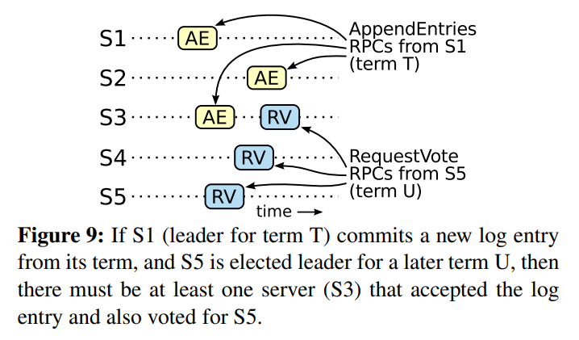

图 9：如果 S1（任期 T 的领导者）在它的任期里提交了一条新的日志，然后 S5 在之后的任期 U 里被选举为领导者，那么至少会有一个机器，如 S3，既拥有来自 S1 的日志，也给 S5 投票了。

>Given the Leader Completeness Property, we can prove the State Machine Safety Property from Figure 3, which states that if a server has applied a log entry at a given index to its state machine, no other server will ever apply a different log entry for the same index. At the time a server applies a log entry to its state machine, its log must be identical to the leader’s log up through that entry and the entry must be committed. Now consider the lowest term in which any server applies a given log index; the Log Completeness Property guarantees that the leaders for all higher terms will store that same log entry, so servers that apply the index in later terms will apply the same value. Thus, the State Machine Safety Property holds.

通过领导者完全特性，我们就能证明图 3 中的状态机安全特性，即如果服务器已经在某个给定的索引值应用了日志条目到自己的状态机里，那么其他的服务器不会应用一个不一样的日志到同一个索引值上。在一个服务器应用一条日志条目到他自己的状态机中时，他的日志必须和领导者的日志，在该条目和之前的条目上相同，并且已经被提交。现在我们来考虑在任何一个服务器应用一个指定索引位置的日志的最小任期；日志完全特性保证拥有更高任期号的领导者会存储相同的日志条目，所以之后的任期里应用某个索引位置的日志条目也会是相同的值。因此，状态机安全特性是成立的。

>Finally, Raft requires servers to apply entries in log index order. Combined with the State Machine Safety Property, this means that all servers will apply exactly the same set of log entries to their state machines, in the same order.

最后，Raft 要求服务器按照日志中索引位置顺序应用日志条目。和状态机安全特性结合起来看，这就意味着所有的服务器会应用相同的日志序列集到自己的状态机中，并且是按照相同的顺序。


## Follower and candidate crashes

>Until this point we have focused on leader failures. Follower and candidate crashes are much simpler to handle than leader crashes, and they are both handled in the same way. If a follower or candidate crashes, then future RequestVote and AppendEntries RPCs sent to it will fail. Raft handles these failures by retrying indefinitely; if the crashed server restarts, then the RPC will complete successfully. If a server crashes after completing an RPC but before responding, then it will receive the same RPC again after it restarts. Raft RPCs are idempotent, so this causes no harm. For example, if a follower receives an AppendEntries request that includes log entries already present in its log, it ignores those entries in the new request.

到目前为止，我们都只关注了领导者崩溃的情况。跟随者和候选者崩溃后的处理方式比领导者要简单的多，并且他们的处理方式是相同的。如果跟随者或者候选者崩溃了，那么后续发送给他们的 RPCs 都会失败。Raft 中处理这种失败就是简单地通过无限的重试；如果崩溃的机器重启了，那么这些 RPC 就会完整的成功。如果一个服务器在完成了一个 RPC，但是还没有响应的时候崩溃了，那么在他重新启动之后就会再次收到同样的请求。Raft 的 RPCs 都是幂等的，所以这样重试不会造成任何问题。例如一个跟随者如果收到附加日志请求但是他已经包含了这一日志，那么他就会直接忽略这个新的请求。


## 时间和可用性

>One of our requirements for Raft is that safety must not depend on timing: the system must not produce incorrect results just because some event happens more quickly or slowly than expected. However, availability (the ability of the system to respond to clients in a timely manner) must inevitably depend on timing. For example, if message exchanges take longer than the typical time between server crashes, candidates will not stay up long enough to win an election; without a steady leader, Raft cannot make progress.

Raft 的要求之一就是安全性不能依赖时间：整个系统不能因为某些事件运行的比预期快一点或者慢一点就产生了错误的结果。但是，可用性（系统可以及时的响应客户端）不可避免的要依赖于时间。例如，如果消息交换比服务器故障间隔时间长，候选者将没有足够长的时间来赢得选举；没有一个稳定的领导者，Raft 将无法工作。

>Leader election is the aspect of Raft where timing is most critical. Raft will be able to elect and maintain a steady leader as long as the system satisfies the following timing requirement:
>
>broadcastTime ≪ electionTimeout ≪ MTBF

领导者选举是 Raft 中对时间要求最为关键的方面。Raft 可以选举并维持一个稳定的领导者,只要系统满足下面的时间要求：

```text
广播时间（broadcastTime）<< 选举超时时间（electionTimeout）<< 平均故障间隔时间（MTBF）
```

>In this inequality broadcastTime is the average time it takes a server to send RPCs in parallel to every server in the cluster and receive their responses; electionTimeout is the election timeout described in Section 5.2; and MTBF is the average time between failures for a single server. The broadcast time should be an order of magnitude less than the election timeout so that leaders can reliably send the heartbeat messages required to keep followers from starting elections; given the randomized approach used for election timeouts, this inequality also makes split votes unlikely. The election timeout should be a few orders of magnitude less than MTBF so that the system makes steady progress. When the leader crashes, the system will be unavailable for roughly the election timeout; we would like this to represent only a small fraction of overall time.

在这个不等式中，广播时间指的是从一个服务器并行的发送 RPCs 给集群中的其他服务器并接收响应的平均时间；选举超时时间就是在 5.2 节中介绍的选举的超时时间限制；然后平均故障间隔时间就是对于一台服务器而言，两次故障之间的平均时间。广播时间必须比选举超时时间小一个量级，这样领导者才能够发送稳定的心跳消息来阻止跟随者开始进入选举状态；通过随机化选举超时时间的方法，这个不等式也使得选票瓜分的情况变得不可能。选举超时时间应该要比平均故障间隔时间小上几个数量级，这样整个系统才能稳定的运行。当领导者崩溃后，整个系统会大约相当于选举超时的时间里不可用；我们希望这种情况在整个系统的运行中很少出现。

>The broadcast time and MTBF are properties of the underlying system, while the election timeout is something we must choose. Raft’s RPCs typically require the recipient to persist information to stable storage, so the broadcast time may range from 0.5ms to 20ms, depending on storage technology. As a result, the election timeout is likely to be somewhere between 10ms and 500ms. Typical server MTBFs are several months or more, which easily satisfies the timing requirement.

广播时间和平均故障间隔时间是由系统决定的，但是选举超时时间是我们自己选择的。Raft 的 RPCs 需要接收方将信息持久化的保存到稳定存储中去，所以广播时间大约是 0.5 毫秒到 20 毫秒，取决于存储的技术。因此，选举超时时间可能需要在 10 毫秒到 500 毫秒之间。大多数的服务器的平均故障间隔时间都在几个月甚至更长，很容易满足时间的需求。


---

# 集群成员变化

>Up until now we have assumed that the cluster configuration (the set of servers participating in the consensus algorithm) is fixed. In practice, it will occasionally be necessary to change the configuration, for example to replace servers when they fail or to change the degree of replication. Although this can be done by taking the entire cluster off-line, updating configuration files, and then restarting the cluster, this would leave the cluster unavailable during the changeover. In addition, if there are any manual steps, they risk operator error. In order to avoid these issues, we decided to automate configuration changes and incorporate them into the Raft consensus algorithm.

到目前为止，我们都假设集群的配置（加入到一致性算法的服务器集合）是固定不变的。但是在实践中，偶尔是会改变集群的配置的，例如替换那些宕机的机器或者改变复制级别。尽管可以通过暂停整个集群，更新所有配置，然后重启整个集群的方式来实现，但是在更改的时候集群会不可用。另外，如果存在手工操作步骤，那么就会有操作失误的风险。为了避免这样的问题，我们决定自动化配置改变并且将其纳入到 Raft 一致性算法中来。

>For the configuration change mechanism to be safe, there must be no point during the transition where it is possible for two leaders to be elected for the same term. Unfortunately, any approach where servers switch directly from the old configuration to the new configuration is unsafe. It isn’t possible to atomically switch all of the servers at once, so the cluster can potentially split into two independent majorities during the transition (see Figure 10).

为了让配置修改机制能够安全，那么在转换的过程中不能够存在任何时间点使得两个领导者在同一个任期里同时被选举成功。不幸的是，任何服务器直接从旧的配置直接转换到新的配置的方案都是不安全的。一次性原子地转换所有服务器是不可能的，所以在转换期间整个集群存在划分成两个独立的大多数群体的可能性（见图 10）。

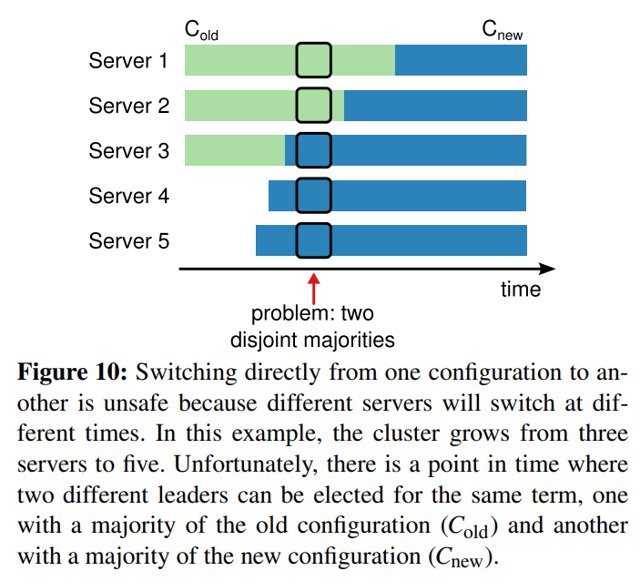

图 10：直接从一种配置转到新的配置是十分不安全的，因为各个机器可能在任何的时候进行转换。在这个例子中，集群配额从 3 台机器变成了 5 台。不幸的是，存在这样的一个时间点，两个不同的领导者在同一个任期里都可以被选举成功。一个是通过旧的配置，一个通过新的配置。

>In order to ensure safety, configuration changes must use a two-phase approach. There are a variety of ways to implement the two phases. For example, some systems (e.g., [22]) use the first phase to disable the old configuration so it cannot process client requests; then the second phase enables the new configuration. In Raft the cluster first switches to a transitional configuration we call joint consensus; once the joint consensus has been committed, the system then transitions to the new configuration. The joint consensus combines both the old and new configurations: 
>
>• Log entries are replicated to all servers in both configurations.
>
>• Any server from either configuration may serve as leader. 
>
>• Agreement (for elections and entry commitment) requires separate majorities from both the old and new configurations.
>
>The joint consensus allows individual servers to transition between configurations at different times without compromising safety. Furthermore, joint consensus allows the cluster to continue servicing client requests throughout the configuration change.

为了保证安全性，配置更改必须使用两阶段方法。目前有很多种两阶段的实现。例如，有些系统在第一阶段停掉旧的配置所以集群就不能处理客户端请求；然后在第二阶段在启用新的配置。在 Raft 中，集群先切换到一个过渡的配置，我们称之为共同一致（joint consensus)；一旦共同一致已经被提交了，那么系统就切换到新的配置上。共同一致是老配置和新配置的结合：

-   日志条目被复制给集群中新、老配置的所有服务器。
-   新、旧配置的服务器都可以成为领导者。
-   达成一致（针对选举和提交）需要分别在两种配置上获得大多数的支持。

共同一致允许独立的服务器在不影响安全性的前提下，在不同的时间进行配置转换过程。此外，共同一致可以让集群在配置转换的过程中依然响应客户端的请求。

>Cluster configurations are stored and communicated using special entries in the replicated log; Figure 11 illustrates the configuration change process. When the leader receives a request to change the configuration from Cold to Cnew, it stores the configuration for joint consensus (Cold,new in the figure) as a log entry and replicates that entry using the mechanisms described previously. Once a given server adds the new configuration entry to its log, it uses that configuration for all future decisions (a server always uses the latest configuration in its log, regardless of whether the entry is committed). This means that the leader will use the rules of Cold,new to determine when the log entry for Cold,new is committed. If the leader crashes, a new leader may be chosen under either Cold or Cold,new, depending on whether the winning candidate has received Cold,new. In any case, Cnew cannot make unilateral decisions during this period.

集群配置在复制日志中以特殊的日志条目来存储和通信；图 11 展示了配置转换的过程。当一个领导者接收到一个改变配置从 C-old 到 C-new 的请求，他会为了共同一致存储配置（图中的 C-old,new），以前面描述的日志条目和副本的形式。一旦一个服务器将新的配置日志条目增加到它的日志中，他就会用这个配置来做出未来所有的决定（服务器总是使用最新的配置，无论他是否已经被提交）。这意味着领导者要使用 C-old,new 的规则来决定日志条目 C-old,new 什么时候需要被提交。如果领导者崩溃了，被选出来的新领导者可能是使用 C-old 配置也可能是 C-old,new 配置，这取决于赢得选举的候选者是否已经接收到了 C-old,new 配置。在任何情况下，C-new 配置在这一时期都不会单方面的做出决定。

>OnceCold,new has been committed, neitherCold norCnew can make decisions without approval of the other, and the Leader Completeness Property ensures that only servers with the Cold,new log entry can be elected as leader. It is now safe for the leader to create a log entry describing Cnew and replicate it to the cluster. Again, this configuration will take effect on each server as soon as it is seen. When the new configuration has been committed under the rules of Cnew, the old configuration is irrelevant and servers not in the new configuration can be shut down. As shown in Figure 11, there is no time when Cold and Cnew can both make unilateral decisions; this guarantees safety.

一旦 C-old,new 被提交，那么无论是 C-old 还是 C-new，如果不经过另一个配置的允许都不能单独做出决定，并且领导者完全特性保证了只有拥有 C-old,new 日志条目的服务器才有可能被选举为领导者。这个时候，领导者创建一条关于 C-new 配置的日志条目并复制给集群就是安全的了。再者，每个服务器在见到新的配置的时候就会立即生效。当新的配置在 C-new 的规则下被提交，旧的配置就变得无关紧要，同时不使用新的配置的服务器就可以被关闭了。如图 11，C-old 和 C-new 没有任何机会同时做出单方面的决定；这保证了安全性。

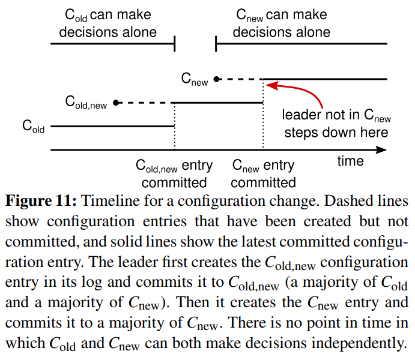

图 11：一个配置切换的时间线。虚线表示已经被创建但是还没有被提交的配置日志条目，实线表示最后被提交的配置日志条目。领导者首先创建了 C-old,new 的配置条目在自己的日志中，并提交到 C-old,new 中（C-old 的大多数和 C-new 的大多数）。然后他创建 C-new 条目并提交到 C-new 中的大多数。这样就不存在 C-new 和 C-old 可以同时做出决定的时间点。

>There are three more issues to address for reconfiguration. The first issue is that new servers may not initially store any log entries. If they are added to the cluster in this state, it could take quite a while for them to catch up, during which time it might not be possible to commit new log entries. In order to avoid availability gaps, Raft introduces an additional phase before the configuration change, in which the new servers join the cluster as non-voting members (the leader replicates log entries to them, but they are not considered for majorities). Once the new servers have caught up with the rest of the cluster, the reconfiguration can proceed as described above.

在关于重新配置还有三个问题需要提出。第一个问题是，新的服务器可能初始化没有存储任何的日志条目。当这些服务器以这种状态加入到集群中，那么他们需要一段时间来更新追赶，这时还不能提交新的日志条目。为了避免这种可用性的间隔时间，Raft 在配置更新之前使用了一种额外的阶段，在这个阶段，新的服务器以没有投票权身份加入到集群中来（领导者复制日志给他们，但是不考虑他们是大多数）。一旦新的服务器追赶上了集群中的其他机器，重新配置可以像上面描述的一样处理。

>The second issue is that the cluster leader may not be part of the new configuration. In this case, the leader steps down (returns to follower state) once it has committed the Cnew log entry. This means that there will be a period of time (while it is committingCnew) when the leader is managing a cluster that does not include itself; it replicates log entries but does not count itself in majorities. The leader transition occurs when Cnew is committed because this is the first point when the new configuration can operate independently (it will always be possible to choose a leader from Cnew). Before this point, it may be the case that only a server from Cold can be elected leader.

第二个问题是，集群的领导者可能不是新配置的一员。在这种情况下，领导者就会在提交了 C-new 日志之后退位（回到跟随者状态）。这意味着有这样的一段时间，领导者管理着集群，但是不包括他自己；他复制日志但是不把他自己算作是大多数之一。当 C-new 被提交时，会发生领导者过渡，因为这时是最早新的配置可以独立工作的时间点（将总是能够在 C-new 配置下选出新的领导者）。在此之前，可能只能从 C-old 中选出领导者。

>The third issue is that removed servers (those not in Cnew) can disrupt the cluster. These servers will not receive heartbeats, so they will time out and start new elections. They will then send RequestVote RPCs with new term numbers, and this will cause the current leader to revert to follower state. A new leader will eventually be elected, but the removed servers will time out again and the process will repeat, resulting in poor availability.

第三个问题是，移除不在 C-new 中的服务器可能会扰乱集群。这些服务器将不会再接收到心跳，所以当选举超时，他们就会进行新的选举过程。他们会发送拥有新的任期号的请求投票 RPCs，这样会导致当前的领导者回退成跟随者状态。新的领导者最终会被选出来，但是被移除的服务器将会再次超时，然后这个过程会再次重复，导致整体可用性大幅降低。

>To prevent this problem, servers disregard RequestVote RPCs when they believe a current leader exists. Specifically, if a server receives a RequestVote RPC within the minimum election timeout of hearing from a current leader, it does not update its term or grant its vote. This does not affect normal elections, where each server waits at least a minimum election timeout before starting an election. However, it helps avoid disruptions from removed servers: if a leader is able to get heartbeats to its cluster, then it will not be deposed by larger term numbers.

为了避免这个问题，当服务器确认当前领导者存在时，服务器会忽略请求投票 RPCs。特别的，当服务器在当前最小选举超时时间内收到一个请求投票 RPC，他不会更新当前的任期号或者投出选票。这不会影响正常的选举，每个服务器在开始一次选举之前，至少等待一个最小选举超时时间。然而，这有利于避免被移除的服务器扰乱：如果领导者能够发送心跳给集群，那么他就不会被更大的任期号废黜。


---

# 日志压缩

>Raft’s log grows during normal operation to incorporate more client requests, but in a practical system, it cannot grow without bound. As the log grows longer, it occupies more space and takes more time to replay. This will eventually cause availability problems without some mechanism to discard obsolete information that has accumulated in the log.

Raft 的日志在正常操作中不断地增长，但是在实际的系统中，日志不能无限制地增长。随着日志不断增长，他会占用越来越多的空间，花费越来越多的时间来重置。如果没有一定的机制去清除日志里积累的陈旧的信息，那么会带来可用性问题。

>Snapshotting is the simplest approach to compaction. In snapshotting, the entire current system state is written to a snapshot on stable storage, then the entire log up to that point is discarded. Snapshotting is used in Chubby and ZooKeeper, and the remainder of this section describes snapshotting in Raft.

快照是最简单的压缩方法。在快照系统中，整个系统的状态都以快照的形式写入到稳定的持久化存储中，然后到那个时间点之前的日志全部丢弃。快照技术被使用在 Chubby 和 ZooKeeper 中，接下来的章节会介绍 Raft 中的快照技术。

>Incremental approaches to compaction, such as log cleaning [36] and log-structured merge trees [30, 5], are also possible. These operate on a fraction of the data at once, so they spread the load of compaction more evenly over time. They first select a region of data that has accumulated many deleted and overwritten objects, then they rewrite the live objects from that region more compactly and free the region. This requires significant additional mechanism and complexity compared to snapshotting, which simplifies the problem by always operating on the entire data set. While log cleaning would require modifications to Raft, state machines can implement LSM trees using the same interface as snapshotting.

增量压缩的方法，例如日志清理或者日志结构合并树，都是可行的。这些方法每次只对一小部分数据进行操作，这样就分散了压缩的负载压力。首先，他们先选择一个已经积累的大量已经被删除或者被覆盖对象的区域，然后重写那个区域还活跃的对象，之后释放那个区域。和简单操作整个数据集合的快照相比，需要增加复杂的机制来实现。状态机可以实现 LSM tree 使用和快照相同的接口，但是日志清除方法就需要修改 Raft 了。

>Figure 12 shows the basic idea of snapshotting in Raft. Each server takes snapshots independently, covering just the committed entries in its log. Most of the work consists of the state machine writing its current state to the snapshot. Raft also includes a small amount of metadata in the snapshot: the last included index is the index of the last entry in the log that the snapshot replaces (the last entry the state machine had applied), and the last included term is the term of this entry. These are preserved to support the AppendEntries consistency check for the first log entry following the snapshot, since that entry needs a previous log index and term. To enable cluster membership changes (Section 6), the snapshot also includes the latest configuration in the log as of last included index. Once a server completes writing a snapshot, it may delete all log entries up through the last included index, as well as any prior snapshot.

图 12 展示了 Raft 中快照的基础思想。每个服务器独立地创建快照，只包括已经被提交的日志。主要的工作包括将状态机的状态写入到快照中。Raft 也包含一些少量的元数据到快照中：最后被包含索引指的是被快照取代的最后的条目在日志中的索引值（状态机最后应用的日志），最后被包含的任期指的是该条目的任期号。保留这些数据是为了支持快照后紧接着的第一个条目的附加日志请求时的一致性检查，因为这个条目需要前一日志条目的索引值和任期号。为了支持集群成员更新（第 6 节），快照中也将最后的一次配置作为最后一个条目存下来。一旦服务器完成一次快照，他就可以删除最后索引位置之前的所有日志和快照了。

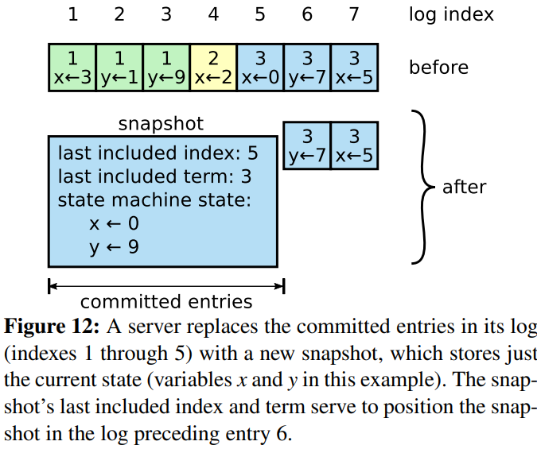

图 12：一个服务器用新的快照替换了从 1 到 5 的条目，快照值存储了当前的状态。快照中包含了最后的索引位置和任期号。

>Although servers normally take snapshots independently, the leader must occasionally send snapshots to followers that lag behind. This happens when the leader has already discarded the next log entry that it needs to send to a follower. Fortunately, this situation is unlikely in normal operation: a follower that has kept up with the leader would already have this entry. However, an exceptionally slow follower or a new server joining the cluster (Section 6) would not. The way to bring such a follower up-to-date is for the leader to send it a snapshot over the network.

尽管通常服务器都是独立地创建快照，但是领导者必须偶尔的发送快照给一些落后的跟随者。这通常发生在当领导者已经丢弃了下一条需要发送给跟随者的日志条目的时候。幸运的是这种情况不是常规操作：一个与领导者保持同步的跟随者通常都会有这个条目。然而一个运行非常缓慢的跟随者或者新加入集群的服务器（第 6 节）将不会有这个条目。这时让这个跟随者更新到最新的状态的方式就是通过网络把快照发送给他们。

>The leader uses a new RPC called InstallSnapshot to send snapshots to followers that are too far behind; see Figure 13. When a follower receives a snapshot with this RPC, it must decide what to do with its existing log entries. Usually the snapshot will contain new information not already in the recipient’s log. In this case, the follower discards its entire log; it is all superseded by the snapshot and may possibly have uncommitted entries that conflict with the snapshot. If instead the follower receives a snapshot that describes a prefix of its log (due to retransmission or by mistake), then log entries covered by the snapshot are deleted but entries following the snapshot are still valid and must be retained.

在这种情况下领导者使用一种叫做 InstallSnapshot 的新的 RPC 来发送快照给太落后的跟随者；见图 13。当跟随者通过这种 RPC 接收到快照时，他必须自己决定对于已经存在的日志该如何处理。通常快照会包含没有在接收者日志中存在的信息。在这种情况下，跟随者丢弃其整个日志；它全部被快照取代，并且可能包含与快照冲突的未提交条目。如果接收到的快照是自己日志的前面部分（由于网络重传或者错误），那么被快照包含的条目将会被全部删除，但是快照后面的条目仍然有效，必须保留。

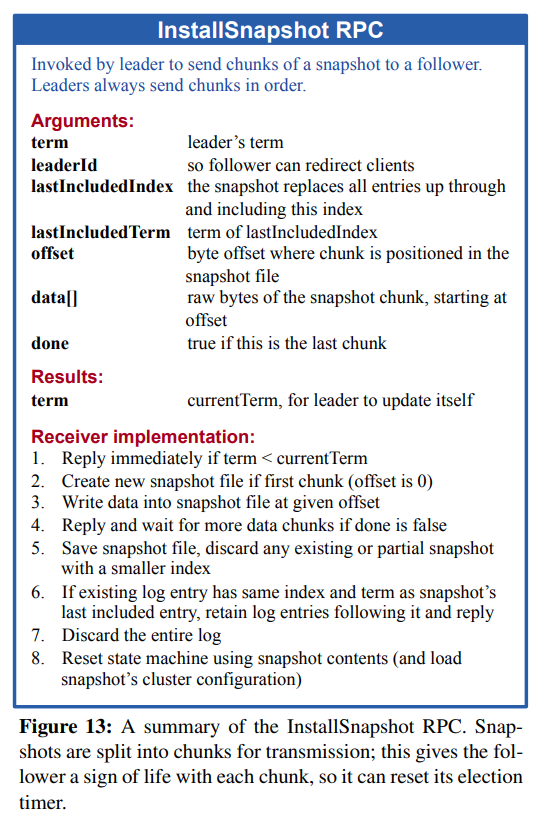

图 13：一个关于 InstallSnapshot 的简要概述。为了便于传输，快照被切割成块；每个分块都相当于告诉 follower 主还活着，所以 follower 可以重置选举超时计时器。

**InstallSnapshot RPC**

由领导者调用以将快照的分块发送给跟随者。领导者总是按顺序发送分块。

| 参数              | 解释                                |
| ----------------- | ----------------------------------- |
| term              | 领导者的任期号                      |
| leaderId          | 领导者的 ID，以便于跟随者重定向请求 |
| lastIncludedIndex | 快照中包含的最后日志条目的索引值    |
| lastIncludedTerm  | 快照中包含的最后日志条目的任期号    |
| offset            | 分块在快照中的字节偏移量            |
| data[]            | 从偏移量开始的快照分块的原始字节    |
| done              | 如果这是最后一个分块则为 true       |

| 结果 | 解释                                          |
| ---- | --------------------------------------------- |
| term | 当前任期号（currentTerm），便于领导者更新自己 |

接收者实现：

1.  如果 `term < currentTerm` 就立即回复
2.  如果是第一个分块（offset 为 0）就创建一个新的快照
3.  在指定偏移量写入数据
4.  如果 done 是 false，则继续等待更多的数据
5.  保存快照文件，丢弃具有较小索引的任何现有或部分快照
6.  如果现存的日志条目与快照中最后包含的日志条目具有相同的索引值和任期号，则保留其后的日志条目并进行回复
7.  丢弃整个日志
8.  使用快照重置状态机（并加载快照的集群配置）

>This snapshotting approach departs from Raft’s strong leader principle, since followers can take snapshots without the knowledge of the leader. However, we think this departure is justified. While having a leader helps avoid conflicting decisions in reaching consensus, consensus has already been reached when snapshotting, so no decisions conflict. Data still only flows from leaders to followers, just followers can now reorganize their data.

这种快照的方式背离了 Raft 的强领导者原则，因为跟随者可以在不知道领导者情况下创建快照。但是我们认为这种背离是值得的。领导者的存在，是为了解决在达成一致性的时候的冲突，但是在创建快照的时候，一致性已经达成，这时不存在冲突了，所以没有领导者也是可以的。数据依然是从领导者传给跟随者，只是跟随者可以重新组织他们的数据了。

>We considered an alternative leader-based approach in which only the leader would create a snapshot, then it would send this snapshot to each of its followers. However, this has two disadvantages. First, sending the snapshot to each follower would waste network bandwidth and slow the snapshotting process. Each follower already has the information needed to produce its own snapshots, and it is typically much cheaper for a server to produce a snapshot from its local state than it is to send and receive one over the network. Second, the leader’s implementation would be more complex. For example, the leader would need to send snapshots to followers in parallel with replicating new log entries to them, so as not to block new client requests.

我们考虑过一种替代的基于领导者的快照方案，即只有领导者创建快照，然后发送给所有的跟随者。但是这样做有两个缺点。第一，发送快照会浪费网络带宽并且延缓了快照处理的时间。每个跟随者都已经拥有了所有产生快照需要的信息，而且很显然，自己从本地的状态中创建快照比通过网络接收别人发来的要经济。第二，领导者的实现会更加复杂。例如，领导者需要发送快照的同时并行的将新的日志条目发送给跟随者，这样才不会阻塞新的客户端请求。

>There are two more issues that impact snapshotting performance. First, servers must decide when to snapshot. If a server snapshots too often, it wastes disk bandwidth and energy; if it snapshots too infrequently, it risks exhausting its storage capacity, and it increases the time required to replay the log during restarts. One simple strategy is to take a snapshot when the log reaches a fixed size in bytes. If this size is set to be significantly larger than the expected size of a snapshot, then the disk bandwidth overhead for snapshotting will be small.

还有两个问题影响了快照的性能。首先，服务器必须决定什么时候应该创建快照。如果快照创建的过于频繁，那么就会浪费大量的磁盘带宽和其他资源；如果创建快照频率太低，他就要承受耗尽存储容量的风险，同时也增加了从日志重建的时间。一个简单的策略就是当日志大小达到一个固定大小的时候就创建一次快照。如果这个阈值设置的显著大于期望的快照的大小，那么快照对磁盘压力的影响就会很小了。

>The second performance issue is that writing a snapshot can take a significant amount of time, and we do not want this to delay normal operations. The solution is to use copy-on-write techniques so that new updates can be accepted without impacting the snapshot being written. For example, state machines built with functional data structures naturally support this. Alternatively, the operating system’s copy-on-write support (e.g., fork on Linux) can be used to create an in-memory snapshot of the entire state machine (our implementation uses this approach).

第二个影响性能的问题就是写入快照需要花费显著的一段时间，并且我们还不希望影响到正常操作。解决方案是通过写时复制的技术，这样新的更新就可以被接收而不影响到快照。例如，具有函数式数据结构的状态机天然支持这样的功能。另外，操作系统的写时复制技术的支持（如 Linux 上的 fork）可以被用来创建完整的状态机的内存快照（我们的实现就是这样的）。


---

# 客户端交互

>This section describes how clients interact with Raft, including how clients find the cluster leader and how Raft supports linearizable semantics [10]. These issues apply to all consensus-based systems, and Raft’s solutions are similar to other systems.

这一节将介绍客户端是如何和 Raft 进行交互的，包括客户端如何发现领导者和 Raft 是如何支持线性化语义的。这些问题对于所有基于一致性的系统都存在，并且 Raft 的解决方案和其他的也差不多。

>Clients of Raft send all of their requests to the leader. When a client first starts up, it connects to a randomlychosen server. If the client’s first choice is not the leader, that server will reject the client’s request and supply information about the most recent leader it has heard from (AppendEntries requests include the network address of the leader). If the leader crashes, client requests will time out; clients then try again with randomly-chosen servers.

Raft 中的客户端发送所有请求给领导者。当客户端启动的时候，他会随机挑选一个服务器进行通信。如果客户端第一次挑选的服务器不是领导者，那么那个服务器会拒绝客户端的请求并且提供他最近接收到的领导者的信息（附加条目请求包含了领导者的网络地址）。如果领导者已经崩溃了，那么客户端的请求就会超时；客户端之后会再次重试随机挑选服务器的过程。

>Our goal for Raft is to implement linearizable semantics (each operation appears to execute instantaneously, exactly once, at some point between its invocation and its response). However, as described so far Raft can execute a command multiple times: for example, if the leader crashes after committing the log entry but before responding to the client, the client will retry the command with a new leader, causing it to be executed a second time. The solution is for clients to assign unique serial numbers to every command. Then, the state machine tracks the latest serial number processed for each client, along with the associated response. If it receives a command whose serial number has already been executed, it responds immediately without re-executing the request.

我们 Raft 的目标是要实现线性化语义（每一次操作立即执行，只执行一次，在他调用和收到回复之间）。但是，如上述，Raft 是可能执行同一条命令多次的：例如，如果领导者在提交了这条日志之后，但是在响应客户端之前崩溃了，那么客户端会和新的领导者重试这条指令，导致这条命令就被再次执行了。解决方案就是客户端对于每一条指令都赋予一个唯一的序列号。然后，状态机跟踪每条指令最新的序列号和相应的响应。如果接收到一条指令，它的序列号已经被执行了，那么就立即返回结果，而不重新执行指令。

>Read-only operations can be handled without writing anything into the log. However, with no additional measures, this would run the risk of returning stale data, since the leader responding to the request might have been superseded by a newer leader of which it is unaware. Linearizable reads must not return stale data, and Raft needs two extra precautions to guarantee this without using the log. First, a leader must have the latest information on which entries are committed. The Leader Completeness Property guarantees that a leader has all committed entries, but at the start of its term, it may not know which those are. To find out, it needs to commit an entry from its term. Raft handles this by having each leader commit a blank no-op entry into the log at the start of its term. Second, a leader must check whether it has been deposed before processing a read-only request (its information may be stale if a more recent leader has been elected). Raft handles this by having the leader exchange heartbeat messages with a majority of the cluster before responding to read-only requests. Alternatively, the leader could rely on the heartbeat mechanism to provide a form of lease [9], but this would rely on timing for safety (it assumes bounded clock skew).

只读的操作可以直接处理而不需要记录日志。但是，在不增加任何限制的情况下，这么做可能会冒着返回脏数据的风险，因为响应客户端请求的领导者可能在他不知道的时候已经被新的领导者取代了。线性化的读操作必须不能返回脏数据，Raft 需要使用两个额外的措施在不使用日志的情况下保证这一点。首先，领导者必须有关于被提交日志的最新信息。领导者完全特性保证了领导者一定拥有所有已经被提交的日志条目，但是在他任期开始的时候，他可能不知道哪些是已经被提交的。为了知道这些信息，他需要在他的任期里提交一条日志条目。Raft 中通过领导者在任期开始的时候提交一个空白的没有任何操作的日志条目到日志中去来实现。第二，领导者在处理只读的请求之前必须检查自己是否已经被废黜了（他自己的信息已经变脏了如果一个更新的领导者被选举出来）。Raft 中通过让领导者在响应只读请求之前，先和集群中的大多数节点交换一次心跳信息来处理这个问题。可选的，领导者可以依赖心跳机制来实现一种租约的机制，但是这种方法依赖时间来保证安全性（假设时间误差是有界的）。


---

# 算法实现和评估

>We have implemented Raft as part of a replicated state machine that stores configuration information for RAMCloud [33] and assists in failover of the RAMCloud coordinator. The Raft implementation contains roughly 2000 lines of C++ code, not including tests, comments, or blank lines. The source code is freely available [23]. There are also about 25 independent third-party open source implementations [34] of Raft in various stages of development, based on drafts of this paper. Also, various companies are deploying Raft-based systems [34].

我们已经为 RAMCloud 实现了 Raft 算法作为存储配置信息的复制状态机的一部分，并且帮助 RAMCloud 协调故障转移。这个 Raft 实现包含大约 2000 行 C++ 代码，其中不包括测试、注释和空行。这些代码是开源的。同时也有大约 25 个其他独立的第三方的基于这篇论文草稿的开源实现，针对不同的开发场景。同时，很多公司已经部署了基于 Raft 的系统。

>The remainder of this section evaluates Raft using three criteria: understandability, correctness, and performance.

这一节会从三个方面来评估 Raft 算法：可理解性、正确性和性能。


## 可理解性

>To measure Raft’s understandability relative to Paxos, we conducted an experimental study using upper-level undergraduate and graduate students in an Advanced Operating Systems course at Stanford University and a Distributed Computing course at U.C. Berkeley. We recorded a video lecture of Raft and another of Paxos, and created corresponding quizzes. The Raft lecture covered the content of this paper except for log compaction; the Paxos lecture covered enough material to create an equivalent replicated state machine, including single-decree Paxos, multi-decree Paxos, reconfiguration, and a few optimizations needed in practice (such as leader election). The quizzes tested basic understanding of the algorithms and also required students to reason about corner cases. Each student watched one video, took the corresponding quiz, watched the second video, and took the second quiz. About half of the participants did the Paxos portion first and the other half did the Raft portion first in order to account for both individual differences in performance and experience gained from the first portion of the study. We compared participants’ scores on each quiz to determine whether participants showed a better understanding of Raft.

为了和 Paxos 比较 Raft 算法的可理解能力，我们针对高层次的本科生和研究生，在斯坦福大学的高级操作系统课程和加州大学伯克利分校的分布式计算课程上，进行了一次学习的实验。我们分别拍了针对 Raft 和 Paxos 的视频课程，并准备了相应的小测验。Raft 的视频讲课覆盖了这篇论文的所有内容除了日志压缩；Paxos 讲课包含了足够的资料来创建一个等价的复制状态机，包括单决策 Paxos，多决策 Paxos，重新配置和一些实际系统需要的性能优化（例如领导者选举）。小测验测试一些对算法的基本理解和解释一些边角的示例。每个学生都是看完第一个视频，回答相应的测试，再看第二个视频，回答相应的测试。大约有一半的学生先进行 Paxos 部分，然后另一半先进行 Raft 部分，这是为了说明两者从第一部分的算法学习中获得的表现和经验的差异。我们计算参加人员的每一个小测验的得分来看参与者是否在 Raft 算法上更加容易理解。

>We tried to make the comparison between Paxos and Raft as fair as possible. The experiment favored Paxos in two ways: 15 of the 43 participants reported having some prior experience with Paxos, and the Paxos video is 14% longer than the Raft video. As summarized in Table 1, we have taken steps to mitigate potential sources of bias. All of our materials are available for review [28, 31].

我们尽可能的使得 Paxos 和 Raft 的比较更加公平。这个实验偏爱 Paxos 表现在两个方面：43 个参加者中有 15 个人在之前有一些 Paxos 的经验，并且 Paxos 的视频要长 14%。如表格 1 总结的那样，我们采取了一些措施来减轻这种潜在的偏见。我们所有的材料都可供审查。

| 关心           | 缓和偏见采取的手段                                           | 可供查看的材料     |
| -------------- | ------------------------------------------------------------ | ------------------ |
| 相同的讲课质量 | 两者使用同一个讲师。Paxos 使用的是现在很多大学里经常使用的。Paxos 会长 14%。 | 视频               |
| 相同的测验难度 | 问题以难度分组，在两个测验里成对出现。                       | 小测验             |
| 公平评分       | 使用评价量规。随机顺序打分，两个测验交替进行。               | 评价量规（rubric） |

>On average, participants scored 4.9 points higher on the Raft quiz than on the Paxos quiz (out of a possible 60 points, the mean Raft score was 25.7 and the mean Paxos score was 20.8); Figure 14 shows their individual scores. A paired t-test states that, with 95% confidence, the true distribution of Raft scores has a mean at least 2.5 points larger than the true distribution of Paxos scores.

参加者平均在 Raft 的测验中比 Paxos 高 4.9 分（总分 60，那么 Raft 的平均得分是 25.7，而 Paxos 是 20.8）；图 14 展示了每个参与者的得分。配置t-检验（又称student‘s t-test）表明，在 95% 的可信度下，真实的 Raft 分数分布至少比 Paxos 高 2.5 分。

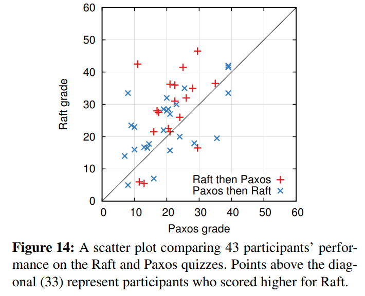

图 14：一个散点图表示了 43 个学生在 Paxos 和 Raft 的小测验中的成绩。在对角线之上的点表示在 Raft 获得了更高分数的学生。

>We also created a linear regression model that predicts a new student’s quiz scores based on three factors: which quiz they took, their degree of prior Paxos experience, and the order in which they learned the algorithms. The model predicts that the choice of quiz produces a 12.5-point difference in favor of Raft. This is significantly higher than the observed difference of 4.9 points, because many of the actual students had prior Paxos experience, which helped Paxos considerably, whereas it helped Raft slightly less. Curiously, the model also predicts scores 6.3 points lower on Raft for people that have already taken the Paxos quiz; although we don’t know why, this does appear to be statistically significant.

我们也建立了一个线性回归模型来预测一个新的学生的测验成绩，基于以下三个因素：他们使用的是哪个小测验，之前对 Paxos 的经验，和学习算法的顺序。模型预测，对小测验的选择会产生 12.5 分的差别。这显著的高于之前的 4.9 分，因为很多学生在之前都已经有了对于 Paxos 的经验，这相当明显的帮助 Paxos，对 Raft 就没什么太大影响了。但是奇怪的是，模型预测对于先进行 Paxos 小测验的人而言，Raft的得分低了6.3分; 虽然我们不知道为什么，这似乎在统计上是有意义的。

>We also surveyed participants after their quizzes to see which algorithm they felt would be easier to implement or explain; these results are shown in Figure 15. An overwhelming majority of participants reported Raft would be easier to implement and explain (33 of 41 for each question). However, these self-reported feelings may be less reliable than participants’ quiz scores, and participants may have been biased by knowledge of our hypothesis that Raft is easier to understand.

我们同时也在测验之后调查了参与者，他们认为哪个算法更加容易实现和解释；这个的结果在图 15 上。压倒性的结果表明 Raft 算法更加容易实现和解释（41 人中的 33个）。但是，这种自己报告的结果不如参与者的成绩更加可信，并且参与者可能因为我们的 Raft 更加易于理解的假说而产生偏见。

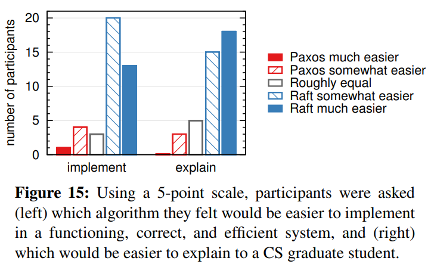

图 15：通过一个 5 分制的问题，参与者（左边）被问哪个算法他们觉得在一个高效正确的系统里更容易实现，右边被问哪个更容易向学生解释。

>A detailed discussion of the Raft user study is available at [31].

关于 Raft 用户学习有一个更加详细的讨论。


## 正确性

>We have developed a formal specification and a proof of safety for the consensus mechanism described in Section 5. The formal specification [31] makes the information summarized in Figure 2 completely precise using the TLA+ specification language [17]. It is about 400 lines long and serves as the subject of the proof. It is also useful on its own for anyone implementing Raft. We have mechanically proven the Log Completeness Property using the TLA proof system [7]. However, this proof relies on invariants that have not been mechanically checked (for example, we have not proven the type safety of the specification). Furthermore, we have written an informal proof [31] of the State Machine Safety property which is complete (it relies on the specification alone) and relatively precise (it is about 3500 words long).

在第 5 节，我们已经制定了正式的规范，和对一致性机制的安全性证明。这个正式规范使用 TLA+ 规范语言使图 2 中总结的信息非常清晰。它长约400行，并作为证明的主题。同时对于任何想实现 Raft 的人也是十分有用的。我们通过 TLA 证明系统非常机械的证明了日志完全特性。然而，这个证明依赖的约束前提还没有被机械证明（例如，我们还没有证明规范的类型安全）。而且，我们已经写了一个非正式的证明关于状态机安全性是完备的，并且是相当清晰的（大约 3500 个词）。


## 性能

>Raft’s performance is similar to other consensus algorithms such as Paxos. The most important case for performance is when an established leader is replicating new log entries. Raft achieves this using the minimal number of messages (a single round-trip from the leader to half the cluster). It is also possible to further improve Raft’s performance. For example, it easily supports batching and pipelining requests for higher throughput and lower latency. Various optimizations have been proposed in the literature for other algorithms; many of these could be applied to Raft, but we leave this to future work.

Raft 和其他一致性算法例如 Paxos 有着差不多的性能。在性能方面，最重要的关注点是，当领导者被选举成功时，什么时候复制新的日志条目。Raft 通过很少数量的消息包（一轮从领导者到集群大多数机器的消息）就达成了这个目的。同时，进一步提升 Raft 的性能也是可行的。例如，很容易通过支持批量操作和管道操作来提高吞吐量和降低延迟。对于其他一致性算法已经提出过很多性能优化方案；其中有很多也可以应用到 Raft 中来，但是我们暂时把这个问题放到未来的工作中去。

>We used our Raft implementation to measure the performance of Raft’s leader election algorithm and answer two questions. First, does the election process converge quickly? Second, what is the minimum downtime that can be achieved after leader crashes?

我们使用我们自己的 Raft 实现来衡量 Raft 领导者选举的性能并且回答两个问题。首先，领导者选举的过程收敛是否快速？第二，在领导者宕机之后，最小的系统宕机时间是多久？

>To measure leader election, we repeatedly crashed the leader of a cluster of five servers and timed how long it took to detect the crash and elect a new leader (see Figure 16). To generate a worst-case scenario, the servers in each trial had different log lengths, so some candidates were not eligible to become leader. Furthermore, to encourage split votes, our test script triggered a synchronized broadcast of heartbeat RPCs from the leader before terminating its process (this approximates the behavior of the leader replicating a new log entry prior to crashing). The leader was crashed uniformly randomly within its heartbeat interval, which was half of the minimum election timeout for all tests. Thus, the smallest possible downtime was about half of the minimum election timeout.

为了衡量领导者选举，我们反复的使一个拥有五个节点的服务器集群的领导者宕机，并计算需要多久才能发现领导者已经宕机并选出一个新的领导者（见图 16）。为了构建一个最坏的场景，在每一的尝试里，服务器都有不同长度的日志，意味着有些候选者是没有成为领导者的资格的。另外，为了促成选票瓜分的情况，我们的测试脚本在终止领导者之前同步的发送了一次心跳广播（这大约和领导者在崩溃前复制一个新的日志给其他机器很像）。领导者均匀的随机的在心跳间隔里宕机，也就是最小选举超时时间的一半。因此，最小宕机时间大约就是最小选举超时时间的一半。

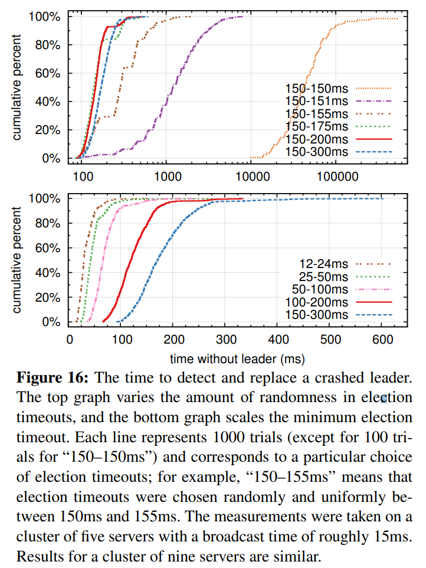

图 16：发现并替换一个已经崩溃的领导者的时间。上面的图考察了在选举超时时间上的随机化程度，下面的图考察了最小选举超时时间。每条线代表了 1000 次实验（除了 150-150 毫秒只试了 100 次），和相应的确定的选举超时时间。例如，150-155 毫秒意思是，选举超时时间从这个区间范围内随机选择并确定下来。这个实验在一个拥有 5 个节点的集群上进行，其广播时延大约是 15 毫秒。对于 9 个节点的集群，结果也差不多。

>The top graph in Figure 16 shows that a small amount of randomization in the election timeout is enough to avoid split votes in elections. In the absence of randomness, leader election consistently took longer than 10 seconds in our tests due to many split votes. Adding just 5ms of randomness helps significantly, resulting in a median downtime of 287ms. Using more randomness improves worst-case behavior: with 50ms of randomness the worstcase completion time (over 1000 trials) was 513ms.

图 16 中上面的图表明，只需要在选举超时时间上使用很少的随机化就可以大大避免选票被瓜分的情况。在没有随机化的情况下，在我们的测试里，选举过程往往都需要花费超过 10 秒钟由于太多的选票瓜分的情况。仅仅增加 5 毫秒的随机化时间，就大大的改善了选举过程，现在平均的宕机时间只有 287 毫秒。增加更多的随机化时间可以大大改善最坏情况：通过增加 50 毫秒的随机化时间，最坏的完成情况（1000 次尝试）只要 513 毫秒。

>The bottom graph in Figure 16 shows that downtime can be reduced by reducing the election timeout. With an election timeout of 12–24ms, it takes only 35ms on average to elect a leader (the longest trial took 152ms). However, lowering the timeouts beyond this point violates Raft’s timing requirement: leaders have difficulty broadcasting heartbeats before other servers start new elections. This can cause unnecessary leader changes and lower overall system availability. We recommend using a conservative election timeout such as 150–300ms; such timeouts are unlikely to cause unnecessary leader changes and will still provide good availability.

图 16 中下面的图显示，通过减少选举超时时间可以减少系统的宕机时间。在选举超时时间为 12-24 毫秒的情况下，只需要平均 35 毫秒就可以选举出新的领导者（最长的一次花费了 152 毫秒）。然而，进一步降低选举超时时间的话就会违反 Raft 的时间不等式需求：在选举新领导者之前，领导者就很难发送完心跳包。这会导致没有意义的领导者改变并降低了系统整体的可用性。我们建议使用更为保守的选举超时时间，比如 150-300 毫秒；这样的时间不大可能导致没有意义的领导者改变，而且依然提供不错的可用性。


---

# 相关工作

>There have been numerous publications related to consensus algorithms, many of which fall into one of the following categories: 
>
>• Lamport’s original description of Paxos [15], and attempts to explain it more clearly [16, 20, 21]. 
>
>• Elaborations of Paxos, which fill in missing details and modify the algorithm to provide a better foundation for implementation [26, 39, 13]. 
>
>• Systems that implement consensus algorithms, such as Chubby [2, 4], ZooKeeper [11, 12], and Spanner [6]. The algorithms for Chubby and Spanner have not been published in detail, though both claim to be based on Paxos. ZooKeeper’s algorithm has been published in more detail, but it is quite different from Paxos. 
>
>• Performance optimizations that can be applied to Paxos [18, 19, 3, 25, 1, 27]. 
>
>• Oki and Liskov’s Viewstamped Replication (VR), an alternative approach to consensus developed around the same time as Paxos. The original description [29] was intertwined with a protocol for distributed transactions, but the core consensus protocol has been separated in a recent update [22]. VR uses a leaderbased approach with many similarities to Raft.

已经有很多关于一致性算法的工作被发表出来，其中很多都可以归到下面的类别中：

-   Lamport 关于 Paxos 的原始描述，和尝试描述的更清晰。
-   关于 Paxos 的更详尽的描述，补充遗漏的细节并修改算法，使得可以提供更加容易的实现基础。
-   实现一致性算法的系统，例如 Chubby，ZooKeeper 和 Spanner。对于 Chubby 和 Spanner 的算法并没有公开发表其技术细节，尽管他们都声称是基于 Paxos 的。ZooKeeper 的算法细节已经发表，但是和 Paxos 着实有着很大的差别。
-   Paxos 可以应用的性能优化。
-   Oki 和 Liskov 的 Viewstamped Replication（VR），一种和 Paxos 差不多的替代算法。原始的算法描述和分布式传输协议耦合在了一起，但是核心的一致性算法在最近的更新里被分离了出来。VR 使用了一种基于领导者的方法，和 Raft 有很多相似之处。

>Raft’s strong leadership: Raft uses leader election as an essential part of the consensus protocol, and it concentrates as much functionality as possible in the leader. This approach results in a simpler algorithm that is easier to understand. For example, in Paxos, leader election is orthogonal to the basic consensus protocol: it serves only as a performance optimization and is not required for achieving consensus. However, this results in additional mechanism: Paxos includes both a two-phase protocol for basic consensus and a separate mechanism for leader election. In contrast, Raft incorporates leader election directly into the consensus algorithm and uses it as the first of the two phases of consensus. This results in less mechanism than in Paxos.

Raft 和 Paxos 最大的不同之处就在于 Raft 的强领导特性：Raft 使用领导者选举作为一致性协议里必不可少的部分，并且将尽可能多的功能集中到了领导者身上。这样就可以使得算法更加容易理解。例如，在 Paxos 中，领导者选举和基本的一致性协议是正交的：领导者选举仅仅是性能优化的手段，而且不是一致性所必须要求的。但是，这样就增加了多余的机制：Paxos 同时包含了针对基本一致性要求的两阶段提交协议和针对领导者选举的独立的机制。相比较而言，Raft 就直接将领导者选举纳入到一致性算法中，并作为两阶段一致性的第一步。这样就减少了很多机制。

>Like Raft, VR and ZooKeeper are leader-based and therefore share many of Raft’s advantages over Paxos. However, Raft has less mechanism that VR or ZooKeeper because it minimizes the functionality in non-leaders. For example, log entries in Raft flow in only one direction: outward from the leader in AppendEntries RPCs. In VR log entries flow in both directions (leaders can receive log entries during the election process); this results in additional mechanism and complexity. The published description of ZooKeeper also transfers log entries both to and from the leader, but the implementation is apparently more like Raft [35].

像 Raft 一样，VR 和 ZooKeeper 也是基于领导者的，因此他们也拥有一些 Raft 的优点。但是，Raft 比 VR 和 ZooKeeper 拥有更少的机制因为 Raft 尽可能的减少了非领导者的功能。例如，Raft 中日志条目都遵循着从领导者发送给其他人这一个方向：附加条目 RPC 是向外发送的。在 VR 中，日志条目的流动是双向的（领导者可以在选举过程中接收日志）；这就导致了额外的机制和复杂性。根据 ZooKeeper 公开的资料看，它的日志条目也是双向传输的，但是它的实现更像 Raft。

>Raft has fewer message types than any other algorithm for consensus-based log replication that we are aware of. For example, we counted the message types VR and ZooKeeper use for basic consensus and membership changes (excluding log compaction and client interaction, as these are nearly independent of the algorithms). VR and ZooKeeper each define 10 different message types, while Raft has only 4 message types (two RPC requests and their responses). Raft’s messages are a bit more dense than the other algorithms’, but they are simpler collectively. In addition, VR and ZooKeeper are described in terms of transmitting entire logs during leader changes; additional message types will be required to optimize these mechanisms so that they are practical.

和上述我们提及的其他基于一致性的日志复制算法中，Raft 的消息类型更少。例如，我们数了一下 VR 和 ZooKeeper 使用的用来基本一致性需要和成员改变的消息数（排除了日志压缩和客户端交互，因为这些都比较独立且和算法关系不大）。VR 和 ZooKeeper 都分别定义了 10 种不同的消息类型，相对的，Raft 只有 4 种消息类型（两种 RPC 请求和对应的响应）。Raft 的消息都稍微比其他算法的要信息量大，但是都很简单。另外，VR 和 ZooKeeper 都在领导者改变时传输了整个日志；所以为了能够实践中使用，额外的消息类型就很必要了。

>Raft’s strong leadership approach simplifies the algorithm, but it precludes some performance optimizations. For example, Egalitarian Paxos (EPaxos) can achieve higher performance under some conditions with a leaderless approach [27]. EPaxos exploits commutativity in state machine commands. Any server can commit a command with just one round of communication as long as other commands that are proposed concurrently commute with it. However, if commands that are proposed concurrently do not commute with each other, EPaxos requires an additional round of communication. Because any server may commit commands, EPaxos balances load well between servers and is able to achieve lower latency than Raft in WAN settings. However, it adds significant complexity to Paxos.

Raft 的强领导者模型简化了整个算法，但是同时也排斥了一些性能优化的方法。例如，平等主义 Paxos（EPaxos）在某些没有领导者的情况下可以达到很高的性能。平等主义 Paxos 充分发挥了在状态机指令中的交换性。任何服务器都可以在一轮通信下就提交指令，除非其他指令同时被提出了。然而，如果指令都是并发的被提出，并且互相之间不通信沟通，那么 EPaxos 就需要额外的一轮通信。因为任何服务器都可以提交指令，所以 EPaxos 在服务器之间的负载均衡做的很好，并且很容易在 WAN 网络环境下获得很低的延迟。但是，他在 Paxos 上增加了非常明显的复杂性。

>Several different approaches for cluster membership changes have been proposed or implemented in other work, including Lamport’s original proposal [15], VR [22], and SMART [24]. We chose the joint consensus approach for Raft because it leverages the rest of the consensus protocol, so that very little additional mechanism is required for membership changes. Lamport’s α-based approach was not an option for Raft because it assumes consensus can be reached without a leader. In comparison to VR and SMART, Raft’s reconfiguration algorithm has the advantage that membership changes can occur without limiting the processing of normal requests; in contrast, VR stops all normal processing during configuration changes, and SMART imposes an α-like limit on the number of outstanding requests. Raft’s approach also adds less mechanism than either VR or SMART.

一些集群成员变换的方法已经被提出或者在其他的工作中被实现，包括 Lamport 的原始的讨论，VR 和 SMART。我们选择使用共同一致的方法因为他对一致性协议的其他部分影响很小，这样我们只需要很少的一些机制就可以实现成员变换。Lamport 的基于 α 的方法之所以没有被 Raft 选择是因为它假设在没有领导者的情况下也可以达到一致性。和 VR 和 SMART 相比较，Raft 的重新配置算法可以在不限制正常请求处理的情况下进行；相比较的，VR 需要停止所有的处理过程，SMART 引入了一个和 α 类似的方法，限制了请求处理的数量。Raft 的方法同时也需要更少的额外机制来实现，和 VR、SMART 比较而言。


---

# 结论

>Algorithms are often designed with correctness, efficiency, and/or conciseness as the primary goals. Although these are all worthy goals, we believe that understandability is just as important. None of the other goals can be achieved until developers render the algorithm into a practical implementation, which will inevitably deviate from and expand upon the published form. Unless developers have a deep understanding of the algorithm and can create intuitions about it, it will be difficult for them to retain its desirable properties in their implementation.

算法的设计通常会把正确性，效率或者简洁作为主要的目标。尽管这些都是很有意义的目标，但是我们相信，可理解性也是一样的重要。在开发者把算法应用到实际的系统中之前，这些目标没有一个会被实现，这些都会必然的偏离发表时的形式。除非开发人员对这个算法有着很深的理解并且有着直观的感觉，否则将会对他们而言很难在实现的时候保持原有期望的特性。

>In this paper we addressed the issue of distributed consensus, where a widely accepted but impenetrable algorithm, Paxos, has challenged students and developers for many years. We developed a new algorithm, Raft, which we have shown to be more understandable than Paxos. We also believe that Raft provides a better foundation for system building. Using understandability as the primary design goal changed the way we approached the design of Raft; as the design progressed we found ourselves reusing a few techniques repeatedly, such as decomposing the problem and simplifying the state space. These techniques not only improved the understandability of Raft but also made it easier to convince ourselves of its correctness.

在这篇论文中，我们尝试解决分布式一致性问题，但是一个广为接受但是十分令人费解的算法 Paxos 已经困扰了无数学生和开发者很多年了。我们创造了一种新的算法 Raft，显而易见的比 Paxos 要容易理解。我们同时也相信，Raft 也可以为实际的实现提供坚实的基础。把可理解性作为设计的目标改变了我们设计 Raft 的方式；随着设计的进展，我们发现自己重复使用了一些技术，比如分解问题和简化状态空间。这些技术不仅提升了 Raft 的可理解性，同时也使我们坚信其正确性。


---

# 感谢

>The user study would not have been possible without the support of Ali Ghodsi, David Mazieres, and the students of CS 294-91 at Berkeley and CS 240 at Stanford. Scott Klemmer helped us design the user study, and Nelson Ray advised us on statistical analysis. The Paxos slides for the user study borrowed heavily from a slide deck originally created by Lorenzo Alvisi. Special thanks go to David Mazieres and Ezra Hoch for finding subtle bugs in Raft. Many people provided helpful feedback on the paper and user study materials, including Ed Bugnion, Michael Chan, Hugues Evrard, Daniel Giffin, Arjun Gopalan, Jon Howell, Vimalkumar Jeyakumar, Ankita Kejriwal, Aleksandar Kracun, Amit Levy, Joel Martin, Satoshi Matsushita, Oleg Pesok, David Ramos, Robbert van Renesse, Mendel Rosenblum, Nicolas Schiper, Deian Stefan, Andrew Stone, Ryan Stutsman, David Terei, Stephen Yang, Matei Zaharia, 24 anonymous conference reviewers (with duplicates), and especially our shepherd Eddie Kohler. Werner Vogels tweeted a link to an earlier draft, which gave Raft significant exposure. This work was supported by the Gigascale Systems Research Center and the Multiscale Systems Center, two of six research centers funded under the Focus Center Research Program, a Semiconductor Research Corporation program, by STARnet, a Semiconductor Research Corporation program sponsored by MARCO and DARPA, by the National Science Foundation under Grant No. 0963859, and by grants from Facebook, Google, Mellanox, NEC, NetApp, SAP, and Samsung. Diego Ongaro is supported by The Junglee Corporation Stanford Graduate Fellowship.


---

# References 

[1] BOLOSKY, W. J., BRADSHAW, D., HAAGENS, R. B., KUSTERS, N. P., AND LI, P. Paxos replicated state machines as the basis of a high-performance data store. In Proc. NSDI’11, USENIX Conference on Networked Systems Design and Implementation (2011), USENIX, pp. 141–154. 

[2] BURROWS, M. The Chubby lock service for looselycoupled distributed systems. In Proc. OSDI’06, Symposium on Operating Systems Design and Implementation (2006), USENIX, pp. 335–350. 

[3] CAMARGOS, L. J., SCHMIDT, R. M., AND PEDONE, F. Multicoordinated Paxos. In Proc. PODC’07, ACM Symposium on Principles of Distributed Computing (2007), ACM, pp. 316–317. 

[4] CHANDRA, T. D., GRIESEMER, R., AND REDSTONE, J. Paxos made live: an engineering perspective. In Proc. PODC’07, ACM Symposium on Principles of Distributed Computing (2007), ACM, pp. 398–407. 

[5] CHANG, F., DEAN, J., GHEMAWAT, S., HSIEH, W. C., WALLACH, D. A., BURROWS, M., CHANDRA, T., FIKES, A., AND GRUBER, R. E. Bigtable: a distributed storage system for structured data. In Proc. OSDI’06, USENIX Symposium on Operating Systems Design and Implementation (2006), USENIX, pp. 205–218. 

[6] CORBETT, J. C., DEAN, J., EPSTEIN, M., FIKES, A., FROST, C., FURMAN, J. J., GHEMAWAT, S., GUBAREV, A., HEISER, C., HOCHSCHILD, P., HSIEH, W., KANTHAK, S., KOGAN, E., LI, H., LLOYD, A., MELNIK, S., MWAURA, D., NAGLE, D., QUINLAN, S., RAO, R., ROLIG, L., SAITO, Y., SZYMANIAK, M., TAYLOR, C., WANG, R., AND WOODFORD, D. Spanner: Google’s globally-distributed database. In Proc. OSDI’12, USENIX Conference on Operating Systems Design and Implementation (2012), USENIX, pp. 251–264. 

[7] COUSINEAU, D., DOLIGEZ, D., LAMPORT, L., MERZ, S., RICKETTS, D., AND VANZETTO, H. TLA+ proofs. In Proc. FM’12, Symposium on Formal Methods (2012), D. Giannakopoulou and D. M´ery, Eds., vol. 7436 of Lecture Notes in Computer Science, Springer, pp. 147–154. 

[8] GHEMAWAT, S., GOBIOFF, H., AND LEUNG, S.-T. The Google file system. In Proc. SOSP’03, ACM Symposium on Operating Systems Principles (2003), ACM, pp. 29–43. 

[9] GRAY, C., AND CHERITON, D. Leases: An efficient faulttolerant mechanism for distributed file cache consistency. In Proceedings of the 12th ACM Ssymposium on Operating Systems Principles (1989), pp. 202–210. 

[10] HERLIHY, M. P., AND WING, J. M. Linearizability: a correctness condition for concurrent objects. ACM Transactions on Programming Languages and Systems 12 (July 1990), 463–492. 

[11] HUNT, P., KONAR, M., JUNQUEIRA, F. P., AND REED, B. ZooKeeper: wait-free coordination for internet-scale systems. In Proc ATC’10, USENIX Annual Technical Conference (2010), USENIX, pp. 145–158. 

[12] JUNQUEIRA, F. P., REED, B. C., AND SERAFINI, M. Zab: High-performance broadcast for primary-backup systems. In Proc. DSN’11, IEEE/IFIP Int’l Conf. on Dependable Systems & Networks (2011), IEEE Computer Society, pp. 245–256. 

[13] KIRSCH, J., AND AMIR, Y. Paxos for system builders. Tech. Rep. CNDS-2008-2, Johns Hopkins University, 2008. 

[14] LAMPORT, L. Time, clocks, and the ordering of events in a distributed system. Commununications of the ACM 21, 7 (July 1978), 558–565. 

[15] LAMPORT, L. The part-time parliament. ACM Transactions on Computer Systems 16, 2 (May 1998), 133–169. 

[16] LAMPORT, L. Paxos made simple. ACM SIGACT News 32, 4 (Dec. 2001), 18–25. 

[17] LAMPORT, L. Specifying Systems, The TLA+ Language and Tools for Hardware and Software Engineers. AddisonWesley, 2002. 

[18] LAMPORT, L. Generalized consensus and Paxos. Tech. Rep. MSR-TR-2005-33, Microsoft Research, 2005. 

[19] LAMPORT, L. Fast paxos. Distributed Computing 19, 2 (2006), 79–103. 

[20] LAMPSON, B. W. How to build a highly available system using consensus. In Distributed Algorithms, O. Baboaglu and K. Marzullo, Eds. Springer-Verlag, 1996, pp. 1–17. 

[21] LAMPSON, B. W. The ABCD’s of Paxos. In Proc. PODC’01, ACM Symposium on Principles of Distributed Computing (2001), ACM, pp. 13–13. 

[22] LISKOV, B., AND COWLING, J. Viewstamped replication revisited. Tech. Rep. MIT-CSAIL-TR-2012-021, MIT, July 2012. 

[23] LogCabin source code. http://github.com/ logcabin/logcabin.

[24] LORCH, J. R., ADYA, A., BOLOSKY, W. J., CHAIKEN, R., DOUCEUR, J. R., AND HOWELL, J. The SMART way to migrate replicated stateful services. In Proc. EuroSys’06, ACM SIGOPS/EuroSys European Conference on Computer Systems (2006), ACM, pp. 103–115. 

[25] MAO, Y., JUNQUEIRA, F. P., AND MARZULLO, K. Mencius: building efficient replicated state machines for WANs. In Proc. OSDI’08, USENIX Conference on Operating Systems Design and Implementation (2008), USENIX, pp. 369–384. 

[26] MAZIERES , D. Paxos made practical. http: //www.scs.stanford.edu/˜dm/home/ papers/paxos.pdf, Jan. 2007.

[27] MORARU, I., ANDERSEN, D. G., AND KAMINSKY, M. There is more consensus in egalitarian parliaments. In Proc. SOSP’13, ACM Symposium on Operating System Principles (2013), ACM. 

[28] Raft user study. http://ramcloud.stanford. edu/˜ongaro/userstudy/.

[29] OKI, B. M., AND LISKOV, B. H. Viewstamped replication: A new primary copy method to support highly-available distributed systems. In Proc. PODC’88, ACM Symposium on Principles of Distributed Computing (1988), ACM, pp. 8–17. 

[30] O’NEIL, P., CHENG, E., GAWLICK, D., AND ONEIL, E. The log-structured merge-tree (LSM-tree). Acta Informatica 33, 4 (1996), 351–385.

[31] ONGARO, D. Consensus: Bridging Theory and Practice. PhD thesis, Stanford University, 2014 (work in progress). http://ramcloud.stanford.edu/˜ongaro/ thesis.pdf. 

[32] ONGARO, D., AND OUSTERHOUT, J. In search of an understandable consensus algorithm. In Proc ATC’14, USENIX Annual Technical Conference (2014), USENIX. 

[33] OUSTERHOUT, J., AGRAWAL, P., ERICKSON, D., KOZYRAKIS, C., LEVERICH, J., MAZIERES ` , D., MITRA, S., NARAYANAN, A., ONGARO, D., PARULKAR, G., ROSENBLUM, M., RUMBLE, S. M., STRATMANN, E., AND STUTSMAN, R. The case for RAMCloud. Communications of the ACM 54 (July 2011), 121–130.

[34] Raft consensus algorithm website. http://raftconsensus.github.io. 

[35] REED, B. Personal communications, May 17, 2013. 

[36] ROSENBLUM, M., AND OUSTERHOUT, J. K. The design and implementation of a log-structured file system. ACM Trans. Comput. Syst. 10 (February 1992), 26–52. 

[37] SCHNEIDER, F. B. Implementing fault-tolerant services using the state machine approach: a tutorial. ACM Computing Surveys 22, 4 (Dec. 1990), 299–319. 

[38] SHVACHKO, K., KUANG, H., RADIA, S., AND CHANSLER, R. The Hadoop distributed file system. In Proc. MSST’10, Symposium on Mass Storage Systems and Technologies (2010), IEEE Computer Society, pp. 1–10. 

[39] VAN RENESSE, R. Paxos made moderately complex. Tech. rep., Cornell University, 2012.


