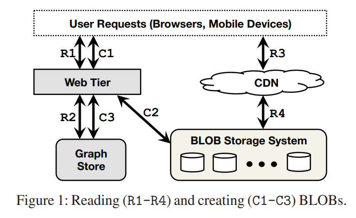
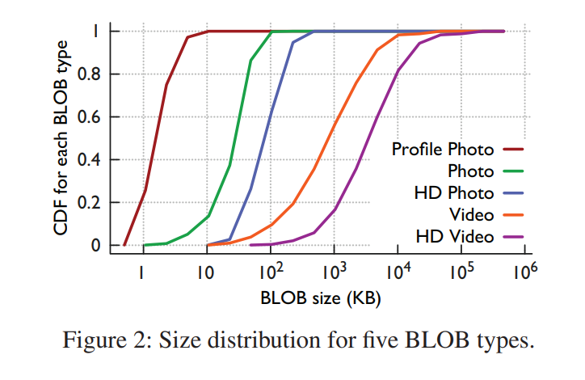
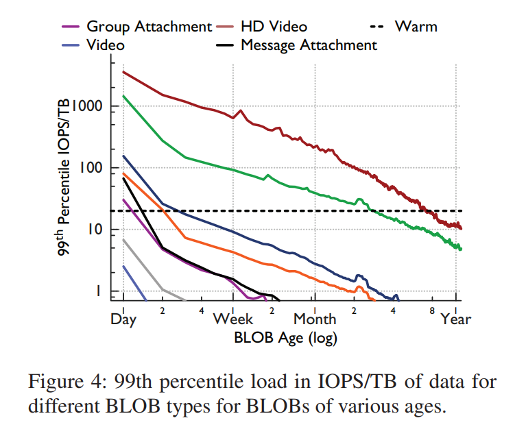
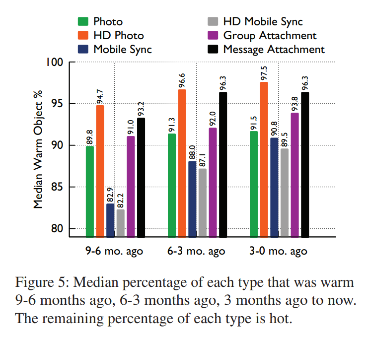
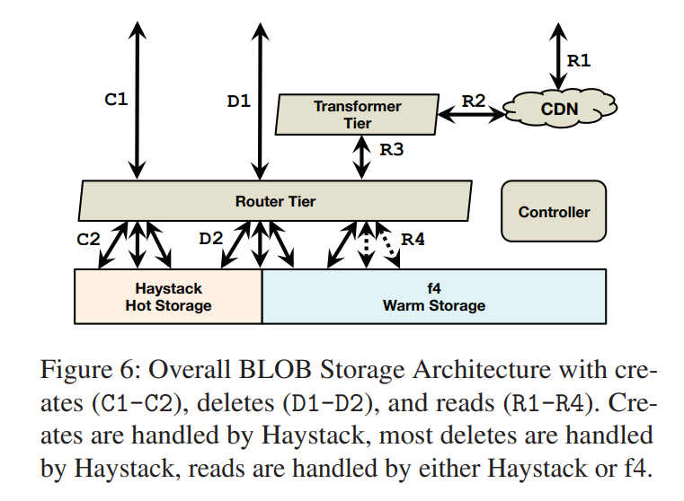
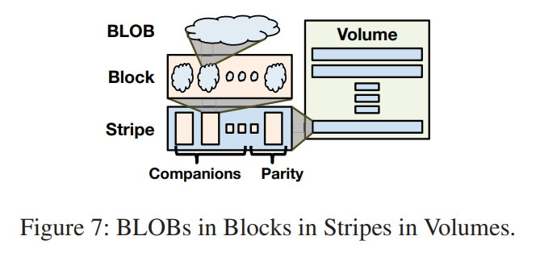
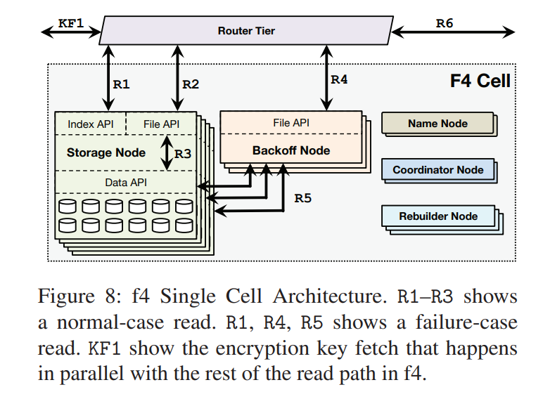
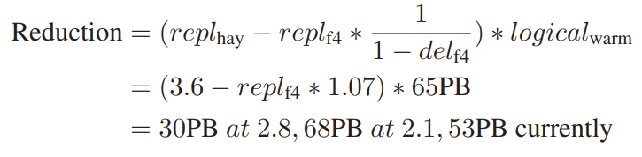

F4 论文导读：[f4: Facebook’s Warm BLOB Storage System](https://www.usenix.org/system/files/conference/osdi14/osdi14-paper-muralidhar.pdf)

---

摘要

>Facebook’s corpus of photos, videos, and other Binary Large OBjects (BLOBs) that need to be reliably stored and quickly accessible is massive and continues to grow. As the footprint of BLOBs increases, storing them in our traditional storage system, Haystack, is becoming increasingly inefficient. To increase our storage efficiency, measured in the effective-replication-factor of BLOBs, we examine the underlying access patterns of BLOBs and identify temperature zones that include hot BLOBs that are accessed frequently and warm BLOBs that are accessed far less often. Our overall BLOB storage system is designed to isolate warm BLOBs and enable us to use a specialized warm BLOB storage system, f4. f4 is a new system that lowers the effective-replication-factor of warm BLOBs while remaining fault tolerant and able to support the lower throughput demands.

Facebook 的照片、视频和其他需要可靠存储和快速访问的二进制大型对象（BLOB）的体量是巨大的，并且还在继续增长。随着 BLOB 数量的增加，将它们存储在我们的传统存储系统 Haystack 中的效率越来越低。为了提高我们的存储效率（以 BLOB 的有效冗余系数衡量），我们检查了 BLOB 的基本访问模式，并确定了包括频繁访问的 hot BLOB 和访问频率低得多的 warm BLOB 的温度区。我们的存储系统被设计成 hot/warm 隔离，这样我们能够使用一个专门的 warm BLOB 存储系统，f4。f4 是一个新的系统，它降低了 warm BLOB 的有效冗余系数，同时保持了容错性，能够支持较低的吞吐量需求。

>f4 currently stores over 65PBs of logical BLOBs and reduces their effective-replication-factor from 3.6 to either 2.8 or 2.1. f4 provides low latency; is resilient to disk, host, rack, and datacenter failures; and provides sufficient throughput for warm BLOBs.

f4 目前存储了超过 65PB 的逻辑 BLOB，并将其有效复制系数从 3.6 降至 2.8 或 2.1。f4 提供低延迟；对磁盘、主机、机架和数据中心故障域进行恢复；并为 warm BLOB 提供足够的吞吐量。

---

# 简介

>As Facebook has grown, and the amount of data shared per user has grown, storing data efficiently has become increasingly important. An important class of data that Facebook stores is Binary Large OBjects (BLOBs), which are immutable binary data. BLOBs are created once, read many times, never modified, and sometimes deleted. BLOB types at Facebook include photos, videos, documents, traces, heap dumps, and source code. The storage footprint of BLOBs is large. As of February 2014, Facebook stored over 400 billion photos.

随着 Facebook 的发展，每个用户共享的数据量也在增长，有效地存储数据变得越来越重要。Facebook 存储的一类重要数据是二进制大型对象（BLOB），它是不可改变的二进制数据。BLOBs 创建一次，读取多次，从不修改，有时也会删除。Facebook 的 BLOB 类型包括照片、视频、文档、踪迹、堆转储和源代码。BLOB 的存储量是很大的。截至 2014 年 2 月，Facebook 存储了超过 4000 亿张照片。

>Haystack [5], Facebook’s original BLOB storage system, has been in production for over seven years and is designed for IO-bound workloads. It reduces the number of disk seeks to read a BLOB to almost always one and triple replicates data for fault tolerance and to support a high request rate. However, as Facebook has grown and evolved, the BLOB storage workload has changed. The types of BLOBs stored have increased. The diversity in size and create, read, and delete rates has increased. And, most importantly, there is now a large and increasing number of BLOBs with low request rates. For these BLOBs, triple replication results in over provisioning from a throughput perspective. Yet, triple replication also provided important fault tolerance guarantees.

Haystack 是 Facebook 最初的对象存储系统，已经在生产环境运行了七年多。它将读取 BLOB 的磁盘寻求次数减少到几乎总是一次，并对数据进行三副本复制以实现容错。然而，随着 Facebook 的成长和发展，BLOB 存储的工作负载也发生了变化。而且，最重要的是，现在有大量而且越来越多的 BLOBs，其请求率很低。对于这些 BLOB，三副本消耗过多的存储空间。虽然三副本也提供了重要的容错保证。

>Our newer f4 BLOB storage system provides the same fault tolerance guarantees as Haystack but at a lower effective-replication-factor. f4 is simple, modular, scalable, and fault tolerant; it handles the request rate of BLOBs we store it in; it responds to requests with sufficiently low latency; it is tolerant to disk, host, rack and datacenter failures; and it provides all of this at a low effective-replication-factor.

新的 f4 系统以更低的有效冗余系数来提供相同的容错保障，它简单、模块化、可扩展、可容错并且响应还不错。

>We describe f4 as a warm BLOB storage system because the request rate for its content is lower than that for content in Haystack and thus is not as “hot.” Warm is also in contrast with cold storage systems [20, 40] that reliably store data but may take days or hours to retrieve it, which is unacceptably long for user-facing requests. We also describe BLOBs using temperature, with hot BLOBs receiving many requests and warm BLOBs receiving few.

我们将 f4 描述为一个 warm 对象存储系统，因为其内容的请求频率低于 Haystack 中的内容，因此不那么 hot。warm 也是与 cold 存储系统形成对比的，后者可靠地存储数据，但可能需要几天或几个小时才能检索到，这对于面向用户的请求来说是不可接受的时间。我们也用热度来描述 BLOB，hot BLOB 会频繁访问，而 warm BLOB 相比则会收到很少的请求。

>There is a strong correlation between the age of a BLOB and its temperature, as we will demonstrate. Newly created BLOBs are requested at a far higher rate than older BLOBs. For instance, the request rate for week-old BLOBs is an order of magnitude lower than for less-than-a-day old content for eight of nine examined types. In addition, there is a strong correlation between age and the deletion rate. We use these findings to inform our design: the lower request rate of warm BLOBs enables us to provision a lower maximum throughput for f4 than Haystack, and the low delete rate for warm BLOBs enables us to simplify f4 by not needing to physically reclaim space quickly after deletes. We also use our finding to identify warm content using the correlation between age and temperature.

BLOB 的新旧和它的热度之间有很强的相关性，我们将证明这一点。新创建的 BLOB 的请求率远远高于旧 BLOB。例如，对于 9 种被检查的类型中的 8 种，一周前的 BLOB 的请求率比创建不到一天的内容要低一个数量级。此外，数据新旧和删除率之间有很强的关联性。我们用这些发现来指导我们的设计：warm BLOB 的低请求率使 f4 可以提供比 Haystack 更低的吞吐量，而 warm BLOB 的低删除率使我们能够简化 f4，不需要在删除后迅速回收物理空间。我们还利用我们的发现，利用数据新旧和热度之间的关联性来识别 warm 对象。

>Facebook’s overall BLOB storage architecture is designed to enable warm storage. It includes a caching stack that significantly reduces the load on the storage systems and enables them to be provisioned for fewer requests per BLOB; a transformer tier that handles computationalintense BLOB transformation and can be scaled independently of storage; a router tier that abstracts away the underlying storage systems and enables seamless migration between them; and the hot storage system, Haystack, that aggregates newly created BLOBs into volumes and stores them until their request and delete rates have cooled off enough to be migrated to f4.

Facebook 的整体 BLOB 存储架构是为了实现温数据存储。它包括一个 Cache，大大降低了存储系统的负载；一个转换层，处理计算密集的 BLOB 转换，可以独立于存储进行扩展；一个路由层，抽象出底层的存储系统，实现它们之间的无缝迁移；以及热存储系统 Haystack，它将新创建的 BLOB 聚集到卷中并存储它们，直到其请求和删除率冷却到足以被迁移到 f4。

>f4 stores volumes of warm BLOBs in cells that use distributed erasure coding, which uses fewer physical bytes than triple replication. It uses Reed-Solomon(10,4) [46] coding and lays blocks out on different racks to ensure resilience to disk, machine, and rack failures within a single datacenter. Is uses XOR coding in the wide-area to ensure resilience to datacenter failures. f4 has been running in production at Facebook for over 19 months. f4 currently stores over 65PB of logical data and saves over 53PB of storage.

warm BLOB 使用分布式纠删编码，这比三副本要节省不少空间。它使用 Reed-Solomon(10，4) 编码，并将区块布置在不同的机架上，以确保对单个数据中心内的磁盘、机器和机架故障的恢复。f4 跨中心使用 XOR 编码，以确保对数据中心故障的恢复。f4 已经在 Facebook 的生产环境中运行了 19 个月。

>Our contributions in this paper include: 
>
>• A case for warm storage that informs future research on it and justifies our efforts. 
>
>• The design of our overall BLOB storage architecture that enables warm storage. 
>
>• The design of f4, a simple, efficient, and fault tolerant warm storage solution that reduces our effectivereplication-factor from 3.6 to 2.8 and then to 2.1. 
>
>• A production evaluation of f4.

我们在本文中的贡献包括：

- warm 数据存储的案例，为未来的研究提供了参考。

- 我们的整体 BLOB 存储架构的设计。

- f4 的设计，这是一个简单、高效和容错的 warm 存储解决方案，它将我们的有效复制因子从 3.6 降低到 2.8，然后再降低到 2.1。

- 对 f4 的生产表现评估。

>The paper continues with background in Section 2. Section 3 presents the case for warm storage. Section 4 presents the design of our overall BLOB storage architecture that enables warm storage. f4 is described in Section 5. Section 6 covers a production evaluation of f4, Section 7 covers lessons learned, Section 8 covers related work, and Section 9 concludes.

本文在第 2 节继续介绍背景。第 3 节介绍了 warm 存储的情况。第 4 节介绍了我们的整体 BLOB 存储架构的设计，该架构实现了 warm 存储。第 6 节介绍了 f4 的生产评估，第 7 节介绍了吸取的教训，第 8 节介绍了相关工作，第 9 节是结论。

---

# 背景

>This section explains where BLOB storage fits in the full architecture of Facebook. It also describes the different types of BLOBs we store and their size distributions.

本节描述对象存储应处于 Facebook 体系架构的哪个地方，同时也描述了不同类型对象的特征。

## 对象存储的位置

>Figure 1 shows how BLOB storage fits into the overall architecture at Facebook. BLOB creates—e.g., a video upload—originate on the web tier (C1). The web tier writes the data to the BLOB storage system (C2) and then stores the handle for that data into our graph store (C3), Tao [9]. The handle can be used to retrieve or delete the BLOB. Tao associates the handle with other elements of the graph, e.g., the owner of a video.

图 1 显示了对象存储是如何融入 Facebook 的整体架构的。对象创建（例如，视频上传）起源于网络层（C1）。网络层将数据写入对象存储系统（C2），然后将该数据的句柄存储到我们的图存储（C3），即 Tao。该句柄可用于检索或删除 BLOB。Tao 将句柄与图的其他元素联系起来，例如，视频的所有者。

>BLOB reads—e.g., watching a video—also originate on the web tier (R1). The web tier accesses the Graph Store (R2) to find the necessary handles and constructs a URL that can be used to fetch the BLOB. When the browser later sends a request for the BLOB (R3), the request first goes to a content distribution network (CDN) [2, 34] that caches commonly accessed BLOBs. If the CDN does not have the requested BLOB, it sends a request to the BLOB storage system (R4), caches the BLOB, and returns it to the user. The CDN shields the storage system from a significant number of requests on frequently accessed data, and we return to its importance in Sections 4.1.

BLOB 的读取（例如，观看视频）也是源于网络层（R1）。网络层访问图谱库（R2）以找到必要的句柄，并构建一个可用于获取 BLOB 的 URL。当浏览器随后发送对 BLOB 的请求时（R3），该请求首先进入一个内容分发网络（CDN），该网络缓存了经常访问的 BLOB。如果 CDN 没有命中，它会向 BLOB 存储系统（R4）发送请求，缓存 BLOB，并将其返回给用户。CDN 将存储系统从大量的频繁访问数据的请求中保护起来，我们将在第 4.1 节中再次讨论其重要性。

## BLOB 描述

>BLOBs are immutable binary data. They are created once, read potentially many times, and can only be deleted, not modified. This covers many types of content at Facebook. Most BLOB types are user facing, such as photos, videos, and documents. Other BLOB types are internal, such as traces, heap dumps, and source code. User-facing BLOBs are more prevalent so we focus on them for the remainder of the paper and refer to them as simply BLOBs.

BLOB 是不可改变的二进制数据。它们只被创建一次，可能会被多次读取，并且只能被删除，不能被修改。这涵盖了 Facebook 的许多类型的内容。大多数 BLOB 类型是面向用户的，如照片、视频和文档。其他 BLOB 类型是内部的，如记录、堆转储和源代码。面向用户的 BLOB 更普遍，所以我们在本文的其余部分重点讨论它们，并把它们简单地称为 BLOBs。

>Figure 2 shows the distribution of sizes for five types of BLOBs. There is a significant amount of diversity in the sizes of BLOBs, which has implications for our design as discussed in Section 5.6.

图 2 显示了五种类型的 BLOB 的大小分布。BLOB 的大小有很大的多样性，这对我们的设计有影响，如第 5.6 节所述。

---

# 温存储系统案例分析

>This section motivates the creation of a warm storage system at Facebook. It demonstrates that temperature zones exist, age is a good proxy for temperature, and that warm content is large and growing.

这一节激励了在 Facebook 建立一个温数据存储系统。它证明了热度区域的存在，数据新旧是热度的一个很好的代表，而且温数据量级是巨大的，并且在不断增长。

>Methodology 
>
>The data presented in this section is derived from a two-week trace, benchmarks of existing systems, and daily snapshots of summary statistics. The trace includes a random 0.1% of reads, 10% of creates, and 10% of deletes.
>
>Data is presented for nine user-facing BLOB types. We exclude some data types from some analysis due to incomplete logging information.
>
>The nine BLOB types include Profile Photos, Photos, HD Photos, Mobile Sync Photos [17], HD Mobile Sync Photos, Group Attachments [16], Videos, HD Videos, and Message (chat) Attachments. Group Attachments and Message Attachments are opaque BLOBS to our storage system, they can be text, pdfs, presentation, etc.

## 方法论 

本节介绍的数据来自于两周的跟踪，现有系统的基准，以及每天的汇总统计快照。追踪包括随机的 0.1% 的读取，10% 的创建，以及 10% 的删除。

九种面向用户的 BLOB 类型的数据被展示出来。由于日志信息不完整，我们在一些分析中排除了一些数据类型。

这九种 BLOB 类型包括个人资料照片、照片、高清照片、移动同步照片、高清移动同步照片、群组附件、视频、高清视频，以及消息（聊天）附件。群组附件和消息附件对我们的存储系统来说是不透明的 BLOB，它们可以是文本、pdf、演示文稿等。

>Temperature Zones Exist
>
>To make the case for warm storage we first show that temperature zones exist, i.e., that content begins as hot, receiving many requests, and then cools over time, receiving fewer and fewer requests.
>
>Figure 3 shows the relative request rate, requests-perobject-per-hour, for content of a given age. The two-week trace of 0.1% of reads was used to create this figure. The age of each object being read is recorded and these are bucketed into 1-day intervals. We then count the number of requests to the daily buckets for each hour in the trace and report the mean—the medians are similar but noisier. Absolute values are denormalized to increase readability so each line is relative to only itself. Points mark orderof-magnitude decreases.
>
>The existence of temperature zones is clear in the trend of decreasing request rates over time. For all nine types, content less than one day old receives more than 100 times the request rate of one-year-old content. For eight of the types the request rate drops by an order of magnitude in less than a week, and for six of the types the request rate drops by 100x in less than 60 days.

## 热度的存在

为了说明温存储的情况，我们首先表明热度区的存在，也就是说，内容开始时很热，收到许多请求，然后随着时间的推移而冷却，收到的请求越来越少。

图 3 显示了一定新旧的内容的相对请求率，即请求-每对象-每小时。

热度的存在在请求率随时间下降的趋势中很明显。对于所有九种类型，不到一天的内容收到的请求率是一年的内容的 100 倍以上。对于八种类型，请求率在不到一周的时间内下降了一个数量级，对于六种类型，请求率在不到 60 天内下降了 100 倍。

>Differentiating Temperature Zones
>
>Given that temperature zones exist, the next questions to answer are how to differentiate warm from hot content and when it is safe to move content to warm storage. We define the warm temperature zone to include unchanging content with a low request rate. BLOBs are not modified, so the only changes are the deletes. Thus, differentiating warm from hot content depends on the request and delete rates.
>
>First, we examine the request rate. To determine where to draw the line between hot and warm storage we consider near-worst-case request rates because our internal service level objects require low near-worst-case latency during our busiest periods of the day.
>
>Figure 4 shows the 99th percentile or near-worst-case request load for BLOBs of various types grouped by age. The two-week trace of 0.1% of reads was used to create this figure. The age of each object read is recorded and these are bucketed into intervals equivalent to the time needed to create 1 TB of that BLOB type. For instance, if 1 TB of a type is created every 3600 seconds, then the first bucket is for ages of 0-3599 seconds, the second is for 3600-7200 seconds, and so on.1 We then compensate for the 0.1% sampling rate by looking at windows of 1000 seconds. We report the 99th percentile request rate for these windows, i.e., we report the 99th percentile count of requests in a 1000 second window across our twoweek trace for each age bucket. The 4TB disks used in f4 can deliver a maximum of 80 Input/Output Operations Per Second (IOPS) while keeping per-request latency acceptably low. The figure shows this peak warm storage throughput at 20 IOPS/TB.
>
>For seven of the nine types the near-worst-case throughput is below the capacity of the warm storage system in less than a week. For Photos, it takes ~3 months to drop below the capacity of warm storage and for Profile Photos it takes a year.
>
>We also examined, but did not rigorously quantify, the deletion rate of BLOB types over time. The general trend is that most deletes are for young BLOBs and that once the request rate for a BLOB drops below the threshold of warm storage, the delete rate is low as well.
>
>Combining the deletion analysis with the request rate analysis yields an age of a month as a safe delimiter between hot and warm content for all but two BLOB types. One type, Profile Photos, is not moved to warm storage. The other, Photos, uses a three months threshold.

## 区分热度区间

考虑到热区的存在，接下来要回答的问题是如何区分温内容和热内容，以及何时将内容转移到温存储是安全的。我们定义温的热度区，包括请求率低的不变内容。BLOB 不被修改，所以唯一的变化是删除。因此，区分温和热的内容取决于请求和删除率。

首先，我们检查请求率。为了确定在哪里划定热存储和温存储的界限，我们考虑了近乎最坏情况下的请求率，因为在一天中最繁忙的时期需要近乎最坏情况下的延迟。

图 4 显示了按新旧分组的各种类型的 BLOB 的第 99 百分位数或近最坏情况的请求负载。每个对象读取的新旧程度被记录下来，这些被转换成相当于创建 1TB 的该 BLOB 类型所需的时间的间隔。例如，如果 1TB 的类型每 3600 秒创建一次，那么第一个桶是 0-3599 秒的年龄，第二个是 3600-7200 秒，以此类推。我们报告了这些窗口的第 99 个百分点的请求率，也就是说，我们报告了每个年龄段的 1000 秒窗口中的第 99 个百分点的请求数。f4 中使用的 4TB 磁盘可以提供每秒 80 次的输入/输出操作（IOPS），同时保持每个请求的延迟在可接受的水平。图中显示了在 20 IOPS/TB 时的这一峰值温暖存储吞吐量。

对于九种类型中的七种，在不到一周的时间内，近乎最坏情况下的吞吐量低于暖存储系统的容量。对于照片来说，需要 3 个月的时间才能降到温暖存储的容量以下，对于简介照片来说，需要一年的时间。

我们还检查了 BLOB 类型随时间变化的删除率，但没有严格地进行量化。总的趋势是，大多数的删除是针对新的 BLOB，一旦 BLOB 的请求率下降到温存储的阈值以下，删除率也会很低。

结合删除分析和请求率分析，除了两种 BLOB 类型外，所有 BLOB 的热和温内容之间的安全分界线是一个月。个人资料照片不会被转移到温存储，因为这几乎一直是热数据。另一种是照片，使用三个月的阈值。

>Warm Content is Large and Growing
>
>We finish the case for warm storage by demonstrating that the percentage of content that is warm is large and continuing to grow. Figure 5 gives the percentage of content that is warm for three-month intervals for six BLOB types.
>
>We use the above analysis to determine the warm cutoff for each type, i.e., one month for most types. This figure reports the median percentage of content for each type that is warm in three-month intervals from 9-6 months ago, 6-3 months ago, and 3 months ago to now.
>
>The figure shows that warm content is a large percentage of all objects: in the oldest interval more than 80% of objects are warm for all types. It also shows that the warm fraction is increasing: in the most recent interval more than 89% of objects are warm for all types.
>
>This section showed that temperature zones exist, that the line between hot and warm content can safely be drawn for existing types at Facebook at one month for most types, and that warm content is a large and growing percentage of overall BLOB content. Next, we describe how Facebook’s overall BLOB storage architecture enables warm storage.

## 温内容是巨大的并在不断增长

我们通过证明温内容的百分比很大并且持续增长来结束温存储的案例。图 5 给出了六种 BLOB 类型的三个月间隔的温内容的百分比。

我们使用上述分析来确定每种类型的温暖截止点，即大多数类型为一个月。该图报告了从 9-6 个月前、6-3 个月前、3 个月前到现在，每一种类型的内容在三个月的时间间隔内的温数据百分比中值。

该图显示，温内容在所有对象中占很大比例：最早所有类型的对象中有 80 %以上是温的。它还显示，温的部分正在增加：在最近的区间，所有类型超过 89% 是温暖的。

这一节显示，热度区间是存在的，对于 Facebook 的现有类型来说，大多数类型的热内容和温内容之间的界限可以安全地划定在一个月内，而且温内容在整个 BLOB 内容中的比例很大，而且在不断增长。接下来，我们描述 Facebook 的整体 BLOB 存储架构是如何实现温存储的。

---

# 对象存储设计

>Our BLOB storage design is guided by the principle of keeping components simple, focused, and well-matched to their job. In this section we explain volumes, describe the full design of our BLOB storage system, and explain how it enables focused and simple warm storage with f4.

我们的 BLOB 存储设计的指导原则是保持组件的简单、集中和与其工作的良好匹配。在这一节中，我们将解释卷，描述我们的 BLOB 存储系统的完整设计，并解释它是如何通过 f4 实现集中和简单的温存储。

>Volumes 
>
>We aggregate BLOBs together into logical volumes. Volumes aggregate filesystem metadata, allowing our storage systems to waste few IOPS as we discuss further below. We categorize logical volumes into two classes. Volumes are initially unlocked and support reads, creates (appends), and deletes. Once volumes are full, at around 100GB in size, they transition to being locked and no longer allow creates. Locked volumes only allow reads and deletes.

卷：我们将一批 BLOB 集结为逻辑卷，尽可能减少 meta 信息，从而减少 IO 次数。每个逻辑卷我们设计了 100G 左右的容量，在满之前是为未锁定 （unlocked） 的状态，一旦达到容量，就变为锁定（locked）状态，只允许读取和删除。

>Each volume is comprised of three files: a data file, an index file, and a journal file. The data file and index files are the same as the published version of Haystack [5], while the journal file is new. The data file holds each BLOB along with associated metadata such as the key, the size, and checksum. The index file is a snapshot of the in-memory lookup structure of the storage machines. Its main purpose is allowing rebooted machines to quickly reconstruct their in-memory indexes. The journal file tracks BLOBs that have been deleted; whereas in the original version of Haystack, deletes were handled by updating the data and index files directly. For locked volumes, the data and index files are read-only, while the journal file is read-write. For unlocked volumes, all three files are read-write.

每卷由三个文件组成：一个数据文件，一个索引文件，和一个日志文件。数据文件和索引文件与 Haystack 相同，而日志文件是新加的。数据文件保存每个 BLOB 以及相关的元数据，如密钥、大小和校验。索引文件是存储机的内存查询结构的快照。它的主要目的是允许重新启动的机器快速重建其内存索引。日志文件跟踪被删除的 BLOB；而在 Haystack 的原始版本中，删除是通过直接更新数据和索引文件来处理的。对于锁定的卷，数据和索引文件是只读的，而日志文件是读写的。对于未锁定的卷，所有三个文件都是读写的。

## 存储系统全貌

>The full BLOB storage architecture is shown in Figure 6. Creates enter the system at the router tier (C1) and are directed to the appropriate host in the hot storage system (C2). Deletes enter the system at the router tier (D1) and are directed to the appropriate hosts in appropriate storage system (D2). Reads enter the system at the caching stack (R1) and, if not satisfied there, traverse through the transformer tier (R2) to the router tier (R3) that directs them to the appropriate host in the appropriate storage system (R4).

完整的 BLOB 存储架构如图 6 所示。下图是总体架构图，包括创建（C1-C2，由 Haystack 负责），删除（D1-D2，大部分是 Haystack 负责，少部分是 f4 负责）和读取（R1-R4 由 Haystack 和 f4 共同负责）。

>Controller 
>
>The controller ensures the smooth functioning of the overall system. It helps with provisioning new store machines, maintaining a pool of unlocked volumes, ensuring that all logical volumes have enough physical volumes backing them, creating new physical volumes if necessary, and performing periodic maintenance tasks such as compaction and garbage collection.

Controller 统筹整个系统，比如提供新的存储机器；维持一个未锁定卷（unlocked volumes ）的池子；确保所有逻辑卷有足够的物理卷来备份；根据需求适时创建物理卷；进行周期性的维护任务，比如说数据压缩（compaction）和垃圾回收。

>Router Tier 
>
>The router tier is the interface of BLOB storage; it hides the implementation of storage and enables the addition of new subsystems like f4. Its clients, the web tier or caching stack, send operations on logical BLOBs to it.
>
>Router tier machines are identical, they execute the same logic and all have soft state copies of the logicalvolume-to-physical-volume mapping that is canonically stored in a separate database (not pictured). The router tier scales by adding more machines and its size is independent of the other parts of the overall system.
>
>For reads, a router extracts the logical volume id from the BLOB id and finds the physical mapping of that volume. It chooses one of available physical volumes— typically, the volume on the closest machine—and sends the request to it. In case of failure, a timeout fires and the request is directed to the next physical volume.
>
>For creates, the router picks a logical volume with available space, and sends the BLOB out to all physical volumes for that logical volume. In case of any errors, any partially written data is ignored to be garbage collected later, and a new logical volume is picked for the create.
>
>For deletes, the router issues deletes to all physical replicas of a BLOB. Responses are handled asynchronously and the delete is continually retried until the BLOB is fully deleted in case of failure.
>
>The router tier enables warm storage by hiding the storage implementation from its clients. When a volume is migrated from the hot storage system to the warm storage system it temporarily resides in both while the canonical mapping is updated and then client operations are transparently directed to the new storage system.

路由层负责 BLOB 存储系统向对外提供接口，它隐藏了系统底层的实现，使得可以方便添加如 f4 一样的子系统。所有的路由层的机器角色都是一样的，因为该层将所有状态（如逻辑卷到物理卷的映射）都存在了另外的数据库里。这使得路由层的可以不依赖其他模块来平滑扩展。

对于读取请求，路由模块会从 BLOB id 中解析出逻辑卷 id，然后根据数据库中读出的映射关系来找到对应的所有物理卷信息。一般来说会从最近一个主机取数据，如果失败的话，会产生一个超时事件，去下一个物理卷所在的主机进行尝试。

对于创建请求，路由模块会选取一个有空闲空间的逻辑卷，然后将 BLOB 发送到该逻辑卷对应的所有物理卷进行写入，如果遇到任何问题，就会中断写，并且已经写入的数据会被废弃，且户重新挑选一个可用逻辑卷，重复上述过程。

对于删除，路由向 BLOB 的所有物理副本发出删除信息。响应是异步处理的，在失败的情况下，删除会不断重试，直到 BLOB 被完全删除。

路由层将实现细节隐藏，从而（对用户）无感知地构建温存储，当一个卷被从热存储移到温存储的时候，会在两者上同时存在一段时间，直到有效（逻辑卷到物理卷）的映射被更新后，客户端的请求将被无感知的地导向温存储。

>Transformer Tier 
>
>The transformer tier handles a set of transformations on the retrieved BLOB. For example, these transformations include resizing and cropping photos. In Facebook’s older system, these computational intensive transformations were performed on the storage machines.
>
>The transformer tier enables warm storage by freeing the storage system to focus solely on providing storage. Separating computation into its own tier allows us to scale out the storage tier and the transformer tier independently. In turn, that allows us to match the size of the storage tiers precisely to our needs. Furthermore, it enables us to choose more optimal hardware for each of these tasks. In particular, storage nodes can be designed to hold a large number of disks with only a single CPU and relatively little RAM.

转换层负责处理对检索到的 BLOB 数据的变换操作，比如图片的缩放和裁剪。在 Facebook 的老版本的系统中，这些计算密集型的操作会在存储节点上完成。

增加转换层可以解放存储节点，使其专注于提供存储服务。将计算任务分离出来也有利于将存储层和转换层进行独立的扩展。然后，它也可以让我们精确地控制存储节点的容量以恰好满足需求。更进一步，也可以使我们针对不同任务类型进行更优的硬件选型。比如说我们可以将存储节点设计为具有大量硬盘，但只有一个 CPU 和少量内存。

>Caching Stack 
>
>BLOB reads are initially directed to the caching stack [2, 34] and if a BLOB is resident in one of the caches it is returned directly, avoiding a read in the storage system. This absorbs reads for popular BLOBs and decreases the request rate at the storage system. The caching stack enables warm storage by lowering its request rate.

一开始是为了处理热点 BLOB 数据的请求，缓解后端存储系统的压力。对于温存储来说，它也可以减小其请求压力。这里说的应该是 CDN 以及类似 akamai 内容分发商提供的缓存。

>Hot Storage with Haystack 
>
>Facebook’s hot storage system, Haystack, is designed to use only fully-utilized IOPS. It enables warm storage by handling all BLOB creates, handling most of the deletes, and handling a higher read rate.
>
>Haystack is designed to fully utilize disk IOPS by: 
>
>• Grouping BLOBs: It creates only a small number (~100) of files with BLOBs laid out sequentially in those files. The result is a simple BLOB storage system that uses a small number of files, and bypasses the underlying file system for most metadata access. 
>
>• Compact metadata management: It identifies the minimal set of metadata that is needed to locate each BLOB and carefully lays out this metadata so that it fits in the available memory on the machine. This allows the system to waste very few IOPS for metadata fetches.
>
>BLOBs are grouped into logical volumes. For fault tolerance and performance, each logical volume maps into multiple physical volumes or replicas on different hosts across different geographical regions: all physical volumes for a logical volume store the same set of BLOBs. Each physical volume lives entirely on one Haystack host. There are typically 3 physical volumes for each logical volume. Each volume holds up to millions of immutable BLOBs, and can grow to ~100GB in size.
>
>When a host receives a read it looks up the relevant metadata—the offset in the data file, the size of the data record, and whether it has been deleted—in the inmemory hash table. It then performs a single I/O request to the data file to read the entire data record.
>
>When a host receives a create it synchronously appends a record to its physical volume, updates the inmemory hash tables, and synchronously updates the index and journal files.
>
>When a host receives a delete it updates the its inmemory hash tables and the journal file. The contents of the BLOB still exist in the data file. Periodically we compact volumes, which completely deletes the BLOB and reclaims its space.

Haystack 开始是被设计来尽可能的提高 IOPS 的，通过揽下所有创建请求，大部分的删除请求和高频读请求，使得温存储的设计可以大大简化。

如相关 paper 提到的，Haystack 通过合并 BLOB 和简化元信息使得 IOPS 大大提高。具体来说，包括将逻辑卷设计为集合了一批 BLOB 的单个文件，利用三个物理卷对同一个逻辑卷进行冗余备份等等。

读请求过来后，会在内存中拿到请求的 BLOB 的元信息，并且看其是否被删除，然后通过物理文件位置 + offset + size ，仅进行一次 IO 拿到对应 BLOB 数据。

当主机收到创建请求后，会同步的将 BLOB 数据追加到数据文件上，然后更新内存中的元信息并将更改写入索引文件和备忘文件中（备忘文件不是只记录删除操作吗？）。

当主机收到删除请求时，会更新索引文件和备忘文件。但是对应数据仍然存在于数据文件中，定期压缩操作才会真正的删除数据，并回收相应空间。

>Fault tolerance
>
>Haystack has fault tolerance to disk, host, rack, and datacenter failure through triple replication of data files and hardware RAID-6 (1.2X replication).
>
>Two replicas of each volume are in a primary datacenter but on different racks, and thus hosts and disks. This provides resilience to disk, host, and rack failure. RAID-6 provides additional protection against disk failure. The third replica is in another datacenter and provides resilience to datacenter failure.
>
>This scheme provides good fault tolerance and high throughput for BLOBs, but at an effective-replicationfactor of 3 ∗ 1.2=3.6. This is the main limitation of Haystack: it is optimized for IOPS but not storage efficiency. As the case for warm storage demonstrated, this results in significant over replication of many BLOBs.

Haystack 通过在一个数据中心的不同机架上各放一个副本，然后在不同数据中心再放一个副本的三副本策略获得了对硬盘，主机，机架甚至数据中心的容错能力。然后通过 RAID-6（1.2 倍冗余数据编码）进行额外的硬盘容错，更上一层保险。但是付出的代价是 3 * 1.2 = 3.6 倍的有效冗余因子，这也是 Haystack 的局限之处，虽然最大化了 IOPS，但是在存储使用上却并不高效，造成了很多 BLOB 的数据冗余。

>Expiry-Driven Content
>
>Some BLOB types have expiration times for their content. For instance, uploaded videos are stored in their original format temporary while they are transcoded to our storage formats. We avoid ever moving this expiry-driven content to f4 and keep it in Haystack. The hot storage system copes with the high delete rate by running compaction frequently to reclaim the now available space.

有些类型的 BLOB 具有一定的过期时间，比如说用户上传的视频会从原始格式转化为我们的存储格式。在此之后原始视频需要删掉。我们会避免将此类具有过期时间的数据移动到 F4 上，从而让 Haystack 负责这些频繁的删除请求，并通过频繁压缩来回收空间。

---

# F4 设计

>This section describes our design goals for warm storage and then describes f4, our warm storage system.

这一节描述了我们对温存储的设计目标，然后描述了 f4。

## 设计目标

>At a high level, we want our warm storage system to provide storage efficiency and to provide fault tolerance so we do not lose data or appear unavailable to our users.

我们希望我们的温存储系统能够提供存储效率，并提供容错性，这样我们就不会丢失数据或对我们的用户来说显得不可用。

>Storage Efficiency 
>
>One of the key goals of our new system is to improve storage efficiency, i.e., reduce the effective-replication-factor while still maintaining a high degree of reliability and performance.
>
>The effective replication factor describes the ratio of actual physical size of the data to the logical size stored. In a system that maintains 3 replicas, and uses RAID6 encoding on each node with 12 disks, the effective replication factor is 3.6.

我们新系统的关键目标之一是提高存储效率，即降低有效复制系数，同时仍保持高度的可靠性和性能。

有效复制因子描述了数据的实际物理大小与存储的逻辑大小的比率。在一个维持 3 个副本的系统中，并在每个节点上使用 12 个磁盘的 RAID6 编码，有效复制系数为 3.6。

>Fault Tolerance 
>
>Another important goal for our storage system is fault tolerance to a hierarchy of faults to ensure we do not lose data and that storage is always available for client requests. We explicitly consider four types of failures: 
>
>1. Drive failures, at a low single digit annual rate. 
>1. Host failures, periodically. 
>1. Rack failures, multiple time per year. 
>1. Datacenter failures, extremely rare and usually transient, but potentially more disastrous.

我们的存储系统的另一个重要目标是对一系列故障的容错，以确保我们不会丢失数据，并确保存储总是可以满足客户的请求。我们明确地考虑了四种类型的故障。

1. 驱动器故障，年故障率低至个位数。
2. 主机故障，定期发生。
3. 机架故障，每年发生多次。
4. 数据中心故障，极其罕见，通常是短暂的，但有可能是更加灾难性的。

## 概述

>f4 is our storage subsystem for warm data. It is comprised of a number of cells, where each cell lives entirely within one datacenter and is comprised of homogeneous hardware. Current cells use 14 racks of 15 hosts [42] with 30 4TB drives per host. We treat a cell as a unit of acquisition and as a unit of deployment and roll out.

f4 是温数据存储架构的子系统。包含一系列数据单元（cell），每个 cell 都在同一个数据中心（机房，datacenter）里。当前（2014）的 cell 包含 14 个机架，每个机架有15个主机，每个主机有三十块 4T 容量的硬盘。

>A cell is responsible for reliably storing a set of locked volumes and uses Reed-Solomon coding to store these volumes with lower storage overhead. Distributed erasure coding achieves reliability at lower-storage overheads than replication, with the tradeoff of increased rebuild and recovery times under failure and lower maximum read throughput. Reed-Solomon coding [46] is one of the most popular erasure coding techniques, and has been employed in a number of different systems. A ReedSolomon(n, k) code encodes n bits of data with k extra bits of parity, and can tolerate k failures, at an overall storage size of n + k. This scheme protects against disk, host, and rack failures.

cell 负责存储逻辑卷，每个逻辑卷实际存储时，会将数据利用 Reed-Solomon 进行冗余编码，比如 RS(n，k) 就是每存 n 个比特，就要编入额外的 k 个比特，以此来容忍最多 k 个比特的出错。通过这种编码方式可以解决硬盘，主机和机架出错问题。

>We use a separate XOR coding scheme to tolerate datacenter or geographic region failure. We pair each volume/stripe/block with a buddy volume/stripe/block in a different geographic region. We store an XOR of the buddies in a third region. This scheme protects against failure of one of the three regions. We discuss fault tolerance in Section 5.5

此外利用异或编码（XOR coding）来解决跨数据中心或者地理位置的出错问题。我们选取两个不同机房的对等数量 volume/stripe/block 结成对子，然后将每一对的异或值存在第三个机房。这个方案可以防止三个区域中的一个出现故障。我们在第 5.5 节讨论容错问题。

## f4 cell

>Individual f4 cells are resilient to disk, host, and rack failures and are the primary location and interface for the BLOBs they store. Each f4 cell handles only locked volumes, i.e., it only needs to support read and delete operations against that volume. The data and index files are read-only. The haystack journal files that track deletes are not present in f4. Instead, all BLOBs are encrypted with keys that are stored in an external database. Deleting the encryption key for a BLOB in f4 logically deletes it by making it unreadable.

每个 f4 数据单元（cell） 只处理锁定的卷（Volume），也就是只用支持读取和删除操作。数据文件和索引文件都是只读的，Haystack 中的日志文件在 f4 中是不存在的。我们用了另一种方式来达到删除的效用，将每个 BLOB 进行加密后存储，将用于加密的秘钥（key）存在一个外部数据库中。响应删除请求时，只需要将 BLOB 对应的秘钥删掉就行。

>The index files use triple replication within a cell. The files are small enough that the storage gain from encoding them is too small to be worth the added complexity.

索引文件占空间比较少，直接用了三副本存储来保证可靠性，可以省去编解码带来的额外复杂度。

>The data file with the actual BLOB data is encoded and stored via a Reed-Solomon(n, k) code. Recent f4 cells use n = 10 and k = 4. The file is logically divided up into contiguous sequences of n blocks, each of size b. For each such sequence of n blocks, k parity blocks are generated, thus forming a logical stripe of size n + k blocks. For a given block in a stripe, the other blocks in the stripe are considered to be its companion blocks. If the file is not an integral multiple of n blocks, it is zero-padded to the next multiple. In normal operation BLOBs are read directly from their data block. If a block is unavailable it can be recovered by decoding any n of its companion and parity blocks. A subset of a block, corresponding to a BLOB, can also be decoded from only the equivalent subsets of any n of its companion and parity blocks. Figure 7 shows the relationship between BLOBs, blocks, strips, and volumes.

BLOB 数据的数据文件是通过 Reed-Solomon(n，k) 码进行编码和存储。最近的 f4 单元使用 n=10 和 k=4。文件在逻辑上被分成 n 个块的连续序列，每个块的大小为 b。对于每个这样的 n 个块的序列，产生 k 个奇偶校验块，从而形成一个 n+k 块大小的逻辑条纹。对于条带中的一个给定的块，条带中的其他块被认为是其伴生块。如果文件不是 n 个块的整数倍，它将被零填充到整数倍。在正常操作中，BLOB 是直接从其数据块中读取的。如果一个区块不可用，它可以通过解码它的任何 n 个伙伴和奇偶校验来恢复。一个块的子集，对应于一个 BLOB，也可以只从它的同伴块和奇偶块的任何 n 个等价子集中解码。图 7 显示了 BLOB、块、条和卷之间的关系。

>The block-size for encoding is chosen to be a large value—typically 1 GB—for two reasons. First, it decreases the number of BLOBs that span multiple blocks and thus require multiple I/O operations to read. Second, it reduces the amount of per-block metadata that f4 needs to maintain. We avoid a larger block size because of the larger overhead for rebuilding blocks it would incur.

编码的块大小被选择为一个大值，通常是 1 GB，原因有二。一个是尽量减小 BLOB 的跨块概率，以减少读取一个 BLOB 还得多次 IO 的频率；另一个是降低 block 所需要维护的总元信息数量。不选更大的是因为重建起来会付出更大代价

>Figure 8 shows a f4 cell. Its components include storage nodes, name nodes, backoff nodes, rebuilder nodes, and coordinator nodes.

图 8 展示了一个 f4 单元。其组成部分包括存储节点、名称节点、回退节点、重建节点和协调节点。

### Name Node

>The name node maintains the mapping between data blocks and parity blocks and the storage nodes that hold the actual blocks. The mapping is distributed to storage nodes via standard techniques [3, 18]. Name nodes are made fault tolerant with a standard primary backup setup.

name node 维护了数据块、奇偶校验块到实际存储这些块的存储节点（也就是下一节的存储节点）之间的映射；这些映射利用标准技术分配到存储节点中。名字节点使用主从备份策略进行容错。

### Storage Nodes

>The storage nodes are the main component of a cell and handle all normal-case reads and deletes. Storage nodes expose two APIs: an Index API that provides existence and location information for volumes, and a File API that provides access to data.

存储节点是 Cell 的主要组件，处理所有常规的读取和删除请求。对外暴露两个 API：Index API 负责提供 Volume 的存在和位置信息；File API 提供实际的数据访问。

>Each node is responsible for the existence and location information of a subset of the volumes in a cell and exposes this through its Index API.2 It stores the index— BLOB to data file, offset, and length—file on disk and loads them into custom data structures in memory. It also loads the location-map for each volume that maps offsets in data files to the physically-stored data blocks. Index files and location maps are pinned in memory to avoid disk seeks.

>Each BLOB in f4 is encrypted with a per-BLOB encryption key. Deletes are handled outside of f4 by deleting a BLOB’s encryption key that is stored in a separate key store, typically a database. This renders the BLOB unreadable and effectively deletes it without requiring the use of compaction in f4. It also enables f4 to eliminate the journal file that Haystack uses to track key presence and deletion information.

>Reads (R1) are handled by validating that the BLOB exists and then redirecting the caller to the storage node with the data block that contains the specified BLOB.

>The Data API provides data access to the data and parity blocks the node stores. Normal-case reads are redirected to the appropriate storage node (R2) that then reads the BLOB directly from its enclosing data block (R3). Failure-case reads use the Data API to read companion and parity blocks needed to reconstruct the BLOB on a backoff node.

>The router tier fetches the per-BLOB encryption key in parallel with the rest of the read path, i.e., R1–R3 or R1, R4, R5. The BLOB is then decrypted on the router tier. Decryption is computationally expensive and performing it on the router tier allows f4 to focus on efficient storage and allows decryption to be scaled independently from storage.

### Backoff Nodes

>When there are failures in a cell, some data blocks will become unavailable, and serving reads for the BLOBs it holds will require online reconstruction of them from companion data blocks and parity blocks. Backoff nodes are storage-less, CPU-heavy nodes that handle the online reconstruction of request BLOBs.

>Each backoff node exposes a File API that receives reads from the router tier after a normal-case read fails (R4). The read request has already been mapped to a data file, offset, and length by a primary volume-server. The backoff volume-server sends reads of that length from the equivalent offsets from all n − 1 companion blocks and k parity blocks for the unavailable block (R5). Once it receives n responses it decodes them to reconstruct the requested BLOB.

>This online reconstruction rebuilds only the requested BLOB, it does not rebuild the full block. Because the size of a BLOB is typically much smaller than the block size—e.g., 40KB instead of 1GB—reconstructing the BLOB is much faster and lighter weight than rebuilding the block. Full block rebuilding is handled offline by rebuilder nodes.

### Rebuilder Nodes

>At large scale, disk and node failures are inevitable. When this happens blocks stored on the failed components need to be rebuilt. Rebuilder nodes are storage-less, CPU-heavy nodes that handle failure detection and background reconstruction of data blocks. Each rebuilder node detects failure through probing and reports the failure to a coordinator node. It rebuilds blocks by fetching n companion or parity blocks from the failed block’s strip and decoding them. Rebuilding is a heavyweight process that imposes significant I/O and network load on the storage nodes. Rebuilder nodes throttle themselves to avoid adversely impacting online user requests. Scheduling the rebuilds to minimize the likelihood of data loss is the responsibility of the coordinator nodes.

### Coordinator Nodes 

>A cell requires many maintenance task, such as scheduling block rebuilding and ensuring that the current data layout minimizes the chances of data unavailability. Coordinator nodes are storage-less, CPU-heavy nodes that handle these cell-wide tasks.

>As noted earlier, blocks in a stripe are laid out on different failure domains to maximize reliability. However, after initial placement and after failure, reconstruction, and replacement there can be violations where a stripe’s blocks are in the same failure domain. The coordinator runs a placement balancer process that validates the block layout in the cell, and rebalance blocks as appropriate. Rebalancing operations, like rebuilding operations, incur significant disk and network load on storage nodes and are also throttled so that user requests are adversely impacted.

## Geo-replication

>Individual f4 cells all reside in a single datacenter and thus are not tolerant to datacenter failures. To add datacenter fault tolerance we initially double-replicated f4 cells and placed the second replica in a different datacenter. If either datacenter fails, all the BLOBs are still available from the other datacenter. This provides all of our fault tolerance requirements and reduces the effectivereplication-factor from 3.6 to 2.8.

>Given the rarity of datacenter failure events we sought a solution that could further reduce the effectivereplication-factor with the tradeoff of decreased throughput for BLOBs stored at the failed datacenter. We are currently deploying geo-replicated XOR coding that reduces the effective-replication-factor to 2.1.

>Geo-replicated XOR coding provides datacenter fault tolerance by storing the XOR of blocks from two different volumes primarily stored in two different datacenters in a third datacenter as shown in Figure 9. Each data and parity block in a volume is XORed with the equivalent data or parity block in the other volume, called its buddy block, to create their XOR block. These XOR blocks are stored with normal triple-replicated index files for the volumes. Again, because the index files are tiny relative to the data, coding them is not worth the added complexity.

>The 2.1 replication factor comes from the 1.4X for the primary single cell replication for each of two volumes and another 1.4X for the geo-replicated XOR of the two volumes: （1.4∗2+1.4）/ 2 = 2.1.

>Reads are handled by a geo-backoff node that receives requests for a BLOB that includes the data file, offset, and length (R6 in Figure 8). This node then fetches the specified region from the local XOR block and the remote XOR-companion block and reconstructs the requested BLOB. These reads go through the normal single-cell read path through storage nodes Index and File APIs or backoff node File APIs if there are disk, host, or rack failures that affect the XOR or XOR-companion blocks.

>We chose XOR coding for geo-replication because it significantly reduces our storage requirements while meeting our fault tolerance goal of being able to survive the failure of a datacenter.

##  f4 Fault Tolerance

>Single f4 cells are tolerant to disk, host, and rack failures. Geo-replicating XOR volumes brings tolerance to datacenter failures. This subsection explains the failure domains in a single cell, how f4 lays out blocks to increase its resilience, gives an example of recovery if all four types of failure all affect the same BLOB, and summarizes how all components of a cell are fault tolerant.

>Failure Domains and Block Placement 
>
>Figure 10 illustrates how data blocks in a stripe are laid out in a f4 cell. A rack is the largest failure domain and is our primary concern. Given a stripe S of n data blocks and k parity blocks, we attempt to lay out the blocks so that each of these is on a different rack, and at least on a different node. This requires that a cell have at least n + k racks, of roughly the same size. Our current implementation initially lays out blocks making a best-effort to put each on a different rack. The placement balancer process detects and corrects any rare violations that place a stripe’s blocks on the same rack.
>
>Laying blocks for a stripe out on different racks also provide resilience to host and disk failures. Blocks in a stripe on different racks will also be on different hosts and disks.

>Quadruple Failure Example 
>
>To illustrate f4’s fault tolerance we examine a case where a failure at all four levels affects a single BLOB. The failures include: 
>
>1.   Primary cell’s datacenter fails. 
>2.   Data block’s XOR block’s rack fails. 
>3.   One of the parity block’s XOR block’s host fails. 
>4.   Data block’s XOR-companion block’s disk fails.
>
>The router tier will detect the primary’s cell datacenter failure and send a BLOB read request to the XOR datacenter. The BLOB read request will be converted to a data file read request with an offset and length by the Index API on a geo-storage node using the triplereplicated index file in the XOR datacenter. Then a geobackoff node will fetch the equivalent section of the XOR-data block locally and the buddy block from a third datacenter. The local XOR-data block read will initially fail because its enclosing rack is unavailable. Then the XOR-backoff node reads the XOR-data block through a (regular) backoff node that reconstructs the XOR-data block from n of its companion and parity blocks. Simultaneously, the remote buddy block read will fail because its enclosing disk failed. A (regular) backoff node in that datacenter will reconstruct the relevant section of buddy block from n of its companion and parity blocks. The XOR-backoff node will then receive the sections of the XOR-data block and the buddy block, XOR them, and return the BLOB.

>Fault Tolerance for All
>
>Our primary fault tolerance design concern for f4 was providing four level of fault tolerance for data files, the dominant resource for warm BLOB storage, at a low effective-replication-factor. We also require that the other components of a cell be tolerance to the same faults, but use simpler and more common techniques because they are not the dominant resource. Table 1 summarizes the techniques we use for fault tolerance for all components of a cell for failures within a cell. We do not provide datacenter fault tolerance for the other components of a cell because they are fatesharing, i.e., datacenter failures take down entire cells.

## Additional Design Points

>This subsection briefly covers additional design points we excluded from the basic f4 design for clarity.

>Mixing Age and Types 
>
>Our BLOB storage system fills many volumes for each BLOB type concurrently. This mixes the age of BLOBs within a volume and smoothes their temperature. The most recent BLOBs in a volume may have a higher temperature than our target for f4. But, if the older BLOBs in the volume reduce its overall temperature below our target the volume may still be migrated to f4.
>
>Different BLOB types are mixed together on hosts in a f4 cell to achieve a similar effect. High temperature types can be migrated to f4 sooner if they are mixed with low temperature types that will smooth out the overall load on each disk.

>Index Size Consideration 
>
>The memory needs of f4 (and Haystack) are primarily driven by the memory footprint of the index. The multiple caching layers in front of f4 obviate the need for a large buffer cache on the storage machine.
>
>Other than for profile photos, the memory sizes for the index fit into the memory in our custom hardware. For profile photos, we currently exclude them from f4 and keep them in Haystack. The index size for profile photos is still problematic for Haystack hosts, even though they store fewer BLOBs than f4 hosts. To keep the index size reasonable we under utilize the storage on the Haystack hosts. This enabled us to keep Haystack simple and does not significantly impact the efficiency of the overall system because there is only a single profile photo per user and they are quite small.
>
>Looking forward, we are evaluating lower-powered CPUs for the storage nodes because the CPU requirements are quite low. Unfortunately, lower powered CPUs usually come with smaller on-board memories. This, coupled with the fact that the drive densities as well as the number of drives per box are increasing, means that the index might not fit in memory for these lower-end configurations. We are exploring storing the index on flash instead of memory for these future configurations.

>Software/Hardware Co-Design 
>
>An important consideration in the design of f4 was keeping the hardware and software well matched. Hardware that provides capacity or IOPS that are not used by the software is wasteful; software designed with unrealistic expectations of the hardware will not work. The hardware and software components of f4 were co-designed to ensure they were well-matched by using software measurements to inform hardware choices and vice-versa.
>
>For instance, we measured the candidate hard drives for f4 using a synthetic benchmark to determine the maximum IOPS we could consistently achieve while keeping per-request latency low. We then used these measurements to inform our choice of drives and our provisioning on the software side. The f4 software is designed so the weekly peak load on any drive is less than the maximum IOPS it can deliver.

---

# 评估

>This evaluation answers four key questions. Does our overall BLOB storage architecture enable warm storage? Can f4 handle the warm BLOB storage workload’s throughput and latency requirements? Is f4 fault tolerant? And, does f4 save a significant amount of storage?

## Methodology

>Section 6.4 presents analytic results, all other results in this section are based on data captured from our production systems. The caching stack results in Section 6.2 are based on a day-long trace of 0.5% of BLOB requests routed through Facebook’s caching stack; they do not include results served from browser or device caches. The read/delete results in Section 6.2 are based on a two week sample from the router tier of 0.1% of reads and 10% of deletes. The results in Section 6.3 are obtained by dynamically tracking all operations to a uniform sample (0.01%) of all stored content. The storage savings in Section 6.5 are from measurements on a subset of f4.

>We measure performance on our production system using a uniform sampling function so multiple generations of our storage machines are reflected in the captured data. Our older storage machines are commodity servers with a quad-core Intel Xeon CPU, 16/24/32 GB of memory, a hardware raid controller with 256-512 byte NVRAM and 12 x 1TB/2TB/3TB SATA drives. More recent machines are custom hosts with an Open Vault 2U chassis holding 30 x 3TB/4TB SATA drives [42]. Haystack uses Hardware RAID-6 with a NVRAM writeback cache while f4 uses these machines in a JBOD (Just a Bunch Of Disks) configuration.

## General Architecture Enables Warm Storage

>Our general architecture enables our warm storage system in four ways: (1) the caching stack reduces the load on f4; (2) the hot storage system bears the majority of reads and deletes, allowing our warm storage system to focus on efficient storage; (3) the router tier allows us to migrate volumes easily because it is an abstraction layer on top of the physical storage; and (4) the transformer tier allows an independent scaling of processing and storage. 
>
>The latter two points (3) and (4) are fundamental to our design. We validate points (1) and (2) experimentally.

>Caching Stack Enables f4 
>
>Figure 11a shows the normalized request rate for BLOBs before and after the caching stack for different groups of BLOBs based on age. The Figure shows the caching stack reduces the request rate for all BLOBs to ~30% of what it would have otherwise been. Caching is the most effective for the most popular content, which we expect to be newer content. Thus, we expect the reduction in load from the cache to be less for older content. Our data shows this with the caching stack reducing the request rate to 3+ month old BLOBs to ~55% of its pre-caching volume. This reduction is still significant, however, without it the load for these BLOBs would increase （100−55）/ 55 = 82%.

>Haystack Enables f4
>
>Figure 11b shows the CDF of the age of read BLOBs. Haystack handles all read requests for BLOBs less than 3 months old and some of the read request for BLOBs older than that.4 This accounts for more than 50% of the read requests, significantly lowering the load on f4.
>
>Figure 11c shows the CDF of the age of deleted BLOBs. All deletes are plotted, and all deletes excluding those for BLOBs that auto-expire after a day are plotted. Haystack again handles all deletes for content less than 3 months old. Haystack absorbs most BLOB deletes—over 70% of deletes excluding auto-expiry, and over 80% of deletes including auto-expiry—making them less of a concern for f4.

##  f4 Production Performance

>This subsection characterizes f4’s performance in production and demonstrated it can handle the warm storage workload and that it provides low latency for reads.

>f4 Handles Peak Load
>
>The IOPS requirement for realtime requests is determined by the peak load rather than average requirement, so we need to look at peak request rates at a fine granularity. Figure 12 shows load in IOPS/TB for the f4 cluster with the highest load over the course of a week. The data is gathered from the 0.1% of reads trace and we compensate for the sampling rate by examining windows of 1000 seconds (instead of 1 second). Our trace identifies only the cluster for each request, so we randomly assign BLOBs to disks and use this assignment to determine the load on disks, machines, and racks. The maximum across all disk, machines, and racks is reported for each time interval.
>
>The figure show the request rate has predictable peaks and troughs that result from different users across the globe accessing the site at different times and this can vary load by almost 2x during the course of a day.
>
>The maximum rack load is indistinguishable from the cluster load in the figure and peaks at 3.5 IOPS/TB during the trace week. The maximum machine load is slightly higher and peaks at 4.1 IOPS/TB. Maximum disk load is notably higher and peaks at 8.5 IOPS/TB. All of these are still less than half the 20 IOPS/TB maximum rate of f4. Even when examining the near-worse-case loads, f4 is able to cope with the lower throughput and decreased variance demands of warm BLOBs.

>f4 Provides Low Latency
>
>Figure 13 shows the same region read latency for Haystack and f4. In our system, most (>99%) of the storage tier read accesses are within the same region. The latencies for f4 reads are higher than those for Haystack, e.g., the median read latency is 14 ms for Haystack and 17 ms for f4. But, the latency for f4 are still sufficiently low to provide a good user experience: the latency for reads in f4 is less than 30 ms for 80% of them and 80 ms for 99% of them.

## f4 is Resilient to Failure

>f4 is resilient to datacenter failures because we replicate data in multiple geographically distinct locations. Here we verify that f4 is resilient to disk, host, and rack failure.

>Our implementation places blocks on different racks initially and continually monitors and rebalances blocks so they are on different racks due to failure. The result is that blocks are almost always in different failure domains, which we assume to be true for the rest of this analysis. Figure 14 shows the CDF of BLOBs that are unavailable if N disks, hosts, or racks fail in an f4 cell. Worst case, expected case, and best case CDFs are plotted. All results assume we lose some data when there are more than 4 failures in a stripe, though there is work that can recover some of this data [22] we do not implement it. Worst case results assume failures are assigned to one or a small number of blocks first and that parity blocks are the last to fail. Best case results assume failures are assigned to individual racks first and that parity blocks are the first to fail. Non-parity blocks can be used to individually extract the BLOBs they enclose. Expected results are calculated by the Monte Carlo method. There are 30 disks/host, 15 hosts/rack, and 14 racks.

>Figure 14a shows the results for N disk failures. In the worst case there are some unavailable BLOBs after 4 disk failures, 50% unavailable BLOBs after 2250 disk failures, and 100% unavailable BLOBs after 4500 disk failures. In the best case there are no unavailable BLOBs until there are more than 1800 disk failures. In expectation, there will be some unavailable BLOBs after 450 disk failures, and 50% unavailable BLOBs after 3200 disk failures.

>Figure 14b shows the results for N host failures. In the worst case there are unavailable BLOBs after 4 host failures, 50% unavailable BLOBs after 74 host failures, and 100% unavailable BLOBs after 150 host failures. In the best case, there are no unavailable BLOBs until there are more than 60 host failures. In expectation, there will be some unavailable BLOBs with 32 host failures and 50% unavailable BLOBs once there are 100 host failures.

>Figure 14c shows the results for N rack failures. In the worst case there are unavailable BLOBs after 4 rack failures and 100% unavailable BLOBs after 10 rack failures. Even in the best case, there will be some unavailable BLOBs once there are 5 rack failures. In expectation, once there are 7 rack failures 50% of BLOBs will be unavailable. Taken together Figure 14 demonstrates that f4 is resilient to failure.

>Failure Experience
>
>In general, we see an Annualized Failure Rate (AFR) of ~1% for our disks and they are replaced in less than 3 business days so we typically have at most a few disks out at a time per cluster. We recently received a batch of bad disks and have a higher failure rate for the cluster they are in, as discussed further in Section 7. Even so, we are always on the far left parts of the graphs in Figure 14 where there is no difference between worst/best/expected thus far. Host failures occur less often, though we do not have a rule-of-thumb failure rate for them. Host failures typically do not lose data, once the faulty component is replaced (e.g., DRAM) the host returns with the data still on its disks. Our worst failure thus far has been a self-inflicted drill that rebuilt 2 hosts worth of data (240 TB) in the background over 3 days. The only adverse affect of the drill was an increase in p99 latency to 500ms.

## f4 Saves Storage

>f4 saves storage space by reducing the effective-replicationfactor of BLOBs, but it does not reclaim the space of deleted BLOBs. Thus, the true benefit in reduced storage for f4 must account for the space. We measured the space used for deleted data in f4, which was 6.8%.

>Let replhay = 3.6 be the effective replication factor for Haystack, replf4 = 2.8 or 2.1 be the effective replication factor of f4, delf4 = .068 the fraction of BLOBs in f4 that are deleted, and logicalf4 > 65P B be the logical size of BLOBs stored in f4. Then the reduction in storage space from f4 is:

>With a current corpus over 65 PB, f4 saved over 39 PB of storage at the 2.8 effective-replication-factor and will save over 87 PB of storage at 2.1. f4 currently saves over 53PB with the partial deployment of 2.1.

---

# 经验

>In the course of designing, building, deploying, and refining f4 we learned many lessons. Among these the importance of simplicity for operational stability, the importance of measuring underlying software for your use case’s efficiency, and the need for heterogeneity in hardware to reduce the likelihood of correlated failures stand out.

>The importance of simplicity in the design of a system for keeping its deployment stable crops up in many systems within Facebook [41] and was reinforced by our experience with f4. An early version of f4 used journal files to track deletes in the same way that Haystack does. This single read-write file was at odds with the rest of the f4 design, which is read-only. The at-most-one-writer requirement of the distributed file system at the heart of our implementation (HDFS), the inevitability of failure in large distributed systems, and the rarity of writes to the journal file did not play well together. This was the foremost source of production issues for f4. Our later design that removed this read-write journal file pushed delete tracking to another system that was designed to be read-write. This change simplified f4 by making it fully read-only and fixed the production issues.

>Measuring and understanding the underlying software that f4 was built on top of helped improve the efficiency of f4. f4’s implementation is built on top of the Hadoop File System (HDFS). Reads in HDFS are typically handled by any server in the cluster and then proxied by that server to the server that has the requested data. Through measurement we found that this proxied read has lower throughput and higher latency than expected due to the way HDFS schedules IO threads. In particular, HDFS used a thread for each parallel network IO request and Java’s multithreading did not scale well to a large number of parallel requests, which resulted in an increasing backlog of network IO requests. We worked around this with a two-part read, described in Section 5.3, that avoids proxying the read through HDFS. This workaround resulted in the expected throughput and latency for f4.

>We recently learned about the importance of heterogeneity in the underlying hardware for f4 when a crop of disks started failing at a higher rate than normal. In addition, one of our regions experienced higher than average temperatures that exacerbated the failure rate of the bad disks. This combination of bad disks and high temperatures resulted in an increase from the normal ~1% AFR to an AFR over 60% for a period of weeks. Fortunately, the high-failure-rate disks were constrained to a single cell and there was no data loss because the buddy and XOR blocks were in other cells with lower temperatures that were unaffected. In the future we plan on using hardware heterogeneity to decrease the likelihood of such correlated failures.

---

# 相关工作

>We divide related work into distributed file system, distributed disk arrays, erasure codes, erasure coded storage, hierarchical storage, other related techniques, and BLOB storage systems. f4 is primarily distinguished by its specificity and thus simplicity, and by virtue of it running in production at massive scale across many disk, hosts, racks, and datacenters.

>Distributed File Systems
>
>There are many classic distributed file systems including Cedar [26], Andrew [32], Sprite [39], Coda [48], Harp [38], xfs [3], and Petal [36] among many others. Notable recent examples include the Google File System [18], BigTable [12], and Ceph [53]. All of these file systems are much more general, and thus necessarily more complex, than f4 whose design was informed by its simpler workload.

>Distributed Disk Arrays
>
>There is also a large body of work on striping data across multiple disks for improved throughput and fault tolerance that was first advocated in a case for RAID [43]. Later work included Zebra [30] that forms of a client’s write into a log and stripes them together, similar to how we stripe many BLOBs together in a block. Other work includes disk shadowing [7], maximizing performance in a striped disk array [13], parity declustering [31], parity logging [51], AFRAID [49], TickerTAIP [11], NASD [19], and D-GRAID [50]. Chen et al.’s survey on provides a thorough overview of RAID in practice [14]. f4 continues the tradition of distributing data for reliability, but does so across racks and datacenter as well as disks and hosts.

>Erasure Codes
>
>Erasure codes enjoy a long history starting with the Hamming’s original error-correcting code [27]. Our work uses Reed-Solomon codes [46] and XOR codes. EVENODD [8] simplifies error correction using XOR codes. WEAVER codes [24] are a more recent XOR-based erasure code. HoVer codes [25] add parity in two dimensions, similar to our local vs. georeplicated distinction, though at a much lower level and with more similar techniques. STAIR codes [37] provide fault tolerance to disk sector failures, a level below our currently smallest failure domain. XORing elephants [4] presents a new family of erasure codes that are more efficiently repairable. A hitchhiker’s guide to fast and efficient data reconstruction [45] presents new codes that reduce network and disk usage. f4 uses erasure codes as tools and does not innovate in this area.

>Erasure Coded Storage 
>
>Plank gave a tutorial on ReedSolomon codes for error correction in RAID-like systems [44]. f4 implements something similar, but uses checksums colocated with blocks for error detection and uses Reed-Solomon for erasure correction that can tolerate more failures at same parity level. More recent erasure coded storage includes Oceanstore [35], a peerto-peer erasure coded system. Weatherspoon et al. [52] provide a detailed comparison of replication vs. erasurecoding for peer-to-peer networks. Other systems include Glacier [23] and Ursa Minor [1]. Windows Azure storage [33] uses new Local Reconstruction Codes for efficient recovery with local and global parity information, but is not a Maximum Distance Separable (MDS) code. Our local Reed-Solomon coding is MDS, though the combination with XOR is not.

>Hierarchical Storage
>
>The literature is also rich with work on hierarchical storage that uses different storage subsystems for different working sets. A canonical example is HP AutoRAID [54] that has two levels of storage with replication at the top-level and RAID 5 for the bottom level. HP AutoRAID transparently migrates data between the two levels based on inactivity. The replication our BLOB storage system is similar, though at a far larger scale, for a simpler workload, and with very different migration choices and costs.

>Other Similar Techniques
>
>Our approach of appending new BLOBs to a physical volume resembles logstructured file systems [47], and greatly improves our write latency. Harter et al. [28] analyzed the I/O behavior of iBench, a collection of productivity and multimedia applications and observed that many modern applications manage a single file as a mini-filesystem. This is also how we treat our files (including data files, index files and journal files). Copyset replication [15] explores how to group replicas to decrease the likelihood of data loss, but does not use erasure codes.

>BLOB Storage
>
>Our work on warm storage builds on some key ideas from Haystack [5], Facebook’s hot BLOB storage system. Huang et al. [34] performed an extensive study of Facebook photo and found that advanced caching algorithms would increase cache hit ratios and further drive down backend load. If implemented, this could enable faster migration from hot storage to f4. Harter et al. [29] performed a multilayer study of the Facebook Messages stack, which is also built on top of HDFS. Blobstore [6] provides a good overview of Twitter’s in-house photo storage system, but does not describe performance or efficiency aspects in much detail. Microsoft’s Windows Azure Storage [10] is designed to be a generic cloud service while ours is a more specialized application, with more unique challenges as well as optimization opportunities. Their coding techniques are discussed above. Google provides a durable but reduced availability storage service (DRA) on its cloud platform [21], but implementation details are not public and there is no support for migrating groups of objects (buckets) from normal to DRA storage.

---

# 结论

>Facebook’s BLOB corpus is massive, growing, and increasingly warm. This paper made a case for a specialized warm BLOB storage system, described an overall BLOB storage system that enables warm storage, and gave the design of f4. f4 reduces the effective-replicationfactor of warm BLOBs from 3.6 to 2.1; is fault tolerant to disk, host, rack, and datacenter failures; provides low latency for client requests; and is able to cope with the lower throughput demands of warm BLOBs.

---

# 参考文献

[1] M. Abd-El-Malek, W. V. Courtright II, C. Cranor, G. R. Ganger, J. Hendricks, A. J. Klosterman, M. Mesnier, M. Prasad, B. Salmon, R. R. Sambasivan, S. Sinnamohideen, J. D. Strunk, E. Thereska, M. Wachs, and J. J. Wylie. Ursa minor: Versatile cluster-based storage. In Proceedings of the USENIX Conference on File and Storage Technologies (FAST), 2005. 

[2] Akamai. http://www.akamai.com. 

[3] T. E. Anderson, M. D. Dahlin, J. M. Neefe, D. A. Patterson, D. S. Roselli, and R. Y. Wang. Serverless network file systems. In Proceedings of the ACM Symposium on Operating Systems Principles (SOSP), 1995. 

[4] M. Asteris, D. Papailiopoulos, A. G. Dimakis, R. Vadali, S. Chen, and D. Borthakur. Xoring elephants: Novel erasure codes for big data. Proceedings of the VLDB Endowment (PVLDB), 6(5), 2013. 

[5] D. Beaver, S. Kumar, H. C. Li, J. Sobel, and P. Vajgel. Finding a needle in haystack: Facebook’s photo storage. In Proceedings of the Symposium on Operating Systems Design and Implementation (OSDI), 2010. 

[6] A. Bigian. Blobstore: Twitter’s in-house photo storage system. http://tinyurl.com/cda5ahq, 2012. 

[7] D. Bitton and J. Gray. Disk shadowing. In Proceedings of the International Conference on Very Large Data Bases (VLDB), 1988. 

[8] M. Blaum, J. Brady, J. Bruck, and J. Menon. Evenodd: An efficient scheme for tolerating double disk failures in raid architectures. IEEE Transactions on Computers, 44 (2), 1995. 

[9] N. Bronson, Z. Amsden, G. Cabrera, P. Chakka, P. Dimov, H. Ding, J. Ferris, A. Giardullo, S. Kulkarni, H. Li, M. Marchukov, D. Petrov, L. Puzar, Y. J. Song, and V. Venkataramani. Tao: Facebook’s distributed data store for the social graph. In Proceedings of the Usenix Annual Technical Conference (ATC), 2013. 

[10] B. Calder, J. Wang, A. Ogus, N. Nilakantan, A. Skjolsvold, S. McKelvie, Y. Xu, S. Srivastav, J. Wu, H. Simitci, J. Haridas, C. Uddaraju, H. Khatri, A. Edwards, V. Bedekar, S. Mainali, R. Abbasi, A. Agarwal, M. F. u. Haq, M. I. u. Haq, D. Bhardwaj, S. Dayanand, A. Adusumilli, M. McNett, S. Sankaran, K. Manivannan, and L. Rigas. Windows azure storage: A highly available cloud storage service with strong consistency. In Proceedings of ACM Symposium on Operating Systems Principles (SOSP), 2011. 

[11] P. Cao, S. B. Lin, S. Venkataraman, and J. Wilkes. The tickertaip parallel raid architecture. ACM Transactions on Computer Systems (TOCS), 12(3), 1994. 

[12] F. Chang, J. Dean, S. Ghemawat, W. C. Hsieh, D. A. Wallach, M. Burrows, T. Chandra, A. Fikes, and R. E. Gruber. Bigtable: A distributed storage system for structured data. ACM Transactions of Computer Systems (TOCS), 26(2), 2008. 

[13] P. M. Chen and D. A. Patterson. Maximizing performance in a striped disk array. In Proceedings of the Annual International Symposium on Computer Architecture (ISCA), 1990. 

[14] P. M. Chen, E. K. Lee, G. A. Gibson, R. H. Katz, and D. A. Patterson. Raid: High-performance, reliable secondary storage. ACM Computing Surveys, 26(2), 1994.

[15] A. Cidon, S. Rumble, R. Stutsman, S. Katti, J. Ousterhout, and M. Rosenblum. Copysets: Reducing the frequency of data loss in cloud storage. In Proceedings of the Usenix Annual Technical Conference (ATC), 2013. 

[16] Facebook Groups. Facebook groups. https://www. facebook.com/help/groups. 

[17] Facebook Mobile Photo Sync. Facebook mobile photo sync. https://www.facebook.com/help/ photosync. 

[18] S. Ghemawat, H. Gobioff, and S.-T. Leung. The google file system. In Proceedings of the nineteenth ACM symposium on Operating systems principles (SOSP), 2003. 

[19] G. A. Gibson, D. F. Nagle, K. Amiri, J. Butler, F. W. Chang, H. Gobioff, C. Hardin, E. Riedel, D. Rochberg, and J. Zelenka. A cost-effective, high-bandwidth storage architecture. In ACM SIGPLAN Notices, 1998. 

[20] A. Glacier. https://aws.amazon.com/glacier/. 

[21] Google. Durable reduced availability storage. https://developers.google.com/storage/ docs/durable-reduced-availability, 2014. 

[22] V. Guruswami and M. Sudan. Improved decoding of reed-solomon and algebraic-geometry codes. IEEE Transactions on Information Theory, 1999. 

[23] A. Haeberlen, A. Mislove, and P. Druschel. Glacier: Highly durable, decentralized storage despite massive correlated failures. In Proceedings of the Conference on Symposium on Networked Systems Design & Implementation (NSDI), 2005. 

[24] J. L. Hafner. Weaver codes: Highly fault tolerant erasure codes for storage systems. In Proceedings of the USENIX Conference on File and Storage Technologies (FAST), 2005. 

[25] J. L. Hafner. Hover erasure codes for disk arrays. In International Conference on Dependable Systems and Networks (DSN), 2006. 

[26] R. Hagmann. Reimplementing the cedar file system using logging and group commit. In Proceedings of the ACM Symposium on Operating Systems Principles (SOSP), 1987. 

[27] R. W. Hamming. Error detecting and error correcting codes. Bell System technical journal, 29(2), 1950. 

[28] T. Harter, C. Dragga, M. Vaughn, A. C. Arpaci-Dusseau, and R. H. Arpaci-Dusseau. A file is not a file: Understanding the i/o behavior of apple desktop applications. In Proc. Symposium on Operating Systems Principles (SOSP), 2011. 

[29] T. Harter, D. Borthakur, S. Dong, A. S. Aiyer, L. Tang, A. C. Arpaci-Dusseau, and R. H. Arpaci-Dusseau. Analysis of hdfs under hbase: A facebook messages case study. In Proceedings of the USENIX Conference on File and Storage Technologies (FAST), 2014. 

[30] J. H. Hartman and J. K. Ousterhout. The zebra striped network file system. ACM Transactions on Computer Systems (TOCS), 13(3), 1995. 

[31] M. Holland and G. A. Gibson. Parity declustering for continuous operation in redundant disk arrays. In Proceedings of the International Conference on Architectural Support for Programming Languages and Operating Systems (ASPLOS), 1992. 

[32] J. H. Howard, M. L. Kazar, S. G. Menees, D. A. Nichols, M. Satyanarayanan, R. N. Sidebotham, and M. J. West. Scale and performance in a distributed file system. ACM Transactions on Computer Systems (TOCS), 6(1), 1988. 

[33] C. Huang, H. Simitci, Y. Xu, A. Ogus, B. Calder, P. Gopalan, J. Li, S. Yekhanin, et al. Erasure coding in windows azure storage. In Proceedings of the Usenix Annual Technical Conference (ATC), 2012. 

[34] Q. Huang, K. Birman, R. van Renesse, W. Lloyd, S. Kumar, and H. C. Li. An analysis of facebook photo caching. In Proceedings of the Symposium on Operating Systems Principles (SOSP), Nov. 2013. 

[35] J. Kubiatowicz, D. Bindel, Y. Chen, S. Czerwinski, P. Eaton, D. Geels, R. Gummadi, S. Rhea, H. Weatherspoon, W. Weimer, et al. Oceanstore: An architecture for global-scale persistent storage. ACM Sigplan Notices, 35 (11), 2000. 

[36] E. K. Lee and C. A. Thekkath. Petal: Distributed virtual disks. In Proceedings of the Architectural support for programming languages and operating systems (ASPLOS), 1996. 

[37] M. Li and P. P. C. Lee. Stair codes: A general family of erasure codes for tolerating device and sector failures in practical storage systems. In Proceedings of the USENIX Conference on File and Storage Technologies (FAST), 2014. 

[38] B. Liskov, S. Ghemawat, R. Gruber, P. Johnson, L. Shrira, and M. Williams. Replication in the harp file system. In Proceedings of the ACM Symposium on Operating Systems Principles (SOSP), 1991. 

[39] M. N. Nelson, B. B. Welch, and J. K. Ousterhout. Caching in the sprite network file system. ACM Transaction on Computer Systems (TOCS), 6(1), 1988. 

[40] J. Niccolai. Facebook puts 10,000 blu-ray discs in lowpower storage system. http://tinyurl.com/qx759f4, 2014. 

[41] R. Nishtala, H. Fugal, S. Grimm, M. Kwiatkowski, H. Lee, H. C. Li, R. McElroy, M. Paleczny, D. Peek, P. Saab, D. Stafford, T. Tung, and V. Venkataramani. Scaling memcache at facebook. In Proceedings of the USENIX Symposium on Networked Systems Design and Implementation (NSDI), 2013. 

[42] Open Compute. Open compute. http://www. opencompute.org/. 

[43] D. A. Patterson, G. Gibson, and R. H. Katz. A case for redundant arrays of inexpensive disks (raid). In Proceedings of the 1988 ACM SIGMOD International Conference on Management of Data, 1988. 

[44] J. S. Plank et al. A tutorial on reed-solomon coding for fault-tolerance in raid-like systems. Software: Practice and Experience, 27(9), 1997.

[45] K. Rashmi, N. B. Shah, D. Gu, H. Kuang, D. Borthakur, and K. Ramchandran. A hitchhikers guide to fast and efficient data reconstruction in erasure-coded data centers. In Proceedings of the ACM conference on SIGCOMM, 2014. 

[46] I. S. Reed and G. Solomon. Polynomial codes over certain finite fields. Journal of the Society for Industrial and Applied Mathematics, 8, 1960. 

[47] M. Rosenblum and J. K. Ousterhout. The design and implementation of a log-structured file system. ACM Transactions of Computer Systems (TOCS), 10(1), 1992. 

[48] M. Satyanarayanan, J. J. Kistler, P. Kumar, M. E. Okasaki, E. H. Siegel, and D. C. Steere. Coda: A highly available file system for a distributed workstation environment. IEEE Transactions on Computers, 39(4), 1990. 

[49] S. Savage and J. Wilkes. Afraid: A frequently redundant array of independent disks. In Proceedings of the Usenix Annual Technical Conference (ATC), 1996. 

[50] M. Sivathanu, V. Prabhakaran, A. C. Arpaci-Dusseau, and R. H. Arpaci-Dusseau. Improving storage system availability with d-graid. ACM Transactions on Storage (TOS), 1(2), 2005. 

[51] D. Stodolsky, G. Gibson, and M. Holland. Parity logging overcoming the small write problem in redundant disk arrays. In Proceedings of the Annual International Symposium on Computer Architecture (ISCA), 1993. 

[52] H. Weatherspoon and J. D. Kubiatowicz. Erasure coding vs. replication: A quantitative comparison. In International workshop on Peer-To-Peer Systems (IPTPS. 2002. 

[53] S. A. Weil, S. A. Brandt, E. L. Miller, D. D. E. Long, and C. Maltzahn. Ceph: A scalable, high-performance distributed file system. In In Proceedings of Symposium on Operating Systems Design and Implementation (OSDI), 2006. 

[54] J. Wilkes, R. Golding, C. Staelin, and T. Sullivan. The hp autoraid hierarchical storage system. ACM Transactions on Computer Systems (TOCS), 14(1), 1996.

