本文内容转自知乎用户 smcdef 的：[高速缓存与一致性专栏索引](https://zhuanlan.zhihu.com/p/136300660)

PS：此文仅当做个人笔记，文内对部分个人觉得晦涩的地方加了点描述，增加了 MESI 的描述和在线体验网站以便于理解，对错误拼写进行了修正，大家感兴趣还是直接去读原文即可。


------


>   系统中往往除了CPU以外还存在其他控制器，例如 DMA。接下来将带你了解高速缓存和 DMA 之间的一致性问题。

# Cache和DMA一致性

DMA (Direct Memory Access) 是指在外接可以不用 CPU 干预，直接把数据传输到内存的技术。这个过程中可以把 CPU 解放出来，可以很好的提升系统性能。那么 DMA 和 Cache 有什么关系呢？这也需要我们关注？


## 需要解决什么问题

我们知道 DMA 可以帮我们在 I/O 和主存之间搬运数据，且不需要 CPU 参与。高速缓存是 CPU 和主存之间的数据交互的桥梁。而 DMA 如果和 cache 之间没有任何关系的话，可能会出现数据不一致。

例如，CPU 修改了部分数据依然躺在 cache 中(采用写回机制)。DMA 需要将数据从内存搬运到设备 I/O 上，如果 DMA 获取的数据是从主存那里，那么就会得到旧的数据。导致程序的不正常运行。这里告诉我们，DMA 通过总线获取数据时，应该先检查 cache 是否命中，如果命中的话，数据应该来自 cache 而不是主存。但是是否先需要检查 cache 呢？这取决于硬件设计。

 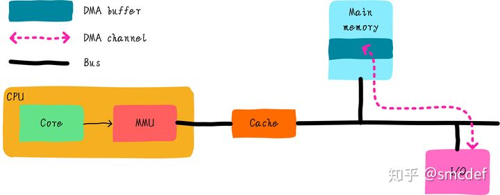


## 总线监视技术

PIPT Cache 它是操作系统最容易管理的 Cache，也很容易实现总线监视技术。

什么是总线监视技术呢？

其实就是为了解决以上问题提出的技术，cache 控制器会监视总线上的每一条内存访问，然后检查是否命中。根据命中情况做出下一步操作。我们知道 DMA 操作的地址是物理地址，既然 cache 控制器可以监视总线操作，说明系统使用的 cache 必须是支持物理地址查找的。而 PIPT 完全符合条件。

VIVT 是根据虚拟地址查找 cache，所以不能实现总线监视技术。

VIPT 可以吗？没有别名的 VIPT 也可以实现总线监视，但是有别名的情况的 VIPT 是不行的(当然硬件如果强行检查所有可能产生别名的 cache line，或许也可以)。总线监视对于软件来说是透明的，软件不需要任何干涉即可避免不一致问题。但是，并不是所有的硬件都支持总线监视，同时操作系统应该兼容不同的硬件。因此在不支持总线监视的情况下，我们在软件上如何避免问题呢？


## 最简单的方法(nocache)

当我们使用 DMA 时，首先是配置。我们需要在内存中申请一段内存当做 buffer，这段内存用作需要使用 DMA 读取 I/O 设备的缓存，或者写入 I/O 设备的数据。

以 DMA 从 IO 设备读取数据到主存为例。数据存入主存之后，CPU 肯定会去访问这片 DMA Buffer，但是 CPU 一般先访问 cache，而如果 cache 刚好命中 DMA Buffer，就会直接把 cache 中的数据读入 CPU 进行处理，就不会去读刚刚从外设搬进 dma buffer 的最新数据了。

为了避免 cache 的影响，我们可以将这段内存映射 nocache，即不使用 cache。映射的最小单位是 4KB，因此在内存映射上至少 4KB 是 nocache 的。

这种方法简单实用，但是缺点也很明显。如果只是偶尔使用 DMA，大部分都是使用数据的话，会由于 nocache 导致损失 CPU 的对访问 DMA Buffer 的性能。这也是 Linux 系统中 dma_alloc_coherent() 接口的实现方法。


## 软件维护cache一致性

为了充分使用 cache 带来的好处。我们映射依然采用 cache 的方式。但是我们需要格外小心。根据 DMA 传输方向的不同，采取不同的措施。

1.  如果 DMA 负责从 I/O 读取数据到内存 (DMA Buffer) 中，那么在 DMA 传输之前，可以 invalid DMA Buffer 地址范围的高速缓存。在 DMA 传输完成后，程序读取数据不会由于 cache hit 导致读取过时的数据。
2.  如果 DMA 负责把内存 (DMA Buffer) 数据发送到 I/O 设备，那么在 DMA 传输之前，可以 clean DMA Buffer 地址范围的高速缓存，clean 的作用是写回 cache 中修改的数据。在 DMA 传输时，不会把主存中的过时数据发送到 I/O  设备。

注意，在 DMA 传输没有完成期间 CPU 不要访问 DMA Buffer。例如以上的第一种情况中，如果 DMA 传输期间 CPU 访问 DMA Buffer，当 DMA 传输完成时。CPU 读取的 DMA Buffer 由于 cache hit 导致无法获取最终的数据。同样，第二情况下，在 DMA 传输期间，如果 CPU 试图修改 DMA Buffer，如果 cache 采用的是写回机制，那么最终写到 I/O 设备的数据依然是之前的旧数据。所以，这种使用方法编程开发人员应该格外小心。这也是 Linux 系统中流式 DMA 映射 dma_map_single() 接口的实现方法。


## DMA Buffer对齐要求

假设我们有 2 个全局变量 temp 和 buffer，buffer 用作 DMA 缓存。初始值 temp 为 5。temp 和 buffer 变量毫不相关。可能 buffer 是当前 DMA 操作进程使用的变量，temp 是另外一个无关进程使用的全局变量。

```c
int temp = 5;
char buffer[64] = { 0 };
```

假设，cache line 大小是 64 字节。那么 temp 变量和 buffer 位于同一个 cache line ，buffer 横跨两个 cache line 。

 

假设现在想要启动 DMA 从外设读取数据到 buffer 中。我们进行如下操作：

1.  按照上一节的理论，我们先 invalid buffer 对应的 2 行 cache line 。
2.  启动 DMA 传输。
3.  当 DMA 传输到 buffer[3] 时，程序改写 temp 的值为 6。temp 的值和 buffer[0]-buffer[59] 的值会被缓存到 cache 中，并且标记 dirty bit。
4.  DMA 传输还在继续，当传输到 buffer[50] 的时候，其他程序可能读取数据导致 temp 变量所在的 cache line 需要替换，由于 cache line 是 dirty 的。所以 cache line 的数据需要写回。此时，将 temp 数据写回，顺便也会将 buffer[0]-buffer[59] 的值写回。

在第 4 步中，就出现了问题。由于写回导致 DMA 传输的部分数据 (buffer[3]-buffer[49]) 被改写（改写成了没有 DMA 传输前的值）。这不是我们想要的结果。因此，为了避免出现这种情况。我们应该保证 DMA Buffer 不会跟其他数据共享 cache line 。所以我们要求 DMA Buffer 首地址必须 cache line 对齐，并且 buffer 的大小也 cache line 对齐。这样就不会跟其他数据共享 cache line 。也就不会出现这样的问题。


## Linux对DMA Buffer分配的要求

Linux 中，我们要求 DMA Buffer 不能是从栈和全局变量分配。这个主要原因是没办法保证 buffer 是 cache line 对齐。我们可以通过 kmalloc 分配 DMA Buffer。这就要求某些不支持总线监视的架构必须保证 kmalloc 分配的内存必须是 cache line 对齐。所以 linux 提供了一个宏，保证 kmalloc 分配的 object 最小的 size。例如 ARM64 平台的定义如下：

```c
#define ARCH_DMA_MINALIGN	(128)
```

ARM64 使用的 cache line 大小一般是 64 或者 128 字节。为了保证分配的内存是 cache line 对齐，取了最大值 128。而 x86_64 平台则没有定义，因为 x86_64 硬件保证了 DMA 一致性。所以我们看到 x86_64 平台，slub 管理的 kmem cache 最小的是 kmalloc-8。而 ARM64 平台，slub 管理的 kmem cache 最小的是 kmalloc-128。其实 ARM64 平台分配小内存的代价挺高的。即使申请 8 字节内存，也给你分配 128 字节的 object，确实有点浪费。


------


>   以上 DMA 一致性问题只是其一，我们还要面对其他的一致性问题。我们的高速缓存不但有数据高速缓存（dCache）还有指令高速缓存（iCache）。因此 dCache 和 iCache 之间的一致性问题也需要思考。

# iCache和dCache一致性

CPU 和主存之间也存在多级高速缓存，一般分为 3 级，分别是 L1，L2 和 L3。另外，我们的代码都是由 2 部分组成：指令和数据。L1 Cache 比较特殊，每个 CPU 会有 2 个 L1 Cache。分别为指令高速缓存 (Instruction Cache，简称 iCache) 和数据高速缓存 (Data Cache，简称 dCache)。

L2 和 L3 一般不区分指令和数据，可以同时缓存指令和数据。下图举例一个只有 L1 Cache 的系统。我们可以看到每个 CPU 都有自己私有的 L1 iCache 和L1 dCache。

 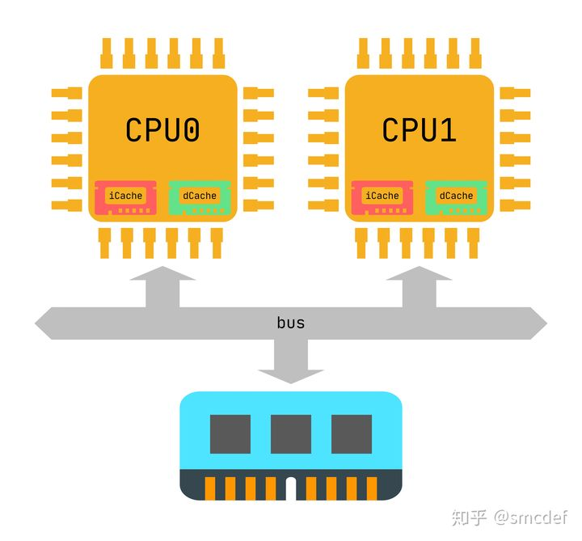


## 为什么要区分指令和数据

iCache 的作用是缓存指令，dCache 是缓存数据。为什么我们需要区分数据和指令呢？原因之一是出于性能的考量。CPU 在执行程序时，可以同时获取指令和数据，做到硬件上的并行，提升性能。另外，指令和数据有很大的不同。例如，指令一般不会被修改，所以 iCache 在硬件设计上是可以是只读的，这在一定程度上降低硬件设计的成本。所以硬件设计上，系统中一般存在 L1 dCache 和 L1 iCache，L2 Cache 和 L3 Cache。


## iCache歧义和别名

只要是 Cache，就不能不提歧义和别名的问题。歧义问题一直是软件最难维护的，所以现在的硬件设计一般都采用物理地址作为 tag，这就避免了歧义问题。别名问题是否存在呢？

在之前的文章中，我们知道 VIPT 的 cache 是可能存在别名的情况。但是针对 iCache 的特殊情况（readonly），又会产生什么特殊的结果呢？

其实我们之所以需要考虑别名问题，就是因为需要我们维护别名之间的一致性。因为可能在不同的 cache line 看到不同的结果。那么 iCache 会存在别名，但不是问题。因为 iCache 是只读的，所以即使两个 cache line 缓存一个物理地址上的指令，也不存在问题。因为他的值永远是一致的，没有修改的机会。既然选用 VIPT iCache 即不存在歧义问题，别名也不是问题。那么我们是不是就不用操心了呢？

并不是，我们最后需要考虑的问题是 iCache 和 dCache 之间的一致性问题。


## iCache和dCache一致性

我们的程序在执行的时候，指令一般是不会修改的。这就不会存在任何一致性问题。但是，总有些特殊情况。例如某些 self-modifying code，这些代码在执行的时候会修改自己的指令。例如 gcc 调试打断点的时候就需要修改指令。当我们修改指令的步骤如下：

1.  将需要修改的指令数据加载到 dCache 中。
2.  修改成新指令，写回 dCache。

我们现在面临 2 个问题：

-   如果旧指令已经缓存在 iCache 中。那么对于程序执行来说依然会命中 iCache。这不是我们想要的结果。
-   如果旧指令没有缓存 iCache，那么指令会从主存中缓存到 iCache 中。如果 dCache 使用的是写回策略，那么新指令依然缓存在 dCache 中。这种情况也不是我们想要的。

解决一致性问题既可以采用硬件方案也可以采用软件方案。


## 硬件维护一致性

硬件上可以让 iCache 和 dCache 之间通信，每一次修改 dCache 数据的时候，硬件负责查找 iCache 是否命中，如果命中，也更新 iCache。当加载指令的时候，先查找 iCache，如果 iCache 没有命中，再去查找 dCache 是否命中，如果 dCache 没有命中，从主存中读取。这确实解决了问题，软件基本不用维护两者一致性。但是 self-modifying code 是少数，为了解决少数的情况，却给硬件带来了很大的负担，得不偿失。因此，大多数情况下由软件维护一致性。


## 软件维护一致性

当操作系统发现修改的数据可能是代码时，可以采取下面的步骤维护一致性。

1.  将需要修改的指令数据加载到 dCache 中。
2.  修改成新指令，写回 dCache。
3.  clean dCache 中修改的指令对应的 cache line，保证 dCache 中新指令写回主存。
4.  invalid iCache 中修改的指令对应的 cache line，保证从主存中读取新指令。

操作系统如何知道修改的数据可能是指令呢？程序经过编译后，指令应该存储在代码段，而代码段所在的页在操作系统中具有可执行权限的。不可信执行的数据一般只有读写权限。因此，我们可以根据这个信息知道可能修改了指令，进而采取以上措施保证一致性。


------


>   前面的一系列文章我们考虑的基本都是单核场景。从现在开始，欢迎来到多核世界。多个 CPU 之间也同样存在一致性问题。而针对这种问题，我们又是如何解决的呢？

# 多核Cache一致性

经过这么多篇文章的介绍，我们应该已经对 Cache 有一个比较清晰的认识。Cache 会面临哪些问题，我们该怎么处理这些问题。现在我们讨论多核 Cache 一致性问题。

在摩尔定律不太适用的今天，人们试图增加 CPU 核数以提升系统整体性能。这类系统称之为多核系统（简称 MP，Multi-Processor）。我们知道每个 CPU 都有一个私有的 L1 Cache（不细分 iCache 和 dCache）。假设一个 2 核的系统，我们将会有 2 个 L1 Cache。这就引入了一个问题，不同 CPU 之间的 L1 Cache 如何保证一致性呢？首先看下什么是多核 Cache 一致性问题。


## 问题背景

首先我们假设 2 个 CPU 的系统，并且 L1 Cache 的 cache line 大小是 64 Bytes。两个 CPU 都读取 0x40 地址数据，导致 0x40 开始的 64 Bytes 内容分别加载到 CPU0 和 CPU1 的私有的 cache line。

 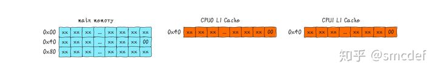

CPU0 执行写操作，写入值 0x01。CPU0 私有的 L1 Cache 更新 cache line 的值。然后，CPU1 读取 0x40 数据，CPU1 发现命中 cache，然后返回 0x00 值，并不是 CPU0 写入的 0x01。这就造成了 CPU0 和 CPU1 私有 L1 Cache 数据不一致现象。

 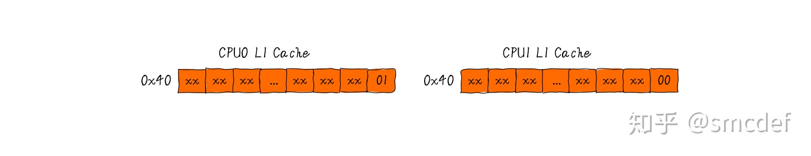

按照正确的处理流程，我们应该需要以下方法保证多核 Cache 一致性：

-   CPU0 修改 0x40 的时候，除了更新 CPU0 的 Cache 之外，还应该通知 CPU1 的 Cache 更新 0x40 的数据。
-   CPU0 修改 0x40 的时候，除了更新 CPU0 的 Cache 之外，还可以通知 CPU1 的 Cache 将 0x40 地址所在 cache line 置成 invalid。保证 CPU1 读取数据时不会命中自己的 Cache。不命中自己的 cache 之后，我们有两种选择保证读取到最新的数据。

    a) 从 CPU0 的私有 cache 中返回 0x40 的数据给 CPU1；

    b) CPU0 发出 invalid 信号后，将写入 0x40 的数据写回主存，CPU1 从主存读取最新的数据。

以上问题就是一个简单的不一致性现象。我们需要保证多核一致性，就需要办法维护一致性。可以有 2 种方法维护一致性，分别是软件和硬件。软件维护一致性的方法，现在基本没有采用。因为软件维护成本太高，由于维护一致性带来的性能损失抵消一部分 cache 带来的性能提升。所以现在的硬件会帮我们维护多核 Cache 一致性，并且对软件是透明的。感兴趣的朋友可以继续往下了解硬件是如何维护多核 Cache 一致性。


## Bus Snooping Protocol

继续以上面的例子说明 bus snooping 的工作机制。当 CPU0 修改自己私有的 Cache 时，硬件就会广播通知到总线上其他所有的 CPU。对于每个 CPU 来说会有特殊的硬件监听广播事件，并检查是否有相同的数据被缓存在自己的 CPU，这里是指 CPU1。如果 CPU1 私有 Cache 已经缓存即将修改的数据，那么 CPU1 的私有 Cache 也需要更新对应的 cache line。这个过程就称作 bus snooping。如下图所示，我们只考虑 L1 dCache 之间的一致性。

 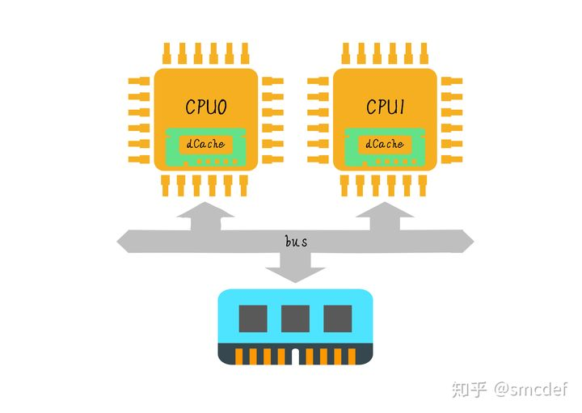

这种 bus snooping 方法简单，但要需要每时每刻监听总线上的一切活动。我们需要明白的一个问题是不管别的 CPU 私有 Cache 是否缓存相同的数据，都需要发出一次广播事件。这在一定程度上加重了总线负载，也增加了读写延迟。针对该问题，提出了一种状态机机制降低带宽压力。这就是 MESI protocol（协议）。


## MESI Protocol

MESI 是现在一种使用广泛的协议，用来维护多核 Cache 一致性。我们可以将 MESI 看做是状态机。我们将每一个 cache line 标记状态，并且维护状态的切换。cache line 的状态可以像 tag，modify 等类似存储。

MESI 协议其实是 4 个状态单词的开头字母缩写，分别是：

-   Modified，已修改
-   Exclusive，独占
-   Shared，共享
-   Invalidated，已失效

这四个状态来标记 Cache Line 四个不同的状态。

「Modified」状态就是我们前面提到的脏标记，代表该 Cache Block 上的数据已经被更新过，但是还没有写到内存里。而「Invalidated」状态，表示的是这个 Cache Block 里的数据已经失效了，不可以读取该状态的数据。

「Exclusive」和「Shared」状态都代表 Cache Block 里的数据是干净的，也就是说，这个时候 Cache Block 里的数据和内存里面的数据是一致性的。

「Exclusive」和「Shared」的差别在于，Exclusive 状态的时候，数据只存储在一个 CPU 核心的 Cache 里，而其他 CPU 核心的 Cache 没有该数据。这个时候，如果要向独占的 Cache 写数据，就可以直接自由地写入，而不需要通知其他 CPU 核心，因为只有你这有这个数据，就不存在缓存一致性的问题了，于是就可以随便操作该数据。

另外，在「Exclusive」状态下的数据，如果有其他核心从内存读取了相同的数据到各自的 Cache ，那么这个时候，独占状态下的数据就会变成共享状态。

那么，「Shared」状态代表着相同的数据在多个 CPU 核心的 Cache 里都有，所以当我们要更新 Cache 里面的数据的时候，不能直接修改，而是要先向所有的其他 CPU 核心广播一个请求，要求先把其他核心的 Cache 中对应的 Cache Line 标记为「Invalidated」状态，然后再更新当前 Cache 里面的数据。

事实上，整个 MESI 的状态可以用一个有限状态机来表示它的状态流转。还有一点，对于不同状态触发的事件操作，可能是来自本地 CPU 核心发出的广播事件，也可以是来自其他 CPU 核心通过总线发出的广播事件。下图即是 MESI 协议的状态图：

 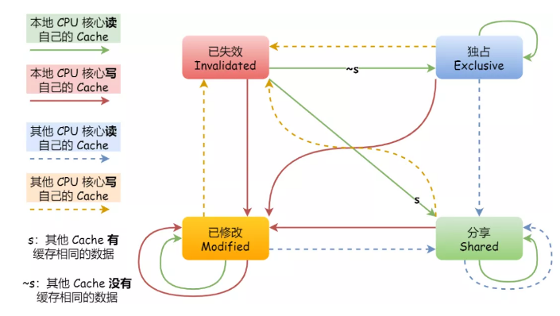

MESI 协议的四种状态之间的流转过程汇总成了下面的表格，你可以更详细的看到每个状态转换的原因：

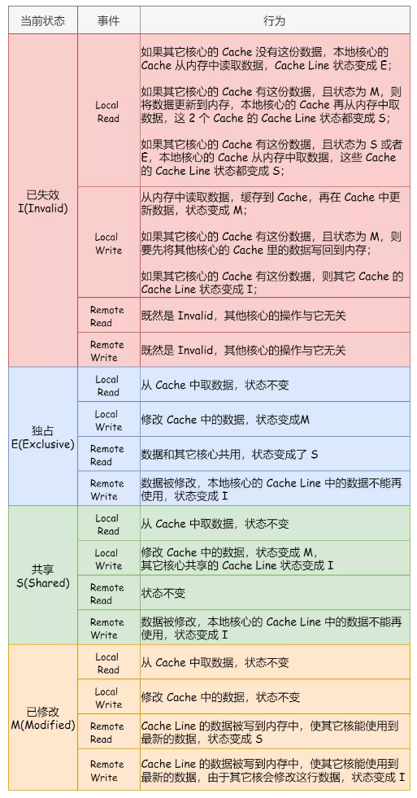

继续以上面的例子说明问题。

1.  当 CPU0 读取 0x40 数据，数据被缓存到 CPU0 私有 Cache，此时 CPU1 没有缓存 0x40 数据，所以我们标记 cache line 状态为 `Exclusive`。Exclusive 代表 cache line 对应的数据仅在数据只在一个 CPU 的私有 Cache 中缓存，并且其在缓存中的内容与主存的内容一致。
2.  然后 CPU1 读取 0x40 数据，发送消息给其他 CPU，发现数据被缓存到 CPU0 私有 Cache，数据从 CPU0 Cache 返回给 CPU1。此时 CPU0 和 CPU1 同时缓存 0x40 数据，此时 cache line 状态从 Exclusive 切换到 `Shared` 状态。Shared 代表 cache line 对应的数据在"多"个 CPU 私有 Cache 中被缓存，并且其在缓存中的内容与主存的内容一致。
3.  继续 CPU0 修改 0x40 地址数据，发现 0x40 内容所在 cache line 状态是 Shared。CPU0 发出 invalid 消息传递到其他 CPU，这里是 CPU1。CPU1 接收到 invalid 消息。将 0x40 所在的 cache line 置为 `Invalid` 状态。Invalid 状态表示表明当前 cache line 无效。然后 CPU0 收到 CPU1 已经 invalid 的消息，修改 0x40 所在的 cache line 中数据。并更新 cache line 状态为 `Modified`。Modified 表明 cache line 对应的数据仅在一个 CPU 私有 Cache 中被缓存，并且其在缓存中的内容与主存的内容不一致，代表数据被修改。
4.  如果 CPU0 继续修改 0x40 数据，此时发现其对应的 cache line 的状态是 Modified。因此 CPU0 不需要向其他 CPU 发送消息，直接更新数据即可。
5.  如果 0x40 所在的 cache line 需要替换，发现 cache line 状态是 Modified。所以数据应该先写回主存。

以上是 cache line 状态改变的举例。我们可以知道 cache line 具有 4 种状态，分别是 Modified、Exclusive、Shared 和 Invalid。取其首字母简称 MESI。当 cache line 状态是 Modified 或者 Exclusive 状态时，修改其数据不需要发送消息给其他 CPU，这在一定程度上减轻了带宽压力。

下面我们使用 [在线体验 MESI 网站](https://www.scss.tcd.ie/Jeremy.Jones/VivioJS/caches/MESIHelp.htm) 来感知一下 MESI 状态变化的过程：

我们可以看到最上面为内存，中间黑色的是总线，总共有 3 个 CPU，每个 CPU Cache Line 初始状态都为 Invalid，最下面是你手动进行的操作

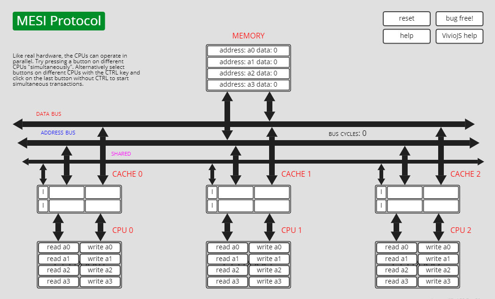

首先我们操作 CPU1 read a0，可以看到数据从内存中读取到 Cache，并且状态变成了 Exclusive：

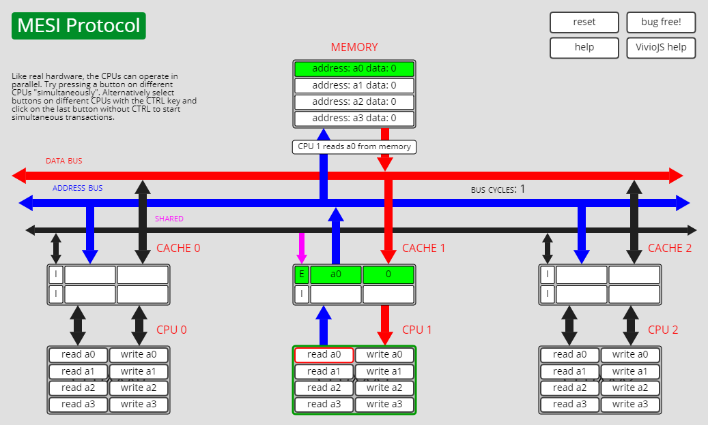

然后我们操作 CPU2 read a0，此时 CPU0 和 CPU1 对应的 Cache Line 状态变为 Shared：

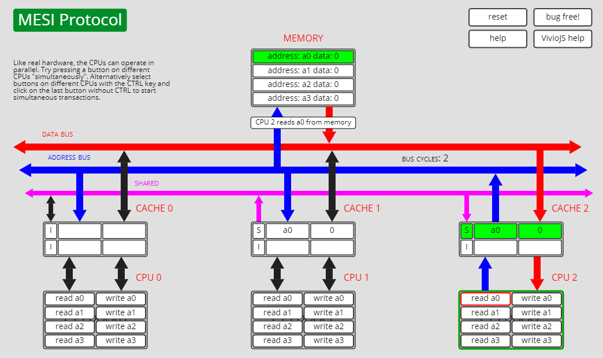

接下来我们操作 CPU2 write a0，此时 CPU1 对应的 Cache Line 变为 Invalid，而 CPU2 对应变成 Exclusive：

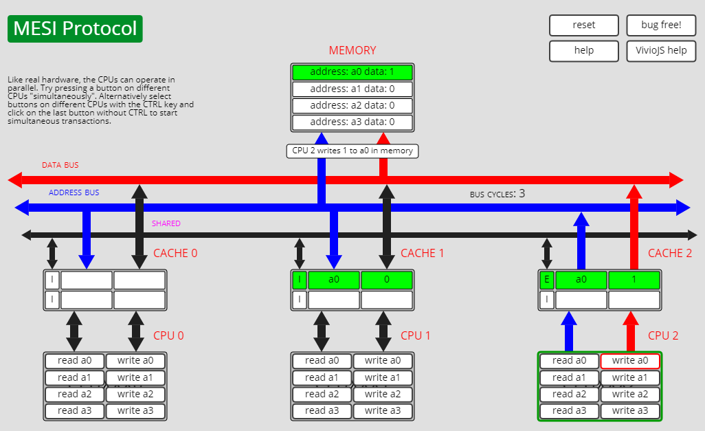

我们继续操作 CPU2 write a0，此时状态变成 Modified：

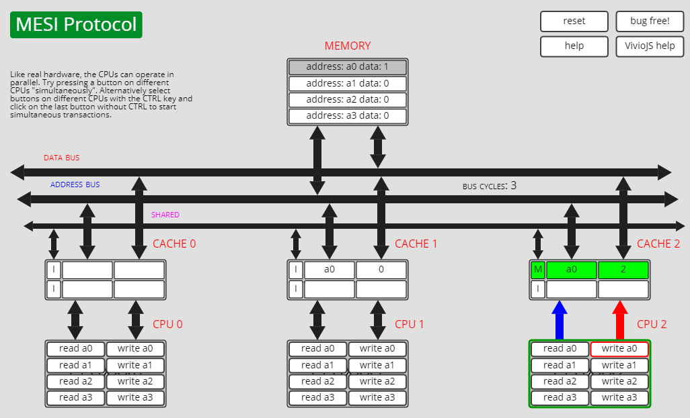

感兴趣的同学可以自己去操作体验一下，网页有动画效果可以更清晰地看到变化流程。


## 总结

在分布式系统中我们一般用 Paxos / Raft 这样的分布式一致性的算法。

而在 CPU 的微观世界里，则不必使用这样的算法，原因是 CPU 的多个核的硬件不必考虑网络会断会延迟的问题。所以，CPU 的多核心缓存间的同步的核心就是要管理好数据的状态就好了。

多核 Cache 一致性由硬件保证，对软件来说是透明的。因此我们不用再考虑多核 Cache 一致性问题。另外，现在 CPU 硬件采用的一致性协议一般是 MESI 的变种。例如 ARM64 架构采用的 MOESI Protocol。多一种 Owned 状态。多出来的状态也是为了更好的优化性能。与 MOESI 协议类似的一个协议是 MESIF，其中的 F 是 Forward，同样是把更新过的数据转发给别的 CPU Cache 但是，MOESI 中的 Owner 状态 和MESIF 中的 Forward 状态有一个非常大的不一样，Owner 状态下的数据是 dirty 的，还没有写回内存，Forward 状态下的数据是 clean的，可以丢弃而不用另行通知。


------


>   到这里，似乎 Cache 一致性问题告一段落。并且我们也明白了高速缓存的数据是如何在多核之间传递，MESI 协议又是如何保证 Cache 一致性。但是，随着多核的引入，也让我们面对了新的问题 - 伪共享。

# 伪共享

我们知道 kernel 地址空间是所有进程共享的，所以 kernel 空间的全局变量，任何进程都可以访问。假设有 2 个全局变量 global_A 和 global_B（类型是 long），它们在内存上紧挨在一起，假设 cache line size 是 64 Bytes，并且 global_A 是 cache line size 对齐。所以 global_A 和 global_B 如果同时 load 到 Cache 中，一定是落在同一行 cache line。就像下面这样。

 

现在我们知道多核 Cache 一致性由 MESI 协议保证。有了这些基础之后，我们现在来思考一个问题，如果我们的系统有 2 个 CPU，每个 CPU 上运行完全不相干的两个进程 task_A 和 task_B。task_A 只会修改 global_A 变量，task_B 只会修改 global_B 变量。会有什么问题吗？


## 我们遇到什么问题

最初全局变量 global_A 和 global_B 都不在 cache 中缓存，如下图示意。task_A 绑定 CPU0 运行，task_B 绑定 CPU1 运行。task_A 和 task_B 按照下面的次序分别修改或读取全局变量 global_A 和 global_B。

 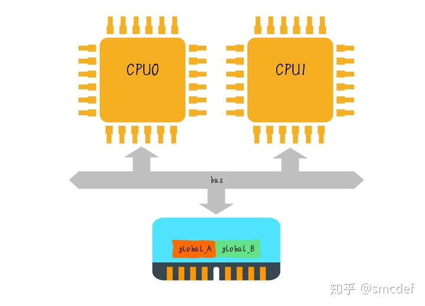

a) CPU0 读取 global_A，global_A 的数据被缓存到 CPU0 的私有 L1 Cache。由于 Cache 控制器是以 cache line 为单位从内存读取数据，所以顺便就会把 global_B 变量也缓存到 Cache。并将 cache line 置为 Exclusive 状态。

 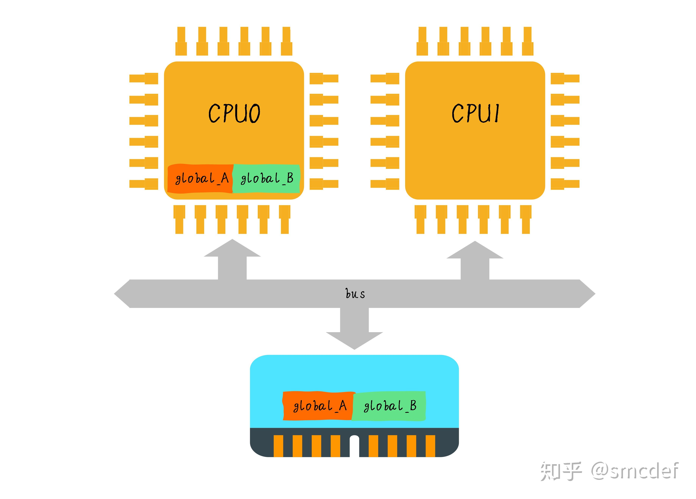

b) CPU1 读取 global_B 变量，由于 global_B 被 CPU0 私有 Cache 缓存，所以 CPU0 的 L1 Cache 负责返回 global_B 数据到 CPU1 的 L1 Cache。同样 global_A 也被缓存。此时 CPU0 和 CPU1 的 cache line 状态变成 Shared 状态。

 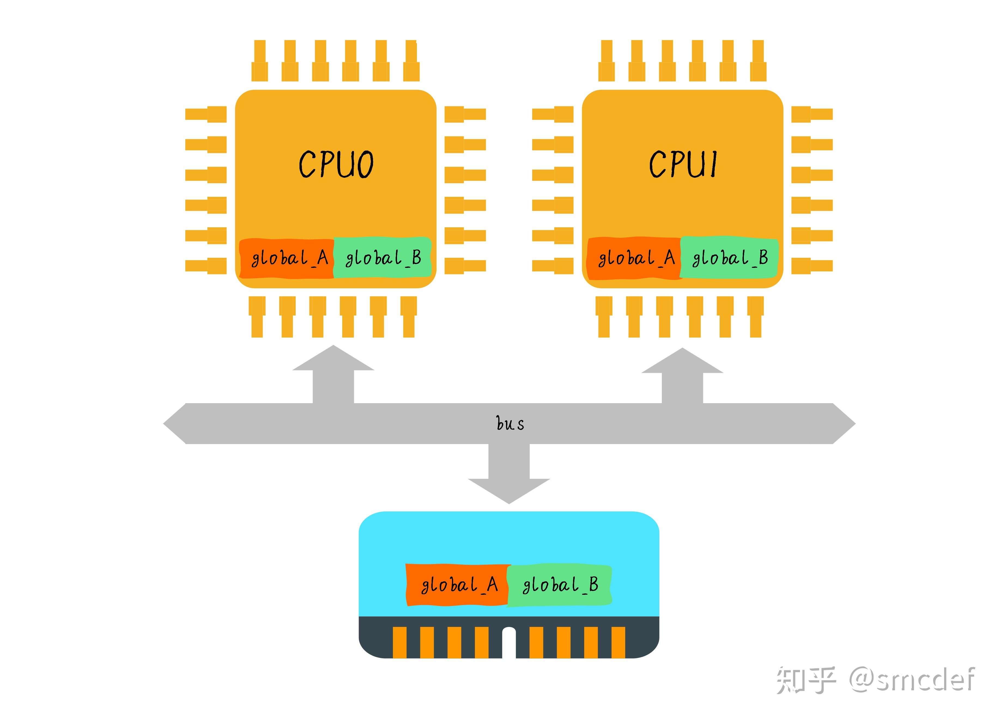

c) CPU0 现在需要修改 global_A 变量。CPU0 发现 cache line 状态是 Shared，所以需要发送 invalid 消息给 CPU1。CPU1 将 global_A 对应的 cache line 无效。然后 CPU0 的 cache line 状态变成 Modified 并且修改 global_A。

 

d) CPU1 现在需要修改 global_B 变量。此时 global_B 变量并没有缓存在 CPU1 私有 Cache。所以 CPU1 会发消息给 CPU0，CPU0 将 global_B 数据返回给 CPU1。并且会 invalid CPU0 的 cache line。然后 global_B 对应的 CPU1 cache line 变成 Modified 状态，此时 CPU1 就可以修改 global_B 了。

 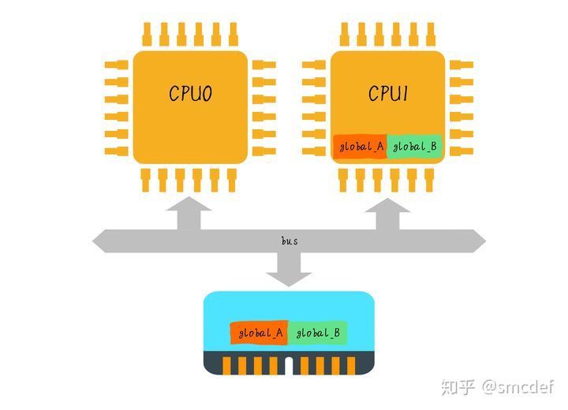

如果 CPU0 和 CPU1 就这样持续交替的分别修改全局变量 global_A 和 global_B，就会重复 c) 和 d)。意识到问题所在了吗？这就是典型的 cache 颠簸问题。我们仔细想想，global_A 和 global_B 其实并没有任何的关系，却由于落在同一行 cache line 的原因导致 cache 颠簸。我们称这种现象为伪共享 (false sharing)。 global_A 和 global_B 之间就是伪共享关系，实际并没有共享。我们如何解决伪共享问题呢？


## 如何解决伪共享

既然 global_A 和 global_B 由于在同一行 cache line 导致了伪共享问题，那么解决方案也很显然易见，我们可以让 global_A 和 global_B 不落在一个 cache line，这样就可以解决问题。不落在同一行 cache line 的方法很简单，使 global_A 和 global_B 的内存地址都按照 cache line size 对齐，相当于以空间换时间。浪费一部分内存，换来了性能的提升。当我们把 global_A 和 global_B 都 cache line size 对齐后，我们再思考上面的问题。此时 CPU0 和 CPU1 分别修改 global_A 和 global_B 互不影响。global_A 和 global_B 对应的 cache line 状态可以一直维持 Modified 状态。这样 MESI 协议就不会在两个 CPU 间不停的发送消息。降低了带宽压力。


## 实际应用

在 Linux kernel 中存在 `__cacheline_aligned_in_smp` 宏定义用于解决 false sharing 问题。

```c
#ifdef CONFIG_SMP
#define __cacheline_aligned_in_smp __cacheline_aligned
#else
#define __cacheline_aligned_in_smp
#endif
```

我们可以看到在 UP (单核)系统上，宏定义为空。在 MP (多核)系统下，该宏是 L1 cache line size。针对静态定义的全局变量，如果在多核之间竞争比较严重，为了避免影响其他全局变量，可以采用上面的宏使变量 cache line 对齐，避免 false sharing 问题。


