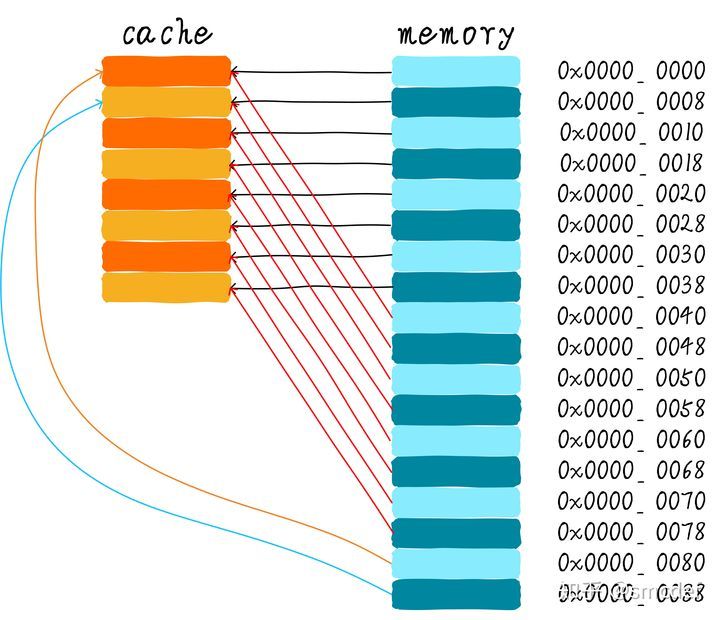
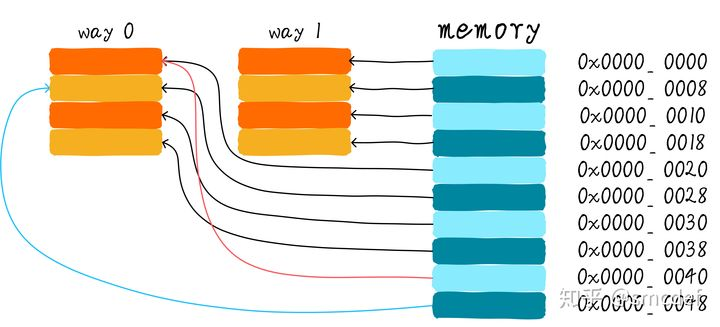

本文内容转自知乎用户 smcdef 的：[高速缓存与一致性专栏索引](https://zhuanlan.zhihu.com/p/136300660)

PS：此文仅当做个人笔记，文内对部分个人觉得晦涩的地方加了点描述，对错误拼写进行了修正，大家感兴趣还是直接去读原文即可。


------


>   首先是介绍高速缓存的基本原理，硬件是如何缓存和查找数据，这是个基础入门。

# Cache的基本原理

## 为什么需要cache？

在思考为什么需要 cache 之前，我们首先先来思考另一个问题：我们的程序是如何运行起来的？

我们应该知道程序是运行在 RAM 之中，RAM 就是我们常说的 DDR（例如： DDR3、DDR4 等）。我们称之为 main memory（主存）。当我们需要运行一个进程的时候，首先会从磁盘设备（例如，eMMC、UFS、SSD等）中将可执行程序 load 到主存中，然后开始执行。在 CPU 内部存在一堆的通用寄存器（register）。如果 CPU 需要将一个变量（假设地址是A）加 1，一般分为以下 3 个步骤：

1.  CPU 从主存中读取地址 A 的数据到内部通用寄存器 x0（ARM64架构的通用寄存器之一）。
2.  通用寄存器 x0 加 1。
3.  CPU 将通用寄存器 x0 的值写入主存。

我们将这个过程可以表示如下：

 

其实现实中，CPU 通用寄存器的速度和主存之间存在着太大的差异。两者之间的速度大致如下关系：

 

CPU Register 的速度一般小于 1ns，主存的速度一般是 65ns 左右。速度差异近百倍。

因此，上面举例的 3 个步骤中，步骤 1 和步骤 3 实际上速度很慢。当 CPU 试图从主存中 load/store 操作时，由于主存的速度限制，CPU 不得不等待这漫长的 65ns 时间。如果我们可以提升主存的速度，那么系统将会获得很大的性能提升。

如今的 DDR 存储设备，动不动就是几个 GB，容量很大。如果我们采用更快材料制作更快速度的主存，并且拥有几乎差不多的容量，其成本将会大幅度上升。我们试图提升主存的速度和容量，又期望其成本很低，这就有点难为人了。因此，我们有一种折中的方法，那就是制作一块速度极快但是容量极小的存储设备，其成本也不会太高，这块存储设备我们称之为 cache memory。

在硬件上，我们将 cache 放置在 CPU 和主存之间，作为主存数据的缓存。 当 CPU 试图从主存中 load/store 数据的时候，CPU 会首先从 cache 中查找对应地址的数据是否缓存在 cache 中。如果其数据缓存在 cache 中，则直接从 cache 中拿到数据并返回给 CPU。

当存在 cache 的时候，以上程序如何运行的例子的流程将会变成如下：

 

CPU 和主存之间直接数据传输的方式转变成 CPU 和 cache 之间直接数据传输，cache 负责和主存之间数据传输。


## 多级cache存储结构

cache 的速度在一定程度上同样影响着系统的性能。一般情况 cache 的速度可以达到 1ns，几乎可以和 CPU 寄存器速度媲美。但是，这就满足人们对性能的追求了吗？并没有。当 cache 中没有缓存我们想要的数据的时候，依然需要漫长的等待从主存中 load 数据。为了进一步提升性能，引入多级 cache。

前面提到的 cache，称之为 L1 cache（第一级 cache）。我们在 L1 cache 后面连接 L2 cache，在 L2 cache 和主存之间连接 L3 cache。等级越高，速度越慢，容量越大。但是速度相比较主存而言，依然很快。不同等级 cache 速度之间关系如下：

 

在一个真实的系统上，各级 cache 之间硬件上是如何关联的呢？

我们看下 Cortex-A53 架构上各级 cache 之间的硬件抽象框图如下：

 

在 Cortex-A53 架构上，L1 cache 分为单独的 instruction cache（ICache）和 data cache（DCache）。L1 cache 是 CPU 私有的，每个 CPU 都有一个 L1 cache。一个 cluster 内的所有 CPU 共享一个 L2 cache，L2 cache 不区分指令和数据，都可以缓存。所有 cluster 之间共享 L3 cache。L3 cache 通过总线和主存相连。


## 多级cache之间的配合工作

首先引入两个名词概念，命中和缺失。 CPU 要访问的数据在 cache 中有缓存，称为“命中” (hit)，反之则称为“缺失” (miss)。多级 cache 之间是如何配合工作的呢？我们假设现在考虑的系统只有两级 cache。

 

当 CPU 试图从某地址 load 数据时，首先从 L1 cache 中查询是否命中，如果命中则把数据返回给 CPU。如果 L1 cache 缺失，则继续从 L2 cache 中查找。当 L2 cache 命中时，数据会返回给 L1 cache 以及 CPU。如果 L2 cache 也缺失，很不幸，我们需要从主存中 load 数据，将数据返回给 L2 cache、L1 cache 及 CPU。这种多级 cache 的工作方式称之为 inclusive cache。某一地址的数据可能存在多级缓存中。与 inclusive cache 对应的是 exclusive cache，这种 cache 保证某一地址的数据缓存只会存在于多级 cache 其中一级。也就是说，任意地址的数据不可能同时在 L1 和 L2 cache 中缓存。


## 直接映射缓存(Direct mapped cache)

我们继续引入一些 cache 相关的名词。cache 的大小称之为 cache size，代表 cache 可以缓存最大数据的大小。我们将 cache 平均分成相等的很多块，每一个块大小称之为 cache line，其大小是 cache line size。

例如一个 64 Bytes 大小的 cache。如果我们将 64 Bytes 平均分成 64 块，那么 cache line 就是 1 字节，总共 64 行 cache line。如果我们将 64 Bytes 平均分成 8 块，那么 cache line 就是 8 字节，总共 8 行 cache line。现在的硬件设计中，一般 cache line 的大小是 4-128 Bytes。为什么没有 1 byte 呢？原因我们后面讨论。

这里有一点需要注意，**cache line 是 cache 和主存之间数据传输的最小单位**。什么意思呢？当 CPU 试图 load 一个字节数据的时候，如果 cache 缺失，那么 cache 控制器会从主存中一次性地 load cache line 大小的数据到 cache 中。例如，cache line 大小是 8 字节。CPU 即使读取一个 byte，在 cache 缺失后，cache 会从主存中 load 8 字节填充整个 cache line。又是因为什么呢？后面说完就懂了。

我们假设下面的讲解都是针对 64 Bytes 大小的 cache，并且 cache line 大小是 8 字节。我们可以类似把这块 cache 想想成一个数组，数组总共 8 个元素，每个元素大小是 8 字节。就像下图这样：

 

现在我们考虑一个问题，CPU 从 0x0654 地址读取一个字节，cache 控制器是如何判断数据是否在 cache 中命中呢？

cache 大小相对于主存来说，可谓是小巫见大巫。所以 cache 肯定是只能缓存主存中极小一部分数据。我们如何根据地址在有限大小的 cache 中查找数据呢？现在硬件采取的做法是对地址进行散列（可以理解成地址取模操作）。我们接下来看看是如何做到的？

 

我们一共有 8 行 cache line，cache line 大小是 8 Bytes。所以我们可以利用地址低 3 bits（如上图地址蓝色部分）用来寻址 8 bytes 中某一字节，我们称这部分 bit 组合为 `offset`。

同理，8 行 cache line，为了覆盖所有行。我们需要 3 bits（如上图地址黄色部分）查找某一行，这部分地址部分称之为 `index`。

现在我们知道，如果两个不同的地址，其地址的 bit3-bit5 如果完全一样的话，那么这两个地址经过硬件散列之后都会找到同一个cache line。所以，当我们找到 cache line 之后，只代表我们访问的地址对应的数据可能存在这个 cache line 中，但是也有可能是其他地址对应的数据。所以，我们又引入 tag array 区域，tag array 和 data array 一一对应。每一个 cache line 都对应唯一一个 tag，`tag` 中保存的是整个地址位宽去除 index 和 offset 使用的 bit 剩余部分（如上图地址绿色部分）。**tag、index 和 offset 三者组合就可以唯一确定一个地址了**。

因此，当我们根据地址中 index 位找到 cache line 后，取出当前 cache line 对应的 tag，然后和地址中的 tag 进行比较，如果相等，这说明 cache 命中。如果不相等，说明当前 cache line 存储的是其他地址的数据，这就是 cache 缺失。在上述图中，我们看到 tag 的值是 0x19，和地址中的 tag 部分相等，因此在本次访问会命中。由于 tag 的引入，因此解答了我们之前的一个疑问 “为什么硬件 cache line 不做成一个字节？”。这样会导致硬件成本的上升，因为原本 8 个字节对应一个 tag，现在需要 8 个 tag，占用了很多内存。tag 也是 cache 的一部分，但是我们谈到 cache size 的时候并不考虑 tag 占用的内存部分。

我们可以从图中看到 tag 旁边还有一个 `valid bit`，这个 bit 用来表示 cache line 中数据是否有效（例如：1 代表有效；0 代表无效）。当系统刚启动时，cache 中的数据都应该是无效的，因为还没有缓存任何数据。cache 控制器可以根据 valid bit 确认当前 cache line 数据是否有效。所以，上述比较 tag 确认 cache line 是否命中之前还会检查 valid bit 是否有效。只有在有效的情况下，比较 tag 才有意义。如果无效，直接判定 cache 缺失。

上面的例子中，cache size 是 64 Bytes 并且 cache line size 是 8 bytes。offset、index 和 tag 分别使用 3 bits、3 bits 和 42 bits（假设地址宽度是48 bits）。我们现在再看一个例子：512 Bytes cache size，64 Bytes cache line size。根据之前的地址划分方法，offset、index 和 tag 分别使用 6 bits、3 bits和 39 bits。如下图所示。

 


直接映射缓存在硬件设计上会更加简单，因此成本上也会较低。根据直接映射缓存的工作方式，我们可以画出主存地址 0x00-0x88 地址对应的 cache 分布图。

 

我们可以看到，地址 0x00-0x3f 地址处对应的数据可以覆盖整个 cache。0x40-0x7f 地址的数据也同样是覆盖整个 cache。

我们现在思考一个问题，如果一个程序试图依次访问地址 0x00、0x40、0x80，cache 中的数据会发生什么呢？首先我们应该明白 0x00、0x40、0x80 地址中 index 部分是一样的。因此，这 3 个地址对应的 cache line 是同一个。所以，当我们访问 0x00 地址时，cache 会缺失，然后数据会从主存中加载到 cache 中第 0 行 cache line。当我们访问 0x40 地址时，依然索引到 cache 中第 0 行 cache line，由于此时 cache line 中存储的是地址 0x00 地址对应的数据，所以此时依然会 cache 缺失。然后从主存中加载 0x40 地址数据到第一行 cache line 中。同理，继续访问 0x80 地址，依然会 cache 缺失。这就相当于每次访问数据都要从主存中读取，所以 cache 的存在并没有对性能有什么提升。访问 0x40 地址时，就会把 0x00 地址缓存的数据替换。

这种现象叫做 **cache 颠簸**（cache thrashing）。针对这个问题，我们引入多路组相连缓存。我们首先研究下最简单的两路组相连缓存的工作原理。


## 两路组相连缓存(Two-way set associative cache)

我们依然假设 64 Bytes cache size，cache line size 是 8 Bytes。

什么是路（way）的概念。我们将 cache 平均分成多份，每一份就是一路。因此，两路组相连缓存就是将 cache 平均分成 2 份，每份 32 Bytes。如下图所示。

 

cache 被分成 2 路，每路包含 4 行 cache line。我们将所有索引一样的 cache line 组合在一起称之为组。例如，上图中一个组有两个 cache line，总共 4 个组。我们依然假设从地址 0x0654 地址读取一个字节数据。由于 cache line size 是 8 Bytes，因此 offset 需要 3 bits，这和之前直接映射缓存一样。不一样的地方是 index，在两路组相连缓存中，index 只需要 2 bits，因为一路只有 4 行 cache line。上面的例子根据 index 找到第 2 行 cache line（从 0 开始计算），第 2 行对应 2 个 cache line，分别对应 way 0 和 way 1。因此 index 也可以称作 set index（组索引）。先根据 index 找到 set，然后将组内的所有 cache line 对应的 tag 取出来和地址中的 tag 部分对比，如果其中一个相等就意味着命中。

因此，两路组相连缓存较直接映射缓存最大的差异就是：第一个地址对应的数据可以对应 2 个 cache line，而直接映射缓存一个地址只对应一个 cache line。那么这究竟有什么好处呢？

两路组相连缓存的硬件成本相对于直接映射缓存更高。因为其每次比较 tag 的时候需要比较多个 cache line 对应的 tag（某些硬件可能还会做并行比较，增加比较速度，这就增加了硬件设计复杂度）。为什么我们还需要两路组相连缓存呢？因为其可以有助于降低 cache 颠簸可能性。那么是如何降低的呢？根据两路组相连缓存的工作方式，我们可以画出主存地址 0x00-0x4f 地址对应的 cache 分布图。

 

我们依然考虑直接映射缓存一节的问题 “如果一个程序试图依次访问地址 0x00、0x40、0x80，cache 中的数据会发生什么呢？”。

现在 0x00 地址的数据可以被加载到 way 1，0x40 可以被加载到 way 0。这样是不是就在一定程度上避免了直接映射缓存的尴尬境地呢？在两路组相连缓存的情况下，0x00 和 0x40 地址的数据都缓存在 cache 中。试想一下，如果我们是 4 路组相连缓存，后面继续访问 0x80，也可能被被缓存。

因此，当 cache size 一定的情况下，组相连缓存对性能的提升最差情况下也和直接映射缓存一样，在大部分情况下组相连缓存效果比直接映射缓存好。同时，其降低了 cache 颠簸的频率。从某种程度上来说，直接映射缓存是组相连缓存的一种特殊情况，每个组只有一个 cache line 而已。因此，直接映射缓存也可以称作单路组相连缓存。


## 全相连缓存(Full associative cache)

既然组相连缓存那么好，如果所有的 cache line 都在一个组内。岂不是性能更好。是的，这种缓存就是全相连缓存。我们依然以 64 Bytes 大小 cache 为例说明。

 

由于所有的 cache line 都在一个组内，因此地址中不需要 set index 部分。因为，只有一个组让你选择，间接来说就是你没得选。我们根据地址中的 tag 部分和所有的 cache line 对应的 tag 进行比较（硬件上可能并行比较也可能串行比较）。哪个 tag 比较相等，就意味着命中某个 cache line。因此，在全相连缓存中，任意地址的数据可以缓存在任意的 cache line 中。所以，这可以最大程度的降低 cache 颠簸的频率。但是硬件成本上也是更高。


## 一个四路组相连缓存实例问题

考虑这么一个问题，32 KB 大小 4 路组相连 cache，cache line 大小是32 Bytes。请思考以下 2 个问题：

1.  多少个组？
2.  假设地址宽度是 48 bits，index、offset 以及 tag 分别占用几个 bit ？

总共 4 路，因此每路大小是 8 KB。cache line size 是32 Bytes，因此一共有 256 组（8 KB / 32 Bytes）。由于 cache line size 是 32 Bytes，所以 offset 需要 5 位。一共 256 组，所以 index 需要 8 位，剩下的就是 tag 部分，占用 35 位。这个 cache 可以绘制下图表示。

 


## Cache分配策略(Cache allocation policy)

cache 的分配策略是指我们什么情况下应该为数据分配 cache line。

cache 分配策略分为读和写两种情况：

读分配（read allocation）：当 CPU 读数据时，发生 cache 缺失，这种情况下都会分配一个 cache line 缓存从主存读取的数据。默认情况下，cache 都支持读分配。

写分配（write allocation）：当 CPU 写数据发生 cache 缺失时，才会考虑写分配策略。当我们不支持写分配的情况下，写指令只会更新主存数据，然后就结束了。当支持写分配的时候，我们首先从主存中加载数据到 cache line 中（相当于先做个读分配动作），然后会更新 cache line 中的数据。


## Cache更新策略(Cache update policy)

cache 更新策略是指当发生 cache 命中时，写操作应该如何更新数据。cache 更新策略分成两种：写直通和回写。

写直通（write through）：当 CPU 执行 store 指令并在 cache 命中时，我们更新 cache 中的数据并且更新主存中的数据。**cache和主存的数据始终保持一致**。

写回（write back）：当 CPU 执行 store 指令并在 cache 命中时，我们只更新 cache 中的数据。并且每个 cache line 中会有一个 bit 位记录数据是否被修改过，称之为 `dirty bit`（翻翻前面的图片，cache line 旁边有一个 D 就是 dirty bit）。我们会将 dirty bit 置位。主存中的数据只会在 cache line 被替换或者显示的 clean 操作时更新。因此，主存中的数据可能是未修改的数据，而修改的数据躺在 cache 中。**cache和主存的数据可能不一致。**

同时思考个问题，为什么 cache line 大小是 cache 控制器和主存之间数据传输的最小单位呢？这也是因为每个 cache line 只有一个 dirty bit。这一个 dirty bit 代表着整个 cache line 是否被修改的状态。


## 查看机器cache情况

我们查看一下我们机器 cache 的情况：

```bash
# ls /sys/devices/system/cpu/cpu0/cache/
index0  index1  index2  index3  uevent
# ls /sys/devices/system/cpu/cpu0/cache/index0
coherency_line_size  id  level  number_of_sets  physical_line_partition  shared_cpu_list  
shared_cpu_map  size  type  uevent  ways_of_associativity

# 查看 cache 级数和类型
# cat /sys/devices/system/cpu/cpu0/cache/index*/level
1
1
2
3
# cat /sys/devices/system/cpu/cpu0/cache/index*/type
Data
Instruction
Unified
Unified

# 查看 cpu cache size
# cat /sys/devices/system/cpu/cpu0/cache/index*/size
32K
32K
512K
32768K

# 如查看 cpu 一路的有多少组
root@lz-VirtualBox:~# cat /sys/devices/system/cpu/cpu0/cache/index*/number_of_sets
32
32
1024
512

# 查看 cpu 的缓存路数
root@lz-VirtualBox:~# cat /sys/devices/system/cpu/cpu0/cache/index*/ways_of_associativity
16
16
8
1024

# 查看 cpu cache line size
root@lz-VirtualBox:~# cat /sys/devices/system/cpu/cpu0/cache/index*/coherency_line_size
64
64
64
64
```

从上面我们可以得知 cpu0 的 Cache 情况如下：

|                 | L1 Cache | L2 Cache | L3 Cache |
| --------------- | -------- | -------- | -------- |
| cache size      | 32K      | 512K     | 32768K   |
| 路数            | 16       | 8        | 1024     |
| 组数            | 32       | 1024     | 512      |
| cache line size | 64       | 64       | 64       |

我的虚拟机上有 6 个核，从下面可以看出，L1 L2 是 CPU 私有的，L3 是公共的。

```bash
# lscpu
架构：                           x86_64
CPU 运行模式：                   32-bit, 64-bit
字节序：                         Little Endian
Address sizes:                   48 bits physical, 48 bits virtual
CPU:                             6
在线 CPU 列表：                  0-5
每个核的线程数：                 1
每个座的核数：                   6
座：                             1
NUMA 节点：                      1
厂商 ID：                        AuthenticAMD
CPU 系列：                       23
型号：                           113
型号名称：                       AMD Ryzen 5 3600 6-Core Processor
步进：                           0
CPU MHz：                        3600.002
BogoMIPS：                       7200.00
虚拟化：                         AMD-V
超管理器厂商：                   KVM
虚拟化类型：                     完全
L1d 缓存：                       192 KiB
L1i 缓存：                       192 KiB
L2 缓存：                        3 MiB
L3 缓存：                        32 MiB
NUMA 节点0 CPU：                 0-5
Vulnerability Itlb multihit:     Not affected
Vulnerability L1tf:              Not affected
Vulnerability Mds:               Not affected
Vulnerability Meltdown:          Not affected
Vulnerability Spec store bypass: Mitigation; Speculative Store Bypass disabled via prctl and seccomp
Vulnerability Spectre v1:        Mitigation; usercopy/swapgs barriers and __user pointer sanitization
Vulnerability Spectre v2:        Mitigation; Full AMD retpoline, STIBP disabled, RSB filling
Vulnerability Srbds:             Not affected
Vulnerability Tsx async abort:   Not affected
标记：                           fpu vme de pse tsc msr pae mce cx8 apic sep mtrr pge mca cmov pat pse36 clflush mmx fxsr sse sse2 ht syscall nx mmxext fxsr_opt rdtscp lm constant_tsc rep_good nopl nonstop_tsc cpuid extd_apicid tsc_known_freq pni pclmulqdq ssse3 cx16 sse4_1 sse4_2 x2apic movbe popcnt aes xsave avx hypervisor lahf_lm cmp_legacy svm cr8_legacy abm sse4a misalignsse 3dnowprefetch ssbd vmmcall fsgsbase avx2 clflushopt arat nrip_save flushbyasid decodeassists

```


## 实例

假设我们有一个 64 Bytes 大小直接映射缓存，cache line 大小是 8 Bytes，采用写分配和写回机制。当 CPU 从地址 0x2a 读取一个字节，cache 中的数据将会如何变化呢？

假设当前 cache 状态如下图所示 (tag 旁边 valid 一栏的数字 1 代表合法。0 代表非法。后面 Dirty 的 1 代表 dirty，0 代表没有写过数据，即非 dirty)。

 

根据 index 找到对应的 cache line，对应的 tag 部分 valid bit 是合法的，但是 tag 的值不相等，因此发生缺失。此时我们需要从地址 0x28（0b101000） 地址加载 8 字节数据到该 cache line 中。但是，我们发现当前 cache line 的 dirty bit 置位。因此，cache line 里面的数据不能被简单的丢弃，由于采用写回机制，所以我们需要将 cache 中的数据 0x11223344 写到地址 0x0128（0b100101000） 地址（这个地址根据 tag 中的值及所处的 cache line 行计算得到）。这个过程如下图所示。

 

当写回操作完成，我们将主存中 0x28 地址开始的 8 个字节加载到该 cache line 中，并清除 dirty bit。然后根据 offset 找到 0x52 返回给 CPU。


------


>   针对高速缓存基本原理中引入的问题，在下篇文章中解答。从代码的角度考虑高速缓存是如何影响我们代码的运行。

# Cache对代码的影响

先贴出建议的代码片段 1：

```c
int arr[10][128];

for (i = 0; i < 10; i++)
        for (j = 0; j < 128; j++)
                arr[i][j] = 1;
```

与之对比的代码片段 2：

```c
int arr[10][128];

for (i = 0; i < 128; i++)
        for (j = 0; j < 10; j++)
                arr[j][i] = 1;
```

在有了 cache 的基础知识后，我们就可以简单的解答这个问题了。我们假设使用的 L1 cache line 大小是 64 字节，采用写分配及写回策略。继续假设数组 arr 内存首地址是 64 字节对齐。

在有了以上背景假设后，我们先分析下片段 1 导致的 cache miss/hit 情况。当执行 `arr[0][0] = 1`时， cache 控制器发现`arr[0][0]`的值不在 cache 中，此时发生一次 cache miss。然后从主存中读取 `arr[0][0] 到 arr[0][15]` 的内存值到 cache 中。当执行访问 `arr[0][1] = 1` 时会发生一次 cache hit。此时内存访问速度极快。接着继续往下执行，会一直 cache hit。直到执行 `arr[0][16] = 1`，此时会 cache miss。总结来说就是访问内存每发生一次 cache miss。接下来会发生15 次 cache hit。因此这种初始化方法**cache命中率很高**。

我们再来分析下片段 2。当执行 `arr[0][0] = 1` 时， cache 控制器发现 `arr[0][0]` 的值不在 cache 中，此时发生一次 cache miss。然后从主存中读取 `arr[0][0]` 到 `arr[0][15]` 的内存值到 cache 中。当执行访问 `arr[1][0] = 1` 时依然发生一次 cache miss。一直执行到 `arr[9][0] = 1` 依然是一次 cache miss。现在思考下，访问 `arr[0][1]` 会是怎么情况呢？ 此时就需要考虑 cache 的大小了。如果 cache 大小大于数组 arr 大小，cache 此时相当于缓存了整个 arr 数组的内容。那么后续访问其他元素，确实是 cache hit。似乎和片段 1 代码分析结果差不多。但是如果 cache 的大小很小，例如只有数组一半大小，那么 cache 命中率就很明显会降低。同样的 cache 大小，片段 1 的代码依然会获得很高的 cache 命中率。

在大多数情况下，片段 1 代码的性能比片段 2 好。因此我们倾向片段 1 代码的写法。


------


>   我们对高速缓存已经有了一定的认知，也明白高速缓存的基本原理。但是在高速缓存查找命中时使用的是虚拟地址还是物理地址？另外，高速缓存可能存在别名和歧义问题，操作系统是如何解决这些问题？

# Cache组织方式

上面我们已经知道 cache 的基本工作原理。

但是，我们一直避开了一个关键问题。我们都知道 cache 控制器根据地址查找判断是否命中，那么这里的地址究竟是虚拟地址 (virtual address，VA) 还是物理地址 (physical address，PA)？ 

我们应该清楚 CPU 发出对某个地址的数据访问，这个地址其实是虚拟地址，虚拟地址经过 MMU 转换成物理地址，最终从这个物理地址读取数据。因此 cache 的硬件设计既可以采用虚拟地址也可以采用物理地址甚至是取两者地址部分组合作为查找 cache 的依据。


## 虚拟高速缓存(VIVT)

我们首先介绍的是虚拟高速缓存，这种 cache 硬件设计简单。在 cache 诞生之初，大部分的处理器都使用这种方式。虚拟高速缓存以虚拟地址作为查找对象。如下图所示：

 

虚拟地址直接送到 cache 控制器，如果 cache hit。直接从 cache 中返回数据给 CPU。如果 cache miss，则把虚拟地址发往 MMU，经过 MMU 转换成物理地址，根据物理地址从主存 (main memory) 读取数据。

由于我们根据虚拟地址查找高速缓存，所以我们是用虚拟地址中部分位域作为索引 (index)，找到对应的的 cache line。然后根据虚拟地址中部分位域作为标记 (tag) 来判断 cache 是否命中。因此，我们针对这种 index 和 tag 都取自虚拟地址的高速缓存称为虚拟高速缓存，简称 VIVT (Virtually Indexed Virtually Tagged)。

另外，我们复习下 cache 控制器查找数据以及判断是否命中的规则：**通过 index 查找对应的 cache line，通过 tag 判断是否命中 cache**。 虚拟高速缓存的优点是不需要每次读取或者写入操作的时候把虚拟地址经过 MMU 转换为物理地址，这在一定的程度上提升了访问 cache 的速度，毕竟 MMU 转换虚拟地址需要时间。同时硬件设计也更加简单。但是，正是使用了虚拟地址作为 tag，所以引入很多软件使用上的问题。 操作系统在管理高速缓存正确工作的过程中，主要会面临两个问题：歧义 (ambiguity) 和别名 (alias)。为了保证系统的正确工作，操作系统负责避免出现歧义和别名。

### 歧义(ambiguity)

歧义是指不同的数据在 cache 中具有相同的 tag 和 index。cache 控制器判断是否命中 cache 的依据就是 tag 和 index，因此这种情况下，cache 控制器根本没办法区分不同的数据。这就产生了歧义。

什么情况下发生歧义呢？

我们知道不同的物理地址存储不同的数据，只要相同的虚拟地址映射不同的物理地址就会出现歧义。例如两个互不相干的进程，就可能出现相同的虚拟地址映射不同的物理地址。假设 A 进程虚拟地址 0x4000 映射物理地址 0x2000。B 进程虚拟地址 0x4000 映射物理地址 0x3000。当 A 进程运行时，访问 0x4000 地址会将物理地址 0x2000 的数据加载到 cache line 中。当 A 进程切换到 B 进程的时候，B 进程访问 0x4000 会怎样？当然是会 cache hit，此时 B 进程就访问了错误的数据，B 进程本来想得到物理地址 0x3000 对应的数据，但是却由于 cache hit 得到了物理地址 0x2000 的数据。

操作系统如何避免歧义的发生呢？

当我们切换进程的时候，可以选择 flush 所有的 cache。flush cache 操作有两步：

-   使主存储器有效。针对 write back 高速缓存，首先应该使主存储器有效，保证已经修改数据的 cache line 写回主存储器，避免修改的数据丢失。
-   使高速缓存无效。保证切换后的进程不会错误的命中上一个进程的缓存数据。

因此，切换后的进程刚开始执行的时候，将会由于大量的 cache miss 导致性能损失。所以，VIVT 高速缓存明显的缺点之一就是经常需要 flush cache 以保证歧义不会发生，最终导致性能的损失。VIVT 高速缓存除了面对歧义问题外，还面临另一个问题：别名(alias)。

### 别名(alias)

当不同的虚拟地址映射相同的物理地址，而这些虚拟地址的 index 不同，此时就发生了别名现象(多个虚拟地址被称为别名)。

通俗点来说就是指同一个物理地址的数据被加载到不同的 cache line 中就会出现别名现象。 

考虑这样的一个例子。虚拟地址 0x2000 和 0x4000 都映射到相同的物理地址 0x8000。这意味着进程既可以从 0x2000 读取数据，也能从地址 0x4000 读取数据。假设系统使用的是直接映射 VIVT 高速缓存，cache 更新策略采用写回机制，并且使用虚拟地址的位 <15...4> 作为 index。那么虚拟地址 0x2000 和虚拟地址 0x4000 的 index 分别是 0x200 和 0x400。这意味同一个物理地址的数据会加载到不同的 cache line。假设物理地址 0x8000 存储的数据是 0x1234。程序先访问 0x2000 把数据 0x1234 加载到第 0x200(index) 行 cache line 中。接着访问 0x4000，会将 0x1234 再一次的加载到第 0x400(index) 行 cache line中。现在程序将 0x2000 地址数据修改成 0x5678。由于采用的是写回策略，因此修改的数据依然躺在 cache line中。当程序访问 0x4000 的时候由于 cache hit 导致读取到旧的数据 0x1234。这就造成了数据不一致现象，这不是我们想要的结果。可以选择下面的方法避免这个问题。

 

针对共享数据所在页的映射方式采用 nocache 映射。例如上面的例子中，0x2000 和 0x4000 映射物理地址 0x8000 的时候都采用 nocache 的方式，这样不通过 cache 的访问，肯定可以避免这种问题。但是这样就损失了 cache 带来的性能好处。这种方法既适用于不同进程共享数据，也适用于同一个进程共享数据。 如果是不同进程之间共享数据，还可以在进程切换时主动 flush cache (使主存储器有效和使高速缓存无效)的方式避免别名现象。但是，如果是同一个进程共享数据该怎么办？除了 nocache 映射之外，还可以有另一种解决方案。这种方法只针对直接映射高速缓存，并且使用了写分配机制有效。在建立共享数据映射时，保证每次分配的虚拟地址都索引到相同的 cache line。这种方式，后面还会重点说。


## 物理高速缓存(PIPT)

基于对 VIVT 高速缓存的认识，我们知道 VIVT 高速缓存存在**歧义**和**别名**两大问题。主要问题原因是：**tag 取自虚拟地址导致歧义，index 取自虚拟地址导致别名**。

所以，如果想让操作系统少操心，最简单的方法是 tag 和 index 都取自物理地址。物理的地址 tag 部分是独一无二的，因此肯定不会导致歧义。而针对同一个物理地址，index 也是唯一的，因此加载到 cache 中也是唯一的 cache line，所以也不会存在别名。我们称这种 cache 为物理高速缓存，简称 PIPT (Physically Indexed Physically Tagged)。PIPT 工作原理如下图所示：

 

CPU 发出的虚拟地址经过 MMU 转换成物理地址，物理地址发往 cache 控制器查找确认是否命中 cache。虽然 PIPT 方式在软件层面基本不需要维护，但是硬件设计上比 VIVT 复杂很多。因此硬件成本也更高。同时，由于虚拟地址每次都要翻译成物理地址，因此在查找性能上没有 VIVT 方式简洁高效，毕竟 PIPT 方式需要等待虚拟地址转换物理地址完成后才能去查找 cache。顺便提一下，为了加快 MMU 翻译虚拟地址的速度，硬件上也会加入一块 cache，作用是缓存虚拟地址和物理地址的映射关系，这块 cache 称之为 TLB(Translation Lookaside Buffer)。当 MMU 需要转换虚拟地址时，首先从 TLB 中查找，如果 cache hit，则直接返回物理地址。如果 cache miss 则需要 MMU 查找页表。这样就加快了虚拟地址转换物理地址的速度。如果系统采用的 PIPT 的 cache，那么软件层面基本不需要任何的维护就可以避免歧义和别名问题。这是 PIPT 最大的优点。现在的 CPU 很多都是采用 PIPT 高速缓存设计。在 Linux 内核中，可以看到针对 PIPT 高速缓存的管理函数都是空函数，无需任何的管理。


## 物理标记的虚拟高速缓存(VIPT)

为了提升 cache 查找性能，我们不想等到虚拟地址转换物理地址完成后才能查找 cache。因此，我们可以使用虚拟地址对应的 index 位查找 cache，与此同时(硬件上同时进行)将虚拟地址发到 MMU 转换成物理地址。当 MMU 转换完成，同时 cache 控制器也查找完成，此时比较 cache line 对应的 tag 和物理地址 tag 域，以此判断是否命中 cache。我们称这种高速缓存为 VIPT (Virtually Indexed Physically Tagged)。

 

VIPT 以物理地址部分位作为 tag，因此我们不会存在歧义问题。但是，采用虚拟地址作为 index，所以可能依然存在别名问题。是否存在别名问题，需要考虑 cache 的结构，我们需要分情况考虑。

### VIPT Cache为什么不存在歧义？

在这里重点介绍下为什么 VIPT Cache 不存在歧义。当一路 cache 大小大于等于 page size 的时候，VIPT 的 tag 取决于物理页大小的剩余位数（需要完整的物理 tag）；否则的话就是除去 index 和 offset 后剩余的位数（此时已经包含了物理 tag，等同于用物理地址做 tag）。

假设以 32 位 CPU 为例，页表映射最小单位是 4KB。我们假设虚拟地址 `<12:4>` 位(这是一个有别名问题的 VIPT Cache) 作为 index，于此同时将虚拟地址 `<31:12>` 发送到MMU转换得到物理地址的 `<31:12>`，这里我们把 `<31:12>` 作为 tag，并不是 `<31:13>`。这地方很关键，也就是说 VIPT 的 tag 取决于物理页大小的剩余位数，而不是去掉 index 和 offset 的剩余位数。物理 tag 是惟一的，所以不存在歧义。

### VIPT Cache什么情况不存在别名？

我们知道 VIPT 的优点是查找 cache 和 MMU 转换虚拟地址同时进行，所以性能上有所提升。歧义问题虽然不存在了，但是别名问题依旧可能存在，那么什么情况下别名问题不会存在呢？

Linux 系统中映射最小的单位是页，一页大小是 4KB。那么意味着虚拟地址和其映射的物理地址的位 `<11...0>` 是一样的。针对直接映射高速缓存，如果 cache 的 size 小于等于 4KB，是否就意味着无论使用虚拟地址还是物理地址的低位查找 cache 结果都是一样呢？是的，因为虚拟地址和物理地址对应的 index 是一样的。这种情况，VIPT 实际上相当于 PIPT，软件维护上和 PIPT 一样。如果示例是一个四路组相连高速缓存呢？只要满足一路的 cache 的大小小于等于 4KB，那么也不会出现别名问题。

### VIPT Cache的别名问题

假设系统使用的是直接映射高速缓存，cache 大小是 8KB，cache line 大小是 256 字节。这种情况下的 VIPT 就存在别名问题。因为 index 来自虚拟地址位 `<12...8>`，虚拟地址和物理地址的位 `<11...8>` 是一样的，但是 bit12 却不一定相等。 假设虚拟地址 0x0000 和虚拟地址 0x1000 都映射相同的物理地址 0x4000。那么程序读取 0x0000 时，系统将会从物理地址 0x4000 的数据加载到第 0x00 行 cache line。然后程序读取 0x1000 数据，再次把物理地址 0x4000 的数据加载到第 0x10 行 cache line。这不，别名出现了。相同物理地址的数据被加载到不同 cache line 中。

### 如何解决VIPT Cache别名问题

我们接着上面的例子说明。首先出现问题的场景是共享映射，也就是多个虚拟地址映射同一个物理地址才可能出现问题。我们需要想办法避免相同的物理地址数据加载到不同的 cache line 中。如何做到呢？那我们就避免上个例子中 0x1000 映射 0x4000 的情况发生。我们可以将虚拟地址 0x2000 映射到物理地址 0x4000，而不是用虚拟地址 0x1000。0x2000 对应第 0x00 行 cache line，这样就避免了别名现象出现。因此，**在建立共享映射的时候，返回的虚拟地址都是按照 cache 大小对齐的地址**，这样就没问题了。如果是多路组相连高速缓存的话，返回的虚拟地址必须是满足一路 cache 大小对齐。在 Linux 的实现中，就是通过这种方法解决别名问题。


## 不存在的PIVT高速缓存

按照排列组合来说，应该还存在一种 PIVT 方式的高速缓存。因为 PIVT 没有任何优点，却包含以上的所有缺点。你想想，PIVT 方式首先要通过 MMU 转换成物理地址，然后才能根据物理地址 index 域查找 cache。这在速度上没有任何优势，而且还存在歧义和别名问题。请忘记它吧。不，应该不算是忘记，因为它从来就没出现过。


## 总结

VIVT Cache 问题太多，软件维护成本过高，是最难管理的高速缓存。所以现在基本只存在历史的文章中。现在我们基本看不到硬件还在使用这种方式的 cache。现在使用的方式是 PIPT 或者 VIPT。如果多路组相连高速缓存的一路的大小小于等于 4KB，一般硬件采用 VIPT 方式，因为这样相当于 PIPT，岂不美哉。当然，如果一路大小大于 4KB，一般采用 PIPT 方式，也不排除 VIPT 方式，这就需要操作系统多操点心了。


------


>   经过上篇文章的洗礼，我们明白了高速缓存的不同设计方式。并且知道了虚拟地址和物理地址对高速缓存设计的影响。同时引入一个新的问题，MMU 转换虚拟地址到物理地址时也使用了一块特殊的高速缓存 TLB。下面认识下 TLB 的原理，以及 TLB 的歧义和别名问题。

# TLB原理

TLB 是 translation lookaside buffer 的简称。

首先，我们知道 MMU 的作用是把虚拟地址转换成物理地址。虚拟地址和物理地址的映射关系存储在页表中，而现在页表又是分级的。64 位系统一般都是 3~5 级。常见的配置是 4 级页表，就以 4 级页表为例说明。分别是 PGD、PUD、PMD、PTE 四级页表。

在硬件上会有一个叫做页表基地址寄存器，它存储 PGD 页表的首地址。MMU 就是根据页表基地址寄存器从 PGD 页表一路查到 PTE，最终找到物理地址 (PTE 页表中存储物理地址)。

这就像在地图上显示你的家在哪一样，我为了找到你家的地址，先确定你是中国，再确定你是某个省，继续往下某个市，最后找到你家是一样的原理。一级一级找下去。这个过程你也看到了，非常繁琐。如果第一次查到你家的具体位置，我如果记下来你的姓名和你家的地址。下次查找时，是不是只需要跟我说你的姓名是什么，我就直接能够告诉你地址，而不需要一级一级查找。四级页表查找过程需要四次内存访问。延时可想而知，非常影响性能。页表查找过程的示例如下图所示。以后有机会详细展开，这里了解下即可。

 


## TLB的本质是什么

**TLB 其实就是一块高速缓存。数据 cache 缓存地址(虚拟地址或者物理地址)和数据，TLB 缓存虚拟地址和其映射的物理地址。**

TLB 根据虚拟地址查找 cache，它没得选，只能根据虚拟地址查找。所以 TLB 是一个虚拟高速缓存。

硬件存在 TLB 后，虚拟地址到物理地址的转换过程发生了变化。虚拟地址首先发往 TLB 确认是否命中 cache，如果 cache hit 直接可以得到物理地址。否则，一级一级查找页表获取物理地址。并将虚拟地址和物理地址的映射关系缓存到 TLB 中。既然 TLB 是虚拟高速缓存（VIVT），是否存在别名和歧义问题呢？如果存在，软件和硬件是如何配合解决这些问题呢？


## TLB的特殊

虚拟地址映射物理地址的最小单位是 4KB。所以 TLB 其实不需要存储虚拟地址和物理地址的低 12 位(因为低 12 位是一样的，根本没必要存储)。

另外，我们如果命中 cache，肯定是一次性从 cache line 中拿出整个数据 （cache 中存的就是映射物理地址）。所以虚拟地址不需要 offset 域。index 域是否需要呢？这取决于 cache 的组织形式。如果是全相连高速缓存。那么就不需要 index。如果使用多路组相连高速缓存，依然需要 index。下图就是一个四路组相连 TLB 的例子。现如今 64 位 CPU 寻址范围并没有扩大到 64 位。64 位地址空间很大，现如今还用不到那么大。因此硬件为了设计简单或者解决成本，实际虚拟地址位数只使用了一部分。这里以 48 位地址总线为例说明。

 


## TLB的别名问题

我先来思考第一个问题，别名是否存在。我们知道 PIPT 的数据 cache 不存在别名问题。物理地址是唯一的，一个物理地址一定对应一个数据。但是不同的物理地址可能存储相同的数据。也就是说，物理地址对应数据是一对一关系，反过来是多对一关系。

由于 TLB 的特殊性，存储的是虚拟地址和物理地址的对应关系。因此，对于单个进程来说，同一时间一个虚拟地址对应一个物理地址，一个物理地址可以被多个虚拟地址映射。

TLB 也是存在别名情况的，不过对于系统来说没有问题，前面说到别名问题主要是怕同一个数据被不同的 cache line 里存储，某个 cache line 修改对于其他 cache line 不可见。（注意此处和 MESI 解决的问题不是一回事，因为当前不同的 cache line 属于同一个CPU）。此处即使我们的同一个物理地址被不同的虚拟地址加载进了 TLB，操作系统只会对数据进行读取，不存在修改的情况，所以其实只是多冗余了一些数据而已，存在别名的情况，只不过不存在别名带来的问题。

而 VIVT Cache 存在别名问题，原因是 VA 需要转换成 PA，PA 里面才存储着数据。中间多经传一手，所以引入了些问题。


## TLB的歧义问题

我们知道不同的进程之间看到的虚拟地址范围是一样的，所以多个进程下，不同进程的相同的虚拟地址可以映射不同的物理地址。这就会造成歧义问题。

例如，进程 A 将地址 0x2000 映射物理地址 0x4000。进程 B 将地址 0x2000 映射物理地址 0x5000。当进程 A 执行的时候将 0x2000 对应 0x4000 的映射关系缓存到 TLB 中。当切换 B 进程的时候，B 进程访问 0x2000 的数据，会由于命中 TLB 从物理地址 0x4000 取数据。这就造成了歧义。如何消除这种歧义，我们可以借鉴 VIVT 数据 cache 的处理方式，在进程切换时将整个 TLB 无效。切换后的进程都不会命中 TLB，但是会导致性能损失。


## 如何尽可能的避免flush TLB

首先需要说明的是，这里的 flush 理解成使无效的意思。

我们知道进程切换的时候，为了避免歧义，我们需要主动 flush 整个 TLB。如果我们能够区分不同的进程的 TLB 表项不就可以避免 flush TLB 了吗。

我们知道 Linux 每个进程拥有一个独一无二的进程 ID。如果 TLB 在判断是否命中的时候，除了比较 tag 以外，再额外比较进程 ID 该多好呢！这样就可以区分不同进程的 TLB 表项。进程 A 和 B 虽然虚拟地址一样，但是进程 ID 不一样，自然就不会发生进程 B 命中进程 A 的 TLB 表项。所以，TLB 添加一项 ASID (Address Space ID) 的匹配。ASID 就类似进程 ID 一样，用来区分不同进程的 TLB 表项。这样在进程切换的时候就不需要 flush TLB。但是仍然需要软件管理和分配 ASID。

 


## 如何管理ASID

ASID 和进程 ID 肯定是不一样的，别混淆二者。进程 ID 取值范围很大。但是 ASID 一般是 8 或 16 bit。所以只能区分 256 或 65536 个进程。

我们的例子就以 8 位 ASID 说明。我们不可能将进程 ID 和 ASID 一一对应，必须为每个进程分配一个 ASID，进程 ID 和每个进程的 ASID 一般是不相等的。每创建一个新进程，就为之分配一个新的 ASID。当 ASID 分配完后，flush 所有 TLB，重新分配 ASID。

所以，如果想完全避免 flush TLB 的话，理想情况下，运行的进程数目必须小于等于 256。然而事实并非如此，因此管理 ASID 上需要软硬结合。 Linux kernel 为了管理每个进程会有个 task_struct 结构体，我们可以把分配给当前进程的 ASID 存储在这里。页表基地址寄存器有空闲位也可以用来存储 ASID。当进程切换时，可以将页表基地址和 ASID (可以从 task_struct 获得)共同存储在页表基地址寄存器中。当查找 TLB 时，硬件可以对比 tag 以及 ASID 是否相等(对比页表基地址寄存器存储的 ASID 和 TLB 表项存储的 ASID)。如果都相等，代表 TLB hit。否则 TLB miss。当 TLB miss时，需要多级遍历页表，查找物理地址。然后缓存到 TLB中，同时缓存当前的 ASID。

既然 ASID 分配完后需要 flush TLB，那么对应的进程如何重置自己 PCB 中保存的 ASID？下次进程切换的时候会检查。


## 更上一层楼

我们知道内核空间和用户空间是分开的，并且内核空间是所有进程共享。既然内核空间是共享的，进程 A 切换进程 B 的时候，如果进程 B 访问的地址位于内核空间，完全可以使用进程 A 缓存的 TLB。但是现在由于 ASID 不一样，导致 TLB miss。我们针对内核空间这种全局共享的映射关系称之为 global 映射，针对每个进程的映射称之为 non-global 映射。

所以，我们在最后一级页表中引入一个 bit (non-global (nG) bit) 代表是不是 global 映射。当虚拟地址映射物理地址关系缓存到 TLB 时，将 nG bit 也存储下来。当判断是否命中 TLB 时，当比较 tag 相等时，再判断是不是 global 映射，如果是的话，直接判断 TLB hit，无需比较 ASID。当不是 global 映射时，最后比较 ASID 判断是否 TLB hit。

 


## 什么时候应该flush TLB

我们再来最后的总结，什么时候应该 flush TLB。

-   当 ASID 分配完的时候，需要 flush 全部 TLB。ASID 的管理可以使用 bitmap 管理，flush TLB 后 clear 整个 bitmap。
-   当我们建立页表映射的时候，就需要 flush 虚拟地址对应的 TLB 表项。第一印象可能是修改页表映射的时候才需要 flush TLB，但是实际情况是只要建立映射就需要 flush TLB。原因是，建立映射时你并不知道之前是否存在映射。例如，建立虚拟地址 A 到物理地址 B 的映射，我们并不知道之前是否存在虚拟地址 A 到物理地址 C 的映射情况。所以就统一在建立映射关系的时候 flush TLB。


