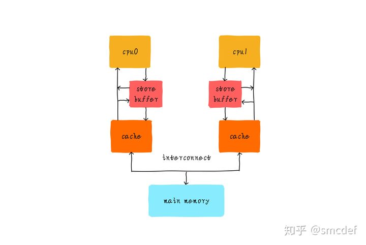

本文内容转自知乎用户 smcdef 的：[高速缓存与一致性专栏索引](https://zhuanlan.zhihu.com/p/136300660)


------


>   我们引入高速缓存的目的就是为了降低内存访问的延迟，谁知硬件工程师依然不满足高速缓存带来的延迟。为了进一步加快内存访问速度，硬件引入了新的缓存 - store buffer。随着 store buffer 的引入，彻底刷新了软件工程师对代码执行流的认知。我们之前考虑的一致性问题属于高速缓存一致性考虑的范畴，接下来面临的问题属于内存一致性范畴。

# 内存一致性模型-TSO

就像 spinlock 的进化史，软件工程师会对自己的代码做足够的优化以提高性能。同样，硬件工程也不甘示弱，尽最大的努力设计硬件以获取更好的性能。我们引入高速缓存的目的就是为了降低内存访问的延迟，谁知硬件工程师依然不满足于高速缓存带来的延迟，当然软件工程师或许也不满足。为了进一步加快内存访问速度，硬件引入了新的缓存 - store buffer。随着 store buffer 的引入，彻底刷新了软件工程师对代码执行流的认知。store buffer 又是怎么刷新我们的认知呢？

>   文章测试代码已经开源，可以点击 [这里](https://link.zhihu.com/?target=https%3A//github.com/smcdef/memory-reordering) 查看。

## store buffer是什么

在之前的文章介绍中，我们了解到每个 CPU 都会有自己私有 L1 Cache。从我了解的资料来说，L1 Cache 命中的情况下，访问数据一般需要 2 个指令周期。而且当 CPU 遭遇写数据 cache 未命中时，内存访问延迟增加很多。硬件工程师为了追求极致的性能，在 CPU 和 L1 Cache 之间又加入一级缓存，我们称之为 **store buffer**。

store buffer 和 L1 Cache 还有点区别，它只缓存 CPU 的写操作。store buffer 访问一般只需要 1 个指令周期，这在一定程度上降低了内存写延迟。store buffer 大小一般只有几十个字节。大小和 L1 Cache 相比，确实是小巫见大巫了。

不管 cache 是否命中，CPU 都是将数据写入 store buffer。store buffer 负责后续以 FIFO 次序写入 L1 Cache。

 


## store buffer对程序的影响

我们现在知道，当存在 store buffer 的情况下。针对写操作，CPU 直接把数据扔给 store buffer。后续 store buffer 负责以 **FIFO 次序** 写回 L1 Cache。这会对我们的程序产生什么影响呢？我们来看个例子。

```c
static int x = 0, y = 0;
static int r1, r2;


static void int thread_cpu0(void)
{
        x = 1;    /* 1) */
        r1 = y;   /* 2) */
}


static void int thread_cpu1(void)
{
        y = 1;    /* 3) */
        r2 = x;   /* 4) */
}


static void check_after_assign(void)
{
        printk("r1 = %d, r2 = %d\n", r1, r2);
}
```

假设 thread_cpu0 在 CPU0 上执行，thread_cpu1 在 CPU1 上执行。在多核系统上，我们知道两个函数 4 条操作执行可以互相交错。理论上来我们有以下 6 种排列组合。

```text
1) x = 1;   2) r1 = y;  3) y = 1;   4) r2 = x;    -->    r1 = 0, r2 = 1
1) x = 1;   3) y = 1;   2) r1 = y;  4) r2 = x;    -->    r1 = 1, r2 = 1
1) x = 1;   3) y = 1;   4) r2 = x;  2) r1 = y;    -->    r1 = 1, r2 = 1
3) y = 1;   4) r2 = x;  1) x = 1;   2) r1 = y;    -->    r1 = 1, r2 = 0 
3) y = 1;   1) x = 1;   4) r2 = x;  2) r1 = y;    -->    r1 = 1, r2 = 1 
3) y = 1;   1) x = 1;   2) r1 = y;  4) r2 = x;    -->    r1 = 1, r2 = 1
```

当我们确保 thread_cpu0 和 thread_cpu1 执行完成后，调用 check_after_assign() 会打印什么提示信息呢？根据以上 6 种组合，我们可能会得到如下 3 种结果。

```text
r1 = 1, r2 = 1
r1 = 0, r2 = 1
r1 = 1, r2 = 0
```

这个结果是符合我们的认知的。当我们考虑 store buffer 时，会是怎样的结果呢？

我们就以`1) 3) 2) 4)`的执行次序说明问题。

当 CPU0 执行 `x = 1` 时，x 的值会被写入 CPU0 的 store buffer。

CPU1 指令 `y = 1` 操作，同样 y 的值会被写入 CPU1 的 store buffer。

接下来，`r1 = y` 执行时，CPU0 读取 y 的值，由于 y 的新值依然在 CPU1 的 store buffer 里面，所以 CPU0 看到 y 的值依然是 0。所以 r1 的值是 0。为什么 CPU0 看到 r1 的值是 0 呢？因为硬件 MESI 协议只会保证 Cache 一致性，只要值没有被写入 Cache（依然躺在 store buffer 里面），MESI 就管不着。

同样的道理，r2 的值也会是 0。此时我们看到了一个意外的结果。

```text
r1 = 0, r2 = 0
```

这里有个注意点，虽然 store buffer 主要是用来缓存 CPU 的写操作，但是 CPU 读取数据时也会检查私有 store buffer 是否命中，如果没有命中才会查找 L1 Cache。这主要是为了 CPU 自己看到自己写进 store buffer 的值。所以 CPU0 是可以看到 x 值更新，但是 CPU1 不能及时看到 x。同样，CPU1 可以看到 y 值更新，但是 CPU0 不能及时看到 y。

所以，我们经常说“**单核乱序对程序员是透明的，只有其他核才会受到乱序影响**”。


## TSO模型

我们应该如何去理解这样的结果呢？我们先简单了解下一致性问题。

一致性分为两种，一种是 cache 一致性。cache 一致性是我们之前文章中一直关注的点。而这里举例出现的问题属于内存一致性范畴。

cache 一致性和内存一致性有什么区别呢？

我的总结是，cache 一致性关注的是多个 CPU 看到一个地址的数据是否一致。而内存一致性关注的是多个 CPU 看到多个地址数据读写的次序。一个关注的是**一个地址**，一个关注的是**多个地址**的顺序。还是有点区别。

为什么内存一致性关注的是多个地址的顺序呢？一个地址不会有问题吗？

由于 store buffer 的存在，CPU0 对一个地址数据的操作，其他 CPU 并不能及时看见，但是这又有什么影响呢？顶多相当于 CPU0 迟一点更新这个地址的数据而已。因此考虑多个地址数据的操作次序才有意义。针对内存一致性问题，我们提出内存模型的概念。为什么需要内存模型呢？我觉得主要是为了方便软件工程师在不理解硬件的情况下，还能理解代码执行是怎么回事，并编写正确的并行代码。

现在我们开始尝试遗忘 store buffer 吧！我们如何从内存模型的角度理解这个例子呢？

上面的例子出现`r1 = 0, r2 = 0`的结果，这个结果和 `2) 4) 1) 3)` 的执行结果吻合。在其他 CPU 看来，CPU0 似乎是 `1)` 和 `2)` 指令互换，CPU1 似乎是 `3)` 和 `4)` 指令互换，执行的结果。

我们针对写操作称之为 store，读操作称之为 load。所以我们可以这么理解，CPU0 的 store-load 操作，在别的 CPU 看来乱序执行了，变成了 load-store 次序。这种内存模型，我们称之为完全存储定序 (Total Store Order)，简称 TSO。

store 和 load 的组合有 4 种。分别是 store-store，store-load，load-load 和 load-store。

TSO 模型中，只存在 store-load 存在乱序，另外 3 种内存操作不存在乱序。当我们知道了一个 CPU 的内存模型，就可以根据具体的模型考虑问题。而不用纠结硬件实现的机制，也不用关心硬件做了什么操作导致的乱序。我们只关心内存模型。所以内存够模型更像是一种理论，一种标准，CPU 设计之初就需要遵循的法则。当我们知道一款 CPU 的内存模型，在编写并发代码时就需要时刻考虑乱序带来的影响。我们常见的 PC 处理器 x86-64 就是常见的 TSO 模型。


## 看的见的乱序

我们就以 x86-64 为例，展示看得见的乱序。我们现在需要做的是构造测试环境。我们参考上面的举例构造 2 个 CPU 分别执行的两个函数。

```c
static void ordering_thread_fn_cpu0(void)
{
        down(&sem_x);
        x = 1;
        /* Prevent compiler reordering. */
        barrier();
        r1 = y;
        up(&sem_end);
}


static void ordering_thread_fn_cpu1(void)
{
        down(&sem_y);
        y = 1;
        /* Prevent compiler reordering. */
        barrier();
        r2 = x;
        up(&sem_end);
}
```

代码看起来应该很熟悉，就是和上面的例子代码一致。`barrier()`是编译器屏障，后续会有文章介绍。这里先忽略吧，你可以理解成防止编译器优化。现在我们需要一个观察者，我们就利用 CPU2 作为观察者。

```c
static void ordering_thread_fn_cpu2(void)
{
        static unsigned int detected;


        /* Reset x and y. */
        x = 0;
        y = 0;


        up(&sem_x);
        up(&sem_y);


        down(&sem_end);
        down(&sem_end);


        if (r1 == 0 && r2 == 0)
                pr_info("%d reorders detected\n", ++detected);
}
```

我们通过 sem_x 和 sem_y 两个信号量通知 CPU0 和 CPU1 执行代码，目的是为了 CPU0 和 CPU1 的代码执行交织在一起。数据存储在 store buffer 里面是短暂的。所以要创造并行执行的环境才容易看得到乱序。sem_end 作用是通知观察者 CPU2，可以查看结果了。


## 如何保证顺序性

如果我们确实不希望看到 `r1 = 0, r2 = 0` 的结果，我们该怎么办呢？

硬件提供了内存屏障指令保证顺序一致性。很幸运，当然也很不幸运。幸运的是我们有方法阻止这种情况发生，不幸的是，看起来像是硬件工程师把锅甩给软件工程师。

具体的指令细节，我们当然不关注。毕竟每个 arch 的指令都不一样。Linux 内核中提供了 `smp_mb()` 宏对不同架构的指令进行封装，`smp_mb()` 的作用是阻止它后面的读写操作不会乱序到宏前面的指令前执行。他就像是个屏障一样，不容逾越。

```text
store---------------------+
load----------+           |
              |           |
              v           v
-----------------smp_mb()--------------
              ^           ^
              |           |
load----------+           |
store---------------------+
```

`smp_mb()` 后面的 load/store 绝不允许越过 `smp_mb()` 前执行。当然前面的 load/store 也不能越界到它的后面执行。但是 `smp_mb()` 前面的 load/store 操作怎么乱序就管不着了，同样 `smp_mb()` 后面的 load/store 操作也管不着。

例如下面的代码。第 1 行和第 2 行，依然可能乱序。同样，第 4 行和第 5 行也可能乱序。但是绝不会出现第 1 行或者第 2 行跑到 `smp_mb()` 后面，同样第 4 行或者第 5 行也不会跑到 `smp_mb()` 前面。

```text
a = 1;
b = c;
smp_mb();
d = 1;
e = f;
```

如何 fix 以上的例子呢？我们只需要简单的将 `barrier()` 替换成 `smp_mb()` 操作即可。

```c
void ordering_thread_fn_cpu0(void)
{
        x = 1;
        smp_mb();
        r1 = y;
}      


static void ordering_thread_fn_cpu1(void)
{
        y = 1;
        smp_mb();
        r2 = x;
}
```

现在的代码我们可以这么理解，`r1 = y` 不会比 `x = 1` 先执行。同样 `r2 = x` 不会在 `y = 1` 前执行。这样的话，就不会出现上述 `2) 4) 1) 3)` 执行流的结果。自然也不会出现 `r1 = 0, r2 = 0` 的结果。


## 总结

我们引出 store buffer 的存在只是为了让你有个概念，初衷并不是为了解释内存屏障指令的工作原理。当我们思考内存一致性问题时，我们应该关注的是内存模型。根据内存模型理论，就可以指导我们写出正确的代码。

你可能会还有疑问，我们什么情况下需要考虑内存乱序呢？我觉得可以总结以下几点：

-   是否有共享数据？私有数据不存在竞争，所以就不需要考虑内存序。
-   共享数据是否可能被多个 CPU 并行访问？这里是**并行**，不是并发。并行是指多个 CPU 可能同时访问共享数据。这里有两点需要注意。
    1.  例如 spinlock 保护的数据访问，并不属于并发访问，因为同一时间只有一个人进入临界区。所以并不存在并发。不需要考虑乱序。
    2.  如果共享数据只会被一个 CPU 访问（例如绑核或者 per cpu 变量），也不需要考虑乱序。之前说了**单核乱序对程序员是透明的，只有其他核才会受到乱序影响**，一个 CPU 的情况，就不会出现其他观察者。
-   是否有多个共享数据？多个数据之间的读写访问，是否需要保证一定的次序？如果需要保证次序，就需要考虑乱序。如果不 care 访问次序，那就没必要考虑乱序。


------


>   我们第一次接触的内存模型是 TSO，这是最简单的一种模型。随着 store buffer 不以 FIFO 次序更新 Cache 之后，我们提出了新的内存模型 PSO。

# 内存一致性模型-PSO

TSO 内存一致性模型我们已经有所了解。在 TSO 模型中，我们说过 store buffer 会按照 FIFO 的顺序将数据写入 L1 Cache。例如我们执行如下的代码：

```c
x = 10;
y = 1;
```

我们知道按照 TSO 模型的执行思路，首先 x=10 的值会写入 store buffer，同样 y=1 的值也会写入 store buffer。然后按照 FIFO 的次序写入 L1 Cache。假设 y 变量已经缓存在 L1 Cache。但是 x 变量没有缓存。理论上来说我们可以先将 y 写入 Cache，然后将 x 写入 Cache。因为 x 和 y 操作看起来没有任何关系，这么做看起来没什么影响。如果这样做的话，还会让 store buffer 腾出多余的空间以缓存后续的 CPU 操作。这在一定程度又可以提升性能。此时，store buffer 不再以 FIFO 的次序写入 Cache。这种硬件优化会对程序的运行又会造成什么影响呢？


## 问题引入

我们假设 flag 和 data 的初始值是 0。CPU0 执行 `write_data_cpu0()` 更新数据 `data`，以 `flag` 变量标识数据更新完成。CPU1 执行 `read_data_cpu1()` 等待数据更新完成，然后读取数据 `data`。我们来分析这个过程。

```c
int flag, data;


static void write_data_cpu0(int value)
{
        data = value;
        flag = 1;
}


static void read_data_cpu1(void)
{
        while (flag == 0);
        return data;
}
```

1.  CPU0 将 data 更新的值写入 store buffer。
2.  CPU0 将 flag 的值写入 store buffer。
3.  CPU1 读取 flag 的值，由于 flag 新值还在 CPU0 的 store buffer 里面，所以 CPU1 看到的 flag 值依然是 0。所以 CPU1 继续自旋等待。
4.  CPU0 的 store buffer 将 flag 的值写入 Cache，此时 data 的值依然在 store buffer 里面没有更新到 Cache。
5.  CPU1 发现 flag 的值是 1，退出循环。然后读取 data 的值，此时 data 的值是旧的数据，也就是 0。因为 data 的新值还在 CPU0 的 store buffer 里面。
6.  CPU0 的 store buffer 将 data 的值写入 Cache。

我们已经看到了不想要的结果。按照 TSO 内存模型分析这个例子的话，我们是一定能够保证 CPU1 读取到新值。因为 TSO 模型中，store buffer 是按照 FIFO 的次序写入 Cache。但是由于现在 store buffer 不以 FIFO 的次序更新 Cache，所以导致 CPU1 读取到 data 的旧值 0。对于 CPU 来说是不知道 `data` 和 `flag` 之间是有依赖关系的，CPU 认为 `data` 和 `flag` 的值谁先写入 Cache 都无所谓。所以做出了这种优化。我们如何换个思路理解这个现象呢？


## PSO模型

我们知道 TSO 模型可以看成 store-load 操作可以乱序成 load-store。现在，我们提出了一种新的内存模型，部分存储定序 (Part Store Order)，简称 PSO。PSO 在 TSO 的基础上继续允许 store-store 乱序。上面的例子中 CPU1 看到 CPU0 对内存的操作顺序可能是下面这样的。

```c
flag = 1;
data = value;
```

还是那句话，CPU0 看自己的内存操作是顺序的，只是 CPU1 看 CPU0 内存操作可能是乱序的。现在我们可以忘记 store buffer 的存在，从内存模型的角度考虑这个程序。data 和 flag 操作都是 store，所以按照 PSO 模型来说，其他 CPU 是可以看到乱序操作的结果。这样就很容易理解了。尽量不去思考硬件为什么会这样，而是认为这是 PSO 模型理所应当存在的现象。


## 如何保证顺序一致

Linux 内核中提供了 `smp_wmb()` 宏对不同架构的指令进行封装，`smp_wmb()` 的作用是阻止它后面的写操作不会乱序到宏前面的写操作指令前执行。它就像是个屏障，写操作不容逾越。`smp_wmb()` 充当的就是一个 store-store 屏障。但是这个屏障只针对 store 操作，对 load 操作不影响。

```text
store---------+
              |
              v
-------store-store barrier--------
              ^
              |
store---------+
```

如果我们需要上述的示例代码在 PSO 模型的处理器上正确运行(按照我们期望的结果运行)，就需要做出如下修改。

```c
static void write_data_cpu0(int value)
{
        data = value;
        smp_wmb();
        flag = 1;
}
```

`smp_wmb()` 可以保证 CPU1 看到 flag 的值为 1 时，data 的值一定是最新的值。


## 总结

当使用 PSO 模型时，我们知道 PSO 模型允许两种操作乱序。分别是 store-store 和 store-load。我们需要根据需求选择使用 `smp_mb()` 或者 `smp_wmb()` 保证顺序一致性。


------


>   硬件的优化总是追求极致的。硬件工程师在不满足于 PSO 的基础上提出了更弱的内存模型 RMO。

# 内存一致性模型-RMO

似乎有一段时间没有更新了，为什么停止了更新呢？在总结和理解内存屏障的过程中，自己重新陷入了思考。但是仍然没有完全理解这其中的精髓。所以迟迟无法动笔。总感觉每次这种思考都会是自己对知识的理解更进一步，仅仅是更进一步，而不是彻底领悟。但是这也足够我理解很多简单而常见的场景，我也希望能将这些理解慢慢灌输出来。

目前为止我们已经接受了两种乱序类型，分别是 store-store 和 store-load。还剩下最后 2 种操作组合，分别是 load-load 和 load-store。我们对内存模型已经有了一定的认知，所以按照常理来说，理应有一种内存模型允许 4 种操作都可以乱序。这就是 Relaxed Memory Order，简称 RMO。例如 aarch64 就是典型的 RMO 模型。

>   文章测试代码已经开源，可以点击 [这里](https://link.zhihu.com/?target=https%3A//github.com/smcdef/memory-reordering) 查看。


## 不想提及的乱序原因

总是有些朋友希望探究真理或者硬件的细节，希望知道乱序导致的原因。但是这些真的是硬件细节的东西，有些硬件细节我们是查不到的，包括芯片的数据手册，因为这些硬件相关，和软件无关。而手册更多的是阐述软件应该注意的事项，应该注意什么。而不是解释硬件如何实现的。所以有些东西或许不是很值得深究。深究下去或许反而会影响自己的理解。我们作为软件从业者，更应该的是从软件的角度思考，内存模型的提出正是这一目的。我们需要知道的是某一种内存模型允许的乱序类型，而不是关注为什么引起乱序（或者从硬件的角度思考为什么会这样）。导致乱序的原因很多，并不是单一的硬件细节。我从 aarch64 的手册找到如下可能导致乱序的原因。但是这些原因也没用提及硬件设计如何导致的。所以算是了解就好。

-   Multiple issue of instructions
-   Out-of-order execution
-   Speculation
-   Speculative loads
-   Load and store optimizations
-   External memory systems
-   Cache coherent multi-core processing
-   Optimizing compilers

可以看出硬件做出了足够多的优化，这一切综合的结果。而我们之前提及 store buffer 也是硬件细节实现之一，为什么我会提到 store buffer 了？我们不是说不关注硬件细节吗？确实不应该关注硬件细节，但是知道 store buffer 的存在很重要。后续会有文章提到 store buffer 是如何影响驱动代码编写的。不仅仅是乱序这点，当然这是后话。


## 旧事重提

还记得 PSO 文章提及的例子吗？当我们以 RMO 的模型考虑问题时，事情就不再是那么简单了。我们在 write_data_cpu0() 加入 smp_wmb() 后还不足以解决问题。我还需要在读取测加入 smp_rmb() 屏障。因此完整修改如下。

```c
static int flag, data;


static void write_data_cpu0(int value)
{
        data = value;
        smp_wmb();
        flag = 1;
}

static void read_data_cpu1(void)
{
        while (flag == 0);
        smp_rmb();
        return data;
}
```

在之前的文章中，我们已经见识了 smp_mb() 和 smp_wmb() 的作用，这里引入一个新的读屏障 smp_rmb()。

smp_rmb() 保证屏障后的读操作不会乱序到屏障前的读操作，只针对读操作，不影响写操作。

```text
store--------------------------+
load----------+                |
              |                |   ^
              v                |   |
------------smp_rmb()----------|---|------
              ^                |   |
              |                v   |
load----------+                    |
store------------------------------+
```


## 看得见的乱序

我们以 aarch64 测试乱序。我们可以使用常见的手机或者 aarch64 服务器测试。我们使用 3 个 CPU 测试，CPU0 负责更新计数。

```c
static atomic_t count = ATOMIC_INIT(0);


static void ordering_thread_fn_cpu0(void)
{
        atomic_inc(&count);
}
```

CPU1 负责顺序写入 a 和 b，a 和 b 会被顺序赋值为 count。假设不溢出的情况下，**理论上a一定大于等于b**。

```c
static unsigned int a, b;


static void ordering_thread_fn_cpu1(void)
{
        int temp = atomic_read(&count);

        a = temp;
        /* Prevent compiler reordering. */
        barrier();
        b = temp;
}
```

现在引出我们观察者 CPU2，CPU2 负责顺序读取 b 和 a。理论上来说，**d一定小于等于c**。当 d 大于 c 时，就说明我们观察到了乱序。

```c
static void ordering_thread_fn_cpu2(void)
{
        unsigned int c, d;

        d = b;
        /* Prevent compiler reordering. */
        barrier();
        c = a;

        if ((int)(d - c) > 0)
                pr_info("reorders detected, a = %d, b = %d\n", c, d);
}
```

我们该如何理解这段这个结果呢？我们知道 RMO 模型允许 store-store 乱序。因此，CPU2 看到 CPU1 的执行顺序可能是先写 b 再写 a，这是可能造成结果的原因之一。除此以外，RMO 模型同样允许 load-load 乱序，因此 CPU2 读取 b 的 c 的值可能也是反过来的。这是造成结果的第二个可能原因。


## 如何保证顺序

以上的例子中，如果我们不希望看到 d 比 c 大的情况出现（如果不介意出现的话，就无所谓了），我们该如何做呢？

为了防止 CPU1 出现 store-store 乱序，我们可以插入 smp_wmb()。

同样，为了防止 CPU2 出现 load-load 乱序，我们还应该插入 smp_rmb()。

```c
static void ordering_thread_fn_cpu1(void)
{
        int temp = atomic_read(&count);


        a = temp;
        smp_wmb();
        b = temp;
}


static void ordering_thread_fn_cpu2(void)
{
        unsigned int c, d;


        d = b;
        smp_rmb();
        c = a;


        if ((int)(d - c) > 0)
                pr_info("reorders detected, a = %d, b = %d\n", c, d);
}
```

经过如此修改后，就不会出现 d 比 c 大的情况了。


## 总结

1.  如上面所述，我们知道硬件做了足够的优化可能导致乱序。在单核系统下，这种乱序的影响对程序员是透明的。例如上述的 ordering_thread_fn_cpu2()。CPU2 来说，a 和 b 先 load 哪个变量，其实是无所谓的。因为 CPU 并不知道 a 和 b 之间的这种特殊依赖性。CPU 认为是 a 和 b 是没有任何关系的。
2.  如果访问的数据不存在竞争，根本不用考虑内存乱序。这是大多数局变量的场景。
3.  如果访问数据存在竞争，但是可以保证该数据竞争只会出现在单核上（例如竞争访问的线程都是绑定一个CPU上）。同样不需要考虑 CPU 乱序。这就是硬件最基本的保证，对单核透明。
4.  写任何一个通用的程序我们都应该假设 CPU 类型是 RMO 模型。因为你不知道什么时候这段代码就可能在 RMO 模型上运行。
5.  内存屏障的使用应该成对，例如 smp_wmb 必须配对 smp_rmb 或者 smp_mb，单独使用 smp_wmb 是达不到顺序效果的。同样 smp_rmb 必须配对使用 smp_wmb 或者 smp_mb。


------


>   所有的内存模型告一段落。但是这并不是终点。软件工程师也不甘示弱，编译器优化工程师针对指令也会优化排序，编译器的插手使问题又复杂了一步。我们看下编译器是如何指令重排。

# 编译乱序

经过前面的介绍。我们应该对 CPU 乱序有了一定的认知。但是 CPU 乱序只是乱序的一部分，另一部分就是编译器乱序。我们之前提到的 smp_wmb，smp_rmb，smp_mb 都是 CPU 内存屏障指令的封装，目的是防止 CPU 乱序。而编译器乱序是编译器优化代码的结果。我们同样需要编译器屏障阻止编译器优化导致的乱序。

编译器（compiler）的工作之一是优化我们的代码以提高性能。这包括在不改变程序行为的情况下重新排列指令。因为 compiler 不知道什么样的代码需要线程安全（thread-safe），所以 compiler 假设我们的代码都是单线程执行（single-threaded），并且进行指令重排优化并保证是单线程安全的。因此，当你不需要 compiler 重新排序指令的时候，你需要显式告编译器，我不需要重排，否则，它可不会听你的。

本篇文章中，我们一起探究 compiler 关于指令重排的优化规则。

>   注：测试使用 aarch64-linux-gnu-gcc 编译器，版本：7.3.0


## 编译器指令重排

compiler 的主要工作就是将对人们可读的源码转化成机器语言，机器语言就是对 CPU 可读的代码。因此，compiler 可以在背后做些不为人知的事情。我们考虑下面的 C 语言代码：

```c
int a, b;

void foo(void)
{
        a = b + 1;
        b = 0;
}
```

使用 aarch64-linux-gnu-gcc 在不优化代码的情况下编译上述代码，使用 objdump 工具查看 foo() 反汇编结果：

```c-objdump
foo:
        adrp    x0, b
        add     x0, x0, :lo12:b
        ldr     w0, [x0]          # w0 = b
        add     w1, w0, 1         # w1 = w0 + 1 = b + 1
        adrp    x0, a
        add     x0, x0, :lo12:a
        str     w1, [x0]          # a = b + 1
        adrp    x0, b
        add     x0, x0, :lo12:b
        str     wzr, [x0]         # b = 0
        nop
        ret
```

我们应该知道 Linux 默认编译优化选项是 -O2（默认情况下 O0 编译 kernel 也编译不过）。因此我们采用 -O2 优化选项编译上述代码，并反汇编得到如下汇编结果：

```c-objdump
foo:
        adrp    x1, b
        adrp    x2, a
        ldr     w0, [x1, #:lo12:b]    # w0 = b
        str     wzr, [x1, #:lo12:b]   # b = 0
        add     w0, w0, 1             # w0 = w0 + 1 = b + 1
        str     w0, [x2, #:lo12:a]    # a = w0 = b + 1
        ret
```

比较优化和不优化的结果，我们可以发现。在不优化的情况下，a 和 b 的写入内存顺序符合代码顺序（program order）。但是 -O2 优化后，a 和 b 的写入顺序和program order 是相反的。-O2 优化后的代码转换成 C 语言可以看作如下形式：

```c
int a, b;

void foo(void)
{
        register int reg = b;

        b = 0;
        a = reg + 1;
}
```

这就是 compiler reordering（编译器重排）。为什么可以这么做呢？对于单线程来说，a 和 b 的写入顺序，compiler 认为没有任何问题。并且最终的结果也是正确的（a == 1 && b == 0），因此编译器才会这么做。

这种 compiler reordering 在大部分情况下是没有问题的。但是在某些情况下可能会引入问题。例如我们使用一个全局变量 `flag` 标记共享数据 `data` 是否就绪。由于 compiler reordering，可能会引入问题。考虑下面的代码（无锁编程）：

```c
int flag, data;

void write_data(int value)
{
        data = value;
        flag = 1;
}

void read_data(void)
{
        int res;

        while (flag == 0);
        res = data;
        flag = 0;
        return res;
}
```

先来简单的介绍代码功能。我们拥有 2 个线程，一个用来更新数据，也就是更新 data 的值。使用 flag 标志 data 数据已经准备就绪，其他线程可以读取。另一个线程一直调用 read_data()，等待 flag 被置位，然后返回读取的数据 data。

如果 compiler 产生的汇编代码是 flag 比 data 先写入内存。那么，即使是单核系统上，我们也会有问题。在 flag 置 1 之后，data 写 45 之前，系统发生抢占。另一个进程发现 flag 已经置 1，认为 data 的数据已经准别就绪。但是实际上读取 data 的值并不是 45（可能是上次的历史数据或者非法数据）。为什么 compiler 还会这么操作呢？因为，compiler 是不知道 data 和 flag 之间有严格的依赖关系。这种逻辑关系是我们人为强加的。那么我们如何避免这种优化呢？


## 显式编译器屏障

为了解决上述变量之间存在依赖关系导致 compiler 错误优化。compiler 为我们提供了编译器屏障（compiler barriers），可用来告诉 compiler 不要 reorder。我们继续使用上面的 foo() 函数作为演示实验，在代码之间插入compiler barriers。

```c
#define barrier() __asm__ __volatile__("": : :"memory")

int a, b;

void foo(void)
{
        a = b + 1;
        barrier();
        b = 0;
}
```

barrier() 就是 compiler 提供的屏障，作用是告诉 compiler 内存中的值已经改变，之前对内存的缓存（缓存到寄存器）都需要抛弃，barrier() 之后的内存操作需要重新从内存 load，而不能使用之前寄存器缓存的值。并且可以防止 compiler 优化 barrier() 前后的内存访问顺序。

barrier() 就像是代码中的一道不可逾越的屏障，barrier 前的 load/store 操作不能跑到 barrier后面；同样，barrier 后面的 load/store 操作不能在 barrier 之前。

依然使用 -O2 优化选项编译上述代码，反汇编得到如下结果：

```c-objdump
foo:
        adrp    x1, b
        adrp    x2, a
        ldr     w0, [x1, #:lo12:b]    # w0 = b
        add     w0, w0, 1             # w0 = w0 + 1
        str     w0, [x2, #:lo12:a]    # a = b + 1
        str     wzr, [x1, #:lo12:b]   # b = 0
        ret
```

我们可以看到插入 compiler barriers 之后，a 和 b 的写入顺序和 program order 一致。因此，当我们的代码中需要严格的内存顺序，就需要考虑 compiler 。barriers。


## 隐式编译器屏障

除了显示的插入 compiler barriers 之外，还有别的方法阻止 compiler reordering。例如 CPU barriers 指令，同样会阻止 compiler reordering。后续我们再考虑 CPU barriers。

除此以外，当某个函数内部包含 compiler barriers 时，该函数也会充当 compiler barriers 的作用。即使这个函数被 inline，也是这样。例如上面插入 barrier() 的 foo() 函数，当其他函数调用 foo() 时，foo() 就相当于 compiler barriers。考虑下面的代码：

```c
int a, b, c;

void fun(void)
{
        c = 2;
        barrier();
}

void foo(void)
{
        a = b + 1;
        fun();      /* fun() call act as compiler barriers */
        b = 0;
}
```

fun() 函数包含 barrier()，因此 foo() 函数中 fun() 调用也表现出 compiler barriers 的作用。同样可以保证 a 和 b 的写入顺序。如果 fun() 函数不包含 barrier()，结果又会怎么样呢？实际上，大多数的函数调用都表现出 compiler barriers 的作用。但是，这不包含 inline 的函数。因此，fun() 如果被 inline 进 foo()，那么 fun() 就不会具有 compiler barriers 的作用。如果被调用的函数是一个外部函数，其副作用会比 compiler barriers 还要强。因为 compiler 不知道函数的副作用是什么。它必须忘记它对内存所作的任何假设，即使这些假设对该函数可能是可见的。我们看一下下面的代码片段，printf() 一定是一个外部的函数。

```c
int a, b;

void foo(void)
{
        a = 5;
        printf("smcdef");
        b = a;
}
```

同样使用 -O2 优化选项编译代码，objdump 反汇编得到如下结果。

```c-objdump
foo:
        stp     x29, x30, [sp, -32]!
        mov     w1, 5
        adrp    x0, .LC0
        mov     x29, sp
        str     x19, [sp, 16]
        adrp    x19, a
        add     x0, x0, :lo12:.LC0
        str     w1, [x19, #:lo12:a]    # a = 5
        bl      printf                 # printf("smcdef")
        adrp    x0, b
        ldr     w1, [x19, #:lo12:a]    # w1 = a
        ldr     x19, [sp, 16]
        str     w1, [x0, #:lo12:b]     # b = w1 = a
        ldp     x29, x30, [sp], 32
        ret
.LC0:
        .string "smcdef"
```

compiler 不能假设 printf() 不会使用或者修改 a 变量。因此在调用 printf() 之前会将 a 写 5，以保证 printf() 可能会用到新值。在 printf() 调用之后，重新从内存中 load a 的值，然后赋值给变量 b。重新 load a 的原因是 compiler 也不知道 printf() 会不会修改 a 的值。

因此，我们可以看到即使存在 compiler reordering，但是还是有很多限制。当我们需要考虑 compiler barriers时，一定要显示的插入 barrier()，而不是依靠函数调用附加的隐式 compiler barriers。因为，谁也无法保证调用的函数不会被 compiler 优化成 inline 方式。


## barrier()除了防止编译乱序，还能做什么

barriers() 作用除了防止 compiler reordering 之外，还有什么妙用吗？我们考虑下面的代码片段。

```c
int run = 1;

void foo(void)
{
        while (run)
                ;
}
```

run 是个全局变量，foo() 在一个进程中执行，一直循环。我们期望的结果是 foo() 一直等到其他进程修改 run 的值为 0 才退出循环。实际 compiler 编译的代码和我们会达到我们预期的结果吗？我们看一下汇编代码。

```c-objdump
foo:
        adrp    x0, .LANCHOR0
        ldr     w0, [x0, #:lo12:.LANCHOR0]  # w0 = run
.L2:
        cbnz    w0, .L2                     # if (w0) while (1);
        ret
run:
        .word   1
```

汇编代码可以转换成如下的 C 语言形式。

```c
int run = 1;

void foo(void)
{
        register int reg = run;

        if (reg)
                while (1)
                        ;
}
```

compiler 首先将 run 加载到一个寄存器 reg 中，然后判断 reg 是否满足循环条件，如果满足就一直循环。但是循环过程中，寄存器 reg 的值并没有变化。因此，即使其他进程修改 run 的值为0，也不能使 foo() 退出循环。很明显，这不是我们想要的结果。我们继续看一下加入 barrier() 后的结果。

```c
#define barrier() __asm__ __volatile__("": : :"memory")

int run = 1;

void foo(void)
{
        while (run)
                barrier();
}
```

其对应的汇编结果：

```c-objdump
foo:
        adrp    x1, .LANCHOR0
        ldr     w0, [x1, #:lo12:.LANCHOR0]
        cbz     w0, .L1
        add     x1, x1, :lo12:.LANCHOR0
.L3:
        ldr     w0, [x1]    # w0 = run
        cbnz    w0, .L3     # if (w0) goto .L3
.L1:
        ret
run:
        .word   1
```

我们可以看到加入 barrier() 后的结果真是我们想要的。每一次循环都会从内存中重新 load run 的值。因此，当有其他进程修改 run 的值为 0 的时候，foo() 可以正常退出循环。为什么加入 barrier() 后的汇编代码就是正确的呢？

因为 barrier() 作用是告诉 compiler 内存中的值已经变化，后面的操作都需要重新从内存 load，而不能使用寄存器缓存的值。因此，这里的 run 变量会从内存重新 load，然后判断循环条件。这样，其他进程修改 run 变量，foo() 就可以看得见。

在 Linux kernel 中，提供了 [cpu_relax()](https://link.zhihu.com/?target=https%3A//elixir.bootlin.com/linux/v4.15.7/source/arch/arm64/include/asm/processor.h%23L178) 函数，该函数在 ARM64 平台定义如下：

```c
static inline void cpu_relax(void)
{
       asm volatile("yield" ::: "memory");
}
```

我们可以看出，cpu_relax() 是在 barrier() 的基础上又插入一条汇编指令 yield。在 linux kernel 中，我们经常会看到一些类似上面举例的 while 循环，循环条件是个共享变量。为了避免上述所说问题，我们就会在循环中插入 cpu_relax() 调用。

```c
int run = 1;

void foo(void)
{
        while (run)
                cpu_relax();
}
```

当然也可以使用 Linux 提供的 READ_ONCE()。例如，下面的修改也同样可以达到我们预期的效果。

```c
int run = 1;

void foo(void)
{
        while (READ_ONCE(run))  /* similar to while (*(volatile int *)&run) */
                ;
}
```

当然你也可以修改 run 的定义为 `volatile int run;`，就会得到如下代码，同样可以达到预期目的。

```c
volatile int run = 1;

void foo(void)
{
        while (run)
                ;
}
```

更多关于volatile使用建议可以参考：[smcdef：为什么我们不应该使用volatile类型](https://zhuanlan.zhihu.com/p/102406978)


## CPU乱序和编译器乱序的关系

smp_wmb，smp_rmb，smp_mb 等都是防止 CPU 乱序的指令封装。是不是意味着这些接口仅仅阻止 CPU 乱序，而允许编译器乱序呢？答案肯定是不可能的。这里有个点需要记住，**所有的CPU内存屏障封装都隐式包含了编译器屏障**。


------


>   所有的理论终将要付诸于实践，因此作为软件工程师的我们如何正确使用屏障指令成为问题的关键。

# 如何使用屏障指令

距离上次文章更新已经半年多了。消失的背后可能为了更深的沉淀。我们谈了大半年的内存一致性基础。不知鸽了这么久，有多少人还在等着更新呢。在这段时间里，我也比以往对屏障的理解更深了一步。

曾经我也想过一个问题，在现实中真的会遇到由于屏障缺失导致的 BUG 吗？而我们又该如何使用屏障呢？怎么判断是否应该使用屏障呢？当需要的时候，又该如何选择哪种屏障类型呢？这不，巧了，消失的半年中，我还真的 fix 了一个屏障缺失的 BUG。正好借助这个例子实战一下吧。


### [w,r]mb和smp_[w,r]mb的选择

Linux 内核中很容易简单两种类型的屏障指令的封装。smp_[w,r]mb() 和 [w,r]mb()。代码中我们经常看到都是"smp"开头的屏障。当我们写代码时如何在这两者之间选择呢？我简单说下我的选择标准（可以保持怀疑态度）。如果内存操作的顺序的观察者全是 CPU，那么请使用 smp_[w,r]mb()。如果内存操作顺序涉及 CPU 和硬件设备（例如网络设备），请使用 [w,r]mb()。

另外，[w,r]mb() 比 smp_[w,r]mb() 的要求更严格。因此性能方面也是 [w,r]mb() 比 smp_[w,r]mb() 差。如果我们不写驱动的话，其实很少和设备打交道。因此一般都是选择 smp_[w,r]mb()。

我们看一个 wmb() 和 rmb() 的使用例子。我们需要到设备驱动中寻找，就顺便选一个我也不清楚的网卡驱动吧（drivers/net/8139too.c）。

```c
static netdev_tx_t rtl8139_start_xmit (struct sk_buff *skb,
				       struct net_device *dev)
{
	/*
	 * Writing to TxStatus triggers a DMA transfer of the data
	 * copied to tp->tx_buf[entry] above. Use a memory barrier
	 * to make sure that the device sees the updated data.
	 */
	wmb();
	RTL_W32_F (TxStatus0 + (entry * sizeof (u32)),
		   tp->tx_flag | max(len, (unsigned int)ETH_ZLEN));
}
```

从这里的注释我们其实可以看出 RTL_W32_F() 操作应该是发起一次设备 DMA 操作（通过写硬件寄存器实现）。wmb() 的作用是保证写入 DMA 发起操作命令之前写入内存的数据都已经写入内存，保证 DMA 操作时可以看见最新的数据。简单思考就是保证寄存器操作必须是最后发生的。我们继续找个 rmb() 的例子（drivers/net/bnx2.c）。

```c
static int bnx2_rx_int(struct bnx2 *bp, struct bnx2_napi *bnapi, int budget)
{
	sw_cons = rxr->rx_cons;
	sw_prod = rxr->rx_prod;
	/* Memory barrier necessary as speculative reads of the rx
	 * buffer can be ahead of the index in the status block
	 */
	rmb();
	while (sw_cons != hw_cons) {
}
```

这里的 rmb() 就是为了防止 while 循环里面的 load 操作在 rmb() 之前发生。也就说这里是有顺序要求的。设备方面的例子就不多说了，毕竟不是我们关注的重点。


### 编译器屏障barrier()的选择

编译器屏障 barrier() 不涉及任何硬件指令。是最弱的一种屏障，只对编译器有效。我们什么情况下应该选择 barrier() 呢？

还记得之前的文章提到如何判断是否需要使用硬件屏障指令的原则吗？你写的这段代码（包含内存操作）在真正意义上存在并行执行，也就是可能存在不止一个CPU 观察者。如果你能保证不可能同时存在多个 CPU 观察者（例如执行这段代码的进程都是绑定到一个 CPU），实际上你就不需要硬件指令级别屏障。此时你需要考虑的问题只有：是否需要使用编译屏障。

```c
void queued_spin_lock_slowpath(struct qspinlock *lock, u32 val)
{
	node = this_cpu_ptr(&qnodes[0].mcs);
	idx = node->count++;

	/*
	 * Ensure that we increment the head node->count before initialising
	 * the actual node. If the compiler is kind enough to reorder these
	 * stores, then an IRQ could overwrite our assignments.
	 */
	barrier();

	node->locked = 0;
	node->next = NULL;
}
```

这里以 qspinlock 的代码为例说明。这里的 node 是一个 per cpu 变量。按照 per cpu 变量的使用规则，同一时间只会存在一个 CPU 写这块内存。因此这里不存在多个 CPU 观察者。因此不需要 CPU 指令级别的屏障。而这里同样有顺序的要求，因此编译器屏障 barrier() 足以。


### smp_[w,r]mb()的选择

现在回归到我们的重点关注对象了。当同时存在多个 CPU 观察者，并且我们又有内存操作顺序的要求时，我们就应该考虑 smp_[w,r]mb() 的使用。在之前的文章中我们提到下面代码示例用来说明 TSO 乱序。

```text
initial: X = Y = 0

CPU 1                   CPU 2
===================     ===================
X = 1;                  Y = 1;
smp_mb();               smp_mb();
LOAD Y                  LOAD X
```

由于 smp_mb() 的加持，这里 CPU1 和 CPU2 至少有一个 CPU 可以看到其中一个变量的值是 1。不可能发生 CPU1 看到 Y 的值是 0，同时 CPU2 看到 X 的值是 0 的情况。这里抽象的是一个模型，一个非常常见的模型。例如下面的代码你肯定经常遇见。

我们经常看到有个进程尝试等待一个变量 event_indicated 为 true，然后退出循环。否则继续 schedule()。

```c
for (;;) {
    set_current_state(TASK_UNINTERRUPTIBLE);
    if (event_indicated)
        break;
    schedule();
}
```

另一段负责唤醒的代码通常长下面这样。置位 event_indicated，然后唤醒进程。

```c
event_indicated = 1;
wake_up_process(event_daemon);
```

我们想达到的目的其实很简单：当 event_indicated 为 1 时，进程一定是被唤醒的状态。我们把 set_current_state() 以及 wake_up_process() 部分细节展开如下：

```text
CPU 1 (Sleeper)                           CPU 2 (Waker)
============================              ===============================
current->state = TASK_UNINTERRUPTIBLE;    event_indicate = 1
LOAD event_indicated                      if ((LOAD task->state) & TASK_NORMAL)
                                              task->state = TASK_RUNNING
```

set_current_state 的目的是设置当前进程状态为 TASK_UNINTERRUPTIBLE。然后判断 event_indicated 是否满足条件。

而唤醒的逻辑是先无条件设置 event_indicated。然后尝试唤醒进程，但是唤醒前会先判断被唤醒的进程的状态 state 是否为 TASK_UNINTERRUPTIBLE 状态。

如果不是 TASK_UNINTERRUPTIBLE，说明进程已经处于唤醒状态，无需再次唤醒。所以这里涉及 2 个数据，分别是 current->state 和 event_indicated。

为了保证 sleep 进程被唤醒并退出 while 循环，我们必须保证要么 CPU1 看到 CPU2 设置的 event_indicate（然后退出循环），要么 CPU2 看到进程的 state 状态是 TASK_UNINTERRUPTIBLE（然后执行唤醒操作），要么 CPU1 既看到 event_indicate 等于 1 并且 CPU2 看到进程的 state 状态是 TASK_UNINTERRUPTIBLE（唤醒已经 running 的进程没有问题）。

但是我们不期望看到的结果是：CPU1 看到 event_indicated 的值是 0，CPU 看到进程的 state 状态不是 TASK_UNINTERRUPTIBLE。这种情况下，sleep 进程就错过了被唤醒。所以这里的模型抽象出来就是上面的 XY 模型。

为了防止这种情况出现，我们需要插入 2 条 smp_mb()。

```c
#define set_current_state(state_value)					\
	smp_store_mb(current->state, (state_value))

static int try_to_wake_up(struct task_struct *p, unsigned int state, int wake_flags)
{
	/*
	 * If we are going to wake up a thread waiting for CONDITION we
	 * need to ensure that CONDITION=1 done by the caller can not be
	 * reordered with p->state check below. This pairs with smp_store_mb()
	 * in set_current_state() that the waiting thread does.
	 */
	raw_spin_lock_irqsave(&p->pi_lock, flags);
	smp_mb__after_spinlock();
	if (!(p->state & state))
		goto unlock;
}
```

set_current_state() 的实现是 smp_store_mb()，相当于写完 state 后插入 smp_mb()。

wake_up_process() 最终会调用 try_to_wake_up()。我们在读取进程 state 前也插入了 smp_mb()（smp_mb__after_spinlock）。


### 实战分享

我们 fix 一个 io_uring 的 BUG。patch 可以看考 [Fix missing smp_mb() in io_cancel_async_work()](https://link.zhihu.com/?target=https%3A//patchwork.kernel.org/project/linux-block/patch/20201007031635.65295-3-songmuchun%40bytedance.com/)。

```diff
diff --git a/fs/io_uring.c b/fs/io_uring.c
index 2f46def7f5832..5d9583e3d0d25 100644
--- a/fs/io_uring.c
+++ b/fs/io_uring.c
@@ -2252,6 +2252,12 @@  static void io_sq_wq_submit_work(struct work_struct *work)
 
 		if (!ret) {
 			req->work_task = current;
+
+			/*
+			 * Pairs with the smp_store_mb() (B) in
+			 * io_cancel_async_work().
+			 */
+			smp_mb(); /* A */
 			if (req->flags & REQ_F_CANCEL) {
 				ret = -ECANCELED;
 				goto end_req;
@@ -3730,7 +3736,15 @@  static void io_cancel_async_work(struct io_ring_ctx *ctx,
 
 		req = list_first_entry(&ctx->task_list, struct io_kiocb, task_list);
 		list_del_init(&req->task_list);
-		req->flags |= REQ_F_CANCEL;
+
+		/*
+		 * The below executes an smp_mb(), which matches with the
+		 * smp_mb() (A) in io_sq_wq_submit_work() such that either
+		 * we store REQ_F_CANCEL flag to req->flags or we see the
+		 * req->work_task setted in io_sq_wq_submit_work().
+		 */
+		smp_store_mb(req->flags, req->flags | REQ_F_CANCEL); /* B */
+
 		if (req->work_task && (!files || req->files == files))
 			send_sig(SIGINT, req->work_task, 1);
 	}
```

简单说一下这里的 BUG，这里也同样设计 2 个变量，分别是 req->flags 和 req->work_task。模型抽象简化如下：

```text
CPU 1                   CPU 2
=====================   =====================
STORE req->flags        STORE req->work_task
smp_mb();               smp_mb();
LOAD req->work_task     LOAD req->flags
```

不期望看到的结果：req->work_task == NULL && (req->flags & REQ_F_CANCEL) == 0。所以我们需要 2 个 smp_mb() 保证不出现这种结果。

BTW，[这个](https://link.zhihu.com/?target=https%3A//git.kernel.org/pub/scm/linux/kernel/git/axboe/linux-block.git/commit/fs/io_uring.c%3Fh%3Dfor-5.5/io_uring%26id%3Dc0e48f9dea9129aa11bec3ed13803bcc26e96e49) BUG也是这个模型，有兴趣也可以看看。


